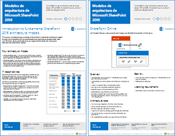
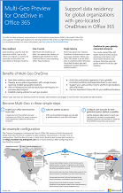
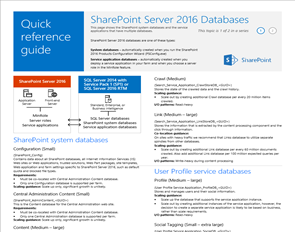
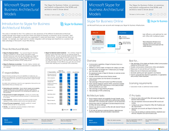
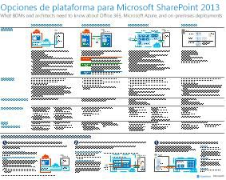
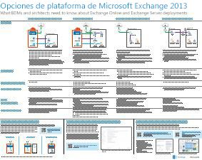
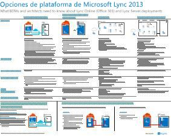
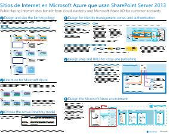
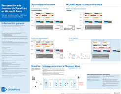

# Modelos de arquitectura para SharePoint, Exchange, Skype Empresarial y Lync

 **Resumen:** Obtener los pósteres de TI que describen los modelos arquitectónicos, implementación y opciones de plataforma para SharePoint, Exchange, Skype para empresas y Lync.
  
En estos pósteres de TI, se describen los modelos de arquitectura y las opciones de implementación de SharePoint, Exchange, Skype Empresarial y Lync y se proporciona información de diseño para implementar SharePoint en Microsoft Azure.
  
Con Office 365, puede proporcionar los servicios de colaboración y comunicación que los usuarios están familiarizados con como un servicio basado en cloud. Con unas pocas excepciones, la experiencia del usuario sigue siendo el mismo si está manteniendo una implementación local o mediante Office 365. Esta experiencia de usuario unificada que simplifica menor decidir dónde colocar cada carga de trabajo y plantea preguntas como:
  
- ¿Cómo se determina qué opción de plataforma elegir para las cargas de trabajo individuales?
    
- ¿Tiene sentido conservar los servicios locales?
    
- ¿Qué es un escenario donde resulta adecuada una implementación híbrida?
    
- ¿Cómo encaja Microsoft Azure en la imagen?
    
- ¿Cuáles son las configuraciones admitidas para las cargas de trabajo de Office Server en Azure?
    
> [!TIP]
> La mayoría de los pósteres de esta página están disponibles en varios idiomas, incluidos chino, inglés, francés, alemán, italiano, japonés, coreano, portugués, ruso y español. Para descargar un póster en uno de estos idiomas, haga clic en el vínculo **Más idiomas** del póster en cuestión.
  
Queremos conocer su opinión. Envíenos un correo electrónico a [cloudadopt@microsoft.com](mailto:cloudadopt@microsoft.com). 
  
Esta página vincula a los pósteres siguientes:
  
- **Pósteres de modelos de arquitectura** Puede utilizar estos recursos para determinar la configuración de SharePoint 2016 y Skype para negocios 2015 y plataforma ideal.
    
  - [Modelos arquitectónicos de 2016 de Microsoft SharePoint](architectural-models-for-sharepoint-exchange-skype-for-business-and-lync.md#SP2016_ArchModel)
    
  - [Vista previa de Multi-Geo para OneDrive en Office 365](architectural-models-for-sharepoint-exchange-skype-for-business-and-lync.md#MultiGeoO365ODB)
    
  - [Bases de datos de SharePoint Server de 2016](architectural-models-for-sharepoint-exchange-skype-for-business-and-lync.md#SP2016_Databases)
    
  - [Microsoft Skype para modelos arquitectónicos de negocios 2015](architectural-models-for-sharepoint-exchange-skype-for-business-and-lync.md#SfB2015_ArchModel)
    
- **Carteles de opciones de plataforma** Puede utilizar estos recursos para determinar la plataforma ideal y configuración para Lync 2013, 2013 de Exchange y SharePoint 2013.
    
  - [Opciones de plataforma SharePoint 2013](architectural-models-for-sharepoint-exchange-skype-for-business-and-lync.md#SP2013_Options)
    
  - [Opciones de plataformas de intercambio de 2013](architectural-models-for-sharepoint-exchange-skype-for-business-and-lync.md#Exch2013_options)
    
  - [Opciones de plataformas de 2013 de Lync](architectural-models-for-sharepoint-exchange-skype-for-business-and-lync.md#Lync2013_Options)
    
- **SharePoint Server 2013 en carteles de soluciones de Azure** Puede utilizar estos pósteres de TI para determinar el diseño y la configuración de las cargas de trabajo de SharePoint Server 2013 en servicios de infraestructura de Azure.
    
  - [Sitios de Internet de Microsoft Azure mediante SharePoint Server 2013](architectural-models-for-sharepoint-exchange-skype-for-business-and-lync.md#Azure_sharepoint2013)
    
  - [Ejemplo de diseño: sitios de Internet de Microsoft Azure para SharePoint 2013](architectural-models-for-sharepoint-exchange-skype-for-business-and-lync.md#DesignSampleInternetSites)
    
  - [Recuperación ante desastres de SharePoint para Microsoft Azure](architectural-models-for-sharepoint-exchange-skype-for-business-and-lync.md#sharepoint_recovery_Azure)
    
## Pósteres de modelos de arquitectura

En estos nuevos pósteres de TI de SharePoint 2016 y Skype Empresarial 2015, se proporciona una forma de comparar los distintos métodos de implementación en un formato fácil de imprimir. En cada póster, se proporciona una lista de todas las configuraciones u opciones de plataforma disponibles y le ofrece la siguiente información para cada opción:
  
- **Información general** Un breve resumen de la plataforma, incluyendo un diagrama conceptual.
    
- **Mejor para** Escenarios comunes que son ideales para una plataforma concreta.
    
- **Requisitos de licencia** Las licencias que necesita para la implementación.
    
- **Tareas de arquitectura** Las decisiones que debe tomar un arquitecto.
    
- **Tareas de IT Pro o responsabilidades** Las responsabilidades diarias que su personal de TI tiene que planear.
    
### Modelos de arquitectura de Microsoft SharePoint 2016

|**Elemento**|**Descripción**|
|:-----|:-----|
|[          ](https://www.microsoft.com/download/details.aspx?id=52650)   [PDF](https://download.microsoft.com/download/4/F/A/4FA0F94B-EE2F-41DB-A047-D9864FEF41E9/SharePoint2016ArchitecturalModels.pdf)  \| [Visio](https://download.microsoft.com/download/4/F/A/4FA0F94B-EE2F-41DB-A047-D9864FEF41E9/SharePoint2016ArchitecturalModels.vsdx)  \| [Más idiomas](https://www.microsoft.com/download/details.aspx?id=52650)   | En este póster de TI, se describen las configuraciones locales de SharePoint Online, Microsoft Azure y SharePoint que los responsables de la toma de decisiones empresariales y los arquitectos de soluciones necesitan conocer.    - **SharePoint Online (SaaS)** - SharePoint consumir a través de un Software como un modelo de suscripción de servicio (SaaS).   - **Híbrido de SharePoint** - mover los sitios de SharePoint y aplicaciones a la nube a su propio ritmo.   - **SharePoint en Azure (IaaS)** : ampliar el entorno local en Microsoft Azure y distribuir servidores de 2016 de SharePoint no existe. (Se recomienda para entornos de alta disponibilidad y recuperación ante desastres y prueba/desarrollo).  - **SharePoint local** - planificar, implementar, mantener y personalizar el entorno de SharePoint en un centro de datos que se conservan.   |
   
### Vista previa de Multi-Geo para OneDrive en Office 365

|**Elemento**|**Descripción**|
|:-----|:-----|
|[          ](http://download.microsoft.com/download/0/5/9/0594634F-7893-4201-938A-C2FF2F21B655/Multi-Geo-ODB.pdf)   [PDF](http://download.microsoft.com/download/0/5/9/0594634F-7893-4201-938A-C2FF2F21B655/Multi-Geo-ODB.pdf)  \| [Visio](http://download.microsoft.com/download/0/5/9/0594634F-7893-4201-938A-C2FF2F21B655/Multi-Geo-ODB.vsdx)   | Este póster es un resumen de una página de OneDrive Multi-Geo en Office 365, que se encuentra actualmente en la vista previa. Este modelo incluye:   -Beneficios   -Pasos para la implementación   -Un ejemplo de configuración     Para obtener más información acerca de la vista previa de Multi-Geo para OneDrive en Office 365, haga clic en [aquí](https://aka.ms/onedrivemultigeo).    |
   
### Bases de datos de SharePoint Server 2016

|**Elemento**|**Descripción**|
|:-----|:-----|
|[          ](https://www.microsoft.com/download/details.aspx?id=55041)   [PDF](https://download.microsoft.com/download/D/5/D/D5DC1121-8BC5-4953-834F-1B5BB03EB691/DBrefguideSPS2016_tabloid.pdf)  \| [Visio](https://download.microsoft.com/download/D/5/D/D5DC1121-8BC5-4953-834F-1B5BB03EB691/DBrefguideSPS2016_tabloid.vsdx)  \| [Más idiomas](https://www.microsoft.com/download/details.aspx?id=55041)   | Este póster de TI es una guía de referencia rápida para bases de datos de SharePoint Server 2016. Cada base de datos tiene los detalles siguientes:   -Tamaño   -Guía de escalamiento   : Patrones de I/O   -Requisitos     La primera página contiene las bases de datos del sistema de SharePoint y las aplicaciones de servicio que tienen varias bases de datos. La segunda página muestra todas las aplicaciones de servicio que tienen bases de datos.    Para obtener más información acerca de las bases de datos de SharePoint Server 2016, vea [tipos de base de datos y descripciones en SharePoint Server 2016](https://technet.microsoft.com/en-us/library/cc678868%28v=office.16%29.aspx)   |
   
### Modelos de arquitectura de Microsoft Skype Empresarial 2015

|**Elemento**|**Descripción**|
|:-----|:-----|
|[          ](https://www.microsoft.com/download/details.aspx?id=55022)   [PDF](https://download.microsoft.com/download/7/7/4/7741262C-A60D-41F7-863B-99BF5964FBFE/Skype%20for%20Business%20Architectural%20Models.pdf)  \| [Visio](https://download.microsoft.com/download/7/7/4/7741262C-A60D-41F7-863B-99BF5964FBFE/Skype%20for%20Business%20Architectural%20Models.vsd)  \| [Más idiomas](https://www.microsoft.com/download/details.aspx?id=55022)   |Este póster describe el Skype para los negocios en línea, locales, híbrido, nube PBX y la integración con Exchange y SharePoint configuraciones que los empresarios y arquitectos de soluciones necesitan conocer.    Está destinado a la audiencia de profesionales de TI a incrementar la sensibilización de los diferentes modelos de arquitectura fundamentales a través del cual pueden consumirse Skype para los negocios en línea y Skype para empresas en instalaciones.   Comience con cualquier configuración que mejor se adapte a las necesidades de su organización y los planes futuros. Considere y utilice otros según sea necesario. Por ejemplo, que desea tener en cuenta la integración con Exchange y SharePoint o una solución que aprovecha las ventajas de la oferta de PBX de nube de Microsoft.    |
   
## Pósteres de opciones de plataforma

En estos pósteres de TI de SharePoint 2013, Exchange 2013 y Lync 2013, se proporciona una forma de comparar los distintos métodos de implementación en un solo vistazo en un formato de póster grande. En cada póster, se proporciona una lista de todas las configuraciones u opciones de plataforma disponibles y le ofrece la siguiente información para cada opción:
  
- **Información general** Un breve resumen de la plataforma, incluyendo un diagrama conceptual.
    
- **Mejor para** Escenarios comunes que son ideales para una plataforma concreta.
    
- **Requisitos de licencia** Las licencias que necesita para la implementación.
    
- **Tareas de arquitectura** Las decisiones que debe tomar un arquitecto.
    
- **Tareas de IT Pro o responsabilidades** Las responsabilidades diarias que su personal de TI tiene que planear.
    
## Opciones de plataforma para SharePoint 2013

****

|**Elemento**|**Descripción**|
|:-----|:-----|
|[          ](https://www.microsoft.com/download/details.aspx?id=40332)   [PDF](http://go.microsoft.com/fwlink/p/?LinkId=324594)  \| [Visio](https://go.microsoft.com/fwlink/p/?LinkId=324593)  \| [Más idiomas](https://www.microsoft.com/download/details.aspx?id=40332)   |Para tomar decisiones empresariales (BDMs) y arquitectos, este modelo muestra las opciones de plataforma para 2013 de SharePoint, SharePoint en Office 365, híbrido local con implementaciones sólo local, Azure y Office 365. Incluye una visión general de cada arquitectura, recomendaciones, requisitos de licencia y listas de tareas de IT Pro para cada plataforma y arquitecto. Se resaltan varias soluciones de SharePoint en Azure.  Para una versión de texto accesible de este póster, consulte el [diagrama accesible - opciones de plataformas de Microsoft SharePoint de 2013](accessible-diagrammicrosoft-sharepoint-2013-platform-options.md).    |
   
## Opciones de plataforma para Exchange 2013

****

|**Elemento**|**Descripción**|
|:-----|:-----|
|[          ](https://www.microsoft.com/download/details.aspx?id=42676)   [PDF](https://go.microsoft.com/fwlink/p/?LinkID=398740)  \| [Visio](https://go.microsoft.com/fwlink/p/?LinkID=398742)  \| [Más idiomas](https://www.microsoft.com/download/details.aspx?id=42676)   |Para los arquitectos y los BDMs, este modelo describe las opciones de plataforma disponible para Exchange de 2013. Los clientes pueden elegir entre Exchange Online con Office 365, híbrido de Exchange, Exchange Server local y Exchange alojado. El póster incluye detalles acerca de cada opción de arquitectura, incluyendo los escenarios más adecuados para cada uno, los requisitos de licencia y responsabilidades IT Pro.  Para una versión de texto accesible de este póster, consulte el [diagrama accesible - opciones de plataformas de Microsoft Exchange de 2013](accessible-diagrammicrosoft-exchange-2013-platform-options.md).    |
   
## Opciones de plataforma para Lync 2013

****

|**Elemento**|**Descripción**|
|:-----|:-----|
|[          ](https://www.microsoft.com/download/details.aspx?id=41677)   [PDF](https://go.microsoft.com/fwlink/p/?LinkID=391837)  \| [Visio](https://go.microsoft.com/fwlink/p/?LinkID=391839)  \| [Más idiomas](https://www.microsoft.com/download/details.aspx?id=41677)   |Para los arquitectos y los responsables de la toma de decisiones, en este modelo, se describen las opciones de plataforma que hay disponibles para Lync 2013. Los clientes pueden elegir entre Lync Online con Office 365, Lync híbrido, Lync Server local y Lync hospedado. El póster de TI incluye información detallada para cada opción de arquitectura, incluidos los escenarios más adecuados para cada una de ellas, los requisitos de licencia y las responsabilidades de los profesionales de TI.    |
   
## Pósteres de soluciones de SharePoint en Azure

Estos pósteres de TI mostrar soluciones basadas en Azure mediante SharePoint Server 2013 en un formato de cartel grande.
  
### Sitios de Internet en Microsoft Azure con SharePoint Server 2013

****

|**Elemento**|**Descripción**|
|:-----|:-----|
|[          ](https://www.microsoft.com/download/details.aspx?id=41992)   [PDF](https://go.microsoft.com/fwlink/p/?LinkId=392552)  \| [Visio](https://go.microsoft.com/fwlink/p/?LinkId=392551)  \| [Más idiomas](https://www.microsoft.com/download/details.aspx?id=41992)   |Este póster describe las actividades clave en el diseño y recomienda alternativas de arquitectura para sitios de Internet en Azure. Para una versión de texto accesible de este póster, consulte el [diagrama accesible - sitios de Internet de Microsoft Azure para 2013 de SharePoint](accessible-diagraminternet-sites-in-microsoft-azure-for-sharepoint-2013.md).   Para obtener más información, vea los siguientes artículos:     - [Sitios de Internet de Microsoft Azure mediante SharePoint Server 2013](internet-sites-in-microsoft-azure-using-sharepoint-server-2013.md)   - [Arquitecturas de Microsoft Azure para SharePoint 2013](microsoft-azure-architectures-for-sharepoint-2013.md)   |
   
### Ejemplo de diseño: Sitios de Internet en Microsoft Azure para SharePoint 2013

****

|**Elemento**|**Descripción**|
|:-----|:-----|
|[          ](https://www.microsoft.com/download/details.aspx?id=41991)   [PDF](https://go.microsoft.com/fwlink/p/?LinkId=392549)  \| [Visio](https://go.microsoft.com/fwlink/p/?LinkId=392548)  \| [Más idiomas](https://www.microsoft.com/download/details.aspx?id=41991)   |Para utilizar este ejemplo de diseño como punto de partida para su propio sitio de arquitectura orientada a Internet en Azure mediante SharePoint Server 2013. Para una versión de texto accesible de este póster, consulte [accesible diagrama - ejemplo de diseño: sitios de Internet de Microsoft Azure para SharePoint 2013](accessible-diagramdesign-sample-internet-sites-in-microsoft-azure-for-sharepoint.md).   Para obtener más información, vea los siguientes artículos:     - [Sitios de Internet de Microsoft Azure mediante SharePoint Server 2013](internet-sites-in-microsoft-azure-using-sharepoint-server-2013.md)   - [Arquitecturas de Microsoft Azure para SharePoint 2013](microsoft-azure-architectures-for-sharepoint-2013.md)   |
   
### Recuperación ante desastres de SharePoint en Microsoft Azure

****

|**Elemento**|**Descripción**|
|:-----|:-----|
|[          ](https://www.microsoft.com/download/details.aspx?id=41993)   [PDF](https://go.microsoft.com/fwlink/p/?LinkId=392555)  \| [Visio](https://go.microsoft.com/fwlink/p/?LinkId=392554)  \| [Más idiomas](https://www.microsoft.com/download/details.aspx?id=41993)   |Este póster de TI ilustra los principios de la arquitectura de un entorno de recuperación ante desastres en Azure. Para una versión de texto accesible de este póster, consulte el [diagrama accesible - recuperación ante desastres de SharePoint para Microsoft Azure](accessible-diagramsharepoint-disaster-recovery-to-microsoft-azure.md).   Para obtener más información, vea los siguientes artículos:     - [Recuperación de desastres de 2013 de SharePoint Server en Microsoft Azure](sharepoint-server-2013-disaster-recovery-in-microsoft-azure.md)   - [Arquitecturas de Microsoft Azure para SharePoint 2013](microsoft-azure-architectures-for-sharepoint-2013.md)   |
   
## Concepts

[Adopción de la nube y soluciones híbridas](cloud-adoption-and-hybrid-solutions.md)
  
[Recursos de arquitectura de TI de la nube de Microsoft](microsoft-cloud-it-architecture-resources.md)
  
[Guías de entorno de pruebas de adopción de la nube (TLG)](cloud-adoption-test-lab-guides-tlgs.md)
  
[Soluciones híbridas](hybrid-solutions.md)

