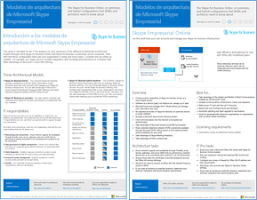
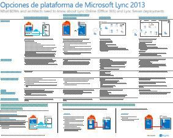

# Modelos de arquitectura para SharePoint, Exchange, Skype Empresarial y LyncArchitectural models for SharePoint, Exchange, Skype for Business, and Lync

 \*\*Resumen: \*\* Obtenga los pósteres de TI que describen los modelos de arquitectura, la implementación y las opciones de plataforma de SharePoint, Exchange, Skype Empresarial y Lync.**Summary:** Get the IT posters that describe the architectural models, deployment, and platform options for SharePoint, Exchange, Skype for Business, and Lync.
  
En estos pósteres de TI, se describen los modelos de arquitectura y las opciones de implementación de SharePoint, Exchange, Skype Empresarial y Lync y se proporciona información de diseño para implementar SharePoint en Microsoft Azure.These IT posters describe the architectural models and deployment options for SharePoint, Exchange, Skype for Business, and Lync, and they provide design information for deploying SharePoint in Microsoft Azure.
  
Con Office 365 puede proporcionar los servicios de colaboración y comunicación con los que los usuarios están familiarizados en forma de servicio basado en la nube. Exceptuando algunos detalles, la experiencia del usuario sigue siendo la misma, tanto si mantiene una implementación local como si usa Office 365. Esta experiencia de usuario unificada hace que sea menos sencillo decidir dónde colocar cada carga de trabajo y plantea preguntas como estas:With Office 365, you can provide the collaboration and communication services your users are familiar with as a cloud-based service. With a few exceptions, the user experience remains the same whether you are maintaining an on-premises deployment or using Office 365. This unified user experience makes it less straightforward to decide where to place each workload and raises questions such as:
  
- ¿Cómo se determina qué opción de plataforma elegir para las cargas de trabajo individuales?How do you determine which platform option to choose for your individual workloads?
    
- ¿Tiene sentido conservar los servicios locales?Does it make sense to keep any service on-premises?
    
- ¿En qué escenario resulta adecuada una implementación híbrida?What is a scenario where a hybrid deployment is appropriate?
    
- ¿Cómo encaja Microsoft Azure en este contexto?How does Microsoft Azure fit in the picture?
    
- ¿Cuáles son las configuraciones compatibles para las cargas de trabajo de Office Server en Azure?What are the supported configurations for Office Server workloads in Azure?
    
> [!TIP]
> La mayoría de los pósteres de esta página están disponibles en varios idiomas, incluidos chino, inglés, francés, alemán, italiano, japonés, coreano, portugués, ruso y español. Para descargar un póster en uno de estos idiomas, haga clic en el vínculo **Más idiomas** del póster en cuestión.Most of the posters on this page are available in multiple languages, including Chinese, English, French, German, Italian, Japanese, Korean, Portuguese, Russian, and Spanish. To download a poster in one of these languages, click the **More languages** link for that poster.
  
Queremos conocer su opinión. Envíenos un correo electrónico a [cloudadopt@microsoft.com](mailto:cloudadopt@microsoft.com).Let us know what you think! Send us email at [cloudadopt@microsoft.com](mailto:cloudadopt@microsoft.com). 
  
Esta página vincula a los pósteres siguientes:This page links you to the following posters:
  
- **Pósteres de modelos de arquitectura** Puede usar estos recursos para determinar la plataforma y configuración ideales para SharePoint 2016 y Skype Empresarial 2015.**Architectural models posters** You can use these resources to determine your ideal platform and configuration for SharePoint 2016 and Skype for Business 2015.
    
  - [Modelos de arquitectura de Microsoft SharePoint 2016Microsoft SharePoint 2016 Architectural Models](architectural-models-for-sharepoint-exchange-skype-for-business-and-lync.md#SP2016_ArchModel)
    
  - [Funciones multigeográficas de OneDrive y SharePoint Online en Office 365Multi-Geo Capabilities in OneDrive and SharePoint Online in Office 365](architectural-models-for-sharepoint-exchange-skype-for-business-and-lync.md#MultiGeoO365ODB)
    
  - [Bases de datos de SharePoint Server 2016SharePoint Server 2016 Databases](architectural-models-for-sharepoint-exchange-skype-for-business-and-lync.md#SP2016_Databases)
    
  - [Modelos de arquitectura de Microsoft Skype Empresarial 2015Microsoft Skype for Business 2015 Architectural Models](architectural-models-for-sharepoint-exchange-skype-for-business-and-lync.md#SfB2015_ArchModel)
    
- **Pósteres de opciones de plataforma** Puede usar estos recursos para determinar la plataforma y configuración ideales para SharePoint 2013, Exchange 2013 y Lync 2013.**Platform options posters** You can use these resources to determine your ideal platform and configuration for SharePoint 2013, Exchange 2013, and Lync 2013.
    
  - [Opciones de plataforma para SharePoint 2013SharePoint 2013 Platform Options](architectural-models-for-sharepoint-exchange-skype-for-business-and-lync.md#SP2013_Options)
    
  - [Opciones de plataforma para Exchange 2013Exchange 2013 Platform Options](architectural-models-for-sharepoint-exchange-skype-for-business-and-lync.md#Exch2013_options)
    
  - [Opciones de plataforma para Lync 2013Lync 2013 Platform Options](architectural-models-for-sharepoint-exchange-skype-for-business-and-lync.md#Lync2013_Options)
    
- **Pósteres de soluciones de SharePoint Server 2013 en Azure** Puede usar estos pósteres de TI para determinar el diseño y la configuración de las cargas de trabajo de SharePoint Server 2013 en los servicios de infraestructura de Azure.**SharePoint Server 2013 in Azure solutions posters** You can use these IT posters to determine the design and configuration for SharePoint Server 2013 workloads in Azure infrastructure services.
    
  - [Sitios de Internet en Microsoft Azure con SharePoint Server 2013Internet sites in Microsoft Azure using SharePoint Server 2013](architectural-models-for-sharepoint-exchange-skype-for-business-and-lync.md#Azure_sharepoint2013)
    
  - [Ejemplo de diseño: Sitios de Internet en Microsoft Azure para SharePoint 2013Design sample: Internet sites in Microsoft Azure for SharePoint 2013](architectural-models-for-sharepoint-exchange-skype-for-business-and-lync.md#DesignSampleInternetSites)
    
  - [Recuperación ante desastres de SharePoint en Microsoft AzureSharePoint Disaster Recovery to Microsoft Azure](architectural-models-for-sharepoint-exchange-skype-for-business-and-lync.md#sharepoint_recovery_Azure)
    
## Pósteres de modelos de arquitecturaArchitectural models posters

En estos nuevos pósteres de TI de SharePoint 2016 y Skype Empresarial 2015, se proporciona una forma de comparar los distintos métodos de implementación en un formato fácil de imprimir. En cada póster, se proporciona una lista de todas las configuraciones u opciones de plataforma disponibles y se le ofrece la siguiente información para cada opción:These new IT posters for SharePoint 2016 and Skype for Business 2015 provide a way to compare the various deployment methods in an easy-to-print format. Each poster provides a list of all the configurations or platform options available and gives you the following information for each option:
  
- **Introducción** Un breve resumen de la plataforma que incluye un diagrama conceptual.**Overview** A brief summary of the platform, including a conceptual diagram.
    
- **Ideal para** Escenarios comunes idóneos para la plataforma en particular.**Best for** Common scenarios that are ideally suited for the particular platform.
    
- **Requisitos de licencia** Licencias necesarias para realizar la implementación.**License requirements** The licenses you need for deployment.
    
- **Tareas de arquitectura** Decisiones que debe tomar como arquitecto.**Architecture tasks** The decisions you need to make as an architect.
    
- **Tareas o responsabilidades de profesionales de TI** Responsabilidades diarias que el personal de TI necesita planear.**IT Pro tasks or responsibilities** The daily responsibilities that your IT staff needs to plan for.
    

### Modelos de arquitectura de Microsoft SharePoint 2016Microsoft SharePoint 2016 Architectural Models

|**Elemento****Item**|**Descripción****Description**|
|:-----|:-----|
|[          ](https://www.microsoft.com/download/details.aspx?id=52650)   [PDF](https://download.microsoft.com/download/4/F/A/4FA0F94B-EE2F-41DB-A047-D9864FEF41E9/SharePoint2016ArchitecturalModels.pdf)  \| [Visio](https://download.microsoft.com/download/4/F/A/4FA0F94B-EE2F-41DB-A047-D9864FEF41E9/SharePoint2016ArchitecturalModels.vsdx)  \| [Más idiomas](https://www.microsoft.com/download/details.aspx?id=52650)[PDF](https://download.microsoft.com/download/4/F/A/4FA0F94B-EE2F-41DB-A047-D9864FEF41E9/SharePoint2016ArchitecturalModels.pdf)  \| [Visio](https://download.microsoft.com/download/4/F/A/4FA0F94B-EE2F-41DB-A047-D9864FEF41E9/SharePoint2016ArchitecturalModels.vsdx)  \| [More languages](https://www.microsoft.com/download/details.aspx?id=52650)   | En este póster de TI, se describen las configuraciones locales de SharePoint Online, Microsoft Azure y SharePoint que los responsables de la toma de decisiones empresariales y los arquitectos de soluciones necesitan conocer.This IT poster describes the SharePoint Online, Microsoft Azure, and SharePoint on-premises configurations that business decision makers and solutions architects need to know about.    - **SharePoint Online (SaaS)**: consuma SharePoint a través de un modelo de suscripción de software como servicio (SaaS).- **SharePoint Online (SaaS)** - Consume SharePoint through a Software as a Service (SaaS) subscription model.   - **Entorno híbrido de SharePoint**: mueva los sitios y las aplicaciones de SharePoint a la nube a su propio ritmo.- **SharePoint Hybrid** - Move your SharePoint sites and apps to the cloud at your own pace.   - **SharePoint en Azure (IaaS)**: amplíe el entorno local a Microsoft Azure e implemente ahí servidores de SharePoint 2016. (Se recomienda para entornos de alta disponibilidad o recuperación ante desastres y entornos de pruebas o desarrollo).- **SharePoint in Azure (IaaS)** - You extend your on-premises environment into Microsoft Azure and deploy SharePoint 2016 Servers there. (This is recommended for High Availability/Disaster Recovery and dev/test environments.)   - **SharePoint local**: planee, implemente, mantenga y personalice el entorno de SharePoint en un centro de datos mantenido por usted.- **SharePoint On-premises** - You plan, deploy, maintain and customize your SharePoint environment in a datacenter that you maintain.   |
   

### Capacidades multigeográficas de OneDrive y SharePoint Online en Office 365Multi-Geo Capabilities in OneDrive and SharePoint Online in Office 365

|**Elemento****Item**|**Descripción****Description**|
|:-----|:-----|
|[          ](https://github.com/MicrosoftDocs/OfficeDocs-Enterprise/raw/live/Enterprise/media/Multi-Geo-ODB.pdf)[          ](https://github.com/MicrosoftDocs/OfficeDocs-Enterprise/raw/live/Enterprise/media/Multi-Geo-ODB.pdf)   [PDF](https://github.com/MicrosoftDocs/OfficeDocs-Enterprise/raw/live/Enterprise/media/Multi-Geo-ODB.pdf)  \| [Visio](https://github.com/MicrosoftDocs/OfficeDocs-Enterprise/raw/live/Enterprise/media/Multi-Geo-ODB.vsdx)[PDF](https://github.com/MicrosoftDocs/OfficeDocs-Enterprise/raw/live/Enterprise/media/Multi-Geo-ODB.pdf)  \| [Visio](https://github.com/MicrosoftDocs/OfficeDocs-Enterprise/raw/live/Enterprise/media/Multi-Geo-ODB.vsdx)   | Este póster es un resumen de una página de las funciones multigeográficas de OneDrive y SharePoint Online en Office 365. Este modelo incluye: This poster is a one-page overview of Multi-Geo Capabilities in OneDrive and SharePoint Online in Office 365. This model includes:    - Ventajas- Benefits   - Pasos para la implementación- Steps for deployment   - Una configuración de ejemplo- An example configuration     Para obtener más información sobre las funciones multigeográficas de OneDrive y SharePoint Online en Office 365, haga clic [aquí](https://aka.ms/onedrivemultigeo).For more information about Multi-Geo Capabilities in OneDrive and SharePoint Online in Office 365, click [here](https://aka.ms/onedrivemultigeo).    |
   

### Bases de datos de SharePoint Server 2016SharePoint Server 2016 Databases

|**Elemento****Item**|**Descripción****Description**|
|:-----|:-----|
|[          ](https://www.microsoft.com/download/details.aspx?id=55041)[          ](https://www.microsoft.com/download/details.aspx?id=55041)   [PDF](https://download.microsoft.com/download/D/5/D/D5DC1121-8BC5-4953-834F-1B5BB03EB691/DBrefguideSPS2016_tabloid.pdf)  \| [Visio](https://download.microsoft.com/download/D/5/D/D5DC1121-8BC5-4953-834F-1B5BB03EB691/DBrefguideSPS2016_tabloid.vsdx)  \| [Más idiomas](https://www.microsoft.com/download/details.aspx?id=55041)[PDF](https://download.microsoft.com/download/D/5/D/D5DC1121-8BC5-4953-834F-1B5BB03EB691/DBrefguideSPS2016_tabloid.pdf)  \| [Visio](https://download.microsoft.com/download/D/5/D/D5DC1121-8BC5-4953-834F-1B5BB03EB691/DBrefguideSPS2016_tabloid.vsdx)  \| [More languages](https://www.microsoft.com/download/details.aspx?id=55041)   | Este póster de TI es una guía de referencia rápida para bases de datos de SharePoint Server 2016. Cada base de datos tiene los detalles siguientes: This IT poster is a quick reference guide for SharePoint Server 2016 databases. Each database has the following details:    - Tamaño- Size   - Instrucciones de escalado- Scaling guidance   - Patrones de E/S- I/O patterns   - Requisitos- Requirements     La primera página contiene las bases de datos del sistema de SharePoint y las aplicaciones de servicio con múltiples bases de datos. La segunda página muestra todas las aplicaciones de servicio con bases de datos únicas. The first page has the SharePoint system databases and the service applications that have multiple databases. The second page shows all of the service applications that have single databases.     Para obtener más información sobre las bases de datos de SharePoint Server 2016, consulte [Tipos y descripciones de bases de datos en SharePoint Server 2016](https://docs.microsoft.com/SharePoint/technical-reference/database-types-and-descriptions)For more information about the SharePoint Server 2016 databases, see [Database types and descriptions in SharePoint Server 2016](https://docs.microsoft.com/SharePoint/technical-reference/database-types-and-descriptions)   |
   

### Modelos de arquitectura de Microsoft Skype Empresarial 2015Microsoft Skype for Business 2015 Architectural Models

|**Elemento****Item**|**Descripción****Description**|
|:-----|:-----|
|[          ](https://www.microsoft.com/download/details.aspx?id=55022)[          ](https://www.microsoft.com/download/details.aspx?id=55022)   [PDF](https://download.microsoft.com/download/7/7/4/7741262C-A60D-41F7-863B-99BF5964FBFE/Skype%20for%20Business%20Architectural%20Models.pdf)  \| [Visio](https://download.microsoft.com/download/7/7/4/7741262C-A60D-41F7-863B-99BF5964FBFE/Skype%20for%20Business%20Architectural%20Models.vsd)  \| [Más idiomas](https://www.microsoft.com/download/details.aspx?id=55022)[PDF](https://download.microsoft.com/download/7/7/4/7741262C-A60D-41F7-863B-99BF5964FBFE/Skype%20for%20Business%20Architectural%20Models.pdf)  \| [Visio](https://download.microsoft.com/download/7/7/4/7741262C-A60D-41F7-863B-99BF5964FBFE/Skype%20for%20Business%20Architectural%20Models.vsd)  \| [More languages](https://www.microsoft.com/download/details.aspx?id=55022)   |Este póster describe las configuraciones de Skype Empresarial Online, local, híbrido, PBX en la nube y de integración con Exchange y SharePoint que los responsables de la toma de decisiones empresariales y los arquitectos de soluciones necesitan conocer.This poster describes the Skype for Business Online, on-premises, hybrid, cloud PBX, and integration with Exchange and SharePoint configurations that business decision makers and solutions architects need to know about.    Está destinado a los profesionales de TI y pretende dar a conocer los distintos modelos de arquitectura básicos para el consumo de Skype Empresarial Online y Skype Empresarial local.It is intended for the IT Pro audience to raise awareness of the different fundamental architectural models through which Skype for Business Online and Skype for Business on premises can be consumed.   Comience con la configuración que mejor se adapte a las necesidades y los planes de futuro de su organización. Plantéese usar otros cuando lo necesite. Por ejemplo, es recomendable tener en cuenta la integración con Exchange y SharePoint o una solución que aproveche la oferta de PBX en la nube de Microsoft.Start with whichever configuration best suits your organization's needs and future plans. Consider and use others as needed. For example, you might want to consider integration with Exchange and SharePoint or a solution that takes advantage of Microsoft's Cloud PBX offering.    |
   
## Pósteres de opciones de plataformaPlatform options posters

En estos pósteres de TI de SharePoint 2013, Exchange 2013 y Lync 2013, se proporciona una forma de comparar los distintos métodos de implementación en un solo vistazo en un formato de póster grande. En cada póster, se proporciona una lista de todas las configuraciones u opciones de plataforma disponibles y le ofrece la siguiente información para cada opción:These IT posters for SharePoint 2013, Exchange 2013, and Lync 2013 provide a way to compare the various deployment methods at a single glance in a large poster format. Each poster provides a list of all the configurations or platform options available and gives you the following information for each option:
  
- **Introducción** Un breve resumen de la plataforma que incluye un diagrama conceptual.**Overview** A brief summary of the platform, including a conceptual diagram.
    
- **Ideal para** Escenarios comunes idóneos para la plataforma en particular.**Best for** Common scenarios that are ideally suited for the particular platform.
    
- **Requisitos de licencia** Licencias necesarias para realizar la implementación.**License requirements** The licenses you need for deployment.
    
- **Tareas de arquitectura** Decisiones que debe tomar como arquitecto.**Architecture tasks** The decisions you need to make as an architect.
    
- **Tareas o responsabilidades de profesionales de TI** Responsabilidades diarias que el personal de TI necesita planear.**IT Pro tasks or responsibilities** The daily responsibilities that your IT staff needs to plan for.
    

## Opciones de plataforma para SharePoint 2013SharePoint 2013 Platform Options

****

|**Elemento****Item**|**Descripción****Description**|
|:-----|:-----|
|[          ](https://www.microsoft.com/download/details.aspx?id=40332)[          ](https://www.microsoft.com/download/details.aspx?id=40332)   [PDF](https://go.microsoft.com/fwlink/p/?LinkId=324594)  \| [Visio](https://go.microsoft.com/fwlink/p/?LinkId=324593)  \| [Más idiomas](https://www.microsoft.com/download/details.aspx?id=40332)[PDF](https://go.microsoft.com/fwlink/p/?LinkId=324594)  \| [Visio](https://go.microsoft.com/fwlink/p/?LinkId=324593)  \| [More languages](https://www.microsoft.com/download/details.aspx?id=40332)   |Destinado a arquitectos y a responsables de la toma de decisiones, este modelo muestra las opciones de plataforma de SharePoint 2013, SharePoint en Office 365, implementación híbrida local con Office 365, Azure e implementaciones exclusivamente locales. Incluye información general de cada arquitectura, recomendaciones, requisitos de licencia y listas de tareas de arquitectos y profesionales de TI para cada plataforma. Se destacan algunas soluciones de SharePoint en Azure. For business decision makers (BDMs) and architects, this model shows the platform options for SharePoint 2013, SharePoint in Office 365, on-premises hybrid with Office 365, Azure, and on-premises only deployments. It includes an overview of each architecture, recommendations, license requirements, and lists of architect and IT Pro tasks for each platform. Several SharePoint solutions on Azure are highlighted.   Para obtener una versión de texto accesible de este póster, consulte [Diagrama accesible: opciones de plataforma para Microsoft SharePoint 2013](accessible-diagrammicrosoft-sharepoint-2013-platform-options.md).For an accessible text version of this poster, see [Accessible diagram - Microsoft SharePoint 2013 Platform Options](accessible-diagrammicrosoft-sharepoint-2013-platform-options.md).    |
   

## Opciones de plataforma para Exchange 2013Exchange 2013 Platform Options

****

|**Elemento****Item**|**Descripción****Description**|
|:-----|:-----|
|[          ](https://www.microsoft.com/download/details.aspx?id=42676)[          ](https://www.microsoft.com/download/details.aspx?id=42676)   [PDF](https://go.microsoft.com/fwlink/p/?LinkID=398740)  \| [Visio](https://go.microsoft.com/fwlink/p/?LinkID=398742)  \| [Más idiomas](https://www.microsoft.com/download/details.aspx?id=42676)[PDF](https://go.microsoft.com/fwlink/p/?LinkID=398740)  \| [Visio](https://go.microsoft.com/fwlink/p/?LinkID=398742)  \| [More languages](https://www.microsoft.com/download/details.aspx?id=42676)   |Para los arquitectos y los responsables de la toma de decisiones, este modelo describe las opciones de plataforma que hay disponibles para Exchange 2013. Los clientes pueden elegir entre Exchange Online con Office 365, Exchange híbrido, Exchange Server local y Exchange hospedado. El póster incluye información detallada sobre cada opción de arquitectura, incluidos los escenarios más adecuados para cada una, los requisitos de licencia y las responsabilidades de los profesionales de TI.For BDMs and architects, this model describes the available platform options for Exchange 2013. Customers can choose from Exchange Online with Office 365, Hybrid Exchange, Exchange Server on-premises and Hosted Exchange. The poster includes details of each architectural option, including the most ideal scenarios for each, the license requirements and IT Pro responsibilities.   Para obtener una versión de texto accesible de este póster, consulte [Diagrama accesible: opciones de plataforma para Microsoft Exchange 2013](accessible-diagrammicrosoft-exchange-2013-platform-options.md).For an accessible text version of this poster, see [Accessible diagram - Microsoft Exchange 2013 Platform Options](accessible-diagrammicrosoft-exchange-2013-platform-options.md).    |
   

## Opciones de plataforma para Lync 2013Lync 2013 Platform Options

****

|**Elemento****Item**|**Descripción****Description**|
|:-----|:-----|
|[          ](https://www.microsoft.com/download/details.aspx?id=41677)[          ](https://www.microsoft.com/download/details.aspx?id=41677)   [PDF](https://go.microsoft.com/fwlink/p/?LinkID=391837)  \| [Visio](https://go.microsoft.com/fwlink/p/?LinkID=391839)  \| [Más idiomas](https://www.microsoft.com/download/details.aspx?id=41677)[PDF](https://go.microsoft.com/fwlink/p/?LinkID=391837)  \| [Visio](https://go.microsoft.com/fwlink/p/?LinkID=391839)  \| [More languages](https://www.microsoft.com/download/details.aspx?id=41677)   |Para los arquitectos y los responsables de la toma de decisiones, en este modelo, se describen las opciones de plataforma que hay disponibles para Lync 2013. Los clientes pueden elegir entre Lync Online con Office 365, Lync híbrido, Lync Server local y Lync hospedado. El póster de TI incluye información detallada para cada opción de arquitectura, incluidos los escenarios más adecuados para cada una de ellas, los requisitos de licencia y las responsabilidades de los profesionales de TI.For BDMs and architects, this model describes the available platform options for Lync 2013. Customers can choose from Lync Online with Office 365, Hybrid Lync, Lync Server on-premises and Hosted Lync. The IT poster includes details of each architectural option, including the most ideal scenarios for each, the license requirements and IT Pro responsibilities.    |
   

## Pósteres de soluciones de SharePoint en AzureSharePoint in Azure solutions posters

En estos pósteres de TI se muestran soluciones basadas en Azure con SharePoint Server 2013 en un formato de póster grande.These IT posters show Azure-based solutions using SharePoint Server 2013 in a large poster format.
  

### Sitios de Internet en Microsoft Azure con SharePoint Server 2013Internet sites in Microsoft Azure using SharePoint Server 2013

****

|**Elemento****Item**|**Descripción****Description**|
|:-----|:-----|
|[          ](https://www.microsoft.com/download/details.aspx?id=41992)[          ](https://www.microsoft.com/download/details.aspx?id=41992)   [PDF](https://go.microsoft.com/fwlink/p/?LinkId=392552)  \| [Visio](https://go.microsoft.com/fwlink/p/?LinkId=392551)  \| [Más idiomas](https://www.microsoft.com/download/details.aspx?id=41992)[PDF](https://go.microsoft.com/fwlink/p/?LinkId=392552)  \| [Visio](https://go.microsoft.com/fwlink/p/?LinkId=392551)  \| [More languages](https://www.microsoft.com/download/details.aspx?id=41992)   |En este póster se describen las actividades de diseño esenciales y se recomiendan opciones de arquitectura para sitios de Internet en Azure. Para obtener una versión de texto accesible de este póster, consulte [Diagrama accesible: sitios de Internet en Microsoft Azure para SharePoint 2013](accessible-diagraminternet-sites-in-microsoft-azure-for-sharepoint-2013.md).This poster outlines key design activities and recommended architecture choices for Internet-facing sites in Azure. For an accessible text version of this poster, see [Accessible diagram - Internet sites in Microsoft Azure for SharePoint 2013](accessible-diagraminternet-sites-in-microsoft-azure-for-sharepoint-2013.md).     Para obtener más información, consulte los siguientes artículos:For more information, see the following articles:     - [Sitios de Internet en Microsoft Azure con SharePoint Server 2013](internet-sites-in-microsoft-azure-using-sharepoint-server-2013.md)- [Internet Sites in Microsoft Azure using SharePoint Server 2013](internet-sites-in-microsoft-azure-using-sharepoint-server-2013.md)   - [Arquitecturas de Microsoft Azure para SharePoint 2013](microsoft-azure-architectures-for-sharepoint-2013.md)- [Microsoft Azure Architectures for SharePoint 2013](microsoft-azure-architectures-for-sharepoint-2013.md)   |
   

### Ejemplo de diseño: Sitios de Internet en Microsoft Azure para SharePoint 2013Design sample: Internet sites in Microsoft Azure for SharePoint 2013

****

|**Elemento****Item**|**Descripción****Description**|
|:-----|:-----|
|[          ](https://www.microsoft.com/download/details.aspx?id=41991)[          ](https://www.microsoft.com/download/details.aspx?id=41991)   [PDF](https://go.microsoft.com/fwlink/p/?LinkId=392549)  \| [Visio](https://go.microsoft.com/fwlink/p/?LinkId=392548)  \| [Más idiomas](https://www.microsoft.com/download/details.aspx?id=41991)[PDF](https://go.microsoft.com/fwlink/p/?LinkId=392549)  \| [Visio](https://go.microsoft.com/fwlink/p/?LinkId=392548)  \| [More languages](https://www.microsoft.com/download/details.aspx?id=41991)   |Use este ejemplo de diseño como punto de partida para su propio sitio de arquitectura accesible desde Internet en Azure con SharePoint Server 2013. Para obtener una versión de texto accesible de este póster, consulte [Diagrama accesible - Ejemplo de diseño: sitios de Internet en Microsoft Azure con SharePoint Server 2013](accessible-diagramdesign-sample-internet-sites-in-microsoft-azure-for-sharepoint.md).Use this design sample as a starting point for your own architecture Internet-facing site in Azure using SharePoint Server 2013. For an accessible text version of this poster, see [Accessible diagram - Design sample: Internet sites in Microsoft Azure for SharePoint 2013](accessible-diagramdesign-sample-internet-sites-in-microsoft-azure-for-sharepoint.md).     Para obtener más información, consulte los siguientes artículos:For more information, see the following articles:     - [Sitios de Internet en Microsoft Azure con SharePoint Server 2013](internet-sites-in-microsoft-azure-using-sharepoint-server-2013.md)- [Internet Sites in Microsoft Azure using SharePoint Server 2013](internet-sites-in-microsoft-azure-using-sharepoint-server-2013.md)   - [Arquitecturas de Microsoft Azure para SharePoint 2013](microsoft-azure-architectures-for-sharepoint-2013.md)- [Microsoft Azure Architectures for SharePoint 2013](microsoft-azure-architectures-for-sharepoint-2013.md)   |
   

### Recuperación ante desastres de SharePoint en Microsoft AzureSharePoint Disaster Recovery to Microsoft Azure

****

|**Elemento****Item**|**Descripción****Description**|
|:-----|:-----|
|[          ](https://www.microsoft.com/download/details.aspx?id=41993)[          ](https://www.microsoft.com/download/details.aspx?id=41993)   [PDF](https://go.microsoft.com/fwlink/p/?LinkId=392555)  \| [Visio](https://go.microsoft.com/fwlink/p/?LinkId=392554)  \| [Más idiomas](https://www.microsoft.com/download/details.aspx?id=41993)[PDF](https://go.microsoft.com/fwlink/p/?LinkId=392555)  \| [Visio](https://go.microsoft.com/fwlink/p/?LinkId=392554)  \| [More languages](https://www.microsoft.com/download/details.aspx?id=41993)   |En este póster de TI, se muestran los principios de arquitectura de un entorno de recuperación ante desastres en Azure. Para obtener una versión de texto accesible de este póster, consulte [Diagrama accesible: recuperación ante desastres de SharePoint en Microsoft Azure](accessible-diagramsharepoint-disaster-recovery-to-microsoft-azure.md).  This IT poster shows architecture principles for a disaster recovery environment in Azure. For an accessible text version of this poster, see [Accessible diagram - SharePoint Disaster Recovery to Microsoft Azure](accessible-diagramsharepoint-disaster-recovery-to-microsoft-azure.md).     Para obtener más información, consulte los siguientes artículos:For more information, see the following articles:     - [Recuperación ante desastres de SharePoint Server 2013 en Microsoft Azure](sharepoint-server-2013-disaster-recovery-in-microsoft-azure.md)- [SharePoint Server 2013 Disaster Recovery in Microsoft Azure](sharepoint-server-2013-disaster-recovery-in-microsoft-azure.md)   - [Arquitecturas de Microsoft Azure para SharePoint 2013](microsoft-azure-architectures-for-sharepoint-2013.md)- [Microsoft Azure Architectures for SharePoint 2013](microsoft-azure-architectures-for-sharepoint-2013.md)   |
   

## Vea tambiénSee Also

[Adopción de la nube y soluciones híbridasCloud adoption and hybrid solutions](cloud-adoption-and-hybrid-solutions.md)
  
[Recursos de arquitectura de TI de la nube de MicrosoftMicrosoft Cloud IT architecture resources](microsoft-cloud-it-architecture-resources.md)
  
[Guías de entorno de pruebas de adopción de la nube (TLG)Cloud adoption Test Lab Guides (TLGs)](cloud-adoption-test-lab-guides-tlgs.md)
  
[Soluciones híbridasHybrid solutions](hybrid-solutions.md)

