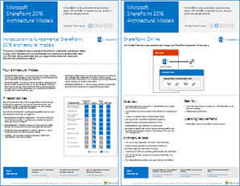
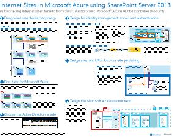

# Modelos de arquitectura para SharePoint, Exchange, Skype Empresarial y LyncArchitectural models for SharePoint, Exchange, Skype for Business, and Lync

 **Resumen:** Obtener los pósteres de TI que describen los modelos arquitectónicos, implementación y opciones de plataforma para SharePoint, Exchange, Skype para empresas y Lync.**Summary:** Get the IT posters that describe the architectural models, deployment, and platform options for SharePoint, Exchange, Skype for Business, and Lync.
  
En estos pósteres de TI, se describen los modelos de arquitectura y las opciones de implementación de SharePoint, Exchange, Skype Empresarial y Lync y se proporciona información de diseño para implementar SharePoint en Microsoft Azure.These IT posters describe the architectural models and deployment options for SharePoint, Exchange, Skype for Business, and Lync, and they provide design information for deploying SharePoint in Microsoft Azure.
  
Con Office 365, puede proporcionar los servicios de colaboración y comunicación que los usuarios están familiarizados con como un servicio basado en cloud. Con unas pocas excepciones, la experiencia del usuario sigue siendo el mismo si está manteniendo una implementación local o mediante Office 365. Esta experiencia de usuario unificada que simplifica menor decidir dónde colocar cada carga de trabajo y plantea preguntas como:With Office 365, you can provide the collaboration and communication services your users are familiar with as a cloud-based service. With a few exceptions, the user experience remains the same whether you are maintaining an on-premises deployment or using Office 365. This unified user experience makes it less straightforward to decide where to place each workload and raises questions such as:
  
- ¿Cómo se determina qué opción de plataforma elegir para las cargas de trabajo individuales?How do you determine which platform option to choose for your individual workloads?
    
- ¿Tiene sentido conservar los servicios locales?Does it make sense to keep any service on-premises?
    
- ¿Qué es un escenario donde resulta adecuada una implementación híbrida?What is a scenario where a hybrid deployment is appropriate?
    
- ¿Cómo encaja Microsoft Azure en la imagen?How does Microsoft Azure fit in the picture?
    
- ¿Cuáles son las configuraciones admitidas para las cargas de trabajo de Office Server en Azure?What are the supported configurations for Office Server workloads in Azure?
    
> [!TIP]
> La mayoría de los pósteres de esta página están disponibles en varios idiomas, incluidos chino, inglés, francés, alemán, italiano, japonés, coreano, portugués, ruso y español. Para descargar un póster en uno de estos idiomas, haga clic en el vínculo **Más idiomas** del póster en cuestión.Most of the posters on this page are available in multiple languages, including Chinese, English, French, German, Italian, Japanese, Korean, Portuguese, Russian, and Spanish. To download a poster in one of these languages, click the **More languages** link for that poster.
  
Queremos conocer su opinión. Envíenos un correo electrónico a [cloudadopt@microsoft.com](mailto:cloudadopt@microsoft.com).Let us know what you think! Send us email at [cloudadopt@microsoft.com](mailto:cloudadopt@microsoft.com). 
  
Esta página vincula a los pósteres siguientes:This page links you to the following posters:
  
- **Pósteres de modelos de arquitectura** Puede utilizar estos recursos para determinar la configuración de SharePoint 2016 y Skype para negocios 2015 y plataforma ideal.**Architectural models posters** You can use these resources to determine your ideal platform and configuration for SharePoint 2016 and Skype for Business 2015.
    
  - [Modelos arquitectónicos de 2016 de Microsoft SharePointMicrosoft SharePoint 2016 Architectural Models](architectural-models-for-sharepoint-exchange-skype-for-business-and-lync.md#SP2016_ArchModel)
    
  - [Vista previa de Multi-Geo para OneDrive en Office 365Multi-Geo Preview for OneDrive in Office 365](architectural-models-for-sharepoint-exchange-skype-for-business-and-lync.md#MultiGeoO365ODB)
    
  - [Bases de datos de SharePoint Server de 2016SharePoint Server 2016 Databases](architectural-models-for-sharepoint-exchange-skype-for-business-and-lync.md#SP2016_Databases)
    
  - [Microsoft Skype para modelos arquitectónicos de negocios 2015Microsoft Skype for Business 2015 Architectural Models](architectural-models-for-sharepoint-exchange-skype-for-business-and-lync.md#SfB2015_ArchModel)
    
- **Carteles de opciones de plataforma** Puede utilizar estos recursos para determinar la plataforma ideal y configuración para Lync 2013, 2013 de Exchange y SharePoint 2013.**Platform options posters** You can use these resources to determine your ideal platform and configuration for SharePoint 2013, Exchange 2013, and Lync 2013.
    
  - [Opciones de plataforma SharePoint 2013SharePoint 2013 Platform Options](architectural-models-for-sharepoint-exchange-skype-for-business-and-lync.md#SP2013_Options)
    
  - [Opciones de plataformas de intercambio de 2013Exchange 2013 Platform Options](architectural-models-for-sharepoint-exchange-skype-for-business-and-lync.md#Exch2013_options)
    
  - [Opciones de plataformas de 2013 de LyncLync 2013 Platform Options](architectural-models-for-sharepoint-exchange-skype-for-business-and-lync.md#Lync2013_Options)
    
- **SharePoint Server 2013 en carteles de soluciones de Azure** Puede utilizar estos pósteres de TI para determinar el diseño y la configuración de las cargas de trabajo de SharePoint Server 2013 en servicios de infraestructura de Azure.**SharePoint Server 2013 in Azure solutions posters** You can use these IT posters to determine the design and configuration for SharePoint Server 2013 workloads in Azure infrastructure services.
    
  - [Sitios de Internet de Microsoft Azure mediante SharePoint Server 2013Internet sites in Microsoft Azure using SharePoint Server 2013](architectural-models-for-sharepoint-exchange-skype-for-business-and-lync.md#Azure_sharepoint2013)
    
  - [Ejemplo de diseño: sitios de Internet de Microsoft Azure para SharePoint 2013Design sample: Internet sites in Microsoft Azure for SharePoint 2013](architectural-models-for-sharepoint-exchange-skype-for-business-and-lync.md#DesignSampleInternetSites)
    
  - [Recuperación ante desastres de SharePoint para Microsoft AzureSharePoint Disaster Recovery to Microsoft Azure](architectural-models-for-sharepoint-exchange-skype-for-business-and-lync.md#sharepoint_recovery_Azure)
    
## Pósteres de modelos de arquitecturaArchitectural models posters

En estos nuevos pósteres de TI de SharePoint 2016 y Skype Empresarial 2015, se proporciona una forma de comparar los distintos métodos de implementación en un formato fácil de imprimir. En cada póster, se proporciona una lista de todas las configuraciones u opciones de plataforma disponibles y le ofrece la siguiente información para cada opción:These new IT posters for SharePoint 2016 and Skype for Business 2015 provide a way to compare the various deployment methods in an easy-to-print format. Each poster provides a list of all the configurations or platform options available and gives you the following information for each option:
  
- **Información general** Un breve resumen de la plataforma, incluyendo un diagrama conceptual.**Overview** A brief summary of the platform, including a conceptual diagram.
    
- **Mejor para** Escenarios comunes que son ideales para una plataforma concreta.**Best for** Common scenarios that are ideally suited for the particular platform.
    
- **Requisitos de licencia** Las licencias que necesita para la implementación.**License requirements** The licenses you need for deployment.
    
- **Tareas de arquitectura** Las decisiones que debe tomar un arquitecto.**Architecture tasks** The decisions you need to make as an architect.
    
- **Tareas de IT Pro o responsabilidades** Las responsabilidades diarias que su personal de TI tiene que planear.**IT Pro tasks or responsibilities** The daily responsibilities that your IT staff needs to plan for.
    
### Modelos de arquitectura de Microsoft SharePoint 2016Microsoft SharePoint 2016 Architectural Models

|**Elemento****Item**|**Descripción****Description**|
|:-----|:-----|
|[          ](https://www.microsoft.com/download/details.aspx?id=52650)[          ](https://www.microsoft.com/download/details.aspx?id=52650)   [PDF](https://download.microsoft.com/download/4/F/A/4FA0F94B-EE2F-41DB-A047-D9864FEF41E9/SharePoint2016ArchitecturalModels.pdf)  \| [Visio](https://download.microsoft.com/download/4/F/A/4FA0F94B-EE2F-41DB-A047-D9864FEF41E9/SharePoint2016ArchitecturalModels.vsdx)  \| [Más idiomas](https://www.microsoft.com/download/details.aspx?id=52650)[PDF](https://download.microsoft.com/download/4/F/A/4FA0F94B-EE2F-41DB-A047-D9864FEF41E9/SharePoint2016ArchitecturalModels.pdf)  \| [Visio](https://download.microsoft.com/download/4/F/A/4FA0F94B-EE2F-41DB-A047-D9864FEF41E9/SharePoint2016ArchitecturalModels.vsdx)  \| [More languages](https://www.microsoft.com/download/details.aspx?id=52650)   | En este póster de TI, se describen las configuraciones locales de SharePoint Online, Microsoft Azure y SharePoint que los responsables de la toma de decisiones empresariales y los arquitectos de soluciones necesitan conocer.This IT poster describes the SharePoint Online, Microsoft Azure, and SharePoint on-premises configurations that business decision makers and solutions architects need to know about.    - **SharePoint Online (SaaS)** - SharePoint consumir a través de un Software como un modelo de suscripción de servicio (SaaS).- **SharePoint Online (SaaS)** - Consume SharePoint through a Software as a Service (SaaS) subscription model.   - **Híbrido de SharePoint** - mover los sitios de SharePoint y aplicaciones a la nube a su propio ritmo.- **SharePoint Hybrid** - Move your SharePoint sites and apps to the cloud at your own pace.   - **SharePoint en Azure (IaaS)** : ampliar el entorno local en Microsoft Azure y distribuir servidores de 2016 de SharePoint no existe. (Se recomienda para entornos de alta disponibilidad y recuperación ante desastres y prueba/desarrollo).- **SharePoint in Azure (IaaS)** - You extend your on-premises environment into Microsoft Azure and deploy SharePoint 2016 Servers there. (This is recommended for High Availability/Disaster Recovery and dev/test environments.)   - **SharePoint local** - planificar, implementar, mantener y personalizar el entorno de SharePoint en un centro de datos que se conservan.- **SharePoint On-premises** - You plan, deploy, maintain and customize your SharePoint environment in a datacenter that you maintain.   |
   
### Vista previa de Multi-Geo para OneDrive en Office 365Multi-Geo Preview for OneDrive in Office 365

|**Elemento****Item**|**Descripción****Description**|
|:-----|:-----|
|[          ](http://download.microsoft.com/download/0/5/9/0594634F-7893-4201-938A-C2FF2F21B655/Multi-Geo-ODB.pdf)[          ](http://download.microsoft.com/download/0/5/9/0594634F-7893-4201-938A-C2FF2F21B655/Multi-Geo-ODB.pdf)   [PDF](http://download.microsoft.com/download/0/5/9/0594634F-7893-4201-938A-C2FF2F21B655/Multi-Geo-ODB.pdf)  \| [Visio](http://download.microsoft.com/download/0/5/9/0594634F-7893-4201-938A-C2FF2F21B655/Multi-Geo-ODB.vsdx)[PDF](http://download.microsoft.com/download/0/5/9/0594634F-7893-4201-938A-C2FF2F21B655/Multi-Geo-ODB.pdf)  \| [Visio](http://download.microsoft.com/download/0/5/9/0594634F-7893-4201-938A-C2FF2F21B655/Multi-Geo-ODB.vsdx)   | Este modelo es un resumen de una página de OneDrive Multi-Geo en Office 365, que se encuentra actualmente en vista previa privada. Este modelo incluye:This model is a one-page overview of Multi-Geo OneDrive in Office 365, which is currently in private preview. This model includes:    -Beneficios- Benefits   -Pasos para la implementación- Steps for deployment   -Un ejemplo de configuración- An example configuration     Para obtener más información acerca de la vista previa de Multi-Geo para OneDrive en Office 365, haga clic en [aquí](https://aka.ms/onedrivemultigeo).For more information about the Multi-Geo Preview for OneDrive in Office 365, click [here](https://aka.ms/onedrivemultigeo).    |
   
### Bases de datos de SharePoint Server 2016SharePoint Server 2016 Databases

|**Elemento****Item**|**Descripción****Description**|
|:-----|:-----|
|[          ](https://www.microsoft.com/download/details.aspx?id=55041)[          ](https://www.microsoft.com/download/details.aspx?id=55041)   [PDF](https://download.microsoft.com/download/D/5/D/D5DC1121-8BC5-4953-834F-1B5BB03EB691/DBrefguideSPS2016_tabloid.pdf)  \| [Visio](https://download.microsoft.com/download/D/5/D/D5DC1121-8BC5-4953-834F-1B5BB03EB691/DBrefguideSPS2016_tabloid.vsdx)  \| [Más idiomas](https://www.microsoft.com/download/details.aspx?id=55041)[PDF](https://download.microsoft.com/download/D/5/D/D5DC1121-8BC5-4953-834F-1B5BB03EB691/DBrefguideSPS2016_tabloid.pdf)  \| [Visio](https://download.microsoft.com/download/D/5/D/D5DC1121-8BC5-4953-834F-1B5BB03EB691/DBrefguideSPS2016_tabloid.vsdx)  \| [More languages](https://www.microsoft.com/download/details.aspx?id=55041)   | Este póster de TI es una guía de referencia rápida para bases de datos de SharePoint Server 2016. Cada base de datos tiene los detalles siguientes:This IT poster is a quick reference guide for SharePoint Server 2016 databases. Each database has the following details:    -Tamaño- Size   -Guía de escalamiento- Scaling guidance   : Patrones de I/O- I/O patterns   -Requisitos- Requirements     La primera página contiene las bases de datos del sistema de SharePoint y las aplicaciones de servicio que tienen varias bases de datos. La segunda página muestra todas las aplicaciones de servicio que tienen bases de datos.The first page contains the SharePoint system databases and the service applications that have multiple databases. The second page shows all of the service applications that have single databases.     Para obtener más información acerca de las bases de datos de SharePoint Server 2016, vea [tipos de base de datos y descripciones en SharePoint Server 2016](https://technet.microsoft.com/en-us/library/cc678868%28v=office.16%29.aspx)For more information about the SharePoint Server 2016 databases, see [Database types and descriptions in SharePoint Server 2016](https://technet.microsoft.com/en-us/library/cc678868%28v=office.16%29.aspx)   |
   
### Modelos de arquitectura de Microsoft Skype Empresarial 2015Microsoft Skype for Business 2015 Architectural Models

|**Elemento****Item**|**Descripción****Description**|
|:-----|:-----|
|[          ](https://www.microsoft.com/download/details.aspx?id=55022)[          ](https://www.microsoft.com/download/details.aspx?id=55022)   [PDF](https://download.microsoft.com/download/7/7/4/7741262C-A60D-41F7-863B-99BF5964FBFE/Skype%20for%20Business%20Architectural%20Models.pdf)  \| [Visio](https://download.microsoft.com/download/7/7/4/7741262C-A60D-41F7-863B-99BF5964FBFE/Skype%20for%20Business%20Architectural%20Models.vsd)  \| [Más idiomas](https://www.microsoft.com/download/details.aspx?id=55022)[PDF](https://download.microsoft.com/download/7/7/4/7741262C-A60D-41F7-863B-99BF5964FBFE/Skype%20for%20Business%20Architectural%20Models.pdf)  \| [Visio](https://download.microsoft.com/download/7/7/4/7741262C-A60D-41F7-863B-99BF5964FBFE/Skype%20for%20Business%20Architectural%20Models.vsd)  \| [More languages](https://www.microsoft.com/download/details.aspx?id=55022)   |Este póster describe el Skype para los negocios en línea, locales, híbrido, nube PBX y la integración con Exchange y SharePoint configuraciones que los empresarios y arquitectos de soluciones necesitan conocer.This poster describes the Skype for Business Online, on-premises, hybrid, cloud PBX, and integration with Exchange and SharePoint configurations that business decision makers and solutions architects need to know about.    Está destinado a la audiencia de profesionales de TI a incrementar la sensibilización de los diferentes modelos de arquitectura fundamentales a través del cual pueden consumirse Skype para los negocios en línea y Skype para empresas en instalaciones.It is intended for the IT Pro audience to raise awareness of the different fundamental architectural models through which Skype for Business Online and Skype for Business on premises can be consumed.   Comience con cualquier configuración que mejor se adapte a las necesidades de su organización y los planes futuros. Considere y utilice otros según sea necesario. Por ejemplo, que desea tener en cuenta la integración con Exchange y SharePoint o una solución que aprovecha las ventajas de la oferta de PBX de nube de Microsoft.Start with whichever configuration best suits your organization's needs and future plans. Consider and use others as needed. For example, you might want to consider integration with Exchange and SharePoint or a solution that takes advantage of Microsoft's Cloud PBX offering.    |
   
## Pósteres de opciones de plataformaPlatform options posters

En estos pósteres de TI de SharePoint 2013, Exchange 2013 y Lync 2013, se proporciona una forma de comparar los distintos métodos de implementación en un solo vistazo en un formato de póster grande. En cada póster, se proporciona una lista de todas las configuraciones u opciones de plataforma disponibles y le ofrece la siguiente información para cada opción:These IT posters for SharePoint 2013, Exchange 2013, and Lync 2013 provide a way to compare the various deployment methods at a single glance in a large poster format. Each poster provides a list of all the configurations or platform options available and gives you the following information for each option:
  
- **Información general** Un breve resumen de la plataforma, incluyendo un diagrama conceptual.**Overview** A brief summary of the platform, including a conceptual diagram.
    
- **Mejor para** Escenarios comunes que son ideales para una plataforma concreta.**Best for** Common scenarios that are ideally suited for the particular platform.
    
- **Requisitos de licencia** Las licencias que necesita para la implementación.**License requirements** The licenses you need for deployment.
    
- **Tareas de arquitectura** Las decisiones que debe tomar un arquitecto.**Architecture tasks** The decisions you need to make as an architect.
    
- **Tareas de IT Pro o responsabilidades** Las responsabilidades diarias que su personal de TI tiene que planear.**IT Pro tasks or responsibilities** The daily responsibilities that your IT staff needs to plan for.
    
## Opciones de plataforma para SharePoint 2013SharePoint 2013 Platform Options

****

|**Elemento****Item**|**Descripción****Description**|
|:-----|:-----|
|[          ](https://www.microsoft.com/download/details.aspx?id=40332)[          ](https://www.microsoft.com/download/details.aspx?id=40332)   [PDF](http://go.microsoft.com/fwlink/p/?LinkId=324594)  \| [Visio](https://go.microsoft.com/fwlink/p/?LinkId=324593)  \| [Más idiomas](https://www.microsoft.com/download/details.aspx?id=40332)[PDF](http://go.microsoft.com/fwlink/p/?LinkId=324594)  \| [Visio](https://go.microsoft.com/fwlink/p/?LinkId=324593)  \| [More languages](https://www.microsoft.com/download/details.aspx?id=40332)   |Para tomar decisiones empresariales (BDMs) y arquitectos, este modelo muestra las opciones de plataforma para 2013 de SharePoint, SharePoint en Office 365, híbrido local con implementaciones sólo local, Azure y Office 365. Incluye una visión general de cada arquitectura, recomendaciones, requisitos de licencia y listas de tareas de IT Pro para cada plataforma y arquitecto. Se resaltan varias soluciones de SharePoint en Azure.For business decision makers (BDMs) and architects, this model illustrates the platform options for SharePoint 2013, SharePoint in Office 365, on-premises hybrid with Office 365, Azure, and on-premises only deployments. It includes an overview of each architecture, recommendations, license requirements, and lists of architect and IT Pro tasks for each platform. Several SharePoint solutions on Azure are highlighted.   Para una versión de texto accesible de este póster, consulte el [diagrama accesible - opciones de plataformas de Microsoft SharePoint de 2013](accessible-diagrammicrosoft-sharepoint-2013-platform-options.md).For an accessible text version of this poster, see [Accessible diagram - Microsoft SharePoint 2013 Platform Options](accessible-diagrammicrosoft-sharepoint-2013-platform-options.md).    |
   
## Opciones de plataforma para Exchange 2013Exchange 2013 Platform Options

****

|**Elemento****Item**|**Descripción****Description**|
|:-----|:-----|
|[          ](https://www.microsoft.com/download/details.aspx?id=42676)[          ](https://www.microsoft.com/download/details.aspx?id=42676)   [PDF](https://go.microsoft.com/fwlink/p/?LinkID=398740)  \| [Visio](https://go.microsoft.com/fwlink/p/?LinkID=398742)  \| [Más idiomas](https://www.microsoft.com/download/details.aspx?id=42676)[PDF](https://go.microsoft.com/fwlink/p/?LinkID=398740)  \| [Visio](https://go.microsoft.com/fwlink/p/?LinkID=398742)  \| [More languages](https://www.microsoft.com/download/details.aspx?id=42676)   |Para los arquitectos y los BDMs, este modelo describe las opciones de plataforma disponible para Exchange de 2013. Los clientes pueden elegir entre Exchange Online con Office 365, híbrido de Exchange, Exchange Server local y Exchange alojado. El póster incluye detalles acerca de cada opción de arquitectura, incluyendo los escenarios más adecuados para cada uno, los requisitos de licencia y responsabilidades IT Pro.For BDMs and architects, this model describes the available platform options for Exchange 2013. Customers can choose from Exchange Online with Office 365, Hybrid Exchange, Exchange Server on-premises and Hosted Exchange. The poster includes details of each architectural option, including the most ideal scenarios for each, the license requirements and IT Pro responsibilities.   Para una versión de texto accesible de este póster, consulte el [diagrama accesible - opciones de plataformas de Microsoft Exchange de 2013](accessible-diagrammicrosoft-exchange-2013-platform-options.md).For an accessible text version of this poster, see [Accessible diagram - Microsoft Exchange 2013 Platform Options](accessible-diagrammicrosoft-exchange-2013-platform-options.md).    |
   
## Opciones de plataforma para Lync 2013Lync 2013 Platform Options

****

|**Elemento****Item**|**Descripción****Description**|
|:-----|:-----|
|[          ](https://www.microsoft.com/download/details.aspx?id=41677)[          ](https://www.microsoft.com/download/details.aspx?id=41677)   [PDF](https://go.microsoft.com/fwlink/p/?LinkID=391837)  \| [Visio](https://go.microsoft.com/fwlink/p/?LinkID=391839)  \| [Más idiomas](https://www.microsoft.com/download/details.aspx?id=41677)[PDF](https://go.microsoft.com/fwlink/p/?LinkID=391837)  \| [Visio](https://go.microsoft.com/fwlink/p/?LinkID=391839)  \| [More languages](https://www.microsoft.com/download/details.aspx?id=41677)   |Para los arquitectos y los responsables de la toma de decisiones, en este modelo, se describen las opciones de plataforma que hay disponibles para Lync 2013. Los clientes pueden elegir entre Lync Online con Office 365, Lync híbrido, Lync Server local y Lync hospedado. El póster de TI incluye información detallada para cada opción de arquitectura, incluidos los escenarios más adecuados para cada una de ellas, los requisitos de licencia y las responsabilidades de los profesionales de TI.For BDMs and architects, this model describes the available platform options for Lync 2013. Customers can choose from Lync Online with Office 365, Hybrid Lync, Lync Server on-premises and Hosted Lync. The IT poster includes details of each architectural option, including the most ideal scenarios for each, the license requirements and IT Pro responsibilities.    |
   
## Pósteres de soluciones de SharePoint en AzureSharePoint in Azure solutions posters

Estos pósteres de TI mostrar soluciones basadas en Azure mediante SharePoint Server 2013 en un formato de cartel grande.These IT posters show Azure-based solutions using SharePoint Server 2013 in a large poster format.
  
### Sitios de Internet en Microsoft Azure con SharePoint Server 2013Internet sites in Microsoft Azure using SharePoint Server 2013

****

|**Elemento****Item**|**Descripción****Description**|
|:-----|:-----|
|[          ](https://www.microsoft.com/download/details.aspx?id=41992)[          ](https://www.microsoft.com/download/details.aspx?id=41992)   [PDF](https://go.microsoft.com/fwlink/p/?LinkId=392552)  \| [Visio](https://go.microsoft.com/fwlink/p/?LinkId=392551)  \| [Más idiomas](https://www.microsoft.com/download/details.aspx?id=41992)[PDF](https://go.microsoft.com/fwlink/p/?LinkId=392552)  \| [Visio](https://go.microsoft.com/fwlink/p/?LinkId=392551)  \| [More languages](https://www.microsoft.com/download/details.aspx?id=41992)   |Este póster describe las actividades clave en el diseño y recomienda alternativas de arquitectura para sitios de Internet en Azure. Para una versión de texto accesible de este póster, consulte el [diagrama accesible - sitios de Internet de Microsoft Azure para 2013 de SharePoint](accessible-diagraminternet-sites-in-microsoft-azure-for-sharepoint-2013.md).This poster outlines key design activities and recommended architecture choices for Internet-facing sites in Azure. For an accessible text version of this poster, see [Accessible diagram - Internet sites in Microsoft Azure for SharePoint 2013](accessible-diagraminternet-sites-in-microsoft-azure-for-sharepoint-2013.md).     Para obtener más información, consulte los siguientes artículos:For more information, see the following articles:     - [Sitios de Internet de Microsoft Azure mediante SharePoint Server 2013](internet-sites-in-microsoft-azure-using-sharepoint-server-2013.md)- [Internet Sites in Microsoft Azure using SharePoint Server 2013](internet-sites-in-microsoft-azure-using-sharepoint-server-2013.md)   - [Arquitecturas de Microsoft Azure para SharePoint 2013](microsoft-azure-architectures-for-sharepoint-2013.md)- [Microsoft Azure Architectures for SharePoint 2013](microsoft-azure-architectures-for-sharepoint-2013.md)   |
   
### Ejemplo de diseño: Sitios de Internet en Microsoft Azure para SharePoint 2013Design sample: Internet sites in Microsoft Azure for SharePoint 2013

****

|**Elemento****Item**|**Descripción****Description**|
|:-----|:-----|
|[          ](https://www.microsoft.com/download/details.aspx?id=41991)[          ](https://www.microsoft.com/download/details.aspx?id=41991)   [PDF](https://go.microsoft.com/fwlink/p/?LinkId=392549)  \| [Visio](https://go.microsoft.com/fwlink/p/?LinkId=392548)  \| [Más idiomas](https://www.microsoft.com/download/details.aspx?id=41991)[PDF](https://go.microsoft.com/fwlink/p/?LinkId=392549)  \| [Visio](https://go.microsoft.com/fwlink/p/?LinkId=392548)  \| [More languages](https://www.microsoft.com/download/details.aspx?id=41991)   |Para utilizar este ejemplo de diseño como punto de partida para su propio sitio de arquitectura orientada a Internet en Azure mediante SharePoint Server 2013. Para una versión de texto accesible de este póster, consulte [accesible diagrama - ejemplo de diseño: sitios de Internet de Microsoft Azure para SharePoint 2013](accessible-diagramdesign-sample-internet-sites-in-microsoft-azure-for-sharepoint.md).Use this design sample as a starting point for your own architecture Internet-facing site in Azure using SharePoint Server 2013. For an accessible text version of this poster, see [Accessible diagram - Design sample: Internet sites in Microsoft Azure for SharePoint 2013](accessible-diagramdesign-sample-internet-sites-in-microsoft-azure-for-sharepoint.md).     Para obtener más información, consulte los siguientes artículos:For more information, see the following articles:     - [Sitios de Internet de Microsoft Azure mediante SharePoint Server 2013](internet-sites-in-microsoft-azure-using-sharepoint-server-2013.md)- [Internet Sites in Microsoft Azure using SharePoint Server 2013](internet-sites-in-microsoft-azure-using-sharepoint-server-2013.md)   - [Arquitecturas de Microsoft Azure para SharePoint 2013](microsoft-azure-architectures-for-sharepoint-2013.md)- [Microsoft Azure Architectures for SharePoint 2013](microsoft-azure-architectures-for-sharepoint-2013.md)   |
   
### Recuperación ante desastres de SharePoint en Microsoft AzureSharePoint Disaster Recovery to Microsoft Azure

****

|**Elemento****Item**|**Descripción****Description**|
|:-----|:-----|
|[          ](https://www.microsoft.com/download/details.aspx?id=41993)[          ](https://www.microsoft.com/download/details.aspx?id=41993)   [PDF](https://go.microsoft.com/fwlink/p/?LinkId=392555)  \| [Visio](https://go.microsoft.com/fwlink/p/?LinkId=392554)  \| [Más idiomas](https://www.microsoft.com/download/details.aspx?id=41993)[PDF](https://go.microsoft.com/fwlink/p/?LinkId=392555)  \| [Visio](https://go.microsoft.com/fwlink/p/?LinkId=392554)  \| [More languages](https://www.microsoft.com/download/details.aspx?id=41993)   |Este póster de TI ilustra los principios de la arquitectura de un entorno de recuperación ante desastres en Azure. Para una versión de texto accesible de este póster, consulte el [diagrama accesible - recuperación ante desastres de SharePoint para Microsoft Azure](accessible-diagramsharepoint-disaster-recovery-to-microsoft-azure.md).This IT poster illustrates architecture principles for a disaster recovery environment in Azure. For an accessible text version of this poster, see [Accessible diagram - SharePoint Disaster Recovery to Microsoft Azure](accessible-diagramsharepoint-disaster-recovery-to-microsoft-azure.md).     Para obtener más información, consulte los siguientes artículos:For more information, see the following articles:     - [Recuperación de desastres de 2013 de SharePoint Server en Microsoft Azure](sharepoint-server-2013-disaster-recovery-in-microsoft-azure.md)- [SharePoint Server 2013 Disaster Recovery in Microsoft Azure](sharepoint-server-2013-disaster-recovery-in-microsoft-azure.md)   - [Arquitecturas de Microsoft Azure para SharePoint 2013](microsoft-azure-architectures-for-sharepoint-2013.md)- [Microsoft Azure Architectures for SharePoint 2013](microsoft-azure-architectures-for-sharepoint-2013.md)   |
   
## Consulte tambiénSee Also

[Adopción de la nube y soluciones híbridasCloud adoption and hybrid solutions](cloud-adoption-and-hybrid-solutions.md)
  
[Recursos de arquitectura de TI de la nube de MicrosoftMicrosoft Cloud IT architecture resources](microsoft-cloud-it-architecture-resources.md)
  
[Guías de entorno de pruebas de adopción de la nube (TLG)Cloud adoption Test Lab Guides (TLGs)](cloud-adoption-test-lab-guides-tlgs.md)
  
[Soluciones híbridasHybrid solutions](hybrid-solutions.md)

