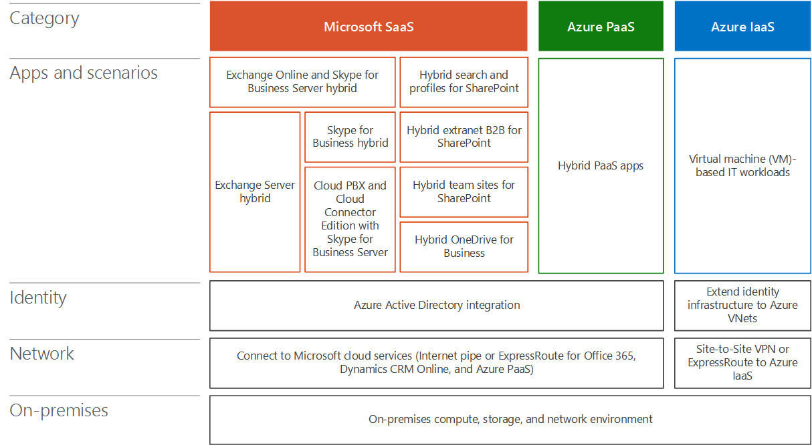

# Arquitectura de escenarios de nube híbrida de MicrosoftArchitecture of Microsoft hybrid cloud scenarios

 **Resumen:** Comprenda la arquitectura de las ofertas de nube híbrida de Microsoft.**Summary:** Understand the architecture of Microsoft's hybrid cloud offerings.
  
Use un enfoque de arquitectura para planear e implementar escenarios de nube híbrida con plataformas y servicios en la nube de Microsoft.Use an architectural approach to plan and implement hybrid cloud scenarios with Microsoft cloud services and platforms.
  
**Figura 1: La pila de nube híbrida de Microsoft****Figure 1: The Microsoft hybrid cloud stack**

  
En la figura 1, se muestra la pila de nube híbrida de Microsoft y su capa, que puede ser Local, Red, Identidad, aplicaciones y escenarios, y la categoría de servicio en la nube (SaaS de Microsoft y PaaS de Azure).Figure 1 shows the Microsoft hybrid cloud stack and its layer, which include on-premises, network, Identity, apps and scenarios, and the category of cloud service (Microsoft SaaS, Azure PaaS, and Azure PaaS).
  
La capa de aplicaciones y escenarios contiene los escenarios de nube híbrida específicos que se detallan en los artículos adicionales de este modelo. Las capas Identidad, Red y Local pueden ser comunes a las categorías de servicio en la nube (SaaS o PaaS).The Apps and scenarios layer contains the specific hybrid cloud scenarios that are detailed in the additional articles of this model. The Identity, Network, and On-premises layers can be common to the categories of cloud service (SaaS, PaaS, or PaaS).
  
- LocalOn-premises
    
    La infraestructura local para escenarios híbridos puede incluir servidores de SharePoint, Exchange, Skype Empresarial y aplicaciones de línea de negocio. También puede incluir almacenes de datos (bases de datos, listas, archivos). Sin conexiones de ExpressRoute, se debe permitir el acceso a los almacenes de datos locales a través de un proxy inverso o al hacer que el servidor o los datos sean accesibles en su red perimetral o extranet.On-premises infrastructure for hybrid scenarios can include servers for SharePoint, Exchange, Skype for Business, and line of business applications. It can also include data stores (databases, lists, files). Without ExpressRoute connections, access to the on-premises data stores must be allowed through a reverse proxy or by making the server or data accessible on your DMZ or extranet.
    
- RedNetwork
    
    Hay dos opciones de conectividad con plataformas y servicios de nube de Microsoft: la canalización de Internet existente y ExpressRoute. Use una conexión de ExpressRoute si es importante el rendimiento predecible. Puede usar una conexión de ExpressRoute para conectarse directamente con los servicios de SaaS de Microsoft (Office 365 y Dynamics 365) y los servicios de PaaS de Azure.There are two choices for connectivity to Microsoft cloud platforms and services: your existing Internet pipe and ExpressRoute. Use an ExpressRoute connection if predictable performance is important. You can use one ExpressRoute connection to connect directly to Microsoft SaaS services (Office 365 and Dynamics 365), Azure PaaS services, and Azure PaaS services.
    
- IdentidadIdentity
    
    Para la infraestructura de identidad de la nube, hay dos formas de proceder, según la plataforma de nube de Microsoft. Para SaaS y PaaS de Azure, integre la infraestructura de identidad local con Azure AD o fedérese con los proveedores de identidad de terceros o de infraestructura de identidad local. Para máquinas virtuales que se ejecutan en Azure, puede ampliar su infraestructura de identidad local, como Windows Server AD, a las redes virtuales (VNets) en que se encuentran las máquinas virtuales.For cloud identity infrastructure, there are two ways to go, depending on the Microsoft cloud platform. For SaaS and Azure PaaS, integrate your on-premises identity infrastructure with Azure AD or federate with your on-premises identity infrastructure or third-party identity providers. For VMs running in Azure, you can extend your on-premises identity infrastructure, such as Windows Server AD, to the virtual networks (VNets) where your VMs reside.
    
## Escenarios de nube híbrida para el proceso de adopción de la nube de tres fasesHybrid cloud scenarios for the three-phase cloud adoption process

Muchas empresas, incluida Microsoft, usan un enfoque de tres fases para la adopción de la nube. Los escenarios de nube híbrida pueden desempeñar un papel en cada fase.Many enterprises, including Microsoft's, use a three-phase approach to adopting the cloud. Hybrid cloud scenarios can play a role in each phase.
  
1. Mover las cargas de trabajo de productividad a SaaSMove productivity workloads to SaaS
    
    Para las cargas de trabajo de productividad locales o que deben permanecer locales, los escenarios híbridos permiten que se integren con sus equivalentes en la nube.For productivity workloads that currently are or must stay on-premises, hybrid scenarios allow them to be integrated with their cloud counterparts.
    
2. Desarrollar aplicaciones nuevas y modernas en PaaS de AzureDevelop new and modern applications in Azure PaaS
    
    Las aplicaciones PaaS híbridas de Azure pueden aprovechar con seguridad los recursos de almacenamiento o del servidor local.Azure PaaS hybrid applications can securely leverage on-premises server or storage resources.
    
3. Mover aplicaciones existentes a IaaS de AzureMove existing applications to Azure IaaS
    
    Para los escenarios de elevar y desplazar y compilar en la nube, las aplicaciones basadas en servidor que se ejecutan en máquinas virtuales de Azure ofrecen aprovisionamiento y escalado sencillos.For lift-and-shift and build-in-the-cloud scenarios, server-based applications running on Azure VMs provide easy provisioning and scaling.
    
## Vea tambiénSee Also

[Microsoft Hybrid Cloud para arquitectos profesionalesMicrosoft Hybrid Cloud for Enterprise Architects](microsoft-hybrid-cloud-for-enterprise-architects.md)
  
[Recursos de arquitectura de TI de la nube de MicrosoftMicrosoft Cloud IT architecture resources](microsoft-cloud-it-architecture-resources.md)

[Mapa de ruta de Enterprise Cloud de Microsoft: Recursos para los responsables de decisiones de TI](https://sway.com/FJ2xsyWtkJc2taRD)[Microsoft's Enterprise Cloud Roadmap: Resources for IT Decision Makers](https://sway.com/FJ2xsyWtkJc2taRD)

