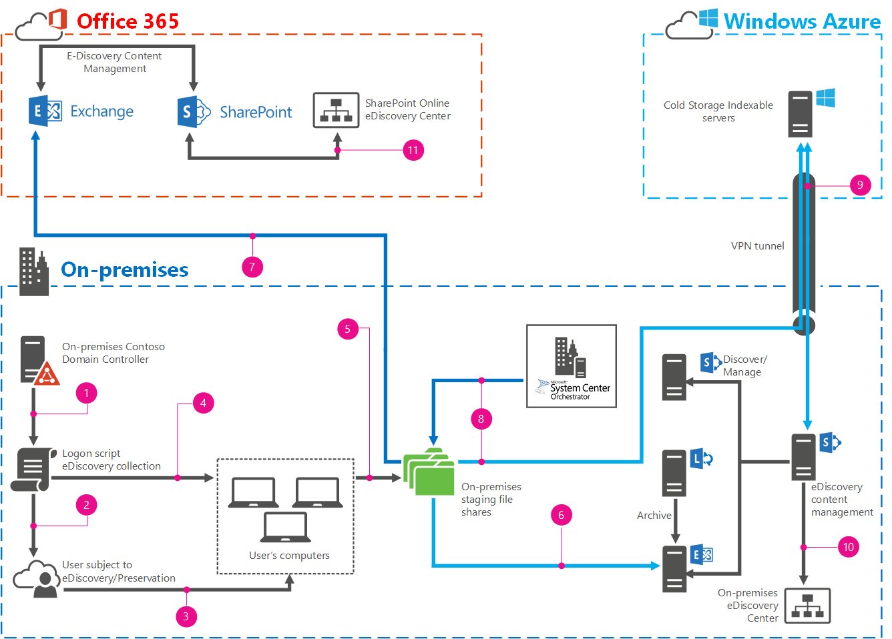

# <a name="automate-file-collection-for-ediscovery"></a><span data-ttu-id="10d0a-103">Automatizar la recopilación de archivos para la exhibición de documentos electrónicos</span><span class="sxs-lookup"><span data-stu-id="10d0a-103">Automate file collection for eDiscovery</span></span>

 <span data-ttu-id="10d0a-104">**Resumen:** Aprenda a automatizar una recopilación de archivos de los equipos del usuario para la exhibición de documentos electrónicos.</span><span class="sxs-lookup"><span data-stu-id="10d0a-104">**Summary:** Learn how to automate file collection from user computers for eDiscovery.</span></span>
  
<span data-ttu-id="10d0a-p101">Todas las empresas se enfrentan a la posibilidad de juicios u otros tipos de acciones legales. Mientras los departamentos legales trabajan para reducir dicha exposición, los juicios son un hecho de la vida empresarial. Cuando una empresa se enfrenta a acciones legales, se necesita, a través del proceso de descubrimiento legal, que se proporcionen todos los materiales de documentación pertinentes al Tribunal y a los abogados de la contraparte.</span><span class="sxs-lookup"><span data-stu-id="10d0a-p101">All companies face the potential of lawsuits or other types of legal action. While legal departments work to reduce that exposure, litigation is a fact of business life. When a company faces legal action, they are required, through the process of legal discovery, to provide all relevant documentary materials to the court and to opposing counsel.</span></span> 
  
<span data-ttu-id="10d0a-p102">eDiscovery es el proceso mediante el cual las empresas crean un inventario, buscan, identifican, conservan, filtran y hacen que los materiales de documentación pertinentes que existen estén disponibles en formato electrónico. SharePoint 2013,Exchange Server 2013,Lync Server 2013,SharePoint Online y Exchange Online pueden disponer de grandes cantidades de contenido documental. Dependiendo de la versión, estos productos pueden admitir eDiscovery y retenciones locales (Lync mediante Exchange Server), facilitando a los equipos legales la indexación, identificación, retención y filtración del contenido más relevante para un caso determinado.</span><span class="sxs-lookup"><span data-stu-id="10d0a-p102">eDiscovery is the process by which companies inventory, search, identify, preserve, filter, and make available the relevant documentary materials that exist in electronic form. SharePoint 2013, Exchange Server 2013, Lync Server 2013, SharePoint Online, and Exchange Online can hold large amounts of documentary content. Depending on the version, these products may support eDiscovery and in place holds (Lync via Exchange Server), making it easier for the legal teams to index, identify, hold, and filter the most relevant content for a given case.</span></span>
  
<span data-ttu-id="10d0a-p103">Muchos documentos se almacenan en los equipos locales de los usuarios (administradores) y no se encuentra en una ubicación centralizada. Esto hace prácticamente imposible la búsqueda de SharePoint 2013, y si no se puede buscar, no se puede incluir en eDiscovery. Esta solución le muestra cómo usar scripts de inicio de sesión, System Center Orchestrator 2012 R2 y Windows PowerShell de Exchange Server para automatizar la identificación y la recopilación de los materiales documentales de los equipos de los usuarios.</span><span class="sxs-lookup"><span data-stu-id="10d0a-p103">Many documents are stored on users' (Custodians) local computers, not in a centralized location. This makes it essentially impossible for SharePoint 2013 to search, and if it can't be searched, it can't be included in eDiscovery. This solution shows you how to use logon scripts, System Center Orchestrator 2012 R2 and Windows PowerShell for Exchange Server to automate the identification and collection of documentary materials from users' computers.</span></span>
  
## <a name="what-this-solution-does"></a><span data-ttu-id="10d0a-114">Qué hace esta solución</span><span class="sxs-lookup"><span data-stu-id="10d0a-114">What this solution does</span></span>

<span data-ttu-id="10d0a-p104">Esta solución usa un grupo de seguridad global, una directiva de grupo y un script Windows PowerShell para buscar, inventariar y recopilar contenido y archivos de almacenamiento personal (PST) Outlook de los equipos locales de los usuarios en un recurso compartido de archivos oculto. Desde allí, los archivos PST se pueden volver a importar en Exchange Server 2013 o en Exchange Online. Todos los archivos se mueven a otro recurso compartido de archivos en Microsoft Azure usando un Runbook System Center Orchestrator 2012 R2 para un periodo de almacenamiento más largo y se indexan por SharePoint 2013. Posteriormente, usará centros de eDiscovery en su implementación de SharePoint 2013 local o en SharePoint Online, de la misma manera en la que realizaría normalmente eDiscovery.</span><span class="sxs-lookup"><span data-stu-id="10d0a-p104">This solution uses a global security group, Group Policy, and a Windows PowerShell script to locate, inventory, and collect content and Outlook personal store (PST) files from users local computers to a hidden file share. From there, the PST files can be imported into either Exchange Server 2013 or Exchange Online. All files are then moved using a System Center Orchestrator 2012 R2 runbook to another file share in Microsoft Azure for long-term storage and indexing by SharePoint 2013. You then use eDiscovery centers in your on-premises SharePoint 2013 deployment or in SharePoint Online as you regularly would to perform eDiscovery.</span></span> 
  
> [!IMPORTANT]
> <span data-ttu-id="10d0a-p105">Esta solución usa Robocopy para copiar archivos desde equipos de administrador a un recurso compartido de archivos centralizado. Como Robocopy no copia archivos que están abiertos o bloqueados, cualquier archivo, incluidos los archivos PST, que el administrador tenga abierto no se recopilará. Tendrá que recopilarlos manualmente. Esta solución le proporciona una lista que identifica de forma explícita los archivos que no puede copiar y la ruta de acceso completa de cada archivo.</span><span class="sxs-lookup"><span data-stu-id="10d0a-p105">This solution uses robocopy to copy files from custodian's computers to a centralized file share. Because robocopy does not copy files that are open or locked, any files, including PST files, that the custodian has open will not be collected. You will have to collect them manually. This solution does provide you with a list that explicitly identifies the files it cannot copy and the full path to each file.</span></span> 
  
<span data-ttu-id="10d0a-123">El siguiente diagrama le dirige por todos los pasos y elementos de la solución</span><span class="sxs-lookup"><span data-stu-id="10d0a-123">The following diagram walks you through all the steps and elements of the solution.</span></span>
  

  
|<span data-ttu-id="10d0a-125">****Leyenda****</span><span class="sxs-lookup"><span data-stu-id="10d0a-125">****Legend****</span></span>||
|:-----|:-----|
||<span data-ttu-id="10d0a-127">Crear un objeto de directiva de grupo (GPO) y asociarlo a la recopilación de scripts de inicio de sesión</span><span class="sxs-lookup"><span data-stu-id="10d0a-127">Create a Group Policy object (GPO), and associate it with the collection logon script.</span></span>  <br/> |
|| <span data-ttu-id="10d0a-129">  Configurar el filtro de seguridad GPO para aplicar el GPO solo al grupo de administradores</span><span class="sxs-lookup"><span data-stu-id="10d0a-129">Configure the GPO security filter to apply the GPO only to the Custodians group.</span></span> <br/> |
||<span data-ttu-id="10d0a-131">Cuando un administrador inicia sesión y se ejecuta el GPO, se llama a la recopilación de scripts de inicio de sesión.</span><span class="sxs-lookup"><span data-stu-id="10d0a-131">A Custodian logs on and the GPO runs, calling the collection logon script.</span></span>  <br/> |
||<span data-ttu-id="10d0a-133">La recopilación de scripts de inicio de sesión hace un inventario de todas las unidades adjuntadas de forma local del equipo de los administradores, en busca de los archivos que desea, y registra su ubicación.</span><span class="sxs-lookup"><span data-stu-id="10d0a-133">The collection logon script inventories all locally attached drives on the Custodians computer, searching for the files you want, and recording their location.</span></span>  <br/> |
||<span data-ttu-id="10d0a-135">La recopilación de scripts de inicio de sesión copia los archivos inventariados en un recurso compartido de archivos oculto en el servidor de implementación. </span><span class="sxs-lookup"><span data-stu-id="10d0a-135">The collection logon script copies the inventoried files to a hidden file share on the staging server.</span></span>  <br/> |
|| <span data-ttu-id="10d0a-137">(Opción A) Ejecute manualmente el script de importación de PST para importar los archivos PST recopilados en Exchange Server 2013.</span><span class="sxs-lookup"><span data-stu-id="10d0a-137">(Option A) Manually run the PST import script to import the collected PST files into Exchange Server 2013.</span></span> <br/> |
||<span data-ttu-id="10d0a-139">(Opción B) Mediante la herramienta de Importar y procesar de Office 365, importe los archivos PST recopilados en Exchange Online.</span><span class="sxs-lookup"><span data-stu-id="10d0a-139">(Option B) Using the Office 365 Import tool and process, import the collected PST files into Exchange Online.</span></span>  <br/> |
||<span data-ttu-id="10d0a-141">Mueva todos los archivos recopilados a un recurso compartido de archivos de Azure para un almacenamiento a largo plazo con el Runbook MoveToColdStorageSystem Center Orchestrator 2012 R2.</span><span class="sxs-lookup"><span data-stu-id="10d0a-141">Move all collected files to an Azure file share for long term storage with the MoveToColdStorage System Center Orchestrator 2012 R2 runbook.</span></span> <br/> |
||<span data-ttu-id="10d0a-143">Indexe los archivos en el recurso compartido de archivos de almacenamiento en frío con SharePoint 2013.</span><span class="sxs-lookup"><span data-stu-id="10d0a-143">Index the files in the cold storage file share with SharePoint 2013.</span></span>  <br/> |
||<span data-ttu-id="10d0a-145">Realice eDiscovery en el contenido del almacenamiento en frío y en el Exchange Server 2013 local.</span><span class="sxs-lookup"><span data-stu-id="10d0a-145">Perform eDiscovery on content in cold storage and in the on-premises Exchange Server 2013.</span></span>  <br/> |
||<span data-ttu-id="10d0a-147">Realice eDiscovery en el contenido del Office 365.</span><span class="sxs-lookup"><span data-stu-id="10d0a-147">Perform eDiscovery on content in Office 365.</span></span>  <br/> |
   
## <a name="prerequisites"></a><span data-ttu-id="10d0a-148">Requisitos previos</span><span class="sxs-lookup"><span data-stu-id="10d0a-148">Prerequisites</span></span>

<span data-ttu-id="10d0a-p106">La configuración de esta solución requiere muchos elementos, la mayoría de los cuales tenga probablemente en su sitio y configurados si está pensando en eDiscovery. Para los elementos que quizás no tenga o que necesiten una configuración específica, le proporcionaremos los vínculos que necesita para crear su configuración base. Debe tener la configuración base en su sitio antes de que configure la propia solución.</span><span class="sxs-lookup"><span data-stu-id="10d0a-p106">The configuration of this solution requires many elements, most of which you likely have in place and configured if you're thinking about eDiscovery. For the elements that you may not have or ones that require a specific configuration, we'll provide you with the links you need build out your base configuration. You must have the base configuration in place before you configure the solution itself.</span></span>
  
### <a name="base-configuration"></a><span data-ttu-id="10d0a-152">Configuración básica</span><span class="sxs-lookup"><span data-stu-id="10d0a-152">Base configuration</span></span>

|<span data-ttu-id="10d0a-153">**Elemento**</span><span class="sxs-lookup"><span data-stu-id="10d0a-153">**Element**</span></span>|<span data-ttu-id="10d0a-154">**Vínculo**</span><span class="sxs-lookup"><span data-stu-id="10d0a-154">**Link**</span></span>|
|:-----|:-----|
|<span data-ttu-id="10d0a-155">Dominio de Servicios de dominio de Active Directory (AD DS)</span><span class="sxs-lookup"><span data-stu-id="10d0a-155">Active Directory Domain Services (AD DS) domain</span></span>  <br/> ||
|<span data-ttu-id="10d0a-156">Conectividad de Internet desde su red local</span><span class="sxs-lookup"><span data-stu-id="10d0a-156">Internet connectivity from your on-premises network</span></span>  <br/> ||
|<span data-ttu-id="10d0a-157">SQL Server 2012 para admitir SharePoint 2013 y System Center Orchestrator 2012 R2</span><span class="sxs-lookup"><span data-stu-id="10d0a-157">SQL Server 2012 to support SharePoint 2013 and System Center Orchestrator 2012 R2</span></span>  <br/> |[<span data-ttu-id="10d0a-158">Implementación de System Center Orchestrator: 2012</span><span class="sxs-lookup"><span data-stu-id="10d0a-158">Deploying System Center Orchestrator - 2012</span></span>](https://go.microsoft.com/fwlink/p/?LinkId=613503) <br/> |
| <span data-ttu-id="10d0a-159">Local o Azure basado en SharePoint 2013 para eDiscovery (necesario para la opción A)</span><span class="sxs-lookup"><span data-stu-id="10d0a-159">On-premises or Azure based SharePoint 2013 for eDiscovery (required for Option A)</span></span> <br/> ||
|<span data-ttu-id="10d0a-160">Servidor local de recurso compartido de archivos de implementación</span><span class="sxs-lookup"><span data-stu-id="10d0a-160">On-premises file share server for staging</span></span>  <br/> ||
|<span data-ttu-id="10d0a-161">Exchange Server 2013 local para la importación PST de la opción A</span><span class="sxs-lookup"><span data-stu-id="10d0a-161">On-premises Exchange Server 2013 for Option A PST import</span></span>  <br/> |<span data-ttu-id="10d0a-162">CU5 (15.913.22) está disponible en [CU5](https://go.microsoft.com/fwlink/p/?LinkId=613426).</span><span class="sxs-lookup"><span data-stu-id="10d0a-162">CU5 (15.913.22) is available at [CU5](https://go.microsoft.com/fwlink/p/?LinkId=613426).</span></span>  <br/> |
|<span data-ttu-id="10d0a-163">System Center Orchestrator 2012 R2</span><span class="sxs-lookup"><span data-stu-id="10d0a-163">System Center Orchestrator 2012 R2</span></span>  <br/> |[<span data-ttu-id="10d0a-164">Implementación de System Center Orchestrator: 2012</span><span class="sxs-lookup"><span data-stu-id="10d0a-164">Deploying System Center Orchestrator - 2012</span></span>](https://go.microsoft.com/fwlink/p/?LinkId=613503) <br/> |
|<span data-ttu-id="10d0a-165">Office 365 (Plan E3) con Exchange Online y SharePoint Online (necesario para la opción B)</span><span class="sxs-lookup"><span data-stu-id="10d0a-165">Office 365 (E3 Plan) with Exchange Online and SharePoint Online (required for Option B)</span></span>  <br/> |<span data-ttu-id="10d0a-166">Para registrarse en una suscripción a Office 365 E3, consulte [Suscripción a Office 365 E3](https://go.microsoft.com/fwlink/p/?LinkId=613504).</span><span class="sxs-lookup"><span data-stu-id="10d0a-166">To sign up for an Office 365 E3 subscription, see [Office 365 E3 subscription](https://go.microsoft.com/fwlink/p/?LinkId=613504).</span></span>  <br/> |
|<span data-ttu-id="10d0a-167">Suscripción a Azure con una máquina virtual</span><span class="sxs-lookup"><span data-stu-id="10d0a-167">Azure subscription with a virtual machine</span></span>  <br/> |<span data-ttu-id="10d0a-168">Para registrarse en Azure, consulte: [Suscribirse a Windows Azure](https://go.microsoft.com/fwlink/p/?LinkId=512010)</span><span class="sxs-lookup"><span data-stu-id="10d0a-168">To sign up for a Azure, see [Subscribe to Windows Azure](https://go.microsoft.com/fwlink/p/?LinkId=512010)</span></span> <br/> |
|<span data-ttu-id="10d0a-169">Una conexión VPN entre su red local y su suscripción a Azure</span><span class="sxs-lookup"><span data-stu-id="10d0a-169">A VPN connection between your on-premises network and your Azure subscription</span></span>  <br/> |<span data-ttu-id="10d0a-170">Para configurar un túnel VPN entre su suscripción a Azure y su red local, consulte [Conectar una red local a una red virtual de Microsoft Azure](https://go.microsoft.com/fwlink/p/?LinkId=613507).</span><span class="sxs-lookup"><span data-stu-id="10d0a-170">To set up a VPN tunnel between your Azure subscription and your on-premises network, see [Connect an on-premises network to a Microsoft Azure virtual network](https://go.microsoft.com/fwlink/p/?LinkId=613507).</span></span>  <br/> |
|<span data-ttu-id="10d0a-171">SharePoint 2013eDiscovery está configurado para buscar a través de SharePoint y Exchange Server 2013 y, opcionalmente, Lync Server 2013</span><span class="sxs-lookup"><span data-stu-id="10d0a-171">SharePoint 2013 eDiscovery configured to search across SharePoint and Exchange Server 2013 and optionally Lync Server 2013</span></span>  <br/> |<span data-ttu-id="10d0a-172">Para configurar eDiscovery de esta manera, consulte: [Configurar eDiscovery en SharePoint Server 2013](https://go.microsoft.com/fwlink/p/?LinkId=613508) y[Guía de entorno de pruebas: Configurar eDiscovery para Exchange, Lync, SharePoint y para el entorno de pruebas de recursos compartidos de archivos de Windows](https://go.microsoft.com/fwlink/p/?LinkId=393130).</span><span class="sxs-lookup"><span data-stu-id="10d0a-172">To configure eDiscovery in this fashion, see [Configure eDiscovery in SharePoint Server 2013](https://go.microsoft.com/fwlink/p/?LinkId=613508) and[Test Lab Guide: Configure eDiscovery for an Exchange, Lync, SharePoint and Windows File Shares Test Lab](https://go.microsoft.com/fwlink/p/?LinkId=393130).</span></span>  <br/> |
|<span data-ttu-id="10d0a-173">eDiscovery en Office 365 para SharePoint Online y Exchange Online</span><span class="sxs-lookup"><span data-stu-id="10d0a-173">eDiscovery in Office 365 for SharePoint Online and Exchange Online</span></span>  <br/> |<span data-ttu-id="10d0a-174">Para configurar eDiscovery en Office 365, consulte [Configurar un centro eDiscovery en SharePoint Online](https://go.microsoft.com/fwlink/p/?LinkId=613628).</span><span class="sxs-lookup"><span data-stu-id="10d0a-174">To configure eDiscovery in Office 365, see [Set up an eDiscovery Center in SharePoint Online](https://go.microsoft.com/fwlink/p/?LinkId=613628).</span></span>  <br/> |
   
## <a name="configure-the-environment"></a><span data-ttu-id="10d0a-175">Configurar el entorno</span><span class="sxs-lookup"><span data-stu-id="10d0a-175">Configure the environment</span></span>

<span data-ttu-id="10d0a-176">Ahora que tiene la configuración básica local, puede pasar a la configuración de la propia solución.</span><span class="sxs-lookup"><span data-stu-id="10d0a-176">Now that you have the base configuration in place, you can move ahead to configuring the solution itself.</span></span> 
  
### <a name="staging-file-share"></a><span data-ttu-id="10d0a-177">Implementar el uso compartido de archivos</span><span class="sxs-lookup"><span data-stu-id="10d0a-177">Staging file share</span></span>

1. <span data-ttu-id="10d0a-178">En el dominio local, cree un grupo de seguridad global denominado Custodians.</span><span class="sxs-lookup"><span data-stu-id="10d0a-178">In the on-premises domain, create a global security group named Custodians.</span></span>
    
2. <span data-ttu-id="10d0a-p107">Cree un recurso compartido de archivos oculto para los archivos que recopile de los equipos de los administradores. Este debería estar en un servidor local. Por ejemplo, en un servidor llamado Staging, cree un recurso compartido de archivos denominado Cases$. El símbolo **$** es necesario para que el recurso compartido esté oculto.</span><span class="sxs-lookup"><span data-stu-id="10d0a-p107">Create a hidden file share for the files that are collected from Custodians computers. This should be on an on-premises server. For example, on a server called Staging, create a file share called Cases$. The **$** is required to make this a hidden share.</span></span>
    
3. <span data-ttu-id="10d0a-183">Establezca los siguientes permisos de recurso compartido:</span><span class="sxs-lookup"><span data-stu-id="10d0a-183">Set the following share permissions:</span></span>
    
  - <span data-ttu-id="10d0a-184">Administradores: Modificar, leer</span><span class="sxs-lookup"><span data-stu-id="10d0a-184">Custodians: Change, Read</span></span>
    
  - <span data-ttu-id="10d0a-185">Administradores: Control total</span><span class="sxs-lookup"><span data-stu-id="10d0a-185">Administrators: Full Control</span></span>
    
  - <span data-ttu-id="10d0a-186">Subsistema de confianza de Exchange: Modificar, leer</span><span class="sxs-lookup"><span data-stu-id="10d0a-186">Exchange Trusted Subsystem: Change, Read</span></span>
    
4. <span data-ttu-id="10d0a-p108">Abra la pestaña **Seguridad**, agregue el grupo Administradores y haga clic en **Avanzado**. Establecer los siguientes permisos para el grupo Administradores:</span><span class="sxs-lookup"><span data-stu-id="10d0a-p108">Open the **Security** tab, add the Custodians group, and click **Advanced**. Set the following permissions for the Custodians group:</span></span>
    
  - <span data-ttu-id="10d0a-189">**Tipo: Denegar**</span><span class="sxs-lookup"><span data-stu-id="10d0a-189">**Type: Deny**</span></span>
    
  - <span data-ttu-id="10d0a-190">**Se aplica a: Esta carpeta, subcarpetas y archivos**</span><span class="sxs-lookup"><span data-stu-id="10d0a-190">**Applies to: This folder, subfolders and files**</span></span>
    
5. <span data-ttu-id="10d0a-191">Haga clic en **Permisos avanzados** y seleccione lo siguiente:</span><span class="sxs-lookup"><span data-stu-id="10d0a-191">Click **Advanced Permissions** and select the following:</span></span>
    
  - <span data-ttu-id="10d0a-192">**Atributos de lectura**</span><span class="sxs-lookup"><span data-stu-id="10d0a-192">**Read attributes**</span></span>
    
  - <span data-ttu-id="10d0a-193">**Atributos extendidos de lectura**</span><span class="sxs-lookup"><span data-stu-id="10d0a-193">**Read extended attributes**</span></span>
    
  - <span data-ttu-id="10d0a-194">**Permisos de lectura**</span><span class="sxs-lookup"><span data-stu-id="10d0a-194">**Read permissions**</span></span>
    
6. <span data-ttu-id="10d0a-195">Pruebe el acceso al recurso compartido de archivos Casos$ haciendo lo siguiente:</span><span class="sxs-lookup"><span data-stu-id="10d0a-195">Test access to the Cases$ file share by doing the following:</span></span>
    
1. <span data-ttu-id="10d0a-196">Agregar un usuario al grupo de administradores</span><span class="sxs-lookup"><span data-stu-id="10d0a-196">Add a user to the Custodians group.</span></span>
    
2. <span data-ttu-id="10d0a-197">Coloque un archivo en la carpeta Casos$.</span><span class="sxs-lookup"><span data-stu-id="10d0a-197">Place a file in the Cases$ folder.</span></span>
    
3. <span data-ttu-id="10d0a-p109">Como usuario, busque el servidor de almacenamiento provisional, por ejemplo, busque el recurso compartido \\\\Staging para ver qué recursos compartidos están disponibles. No debería ver el recurso compartido **Casos$** enumerado.</span><span class="sxs-lookup"><span data-stu-id="10d0a-p109">As the user, browse to the staging server, for example browse to the \\\\Staging share to see what shares are available. You shouldn't see the **Cases$** share listed.</span></span>
    
4. <span data-ttu-id="10d0a-p110">Escriba manualmente la ruta de acceso completa al recurso compartido Casos$ en Explorer. En ese momento, debería abrirse el recurso compartido Casos$.</span><span class="sxs-lookup"><span data-stu-id="10d0a-p110">Manually type the full path to the Cases$ share into Explorer. This should open the Cases$ share.</span></span>
    
5. <span data-ttu-id="10d0a-p111">Intente abrir el archivo que previamente colocó en el recurso compartido. Debería producirse un error.</span><span class="sxs-lookup"><span data-stu-id="10d0a-p111">Try to open the file you previously placed in the share. This should fail.</span></span>
    
### <a name="logon-script"></a><span data-ttu-id="10d0a-204">Script de inicio de sesión</span><span class="sxs-lookup"><span data-stu-id="10d0a-204">Logon script</span></span>

1. <span data-ttu-id="10d0a-205">Copie y pegue este script Windows PowerShell en el Bloc de notas:</span><span class="sxs-lookup"><span data-stu-id="10d0a-205">Copy and paste this Windows PowerShell script into Notepad:</span></span>
    
  ```
  # Automated file collection script
# Substantial error processing should be added for robust execution and troubleshooting opportunities
# All commented out write-hosts are for debugging only and are commented out for regular execution

# Functions 

Function CreateCaseFolder() {

#Check to see if case folder already exists
$CaseFolderCheck = Test-Path $CaseLocation

try {

    if (!$CaseFolderCheck) {
    # Case folder doesn't exist.  Create the case folder and the log file location
    # Write-Host -ForegroundColor Cyan "Creating Case Folder $CaseLocation"
    New-Item "$CaseLocation" -ItemType Directory -Force -ErrorAction SilentlyContinue
    # Write-Host -ForegroundColor Cyan "Creating Case Log Folder $CaseLogLocation"
    New-Item "$CaseLogLocation" -ItemType Directory -Force -ErrorAction SilentlyContinue
    # Write-Host -ForegroundColor Cyan "Creating Case PST folder $CasePSTLocation"
    New-Item "$CasePSTLocation" -ItemType Directory -Force -ErrorAction SilentlyContinue

    }
    else {

    # do nothing since the target case folder already exists

    }
}
catch [System.Exception] {

    # To do..
    # to log to an exception or log file
    
    }
}

Function CopyFileToCaseFolder($SourcePath, $TargetPath, $FileName) {
    
    # Check to see if the file already exists
    $TargetFileCheck = Test-Path $TargetPath\\$FileName

try {

    if (!$TargetFileCheck) {
    # Copy the file to the case folder
    Write-Host $SourcePath $TargetPath $FileName
    robocopy "$SourcePath" "$TargetPath" "$FileName" /COPY:DATSO /TEE /LOG+:$LoggingFile /R:10 /W:10 | Out-Null

    }
    else {

    # do nothing since file is already in the target case folder

    }
}
catch [System.Exception] {

    # To do..
    # to log to an exception or log file
    
    }
}

# Global variable initializations

# Error log
$Loggederrors=@()

# The array to contain the file types we collect
$FileTypes = @("*.doc","*.docx","*.pst","*.txt")

# We'll set the case number to be a combination of the date and user name
# For example, a case for John Doe on Dec 14, 2014 at 2:38pm would be:
# 201412141438_jdoe
$CaseNo = get-date -Format yyyyMMddHHmm
$CaseNo = $CaseNo + "_" + [Environment]::UserName

# Target location to copy case files
$CaseRootLocation = "\\\\staging\\Cases$" 

# File copy location, log file location, PST file location and temporary log file location
$CaseLocation = $CaseRootLocation + "\\" + $CaseNo
$CaseLogLocation = $CaseRootLocation + "\\" + $CaseNo + "\\_Log"
$CasePSTLocation = $CaseRootLocation + "\\" + $CaseNo + "\\_PSTs"
$TemporaryLogLocation = [Environment]::getfolderpath('ApplicationData') + "\\" + $CaseNo

# Inventory of local drives
$LocalDrives = Get-PSDrive -PSProvider FileSystem -Scope Global

$LoggingFile = "$CaseLogLocation\\FileCopyErrors.log"

# Main script

# Create the case folder if it doesn't already exist
CreateCaseFolder

# Create the list of files to be copied
# First create the temporary directory in the AppData\\Roaming folder
New-Item "$TemporaryLogLocation" -ItemType Directory -Force -ErrorAction SilentlyContinue
$LocalDrives | foreach {

    # Write-Host -ForeGroundColor Cyan "Collecting Files for Drive: " $_
    Get-ChildItem -Path $_.Root -Recurse -Include $FileTypes -ErrorAction SilentlyContinue -ErrorVariable +Loggederrors | Export-Clixml $TemporaryLogLocation\\\\$_.xml -Force
    # Needs try catch and logged collection error file
}

# Now let's read each file and copy any files we need to the case folder
# We will also copy these XMLs to the case log files folder as we go along
# We only want to process XML files, just in case something else got in there as the script ran
$CaseDriveFiles = Get-ChildItem $TemporaryLogLocation -Filter '*.xml'
$CaseDriveFiles | foreach {
    # Copy the XML file to the case log location
    CopyFileToCaseFolder $_.Directory.FullName $CaseLogLocation $_.Name
    $DriveFile = $_.FullName
    # Write-Host -ForegroundColor Cyan "Copying Files specified in the XML file: $DriveFile"
    $CurrentDriveFile = Import-Clixml $DriveFile
    $CurrentDriveFile | foreach {
        # write-host $_.FullName
        # if it's a PST, add to the PSTs folder. otherwise add it to case folder
        if ($_.Extension -match '.PST')
        {
            CopyFileToCaseFolder $_.Directory.FullName $CasePSTLocation $_.Name
            write-host "this is a PST"
        }
        else
        {
            CopyFileToCaseFolder $_.Directory.FullName $CaseLocation $_.Name
        }
    }
}

# Now delete the temporary log file
Remove-Item $TemporaryLogLocation -Recurse 

Write-Host -ForegroundColor Cyan "Finished."

  ```

2. <span data-ttu-id="10d0a-206">Guarde el script como CollectionScript.ps1 en una ubicación fácil de encontrar, por ejemplo, C:\\AFCScripts.</span><span class="sxs-lookup"><span data-stu-id="10d0a-206">Save the above script as CollectionScript.ps1 in a location that's easy for you to find, for example, C:\\AFCScripts.</span></span>
    
3. <span data-ttu-id="10d0a-p112">Use la característica Ir a del Bloc de notas. Realice estos cambios según sea necesario:</span><span class="sxs-lookup"><span data-stu-id="10d0a-p112">Use the Go To feature in Notepad. Make the following changes, as needed:</span></span>
    
|<span data-ttu-id="10d0a-209">**Número de línea**</span><span class="sxs-lookup"><span data-stu-id="10d0a-209">**Line #**</span></span>|<span data-ttu-id="10d0a-210">**Lo que es necesario cambiar**</span><span class="sxs-lookup"><span data-stu-id="10d0a-210">**What you need to change**</span></span>|<span data-ttu-id="10d0a-211">**obligatorio/opcional**</span><span class="sxs-lookup"><span data-stu-id="10d0a-211">**Required/optional**</span></span>|
|:-----|:-----|:-----|
|<span data-ttu-id="10d0a-212">71</span><span class="sxs-lookup"><span data-stu-id="10d0a-212">71</span></span>  <br/> |<span data-ttu-id="10d0a-p113">Variable **$FileTypes**. Incluir todos los tipos de extensiones de archivo que desea que el script inventarie y recopile en la variable de matriz</span><span class="sxs-lookup"><span data-stu-id="10d0a-p113">**$FileTypes** variable. Include all the file type extensions that you want the script to inventory and collect in the array variable. </span></span><br/> |<span data-ttu-id="10d0a-215">Opcional</span><span class="sxs-lookup"><span data-stu-id="10d0a-215">Optional</span></span>  <br/> |
|<span data-ttu-id="10d0a-216">76 y 77</span><span class="sxs-lookup"><span data-stu-id="10d0a-216">76 and 77</span></span>  <br/> |<span data-ttu-id="10d0a-p114">Cambie la manera en la que la variable **$CaseNo** se genera para que se adapte a sus necesidades. El script captura la fecha y hora actuales y le anexa el nombre de usuario.</span><span class="sxs-lookup"><span data-stu-id="10d0a-p114">Change the way the **$CaseNo** variable is built to suit your needs. The script captures the current date and time and appends the user name to it. </span></span><br/> |<span data-ttu-id="10d0a-219">Opcional</span><span class="sxs-lookup"><span data-stu-id="10d0a-219">Optional</span></span>  <br/> |
|<span data-ttu-id="10d0a-220">80</span><span class="sxs-lookup"><span data-stu-id="10d0a-220">80</span></span>  <br/> |<span data-ttu-id="10d0a-221">La variable **$CaseRootLocation** debe establecerse en el recurso compartido de archivos del archivo de colección de servidores de implementación. Por ejemplo, **\\\\Staging\\Cases$**</span><span class="sxs-lookup"><span data-stu-id="10d0a-221">**$CaseRootLocation** variable needs to be set to your staging servers collection file share, for example **\\\\Staging\\Cases$**.</span></span> <br/> |<span data-ttu-id="10d0a-222">Necesario</span><span class="sxs-lookup"><span data-stu-id="10d0a-222">Required</span></span>  <br/> |
   
4. <span data-ttu-id="10d0a-223">Coloque el archivo CollectionScript.ps1 en el recurso compartido de archivo Netlogon en un controlador de dominio.</span><span class="sxs-lookup"><span data-stu-id="10d0a-223">Place the CollectionScript.ps1 file in the Netlogon file share on a domain controller.</span></span> 
    
### <a name="configure-gpo-for-the-logon-script-and-custodians-group"></a><span data-ttu-id="10d0a-224">Configurar el GPO para el grupo Administradores y el script de inicio de sesión</span><span class="sxs-lookup"><span data-stu-id="10d0a-224">Configure GPO for the logon script and Custodians Group</span></span>

1. <span data-ttu-id="10d0a-225">Configure un script de inicio de sesión para el grupo Administradores siguiendo la sección "Cómo asignar los scripts de inicio de sesión del usuario" en el tema, [Usar scripts de inicio, apagado, inicio de sesión y cierre de sesión en la directiva de grupo](https://go.microsoft.com/fwlink/p/?LinkId=614844).</span><span class="sxs-lookup"><span data-stu-id="10d0a-225">Configure a logon script for the Custodians group by following the "How to assign user logon scripts" section in the topic, [Using Startup, Shutdown, Logon, and Logoff Scripts in Group Policy](https://go.microsoft.com/fwlink/p/?LinkId=614844).</span></span>
    
2. <span data-ttu-id="10d0a-226">Quite los usuarios autenticados de **Filtrado de seguridad** y agregue el grupo de administradores.</span><span class="sxs-lookup"><span data-stu-id="10d0a-226">Remove authenticated users from **Security Filtering**, and add the Custodians group.</span></span>
    
### <a name="pst-import-option-a-script-for-exchange-server-2013"></a><span data-ttu-id="10d0a-227">Opción A de importación de PST, script para Exchange Server 2013</span><span class="sxs-lookup"><span data-stu-id="10d0a-227">PST import Option A, script for Exchange Server 2013</span></span>

1.  <span data-ttu-id="10d0a-228">Copie y pegue el siguiente script Windows PowerShell en el Bloc de notas:</span><span class="sxs-lookup"><span data-stu-id="10d0a-228">Copy and paste the following Windows PowerShell script into Notepad:</span></span>
    
  ```
  # Script to import all PSTs in a given folder to a target mailbox
#
# This is for on-prem Exchange only
# Input parameters
# When you run the script, you call it with two parameters, PST source path and target mailbox alias
# For example:  .\\PSTImport.ps1 \\\\FileShare\\PSTFiles jdoe

param ([String]$SourcePath,[String]$MailboxAlias)

# Folder identifier is the string we want to show in the mailbox that we import the PSTs to

$FolderIdentifier = "zzImportedPSTs_"

# Connect to Exchange remote powershell using the connection Uri below
# This would be the format http://<exchange server FQDN>/Powershell

$ConnectionUri = 'http://h10-exch/PowerShell'
$RemoteEx2013Session = New-PSSession -ConfigurationName Microsoft.Exchange -ConnectionUri $ConnectionUri -Authentication Kerberos
Import-PSSession $RemoteEx2013Session

# Get all the files in the source path

$AllFiles = Get-ChildItem $SourcePath -Recurse

# Go through each file and if it's a PST launch a mailbox import request for it

$AllFiles | ForEach-Object {
    If ($_.Extension -eq ".pst") {
        $ImportName = $MailboxAlias + "_" + $_.Name
        $FolderName = $FolderIdentifier + $_.Name
        New-MailboxImportRequest -Name $ImportName -Mailbox $MailboxAlias -FilePath $_.FullName -TargetRootFolder $FolderName
    }
}
  ```

2. <span data-ttu-id="10d0a-p115">Guarde este script como PSTImportScript.ps1 en una ubicación fácil de encontrar. Por ejemplo, para mayor facilidad de uso, cree una carpeta en el servidor de almacenamiento provisional denominado \\\\Staging\\AFCScripts, y guárdelo allí.</span><span class="sxs-lookup"><span data-stu-id="10d0a-p115">Save the script as PSTImportScript.ps1 in a location that's easy for you to find. For example and ease of use, create a folder on your staging server called \\\\Staging\\AFCScripts, and save it there.</span></span>
    
3. <span data-ttu-id="10d0a-231">Use la característica Ir a del Bloc de notas y realice los siguientes cambios según sea necesario:</span><span class="sxs-lookup"><span data-stu-id="10d0a-231">Use the Go To feature in Notepad, and make the following changes, as needed:</span></span>
    
|<span data-ttu-id="10d0a-232">**Número de línea**</span><span class="sxs-lookup"><span data-stu-id="10d0a-232">**Line #**</span></span>|<span data-ttu-id="10d0a-233">**Lo que es necesario cambiar**</span><span class="sxs-lookup"><span data-stu-id="10d0a-233">**What you need to change**</span></span>|<span data-ttu-id="10d0a-234">**obligatorio/opcional**</span><span class="sxs-lookup"><span data-stu-id="10d0a-234">**Required/optional**</span></span>|
|:-----|:-----|:-----|
|<span data-ttu-id="10d0a-235">12</span><span class="sxs-lookup"><span data-stu-id="10d0a-235">12</span></span>  <br/> |<span data-ttu-id="10d0a-p116">**$FolderIdentifier** etiqueta las carpetas del buzón en las que se importan los archivos PST. Cambie esto si es necesario.</span><span class="sxs-lookup"><span data-stu-id="10d0a-p116">**$FolderIdentifier** tags the mailbox folders that PSTs are imported into. Change this if necessary. </span></span><br/> |<span data-ttu-id="10d0a-238">Opcional</span><span class="sxs-lookup"><span data-stu-id="10d0a-238">Optional</span></span>  <br/> |
|<span data-ttu-id="10d0a-239">17</span><span class="sxs-lookup"><span data-stu-id="10d0a-239">17</span></span>  <br/> |<span data-ttu-id="10d0a-240">**$ConnectionUri** tiene que estar establecido como su propio servidor.</span><span class="sxs-lookup"><span data-stu-id="10d0a-240">**$ConnectionUri** needs to be set to your own server.</span></span> <br/> <span data-ttu-id="10d0a-p117">> [!IMPORTANT]> Asegúrese de que su **$ConnectionUri** indica una ubicación http://, y no a una https://. No funcionará con https://</span><span class="sxs-lookup"><span data-stu-id="10d0a-p117">> [!IMPORTANT]> Make sure your **$ConnectionUri** points to a http location, not https. It won't work with https:.</span></span>          |<span data-ttu-id="10d0a-243">Necesario</span><span class="sxs-lookup"><span data-stu-id="10d0a-243">Required</span></span>  <br/> |
   
4. <span data-ttu-id="10d0a-244">Compruebe que la cuenta del subsistema de confianza de Exchange tiene permisos de lectura, escritura y ejecución en el recurso compartido \\\\Staging\\Cases$.</span><span class="sxs-lookup"><span data-stu-id="10d0a-244">Verify that the Exchange Trusted Subsystem account has Read, Write, and Execute permissions to the \\\\Staging\\Cases$ share.</span></span>
    
5. <span data-ttu-id="10d0a-245">El script de importación de PST requiere los dos parámetros de entrada siguientes:</span><span class="sxs-lookup"><span data-stu-id="10d0a-245">The PST import script requires the following two input parameters:</span></span>
    
  - <span data-ttu-id="10d0a-246">**$SourcePath** La ubicación en la que se van a importar los archivos PST, por ejemplo \\\\Staging\\Cases$</span><span class="sxs-lookup"><span data-stu-id="10d0a-246">**$SourcePath** The location of the PST files to be imported, for example \\\\Staging\\Cases$.</span></span>
    
  - <span data-ttu-id="10d0a-247">**$MailboxAlias** el alias del buzón de destino que va a recibir los elementos de correo electrónico importados</span><span class="sxs-lookup"><span data-stu-id="10d0a-247">**$MailboxAlias** The alias of the target mailbox that will receive the imported email items.</span></span>
    
6. <span data-ttu-id="10d0a-248">Por ejemplo, si desea importar todos los archivos PST de la ruta de acceso \\\\Staging\\Cases$ en un buzón con el alias eDiscoveryMailbox, debería ejecutar el script de la siguiente manera `\\\\staging\\AFCscripts\\PSTImportScript.ps1 \\\\Staging\\cases$ eDiscoveryMailbox`.</span><span class="sxs-lookup"><span data-stu-id="10d0a-248">For example, if you want to import all the PST files from the path \\\\Staging\\Cases$ into a mailbox with the alias eDiscoveryMailbox, you would run the script like this `\\\\staging\\AFCscripts\\PSTImportScript.ps1 \\\\Staging\\cases$ eDiscoveryMailbox`.</span></span>
    
### <a name="pst-import-option-b-for-exchange-online"></a><span data-ttu-id="10d0a-249">Opción B de importación de PST, para Exchange Online</span><span class="sxs-lookup"><span data-stu-id="10d0a-249">PST Import Option B, for Exchange Online</span></span>

-  <span data-ttu-id="10d0a-p118">Cree la estructura del buzón para colocar los archivos PST importados. Para obtener más información sobre cómo crear un buzón de usuario en Exchange Online, consulte[Crear buzones de usuario en Exchange Online](https://go.microsoft.com/fwlink/p/?LinkId=615118).</span><span class="sxs-lookup"><span data-stu-id="10d0a-p118">Create the mailbox structure to place the imported PST files into. For more information on how to create a user mailbox in Exchange Online, see[Create User Mailboxes in Exchange Online](https://go.microsoft.com/fwlink/p/?LinkId=615118).</span></span>
    
### <a name="cold-storage"></a><span data-ttu-id="10d0a-252">Almacenamiento en frío</span><span class="sxs-lookup"><span data-stu-id="10d0a-252">Cold storage</span></span>

1. <span data-ttu-id="10d0a-253">Cree un recurso compartido de archivos en el Máquina virtual de Azure, donde se colocarán todos los archivos recopilados, por ejemplo, \\\\AZFile1\\ContentColdStorage.</span><span class="sxs-lookup"><span data-stu-id="10d0a-253">Create a file share on the Azure Virtual Machine, where all the collected files will be placed, for example, \\\\AZFile1\\ContentColdStorage.</span></span>
    
2. <span data-ttu-id="10d0a-p119">Conceda a la cuenta de acceso de contenido predeterminada al menos permisos de lectura al recurso compartido y a todas las subcarpetas y archivos. Para obtener más información sobre cómo configurar la Búsqueda de SharePoint 2013, consulte [Crear y configurar una aplicación de servicio de búsqueda en SharePoint Server 2013](https://go.microsoft.com/fwlink/p/?LinkId=614940).</span><span class="sxs-lookup"><span data-stu-id="10d0a-p119">Grant the default content access account at least Read permissions to the share and all subfolders and files. For more information about configuring SharePoint 2013 Search, see [Create and configure a Search service application in SharePoint Server 2013](https://go.microsoft.com/fwlink/p/?LinkId=614940).</span></span>
    
3. <span data-ttu-id="10d0a-256">Si prevé que se van a importar archivos PST desde \\\\AZFile1\\ContentColdStorage, conceda al subsistema de confianza de Exchange permisos de lectura, escritura y ejecución para el recurso compartido.</span><span class="sxs-lookup"><span data-stu-id="10d0a-256">If you anticipate importing PST files from \\\\AZFile1\\ContentColdStorage, grant the Exchange Trusted Subsystem Read, Write, and Execute permissions to the share.</span></span>
    
### <a name="orchestrator"></a><span data-ttu-id="10d0a-257">Orchestrator</span><span class="sxs-lookup"><span data-stu-id="10d0a-257">Orchestrator</span></span>

1. <span data-ttu-id="10d0a-258">Descargue el [runbook MoveToColdStorage](https://go.microsoft.com/fwlink/?LinkId=616095) desde el Centro de descarga de Microsoft.</span><span class="sxs-lookup"><span data-stu-id="10d0a-258">Download the[ MoveToColdStorage runbook](https://go.microsoft.com/fwlink/?LinkId=616095) from the Microsoft Download Center.</span></span>
    
2. <span data-ttu-id="10d0a-p120">Abra **Runbook Designer**, en el panel **Conexiones** y haga clic en la carpeta en la que desea importar el Runbook. Haga clic en el menú **Acciones** y, después, haga clic en **Importar**. Aparecerá el cuadro de diálogo **Importar**.</span><span class="sxs-lookup"><span data-stu-id="10d0a-p120">Open the **Runbook Designer**, in the **Connections** pane, click the folder that you want to import the runbook into. Click the **Actions** menu, and the click **Import**. The **Import** dialog box appears.</span></span>
    
3. <span data-ttu-id="10d0a-262">En el cuadro **Ubicación del archivo**, escriba la ruta de acceso y el nombre del Runbook que desea importar o haga clic en el botón de los puntos suspensivos ( **...**) para buscar el archivo que desea importar.</span><span class="sxs-lookup"><span data-stu-id="10d0a-262">In the **File Location** box, type the path and file name of the runbook you want to import, or click the ellipsis ( **...**) to browse to the file you want to import.</span></span> 
    
4. <span data-ttu-id="10d0a-p121">Seleccione **Importar Runbooks** e **Importar datos cifrados de Orchestrator**. Borre **Contadores**, **Programaciones**, **Variables**, **Grupos de equipos**, **Importar configuraciones globales** y **Sobrescribir configuraciones globales existentes**.</span><span class="sxs-lookup"><span data-stu-id="10d0a-p121">Select **Import runbooks** and **Import Orchestrator encrypted data**. Clear **Counters**, **Schedules**, **Variables**, **Computer Groups**, **Import global configurations**, and **Overwrite existing global configurations**.</span></span>
    
5. <span data-ttu-id="10d0a-265">Haga clic en **Finalizar**.</span><span class="sxs-lookup"><span data-stu-id="10d0a-265">Click **Finish**.</span></span>
    
6. <span data-ttu-id="10d0a-266">Edite el runbook **MoveFilesToColdStorage** de la siguiente manera:</span><span class="sxs-lookup"><span data-stu-id="10d0a-266">Edit the **MoveFilesToColdStorage** runbook as follows:</span></span>
    
1. <span data-ttu-id="10d0a-p122">Actividad **Mover archivo**: establezca la ruta de acceso del **archivo de origen** en el recurso compartido de archivos de la colección, por ejemplo \\\\Staging\\cases$. Establezca la **Carpeta de destino** del recurso compartido de archivos de almacenamiento en frío en Azure, por ejemplo, \\\\AZFile1\\ContentColdStorage. Seleccione **Crear un archivo con un nombre único**.</span><span class="sxs-lookup"><span data-stu-id="10d0a-p122">**Move File** activity - set the **Source File** path to the collection file share, for example \\\\Staging\\cases$. Set the **Destination Folder** to the cold storage file share in Azure, for example \\\\AZFile1\\ContentColdStorage. Select **Create a file with a unique name**.</span></span>
    
2. <span data-ttu-id="10d0a-270">Actividad **Eliminar carpeta**: establezca la **ruta de acceso:** en el recurso compartido de archivos de la colección, por ejemplo \\\\Staging\\cases$\\\*, y seleccione **Eliminar todos los archivos y las subcarpetas**.</span><span class="sxs-lookup"><span data-stu-id="10d0a-270">**Delete Folder** activity - Set the **Path:** to the collection file share, for example \\\\Staging\\cases$\\\*, and select **Delete all files and sub-folders**.</span></span> 
    
7. <span data-ttu-id="10d0a-271">Implemente el runbook **MoveToColdStorage** usando los procedimientos descritos en[Implementar runbooks](https://go.microsoft.com/fwlink/p/?LinkId=615120).</span><span class="sxs-lookup"><span data-stu-id="10d0a-271">Deploy the **MoveToColdStorage** runbook using the procedures in[Deploying Runbooks](https://go.microsoft.com/fwlink/p/?LinkId=615120).</span></span>
    
### <a name="sharepoint-on-premises-search-for-cold-storage"></a><span data-ttu-id="10d0a-272">Búsqueda local de SharePoint para el almacenamiento en frío</span><span class="sxs-lookup"><span data-stu-id="10d0a-272">SharePoint on-premises search for cold storage</span></span>

1. <span data-ttu-id="10d0a-p123">Cree un nuevo origen de contenido en su granja de servidores de SharePoint 2013 para el recurso compartido de almacenamiento en frío en Azure, por ejemplo, \\\\AZFile1\\ContentColdStorage. Para obtener más información sobre cómo administrar orígenes de contenido, consulte [Agregar, editar o eliminar un origen de contenido en SharePoint Server 2013](https://go.microsoft.com/fwlink/p/?LinkId=615004).</span><span class="sxs-lookup"><span data-stu-id="10d0a-p123">Create an new content source in your SharePoint 2013 farm for the cold storage share in Azure, for example \\\\AZFile1\\ContentColdStorage. For more information about managing content sources, see [Add, edit, or delete a content source in SharePoint Server 2013](https://go.microsoft.com/fwlink/p/?LinkId=615004)</span></span>
    
2. <span data-ttu-id="10d0a-p124">Inicie un Rastreo completo. Para obtener más información, consulte [Iniciar, pausar, reanudar o detener un rastreo en SharePoint Server 2013](https://go.microsoft.com/fwlink/p/?LinkId=615005).</span><span class="sxs-lookup"><span data-stu-id="10d0a-p124">Start a full crawl. For more information see, [Start, pause, resume, or stop a crawl in SharePoint Server 2013](https://go.microsoft.com/fwlink/p/?LinkId=615005).</span></span>
    
## <a name="using-the-solution"></a><span data-ttu-id="10d0a-277">Uso de la solución</span><span class="sxs-lookup"><span data-stu-id="10d0a-277">Using the solution</span></span>

<span data-ttu-id="10d0a-p125">Hay cinco pasos principales para usar esta solución suponiendo que no desee importar los archivos PST en Exchange Server 2013 y en Exchange Online. Esta sección le proporciona los procedimientos para todos ellos. Su principal interacción con la solución consistirá en realizar lo siguiente:</span><span class="sxs-lookup"><span data-stu-id="10d0a-p125">There are five major steps in using this solution, assuming you don't want to import the PST files into both Exchange Server 2013 and Exchange Online. This section provides you with the procedures for all of them. Your primary interaction with the solution will be in doing the following:</span></span>
  
1. <span data-ttu-id="10d0a-281">Administre la pertenencia de un usuario en el grupo Administradores.</span><span class="sxs-lookup"><span data-stu-id="10d0a-281">Manage user membership in the Custodians group.</span></span>
    
2. <span data-ttu-id="10d0a-p126">Errores</span><span class="sxs-lookup"><span data-stu-id="10d0a-p126">Review the log files generated by the logon script. The FileCopyErrors.log lists all the files that were not successfully copied. You need to decide what you want to do with them</span></span>
    
3. <span data-ttu-id="10d0a-285">Administre el proceso de importación de PST.</span><span class="sxs-lookup"><span data-stu-id="10d0a-285">Managing the PST import process.</span></span>
    
4. <span data-ttu-id="10d0a-286">Mover los archivos de la colección a un almacenamiento en frío</span><span class="sxs-lookup"><span data-stu-id="10d0a-286">Moving the collection files to cold storage.</span></span>
    
<span data-ttu-id="10d0a-p127">El resto de los pasos no son específicos para esta solución. Son tareas administrativas estándares que realiza en SharePoint 2013, Office 365 y Azure. Hay elementos para los que esta solución no proporciona ninguna orientación y que tendrá que solucionar en función de las necesidades de su empresa, como:</span><span class="sxs-lookup"><span data-stu-id="10d0a-p127">All the other steps are not specific to this solution. They are standard administrative tasks that you perform in SharePoint 2013, and Office 365 and Azure. There are items that this solution does not provide any guidance that you will need to work out based on your company's needs, such as:</span></span>
  
1. <span data-ttu-id="10d0a-290">El seguimiento de sus casos de eDiscovery y los administradores que están asociados con cada uno</span><span class="sxs-lookup"><span data-stu-id="10d0a-290">Tracking your eDiscovery cases, and which Custodians are associated with which case.</span></span>
    
2. <span data-ttu-id="10d0a-291">El seguimiento los conjuntos de colecciones de archivos que están asociados con cada caso de eDiscovery</span><span class="sxs-lookup"><span data-stu-id="10d0a-291">Tracking which sets of file collections are associate with which eDiscovery case.</span></span>
    
3. <span data-ttu-id="10d0a-292">La coordinación de la sincronización de los pasos de importación y desplazamiento a un almacenamiento en frío.</span><span class="sxs-lookup"><span data-stu-id="10d0a-292">Coordinating the timing of the Import and move to cold storage steps.</span></span>
    
4. <span data-ttu-id="10d0a-293">Administrar el espacio de archivo usado en Azure.</span><span class="sxs-lookup"><span data-stu-id="10d0a-293">Managing the file space used in Azure.</span></span>
    
5. <span data-ttu-id="10d0a-294">Administrar los buzones en los que se importan los archivos PST.</span><span class="sxs-lookup"><span data-stu-id="10d0a-294">Managing the mailboxes that PSTs are imported into.</span></span>
    
6. <span data-ttu-id="10d0a-295">La copia de seguridad y restauración de todos los datos locales</span><span class="sxs-lookup"><span data-stu-id="10d0a-295">Backup and restoration of all on-premises data.</span></span>
    
### <a name="custodian-management"></a><span data-ttu-id="10d0a-296">La administración de los administradores</span><span class="sxs-lookup"><span data-stu-id="10d0a-296">Custodian management</span></span>

- <span data-ttu-id="10d0a-p128">Para iniciar el proceso de recopilación automatizada de archivos para un usuario concreto, agréguelos al grupo de administradores. La próxima vez que el usuario inicie sesión, se ejecutará el script de inicio de sesión asignado al grupo de administradores mediante la directiva de grupo.</span><span class="sxs-lookup"><span data-stu-id="10d0a-p128">To start the automated file collection process for an individual user, add them to the Custodians group. The next time that the user logs on, the logon script assigned to the Custodians group through Group Policy will run.</span></span> 
    
### <a name="monitor-collected-files-and-review-log-files"></a><span data-ttu-id="10d0a-299">Supervisar los archivos recopilados y revisar los archivos de registro.</span><span class="sxs-lookup"><span data-stu-id="10d0a-299">Monitor collected files and review log files</span></span>

1. <span data-ttu-id="10d0a-p129">Observe el recurso compartido de archivos de la colección, por ejemplo, \\\\Staging\\cases$\\\*, de la carpeta de colección del usuario. Al nombre de la carpeta se le aplicará el siguiente formato:  *yyyyMMddHHmm_UserName*  .</span><span class="sxs-lookup"><span data-stu-id="10d0a-p129">Watch the collection file share, for example \\\\Staging\\cases$\\\*, for the collection folder from the user. The name of the folder will be formatted like this:  *yyyyMMddHHmm_UserName*  .</span></span>
    
2. <span data-ttu-id="10d0a-p130">Cuando la colección esté completa, abra la carpeta de la colección y vaya hasta la carpeta _Log. Dentro de la carpeta _Log verá lo siguiente:</span><span class="sxs-lookup"><span data-stu-id="10d0a-p130">When the collection is completed, open the collection folder, and browse to the _Log folder. In the _Log folder, you will see the following:</span></span>
    
  - <span data-ttu-id="10d0a-p131">Un archivo XML para cada unidad local del equipo de los usuarios, por ejemplo, **A.xml**, **C.xml**. Estos archivos contienen las unidades de inventario que llevan su nombre y se usan para la operación robocopy.</span><span class="sxs-lookup"><span data-stu-id="10d0a-p131">One XML file for every local drive on the user's computer, for example **A.xml**, **C.xml**. These files contain the inventory drives that they are named after, and they are used for the robocopy operation.</span></span>
    
    > [!NOTE]
    > <span data-ttu-id="10d0a-p132">El script de colección solo creará una entrada en el archivo de inventario para los tipos de archivo que usted definió en el propio script. No creará una entrada de inventario para cada archivo del equipo de los usuarios.</span><span class="sxs-lookup"><span data-stu-id="10d0a-p132">The collection script will only create an entry in the inventory file for the file types that you defined in the script itself. It will not create an inventory entry for every file on the user's computer.</span></span> 
  
  - <span data-ttu-id="10d0a-p133">Un archivo de registro denominado FileCopyErrors.log para la ejecución de cada colección. Este archivo contiene una lista de los archivos que robocopy no pudo copiar en el recurso compartido de la colección de archivos, por ejemplo, \\\\Staging\\cases$\\\*. Necesitará revisar esto y decidir qué acciones llevar a cabo para estos archivos perdidos. Normalmente, deberá recopilarlos manualmente si desea conservarlos y, si decide que no son necesarios, pueden omitirse de la colección.</span><span class="sxs-lookup"><span data-stu-id="10d0a-p133">One log file named FileCopyErrors.log for each collection run. This file contains a listing of the files that robocopy could not copy to the file collection share, for example, \\\\Staging\\cases$\\\*. You will need to review this and decide what actions to take for these missed files. Usually, you either need to collect them manually if you want them, or you may decide that they are not required and can therefore be omitted from the collection.</span></span>
    
### <a name="pst-import-option-a-for-exchange-server-2013"></a><span data-ttu-id="10d0a-312">Opción A de importación de PST para Exchange Server 2013</span><span class="sxs-lookup"><span data-stu-id="10d0a-312">PST import option A for Exchange Server 2013</span></span>

1. <span data-ttu-id="10d0a-p134">Inicie sesión en el servidor que hospeda el recurso compartido de archivos de la colección, por ejemplo, **Almacenamiento provisional** y abra Windows PowerShell. Para obtener más información sobre cómo iniciar Windows PowerShell, consulte[Iniciar Windows PowerShell en Windows Server](https://go.microsoft.com/fwlink/p/?LinkId=615115).</span><span class="sxs-lookup"><span data-stu-id="10d0a-p134">Log on to the server that hosts the collection file share, for example **Staging**, and open Windows PowerShell. For more information about starting Windows PowerShell, see[Starting Windows PowerShell on Windows Server](https://go.microsoft.com/fwlink/p/?LinkId=615115).</span></span>
    
2. <span data-ttu-id="10d0a-p135">Establezca la directiva de ejecución en la opción Sin restricción. Escriba  `Set-ExecutionPolicy Unrestricted -Scope Process` en Windows PowerShell y, a continuación, presione Entrar.</span><span class="sxs-lookup"><span data-stu-id="10d0a-p135">Set the Execution policy to Unrestricted . Type  `Set-ExecutionPolicy Unrestricted -Scope Process` into Windows PowerShell, and press Enter.</span></span>
    
3. <span data-ttu-id="10d0a-p136">Ejecute el archivo PSTImportScript.ps1 y proporcione los parámetros **$SourcePath** y **$MailboxAlias**. Para obtener más información sobre cómo ejecutar los scripts de Windows PowerShell, consulte[Ejecutar scripts](https://go.microsoft.com/fwlink/p/?LinkID=615117).</span><span class="sxs-lookup"><span data-stu-id="10d0a-p136">Run the PSTImportScript.ps1 file, and provide the **$SourcePath** and **$MailboxAlias** parameters. For more information about running Windows PowerShell scripts, see[Running Scripts](https://go.microsoft.com/fwlink/p/?LinkID=615117).</span></span>
    
4. <span data-ttu-id="10d0a-319">Revise la salida de errores.</span><span class="sxs-lookup"><span data-stu-id="10d0a-319">Review the output for errors.</span></span>
    
5. <span data-ttu-id="10d0a-p137">Antes de intentar importar un archivo PST con el mismo nombre en el mismo buzón, deberá quitar la solicitud de importación del buzón. Ejecute el comando siguiente para hacerlo:  `Get-MailboxImportRequest | Remove-MailboxImportRequest`. Se le solicitará que quite cada solicitud individual de la cola. Responda según sea necesario.</span><span class="sxs-lookup"><span data-stu-id="10d0a-p137">Before you attempt to import an identically named PST file into the same mailbox, you have to remove the mailbox import request. Run the following command to do that:  `Get-MailboxImportRequest | Remove-MailboxImportRequest`. You will be prompted to remove each individual request from the queue. Respond as needed.</span></span>
    
### <a name="pst-import-option-b-for-exchange-online"></a><span data-ttu-id="10d0a-324">Opción B de importación de PST, para Exchange Online</span><span class="sxs-lookup"><span data-stu-id="10d0a-324">PST import option B, for Exchange Online</span></span>

- <span data-ttu-id="10d0a-325">Para colocar los archivos PST recopilados en Exchange Online, siga los procedimientos descritos en la sección Importar archivos en Office 365 a través de la sección carga en red del [Servicio de importación de Office 365](https://go.microsoft.com/fwlink/p/?LinkId=614938).</span><span class="sxs-lookup"><span data-stu-id="10d0a-325">To place the collected PST files into Exchange Online, follow the procedures in the Import files into Office 365 through the network upload section of [Office 365 Import Service](https://go.microsoft.com/fwlink/p/?LinkId=614938).</span></span>
    
### <a name="move-to-cold-storage"></a><span data-ttu-id="10d0a-326">Mover a un almacenamiento en frío</span><span class="sxs-lookup"><span data-stu-id="10d0a-326">Move to cold storage</span></span>

1. <span data-ttu-id="10d0a-327">Ejecute el runbook **MoveToColdStorage** usando los procedimientos descritos en[Ejecutar runbooks](https://go.microsoft.com/fwlink/p/?LinkId=615123).</span><span class="sxs-lookup"><span data-stu-id="10d0a-327">Run the **MoveToColdStorage** runbook using the procedures in[Running Runbooks](https://go.microsoft.com/fwlink/p/?LinkId=615123).</span></span>
    
2. <span data-ttu-id="10d0a-p138">Observe el recurso compartido de archivos de Azure que está usando para el almacenamiento a largo plazo, por ejemplo, \\\\AZFile1\\ContentColdStorage y en el recurso compartido de archivos de la colección local, por ejemplo,\\\\Staging\\cases$. Debería ver que los archivos y carpetas aparecen en el recurso compartido de archivos de almacenamiento en frío y desaparecen del recurso compartido de archivos de la colección.</span><span class="sxs-lookup"><span data-stu-id="10d0a-p138">Watch the Azure file share you are using for long term storage, for example \\\\AZFile1\\ContentColdStorage and the on-premises collection file share, for example \\\\Staging\\cases$. You should see the files and folders appear in the cold storage file share and disappear from the collection file share.</span></span>
    
### <a name="ediscovery"></a><span data-ttu-id="10d0a-330">eDiscovery</span><span class="sxs-lookup"><span data-stu-id="10d0a-330">eDiscovery</span></span>

1. <span data-ttu-id="10d0a-p139">Permita que se ejecute el rastreo completo del recurso compartido de archivos de almacenamiento en frío de forma programada o inicie un rastreo. Para obtener más información sobre cómo iniciar rastreos completos o incrementales, consulte [Iniciar, pausar, reanudar o detener un rastreo en SharePoint Server 2013](https://go.microsoft.com/fwlink/p/?LinkId=615005).</span><span class="sxs-lookup"><span data-stu-id="10d0a-p139">Either allow the full crawl of the cold storage file share to run as schedules, or initiate a crawl. For more information on starting full or incremental crawls, see [Start, pause, resume, or stop a crawl in SharePoint Server 2013](https://go.microsoft.com/fwlink/p/?LinkId=615005).</span></span>
    
2. <span data-ttu-id="10d0a-333">Cree un caso de eDiscovery en SharePoint 2013 si usó la opción A para la importación de un archivo PST o cree un caso de eDiscovery en SharePoint Online si usó la opción B.</span><span class="sxs-lookup"><span data-stu-id="10d0a-333">Create an eDiscovery case in SharePoint 2013 if you used option A for a PST file import or create an eDiscovery case in SharePoint Online if you used option B.</span></span>
    

