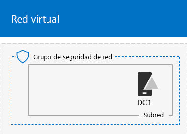

# <a name="base-configuration-devtest-environment"></a>Entorno de desarrollo y prueba de la configuración básica

 **Resumen:** Cree una intranet simplificada como entorno de desarrollo y prueba en Microsoft Azure.
  
En este artículo se ofrecen instrucciones para crear el siguiente entorno de desarrollo y prueba de la configuración básica en Azure:
  

  
**Figura 1: Entorno de desarrollo y prueba de la configuración básica**

El entorno de desarrollo y prueba de la configuración básica de la figura 1 consta de la subred de la red corporativa en una red virtual de Azure solo de nube denominada TestLab que simula una intranet simplificada y privada conectada a Internet. Contiene tres máquinas virtuales de Azure con Windows Server 2016:
  
- DC1 está configurado como controlador de dominio de intranet y servidor del Sistema de nombres de dominio (DNS)
    
- App1 está configurada como servidor web y de aplicación general
    
- CLIENT1 actúa como cliente de intranet
    
Con esta configuración, DC1, APP1, CLIENT1 y otros equipos de la subred de red corporativa pueden: 
  
- Conectarse a Internet para instalar actualizaciones, obtener acceso a recursos de Internet en tiempo real y participar en tecnologías de nube pública como Office 365 y otros servicios de Azure.
    
- Administrarse de manera remota con conexiones a Escritorio remoto desde el equipo que está conectado a Internet o la red de su organización.
    
Puede usar el entorno de pruebas resultante:
  
- Para desarrollar y probar aplicaciones.
    
- Como configuración inicial de un entorno de pruebas ampliado que haya diseñado usted mismo y que incluya máquinas virtuales adicionales, servicios de Azure u otras ofertas de nube de Microsoft tales como Office 365 y Enterprise Mobility + Security (EMS).
    
Existen dos métodos para crear este entorno:

1. Una plantilla de Azure Resource Manager
2. Azure PowerShell

## <a name="method-1-build-your-simulated-intranet-with-an-azure-resource-manager-template"></a>Método 1: Crear la intranet simulada con una plantilla de Azure Resource Manager.

En este método, usará una plantilla de Azure Resource Manager (ARM) para crear la intranet simulada. Las plantillas ARM contienen todas las instrucciones para crear y configurar la infraestructura de red de Azure y las máquinas virtuales.

Antes de implementar la plantilla, lea la [Página de plantilla Léame](https://github.com/maxskunkworks/TLG/tree/master/tlg-base-config_3-vm) y prepare la siguiente información:

- El nombre de la suscripción de Azure. Tendrá que escribir esta etiqueta en el campo **suscripción** de la página **Implementación personalizada**.
- El nombre del grupo de recursos de Azure. Tendrá que escribir esta etiqueta en el campo **grupo de recursos** de la página **Implementación personalizada**.
- Un prefijo de etiqueta DNS para las URL de las direcciones IP públicas de sus máquinas virtuales. Tendrá que escribir esta etiqueta en el campo **Prefijo de etiqueta Dns** de la página **implementación personalizada**.

Después de leer las instrucciones, haga clic en **Implementar en Azure** en la [página de plantilla Léame](https://github.com/maxskunkworks/TLG/tree/master/tlg-base-config_3-vm) para empezar.

>[!Note]
>La intranet simulada creada por la plantilla ARM requiere una suscripción pagada de Azure.
>

Esta es la configuración una vez completada la plantilla.


## <a name="method-2-build-your-simulated-intranet-with-azure-powershell"></a>Método 2: Crear la intranet simulada con Azure PowerShell

En este método, utilizará Windows PowerShell y el módulo de Azure PowerShell para crear la infraestructura de red, las máquinas virtuales y su configuración.

Use este método si desea obtener experiencia en la creación de elementos de una infraestructura de Azure añadiendo uno a uno los bloques de comando con PowerShell. Puede personalizar los bloques de comandos de PowerShell para la implementación de otras máquinas virtuales en Azure.

Existen cuatro pasos para configurar el entorno de pruebas de configuración básica en Azure PowerShell:
  
1. Crear la red virtual.
    
2. Configurar DC1.
    
3. Configurar APP1.
    
4. Configurar CLIENT1.
    
Si no dispone de una suscripción de Azure, puede registrarse para obtener una evaluación gratuita en [Cree su cuenta gratuita de Azure hoy mismo](https://azure.microsoft.com/pricing/free-trial/). Si tiene una suscripción a MSDN o a Visual Studio, vea [Crédito mensual de Azure para suscriptores de Visual Studio](https://azure.microsoft.com/pricing/member-offers/msdn-benefits-details/). 
  
> [!NOTE]
> Las máquinas virtuales de Azure implican un costo económico constante cuando se ejecutan. Este costo se factura a la evaluación gratuita, la suscripción a MSDN o la suscripción de pago. Para obtener más información sobre los costos de las máquinas virtuales de Azure en ejecución, vea [Máquinas virtuales Precios](https://azure.microsoft.com/pricing/details/virtual-machines/) y [Calculadora de precios de Azure](https://azure.microsoft.com/pricing/calculator/). Para mantener los costos bajos, consulte [Minimizar los costos del entorno de pruebas de máquinas virtuales en Azure](base-configuration-dev-test-environment.md#mincost). 
  

  
> [!TIP]
> Haga clic [aquí](http://aka.ms/catlgstack) para ver un mapa visual de todos los artículos en la pila de la Guía del entorno de pruebas de Office 365.
  
### <a name="step-1-create-the-virtual-network"></a>Paso 1: Crear la red virtual

En este paso, creará la red virtual de TestLab en Azure.

En primer lugar, abra un símbolo del sistema de Azure PowerShell.
  
> [!NOTE]
> Los siguientes conjuntos de comandos utilizan la última versión de Azure PowerShell. Vea [Get started with Azure PowerShell cmdlets](https://docs.microsoft.com/en-us/powershell/azureps-cmdlets-docs/) (Introducción a los cmdlets de Azure PowerShell). 
  
Inicie sesión en su cuenta de Azure con el siguiente comando.
  
```
Connect-AzAccount
```

> [!TIP]
> Para obtener un archivo de texto que contenga todos los comandos de PowerShell de este artículo, haga clic [aquí](https://gallery.technet.microsoft.com/PowerShell-commands-for-ba957d3d).

Obtenga su nombre de suscripción mediante el comando siguiente.
  
```
Get-AzSubscription | Sort Name | Select Name
```

Configure su suscripción de Azure. Cambie todo el contenido entrecomillado, incluidos los caracteres < y >, por los nombres correctos.
  
```
$subscrName="<subscription name>"
Select-AzSubscription -SubscriptionName $subscrName
```

Después, cree un nuevo grupo de recursos para su entorno de pruebas de configuración básica. Para determinar un nombre único de grupo de recursos, use este comando a fin de enumerar los grupos de recursos existentes.
  
```
Get-AzResourceGroup | Sort ResourceGroupName | Select ResourceGroupName
```

Cree el nuevo grupo de recursos con estos comandos. Reemplace todo el contenido entrecomillado, incluidos los caracteres < y >, por los nombres correctos.
  
```
$rgName="<resource group name>"
$locName="<location name, such as West US>"
New-AzResourceGroup -Name $rgName -Location $locName
```

Después, cree la red virtual de TestLab que hospedará la subred de la red corporativa de la configuración básica y la protegerá con un grupo de seguridad de red.
  
```
$rgName="<name of your new resource group>"
$locName=(Get-AzResourceGroup -Name $rgName).Location
$corpnetSubnet=New-AzVirtualNetworkSubnetConfig -Name Corpnet -AddressPrefix 10.0.0.0/24
New-AzVirtualNetwork -Name TestLab -ResourceGroupName $rgName -Location $locName -AddressPrefix 10.0.0.0/8 -Subnet $corpnetSubnet -DNSServer 10.0.0.4
$rule1=New-AzNetworkSecurityRuleConfig -Name "RDPTraffic" -Description "Allow RDP to all VMs on the subnet" -Access Allow -Protocol Tcp -Direction Inbound -Priority 100 -SourceAddressPrefix Internet -SourcePortRange * -DestinationAddressPrefix * -DestinationPortRange 3389
New-AzNetworkSecurityGroup -Name Corpnet -ResourceGroupName $rgName -Location $locName -SecurityRules $rule1
$vnet=Get-AzVirtualNetwork -ResourceGroupName $rgName -Name TestLab
$nsg=Get-AzNetworkSecurityGroup -Name Corpnet -ResourceGroupName $rgName
Set-AzVirtualNetworkSubnetConfig -VirtualNetwork $vnet -Name Corpnet -AddressPrefix "10.0.0.0/24" -NetworkSecurityGroup $nsg
$vnet | Set-AzVirtualNetwork
```

Esta es su configuración actual.
  

  
### <a name="step-2-configure-dc1"></a>Paso 2: Configurar DC1

En este paso, creamos la máquina virtual DC1 y la configuramos como controlador de dominio para el dominio corp.contoso.com de Servicios de dominio de Active Directory (AD DS) y como servidor DNS para las máquinas virtuales de la red virtual TestLab.

> [!NOTE]
> Antes de ejecutar el bloque de comandos siguiente, asegúrese de que la región de Azure (ubicación) que ha elegido es compatible con el tamaño de la máquina virtual de Azure, que está establecido por defecto en Standard_A1. Haga clic [aquí](https://azure.microsoft.com/global-infrastructure/services/?products=virtual-machines) para ver la información más reciente sobre los tamaños y ubicaciones de la máquina virtual de Azure.
  
Para crear una máquina virtual de Azure para DC1, indique el nombre de su grupo de recursos y ejecute estos comandos desde el símbolo del sistema de Azure PowerShell en su equipo local.
  
```
$rgName="<resource group name>"
$locName=(Get-AzResourceGroup -Name $rgName).Location
$vnet=Get-AzVirtualNetwork -Name TestLab -ResourceGroupName $rgName
$pip=New-AzPublicIpAddress -Name DC1-PIP -ResourceGroupName $rgName -Location $locName -AllocationMethod Dynamic
$nic=New-AzNetworkInterface -Name DC1-NIC -ResourceGroupName $rgName -Location $locName -SubnetId $vnet.Subnets[0].Id -PublicIpAddressId $pip.Id -PrivateIpAddress 10.0.0.4
$vm=New-AzVMConfig -VMName DC1 -VMSize Standard_A1
$cred=Get-Credential -Message "Type the name and password of the local administrator account for DC1."
$vm=Set-AzVMOperatingSystem -VM $vm -Windows -ComputerName DC1 -Credential $cred -ProvisionVMAgent -EnableAutoUpdate
$vm=Set-AzVMSourceImage -VM $vm -PublisherName MicrosoftWindowsServer -Offer WindowsServer -Skus 2016-Datacenter -Version "latest"
$vm=Add-AzVMNetworkInterface -VM $vm -Id $nic.Id
$vm=Set-AzVMOSDisk -VM $vm -Name "DC1-OS" -DiskSizeInGB 128 -CreateOption FromImage -StorageAccountType "Standard_LRS"
$diskConfig=New-AzDiskConfig -AccountType "Standard_LRS" -Location $locName -CreateOption Empty -DiskSizeGB 20
$dataDisk1=New-AzDisk -DiskName "DC1-DataDisk1" -Disk $diskConfig -ResourceGroupName $rgName
$vm=Add-AzVMDataDisk -VM $vm -Name "DC1-DataDisk1" -CreateOption Attach -ManagedDiskId $dataDisk1.Id -Lun 1
New-AzVM -ResourceGroupName $rgName -Location $locName -VM $vm
```

Se le pedirá un nombre de usuario y una contraseña para la cuenta de administrador local en DC1. Use una contraseña segura y registre el nombre de usuario y la contraseña en una ubicación segura.
  
Después conéctese a la máquina virtual DC1.
  
1. En el [Azure Portal](https://portal.azure.com), haga clic en **Grupos de recursos** [nombre del nuevo grupo de recursos nuevo] **> DC1 > Conectar**.
    
2. En el panel abierto, haga clic en **Descargar archivo RDP**. Abra el archivo DC1.rdp descargado y, después, haga clic en **Conectar**.
    
3. Especifique el nombre de la cuenta del administrador local de DC1:
    
  - Para Windows 7:
    
    En el cuadro de diálogo **Seguridad de Windows**, haga clic en **Usar otra cuenta**. En **Nombre de usuario**, escriba **DC1\\**[nombre de la cuenta de administrador local].
    
  - Para Windows 8 o Windows 10:
    
    En el cuadro de diálogo **Seguridad de Windows**, haga clic en **Más opciones** y luego en **Usar una cuenta diferente**. En **Nombre de usuario**, escriba **DC1\\**[nombre de la cuenta de administrador local]
    
4. En **Contraseña**, escriba la contraseña de la cuenta de administrador local y luego haga clic en **Aceptar**.
    
5. Cuando se le solicite, haga clic en **Sí**.
    
Después, agregue otro disco de datos como nuevo volumen con la letra de unidad F: con este comando en un símbolo del sistema de Windows PowerShell con nivel de administrador en DC1.
  
```
Get-Disk | Where PartitionStyle -eq "RAW" | Initialize-Disk -PartitionStyle MBR -PassThru | New-Partition -AssignDriveLetter -UseMaximumSize | Format-Volume -FileSystem NTFS -NewFileSystemLabel "WSAD Data"
```

A continuación, configure DC1 como controlador de dominio y servidor DNS para el dominio corp.contoso.com. En un símbolo del sistema de Windows PowerShell con el nivel de administrador, ejecute estos comandos:
  
```
Install-WindowsFeature AD-Domain-Services -IncludeManagementTools
Install-ADDSForest -DomainName corp.contoso.com -DatabasePath "F:\NTDS" -SysvolPath "F:\SYSVOL" -LogPath "F:\Logs"
```
Debe especificar una contraseña de administrador de modo seguro. Guarde esta contraseña en un lugar seguro.
  
Tenga en cuenta que estos comandos pueden tardan unos minutos en completarse.
  
Después de que DC1 se reinicie, vuelva a conectarse a la máquina virtual de DC1 con las credenciales del dominio.
  
1. En [Azure Portal](https://portal.azure.com), haga clic en **Grupos de recursos >** [nombre del grupo de recursos] **> DC1 > Conectar**.
    
2. Ejecute el archivo DC1.rdp que se descarga y luego haga clic en **Conectar**.
    
3. En **Seguridad de Windows**, haga clic en **Usar otra cuenta**. En **Nombre de usuario**, escriba **CORP\\**[nombre de la cuenta de administrador local].
    
4. En **Contraseña**, escriba la contraseña de la cuenta de administrador local y luego haga clic en **Aceptar**.
    
5. Cuando se le solicite, haga clic en **Sí**.
    
A continuación, cree una cuenta de usuario en Active Directory que se usará al iniciar sesión en equipos de miembros del dominio CORP. En un símbolo del sistema de Windows PowerShell con un nivel de administrador, ejecute este comando:
  
```
New-ADUser -SamAccountName User1 -AccountPassword (read-host "Set user password" -assecurestring) -name "User1" -enabled $true -PasswordNeverExpires $true -ChangePasswordAtLogon $false
```

Tenga en cuenta que este comando le solicita que proporcione la contraseña de la cuenta User1. Dado que esta cuenta se usará para las conexiones de Escritorio remoto en todos los equipos miembros del dominio CORP, elija una contraseña segura. Anote la contraseña de la cuenta User1 y almacénela en una ubicación segura.
  
Después, configure la nueva cuenta User1 como administrador de empresa. En un símbolo del sistema de Windows PowerShell con nivel de administrador, ejecute este comando.
  
```
Add-ADPrincipalGroupMembership -Identity "CN=User1,CN=Users,DC=corp,DC=contoso,DC=com" -MemberOf "CN=Enterprise Admins,CN=Users,DC=corp,DC=contoso,DC=com","CN=Domain Admins,CN=Users,DC=corp,DC=contoso,DC=com","CN=Schema Admins,CN=Users,DC=corp,DC=contoso,DC=com"
```

Cierre la sesión de Escritorio remoto con DC1 y vuelva a conectarse con la cuenta CORP\\User1.
  
Después, para permitir el tráfico desde la herramienta Ping, ejecute este comando desde un símbolo del sistema de Windows PowerShell con nivel de administrador:
  
```
Set-NetFirewallRule -DisplayName "File and Printer Sharing (Echo Request - ICMPv4-In)" -enabled True
```

Esta es su configuración actual.
  

  
### <a name="step-3-configure-app1"></a>Paso 3: Configurar APP1

En este paso, creará y configurará APP1, que proporciona servicios de uso compartido de archivos y web.

> [!NOTE]
> Antes de ejecutar el bloque de comandos siguiente, asegúrese de que la región de Azure (ubicación) que ha elegido es compatible con el tamaño de la máquina virtual de Azure, que está establecido por defecto en Standard_A1. Haga clic [aquí](https://azure.microsoft.com/global-infrastructure/services/?products=virtual-machines) para ver la información más reciente sobre los tamaños y ubicaciones de la máquina virtual de Azure.
  
Para crear una máquina virtual de Azure para APP1, indique el nombre de su grupo de recursos y ejecute estos comandos desde el símbolo del sistema de Azure PowerShell en su equipo local.
  
```
$rgName="<resource group name>"
$locName=(Get-AzResourceGroup -Name $rgName).Location
$vnet=Get-AzVirtualNetwork -Name TestLab -ResourceGroupName $rgName
$pip=New-AzPublicIpAddress -Name APP1-PIP -ResourceGroupName $rgName -Location $locName -AllocationMethod Dynamic
$nic=New-AzNetworkInterface -Name APP1-NIC -ResourceGroupName $rgName -Location $locName -SubnetId $vnet.Subnets[0].Id -PublicIpAddressId $pip.Id
$vm=New-AzVMConfig -VMName APP1 -VMSize Standard_A1
$cred=Get-Credential -Message "Type the name and password of the local administrator account for APP1."
$vm=Set-AzVMOperatingSystem -VM $vm -Windows -ComputerName APP1 -Credential $cred -ProvisionVMAgent -EnableAutoUpdate
$vm=Set-AzVMSourceImage -VM $vm -PublisherName MicrosoftWindowsServer -Offer WindowsServer -Skus 2016-Datacenter -Version "latest"
$vm=Add-AzVMNetworkInterface -VM $vm -Id $nic.Id
$vm=Set-AzVMOSDisk -VM $vm -Name "APP1-OS" -DiskSizeInGB 128 -CreateOption FromImage -StorageAccountType "Standard_LRS"
New-AzVM -ResourceGroupName $rgName -Location $locName -VM $vm
```

Después, conéctese a la máquina virtual de APP1 usando el nombre y la contraseña de la cuenta de administrador local de APP1 y abra un símbolo del sistema de Windows PowerShell.
  
Para comprobar la comunicación de red y la resolución de nombres entre APP1 y DC1, ejecute el comando **ping dc1.corp.contoso.com** y compruebe que hay cuatro respuestas.
  
Después, una la máquina virtual de APP1 al dominio CORP con estos comandos en un símbolo del sistema de Windows PowerShell.
  
```
Add-Computer -DomainName corp.contoso.com
Restart-Computer
```

Recuerde que debe indicar las credenciales de la cuenta de dominio CORP\\User1 después de ejecutar el comando **Add-Computer**.
  
Una vez reiniciado APP1, conéctese a él con la cuenta CORP\\User1 y luego abra un símbolo del sistema de Windows PowerShell con nivel de administrador.
  
Después, convierta a APP1 en un servidor web con este comando en el símbolo del sistema de Windows PowerShell en APP1.
  
```
Install-WindowsFeature Web-WebServer -IncludeManagementTools
```

Por último, cree una carpeta compartida y un archivo de texto dentro de la carpeta en APP1 con estos comandos de PowerShell.
  
```
New-Item -path c:\files -type directory
Write-Output "This is a shared file." | out-file c:\files\example.txt
New-SmbShare -name files -path c:\files -changeaccess CORP\User1
```

Esta es su configuración actual.
  

  
### <a name="step-4-configure-client1"></a>Paso 4: Configurar CLIENT1.

En este paso, creará y configurará CLIENT1, que actúa como un equipo de escritorio, una tableta o un portátil típico de la intranet de Contoso.

> [!NOTE]  
> El siguiente conjunto de comandos crea CLIENT1 con Windows Server 2016 Datacenter, lo que se puede realizar en todos los tipos de suscripciones de Azure. Si tiene una suscripción de Azure basada en Visual Studio, puede crear CLIENT1 con Windows 10 en [Azure Portal](https://portal.azure.com). 
  

> [!NOTE]
> Antes de ejecutar el bloque de comandos siguiente, asegúrese de que la región de Azure (ubicación) que ha elegido es compatible con el tamaño de la máquina virtual de Azure, que está establecido por defecto en Standard_A1. Haga clic [aquí](https://azure.microsoft.com/global-infrastructure/services/?products=virtual-machines) para ver la información más reciente sobre los tamaños y ubicaciones de la máquina virtual de Azure.
  
Para crear una máquina virtual de Azure para CLIENT1, indique el nombre de su grupo de recursos y ejecute estos comandos desde el símbolo del sistema de Azure PowerShell en su equipo local.
  
```
$rgName="<resource group name>"
$locName=(Get-AzResourceGroup -Name $rgName).Location
$vnet=Get-AzVirtualNetwork -Name TestLab -ResourceGroupName $rgName
$pip=New-AzPublicIpAddress -Name CLIENT1-PIP -ResourceGroupName $rgName -Location $locName -AllocationMethod Dynamic
$nic=New-AzNetworkInterface -Name CLIENT1-NIC -ResourceGroupName $rgName -Location $locName -SubnetId $vnet.Subnets[0].Id -PublicIpAddressId $pip.Id
$vm=New-AzVMConfig -VMName CLIENT1 -VMSize Standard_A1
$cred=Get-Credential -Message "Type the name and password of the local administrator account for CLIENT1."
$vm=Set-AzVMOperatingSystem -VM $vm -Windows -ComputerName CLIENT1 -Credential $cred -ProvisionVMAgent -EnableAutoUpdate
$vm=Set-AzVMSourceImage -VM $vm -PublisherName MicrosoftWindowsServer -Offer WindowsServer -Skus 2016-Datacenter -Version "latest"
$vm=Add-AzVMNetworkInterface -VM $vm -Id $nic.Id
$vm=Set-AzVMOSDisk -VM $vm -Name "CLIENT1-OS" -DiskSizeInGB 128 -CreateOption FromImage -StorageAccountType "Standard_LRS"
New-AzVM -ResourceGroupName $rgName -Location $locName -VM $vm
```

Después, conéctese a la máquina virtual de CLIENT1 usando el nombre y la contraseña de la cuenta de administrador local de CLIENT1, y abra un símbolo del sistema de nivel de administrador de Windows PowerShell.
  
Para comprobar la comunicación de red y la resolución de nombres entre CLIENT1 y DC1, ejecute el comando **ping dc1.corp.contoso.com** en un símbolo del sistema de Windows PowerShell y compruebe que hay cuatro respuestas.
  
Después, una la máquina virtual de CLIENT1 al dominio CORP con estos comandos en un símbolo del sistema de Windows PowerShell.
  
```
Add-Computer -DomainName corp.contoso.com
Restart-Computer
```

Recuerde que debe indicar las credenciales de la cuenta de dominio CORP\\User1 después de ejecutar el comando **Add-Computer**.
  
Una vez reiniciado CLIENT1, conéctese a él con el nombre y contraseña de la cuenta CORP\\User1 y luego abra un símbolo del sistema de nivel de administrador de Windows PowerShell.
  
Después, compruebe que tiene acceso a recursos compartidos de archivos y web en APP1 desde CLIENT1.
  
1. En el panel de árbol del Administrador del servidor, haga clic en **Servidor Local**.
    
2. En **Propiedades de CLIENT1**, haga clic en la opción **Activada** al lado de **Configuración de seguridad mejorada de IE**.
    
3. En **Configuración de seguridad mejorada de Internet Explorer**, haga clic en **Desactivada** para **Administradores** y **Usuarios** y luego, en **Aceptar**.
    
4. En la pantalla Inicio, haga clic en **Internet Explorer** y, después, en **Aceptar**.
    
5. En la barra de direcciones, escriba **http:\//app1.corp.contoso.com/** y, después, presione ENTRAR. Verá la página web predeterminada de Internet Information Services para APP1.
    
6. En la barra de tareas del escritorio, haga clic en el icono del Explorador de archivos.
    
7. En la barra de direcciones, escriba **\\\\app1\\Files** y luego presione ENTRAR. Debería ver una ventana de carpeta con el contenido de la carpeta compartida Archivos.
    
8. En la ventana de la carpeta compartida **Archivos**, haga doble clic en el archivo **Example.txt**. Debería ver el contenido del archivo Example.txt.
    
9. Cierre las ventanas de **Example.txt: Bloc de notas** y de la carpeta compartida **Archivos**.
    
Esta es la configuración final.
  

  
La configuración básica de Azure está preparada para desarrollar y probar aplicaciones o para crear entornos de prueba adicionales. 
  
> [!TIP]
> Haga clic [aquí](http://aka.ms/catlgstack) para ver un mapa visual de todos los artículos de la pila de la guía del entorno de pruebas de Office 365.
  
<a name="mincost"> </a>
## <a name="minimizing-the-costs-of-test-environment-virtual-machines-in-azure"></a>Minimizar los costos del entorno de pruebas de máquinas virtuales en Azure

Para minimizar el costo de ejecutar máquinas virtuales de entorno de pruebas, puede realizar una de las siguientes acciones:
  
- Crear el entorno de pruebas y realizar las pruebas necesarias y la demostración lo más rápidamente posible. Cuando haya terminado, elimine el grupo de recursos del entorno de pruebas.
    
- Ponga las máquinas virtuales del entorno de pruebas virtual en un estado desasignado.
    
Para apagar las máquinas virtuales con Azure PowerShell, rellene el nombre del grupo de recursos y ejecute estos comandos.
  
```
$rgName="<your resource group name>"
Stop-AzVM -ResourceGroupName $rgName -Name "CLIENT1" -Force
Stop-AzVM -ResourceGroupName $rgName -Name "APP1" -Force
Stop-AzVM -ResourceGroupName $rgName -Name "DC1" -Force
```

Para asegurarse de que las máquinas virtuales funcionan correctamente al iniciarlas todas desde el estado Detenido (Desasignado), debe iniciarlas en el orden siguiente:
  
1. DC1
2. APP1
3. CLIENT1
    
Para iniciar las máquinas virtuales en orden con Azure PowerShell, indique el nombre del grupo de recursos y ejecute estos comandos.
  
```
$rgName="<your resource group name>"
Start-AzVM -ResourceGroupName $rgName -Name "DC1"
Start-AzVM -ResourceGroupName $rgName -Name "APP1"
Start-AzVM -ResourceGroupName $rgName -Name "CLIENT1"
```

## <a name="see-also"></a>Vea también

- [Entorno de desarrollo y prueba de Office 365](office-365-dev-test-environment.md)
- [Sincronización de directorios (DirSync) para el entorno de desarrollo y pruebas de Office 365](dirsync-for-your-office-365-dev-test-environment.md)
- [Protección contra amenazas avanzada en el entorno de desarrollo y prueba de Office 365](advanced-threat-protection-for-your-office-365-dev-test-environment.md)
- [Adopción de la nube y soluciones híbridas](cloud-adoption-and-hybrid-solutions.md)
