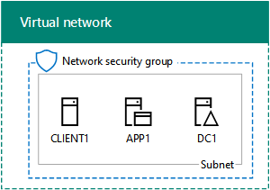

# <a name="base-configuration-devtest-environment"></a><span data-ttu-id="b85fb-103">Entorno de desarrollo y prueba de la configuración básica</span><span class="sxs-lookup"><span data-stu-id="b85fb-103">Base Configuration dev/test environment</span></span>

 <span data-ttu-id="b85fb-104">**Resumen:** Cree una intranet simplificada como entorno de desarrollo y prueba en Microsoft Azure.</span><span class="sxs-lookup"><span data-stu-id="b85fb-104">**Summary:** Create a simplified intranet as a dev/test environment in Microsoft Azure.</span></span>
  
<span data-ttu-id="b85fb-105">En este artículo se ofrecen instrucciones paso a paso para crear el siguiente entorno de desarrollo y prueba de la configuración básica en Azure:</span><span class="sxs-lookup"><span data-stu-id="b85fb-105">This article provides you with step-by-step instructions to create the following Base Configuration dev/test environment in Azure:</span></span>
  
<span data-ttu-id="b85fb-106">**Figura 1: Entorno de desarrollo y prueba de la configuración básica**</span><span class="sxs-lookup"><span data-stu-id="b85fb-106">**Figure 1: The Base Configuration dev/test environment**</span></span>


  
<span data-ttu-id="b85fb-p101">El entorno de desarrollo y prueba de la configuración básica de la figura 1 consta de la subred de la red corporativa en una red virtual de Azure solo de nube denominada TestLab que simula una intranet simplificada y privada conectada a Internet. Contiene tres máquinas virtuales de Azure con Windows Server 2016:</span><span class="sxs-lookup"><span data-stu-id="b85fb-p101">The Base Configuration dev/test environment in Figure 1 consists of the Corpnet subnet in a cloud-only Azure virtual network named TestLab that simulates a simplified, private intranet connected to the Internet. It contains three Azure virtual machines running Windows Server 2016:</span></span>
  
- <span data-ttu-id="b85fb-110">DC1 está configurado como controlador de dominio de intranet y servidor del Sistema de nombres de dominio (DNS)</span><span class="sxs-lookup"><span data-stu-id="b85fb-110">DC1 is configured as an intranet domain controller and Domain Name System (DNS) server</span></span>
    
- <span data-ttu-id="b85fb-111">App1 está configurada como servidor web y de aplicación general</span><span class="sxs-lookup"><span data-stu-id="b85fb-111">APP1 is configured as a general application and web server</span></span>
    
- <span data-ttu-id="b85fb-112">CLIENT1 actúa como cliente de intranet</span><span class="sxs-lookup"><span data-stu-id="b85fb-112">CLIENT1 acts as an intranet client</span></span>
    
<span data-ttu-id="b85fb-113">Con esta configuración, DC1, APP1, CLIENT1 y otros equipos de la subred de red corporativa pueden:</span><span class="sxs-lookup"><span data-stu-id="b85fb-113">This configuration allows DC1, APP1, CLIENT1, and additional Corpnet subnet computers to be:</span></span> 
  
- <span data-ttu-id="b85fb-114">Conectarse a Internet para instalar actualizaciones, obtener acceso a recursos de Internet en tiempo real y participar en tecnologías de nube pública como Office 365 y otros servicios de Azure.</span><span class="sxs-lookup"><span data-stu-id="b85fb-114">Connected to the Internet to install updates, access Internet resources in real time, and participate in public cloud technologies such as Office 365 and other Azure services.</span></span>
    
- <span data-ttu-id="b85fb-115">Administrarse de manera remota con conexiones a Escritorio remoto desde el equipo que está conectado a Internet o la red de su organización.</span><span class="sxs-lookup"><span data-stu-id="b85fb-115">Remotely managed using Remote Desktop connections from your computer that is connected to the Internet or your organization network.</span></span>
    
<span data-ttu-id="b85fb-116">Puede usar el entorno de pruebas resultante:</span><span class="sxs-lookup"><span data-stu-id="b85fb-116">You can use the resulting test environment:</span></span>
  
- <span data-ttu-id="b85fb-117">Para desarrollar y probar aplicaciones.</span><span class="sxs-lookup"><span data-stu-id="b85fb-117">For application development and testing.</span></span>
    
- <span data-ttu-id="b85fb-118">Como configuración inicial de un entorno de pruebas ampliado que haya diseñado usted mismo y que incluya máquinas virtuales adicionales, servicios de Azure u otras ofertas de nube de Microsoft tales como Office 365 y Enterprise Security + Mobility (EMS).</span><span class="sxs-lookup"><span data-stu-id="b85fb-118">As the initial configuration of an extended test environment of your own design that includes additional virtual machines, Azure services, or other Microsoft cloud offerings such as Microsoft Office 365 and Microsoft Intune.</span></span>
    
<span data-ttu-id="b85fb-119">Existen cuatro fases para configurar el entorno de pruebas de configuración básica en Azure:</span><span class="sxs-lookup"><span data-stu-id="b85fb-119">There are four phases to setting up the Base Configuration test environment in Azure:</span></span>
  
1. <span data-ttu-id="b85fb-120">Crear la red virtual.</span><span class="sxs-lookup"><span data-stu-id="b85fb-120">Create the virtual network.</span></span>
    
2. <span data-ttu-id="b85fb-121">Configurar DC1.</span><span class="sxs-lookup"><span data-stu-id="b85fb-121">Configure DC1.</span></span>
    
3. <span data-ttu-id="b85fb-122">Configurar APP1.</span><span class="sxs-lookup"><span data-stu-id="b85fb-122">Configure APP1.</span></span>
    
4. <span data-ttu-id="b85fb-123">Configurar CLIENT1.</span><span class="sxs-lookup"><span data-stu-id="b85fb-123">Configure CLIENT1.</span></span>
    
<span data-ttu-id="b85fb-p102">Si no dispone de una suscripción de Azure, puede registrarse para obtener una evaluación gratuita en [Cree su cuenta gratuita de Azure hoy mismo](https://azure.microsoft.com/pricing/free-trial/). Si tiene una suscripción a MSDN o a Visual Studio, vea [Crédito mensual de Azure para suscriptores de Visual Studio](https://azure.microsoft.com/pricing/member-offers/msdn-benefits-details/). </span><span class="sxs-lookup"><span data-stu-id="b85fb-p102">If you do not already have an Azure subscription, you can sign up for a free trial at [Try Azurehttps://azure.microsoft.com/pricing/free-trial/](https://azure.microsoft.com/pricing/free-trial/). If you have an MSDN or Visual Studio subscription, see [Monthly Azure credit for Visual Studio subscribershttps://azure.microsoft.com/pricing/member-offers/msdn-benefits-details/](https://azure.microsoft.com/pricing/member-offers/msdn-benefits-details/).</span></span>
  
> [!NOTE]
> <span data-ttu-id="b85fb-p103">Las máquinas virtuales de Azure implican un costo económico constante cuando se ejecutan. Este costo se factura a la evaluación gratuita, la suscripción a MSDN o la suscripción de pago. Para obtener más información sobre los costos de las máquinas virtuales de Azure en ejecución, vea [Máquinas virtuales Precios](https://azure.microsoft.com/pricing/details/virtual-machines/) y [Calculadora de precios de Azure](https://azure.microsoft.com/pricing/calculator/). Para mantener los costos bajos, consulte [Minimizar los costos del entorno de pruebas de máquinas virtuales en Azure](base-configuration-dev-test-environment.md#mincost).</span><span class="sxs-lookup"><span data-stu-id="b85fb-p103">Virtual machines in Azure incur an ongoing monetary cost when they are running. This cost is billed against your free trial, MSDN subscription, or paid subscription. For more information about the costs of running Azure virtual machines, see [Virtual Machines Pricing Detailshttps://azure.microsoft.com/pricing/details/virtual-machines/](https://azure.microsoft.com/pricing/details/virtual-machines/) and [Azure Pricing Calculatorhttps://azure.microsoft.com/pricing/calculator/](https://azure.microsoft.com/pricing/calculator/). To keep costs down, see [Minimizing the costs of test environment virtual machines in Azure](base-configuration-dev-test-environment.md#mincost).</span></span> 
  

  
> [!TIP]
> <span data-ttu-id="b85fb-131">Haga clic [aquí](http://aka.ms/catlgstack) para ver un mapa visual de todos los artículos de la pila de la Guía del entorno de pruebas de One Microsoft Cloud.</span><span class="sxs-lookup"><span data-stu-id="b85fb-131">Click [here](http://aka.ms/catlgstack) for a visual map to all the articles in the One Microsoft Cloud Test Lab Guide stack.</span></span>
  
## <a name="phase-1-create-the-virtual-network"></a><span data-ttu-id="b85fb-132">Fase 1: Crear la red virtual</span><span class="sxs-lookup"><span data-stu-id="b85fb-132">Phase 1: Create the virtual network</span></span>

<span data-ttu-id="b85fb-133">En primer lugar, abra un símbolo del sistema de Azure PowerShell.</span><span class="sxs-lookup"><span data-stu-id="b85fb-133">First, start an Azure PowerShell prompt.</span></span>
  
> [!NOTE]
> <span data-ttu-id="b85fb-p104">Los siguientes conjuntos de comandos utilizan la última versión de Azure PowerShell. Vea [Get started with Azure PowerShell cmdlets](https://docs.microsoft.com/es-ES/powershell/azureps-cmdlets-docs/) (Introducción a los cmdlets de Azure PowerShell).</span><span class="sxs-lookup"><span data-stu-id="b85fb-p104">The following command sets use the latest version of Azure PowerShell. See [Get started with Azure PowerShell cmdlets](https://docs.microsoft.com/es-ES/powershell/azureps-cmdlets-docs/).</span></span> 
  
<span data-ttu-id="b85fb-136">Inicie sesión en su cuenta de Azure con el siguiente comando.</span><span class="sxs-lookup"><span data-stu-id="b85fb-136">Sign in to your Azure account with the following command.</span></span>
  
```
Login-AzureRMAccount
```

> [!TIP]
> <span data-ttu-id="b85fb-137">Para obtener un archivo de texto que contenga todos los comandos de PowerShell de este artículo, haga clic [aquí](https://gallery.technet.microsoft.com/PowerShell-commands-for-ba957d3d).</span><span class="sxs-lookup"><span data-stu-id="b85fb-137">Click [here](https://gallery.technet.microsoft.com/PowerShell-commands-for-ba957d3d) to get a text file that contains all of the PowerShell commands in this article.</span></span>
  
<span data-ttu-id="b85fb-138">Obtenga su nombre de suscripción mediante el comando siguiente.</span><span class="sxs-lookup"><span data-stu-id="b85fb-138">Get your subscription name using the following command.</span></span>
  
```
Get-AzureRMSubscription | Sort Name | Select Name
```

<span data-ttu-id="b85fb-p105">Configure su suscripción de Azure. Cambie todo el contenido entrecomillado, incluidos los caracteres < y >, por los nombres correctos.</span><span class="sxs-lookup"><span data-stu-id="b85fb-p105">Set your Azure subscription. Replace everything within the quotes, including the < and > characters, with the correct name.</span></span>
  
```
$subscr="<subscription name>"
Get-AzureRmSubscription -SubscriptionName $subscr | Select-AzureRmSubscription
```

<span data-ttu-id="b85fb-p106">Después, cree un nuevo grupo de recursos para su entorno de pruebas de configuración básica. Para determinar un nombre único de grupo de recursos, use este comando a fin de enumerar los grupos de recursos existentes.</span><span class="sxs-lookup"><span data-stu-id="b85fb-p106">Next, create a new resource group for your Base Configuration test lab. To determine a unique resource group name, use this command to list your existing resource groups.</span></span>
  
```
Get-AzureRMResourceGroup | Sort ResourceGroupName | Select ResourceGroupName
```

<span data-ttu-id="b85fb-p107">Cree el nuevo grupo de recursos con estos comandos. Reemplace todo el contenido entrecomillado, incluidos los caracteres < y >, por los nombres correctos.</span><span class="sxs-lookup"><span data-stu-id="b85fb-p107">Create your new resource group with these commands. Replace everything within the quotes, including the < and > characters, with the correct names.</span></span>
  
```
$rgName="<resource group name>"
$locName="<location name, such as West US>"
New-AzureRMResourceGroup -Name $rgName -Location $locName
```

<span data-ttu-id="b85fb-145">Después, cree la red virtual de TestLab que hospedará la subred de la red corporativa de la configuración básica y la protegerá con un grupo de seguridad de red.</span><span class="sxs-lookup"><span data-stu-id="b85fb-145">Next, you create the TestLab virtual network that will host the Corpnet subnet of the base configuration and protect it with a network security group.</span></span>
  
```
$rgName="<name of your new resource group>"
$locName=(Get-AzureRmResourceGroup -Name $rgName).Location
$corpnetSubnet=New-AzureRMVirtualNetworkSubnetConfig -Name Corpnet -AddressPrefix 10.0.0.0/24
New-AzureRMVirtualNetwork -Name TestLab -ResourceGroupName $rgName -Location $locName -AddressPrefix 10.0.0.0/8 -Subnet $corpnetSubnet -DNSServer 10.0.0.4
$rule1=New-AzureRMNetworkSecurityRuleConfig -Name "RDPTraffic" -Description "Allow RDP to all VMs on the subnet" -Access Allow -Protocol Tcp -Direction Inbound -Priority 100 -SourceAddressPrefix Internet -SourcePortRange * -DestinationAddressPrefix * -DestinationPortRange 3389
New-AzureRMNetworkSecurityGroup -Name Corpnet -ResourceGroupName $rgName -Location $locName -SecurityRules $rule1
$vnet=Get-AzureRMVirtualNetwork -ResourceGroupName $rgName -Name TestLab
$nsg=Get-AzureRMNetworkSecurityGroup -Name Corpnet -ResourceGroupName $rgName
Set-AzureRMVirtualNetworkSubnetConfig -VirtualNetwork $vnet -Name Corpnet -AddressPrefix "10.0.0.0/24" -NetworkSecurityGroup $nsg
```

<span data-ttu-id="b85fb-146">Esta es su configuración actual.</span><span class="sxs-lookup"><span data-stu-id="b85fb-146">This is your current configuration.</span></span>
  

  
## <a name="phase-2-configure-dc1"></a><span data-ttu-id="b85fb-148">Fase 2: Configurar DC1</span><span class="sxs-lookup"><span data-stu-id="b85fb-148">Phase 2: Configure DC1</span></span>

<span data-ttu-id="b85fb-149">A continuación, creamos la máquina virtual DC1 y la configuramos como controlador de dominio para el dominio corp.contoso.com de Windows Server Active Directory (AD) y como servidor DNS para las máquinas virtuales de la red virtual TestLab.</span><span class="sxs-lookup"><span data-stu-id="b85fb-149">In this phase, we create the DC1 virtual machine and configure it as a domain controller for the corp.contoso.com Windows Server Active Directory (AD) domain and a DNS server for the virtual machines of the TestLab virtual network.</span></span>
  
<span data-ttu-id="b85fb-150">Para crear una máquina virtual de Azure para DC1, indique el nombre de su grupo de recursos y ejecute estos comandos desde el símbolo del sistema de Azure PowerShell en su equipo local.</span><span class="sxs-lookup"><span data-stu-id="b85fb-150">To create an Azure virtual machine for DC1, fill in the name of your resource group, Azure location, and storage account name and run these commands at the Azure PowerShell command prompt on your local computer.</span></span>
  
```
$rgName="<resource group name>"
$locName=(Get-AzureRmResourceGroup -Name $rgName).Location
$vnet=Get-AzureRMVirtualNetwork -Name TestLab -ResourceGroupName $rgName
$pip=New-AzureRMPublicIpAddress -Name DC1-PIP -ResourceGroupName $rgName -Location $locName -AllocationMethod Dynamic
$nic=New-AzureRMNetworkInterface -Name DC1-NIC -ResourceGroupName $rgName -Location $locName -SubnetId $vnet.Subnets[0].Id -PublicIpAddressId $pip.Id -PrivateIpAddress 10.0.0.4
$vm=New-AzureRMVMConfig -VMName DC1 -VMSize Standard_A1
$cred=Get-Credential -Message "Type the name and password of the local administrator account for DC1."
$vm=Set-AzureRMVMOperatingSystem -VM $vm -Windows -ComputerName DC1 -Credential $cred -ProvisionVMAgent -EnableAutoUpdate
$vm=Set-AzureRMVMSourceImage -VM $vm -PublisherName MicrosoftWindowsServer -Offer WindowsServer -Skus 2016-Datacenter -Version "latest"
$vm=Add-AzureRMVMNetworkInterface -VM $vm -Id $nic.Id
$vm=Set-AzureRmVMOSDisk -VM $vm -Name "DC1-OS" -DiskSizeInGB 128 -CreateOption FromImage -StorageAccountType StandardLRS
$diskConfig=New-AzureRmDiskConfig -AccountType StandardLRS -Location $locName -CreateOption Empty -DiskSizeGB 20
$dataDisk1=New-AzureRmDisk -DiskName "DC1-DataDisk1" -Disk $diskConfig -ResourceGroupName $rgName
$vm=Add-AzureRmVMDataDisk -VM $vm -Name "DC1-DataDisk1" -CreateOption Attach -ManagedDiskId $dataDisk1.Id -Lun 1
New-AzureRMVM -ResourceGroupName $rgName -Location $locName -VM $vm
```

<span data-ttu-id="b85fb-p108">Se le pedirá un nombre de usuario y una contraseña para la cuenta de administrador local en DC1. Use una contraseña segura y registre el nombre de usuario y la contraseña en una ubicación segura.</span><span class="sxs-lookup"><span data-stu-id="b85fb-p108">You will be prompted for a user name and password for the local administrator account on DC1. Use a strong password and record both the name and password in a secure location.</span></span>
  
<span data-ttu-id="b85fb-153">Después conéctese a la máquina virtual DC1.</span><span class="sxs-lookup"><span data-stu-id="b85fb-153">Next, connect to the DC1 virtual machine.</span></span>
  
### <a name="connect-to-dc1-using-local-administrator-account-credentials"></a><span data-ttu-id="b85fb-154">Conectarse a DC1 con las credenciales de la cuenta de administrador local</span><span class="sxs-lookup"><span data-stu-id="b85fb-154">Connect to DC1 using local administrator account credentials</span></span>

1. <span data-ttu-id="b85fb-155">En el [Azure Portal](https://portal.azure.com), haga clic en **Grupos de recursos** [nombre del nuevo grupo de recursos nuevo] **> DC1 > Conectar**.</span><span class="sxs-lookup"><span data-stu-id="b85fb-155">In the Azure portal, click **Resource Groups > ** <the name of your new resource group> **> adVM > Connect**.</span></span>
    
2. <span data-ttu-id="b85fb-156">Abra el archivo DC1.rdp que se descarga y luego haga clic en **Conectar**.</span><span class="sxs-lookup"><span data-stu-id="b85fb-156">Open the DC1.rdp file that is downloaded, and then click **Connect**.</span></span>
    
3. <span data-ttu-id="b85fb-157">Especifique el nombre de cuenta de administrador local de DC1:</span><span class="sxs-lookup"><span data-stu-id="b85fb-157">Specify the DC1 local administrator account name:</span></span>
    
  - <span data-ttu-id="b85fb-158">Para Windows 7:</span><span class="sxs-lookup"><span data-stu-id="b85fb-158">For Windows 7:</span></span>
    
    <span data-ttu-id="b85fb-p109">En el cuadro de diálogo **Seguridad de Windows**, haga clic en **Usar otra cuenta**. En **Nombre de usuario**, escriba **DC1\\**[nombre de la cuenta de administrador local].</span><span class="sxs-lookup"><span data-stu-id="b85fb-p109">In the Windows Security dialog box, click Use another account. In User name, type DC1\[Local administrator account name]</span></span>
    
  - <span data-ttu-id="b85fb-161">Para Windows 8 o Windows 10:</span><span class="sxs-lookup"><span data-stu-id="b85fb-161">For Windows 8 or Windows 10:</span></span>
    
    <span data-ttu-id="b85fb-p110">En el cuadro de diálogo **Seguridad de Windows**, haga clic en **Más opciones** y luego en **Usar una cuenta diferente**. En **Nombre de usuario**, escriba **DC1\\**[nombre de la cuenta de administrador local]</span><span class="sxs-lookup"><span data-stu-id="b85fb-p110">In the Windows Security dialog box, click More choices, and then click Use a different account. In User name, type DC1\[Local administrator account name]</span></span>
    
4. <span data-ttu-id="b85fb-164">En **Contraseña**, escriba la contraseña de la cuenta de administrador local y luego haga clic en **Aceptar**.</span><span class="sxs-lookup"><span data-stu-id="b85fb-164">In **Password**, type the password of the local administrator account, and then click **OK**.</span></span>
    
5. <span data-ttu-id="b85fb-165">Cuando se le solicite, haga clic en **Sí**.</span><span class="sxs-lookup"><span data-stu-id="b85fb-165">When prompted, click **Yes**.</span></span>
    
<span data-ttu-id="b85fb-166">Después, agregue otro disco de datos como nuevo volumen con la letra de unidad F: con este comando en un símbolo del sistema de Windows PowerShell con nivel de administrador en DC1.</span><span class="sxs-lookup"><span data-stu-id="b85fb-166">Next, add an extra data disk as a new volume with the drive letter F: with these commands at an administrator-level Windows PowerShell command prompt.</span></span>
  
```
Get-Disk | Where PartitionStyle -eq "RAW" | Initialize-Disk -PartitionStyle MBR -PassThru | New-Partition -AssignDriveLetter -UseMaximumSize | Format-Volume -FileSystem NTFS -NewFileSystemLabel "WSAD Data"
```

<span data-ttu-id="b85fb-p111">A continuación, configure DC1 como controlador de dominio y servidor DNS para el dominio corp.contoso.com. En un símbolo del sistema de Windows PowerShell con el nivel de administrador, ejecute estos comandos:</span><span class="sxs-lookup"><span data-stu-id="b85fb-p111">Next, configure DC1 as a domain controller and DNS server for the corp.contoso.com domain. Run these commands at an administrator-level Windows PowerShell command prompt.</span></span>
  
```
Install-WindowsFeature AD-Domain-Services -IncludeManagementTools
Install-ADDSForest -DomainName corp.contoso.com -DatabasePath "F:\NTDS" -SysvolPath "F:\SYSVOL" -LogPath "F:\Logs"
```

<span data-ttu-id="b85fb-p112">Debe especificar una contraseña de administrador de modo seguro. Guarde esta contraseña en un lugar seguro.</span><span class="sxs-lookup"><span data-stu-id="b85fb-p112">You will need to specify a safe mode administrator password. Store this password in a secure location.</span></span>
  
<span data-ttu-id="b85fb-171">Tenga en cuenta que estos comandos pueden tardan unos minutos en completarse.</span><span class="sxs-lookup"><span data-stu-id="b85fb-171">Note that these commands can take a few minutes to complete.</span></span>
  
<span data-ttu-id="b85fb-172">Después de que DC1 se reinicie, vuelva a conectarse a la máquina virtual de DC1.</span><span class="sxs-lookup"><span data-stu-id="b85fb-172">After DC1 restarts, reconnect to the DC1 virtual machine.</span></span>
  
### <a name="connect-to-dc1-using-domain-credentials"></a><span data-ttu-id="b85fb-173">Conectarse a DC1 con credenciales de dominio</span><span class="sxs-lookup"><span data-stu-id="b85fb-173">Connect to DC1 using domain credentials</span></span>

1. <span data-ttu-id="b85fb-174">En [Azure Portal](https://portal.azure.com), haga clic en **Grupos de recursos >** [nombre del grupo de recursos] **> DC1 > Conectar**.</span><span class="sxs-lookup"><span data-stu-id="b85fb-174">In the [Azure portalhttps://portal.azure.com](https://portal.azure.com), click **Resource Groups >** <your resource group name> **> DC1 > Connect**.</span></span>
    
2. <span data-ttu-id="b85fb-175">Ejecute el archivo DC1.rdp que se descarga y luego haga clic en **Conectar**.</span><span class="sxs-lookup"><span data-stu-id="b85fb-175">Run the DC1.rdp file that is downloaded, and then click **Connect**.</span></span>
    
3. <span data-ttu-id="b85fb-p113">En **Seguridad de Windows**, haga clic en **Usar otra cuenta**. En **Nombre de usuario**, escriba **CORP\\**[nombre de la cuenta de administrador local].</span><span class="sxs-lookup"><span data-stu-id="b85fb-p113">In Windows Security, click Use another account. In User name, type CORP\[Local administrator account name].</span></span>
    
4. <span data-ttu-id="b85fb-178">En **Contraseña**, escriba la contraseña de la cuenta de administrador local y luego haga clic en **Aceptar**.</span><span class="sxs-lookup"><span data-stu-id="b85fb-178">In **Password**, type the password of the local administrator account, and then click **OK**.</span></span>
    
5. <span data-ttu-id="b85fb-179">Cuando se le solicite, haga clic en **Sí**.</span><span class="sxs-lookup"><span data-stu-id="b85fb-179">When prompted, click **Yes**.</span></span>
    
<span data-ttu-id="b85fb-p114">A continuación, cree una cuenta de usuario en Active Directory que se usará al iniciar sesión en equipos de miembros del dominio CORP. En un símbolo del sistema de Windows PowerShell con un nivel de administrador, ejecute este comando:</span><span class="sxs-lookup"><span data-stu-id="b85fb-p114">Next, create a user account in Active Directory that will be used when logging in to CORP domain member computers. Run this command at an administrator-level Windows PowerShell command prompt.</span></span>
  
```
New-ADUser -SamAccountName User1 -AccountPassword (read-host "Set user password" -assecurestring) -name "User1" -enabled $true -PasswordNeverExpires $true -ChangePasswordAtLogon $false
```

<span data-ttu-id="b85fb-p115">Tenga en cuenta que este comando le solicita que proporcione la contraseña de la cuenta User1. Dado que esta cuenta se usará para las conexiones de Escritorio remoto en todos los equipos miembros del dominio CORP, elija una contraseña segura. Anote la contraseña de la cuenta User1 y almacénela en una ubicación segura.</span><span class="sxs-lookup"><span data-stu-id="b85fb-p115">Note that this command prompts you to supply the User1 account password. Because this account will be used for remote desktop connections for all CORP domain member computers, choose a strong password. Record the User1 account password and store it in a secured location.</span></span>
  
<span data-ttu-id="b85fb-p116">Después, configure la nueva cuenta User1 como administrador de empresa. En un símbolo del sistema de Windows PowerShell con nivel de administrador, ejecute este comando.</span><span class="sxs-lookup"><span data-stu-id="b85fb-p116">Next, configure the new User1 account as an Enterprise Administrator. Run this command at the administrator-level Windows PowerShell command prompt.</span></span>
  
```
Add-ADPrincipalGroupMembership -Identity "CN=User1,CN=Users,DC=corp,DC=contoso,DC=com" -MemberOf "CN=Enterprise Admins,CN=Users,DC=corp,DC=contoso,DC=com","CN=Domain Admins,CN=Users,DC=corp,DC=contoso,DC=com","CN=Schema Admins,CN=Users,DC=corp,DC=contoso,DC=com"
```

<span data-ttu-id="b85fb-187">Cierre la sesión de Escritorio remoto con DC1 y vuelva a conectarse con la cuenta CORP\\User1.</span><span class="sxs-lookup"><span data-stu-id="b85fb-187">Close the Remote Desktop session with DC1 and then reconnect using the CORP\User1 account.</span></span>
  
<span data-ttu-id="b85fb-188">Después, para permitir el tráfico desde la herramienta Ping, ejecute este comando desde un símbolo del sistema de Windows PowerShell con nivel de administrador:</span><span class="sxs-lookup"><span data-stu-id="b85fb-188">Next, to allow traffic for the Ping tool, run this command at an administrator-level Windows PowerShell command prompt.</span></span>
  
```
Set-NetFirewallRule -DisplayName "File and Printer Sharing (Echo Request - ICMPv4-In)" -enabled True
```

<span data-ttu-id="b85fb-189">Esta es su configuración actual.</span><span class="sxs-lookup"><span data-stu-id="b85fb-189">This is your current configuration.</span></span>
  

  
## <a name="phase-3-configure-app1"></a><span data-ttu-id="b85fb-191">Fase 3: Configurar APP1</span><span class="sxs-lookup"><span data-stu-id="b85fb-191">Phase 3: Configure APP1</span></span>

<span data-ttu-id="b85fb-192">APP1 ofrece servicios de uso compartido de archivos y web.</span><span class="sxs-lookup"><span data-stu-id="b85fb-192">APP1 provides web and file sharing services.</span></span>

-> [!NOTE]  
<span data-ttu-id="b85fb-p117">-> El siguiente conjunto de comandos crea CLIENT1 con Windows Server 2016 Datacenter, lo que se puede realizar en todos los tipos de suscripciones de Azure. Si tiene una suscripción de Azure basada en Visual Studio, puede crear CLIENT1 con Windows 10 en [Azure Portal](https://portal.azure.com).</span><span class="sxs-lookup"><span data-stu-id="b85fb-p117">The following command set creates CLIENT1 running Windows Server 2012 R2 Datacenter, which can be done for all types of Azure subscriptions. If you have an MSDN-based Azure subscription, you can create CLIENT1 running Windows 10, Windows 8, or Windows 7 with the [Azure portalhttps://portal.azure.com](https://portal.azure.com).</span></span> 

<span data-ttu-id="b85fb-195">Para crear una máquina virtual de Azure para APP1, indique el nombre de su grupo de recursos y ejecute estos comandos desde el símbolo del sistema de Azure PowerShell en su equipo local.</span><span class="sxs-lookup"><span data-stu-id="b85fb-195">To create an Azure Virtual Machine for APP1, fill in the name of your resource group, Azure location, and storage account name and run these commands at the Azure PowerShell command prompt on your local computer.</span></span>
  
```
$rgName="<resource group name>"
$locName=(Get-AzureRmResourceGroup -Name $rgName).Location
$vnet=Get-AzureRMVirtualNetwork -Name TestLab -ResourceGroupName $rgName
$pip=New-AzureRMPublicIpAddress -Name APP1-PIP -ResourceGroupName $rgName -Location $locName -AllocationMethod Dynamic
$nic=New-AzureRMNetworkInterface -Name APP1-NIC -ResourceGroupName $rgName -Location $locName -SubnetId $vnet.Subnets[0].Id -PublicIpAddressId $pip.Id
$vm=New-AzureRMVMConfig -VMName APP1 -VMSize Standard_A1
$cred=Get-Credential -Message "Type the name and password of the local administrator account for APP1."
$vm=Set-AzureRMVMOperatingSystem -VM $vm -Windows -ComputerName APP1 -Credential $cred -ProvisionVMAgent -EnableAutoUpdate
$vm=Set-AzureRMVMSourceImage -VM $vm -PublisherName MicrosoftWindowsServer -Offer WindowsServer -Skus 2016-Datacenter -Version "latest"
$vm=Add-AzureRMVMNetworkInterface -VM $vm -Id $nic.Id
$vm=Set-AzureRmVMOSDisk -VM $vm -Name "APP1-OS" -DiskSizeInGB 128 -CreateOption FromImage -StorageAccountType "StandardLRS"
New-AzureRMVM -ResourceGroupName $rgName -Location $locName -VM $vm
```

<span data-ttu-id="b85fb-196">Después, conéctese a la máquina virtual de APP1 usando el nombre y la contraseña de la cuenta de administrador local de APP1 y abra un símbolo del sistema de Windows PowerShell.</span><span class="sxs-lookup"><span data-stu-id="b85fb-196">Next, connect to the APP1 virtual machine using the APP1 local administrator account name and password, and then open a Windows PowerShell command prompt.</span></span>
  
<span data-ttu-id="b85fb-197">Para comprobar la comunicación de red y la resolución de nombres entre APP1 y DC1, ejecute el comando **ping dc1.corp.contoso.com** y compruebe que hay cuatro respuestas.</span><span class="sxs-lookup"><span data-stu-id="b85fb-197">To check name resolution and network communication between APP1 and DC1, run the **ping dc1.corp.contoso.com** command and verify that there are four replies.</span></span>
  
<span data-ttu-id="b85fb-198">Después, una la máquina virtual de APP1 al dominio CORP con estos comandos en un símbolo del sistema de Windows PowerShell.</span><span class="sxs-lookup"><span data-stu-id="b85fb-198">Next, join the APP1 virtual machine to the CORP domain with these commands at the Windows PowerShell prompt.</span></span>
  
```
Add-Computer -DomainName corp.contoso.com
Restart-Computer
```

<span data-ttu-id="b85fb-199">Recuerde que debe indicar las credenciales de la cuenta de dominio CORP\\User1 después de ejecutar el comando **Add-Computer**.</span><span class="sxs-lookup"><span data-stu-id="b85fb-199">Note that you must supply the CORP\User1 domain account credentials after running the **Add-Computer** command.</span></span>
  
<span data-ttu-id="b85fb-200">Una vez reiniciado APP1, conéctese a él con la cuenta CORP\\User1 y luego abra un símbolo del sistema de Windows PowerShell con nivel de administrador.</span><span class="sxs-lookup"><span data-stu-id="b85fb-200">After APP1 restarts, connect to it using the CORP\User1 account, and then open an administrator-level Windows PowerShell command prompt.</span></span>
  
<span data-ttu-id="b85fb-201">Después, convierta a APP1 en un servidor web con este comando en el símbolo del sistema de Windows PowerShell en APP1.</span><span class="sxs-lookup"><span data-stu-id="b85fb-201">Next, make APP1 a web server with this command at the Windows PowerShell command prompt on APP1.</span></span>
  
```
Install-WindowsFeature Web-WebServer -IncludeManagementTools
```

<span data-ttu-id="b85fb-202">Por último, cree una carpeta compartida y un archivo de texto dentro de la carpeta en APP1 con estos comandos de PowerShell.</span><span class="sxs-lookup"><span data-stu-id="b85fb-202">Next, create a shared folder and a text file within the folder on APP1 with these PowerShell commands.</span></span>
  
```
New-Item -path c:\files -type directory
Write-Output "This is a shared file." | out-file c:\files\example.txt
New-SmbShare -name files -path c:\files -changeaccess CORP\User1
```

<span data-ttu-id="b85fb-203">Esta es su configuración actual.</span><span class="sxs-lookup"><span data-stu-id="b85fb-203">This is your current configuration.</span></span>
  

  
## <a name="phase-4-configure-client1"></a><span data-ttu-id="b85fb-205">Fase 4: Configurar CLIENT1</span><span class="sxs-lookup"><span data-stu-id="b85fb-205">Phase 4: Configure CLIENT1</span></span>

<span data-ttu-id="b85fb-206">CLIENT1 sirve de portátil, tableta o equipo de escritorio común en la intranet de Contoso.</span><span class="sxs-lookup"><span data-stu-id="b85fb-206">CLIENT1 acts as a typical laptop, tablet, or desktop computer on the Contoso intranet.</span></span>
  
<span data-ttu-id="b85fb-207">Para crear una máquina virtual de Azure para CLIENT1, indique el nombre de su grupo de recursos y ejecute estos comandos desde el símbolo del sistema de Azure PowerShell en su equipo local.</span><span class="sxs-lookup"><span data-stu-id="b85fb-207">To create an Azure Virtual Machine for CLIENT1, fill in the name of your resource group, Azure location, and storage account name and run these commands at the Azure PowerShell command prompt on your local computer.</span></span>
  
```
$rgName="<resource group name>"
$locName=(Get-AzureRmResourceGroup -Name $rgName).Location
$vnet=Get-AzureRMVirtualNetwork -Name TestLab -ResourceGroupName $rgName
$pip=New-AzureRMPublicIpAddress -Name CLIENT1-PIP -ResourceGroupName $rgName -Location $locName -AllocationMethod Dynamic
$nic=New-AzureRMNetworkInterface -Name CLIENT1-NIC -ResourceGroupName $rgName -Location $locName -SubnetId $vnet.Subnets[0].Id -PublicIpAddressId $pip.Id
$vm=New-AzureRMVMConfig -VMName CLIENT1 -VMSize Standard_A1
$cred=Get-Credential -Message "Type the name and password of the local administrator account for CLIENT1."
$vm=Set-AzureRMVMOperatingSystem -VM $vm -Windows -ComputerName CLIENT1 -Credential $cred -ProvisionVMAgent -EnableAutoUpdate
$vm=Set-AzureRMVMSourceImage -VM $vm -PublisherName MicrosoftWindowsServer -Offer WindowsServer -Skus 2016-Datacenter -Version "latest"
$vm=Add-AzureRMVMNetworkInterface -VM $vm -Id $nic.Id
$vm=Set-AzureRmVMOSDisk -VM $vm -Name "CLIENT1-OS" -DiskSizeInGB 128 -CreateOption FromImage -StorageAccountType "StandardLRS"
New-AzureRMVM -ResourceGroupName $rgName -Location $locName -VM $vm
```

<span data-ttu-id="b85fb-208">Después, conéctese a la máquina virtual de CLIENT1 usando el nombre y la contraseña de la cuenta de administrador local de CLIENT1, y abra un símbolo del sistema de nivel de administrador de Windows PowerShell.</span><span class="sxs-lookup"><span data-stu-id="b85fb-208">Next, connect to the CLIENT1 virtual machine using the CLIENT1 local administrator account name and password, and then open an administrator-level Windows PowerShell command prompt.</span></span>
  
<span data-ttu-id="b85fb-209">Para comprobar la comunicación de red y la resolución de nombres entre CLIENT1 y DC1, ejecute el comando **ping dc1.corp.contoso.com** en un símbolo del sistema de Windows PowerShell y compruebe que hay cuatro respuestas.</span><span class="sxs-lookup"><span data-stu-id="b85fb-209">To check name resolution and network communication between CLIENT1 and DC1, run the **ping dc1.corp.contoso.com** command at a Windows PowerShell command prompt and verify that there are four replies.</span></span>
  
<span data-ttu-id="b85fb-210">Después, una la máquina virtual de CLIENT1 al dominio CORP con estos comandos en un símbolo del sistema de Windows PowerShell.</span><span class="sxs-lookup"><span data-stu-id="b85fb-210">Next, join the CLIENT1 virtual machine to the CORP domain with these commands at the Windows PowerShell prompt.</span></span>
  
```
Add-Computer -DomainName corp.contoso.com
Restart-Computer
```

<span data-ttu-id="b85fb-211">Recuerde que debe indicar las credenciales de la cuenta de dominio CORP\\User1 después de ejecutar el comando **Add-Computer**.</span><span class="sxs-lookup"><span data-stu-id="b85fb-211">Note that you must supply your CORP\User1 domain account credentials after running the **Add-Computer** command.</span></span>
  
<span data-ttu-id="b85fb-212">Una vez reiniciado CLIENT1, conéctese a él con el nombre y contraseña de la cuenta CORP\\User1 y luego abra un símbolo del sistema de nivel de administrador de Windows PowerShell.</span><span class="sxs-lookup"><span data-stu-id="b85fb-212">After CLIENT1 restarts, connect to it using the CORP\User1 account name and password, and then open an administrator-level Windows PowerShell command prompt.</span></span>
  
<span data-ttu-id="b85fb-213">Después, compruebe que tiene acceso a recursos compartidos de archivos y web en APP1 desde CLIENT1.</span><span class="sxs-lookup"><span data-stu-id="b85fb-213">Next, verify that you can access web and file share resources on APP1 from CLIENT1.</span></span>
  
### <a name="verify-client-access-to-app1"></a><span data-ttu-id="b85fb-214">Comprobar el acceso de CLIENT a APP1</span><span class="sxs-lookup"><span data-stu-id="b85fb-214">Verify CLIENT access to APP1</span></span>

1. <span data-ttu-id="b85fb-215">En el panel de árbol del Administrador del servidor, haga clic en **Servidor Local**.</span><span class="sxs-lookup"><span data-stu-id="b85fb-215">In Server Manager, in the tree pane, click **Local Server**.</span></span>
    
2. <span data-ttu-id="b85fb-216">En **Propiedades de CLIENT1**, haga clic en la opción **Activada** al lado de **Configuración de seguridad mejorada de IE**.</span><span class="sxs-lookup"><span data-stu-id="b85fb-216">In **Properties for CLIENT1**, click **On** next to **IE Enhanced Security Configuration**.</span></span>
    
3. <span data-ttu-id="b85fb-217">En **Configuración de seguridad mejorada de Internet Explorer**, haga clic en **Desactivada** para **Administradores** y **Usuarios** y luego, en **Aceptar**.</span><span class="sxs-lookup"><span data-stu-id="b85fb-217">In **Internet Explorer Enhanced Security Configuration**, click **Off** for **Administrators** and **Users**, and then click **OK**.</span></span>
    
4. <span data-ttu-id="b85fb-218">En la pantalla Inicio, haga clic en **Internet Explorer** y luego en **Aceptar**.</span><span class="sxs-lookup"><span data-stu-id="b85fb-218">From the Start screen, click **Internet Explorer**, and then click **OK**.</span></span>
    
5. <span data-ttu-id="b85fb-p118">En la barra de direcciones, escriba **http://app1.corp.contoso.com/** y luego presione ENTRAR. Debería ver la página web predeterminada de Internet Information Services para APP1.</span><span class="sxs-lookup"><span data-stu-id="b85fb-p118">In the Address bar, type http://app1.corp.contoso.com/, and then press ENTER. You should see the default Internet Information Services web page for APP1.</span></span>
    
6. <span data-ttu-id="b85fb-221">En la barra de tareas de escritorio, haga clic en el icono del Explorador de archivos.</span><span class="sxs-lookup"><span data-stu-id="b85fb-221">From the desktop taskbar, click the File Explorer icon.</span></span>
    
7. <span data-ttu-id="b85fb-p119">En la barra de direcciones, escriba **\\\\app1\\Files** y luego presione ENTRAR. Debería ver una ventana de carpeta con el contenido de la carpeta compartida Archivos.</span><span class="sxs-lookup"><span data-stu-id="b85fb-p119">In the address bar, type \\app1\Files, and then press ENTER. You should see a folder window with the contents of the Files shared folder.</span></span>
    
8. <span data-ttu-id="b85fb-p120">En la ventana de la carpeta compartida **Archivos**, haga doble clic en el archivo **Example.txt**. Debería ver el contenido del archivo Example.txt.</span><span class="sxs-lookup"><span data-stu-id="b85fb-p120">In the **Files** shared folder window, double-click the **Example.txt** file. You should see the contents of the Example.txt file.</span></span>
    
9. <span data-ttu-id="b85fb-226">Cierre las ventanas de **Example.txt: Bloc de notas** y de la carpeta compartida **Archivos**.</span><span class="sxs-lookup"><span data-stu-id="b85fb-226">Close the **example.txt - Notepad** and the **Files** shared folder windows.</span></span>
    
<span data-ttu-id="b85fb-227">Esta es la configuración final.</span><span class="sxs-lookup"><span data-stu-id="b85fb-227">This is your final configuration.</span></span>
  

  
<span data-ttu-id="b85fb-229">La configuración básica de Azure está preparada para desarrollar y probar aplicaciones o para crear entornos de prueba adicionales.</span><span class="sxs-lookup"><span data-stu-id="b85fb-229">Your Base Configuration in Azure is now ready for application development and testing or for building additional test environments.</span></span> 
  
> [!TIP]
> <span data-ttu-id="b85fb-230">Haga clic [aquí](http://aka.ms/catlgstack) para ver un mapa visual de todos los artículos de la pila de la guía del entorno de pruebas de One Microsoft Cloud.</span><span class="sxs-lookup"><span data-stu-id="b85fb-230">Click [here](http://aka.ms/catlgstack) for a visual map to all of the articles in the One Microsoft Cloud Test Lab Guide stack.</span></span>
  
<span data-ttu-id="b85fb-231"><a name="mincost"> </a></span><span class="sxs-lookup"><span data-stu-id="b85fb-231"></span></span>
## <a name="minimizing-the-costs-of-test-environment-virtual-machines-in-azure"></a><span data-ttu-id="b85fb-232">Minimizar los costos del entorno de pruebas de máquinas virtuales en Azure</span><span class="sxs-lookup"><span data-stu-id="b85fb-232">Minimizing the costs of test environment virtual machines in Azure</span></span>

<span data-ttu-id="b85fb-233">Para minimizar el costo de ejecutar máquinas virtuales de entorno de pruebas, puede realizar una de las siguientes acciones:</span><span class="sxs-lookup"><span data-stu-id="b85fb-233">To minimize the cost of running the test environment virtual machines, you can do one of the following:</span></span>
  
- <span data-ttu-id="b85fb-p121">Crear el entorno de pruebas y realizar las pruebas necesarias y la demostración lo más rápidamente posible. Cuando haya terminado, elimine el grupo de recursos del entorno de pruebas.</span><span class="sxs-lookup"><span data-stu-id="b85fb-p121">Create the test environment and perform your needed testing and demonstration as quickly as possible. When complete, delete the resource group for the test environment.</span></span>
    
- <span data-ttu-id="b85fb-236">Ponga las máquinas virtuales del entorno de pruebas virtual en un estado desasignado.</span><span class="sxs-lookup"><span data-stu-id="b85fb-236">Shut down your test environment virtual machines into a deallocated state.</span></span>
    
<span data-ttu-id="b85fb-237">Para apagar las máquinas virtuales con Azure PowerShell, rellene el nombre del grupo de recursos y ejecute estos comandos.</span><span class="sxs-lookup"><span data-stu-id="b85fb-237">To shut down the virtual machines with Azure PowerShell, fill in the resource group name and run these commands.</span></span>
  
```
$rgName="<your resource group name>"
Stop-AzureRMVM -ResourceGroupName $rgName -Name "CLIENT1" -Force
Stop-AzureRMVM -ResourceGroupName $rgName -Name "APP1" -Force
Stop-AzureRMVM -ResourceGroupName $rgName -Name "DC1" -Force
```

<span data-ttu-id="b85fb-238">Para asegurarse de que las máquinas virtuales funcionan correctamente al iniciarlas todas desde el estado Detenido (Desasignado), debe iniciarlas en el orden siguiente:</span><span class="sxs-lookup"><span data-stu-id="b85fb-238">To ensure that your virtual machines work properly when starting all of them from the Stopped (Deallocated) state, you should start them in the following order:</span></span>
  
1. <span data-ttu-id="b85fb-239">DC1</span><span class="sxs-lookup"><span data-stu-id="b85fb-239">DC1</span></span>
2. <span data-ttu-id="b85fb-240">APP1</span><span class="sxs-lookup"><span data-stu-id="b85fb-240">Configure APP1.</span></span>
3. <span data-ttu-id="b85fb-241">CLIENT1</span><span class="sxs-lookup"><span data-stu-id="b85fb-241">Configure CLIENT1.</span></span>
    
<span data-ttu-id="b85fb-242">Para iniciar las máquinas virtuales en orden con Azure PowerShell, indique el nombre del grupo de recursos y ejecute estos comandos.</span><span class="sxs-lookup"><span data-stu-id="b85fb-242">To start the virtual machines in order with Azure PowerShell, fill in the resource group name and run these commands.</span></span>
  
```
$rgName="<your resource group name>"
Start-AzureRMVM -ResourceGroupName $rgName -Name "DC1"
Start-AzureRMVM -ResourceGroupName $rgName -Name "APP1"
Start-AzureRMVM -ResourceGroupName $rgName -Name "CLIENT1"
```

## <a name="see-also"></a><span data-ttu-id="b85fb-243">Vea también</span><span class="sxs-lookup"><span data-stu-id="b85fb-243">See Also</span></span>

- [<span data-ttu-id="b85fb-244">Entorno de desarrollo y prueba de Office 365</span><span class="sxs-lookup"><span data-stu-id="b85fb-244">Office 365 dev/test environment</span></span>](office-365-dev-test-environment.md)
- [<span data-ttu-id="b85fb-245">Sincronización de directorios (DirSync) para el entorno de desarrollo y prueba de Office 365</span><span class="sxs-lookup"><span data-stu-id="b85fb-245">DirSync for your Office 365 dev/test environment</span></span>](dirsync-for-your-office-365-dev-test-environment.md)
- [<span data-ttu-id="b85fb-246">Seguridad de Cloud App para su entorno de desarrollo y prueba de Office 365</span><span class="sxs-lookup"><span data-stu-id="b85fb-246">Cloud App Security for your Office 365 dev/test environment</span></span>](cloud-app-security-for-your-office-365-dev-test-environment.md)
- [<span data-ttu-id="b85fb-247">Protección contra amenazas avanzada en el entorno de desarrollo y prueba de Office 365</span><span class="sxs-lookup"><span data-stu-id="b85fb-247">Advanced Threat Protection for your Office 365 dev/test environment</span></span>](advanced-threat-protection-for-your-office-365-dev-test-environment.md)
- [<span data-ttu-id="b85fb-248">Adopción de la nube y soluciones híbridas</span><span class="sxs-lookup"><span data-stu-id="b85fb-248">Cloud adoption and hybrid solutions</span></span>](cloud-adoption-and-hybrid-solutions.md)
