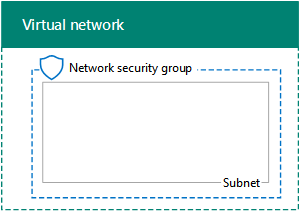

# <a name="base-configuration-devtest-environment"></a>Entorno de desarrollo y pruebas de la configuración básica

 **Resumen:** Crear una intranet simplificada como un entorno de pruebas y desarrollo de Microsoft Azure.
  
Este artículo contiene las instrucciones paso a paso para crear el siguiente entorno de desarrollo y pruebas de la configuración básica en Azure:
  
**Figura 1: El entorno de desarrollo y prueba de configuración básica**


  
El entorno de desarrollo y pruebas de la configuración básica de la figura 1 consta de la subred de la red corporativa en una red virtual de Azure solo de nube denominada TestLab que simula una intranet simplificada y privada conectada a Internet. Contiene tres máquinas virtuales de Azure que ejecutan Windows Server 2016:
  
- DC1 está configurada como un controlador de dominio de intranet y un servidor de Sistema de nombres de dominio (DNS)
    
- App1 está configurada como servidor web y de aplicación general
    
- 	CLIENT1 actúa como cliente de intranet
    
Esta configuración permite que DC1, APP1, CLIENT1 y otros equipos de la subred de red corporativa:  
  
- Conectado a Internet para instalar las actualizaciones, obtener acceso a recursos de Internet en tiempo real y participar en las tecnologías de nube pública como Microsoft Office 365 y otros servicios de Azure.
    
- 	Se administren de manera remota mediante conexiones a Escritorio remoto desde el equipo que está conectado a Internet o la red de su organización.
    
Puede usar el entorno de pruebas resultante:
  
- Para desarrollar y probar aplicaciones.
    
- Como la configuración inicial de un entorno de pruebas ampliadas de su propio diseño que incluye máquinas virtuales adicionales, servicios de Azure u otras ofertas de nube de Microsoft, como Office 365 + movilidad y seguridad empresarial.
    
Existen cuatro fases para configurar el entorno de pruebas de configuración de base en Azure:
  
1. 	Crear la red virtual.
    
2. 	Configurar DC1.
    
3. 	Configurar APP1.
    
4. 	Configurar CLIENT1.
    
Si no dispone de una suscripción de Azure, puede suscribirse para una prueba gratuita en [Tratar de Azure](https://azure.microsoft.com/pricing/free-trial/). Si tiene una suscripción a MSDN o Visual Studio, vea [crédito Azure mensual para los suscriptores de Visual Studio](https://azure.microsoft.com/pricing/member-offers/msdn-benefits-details/).
  
> [!NOTE]
> Máquinas virtuales en Azure incurre en un costo económico constante cuando se están ejecutando. Este costo se facturó contra su suscripción de MSDN de prueba, libre o de pago. Para obtener más información acerca de los costos de Azure máquinas virtuales en ejecución, ver [Detalles de precios de máquinas virtuales](https://azure.microsoft.com/pricing/details/virtual-machines/) y [Calculadora de precios de Azure](https://azure.microsoft.com/pricing/calculator/). Para mantener los costos bajos, consulte [minimizar los costos de máquinas de prueba entorno virtual en Azure](base-configuration-dev-test-environment.md#mincost). 
  

  
> [!TIP]
> Haga clic [aquí](http://aka.ms/catlgstack) para ver un mapa visual para todos los artículos de la pila de una guía de laboratorio de prueba de nube de Microsoft.
  
## <a name="phase-1-create-the-virtual-network"></a>Fase 1: Crear la red virtual

En primer lugar, abra un símbolo del sistema de Azure PowerShell.
  
> [!NOTE]
> Los siguientes conjuntos de comandos utilice la última versión de PowerShell de Azure. Consulte [Introducción a los cmdlets de PowerShell de Azure](https://docs.microsoft.com/en-us/powershell/azureps-cmdlets-docs/). 
  
Inicie sesión en su cuenta de Azure con el siguiente comando.
  
```
Login-AzureRMAccount
```

> [!TIP]
> Haga clic [aquí](https://gallery.technet.microsoft.com/PowerShell-commands-for-ba957d3d) para obtener un archivo de texto que contiene todos los comandos de PowerShell en este artículo.
  
Obtenga su nombre de suscripción mediante el comando siguiente.
  
```
Get-AzureRMSubscription | Sort Name | Select Name
```

Configure su suscripción de Azure. Cambie todo el contenido entrecomillado, incluidos los caracteres < y >, por los nombres correctos.
  
```
$subscr="<subscription name>"
Get-AzureRmSubscription -SubscriptionName $subscr | Select-AzureRmSubscription
```

Después, cree un nuevo grupo de recursos para su entorno de pruebas de configuración básica. Para determinar un nombre único de grupo de recursos, use este comando a fin de enumerar los grupos de recursos existentes.
  
```
Get-AzureRMResourceGroup | Sort ResourceGroupName | Select ResourceGroupName
```

Cree el nuevo grupo de recursos con estos comandos. Reemplace todo el contenido entrecomillado, incluidos los caracteres < y >, por los nombres correctos.
  
```
$rgName="<resource group name>"
$locName="<location name, such as West US>"
New-AzureRMResourceGroup -Name $rgName -Location $locName
```

Después, cree la red virtual de TestLab que hospedará la subred de la red corporativa de la configuración básica y la protegerá con un grupo de seguridad de red.
  
```
$rgName="<name of your new resource group>"
$locName=(Get-AzureRmResourceGroup -Name $rgName).Location
$corpnetSubnet=New-AzureRMVirtualNetworkSubnetConfig -Name Corpnet -AddressPrefix 10.0.0.0/24
New-AzureRMVirtualNetwork -Name TestLab -ResourceGroupName $rgName -Location $locName -AddressPrefix 10.0.0.0/8 -Subnet $corpnetSubnet -DNSServer 10.0.0.4
$rule1=New-AzureRMNetworkSecurityRuleConfig -Name "RDPTraffic" -Description "Allow RDP to all VMs on the subnet" -Access Allow -Protocol Tcp -Direction Inbound -Priority 100 -SourceAddressPrefix Internet -SourcePortRange * -DestinationAddressPrefix * -DestinationPortRange 3389
New-AzureRMNetworkSecurityGroup -Name Corpnet -ResourceGroupName $rgName -Location $locName -SecurityRules $rule1
$vnet=Get-AzureRMVirtualNetwork -ResourceGroupName $rgName -Name TestLab
$nsg=Get-AzureRMNetworkSecurityGroup -Name Corpnet -ResourceGroupName $rgName
Set-AzureRMVirtualNetworkSubnetConfig -VirtualNetwork $vnet -Name Corpnet -AddressPrefix "10.0.0.0/24" -NetworkSecurityGroup $nsg
```

Esta es su configuración actual.
  

  
## <a name="phase-2-configure-dc1"></a>Fase 2: Configurar DC1

A continuación, creamos la máquina virtual DC1 y la configuramos como controlador de dominio para el dominio corp.contoso.com de Windows Server Active Directory (AD) y como servidor DNS para las máquinas virtuales de la red virtual TestLab.
  
Para crear una máquina virtual Azure para DC1, proporcione el nombre de su grupo de recursos y ejecutar estos comandos en el símbolo del sistema de PowerShell de Azure en el equipo local.
  
```
$rgName="<resource group name>"
$locName=(Get-AzureRmResourceGroup -Name $rgName).Location
$vnet=Get-AzureRMVirtualNetwork -Name TestLab -ResourceGroupName $rgName
$pip=New-AzureRMPublicIpAddress -Name DC1-PIP -ResourceGroupName $rgName -Location $locName -AllocationMethod Dynamic
$nic=New-AzureRMNetworkInterface -Name DC1-NIC -ResourceGroupName $rgName -Location $locName -SubnetId $vnet.Subnets[0].Id -PublicIpAddressId $pip.Id -PrivateIpAddress 10.0.0.4
$vm=New-AzureRMVMConfig -VMName DC1 -VMSize Standard_A1
$cred=Get-Credential -Message "Type the name and password of the local administrator account for DC1."
$vm=Set-AzureRMVMOperatingSystem -VM $vm -Windows -ComputerName DC1 -Credential $cred -ProvisionVMAgent -EnableAutoUpdate
$vm=Set-AzureRMVMSourceImage -VM $vm -PublisherName MicrosoftWindowsServer -Offer WindowsServer -Skus 2016-Datacenter -Version "latest"
$vm=Add-AzureRMVMNetworkInterface -VM $vm -Id $nic.Id
$vm=Set-AzureRmVMOSDisk -VM $vm -Name "DC1-OS" -DiskSizeInGB 128 -CreateOption FromImage -StorageAccountType "StandardLRS"
$diskConfig=New-AzureRmDiskConfig -AccountType "StandardLRS" -Location $locName -CreateOption Empty -DiskSizeGB 20
$dataDisk1=New-AzureRmDisk -DiskName "DC1-DataDisk1" -Disk $diskConfig -ResourceGroupName $rgName
$vm=Add-AzureRmVMDataDisk -VM $vm -Name "DC1-DataDisk1" -CreateOption Attach -ManagedDiskId $dataDisk1.Id -Lun 1
New-AzureRMVM -ResourceGroupName $rgName -Location $locName -VM $vm
```

Se le pedirá un nombre de usuario y una contraseña para la cuenta de administrador local en DC1. Use una contraseña segura y registre el nombre de usuario y la contraseña en una ubicación segura.
  
Después conéctese a la máquina virtual DC1.
  
### <a name="connect-to-dc1-using-local-administrator-account-credentials"></a>Conectarse a DC1 usando las credenciales de la cuenta de administrador local

1. En el [portal de Azure](https://portal.azure.com), haga clic en **grupos de recursos >** <the name of your new resource group> **> DC1 > conectar**.
    
2. Abra el archivo DC1.rdp que se descarga y, a continuación, haga clic en **Conectar**.
    
3. Especifique el nombre de cuenta de administrador local de DC1:
    
  - Para Windows 7:
    
    En el cuadro de diálogo **Seguridad de Windows** , haga clic en **usar otra cuenta**. En **nombre de usuario**, escriba **DC1\\**[nombre de la cuenta de administrador Local].
    
  - Para Windows 8 o Windows 10:
    
    En el cuadro de diálogo **Seguridad de Windows** , haga clic en **más opciones**y, a continuación, haga clic en **utilizar una cuenta diferente**. En **nombre de usuario**, escriba **DC1\\**[nombre de la cuenta de administrador Local].
    
4. En **contraseña**, escriba la contraseña de la cuenta de administrador local y, a continuación, haga clic en **Aceptar**.
    
5. Cuando se le pida, haga clic en **Sí**.
    
A continuación, agregue un disco de datos adicionales como un nuevo volumen con la letra de unidad F: con este comando en un símbolo de Windows PowerShell de nivel de administrador en DC1.
  
```
Get-Disk | Where PartitionStyle -eq "RAW" | Initialize-Disk -PartitionStyle MBR -PassThru | New-Partition -AssignDriveLetter -UseMaximumSize | Format-Volume -FileSystem NTFS -NewFileSystemLabel "WSAD Data"
```

A continuación, configure DC1 como controlador de dominio y servidor DNS para el dominio corp.contoso.com. En un símbolo del sistema de Windows PowerShell con el nivel de administrador, ejecute estos comandos:
  
```
Install-WindowsFeature AD-Domain-Services -IncludeManagementTools
Install-ADDSForest -DomainName corp.contoso.com -DatabasePath "F:\\NTDS" -SysvolPath "F:\\SYSVOL" -LogPath "F:\\Logs"
```

Debe especificar una contraseña de administrador de modo seguro. Guarde esta contraseña en un lugar seguro.
  
Tenga en cuenta que estos comandos pueden tardan unos minutos en completarse.
  
Después de que DC1 se reinicie, vuelva a conectarse a la máquina virtual de DC1.
  
### <a name="connect-to-dc1-using-domain-credentials"></a>Conectarse a DC1 usando las credenciales de dominio

1. En el [portal de Azure](https://portal.azure.com), haga clic en **grupos de recursos >** <your resource group name> **> DC1 > conectar**.
    
2. Ejecute el archivo DC1.rdp que se descarga y, a continuación, haga clic en **Conectar**.
    
3. En la **Seguridad de Windows**, haga clic en **usar otra cuenta**. En **nombre de usuario**, escriba **CORP\\**[nombre de la cuenta de administrador Local].
    
4. En **contraseña**, escriba la contraseña de la cuenta de administrador local y, a continuación, haga clic en **Aceptar**.
    
5. Cuando se le pida, haga clic en **Sí**.
    
A continuación, cree una cuenta de usuario en Active Directory que se usará al iniciar sesión en equipos de miembros del dominio CORP. En un símbolo del sistema de Windows PowerShell con un nivel de administrador, ejecute este comando:
  
```
New-ADUser -SamAccountName User1 -AccountPassword (read-host "Set user password" -assecurestring) -name "User1" -enabled $true -PasswordNeverExpires $true -ChangePasswordAtLogon $false
```

Tenga en cuenta que este comando le solicita que proporcione la contraseña de la cuenta User1. Dado que esta cuenta se usará para las conexiones de Escritorio remoto en todos los equipos miembros del dominio CORP, elija una contraseña segura. Anote la contraseña de la cuenta User1 y almacénela en una ubicación segura.
  
Después, configure la nueva cuenta User1 como administrador de organización. En un símbolo del sistema de Windows PowerShell con el nivel de administrador, ejecute este comando:
  
```
Add-ADPrincipalGroupMembership -Identity "CN=User1,CN=Users,DC=corp,DC=contoso,DC=com" -MemberOf "CN=Enterprise Admins,CN=Users,DC=corp,DC=contoso,DC=com","CN=Domain Admins,CN=Users,DC=corp,DC=contoso,DC=com","CN=Schema Admins,CN=Users,DC=corp,DC=contoso,DC=com"
```

Cerrar la sesión de escritorio remoto con DC1 y, a continuación, volver a conectar mediante el CORP\\cuenta de Usuario1.
  
Después, para permitir el tráfico desde la herramienta Ping, ejecute este comando desde un símbolo del sistema de Windows PowerShell con el nivel de administrador:
  
```
Set-NetFirewallRule -DisplayName "File and Printer Sharing (Echo Request - ICMPv4-In)" -enabled True
```

Esta es su configuración actual.
  

  
## <a name="phase-3-configure-app1"></a>Fase 3: Configurar APP1

App1 proporciona servicios de uso compartido de archivos y web.
  
Para crear una máquina virtual de Azure para APP1, indique el nombre de su grupo de recursos, ubicación de Azure y nombre de la cuenta de almacenamiento, y ejecute estos comandos en el símbolo del sistema de Azure PowerShell en el equipo local.
  
```
$rgName="<resource group name>"
$locName=(Get-AzureRmResourceGroup -Name $rgName).Location
$vnet=Get-AzureRMVirtualNetwork -Name TestLab -ResourceGroupName $rgName
$pip=New-AzureRMPublicIpAddress -Name APP1-PIP -ResourceGroupName $rgName -Location $locName -AllocationMethod Dynamic
$nic=New-AzureRMNetworkInterface -Name APP1-NIC -ResourceGroupName $rgName -Location $locName -SubnetId $vnet.Subnets[0].Id -PublicIpAddressId $pip.Id
$vm=New-AzureRMVMConfig -VMName APP1 -VMSize Standard_A1
$cred=Get-Credential -Message "Type the name and password of the local administrator account for APP1."
$vm=Set-AzureRMVMOperatingSystem -VM $vm -Windows -ComputerName APP1 -Credential $cred -ProvisionVMAgent -EnableAutoUpdate
$vm=Set-AzureRMVMSourceImage -VM $vm -PublisherName MicrosoftWindowsServer -Offer WindowsServer -Skus 2016-Datacenter -Version "latest"
$vm=Add-AzureRMVMNetworkInterface -VM $vm -Id $nic.Id
$vm=Set-AzureRmVMOSDisk -VM $vm -Name "APP1-OS" -DiskSizeInGB 128 -CreateOption FromImage -StorageAccountType "StandardLRS"
New-AzureRMVM -ResourceGroupName $rgName -Location $locName -VM $vm
```

Después, conéctese a la máquina virtual de APP1 usando el nombre y la contraseña de la cuenta de administrador local de APP1 y abra un símbolo del sistema de Windows PowerShell.
  
Para comprobar la comunicación de red y de resolución de nombre entre APP1 y DC1, ejecute el comando **ping dc1.corp.contoso.com** y compruebe que hay cuatro respuestas.
  
Después, una la máquina virtual de APP1 al dominio CORP con estos comandos en un símbolo del sistema de Windows PowerShell.
  
```
Add-Computer -DomainName corp.contoso.com
Restart-Computer
```

Nota que debe proporcionar el CORP\\Usuario1 credenciales de cuenta de dominio después de ejecutar el comando **Agregar equipo** .
  
Una vez reiniciado APP1, conectarse a ella mediante el CORP\\cuenta usuario1 y una de Windows PowerShell de nivel de administrador abra símbolo del sistema.
  
Después, convierta a APP1 en un servidor web con este comando en el símbolo del sistema de Windows PowerShell en APP1.
  
```
Install-WindowsFeature Web-WebServer -IncludeManagementTools
```

Por último, cree una carpeta compartida y un archivo de texto dentro de la carpeta en APP1 con estos comandos de PowerShell.
  
```
New-Item -path c:\\files -type directory
Write-Output "This is a shared file." | out-file c:\\files\\example.txt
New-SmbShare -name files -path c:\\files -changeaccess CORP\\User1
```

Esta es su configuración actual.
  

  
## <a name="phase-4-configure-client1"></a>Fase 4: Configurar CLIENT1

CLIENT1 sirve de portátil, tableta o equipo de escritorio común en la intranet de Contoso.
  
> [!NOTE]
> El siguiente conjunto de comandos crea CLIENTE1 ejecuta Windows Server 2016 Datacenter, lo que puede realizar para todos los tipos de suscripciones de Azure. Si tiene una suscripción de Azure basada en Visual Studio, puede crear CLIENTE1 ejecutando Windows 10, Windows 8 o Windows 7 con el [portal de Azure](https://portal.azure.com). 
  
Para crear una máquina virtual de Azure para CLIENT1, indique el nombre de su grupo de recursos, ubicación de Azure y nombre de la cuenta de almacenamiento, y ejecute estos comandos en el símbolo del sistema de Azure PowerShell en el equipo local.
  
```
$rgName="<resource group name>"
$locName=(Get-AzureRmResourceGroup -Name $rgName).Location
$vnet=Get-AzureRMVirtualNetwork -Name TestLab -ResourceGroupName $rgName
$pip=New-AzureRMPublicIpAddress -Name CLIENT1-PIP -ResourceGroupName $rgName -Location $locName -AllocationMethod Dynamic
$nic=New-AzureRMNetworkInterface -Name CLIENT1-NIC -ResourceGroupName $rgName -Location $locName -SubnetId $vnet.Subnets[0].Id -PublicIpAddressId $pip.Id
$vm=New-AzureRMVMConfig -VMName CLIENT1 -VMSize Standard_A1
$cred=Get-Credential -Message "Type the name and password of the local administrator account for CLIENT1."
$vm=Set-AzureRMVMOperatingSystem -VM $vm -Windows -ComputerName CLIENT1 -Credential $cred -ProvisionVMAgent -EnableAutoUpdate
$vm=Set-AzureRMVMSourceImage -VM $vm -PublisherName MicrosoftWindowsServer -Offer WindowsServer -Skus 2016-Datacenter -Version "latest"
$vm=Add-AzureRMVMNetworkInterface -VM $vm -Id $nic.Id
$vm=Set-AzureRmVMOSDisk -VM $vm -Name "CLIENT1-OS" -DiskSizeInGB 128 -CreateOption FromImage -StorageAccountType "StandardLRS"
New-AzureRMVM -ResourceGroupName $rgName -Location $locName -VM $vm
```

Después, conéctese a la máquina virtual de CLIENT1 usando el nombre y la contraseña de la cuenta de administrador local de CLIENT1, y abra un símbolo del sistema de nivel de administrador de Windows PowerShell.
  
Para comprobar la comunicación de red y de resolución de nombre entre CLIENTE1 y DC1, ejecute el comando **ping dc1.corp.contoso.com** en un símbolo del sistema de Windows PowerShell y compruebe que hay cuatro respuestas.
  
Después, una la máquina virtual de CLIENT1 al dominio CORP con estos comandos en un símbolo del sistema de Windows PowerShell.
  
```
Add-Computer -DomainName corp.contoso.com
Restart-Computer
```

Nota que debe proporcionar el CORP\\Usuario1 credenciales de cuenta de dominio después de ejecutar el comando **Agregar equipo** .
  
Cuando se reinicie CLIENTE1, conectarse a ella mediante el CORP\\Usuario1 nombre de cuenta y contraseña y, a continuación, abra un símbolo del sistema de nivel de administrador de Windows PowerShell.
  
Después, compruebe que puede tener acceso a recursos compartidos de web y archivos en APP1 desde CLIENT1.
  
### <a name="verify-client-access-to-app1"></a>Comprobar el acceso de CLIENT a APP1

1. En el administrador del servidor, en el panel de árbol, haga clic en **Servidor Local**.
    
2. En **Propiedades de CLIENTE1**, haga clic **en** junto a la **Configuración de seguridad mejorada de Internet Explorer**.
    
3. En **La configuración de seguridad mejorada de Internet Explorer**, haga clic en **desactivado** para **los administradores** y **los usuarios**y, a continuación, haga clic en **Aceptar**.
    
4. Desde la pantalla de inicio, haga clic en **Internet Explorer**y, a continuación, haga clic en **Aceptar**.
    
5. En la barra Dirección, escriba **http://app1.corp.contoso.com/**y, a continuación, presione ENTRAR. Debe ver la página web de servicios de Internet Information Server de forma predeterminada para APP1.
    
6. En la barra de tareas de escritorio, haga clic en el icono del Explorador de archivos.
    
7. En la barra Dirección, escriba ** \\ \\app1\\archivos**, y, a continuación, presione ENTRAR. Debería ver una ventana de carpeta con el contenido de la carpeta compartida de archivos.
    
8. En la ventana de carpeta compartida de **archivos** , haga doble clic en el archivo **ejemplo.txt** . Debería ver el contenido del archivo ejemplo.txt.
    
9. Cierre el **ejemplo.txt - Bloc de notas** y las ventanas de carpeta de **archivos** compartidos.
    
Esta es su configuración final.
  

  
La configuración básica de Azure está preparada para desarrollar y probar aplicaciones o para crear entornos de prueba adicionales. 
  
> [!TIP]
> Haga clic [aquí](http://aka.ms/catlgstack) para ver un mapa visual de todos los artículos en la pila de la Guía del entorno de pruebas de One Microsoft Cloud.
  
## <a name="minimizing-the-costs-of-test-environment-virtual-machines-in-azure"></a>Minimizar los costos del entorno de pruebas de máquinas virtuales en Azure
<a name="mincost"> </a>

Para minimizar el costo de ejecutar máquinas virtuales de entorno de pruebas, puede realizar una de las siguientes acciones:
  
- Crear el entorno de pruebas y realizar las pruebas necesarias y la demostración lo más rápidamente posible. Cuando haya terminado, elimine el grupo de recursos del entorno de pruebas.
    
- 	Ponga las máquinas virtuales del entorno de pruebas virtual en un estado desasignado.
    
Para apagar las máquinas virtuales con Azure PowerShell, rellene el nombre del grupo de recursos y ejecute estos comandos.
  
```
$rgName="<your resource group name>"
Stop-AzureRMVM -ResourceGroupName $rgName -Name "CLIENT1" -Force
Stop-AzureRMVM -ResourceGroupName $rgName -Name "APP1" -Force
Stop-AzureRMVM -ResourceGroupName $rgName -Name "DC1" -Force
```

Para asegurarse de que las máquinas virtuales funcionan correctamente al iniciarlas todas desde el estado Detenido (Desasignado), debe iniciarlas en el orden siguiente:
  
1. DC1
    
2. APP1
    
3. CLIENTE1
    
Para iniciar las máquinas virtuales en orden con Azure PowerShell, rellene el nombre del grupo de recursos y ejecute estos comandos.
  
```
$rgName="<your resource group name>"
Start-AzureRMVM -ResourceGroupName $rgName -Name "DC1"
Start-AzureRMVM -ResourceGroupName $rgName -Name "APP1"
Start-AzureRMVM -ResourceGroupName $rgName -Name "CLIENT1"
```

## <a name="see-also"></a>Consulte también

<a name="mincost"> </a>

[Entorno de desarrollo y pruebas de Office 365](office-365-dev-test-environment.md)
  
[Sincronización de directorios (DirSync) para el entorno de desarrollo y pruebas de Office 365](dirsync-for-your-office-365-dev-test-environment.md)
  
[Seguridad de la aplicación de nube para su entorno de pruebas y desarrollo de Office 365](cloud-app-security-for-your-office-365-dev-test-environment.md)
  
[Una protección avanzada para su entorno de pruebas y desarrollo de Office 365](advanced-threat-protection-for-your-office-365-dev-test-environment.md)
  
[Adopción de la nube y soluciones híbridas](cloud-adoption-and-hybrid-solutions.md)


