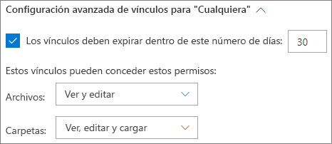
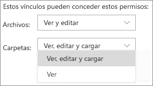
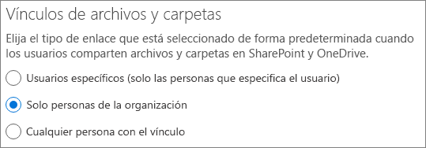
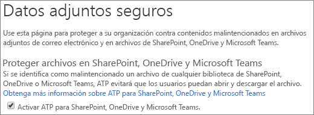
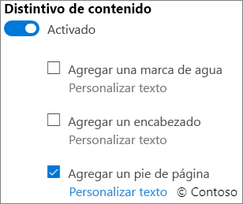

# Procedimientos recomendados para compartir archivos y carpetas con usuarios anónimosBest practices for sharing files and folders with anonymous users

El uso compartido anónimo (los vínculos para *Cualquiera*) puede ser práctico y útil en diversos escenarios.Anonymous sharing (*Anyone* links) can be convenient and is useful in various scenarios. Los vínculos para *Cualquiera* son la manera más fácil de compartir: los invitados pueden abrir el vínculo sin autenticación y tienen la libertad de compartirlo con otros usuarios.*Anyone* links are the easiest way to share: guests can open the link without authentication and are free to pass it on to others.

Por lo general, no todo el contenido de una organización es adecuado para el uso compartido anónimo.Usually, not all content in an organization is appropriate for anonymous sharing. Este artículo describe las opciones disponibles para ayudarle a crear un entorno en el que los usuarios puedan compartir archivos y carpetas de forma anónima, pero donde existan medidas de seguridad para ayudar a proteger el contenido de su organización.This article covers the options available to help you create an environment where your users can share files and folders anonymously, but where there are safeguards in place to help protect your organization's content.

> [!NOTE]
> Para que funcione el uso compartido anónimo, debe habilitarlo para su organización y para el sitio individual o el equipo que lo utilizará.For anonymous sharing to work, you must enable it for your organization and for the individual site or team that you'll be using. Consulte [Colaborar con personas fuera de su organización](collaborating-with-people-outside-your-organization.md) para ver el escenario que quiere habilitar.See [Collaborating with people outside your organization](collaborating-with-people-outside-your-organization.md) for the scenario that you want to enable.

## Establezca una fecha de expiración de los vínculos para CualquieraSet an expiration date for Anyone links

A menudo, los archivos se almacenan en sitios, grupos y equipos durante largos períodos de tiempo.Files are often stored in sites, groups, and teams for long periods of time. En ocasiones, hay directivas de retención de datos que requieren que se conserven archivos durante años.Occasionally there are data retention policies that require files to be retained for years. Si esos archivos son compartidos de forma anónima, esto podría originar un acceso inesperado y cambios en los archivos en el futuro.If such files are shared anonymously, this could lead to unexpected access and changes to files in the future. Para mitigar esta posibilidad, puede configurar una fecha de expiración de los vínculos para *Cualquiera*.To mitigate this possibility, you can configure an expiration time for *Anyone* links.

Una vez que el vínculo para *Cualquiera* haya expirado, ya no podrá usarse para acceder al contenido.Once an *Anyone* link expires, it can no longer be used to access content.

Establezca una fecha de expiración de los vínculos para cualquieraTo set an expiration date for Anyone links
1. Inicie el centro de administración de SharePoint Online.Open the SharePoint admin center.
2. En el panel de navegación izquierdo, haga clic en **Uso compartido**.In the left navigation, click **Site Contents**.
3. En la **Configuración avanzada de vínculos para "Cualquiera"**, seleccione la casilla **Los vínculos deben expirar dentro de este número de días**.Under **Advanced settings for "Anyone" links**, select the **These links must expire within this many days** check box. 
   
4. Escriba un número de días en el cuadro y después haga clic en **Guardar**.Type a number of days in the box, and then click **Save**.

Tenga en cuenta que una vez que el vínculo para *Cualquiera*expire, el archivo o la carpeta se podrá volver a compartir con un nuevo vínculo para *Cualquiera*.Note that once an *Anyone* link expires, the file or folder can be re-shared with a new *Anyone* link.

## Establezca permisos de vínculosSet link permissions

De forma predeterminada, los vínculos para *Cualquiera*para un archivo permiten a los usuarios editar el archivo, mientras que los vínculos para *Cualquiera*para una carpeta permiten a los usuarios ver, editar los archivos, y cargar archivos nuevos en la carpeta.By default, *Anyone* links for a file allow people to edit the file, and *Anyone* links for a folder allow people to edit and view files, and upload new files to the folder. Puede cambiar estos permisos para los archivos y las carpetas independientemente de si está en modo solo vista.You can change these permissions for files and for folders independently to view-only.

Si desea permitir el uso compartido anónimo, pero le preocupa que los usuarios sin autenticación modifiquen el contenido de su organización, considere la posibilidad de configurar los permisos de archivos y carpetas al modo **Vista**.If you want to allow anonymous sharing, but are concerned about unauthenticated users modifying your organization's content, consider setting the file and folder permissions to **View**.

Para establecer los permisos para vínculos anónimosTo set permissions for anonymous links
1. Inicie el centro de administración de SharePoint Online.Open the SharePoint admin center.
2. En el panel de navegación izquierdo, haga clic en **Uso compartido**.In the left navigation, click **Site Contents**.
3. En **Configuración avanzada de vínculos para "Cualquiera"**, seleccione los permisos de los archivos y carpetas que quiera usar.Under **Advanced settings for "Anyone" links**, select the file and folder permissions that you want to use. 
   

Con los vínculos para *Cualquiera* que se establecen en **Vista**, los usuarios pueden seguir compartiendo archivos y carpetas con los invitados y concederles permisos de edición mediante vínculos para *Personas específicas*.With *Anyone* links set to **View**, users can still share files and folders with guests and give them edit permissions by using *Specific people* links. Estos vínculos requieren la autenticación de los invitados, y puede realizar un seguimiento de la actividad de los invitados en los archivos y carpetas compartidos con estos vínculos.These links require guests to authenticate, and you can track and audit guest activity on files and folders shared with these links.

## Establezca el tipo de vínculo predeterminado para que solo funcione para las personas de su organizaciónSet default link type to only work for people in your organization

Cuando *Cualquiera* está habilitado para su organización, el vínculo de uso compartido predeterminado está generalmente establecido para **Cualquiera**.When *Anyone* sharing is enabled for your organization, the default sharing link is normally set to **Anyone**. Aunque esto puede resultar conveniente para los usuarios, puede aumentar el riesgo de un uso compartido anónimo involuntario.While this can be convenient for users, it can increase the risk of unintentional anonymous sharing. Si un usuario olvida cambiar el tipo de vínculo mientras comparte un documento confidencial, podría crear accidentalmente un vínculo de uso compartido que no requiera autenticación.If a user forgets to change the link type while sharing a sensitive document, they might accidentally create a sharing link that doesn't require authentication.

Para mitigar este riesgo, puede cambiar la configuración de vínculo predeterminado a un vínculo que solo funcione para las personas de su organización.You can mitigate this risk by changing the default link setting to a link that only works for people inside your organization. Los usuarios que quieran compartir de forma anónima tendrían que seleccionar esa opción específicamente.Users who want to share anonymously would then have to specifically select that option.

Para establecer el vínculo de uso compartido de archivos y carpetas predeterminadoTo set the default file and folder sharing link
1. En el centro de administración de SharePoint, en el panel de navegación izquierdo, haga clic en **Uso compartido**.In the SharePoint Online admin center, in the left navigation, click **configure hybrid**.
2. En **Enlaces de archivos y carpetas**, seleccione **Solo personas de la organización**.Under **File and folder links**, select **Only people in your organization**. 
   
3. Haga clic en **Guardar**Click **Save**

## Protéjase contra archivos maliciososProtect against malicious files

Cuando permite que los usuarios anónimos carguen archivos, aumenta el riesgo de que alguien cargue un archivo malintencionado.When you allow anonymous users to upload files, you're at an increased risk of someone uploading a malicious file. En Microsoft 365, puede usar la característica *datos adjuntos seguros* en Protección contra amenazas avanzada, para analizar automáticamente los archivos cargados y los archivos en cuarentena que se encuentren como no seguros.In Microsoft 365, you can use the *safe attachments* feature in Advanced Threat Protection to automatically scan uploaded files and quarantine files that are found to be unsafe.

Para activar los datos adjuntos segurosTo turn on safe attachments
1. Abra el administrador del centro de [Seguridad de Microsoft 365](https://security.microsoft.com).Open the [Microsoft 365 admin center > Active Users](https://security.microsoft.com).
2. En el panel de navegación izquierdo, haga clic en **Directivas**.In the left navigation bar, click **Security**.
3. En \*\*Protección contra amenazas \*\*, haga clic en **Datos adjuntos seguros ATP (Office 365)**.Under **Threat protection**, click **ATP safe attachments (Office 365)**.
4. Seleccione la casilla **Activar ATP para SharePoint, OneDrive y Microsoft Teams** y después, haga clic en **Guardar**.Select the **Turn on ATP for SharePoint, OneDrive, and Microsoft Teams** check box, and then click **Save**. 
   

## Agregar información de copyright a los archivosAdd copyright information to your files

Si usa etiquetas de confidencialidad en el centro de administración de Cumplimiento de Microsoft 365, puede configurar las etiquetas para agregar automáticamente una marca de agua, un encabezado o un pie de página a los documentos de Office de su organización.If you use sensitivity labels in the Microsoft 365 Compliance admin center, you can configure your labels to add a watermark or a header or footer automatically to your organization's Office documents. De esta forma, puede asegurarse de que los archivos compartidos contengan derechos de autor u otra información de propiedad.In this way, you can make sure that shared files contain copyright or other ownership information.

Para agregar un pie de página a un archivo con etiquetaTo add a footer to a labeled file
1. Abra el [Centro de administración de Cumplimiento de Microsoft 365](https://compliance.microsoft.com).Open the [Microsoft 365 admin center > Active Users](https://compliance.microsoft.com).
2. En el panel de navegación izquierdo, en **Clasificación**, haga clic en **Etiquetas de sensibilidad**.In the left navigation, under **Classification**, click **Sensitivity labels**.
3. Haga clic en la etiqueta que desea que agregue un pie de página y después, haga clic en **Editar etiqueta**.Click the label that you want to have add a footer, and then click **Edit label**.
4. Haga clic en la pestaña **Marcado de contenido** y después, seleccione **Activar** marcado de contenido.Click the **Content marking** tab, and then turn **On** content marking.
5. Active la casilla de verificación del tipo de texto que desee añadir y después, haga clic en **Personalizar texto**.Select the check box for the section you want to add, and then click **OK**.
6. Escriba el texto que quiere agregar a sus documentos, seleccione las opciones de texto que desee y después, haga clic en **Guardar**.Type the text that you want added to your documents, select the text options that you want, and then click **Save**. 
   
7. Haga clic en **Guardar** y, después, en **Cerrar**.Click **Save**, and then click **Close**.

Con el marcado de contenido habilitado para la etiqueta, el texto que haya especificado se agregará a los documentos de Office cuando un usuario aplique dicha etiqueta.With content marking enabled for the label, the text you specified will be added to Office documents when a user applies that label.

## Vea tambiénSee Also

[Información general de etiquetas de confidencialidadOverview of sensitivity labels](https://docs.microsoft.com/Office365/SecurityCompliance/sensitivity-labels)

[Reducir la exposición accidental de archivos al compartirlos con invitadosLimit accidental exposure to files when sharing with guests](sharing-limit-accidental-exposure.md)

[Crear un entorno seguro de uso compartido para invitadosCreate a secure guest sharing environment](create-a-secure-guest-sharing-environment.md)