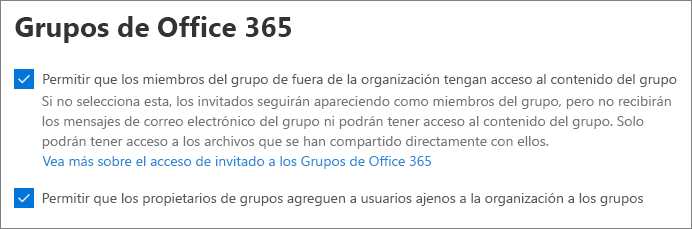

# Colaborar con invitados en un equipoCollaborate with guests in a team

Si necesita colaborar con invitados en documentos, tareas y conversaciones, le recomendamos que use Microsoft Teams.If you need to collaborate with guests across documents, tasks, and conversations, we recommend using Microsoft Teams. Teams ofrece todas las características de colaboración disponibles en Office y SharePoint con chat persistente y un conjunto de herramientas de colaboración personalizable y extensible en una experiencia de usuario unificada.Teams provides all of the collaboration features available in Office and SharePoint with persistent chat and a customizable and extensible set of collaboration tools in a unified user experience.

En este artículo, analizaremos los pasos de configuración de Microsoft 365 necesarios para configurar un equipo para la colaboración con los invitados.In this article, we'll walk through the Microsoft 365 configuration steps necessary to set up a team for collaboration with guests.

## Vídeo de demostraciónVideo demonstration

En este vídeo se muestran los pasos de configuración que se describen en este documento.This video shows the configuration steps described in this document. 

> [!VIDEO https://www.microsoft.com/videoplayer/embed/RE44NTr?autoplay=false]

## Configuración de las relaciones de organización de AzureAzure Organizational relationships settings

El uso compartido en Microsoft 365 se rige en su nivel más alto por la configuración de relaciones organizativas en Azure Active Directory.Sharing in Microsoft 365 is governed at its highest level by the organizational relationships settings in Azure Active Directory. Si el uso compartido de invitado está deshabilitado o restringido en Azure AD, se invalidará cualquier configuración de uso compartido que configure en Microsoft 365.If guest sharing is disabled or restricted in Azure AD, this will override any sharing settings that you configure in Microsoft 365.

Compruebe la configuración de relaciones de organización para asegurarse de que no se bloquee el uso compartido con invitados.Check the organizational relationships settings to ensure that sharing with guests is not blocked.

Para establecer la configuración de relación organizativaTo set organizational relationship settings

1. Inicie sesión en Microsoft Azure en [https://portal.azure.com](https://portal.azure.com).Log in to Microsoft Azure at [https://portal.azure.com](https://portal.azure.com).
2. En el panel de navegación izquierdo, haga clic en **Azure Active Directory**.In the left navigation, click **Azure Active Directory**.
3. En el panel de **información general** , haga clic en **relaciones organizativas**.In the **Overview** pane, click **Organizational relationships**.
4. En el panel relaciones de la **organización** , haga clic en **configuración**.In the **Organizational relationships** pane, click **Settings**.
5. Asegúrese de que los **administradores y los usuarios de la función invitador invitado puedan** invitar y que **los miembros puedan invitar** están establecidos en **sí**.Ensure that **Admins and users in the guest inviter role can invite** and **Members can invite** are both set to **Yes**.
6. Si ha realizado cambios, haga clic en **Guardar**.If you made changes, click **Save**.

Anote la configuración de la sección **restricciones de colaboración** .Note the settings in the **Collaboration restrictions** section. Asegúrese de que los dominios de los invitados con los que desea colaborar no están bloqueados.Make sure that the domains of the guests that you want to collaborate with aren't blocked.

## Configuración de acceso de invitado de Microsoft TeamsTeams guest access settings

Los equipos tienen un conmutador de encendido y apagado principal para el acceso de invitado y una variedad de opciones de configuración disponibles para controlar lo que pueden hacer los invitados en un equipo.Teams has a master on/off switch for guest access and a variety of settings available to control what guests can do in a team. El conmutador maestro, **permitir el acceso de invitado en Microsoft Teams** , debe estar **activado** para que el acceso de invitado trabaje en Microsoft Teams.The master switch, **Allow guest access in Teams** must be **On** for guest access to work in Teams.

Asegúrese de que el acceso de invitado esté habilitado en Microsoft Teams y realice cualquier ajuste en la configuración de invitado en función de las necesidades de su empresa.Check to ensure that guest access is enabled in Teams and make any adjustment to the guest settings based on your business needs. Tenga en cuenta que esta configuración afecta a todos los equipos.Keep in mind that these settings affect all teams.

Para establecer la configuración de acceso de invitado de TeamsTo set Teams guest access settings

1. Inicie sesión en el centro de administración de Microsoft [https://admin.microsoft.com](https://admin.microsoft.com)365 en.Log in to the Microsoft 365 admin center at [https://admin.microsoft.com](https://admin.microsoft.com).
2. En el panel de navegación izquierdo, haga clic en **Mostrar todo**.In the left navigation, click **Show all**.
3. En **centros de administración**, haga clic en **Teams**.Under **Admin centers**, click **Teams**.
4. En el centro de administración de Teams, en el panel de navegación de la izquierda, expanda **configuración de toda la organización** y haga clic en **acceso de invitado**.In the Teams admin center, in the left navigation, expand **Org-wide settings** and click **Guest access**.
5. Asegúrese de que la **opción permitir el acceso de invitado en Microsoft Teams** está **activada**.Ensure that **Allow guest access in Teams** is set to **On**.
6. Realice los cambios que desee en la configuración de invitado adicional y, a continuación, haga clic en **Guardar**.Make any desired changes to the additional guest settings, and then click **Save**.

> [!NOTE]
> La configuración del invitado de Teams puede tardar hasta 24 horas en activa una vez que la activa.It may take up to twenty-four hours for the Teams guest setting to become active after you turn it on.

## Configuración de invitado de Office 365 GroupsOffice 365 Groups guest settings

Microsoft Teams usa los grupos de Office 365 para la pertenencia al equipo.Teams uses Office 365 Groups for team membership. La configuración de invitado de los grupos de Office 365 debe estar activada para que el acceso de invitado en Microsoft Teams funcione.The Office 365 Groups guest settings must be turned on in order for guest access in Teams to work.

Para establecer la configuración de invitado de Office 365 GroupsTo set Office 365 Groups guest settings

1. En el centro de administración de Microsoft 365, en el panel de navegación de la izquierda, expanda **configuración**.In the Microsoft 365 admin center, in the left navigation, expand **Settings**.
2. Haga clic en **servicios & complementos**.Click **Services & add-ins**.
3. En la lista, haga clic en **grupos de Office 365**.In the list, click **Office 365 Groups**.
4. Asegúrese de que la casilla **permitir a los miembros del grupo fuera de la organización el acceso al contenido del grupo** y **que los propietarios del grupo agreguen personas fuera de la organización a las** casillas de verificación están activadas.Ensure that the **Let group members outside your organization access group content** and **Let group owners add people outside your organization to groups** check boxes are both checked.
5. Si ha realizado cambios, haga clic en **Guardar cambios**.If you made changes, click **Save changes**.

## Configuración de uso compartido en el nivel de organización de SharePointSharePoint organization level sharing settings

El contenido de Microsoft Teams, como archivos, carpetas y listas, se almacena en SharePoint.Teams content such as files, folders, and lists are all stored in SharePoint. Para que los invitados tengan acceso a estos elementos en Microsoft Teams, la configuración de uso compartido en el nivel de la organización de SharePoint debe permitir el uso compartido con invitados.In order for guests to have access to these items in Teams, the SharePoint organization-level sharing settings must allow for sharing with guests.

La configuración en el nivel de la organización determina qué opciones de configuración están disponibles para cada uno de los sitios, incluidos los sitios asociados a teams.The organization-level settings determine what settings are available for individual sites, including sites associated with teams. La configuración del sitio no puede ser más permisiva que la configuración de nivel de organización.Site settings cannot be more permissive than the organization-level settings.

Si desea permitir el uso compartido de archivos y carpetas con personas sin autenticar, elija **cualquiera**.If you want to allow file and folder sharing with unauthenticated people, choose **Anyone**. Si desea asegurarse de que todos los invitados tienen que autenticarse, elija los **invitados nuevos y existentes**.If you want to ensure that all guests have to authenticate, choose **New and existing guests**. Elija la configuración más permisiva que necesitará cualquier sitio de la organización.Choose the most permissive setting that will be needed by any site in your organization.

Para establecer la configuración de uso compartido en el nivel de la organización de SharePointTo set SharePoint organization level sharing settings

1. En el centro de administración de Microsoft 365, en el panel de navegación izquierdo, en **centros de administración**, haga clic en **SharePoint**.In the Microsoft 365 admin center, in the left navigation, under **Admin centers**, click **SharePoint**.
2. En el Centro de administración de SharePoint, en el panel de navegación izquierdo, haga clic en **Uso compartido**.In the SharePoint admin center, in the left navigation, click **Sharing**.
3. Asegúrese de que el uso compartido externo para SharePoint está establecido en **todos** o en **invitados nuevos o existentes**.Ensure that external sharing for SharePoint is set to **Anyone** or **New and existing guests**.
4. Si ha realizado cambios, haga clic en **Guardar**.If you made changes, click **Save**.

## Configuración de vínculos predeterminados de nivel de organización de SharePointSharePoint organization level default link settings

La configuración predeterminada de los vínculos de archivos y carpetas determina qué opción de vínculo se muestra al usuario de forma predeterminada cuando comparte un archivo o una carpeta.The default file and folder link settings determine which link option is shown to the user by default when they share a file or folder. Los usuarios pueden cambiar el tipo de vínculo a una de las otras opciones antes de compartirlo, si lo desea.Users can change the link type to one of the other options before sharing if desired.

Tenga en cuenta que esta configuración afecta a todos los equipos y sitios de SharePoint de la organización.Keep in mind that this setting affects all teams and SharePoint sites in your organization.

Elija el tipo de vínculo que está seleccionado de forma predeterminada cuando los usuarios comparten archivos y carpetas:Choose the type of link that's selected by default when users share files and folders:

- **Cualquiera que tenga el vínculo** : elija esta opción si prevé compartir una gran cantidad de archivos y carpetas con personas no autenticadas.**Anyone with the link** - Choose this option if you expect to share a lot of files and folders with unauthenticated people. Si desea permitir que *todos* los vínculos, pero le preocupa el uso compartido no autenticado accidentalmente, considere una de las otras opciones como predeterminada.If you want to allow *Anyone* links but are concerned about accidental unauthenticated sharing, consider one of the other options as the default. Este tipo de vínculo solo está disponible si ha habilitado a **todos los usuarios** que comparten el mismo.This link type is only available if you've enabled **Anyone** sharing.
- **Solo las personas de su organización** : elija esta opción si prevé que la mayoría del uso compartido de archivos y carpetas sea para personas dentro de la organización.**Only people in your organization** - Choose this option if you expect most file and folder sharing to be with people inside your organization.
- **Personas específicas** : considere esta opción si espera compartir muchos archivos y carpetas con los invitados.**Specific people** - Consider this option if you expect to do a lot of file and folder sharing with guests. Este tipo de vínculo funciona con los invitados y requiere que se autentiquen.This type of link works with guests and requires them to authenticate.
 

Para establecer la configuración de vínculos predeterminados de nivel de organización de SharePointTo set the SharePoint organization level default link settings

1. Vaya a la página de uso compartido en el centro de administración de SharePoint.Navigate to the Sharing page in the SharePoint admin center.
2. En **vínculos de archivos y carpetas**, seleccione el vínculo de uso compartido predeterminado que desee usar.Under **File and folder links**, select the default sharing link that you want to use.
3. Si ha realizado cambios, haga clic en **Guardar**.If you made changes, click **Save**.

## Crear un equipoCreate a team

El siguiente paso es crear el equipo que planea usar para colaborar con invitados.The next step is to create the team that you plan to use for collaborating with guests.

Para crear un equipoTo create a team
1. En Microsoft Teams, en **la pestaña Microsoft Teams** , haga clic en **unirse o en crear un equipo** en la parte inferior del panel izquierdo.In Teams, on the **Teams** tab, click **Join or create a team** at the bottom of the left pane.
2. Haga clic en **crear un equipo**.Click **Create a team**.
3. Haga clic en **crear un equipo desde cero**.Click **Build a team from scratch**.
4. Elija **privado** o **público**.Choose **Private** or **Public**.
5. Escriba un nombre y una descripción para el equipo y, a continuación, haga clic en **crear**.Type a name and description for the team, and then click **Create**.
6. Haga clic en **omitir**.Click **Skip**.

Invitaremos a los usuarios más adelante.We'll invite users later. A continuación, es importante comprobar la configuración de uso compartido de nivel de sitio para el sitio de SharePoint asociado al equipo.Next, it's important to check the site-level sharing settings for the SharePoint site that is associated with the team.

## Configuración de uso compartido del nivel de sitio de SharePointSharePoint site level sharing settings

Compruebe la configuración de uso compartido de nivel de sitio para asegurarse de que permite el tipo de acceso que desea para este equipo.Check the site-level sharing settings to make sure that they allow the type of access that you want for this team. Por ejemplo, si establece la configuración en el nivel de la organización en **cualquiera**, pero desea que todos los invitados se autentiquen para este equipo, asegúrese de que la configuración de uso compartido de nivel de sitio esté establecida en **invitados nuevos y existentes**.For example, if you set the organization-level settings to **Anyone**, but you want all guests to authenticate for this team, then make sure the site-level sharing settings are set to **New and existing guests**.

Para establecer la configuración de uso compartido de nivel de sitioTo set site-level sharing settings
1. En el Centro de administración de SharePoint, en el panel de navegación izquierdo, expanda **Sitios** y haga clic en **Sitios activos**.In the SharePoint admin center, in the left navigation, expand **Sites** and click **Active sites**.
2. Seleccione el sitio para el equipo recién creado.Select the site for the team that you just created.
3. En la cinta de opciones, haga clic en **Uso compartido**.In the ribbon, click **Sharing**.
4. Asegúrese de que el uso compartido está establecido en **todos** o en **invitados nuevos o existentes**.Ensure that sharing is set to **Anyone** or **New and existing guests**.
5. Si ha realizado cambios, haga clic en **Guardar**.If you made changes, click **Save**.

## Invitar a usuariosInvite users

La configuración de uso compartido de invitados ya está configurada, por lo que puede empezar a agregar invitados y usuarios internos a su equipo.Guest sharing settings are now configured, so you can start adding internal users and guests to your team. 

Para invitar a usuarios internos a un equipoTo invite internal users to a team
1. En el equipo, haga clic en **más opciones** (**\*\***) y, a continuación, haga clic en **Agregar miembro**.In the team, click **More options** (**\*\*\***), and then click **Add member**.
2. Escriba el nombre de la persona a la que desea invitar.Type the name of the person who you want to invite.
3. Haga clic en **Agregar** y, después, en **Cerrar**.Click **Add**, and then click **Close**.

Para invitar a invitados a un equipoTo invite guests to a team
1. En el equipo, haga clic en **más opciones** (**\*\***) y, a continuación, haga clic en **Agregar miembro**.In the team, click **More options** (**\*\*\***), and then click **Add member**.
2. Escriba la dirección de correo electrónico del invitado al que desea invitar.Type the email address of the guest who you want to invite.
3. Haga clic en **editar información de invitado**.Click **Edit guest information**.
4. Escriba el nombre completo del invitado y haga clic en la marca de verificación.Type the guest's full name and click the check mark.
5. Haga clic en **Agregar** y, después, en **Cerrar**.Click **Add**, and then click **Close**.

## Vea tambiénSee Also

[Procedimientos recomendados para compartir archivos y carpetas con usuarios no autenticadosBest practices for sharing files and folders with unauthenticated users](best-practices-anonymous-sharing.md)

[Reducir la exposición accidental de archivos al compartirlos con invitadosLimit accidental exposure to files when sharing with guests](sharing-limit-accidental-exposure.md)

[Crear un entorno de uso compartido de invitado seguro](create-a-secure-guest-sharing-environment.md))[Create a secure guest sharing environment](create-a-secure-guest-sharing-environment.md))

