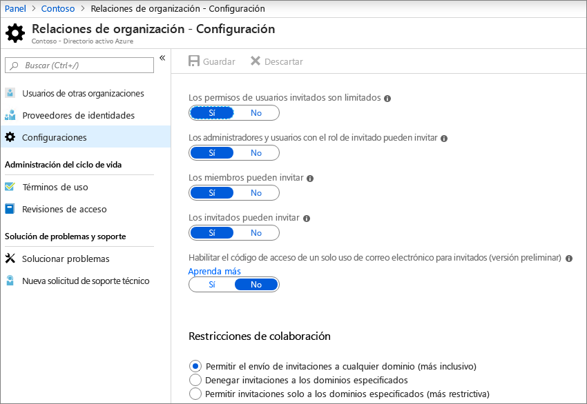
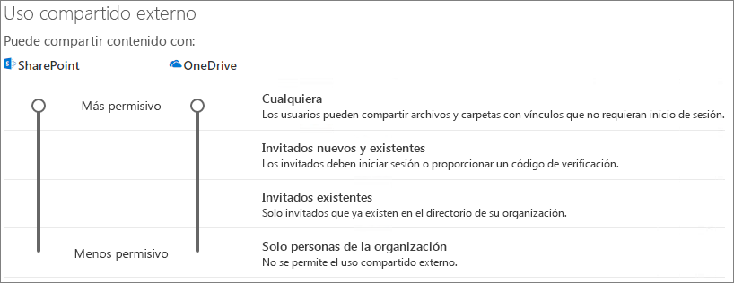
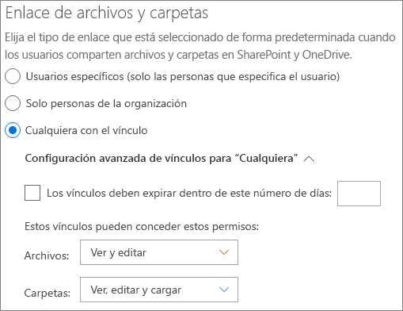
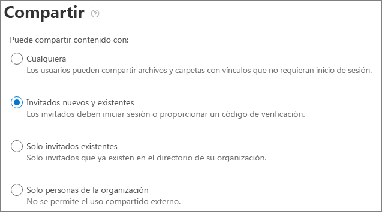

# Colaborar con invitados en un documento

Si necesita colaborar con los invitados en documentos de SharePoint o OneDrive, puede enviarles un vínculo para compartir al documento. En este artículo, analizaremos los pasos de configuración de Microsoft 365 necesarios para configurar los vínculos de uso compartido de SharePoint y OneDrive según las necesidades de su organización.

## Vídeo de demostración

En este vídeo se muestran los pasos de configuración que se describen en este documento. 

> [!VIDEO https://www.microsoft.com/videoplayer/embed/RE450Vt?autoplay=false]

## Configuración de las relaciones de organización de Azure

El uso compartido en Microsoft 365 se rige en su nivel más alto por la configuración de relaciones organizativas en Azure Active Directory. Si el uso compartido de invitado está deshabilitado o restringido en Azure AD, se invalidará cualquier configuración de uso compartido que configure en Microsoft 365.

Compruebe la configuración de relaciones de organización para asegurarse de que no se bloquee el uso compartido con invitados.

Para establecer la configuración de relación organizativa

1. Inicie sesión en Microsoft Azure en [https://portal.azure.com](https://portal.azure.com).
2. En el panel de navegación izquierdo, haga clic en **Azure Active Directory**.
3. En el panel de **información general** , haga clic en **relaciones organizativas**.
4. En el panel relaciones de la **organización** , haga clic en **configuración**.
5. Asegúrese de que los **administradores y los usuarios de la función invitador invitado puedan** invitar y que **los miembros puedan invitar** están establecidos en **sí**.
6. Si ha realizado cambios, haga clic en **Guardar**.

Anote la configuración de la sección **restricciones de colaboración** . Asegúrese de que los dominios de los invitados con los que desea colaborar no están bloqueados.

## Configuración de uso compartido en el nivel de organización de SharePoint

Para que los invitados tengan acceso a un documento en SharePoint o OneDrive, la configuración de uso compartido en el nivel de la organización de SharePoint y OneDrive debe permitir el uso compartido con invitados.

La configuración a nivel de organización para SharePoint determina qué opciones de configuración están disponibles para los sitios de SharePoint individuales. La configuración del sitio no puede ser más permisiva que la configuración de nivel de organización. La configuración en el nivel de la organización para OneDrive determina el nivel de uso compartido que está disponible en las bibliotecas de OneDrive de los usuarios.

Para SharePoint y OneDrive, si quiere permitir el uso compartido de archivos y carpetas sin autenticar, elija **cualquier persona**. Si desea asegurarse de que todos los invitados tienen que autenticarse, elija los **invitados nuevos y existentes**. Los vínculos para *Cualquiera* son la manera más fácil de compartir: los invitados pueden abrir el vínculo sin autenticación y tienen la libertad de compartirlo con otros usuarios.

Para SharePoint, elija la configuración más permisiva que necesitará cualquier sitio de la organización.

Para establecer la configuración de uso compartido en el nivel de la organización de SharePoint

1. En el centro de administración de Microsoft 365, en el panel de navegación izquierdo, en **centros de administración**, haga clic en **SharePoint**.
2. En el Centro de administración de SharePoint, en el panel de navegación izquierdo, haga clic en **Uso compartido**.
3. Asegúrese de que el uso compartido externo para SharePoint o OneDrive está establecido en **cualquiera** o **invitados nuevos o existentes**. (Tenga en cuenta que la configuración de OneDrive no puede ser más permisiva que la configuración de SharePoint).
4. Si ha realizado cambios, haga clic en **Guardar**.

## Configuración de vínculos predeterminados de nivel de organización de SharePoint

La configuración predeterminada de los vínculos de archivos y carpetas determina qué opción de vínculo se muestra al usuario de forma predeterminada cuando comparte un archivo o una carpeta. Los usuarios pueden cambiar el tipo de vínculo a una de las otras opciones antes de compartirlo, si lo desea.

Tenga en cuenta que esta configuración afecta a los sitios de SharePoint de su organización, así como a OneDrive.

Elija el tipo de vínculo que está seleccionado de forma predeterminada cuando los usuarios comparten archivos y carpetas:

- **Cualquiera que tenga el vínculo** : elija esta opción si tiene previsto compartir una gran cantidad de archivos y carpetas sin autenticar. Si desea permitir que *todos* los vínculos, pero le preocupa el uso compartido no autenticado accidentalmente, considere una de las otras opciones como predeterminada. Este tipo de vínculo solo está disponible si ha habilitado a **todos los usuarios** que comparten el mismo.
- **Solo las personas de su organización** : elija esta opción si prevé que la mayoría del uso compartido de archivos y carpetas sea para personas dentro de la organización.
- **Personas específicas** : considere esta opción si espera compartir muchos archivos y carpetas con los invitados. Este tipo de vínculo funciona con los invitados y requiere que se autentiquen.
 

Para establecer la configuración de vínculo predeterminado de SharePoint y OneDrive de la organización

1. Vaya a la página de uso compartido en el centro de administración de SharePoint.
2. En **vínculos de archivos y carpetas**, seleccione el vínculo de uso compartido predeterminado que desee usar.
3. Si ha realizado cambios, haga clic en **Guardar**.

## Configuración de uso compartido del nivel de sitio de SharePoint

Si está compartiendo archivos y fodlers que están en un sitio de SharePoint, también debe comprobar la configuración de uso compartido de nivel de sitio para ese sitio.

Para establecer la configuración de uso compartido de nivel de sitio
1. En el Centro de administración de SharePoint, en el panel de navegación izquierdo, expanda **Sitios** y haga clic en **Sitios activos**.
2. Seleccione el sitio que acaba de crear.
3. En la cinta de opciones, haga clic en **Uso compartido**.
4. Asegúrese de que el uso compartido está establecido en **todos** o en **invitados nuevos o existentes**.
5. Si ha realizado cambios, haga clic en **Guardar**.

## Invitar a usuarios

La configuración de uso compartido de invitados ya está configurada, por lo que los usuarios ahora pueden compartir archivos y carpetas con los invitados. Consulte [compartir archivos y carpetas de OneDrive](https://support.office.com/article/9fcc2f7d-de0c-4cec-93b0-a82024800c07) y [compartir archivos o carpetas de SharePoint](https://support.office.com/article/1fe37332-0f9a-4719-970e-d2578da4941c) para obtener más información.

## Vea también

[Procedimientos recomendados para compartir archivos y carpetas con usuarios no autenticados](best-practices-anonymous-sharing.md)

[Reducir la exposición accidental de archivos al compartirlos con invitados](sharing-limit-accidental-exposure.md)