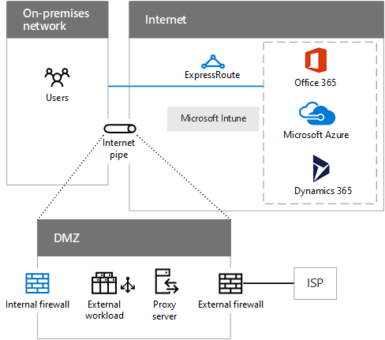

# Elementos comunes de la conectividad de la nube de Microsoft

 **Resumen:** Descubra los elementos comunes de la infraestructura de red y aprenda a preparar la red.
  
La integración de las redes en la nube de Microsoft proporciona un acceso óptimo a una amplia gama de servicios.
  
## Pasos para preparar la red para los servicios en la nube de Microsoft

En la red local:
  
1. Analizar los equipos cliente y optimizar el hardware de red, los controladores de software, la configuración de protocolo y los exploradores de Internet.
    
2. Analizar la red local para determinar la latencia del tráfico y el enrutamiento óptimo del dispositivo perimetral de Internet.
    
3. Analizar la capacidad y el rendimiento del dispositivo perimetral de Internet y optimizar para lograr los niveles más altos de tráfico.
    
Para la conexión a Internet:
  
1. Analizar la latencia entre el dispositivo perimetral de Internet (como el firewall externo) y las ubicaciones regionales del servicio en la nube de Microsoft al que se conecta.
    
2. Analizar la capacidad y la utilización de la conexión actual a Internet y agregar capacidad si es necesario. Otra opción es agregar una conexión de ExpressRoute.
    
## Opciones de conectividad en la nube de Microsoft

Use la canalización de Internet existente o una conexión de ExpressRoute para Office 365, Azure y Dynamics 365.
  
**Figura 1: Opciones para la conectividad en la nube de Microsoft**

  
La figura 1 muestra cómo se puede conectar una red local con las ofertas en la nube de Microsoft usando la canalización de Internet existente o ExpressRoute. La canalización de Internet representa una red perimetral y puede tener los siguientes componentes:
  
- **Firewall interno:** una barrera entre su red de confianza y otra que no sea confiable. Lleva a cabo el filtrado del tráfico (basado en reglas) y la supervisión.
    
- **Carga de trabajo externa:** sitios web u otras cargas de trabajo a disposición de los usuarios externos de Internet.
    
- **Servidor proxy:** atiende las solicitudes de contenido web en nombre de los usuarios de la intranet. Un proxy inverso permite las solicitudes entrantes no solicitadas.
    
- **Firewall externo:** permite el tráfico saliente y el tráfico entrante especificado. Puede traducir direcciones.
    
- **Conexión WAN a ISP:** conexión a un ISP (basada en proveedor) que se comunica con Internet para conseguir la conectividad y el enrutamiento.
    
## Áreas de redes comunes a todos los servicios en la nube de Microsoft

Al adoptar cualquiera de los servicios en la nube de Microsoft, debe tener en cuenta estas áreas de redes.
  
- **Rendimiento de la intranet:** el rendimiento de los recursos de Internet se verá mermado si la intranet, incluidos los equipos cliente, no se optimiza.
    
- **Dispositivos perimetrales:** dispositivos situados en el perímetro de la red son puntos de salida y pueden incluir traductores de direcciones de red (NAT), servidores proxy (incluidos los inversos), firewalls, dispositivos de detección de intrusiones o una combinación.
    
- **Conexión a Internet:** la conexión WAN a Internet y al ISP debe tener suficiente capacidad para albergar las cargas máximas. También puede usar una conexión de ExpressRoute.
    
- **DNS de Internet:** A, AAAA, CNAME, MX, PTR y otros registros para buscar la nube de Microsoft o los servicios hospedados en la nube. Por ejemplo, puede que necesite un registro CNAME para la aplicación hospedada en PaaS de Azure.
    
## See Also

[Microsoft Cloud Networking para arquitectos profesionales](microsoft-cloud-networking-for-enterprise-architects.md)
  
[Recursos de arquitectura de TI de la nube de Microsoft](microsoft-cloud-it-architecture-resources.md)

[Mapa de ruta de Enterprise Cloud de Microsoft: Recursos para los responsables de decisiones de TI](https://sway.com/FJ2xsyWtkJc2taRD)

