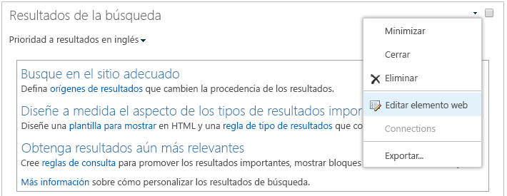

# Configurar la búsqueda para Office 365 Multi-GeoConfigure Search for Office 365 Multi-Geo

En un entorno multigeográfico, cada ubicación geográfica tiene su propio índice de búsqueda y centro de búsqueda.In a multi-geo environment, each geo location has its own search index and Search Center. Cuando un usuario realiza una búsqueda, se efectúa una distribución ramificada de la consulta a todos los índices y los resultados devueltos se combinan.When a user searches, the query is fanned out to all the indexes, and the returned results are merged.

Por ejemplo, un usuario de una ubicación geográfica puede realizar búsquedas de contenido almacenado en otra ubicación geográfica o contenido de un sitio de SharePoint que está restringido a otra ubicación geográfica.For example, a user in one geo location can search for content stored in another geo location, or for content on a SharePoint site that's restricted to a different geo location. Si el usuario tiene acceso a este contenido, la búsqueda mostrará el resultado.If the user has access to this content, search will show the result.

## ¿Qué clientes de búsqueda trabajan en un entorno multigeográfico?Which search clients work in a multi-geo environment?

Estos clientes pueden devolver resultados de todas las ubicaciones geográficas:These clients can return results from all geo locations:

-   OneDrive para la EmpresaOneDrive for Business

-   DelveDelve

-   Página principal de SharePointThe SharePoint home page

-   Centro de búsquedaThe Search Center

-   Aplicaciones de búsqueda personalizada que usan la API de SharePoint SearchCustom search applications that use the SharePoint Search API

### OneDrive para la EmpresaOneDrive for Business

En cuanto se haya configurado el entorno multigeográfico, los usuarios que busquen en OneDrive obtendrán resultados de todas las ubicaciones geográficas.As soon as the multi-geo environment has been set up, users that search in OneDrive get results from all geo locations.

### DelveDelve

En cuanto se haya configurado el entorno multigeográfico, los usuarios que busquen en Delve obtendrán resultados de todas las ubicaciones geográficas.As soon as the multi-geo environment has been set up, users that search in Delve get results from all geo locations.

La fuente de Delve y la tarjeta de perfil solo muestran vistas previas de los archivos almacenados en la ubicación central.The Delve feed and the profile card only show previews of files that are stored in the central location. Para los archivos que se almacenan en ubicaciones satélite, se muestra el icono del tipo de archivo en su lugar.For files that are stored in satellite locations, the icon for the file type is shown instead.

### Página principal de SharePointThe SharePoint home page

En cuanto se haya configurado el entorno multigeográfico, los usuarios verán noticias, sitios seguidos y recientes desde varias ubicaciones geográficas en su página principal de SharePoint. Si usan el cuadro de búsqueda en la página principal de SharePoint, obtendrán resultados combinados desde varias ubicaciones geográficas.As soon as the multi-geo environment has been set up, users will see news, recent and followed sites from multiple geo locations on their SharePoint home page. If they use the search box on the SharePoint home page, they'll get merged results from multiple geo locations.

### Centro de búsquedaThe Search Center

Cuando se haya configurado el entorno multigeográfico, cada Centro de búsqueda sigue mostrando solo los resultados de su propia ubicación geográfica. Los administradores deben [cambiar la configuración de cada Centro de búsqueda](#_Set_up_a_1) para obtener resultados de todas las ubicaciones geográficas. Después, los usuarios que realicen búsquedas en el Centro de búsqueda obtendrán resultados de todas las ubicaciones geográficas.After the multi-geo environment has been set up, each Search Center continues to only show results from their own geo location. Admins must [change the settings of each Search Center](#_Set_up_a_1) to get results from all geo locations. Afterwards, users that search in the Search Center get results from all geo locations.

### Aplicaciones de búsqueda personalizadaCustom search applications

Como de costumbre, las aplicaciones de búsqueda personalizada interactúan con los índices de búsqueda mediante las API REST de SharePoint Search existentes. Para obtener resultados de todas o algunas de las ubicaciones geográficas, la aplicación tiene que [llamar a la API e incluir los nuevos parámetros de consulta multigeográfica](#_Get_custom_search) en la solicitud. Esto desencadena la distribución ramificada de la consulta a todas las ubicaciones geográficas.As usual, custom search applications interact with the search indexes by using the existing SharePoint Search REST APIs. To get results from all, or some geo locations, the application must [call the API and include the new Multi-Geo query parameters](#_Get_custom_search) in the request. This triggers a fan out of the query to all geo locations.

## ¿En qué se diferencia la búsqueda en un entorno multigeográfico?What's different about search in a multi-geo environment?

Algunas características de búsqueda con las que tal vez esté familiarizado, funcionan de forma distinta en un entorno multigeográfico.Some search features you might be familiar with, work differently in a multi-geo environment.

<table>
<thead>
<tr class="header">
<th align="left"><strong>Característica</strong><strong>Feature</strong></th>
<th align="left"><strong>Funcionamiento</strong><strong>How it works</strong></th>
<th align="left"><strong>Solución alternativa</strong><strong>Workaround</strong></th>
</tr>
</thead>
<tbody>
<tr class="odd">
<td align="left">Resultados promocionadosPromoted results</td>
<td align="left">Puede crear reglas de consulta con resultados promocionados a diferentes niveles: para todo el inquilino, para una colección de sitios o para un sitio.You can create query rules with promoted results at different levels: for the whole tenant, for a site collection, or for a site. En un entorno multigeográfico, defina los resultados promocionados a nivel de espacio empresarial para promover los resultados a los centros de búsqueda en todas las ubicaciones geográficas.In a multi-geo environment, define promoted results at the tenant level to promote the results to the Search Centers in all geo locations. Si solo quiere promover los resultados del Centro de búsqueda que se encuentra en la ubicación geográfica del sitio o la colección de sitios, defina los resultados en el nivel de colección de sitios o de sitio.If you only want to promote results in the Search Center that's in the geo location of the site collection or site, define the promoted results at the site collection or site level. Estos resultados no se promueven en otras ubicaciones geográficas.These results are not promoted in other geo locations.</td>
<td align="left">Si no necesita resultados promocionados distintos por ubicación geográfica, por ejemplo, diferentes reglas de viaje, se recomienda definir los resultados promocionados en el nivel de espacio empresarial.If you don't need different promoted results per geo location, for example different rules for traveling, we recommend defining promoted results at the tenant level.</td>
</tr>
<tr class="even">
<td align="left">Refinadores de búsquedasSearch refiners</td>
<td align="left">La búsqueda devuelve refinadores de todas las ubicaciones geográficas de un espacio empresarial y luego los agrega. La agregación es la mejor posible, lo que significa que puede que los recuentos de refinadores no sean exactos al 100%. Para la mayoría de los escenarios basado en búsquedas esta precisión es suficiente. Search returns refiners from all the geo locations of a tenant and then aggregates them. The aggregation is a best effort, meaning that the refiner counts might not be 100% accurate. For most search-driven scenarios, this accuracy is sufficient. </td>
<td align="left">En aplicaciones basadas en búsquedas que dependen de la exhaustividad del refinador, consulte cada ubicación geográfica por separado.For search-driven applications that depend on refiner completeness, query each geo location independently.</td>
</tr>
<tr class="odd">
<td align="left"></td>
<td align="left">La búsqueda multigeográfica no admite la creación dinámica de cubos para refinadores numéricos.Multi-geo search doesn't support dynamic bucketing for numerical refiners.</td>
<td align="left">Use el parámetro <a href="https://docs.microsoft.com/sharepoint/dev/general-development/query-refinement-in-sharepoint">“Discretize”</a> para refinadores numéricos.Use the <a href="https://docs.microsoft.com/sharepoint/dev/general-development/query-refinement-in-sharepoint">“Discretize” parameter</a> for numerical refiners.</td>
</tr>
<tr class="even">
<td align="left">Identificadores de documentoDocument IDs</td>
<td align="left">Si está desarrollando una aplicación basada en búsquedas que depende de los identificadores de documento, tenga en cuenta que los identificadores de documento en un entorno multigeográfico no son únicos en todas las ubicaciones geográficas, son únicos por ubicación geográfica.If you're developing a search-driven application that depends on document IDs, note that document IDs in a multi-geo environment aren't unique across geo locations, they are unique per geo location.</td>
<td align="left">Hemos agregado una columna que identifica la ubicación geográfica.We've added a column that identifies the geo location. Utilice esta columna para lograr unicidad.Use this column to achieve uniqueness. Esta columna se denomina "GeoLocationSource".This column is named “GeoLocationSource”.</td>
</tr>
<tr class="odd">
<td align="left">Número de resultadosNumber of results</td>
<td align="left">La página de resultados de búsqueda muestra los resultados combinados de las ubicaciones geográficas, pero no es posible ver más allá de 500 resultados.The search results page shows combined results from the geo locations, but it's not possible to page beyond 500 results.</td>
<td align="left"></td>
</tr>
<tr class="even">
<td align="left">Búsqueda híbridaHybrid search</td>
<td align="left">En un entorno de SharePoint híbrido con <a href="https://docs.microsoft.com/sharepoint/hybrid/learn-about-cloud-hybrid-search-for-sharepoint">búsqueda de nube híbrida</a>, el contenido local se agrega al índice de Office 365 de la ubicación central.In a hybrid SharePoint environment with <a href="https://docs.microsoft.com/sharepoint/hybrid/learn-about-cloud-hybrid-search-for-sharepoint">cloud hybrid search</a>,  on-premises content is added to the Office 365 index of the central location.</td>
<td align="left"></td>
</tr>
</tbody>
</table>

## ¿Qué no es compatible con la búsqueda en un entorno multigeográfico?What's not supported for search in a multi-geo environment?

Algunas características de búsqueda con las que tal vez esté familiarizado, no se admiten en un entorno multigeográfico.Some of the search features you might be familiar with, aren't supported in a multi-geo environment.

<table>
<thead>
<tr class="header">
<th align="left"><strong>Característica de búsqueda</strong><strong>Search feature</strong></th>
<th align="left"><strong>Nota</strong><strong>Note</strong></th>
</tr>
</thead>
<tbody>
<tr class="odd">
<td align="left">Autenticación solo de aplicaciónApp-only authentication</td>
<td align="left">La autenticación solo de aplicación (acceso con privilegios desde servicios) no se admite en la búsqueda multigeográfica.App-only authentication (privileged access from services) isn't supported in multi-geo search.</td>
</tr>
<tr class="even">
<td align="left">Usuarios invitadosGuest users</td>
<td align="left">Los usuarios invitados solo obtienen resultados de la ubicación geográfica desde la que buscan.Guest users only get results from the geo location that they're searching from.</td>
</tr>
</tbody>
</table>

## ¿Cómo funciona la búsqueda en un entorno multigeográfico?How does search work in a multi-geo environment?

Todos los clientes de búsqueda usan la API REST de SharePoint Search existente para interactuar con los índices de búsqueda.All the search clients use the existing SharePoint Search REST APIs to interact with the search indexes.

1. Un cliente de búsqueda llama al punto de conexión de REST de búsqueda con la propiedad EnableMultiGeoSearch= true.A search client calls the Search REST endpoint with the query property EnableMultiGeoSearch= true.
2. La consulta se envía a todas las ubicaciones geográficas del espacio empresarial.The query is sent to all geo locations in the tenant.
3. Los resultados de búsqueda de cada ubicación geográfica se combinan y clasifican.Search results from each geo location are merged and ranked.
4. El cliente obtiene resultados unificados.The client gets unified search results.

Observe que no combinamos los resultados de búsqueda hasta que hemos recibido los resultados de todas las ubicaciones geográficas.Notice that we don't merge the search results until we've received results from all the geo locations. Esto significa que las búsquedas multigeográficas tienen latencia adicional con respecto a las búsquedas en un entorno de una sola ubicación geográfica.This means that multi-geo searches have additional latency compared to searches in an environment with only one geo location.

## Obtener un Centro de búsqueda que muestre los resultados de todas las ubicaciones geográficasGet a Search Center to show results from all geo locations

Cada Centro de búsqueda tiene varios sectores verticales y hay que configurar individualmente cada sector vertical.Each Search Center has several verticals and you have to set up each vertical individually.

1.  Asegúrese de realizar estos pasos con una cuenta que tenga permiso para editar la página de resultados de búsqueda y el elemento web de resultados de búsqueda.Ensure that you perform these steps with an account that has permission to edit the search results page and the Search Result Web Part.

2.  Navegue a la página de resultados de búsqueda (vea la [lista](https://support.office.com/article/174d36e0-2f85-461a-ad9a-8b3f434a4213) de páginas de resultados de búsqueda).Navigate to the search results page (see the [list](https://support.office.com/article/174d36e0-2f85-461a-ad9a-8b3f434a4213) of search results pages)

3.  Seleccione el sector vertical que quiere configurar, haga clic en el icono de engranaje **Configuración** de la esquina superior derecha y luego en **Editar página**. La página de resultados de búsqueda se abre en modo de edición.Select the vertical to set up, click **Settings** gear icon in the upper, right corner, and then click **Edit Page**. The search results page opens in Edit mode.

     
1.  En el elemento web Resultados de búsqueda, mueva el puntero a la esquina superior derecha del elemento web, haga clic en la flecha y, a continuación, haga clic en **Editar elemento web** en el menú.In the Search Results Web Part, move the pointer to the upper, right corner of the web part, click the arrow, and then click **Edit Web Part** on the menu. El panel de herramientas del elemento web de resultados de búsqueda se abrirá debajo de la cinta en la parte superior derecha de la página.The Search Results Web Part tool pane opens under the ribbon in the top right of the page. 

1.  En la sección **Configuración** del panel de herramientas del elemento web de resultados de búsqueda, en **Configuración de control de resultados**, seleccione **Show Multi-Geo results** (Mostrar resultados multigeográficos) para que el elemento web de resultados de la búsqueda muestre los resultados de todas las ubicaciones geográficas.In the Web Part tool pane, in the **Settings** section, under **Results control settings**, select **Show Multi-Geo results** to get the Search Results Web Part to show results from all geo locations.

2.  Haga clic en **Aceptar** para guardar los cambios y cierre el panel de herramientas del elemento web.Click **OK** to save your change and close the Web Part tool pane.

3.  Para comprobar los cambios realizados en el elemento web de resultados de búsqueda, haga clic en **Proteger** en la pestaña de página del menú principal.Check your changes to the Search Results Web Part by clicking **Check-In** on the Page tab of the main menu.

4.  Publique los cambios mediante el vínculo incluido en la nota de la parte superior de la página.Publish the changes by using the link provided in the note at the top of the page.

## Obtener aplicaciones de búsqueda personalizada que muestren los resultados de todas o algunas de las ubicaciones geográficasGet custom search applications to show results from all or some geo locations

Las aplicaciones de búsqueda personalizada obtienen resultados de todas o algunas de las ubicaciones geográficas especificando parámetros de consulta con la solicitud a la API REST de SharePoint Search. En función de los parámetros de consulta, se efectúa una distribución ramificada de la consulta a todas o a algunas de las ubicaciones geográficas. Por ejemplo, si solo tiene que consultar un subconjunto de las ubicaciones geográficas para encontrar información relevante, puede controlar la distribución ramificada a solo estas. Si la solicitud se realiza correctamente, la API REST de SharePoint Search devuelve datos de respuesta.Custom search applications get results from all, or some, geo locations by specifying query parameters with the request to the SharePoint Search REST API. Depending on the query parameters, the query is fanned out to all geo locations, or to some geo locations. For example, if you only need to query a subset of geo locations to find relevant information, you can control the fan out to only these. If the request succeeds, the SharePoint Search REST API returns response data.

**Requisito****Requirement**

Para cada ubicación geográfica, debe asegurarse de que se ha concedido a todos los usuarios de la organización el nivel de permisos de **lectura** para el sitio web raíz (por ejemplo, contoso**APAC**.sharepoint.com/ y contoso**UE**.sharepoint.com/). [Más información sobre permisos](https://support.office.com/article/understanding-permission-levels-in-sharepoint-87ecbb0e-6550-491a-8826-c075e4859848).For each geo location, you must ensure that all users in the organization have been granted the **Read** permission level for the root website (for example contoso**APAC**.sharepoint.com/ and contoso**EU**.sharepoint.com/). [Learn about permissions](https://support.office.com/article/understanding-permission-levels-in-sharepoint-87ecbb0e-6550-491a-8826-c075e4859848).

### Parámetros de consultaQuery parameters

EnableMultiGeoSearch: valor booleano que especifica si se efectuará una distribución ramificada de la consulta a los índices de otras ubicaciones geográficas del inquilino multigeográfico.EnableMultiGeoSearch - This is a Boolean value that specifies whether the query shall be fanned out to the indexes of other geo locations of the multi-geo tenant. Establézcalo en **true** para efectuar una distribución ramificada de la consulta o en **false** para no hacerlo.Set it to **true** to fan out the query; **false** to not fan out the query. Si no incluye este parámetro, el valor por defecto es**falso**, excepto cuando se realiza una llamada a REST API contra un sitio que utiliza la plantilla de Enterprise Search Center, en este caso el valor por defecto es **verdadero**. If you don't include this parameter, the default value is **false**, except when making a REST API call against a site which uses the Enterprise Search Center template, in this case the default value is **true**. Si usa el parámetro en un entorno que no es multigeográfico, se ignorará el parámetro.If you use the parameter in an environment that isn't multi-geo, the parameter is ignored.

ClientType: es una cadena.ClientType - This is a string. Escriba un nombre de cliente único para cada aplicación de búsqueda.Enter a unique client name for each search application. Si no incluye este parámetro, no se efectúa una distribución ramificada de la consulta a otra ubicación geográfica.If you don't include this parameter, the query is not fanned out to other geo locations.

MultiGeoSearchConfiguration: lista opcional de las ubicaciones geográficas del inquilino multigeográfico que se distribuyen cuando **EnableMultiGeoSearch** es **true**.MultiGeoSearchConfiguration - This is an optional list of which geo locations in the multi-geo tenant to fan the query out to when **EnableMultiGeoSearch** is **true**. Si no incluye este parámetro o lo deja en blanco, se efectúa una distribución ramificada de la consulta a todas las ubicaciones geográficas.If you don't include this parameter, or leave it blank, the query is fanned out to all geo locations. Para cada ubicación geográfica, escriba los elementos siguientes, con formato JSON:For each geo location, enter the following items, in JSON format:

<table>
<thead>
<tr class="header">
<th align="left">ElementoItem</th>
<th align="left">DescripciónDescription</th>
</tr>
</thead>
<tbody>
<tr class="odd">
<td align="left">DataLocationDataLocation</td>
<td align="left">Ubicación geográfica, por ejemplo, NAM.The geo location, for example NAM.</td>
</tr>
<tr class="even">
<td align="left">EndPointEndPoint</td>
<td align="left">Punto de conexión al que conectarse; por ejemplo, https://contoso.sharepoint.comThe endpoint to connect to, for example https://contoso.sharepoint.com</td>
</tr>
<tr class="odd">
<td align="left">SourceIdSourceId</td>
<td align="left">GUID del origen de resultados, por ejemplo, B81EAB55-3140-4312-B0F4-9459D1B4FFEE.The GUID of the result source, for example B81EAB55-3140-4312-B0F4-9459D1B4FFEE.</td>
</tr>
</tbody>
</table>

Si omite DataLocation o EndPoint, o si una DataLocation se duplica, la solicitud no se realiza. [Puede obtener información sobre el punto de conexión de las ubicaciones geográficas de un espacio empresarial con Microsoft Graph](https://docs.microsoft.com/sharepoint/dev/solution-guidance/multigeo-discovery).If you omit DataLocation or EndPoint, or if a DataLocation is duplicated, the request fails. [You can get information about the endpoint of a tenant's geo locations by using Microsoft Graph](https://docs.microsoft.com/sharepoint/dev/solution-guidance/multigeo-discovery).

### Datos de respuestaResponse data

MultiGeoSearchStatus: se trata de una propiedad que devuelve la API de SharePoint Search en respuesta a una solicitud. El valor de la propiedad es una cadena y proporciona la información siguiente sobre los resultados que devuelve la API de SharePoint Search:MultiGeoSearchStatus – This is a property that the SharePoint Search API returns in response to a request. The value of the property is a string and gives the following information about the results that the SharePoint Search API returns:

<table>
<thead>
<tr class="header">
<th align="left">ValorValue</th>
<th align="left">DescripciónDescription</th>
</tr>
</thead>
<tbody>
<tr class="odd">
<td align="left">FullFull</td>
<td align="left">Resultados completos de <strong>todas</strong> ubicaciones geográficas.Full results from <strong>all</strong> the geo locations.</td>
</tr>
<tr class="even">
<td align="left">PartialPartial</td>
<td align="left">Resultados parciales de una o varias ubicaciones geográficas. Los resultados están incompletos debido a un error transitorio.Partial results from one or more geo locations. The results are incomplete due to a transient error.</td>
</tr>

</tbody>
</table>

### Consultar con el servicio RESTQuery using the REST service

Con una solicitud GET, especifica los parámetros de consulta en la dirección URL. Con una solicitud de POST, pasa los parámetros de consulta del cuerpo en el formato de notación de objetos JavaScript (JSON).With a GET request, you specify the query parameters in the URL. With a POST request, you pass the query parameters in the body in JavaScript Object Notation (JSON) format.

#### Encabezados de solicitudRequest headers

<table>
<thead>
<tr class="header">
<th align="left">NombreName</th>
<th align="left">ValorValue</th>
</tr>
</thead>
<tbody>
<tr class="odd">
<td align="left">Content-TypeContent-Type</td>
<td align="left">application/json;odata=verboseapplication/json;odata=verbose</td>
</tr>
</tbody>
</table>

#### Ejemplo de distribución ramificada de una solicitud GET a **todas** las ubicaciones geográficasSample GET request that's fanned out to **all** geo locations

https:// \<espacio empresarial\>/\_api/search/query?querytext='sharepoint'&Properties='EnableMultiGeoSearch:true'&ClientType='my\_client\_id'https:// \<tenant\>/\_api/search/query?querytext='sharepoint'&Properties='EnableMultiGeoSearch:true'&ClientType='my\_client\_id'

#### Ejemplo de solicitud GET para efectuar una distribución ramificada en **algunas** ubicaciones geográficasSample GET request to fan out to **some** geo locations

https:// \<tenant\>/\_api/search/query?querytext='site'&ClientType='my_client_id'&Properties='EnableMultiGeoSearch:true, MultiGeoSearchConfiguration:[{DataLocation\\:"NAM"\\,Endpoint\\:"https\\://contosoNAM.sharepoint.com"\\,SourceId\\:"B81EAB55-3140-4312-B0F4-9459D1B4FFEE"}\\,{DataLocation\\:"CAN"\\,Endpoint\\:"https\\://contosoCAN.sharepoint-df.com"}]'https:// \<tenant\>/\_api/search/query?querytext='site'&ClientType='my_client_id'&Properties='EnableMultiGeoSearch:true, MultiGeoSearchConfiguration:[{DataLocation\\:"NAM"\\,Endpoint\\:"https\\://contosoNAM.sharepoint.com"\\,SourceId\\:"B81EAB55-3140-4312-B0F4-9459D1B4FFEE"}\\,{DataLocation\\:"CAN"\\,Endpoint\\:"https\\://contosoCAN.sharepoint-df.com"}]'

> [!NOTE]
> Las comas y los dos puntos de la lista de ubicaciones geográficas de la propiedad MultiGeoSearchConfiguration van precedidas por el carácter **barra diagonal inversa**.Commas and colons in the list of geo locations for the MultiGeoSearchConfiguration property are preceded by the **backslash** character. Esto se debe a que las solicitudes GET usan dos puntos para separar las propiedades y comas para separar los argumentos de las propiedades.This is because GET requests use colons to separate properties and commas to separate arguments of properties. Sin la barra diagonal inversa como carácter de escape, la propiedad MultiGeoSearchConfiguration se interpreta de forma errónea.Without the backslash as an escape character, the MultiGeoSearchConfiguration property is interpreted wrongly.

#### Ejemplo de distribución ramificada de una solicitud POST a **todas** las ubicaciones geográficasSample POST request that's fanned out to **all** geo locations

    {
        "request": {
            "__metadata": {
            "type": "Microsoft.Office.Server.Search.REST.SearchRequest"
        },
        "Querytext": "sharepoint",
        "Properties": {
            "results": [
                {
                    "Name": "EnableMultiGeoSearch",
                    "Value": {
                        "QueryPropertyValueTypeIndex": 3,
                        "BoolVal": true
                    }
                }
            ]
        },
        "ClientType": "my_client_id"
        }
    }

#### Ejemplo de distribución ramificada de una solicitud POST a **algunas** ubicaciones geográficasSample POST request that's fanned out to **some** geo locations

    {
        "request": {
            "Querytext": "SharePoint",
            "ClientType": "my_client_id",
            "Properties": {
                "results": [
                    {
                        "Name": "EnableMultiGeoSearch",
                        "Value": {
                            "QueryPropertyValueTypeIndex": 3,
                            "BoolVal": true
                        }
                    },
                    {
                        "Name": "MultiGeoSearchConfiguration",
                        "Value": {
                        "StrVal": "[{\"DataLocation\":\"NAM\",\"Endpoint\":\"https://contoso.sharepoint.com\",\"SourceId\":\"B81EAB55-3140-4312-B0F4-9459D1B4FFEE\"},{\"DataLocation\":\"CAN\",\"Endpoint\":\"https://contosoCAN.sharepoint.com\"}]",
                            "QueryPropertyValueTypeIndex": 1
                        }
                    }
                ]
            }
        }
    }

### Consultar con CSOMQuery using CSOM

Ejemplo de distribución ramificada de una consulta CSOM a **todas** las ubicaciones geográficas:Here's a sample CSOM query that's fanned out to **all** geo locations:

    var keywordQuery = new KeywordQuery(ctx);
    keywordQuery.QueryText = query.SearchQueryText;
    keywordQuery.ClientType = <enter a string here>;
    keywordQuery["EnableMultiGeoSearch"] = true;

