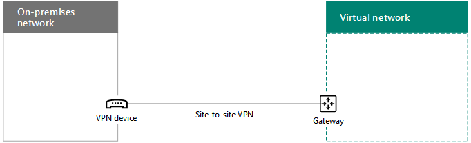

# <a name="connect-an-on-premises-network-to-a-microsoft-azure-virtual-network"></a>Conectar una red local con una red virtual de Microsoft Azure

 **Resumen:** Aprenda a configurar una red virtual de Azure entre locales para las cargas de trabajo de servidor de Office.
  
Una red virtual de Azure entre locales se conecta a la red local, extendiendo la red para incluir subredes y máquinas virtuales hospedadas en servicios de infraestructura de Azure. Esta conexión permite a los equipos de la red local obtener acceso directamente a máquinas virtuales en Azure, y viceversa. 

Por ejemplo, un servidor de sincronización de directorios que se ejecute en una máquina virtual de Azure necesita consultar los controladores de dominio locales para identificar cambios en cuentas y sincronizar esos cambios con la suscripción de Office 365. En este artículo, se muestra cómo configurar una red virtual de Azure entre locales con una conexión de red privada virtual (VPN) de sitio a sitio que esté preparada para hospedar Azure Virtual Machines.

## <a name="overview"></a>Información general

Las máquinas virtuales en Azure no tienen que estar aisladas de su entorno local. Para conectar máquinas virtuales de Azure en sus recursos de red locales, debe configurar una red virtual de Azure entre locales. En el siguiente diagrama se muestran los componentes requeridos para implementar una red virtual de Azure entre locales con una máquina virtual en Azure.
  

  
En el diagrama, hay dos redes conectadas por una conexión de red privada virtual (VPN) de sitio a sitio: la red local y la red virtual de Azure. La conexión VPN de sitio a sitio:

- Se realiza entre dos puntos de conexión direccionables que se encuentran en Internet de acceso público.
- Se termina con un dispositivo VPN en la red local y una Azure VPN Gateway en la red virtual de Azure.

La red virtual de Azure hospeda las máquinas virtuales. El tráfico de red que procede de las máquinas virtuales en la red virtual de Azure se reenvía a la VPN Gateway que, a su vez, reenvía el tráfico a través de una conexión VPN de sitio a sitio hasta el dispositivo VPN en la red local. Después, la infraestructura de enrutamiento de la red local reenvía el tráfico a su destino.

>[!Note]
>También puede usar [ExpressRoute](https://azure.microsoft.com/services/expressroute/), que es una conexión directa entre su organización y la red de Microsoft. El tráfico a través de ExpressRoute no viaja por Internet de acceso público. En este artículo, no se describe el uso de ExpressRoute.
>
  
Para configurar la conexión VPN entre la red virtual de Azure y su red local, siga este procedimiento: 
  
1. **Local:** Defina y cree una ruta de red local para el espacio de direcciones de la red virtual de Azure que señale a su dispositivo de VPN local.
    
2. **Microsoft Azure:** cree una red virtual de Azure con una conexión VPN de sitio a sitio. 
    
3. **Local:** configure el dispositivo VPN de hardware o software local para finalizar la conexión VPN, que usa el Protocolo de seguridad de Internet (IPsec).
    
Después de establecer la conexión VPN de sitio a sitio, agregue máquinas virtuales de Azure a las subredes de la red virtual.
  
## <a name="plan-your-azure-virtual-network"></a>Planear la red virtual de Azure
<a name="PlanningVirtual"></a>

### <a name="prerequisites"></a>Requisitos previos
<a name="Prerequisites"></a>

- Una suscripción de Azure. Para obtener información sobre las suscripciones de Azure, vaya a la página [Comprar Azure](https://azure.microsoft.com/pricing/purchase-options/).
    
- Un espacio de direcciones IPv4 privadas que está disponible y que se puede asignar a la red virtual y sus subredes, con suficiente espacio para albergar el incremento en el número de máquinas virtuales necesarias ahora y en el futuro.
    
- Un dispositivo VPN disponible en la red local para finalizar la conexión VPN de sitio a sitio que admite los requisitos para IPsec. Para obtener más información, consulte [Acerca de los dispositivos VPN para las conexiones de red virtual de sitio a sitio](https://go.microsoft.com/fwlink/p/?LinkId=393093).
    
- Cambios en la infraestructura de enrutamiento de modo que el tráfico enrutado al espacio de direcciones de la red virtual de Azure se reenvía al dispositivo VPN que hospeda a la conexión VPN de sitio a sitio.
    
- Un proxy web que da acceso a Internet a los equipos que están conectados a la red local y la red virtual de Azure.
    
### <a name="solution-architecture-design-assumptions"></a>Suposiciones de diseño de la arquitectura de la solución

En la siguiente lista se representan las elecciones de diseño que se han tomado para la arquitectura de esta solución. 
  
- Esta solución usa una sola red virtual de Azure con una conexión VPN de sitio a sitio. La red virtual de Azure hospeda a una sola subred que puede contener varias máquinas virtuales. 
    
- Puede usar el Servicio de enrutamiento y acceso remoto (RRAS) en Windows Server 2016 o Windows Server 2012 para establecer una conexión VPN de sitio a sitio de IPsec entre la red local y la red virtual de Azure. También puede usar otras opciones, como dispositivos VPN de Cisco o Juniper Networks.
    
- La red local aún podría tener servicios de red como Windows Server Active Directory (AD), Sistema de nombres de dominio (DNS) y servidores proxy. Según los requisitos, podría resultar conveniente colocar algunos de estos recursos de red en la red virtual de Azure.
    
Para una red virtual de Azure existente con una subred o más, determine si queda espacio de direcciones para que una subred adicional hospede las máquinas virtuales que necesita, en función de los requisitos. Si no le queda más espacio de direcciones para una subred adicional, cree una red virtual adicional que tenga su propia conexión VPN de sitio a sitio.
  
### <a name="plan-the-routing-infrastructure-changes-for-the-azure-virtual-network"></a>Planear los cambios de infraestructura de enrutamiento de la red virtual de Azure

Debe configurar la infraestructura de enrutamiento local para reenviar tráfico destinado para el espacio de direcciones de la red virtual de Azure al dispositivo VPN local que está hospedando la conexión VPN de sitio a sitio.
  
El método exacto de actualizar su infraestructura de enrutamiento depende de cómo administra la información de enrutamiento, que puede ser:
  
- Actualizaciones de tabla de enrutamiento basadas en configuración manual.
    
- Actualizaciones de tabla de enrutamiento basadas en protocolos de enrutamiento, como Protocolo de información de enrutamiento (RIP) o Abrir ruta de acceso más corta primero (OSPF).
    
Consulte con su especialista en enrutamiento para asegurarse de que el tráfico destinado a la red virtual de Azure se reenvía al dispositivo de VPN local.
  
### <a name="plan-for-firewall-rules-for-traffic-to-and-from-the-on-premises-vpn-device"></a>Planear para reglas de firewall para tráfico desde el dispositivo VPN local y hacia el dispositivo

Si el dispositivo VPN está en una red perimetral que tiene un firewall entre la red perimetral e Internet, es posible que deba configurar el firewall para las siguientes reglas a fin de permitir la conexión de VPN de sitio a sitio.
  
- Tráfico al dispositivo VPN (entrante desde Internet):
    
  - Dirección IP de destino del dispositivo VPN y protocolo IP 50
    
  - Dirección IP de destino del dispositivo VPN y puerto de destino UDP 500
    
  - Dirección IP de destino del dispositivo VPN y puerto de destino UDP 4500
    
- Tráfico desde el dispositivo VPN (saliente a Internet):
    
  - Dirección IP de origen del dispositivo VPN y protocolo IP 50
    
  - Dirección IP de origen del dispositivo VPN y puerto de origen UDP 500
    
  - Dirección IP de origen del dispositivo VPN y puerto de origen UDP 4500
    
### <a name="plan-for-the-private-ip-address-space-of-the-azure-virtual-network"></a>Planear el espacio de direcciones IP privadas de la red virtual de Azure

El espacio de direcciones IP privadas de la red virtual de Azure debe poder albergar las direcciones utilizadas por Azure para hospedar a la red virtual con al menos una subred que tenga suficientes direcciones para sus máquinas virtuales de Azure.
  
Para determinar el número de direcciones necesarias para la subred, cuente el número de máquinas virtuales que necesita ahora, estime el crecimiento futuro y luego use la siguiente tabla para determinar el tamaño de la subred.
  
|**Número de máquinas virtuales necesarias**|**Número de bits de host necesarios**|**Tamaño de la subred**|
|:-----|:-----|:-----|
|1-3  <br/> |3  <br/> |/29  <br/> |
|4-11  <br/> |4  <br/> |/28  <br/> |
|12-27  <br/> |5  <br/> |/27  <br/> |
|28-59  <br/> |6  <br/> |/26  <br/> |
|60-123  <br/> |7  <br/> |/25  <br/> |
   
### <a name="planning-worksheet-for-configuring-your-azure-virtual-network"></a>Planear la hoja de cálculo para configurar la red virtual de Azure
<a name="worksheet"> </a>

Antes de crear una red virtual de Azure para hospedar las máquinas virtuales, debe determinar la configuración necesaria en las tablas siguientes.
  
Para la configuración de la red virtual, rellene la Tabla V.
  
 **Tabla V: Configuración de la red virtual entre locales**
  
|**Elemento**|**Elemento Configuration**|**Descripción**|**Valor**|
|:-----|:-----|:-----|:-----|
|1.  <br/> |Nombre de la red virtual  <br/> |Nombre que se va a asignar a la red virtual de Azure (por ejemplo, DirSyncNet).  <br/> | |
|2.  <br/> |Ubicación de la red virtual  <br/> |Centro de datos de Azure que contendrá la red virtual (por ejemplo, Oeste de EE. UU.).  <br/> |  <br/> |
|3.  <br/> |Dirección IP del dispositivo VPN  <br/> |Dirección IPv4 pública de la interfaz del dispositivo VPN en Internet. Colabore con su departamento de TI para determinar esta dirección.  <br/> |  <br/> |
|4.  <br/> |Espacio de direcciones de la red virtual  <br/> |Espacio de direcciones (definido en un único prefijo de dirección privada) para la red virtual. Colabore con su departamento de TI para determinar este espacio de direcciones. El espacio de direcciones debe estar en formato de Enrutamiento de interdominios sin clases (CIDR), también conocido como formato de prefijo de red. Por ejemplo, 10.24.64.0/20.  <br/> | <br/> |
|5.  <br/> |Clave compartida IPsec  <br/> |Cadena alfanumérica aleatoria de 32 caracteres que se usará para autenticar ambos lados de la conexión VPN de sitio a sitio. Colabore con su departamento de TI o de seguridad para determinar el valor de esta clave y después almacénelo en una ubicación segura. También puede consultar [Crear una cadena aleatoria para una clave precompartida IPsec](https://social.technet.microsoft.com/wiki/contents/articles/32330.create-a-random-string-for-an-ipsec-preshared-key.aspx).<br/> | <br/> |
   
Rellene la Tabla S para las subredes de esta solución.
  
- Para la primera subred, determine un espacio de direcciones de 28 bits (con una longitud de prefijo /28) para la subred de puerta de enlace de Azure. Consulte [Calcular el espacio de direcciones de la subred de puerta de enlace para las redes virtuales de Azure](https://blogs.technet.microsoft.com/solutions_advisory_board/2016/12/01/calculating-the-gateway-subnet-address-space-for-azure-virtual-networks/) para obtener información sobre cómo determinar este espacio de direcciones.
    
- Para la segunda subred, especifique un nombre descriptivo, un único espacio de direcciones IP basado en el espacio de direcciones de la red virtual y una finalidad descriptiva.
    
Colabore con su departamento de TI para determinar estos espacios de direcciones a partir del espacio de direcciones de la red virtual. Ambos espacios de direcciones deben estar en formato CIDR.
  
 **Tabla S: Subredes de la red virtual**
  
|**Elemento**|**Nombre de la subred**|**Espacio de direcciones de la subred**|**Finalidad**|
|:-----|:-----|:-----|:-----|
|1.  <br/> |GatewaySubnet  <br/> |  <br/> |Subred usada por la puerta de enlace de Azure.  <br/> |
|2.  <br/> |  <br/> |  <br/> |  <br/> |
   
Para los servidores DNS locales que desea que sean usados por las máquinas virtuales de la red virtual, rellene la Tabla D. Asígnele a cada servidor DNS un nombre descriptivo y una única dirección IP. No hace falta que este nombre descriptivo coincida con el nombre de host o con el nombre de equipo del servidor DNS. Observe que aparecen dos entradas en blanco, pero puede agregar más. Colabore con su departamento de TI para determinar esta lista.
  
 **Tabla D: Servidores DNS locales**
  
|**Elemento**|**Nombre descriptivo del servidor DNS**|**Dirección IP del servidor DNS**|
|:-----|:-----|:-----|
|1.  <br/> |  <br/> |  <br/> |
|2.  <br/> |  <br/> |  <br/> |
   
Para enrutar paquetes desde la red virtual de Azure a la red de su organización a través de la conexión VPN de sitio a sitio, debe configurar la red virtual con una red local. Esta red local contiene una lista de los espacios de direcciones (en formato CIDR) para todas las ubicaciones de la red local de su organización a las que deben llegar las máquinas virtuales de la red virtual. Pueden ser todas las ubicaciones de la red local o bien un subconjunto. La lista de espacios de direcciones que definen la red local debe ser única y no debe solaparse con los espacios de direcciones que se usan para esta red virtual o con sus otras redes virtuales entre locales.
  
Para el conjunto de espacios de direcciones de la red local, rellene la Tabla L. Fíjese en que aparecen tres entradas en blanco, pero lo normal es que necesite más. Colabore con su departamento de TI para determinar esta lista.
  
 **Tabla L: Prefijos de direcciones para la red local**
  
|**Elemento**|**Espacio de direcciones de la red local**|
|:-----|:-----|
|1.  <br/> |  <br/> |
|2.  <br/> |  <br/> |
|3.  <br/> |  <br/> |
   
## <a name="deployment-roadmap"></a>Guía de implementación
<a name="DeploymentRoadmap"> </a>

La creación de la red virtual entre locales y la adición de máquinas virtuales en Azure consta de tres fases:
  
- Fase 1: Prepare la red local.
    
- Fase 2: Cree la red virtual entre locales en Azure.
    
- Fase 3 (opcional): Agregue máquinas virtuales.
    
### <a name="phase-1-prepare-your-on-premises-network"></a>Fase 1: Prepare la red local.
<a name="Phase1"></a>

Debe configurar su red local con una ruta que señale al tráfico destinado al espacio de direcciones de la red virtual, y que en última instancia proporcione ese tráfico al enrutador en el perímetro de la red local. Consulte con su administrador de red para determinar cómo agregar la ruta a la infraestructura de enrutamiento de su red local.
  
Esta es la configuración resultante.
  

  
### <a name="phase-2-create-the-cross-premises-virtual-network-in-azure"></a>Fase 2: Cree la red virtual entre locales en Azure.
<a name="Phase2"></a>

En primer lugar, abra un símbolo del sistema de Azure PowerShell. Si no ha instalado Azure PowerShell, vea [Introducción a los cmdlets de Azure PowerShell](https://docs.microsoft.com/powershell/azureps-cmdlets-docs/).
  
> [!NOTE]
> Estos comandos son válidos para Azure PowerShell 1.0 y versiones posteriores. Para obtener un archivo de texto que contenga todos los comandos de PowerShell de este artículo, haga clic [aquí](https://gallery.technet.microsoft.com/scriptcenter/PowerShell-commands-for-5c5a7c19). 
  
A continuación, inicie sesión en su cuenta de Azure con este comando.
  
```
Login-AzureRMAccount
```

Obtenga su nombre de suscripción mediante el comando siguiente.
  
```
Get-AzureRMSubscription | Sort SubscriptionName | Select SubscriptionName
```

Establezca su suscripción de Azure con estos comandos. Reemplace todo el contenido entrecomillado, incluidos los caracteres < y >, por el nombre correcto de la suscripción.
  
```
$subscrName="<subscription name>"
Select-AzureRMSubscription -SubscriptionName $subscrName -Current
```

Después, cree un nuevo grupo de recursos para su red virtual. Para determinar un nombre único de grupo de recursos, use este comando a fin de enumerar los grupos de recursos existentes.
  
```
Get-AzureRMResourceGroup | Sort ResourceGroupName | Select ResourceGroupName
```

Cree el nuevo grupo de recursos con estos comandos.
  
```
$rgName="<resource group name>"
$locName="<Table V - Item 2 - Value column>"
New-AzureRMResourceGroup -Name $rgName -Location $locName

```

Las máquinas virtuales basadas en el Administrador de recursos requieren una cuenta de almacenamiento basada en el Administrador de recursos. Debe elegir un nombre único global para la cuenta de almacenamiento que únicamente contenga letras minúsculas y números. Puede usar este comando para enumerar las cuentas de almacenamiento existentes.
  
```
Get-AzureRMStorageAccount | Sort Name | Select Name
```

Use este comando para comprobar si los nombres de las cuenta de almacenamiento de información que se propongan son únicos.
  
```
Get-AzureRmStorageAccountNameAvailability "<proposed name>"
```

Para crear una nueva cuenta de almacenamiento, ejecute estos comandos.
  
```
$rgName="<your new resource group name>"
$locName="<the location of your new resource group>"
$saName="<unique storage account name>"
New-AzureRMStorageAccount -Name $saName -ResourceGroupName $rgName -Type Standard_LRS -Location $locName
```

A continuación, cree la red virtual de Azure.
  
```
# Fill in the variables from previous values and from Tables V, S, and D
$rgName="<name of your new resource group>"
$locName="<Azure location of your new resource group>"
$vnetName="<Table V - Item 1 - Value column>"
$vnetAddrPrefix="<Table V - Item 4 - Value column>"
$gwSubnetPrefix="<Table S - Item 1 - Subnet address space column>"
$SubnetName="<Table S - Item 2 - Subnet name column>"
$SubnetPrefix="<Table S - Item 2 - Subnet address space column>"
$dnsServers=@( "<Table D - Item 1 - DNS server IP address column>", "<Table D - Item 2 - DNS server IP address column>" )
$locShortName=(Get-AzureRmResourceGroup -Name $rgName).Location

# Create the Azure virtual network and a network security group that allows incoming remote desktop connections to the subnet that is hosting virtual machines
$gatewaySubnet=New-AzureRmVirtualNetworkSubnetConfig -Name "GatewaySubnet" -AddressPrefix $gwSubnetPrefix
$vmSubnet=New-AzureRMVirtualNetworkSubnetConfig -Name $SubnetName -AddressPrefix $SubnetPrefix
New-AzureRMVirtualNetwork -Name $vnetName -ResourceGroupName $rgName -Location $locName -AddressPrefix $vnetAddrPrefix -Subnet $gatewaySubnet,$vmSubnet -DNSServer $dnsServers
$rule1=New-AzureRMNetworkSecurityRuleConfig -Name "RDPTraffic" -Description "Allow RDP to all VMs on the subnet" -Access Allow -Protocol Tcp -Direction Inbound -Priority 100 -SourceAddressPrefix Internet -SourcePortRange * -DestinationAddressPrefix * -DestinationPortRange 3389
New-AzureRMNetworkSecurityGroup -Name $SubnetName -ResourceGroupName $rgName -Location $locShortName -SecurityRules $rule1
$vnet=Get-AzureRMVirtualNetwork -ResourceGroupName $rgName -Name $vnetName
$nsg=Get-AzureRMNetworkSecurityGroup -Name $SubnetName -ResourceGroupName $rgName
Set-AzureRMVirtualNetworkSubnetConfig -VirtualNetwork $vnet -Name $SubnetName -AddressPrefix $SubnetPrefix -NetworkSecurityGroup $nsg
```

Esta es la configuración resultante.
  

  
Después, use estos comandos para crear las puertas de enlace para la conexión VPN de sitio a sitio.
  
```
# Fill in the variables from previous values and from Tables V and L
$vnetName="<Table V - Item 1 - Value column>"
$localGatewayIP="<Table V - Item 3 - Value column>"
$localNetworkPrefix=@( <comma-separated, double-quote enclosed list of the local network address prefixes from Table L, example: "10.1.0.0/24", "10.2.0.0/24"> )
$vnetConnectionKey="<Table V - Item 5 - Value column>"
$vnet=Get-AzureRMVirtualNetwork -Name $vnetName -ResourceGroupName $rgName
# Attach a virtual network gateway to a public IP address and the gateway subnet
$publicGatewayVipName="PublicIPAddress"
$vnetGatewayIpConfigName="PublicIPConfig"
New-AzureRMPublicIpAddress -Name $vnetGatewayIpConfigName -ResourceGroupName $rgName -Location $locName -AllocationMethod Dynamic
$publicGatewayVip=Get-AzureRMPublicIpAddress -Name $vnetGatewayIpConfigName -ResourceGroupName $rgName
$vnetGatewayIpConfig=New-AzureRMVirtualNetworkGatewayIpConfig -Name $vnetGatewayIpConfigName -PublicIpAddressId $publicGatewayVip.Id -SubnetId $vnet.Subnets[0].Id
# Create the Azure gateway
$vnetGatewayName="AzureGateway"
$vnetGateway=New-AzureRMVirtualNetworkGateway -Name $vnetGatewayName -ResourceGroupName $rgName -Location $locName -GatewayType Vpn -VpnType RouteBased -IpConfigurations $vnetGatewayIpConfig
# Create the gateway for the local network
$localGatewayName="LocalNetGateway"
$localGateway=New-AzureRMLocalNetworkGateway -Name $localGatewayName -ResourceGroupName $rgName -Location $locName -GatewayIpAddress $localGatewayIP -AddressPrefix $localNetworkPrefix
# Create the Azure virtual network VPN connection
$vnetConnectionName="S2SConnection"
$vnetConnection=New-AzureRMVirtualNetworkGatewayConnection -Name $vnetConnectionName -ResourceGroupName $rgName -Location $locName -ConnectionType IPsec -SharedKey $vnetConnectionKey -VirtualNetworkGateway1 $vnetGateway -LocalNetworkGateway2 $localGateway
```

Esta es la configuración resultante.
  

  
Luego configure el dispositivo VPN local para conectarse a la puerta de enlace VPN de Azure. Para obtener más información, consulte [Acerca de los dispositivos VPN para las conexiones de puerta de enlace de VPN de sitio a sitio](https://docs.microsoft.com/azure/vpn-gateway/vpn-gateway-about-vpn-devices).
  
Para configurar el dispositivo VPN, necesita lo siguiente:
  
- La dirección IPv4 pública de la puerta de enlace de la VPN de Azure de su red virtual. Use el comando **Get-AzureRMPublicIpAddress -Name $vnetGatewayIpConfigName -ResourceGroupName $rgName** para mostrar esta dirección.
    
- La clave precompartida IPsec para la conexión VPN de sitio a sitio (Tabla V, elemento 5, columna Valor).
    
Esta es la configuración resultante.
  

  
### <a name="phase-3-optional-add-virtual-machines"></a>Fase 3 (opcional): Agregar máquinas virtuales

Cree las máquinas virtuales que necesite en Azure. Para obtener más información, vea [Crear una máquina virtual de Windows con Azure Portal](https://go.microsoft.com/fwlink/p/?LinkId=393098).
  
Use la configuración siguiente:
  
- En el panel **Datos básicos**, seleccione la misma suscripción y grupo de recursos que la red virtual. Registre el nombre de usuario y la contraseña en un lugar seguro. Los necesitará posteriormente para iniciar sesión en la máquina virtual.
    
- En el panel **Tamaño**, elija el tamaño adecuado.
    
- En el panel **Configuración**, en la sección **Almacenamiento**, seleccione el tipo de almacenamiento **Estándar** y la cuenta de almacenamiento configurada con su red virtual. En la sección **Red**, seleccione el nombre de la red virtual y la subred que van a hospedar las máquinas virtuales (no la subred de puerta de enlace). Deje todas las demás opciones con sus valores predeterminados.
    
Compruebe que la máquina virtual use DNS correctamente. Para ello, compruebe el DNS interno para asegurarse de que se agregaron registros de Dirección (A) a la nueva máquina virtual. Para tener acceso a Internet, las máquinas virtuales de Azure deben estar configuradas para usar el servidor proxy de la red local. Póngase en contacto con el administrador de red para informarse sobre los pasos de configuración adicionales que se deben realizar en el servidor.
  
Esta es la configuración resultante.
  

  
## <a name="next-step"></a>Paso siguiente
  
[Implementar Sincronización de directorios (DirSync) de Office 365 en Microsoft Azure](deploy-office-365-directory-synchronization-dirsync-in-microsoft-azure.md)

