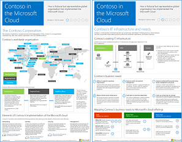

# Contoso en la nube de MicrosoftContoso in the Microsoft Cloud

 **Resumen:** Cómo una organización global ficticia pero representativa está adoptando una infraestructura de TI de nube inclusiva con las ofertas de nube de Microsoft.**Summary:** How a fictional but representative global organization is adopting a cloud-inclusive IT infrastructure with Microsoft's cloud offerings.
  
Este artículo tiene vínculos a un conjunto de artículos que describen cómo Contoso Corporation, un conglomerado global de fabricación con sede en París, está adoptando una infraestructura de TI que incluye la nube y responde a las principales decisiones de diseño para redes, identidad y seguridad, así como cuestiones de seguridad y cómo se están implementando los escenarios de nube empresarial para responder a los problemas de las empresas. También puede ver esta información como un póster de 11 páginas e imprimirlo en formato tabloide (también conocido como doble carta, 11 x 17 o A3).This article links you to a set of articles that describe how the Contoso Corporation, a global manufacturing conglomerate with its headquarters in Paris, is embracing a cloud-inclusive IT infrastructure and has addressed major design decisions for networking, identity, and security and how it is implementing enterprise cloud scenarios to address its business problems. You can also view this information as an 11-page poster and print it in tabloid format (also known as ledger, 11 x 17, or A3).
  

  
[PDF](https://go.microsoft.com/fwlink/p/?linkid=842085)  | [Visio](https://go.microsoft.com/fwlink/p/?linkid=842086)  | [Más idiomas](https://www.microsoft.com/download/details.aspx?id=54427)[PDF](https://go.microsoft.com/fwlink/p/?linkid=842085)  | [Visio](https://go.microsoft.com/fwlink/p/?linkid=842086)  | [More languages](https://www.microsoft.com/download/details.aspx?id=54427)
  
Vea las siguientes secciones:See the following sections:
  
- [Información general de la nube híbridaHybrid cloud overview](hybrid-cloud-overview.md)
    
    Contoso Corporation es una organización conglomerada global de fabricación, ventas y soporte técnico con más de 100 000 productos.The Contoso Corporation is a global conglomerate manufacturing, sales, and support organization with over 100,000 products.
    
- [Infraestructura y necesidades de TI de ContosoContoso's IT infrastructure and needs](contoso-it-infrastructure-and-needs.md)
    
    Contoso está realizando la transición de una infraestructura de TI centralizada local a una infraestructura de nube inclusiva que incorpora las cargas de trabajo de productividad del personal, las aplicaciones y los escenarios híbridos basados en la nube.Contoso is transitioning from an on-premises, centralized IT infrastructure to a cloud-inclusive one that incorporates cloud-based personal productivity workloads, applications, and hybrid scenarios.
    
- [Redes para Contoso CorporationNetworking for the Contoso Corporation](networking-for-the-contoso-corporation.md)
    
    Para un mejor rendimiento para los servicios basados en la nube, los ingenieros de red de Contoso optimizaron el tráfico al perímetro de Internet y a través de Internet.For best performance to cloud-based services, Contoso's network engineers optimized traffic to their Internet edge and across the Internet.
    
- [Identidad para Contoso CorporationIdentity for the Contoso Corporation](identity-for-the-contoso-corporation.md)
    
    La identidad en la nube de Contoso aprovecha su proveedor de identidades local e incluye la autenticación federada con sus proveedores de identidades de terceros de confianza existentes.Contoso's identity in the cloud solution leverages their on-premises identity provider and includes federated authentication with their existing trusted, third-party identity providers.
    
- [Suscripciones, licencias y cuentas de usuario para Contoso CorporationSubscriptions, licenses, and user accounts for the Contoso Corporation](subscriptions-licenses-and-user-accounts-for-the-contoso-corporation.md)
    
    Contoso usa la jerarquía de organización/suscripciones/licencias y cuentas de usuario para tener acceso a las ofertas de nube de Microsoft.Contoso uses the organization/subscriptions/licenses/user accounts hierarchy to access Microsoft's cloud offerings.
    
- [Seguridad para Contoso CorporationSecurity for the Contoso Corporation](security-for-the-contoso-corporation.md)
    
    Al realizar la transición de su infraestructura de TI a una de nube inclusiva, Contoso se aseguró de la compatibilidad y la implementación de sus requisitos de seguridad locales en las ofertas de nube de Microsoft.When transitioning their IT infrastructure to a cloud-inclusive one, Contoso made sure that their on-premises security requirements were supported and implemented in Microsoft's cloud offerings.
    
- [Escenarios empresariales para Contoso CorporationEnterprise scenarios for the Contoso Corporation](enterprise-scenarios-for-the-contoso-corporation.md)
    
    Vea cómo Contoso está tratando sus necesidades empresariales con ofertas de la nube de Microsoft.See how Contoso is addressing its business needs with Microsoft's cloud offerings.
    
> [!NOTE]
> Estos artículos reflejan la versión de **septiembre de 2017** del póster Contoso en la nube de Microsoft.These articles reflect the **September 2017** release of the Contoso in the Microsoft Cloud poster.
  
## Consulte tambiénSee Also

[Recursos de arquitectura de TI de la nube de MicrosoftMicrosoft Cloud IT architecture resources](microsoft-cloud-it-architecture-resources.md)

[Mapa de ruta de Enterprise Cloud de Microsoft: Recursos para los responsables de decisiones de TI]((https://sway.com/FJ2xsyWtkJc2taRD))[Microsoft's Enterprise Cloud Roadmap: Resources for IT Decision Makers]((https://sway.com/FJ2xsyWtkJc2taRD))

