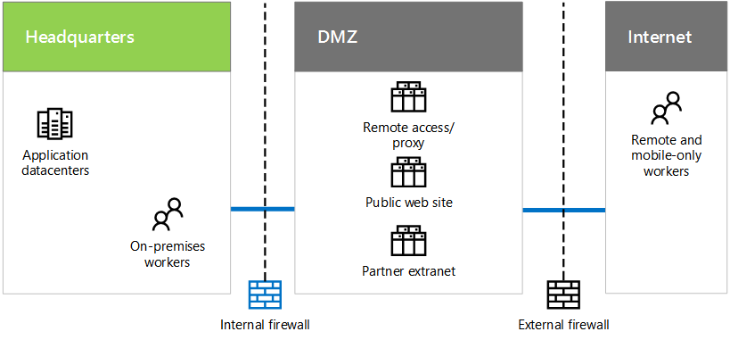

# Infraestructura y necesidades de TI de ContosoContoso's IT infrastructure and needs

 **Resumen:** Comprender la estructura básica de la infraestructura de TI local de Contoso y cómo sus necesidades de negocio pueden cumplirse mediante ofertas de nube de Microsoft.**Summary:** Understand the basic structure of Contoso's on-premises IT infrastructure and how its business needs can be met by Microsoft's cloud offerings.
  
Contoso está en proceso de transición de una infraestructura de TI centralizada local a una infraestructura de nube inclusiva que incorpora las cargas de trabajo de productividad del personal, las aplicaciones y los escenarios híbridos basados en la nube.Contoso is in the process of transitioning from an on-premises, centralized IT infrastructure to a cloud-inclusive one that incorporates cloud-based personal productivity workloads, applications, and hybrid scenarios.
  
## Infraestructura de TI existente de ContosoContoso's existing IT infrastructure

Contoso usa una infraestructura de TI local mayoritariamente centralizada, con centros de datos de aplicaciones en la sede de París.Contoso uses a mostly centralized on-premises IT infrastructure, with application datacenters in the Paris headquarters.
  
**Figura 1: Infraestructura de TI existente de Contoso****Figure 1: Contoso's existing IT infrastructure**

  
La figura 1 muestra una oficina central con centros de datos de aplicaciones, una red perimetral e Internet.Figure 1 shows a headquarters office with application datacenters, a DMZ, and the Internet.
  
En la red perimetral de Contoso, los distintos conjuntos de servidores proporcionan lo siguiente:In Contoso's DMZ, different sets of servers provide:
  
- Acceso remoto al proxy web y a la intranet de Contoso para los trabajadores de la sede de París.Remote access to the Contoso intranet and web proxying for workers in the Paris headquarters.
    
- Hospedaje del sitio web público de Contoso, desde el cual los clientes pueden solicitar productos, piezas o suministros.Hosting for the Contoso public web site, from which customers can order products, parts, or supplies.
    
- Hospedaje de la extranet de partners de Contoso para la colaboración y comunicación de los partners.Hosting for the Contoso partner extranet for partner communication and collaboration.
    
## Necesidades de negocio de ContosoContoso's business needs

Estas son las necesidades de negocio de Contoso en orden de prioridad:Here are Contoso's business needs in priority order:
  
1. Cumplir los requisitos normativos regionalesAdhere to regional regulatory requirements
    
    Para evitar multas y mantener buenas relaciones con los gobiernos locales, Contoso debe garantizar el cumplimiento de las normas de almacenamiento y cifrado de datos.To prevent fines and maintain good relations with local governments, Contoso must ensure compliance with data storage and encryption regulations.
    
2. Mejorar la administración de proveedores y partnersImprove vendor and partner management
    
    La extranet de partners está quedando anticuada y es cara de mantener. Contoso quiere reemplazarla por una solución basada en la nube que use la autenticación federada.The partner extranet is aging and expensive to maintain. Contoso wants to replace it with a cloud-based solution that uses federated authentication.
    
3. Mejorar la productividad de los empleados móviles, la administración de dispositivos y el accesoImprove mobile workforce productivity, device management, and access
    
    El personal exclusivamente móvil de Contoso se está expandiendo y se requiere la administración de dispositivos para garantizar la protección de la propiedad intelectual y un acceso más eficiente a los recursos.Contoso's mobile-only workforce is expanding and needs device management to ensure intellectual property protection and more efficient access to resources.
    
4. Reducir la infraestructura de acceso remotoReduce remote access infrastructure
    
    Al mover a la nube recursos a los que los trabajadores remotos tienen acceso con frecuencia, Contoso ahorrará dinero gracias a la reducción de los costos de mantenimiento y soporte técnico de su solución de acceso remoto.By moving resources commonly accessed by remote workers to the cloud, Contoso will save money by reducing maintenance and support costs for their remote access solution.
    
5. Reducir verticalmente los centros de datos localesScale down on-premises datacenters
    
    Los centros de datos de Contoso contienen cientos de servidores, algunos de los cuales ejecutan funciones de archivo o heredadas que desvían la atención del personal de TI del mantenimiento de unas cargas de trabajo de alto valor empresarial.The Contoso datacenters contain hundreds of servers, some of which are running legacy or archival functions that distract IT staff from maintaining high business value workloads.
    
6. Escalar verticalmente los recursos informáticos y de almacenamiento para el procesamiento de fin de trimestreScale-up computing and storage resources for end-of-quarter processing
    
    El procesamiento de la contabilidad financiera de fin de trimestre y la proyección, junto con la administración del inventario, requiere aumentos a corto plazo en servidores y almacenamiento.End-of-quarter financial accounting and projection processing along with inventory management requires short-term increases in servers and storage.
    
## Asignación de las necesidades de negocio de Contoso a las ofertas de nube de MicrosoftMapping Contoso's business needs to Microsoft's cloud offerings

Basándose en un análisis de las ofertas de nube de Microsoft, el departamento de TI de Contoso determinó la asignación siguiente:Based on an analysis of Microsoft's cloud offerings, Contoso's IT department determined the following mapping:
  
|**Software como servicio (SaaS)****Software as a Service (SaaS)**|**Plataforma como servicio (PaaS de Azure).****Platform as a Service (Azure PaaS )**|**Infraestructura como servicio (IaaS de Azure).****Infrastructure as a Service (Azure IaaS )**|
|:-----|:-----|:-----|
|**Office 365:** aplicaciones de productividad personal y de grupo principales en la nube.**Office 365:** Primary personal and group productivity applications in the cloud.   Necesidades de negocio: 1 3 5Business needs: 1 3 5    |Hospedar sistemas de información y documentos de ventas y soporte técnico mediante aplicaciones basadas en la nube.Host sales and support documents and information systems using cloud-based apps.    Necesidad de negocio: 3Business need: 3    |Mover los sistemas de archivo y heredados a servidores basados en la nube.Move archival and legacy systems to cloud-based servers.    Necesidad de negocio: 5Business need: 5    |
|**Dynamics 365:** Usar la administración basada en la nube de clientes y proveedores. Quitar la extranet de partners en la red perimetral.**Dynamics 365:** Use cloud-based customer and vendor management. Remove partner extranet in the DMZ.   Necesidad de negocio: 2Business need: 2    |Las aplicaciones móviles están basadas en la nube, en lugar de en el centro de datos de París.Mobile applications are cloud-based, rather than Paris datacenter-based.    Necesidades de negocio: 3 4Business needs: 3 4    |Migrar las aplicaciones que se usan poco fuera de los centros de datos locales.Migrate low-use apps and data out of on-premises datacenters.    Necesidad de negocio: 5Business need: 5    |
|**Intune/EMS:** administrar dispositivos iOS y Android.**Intune/EMS:** Manage iOS and Android devices.   Necesidad de negocio: 3Business need: 3    ||Agregar almacenamiento y servidores temporales para satisfacer las necesidades de procesamiento de fin de trimestre.Add temporary servers and storage for end-of-quarter processing needs.    Necesidad de negocio: 6Business need: 6    |
   
## See AlsoSee Also

[Contoso en la nube de MicrosoftContoso in the Microsoft Cloud](contoso-in-the-microsoft-cloud.md)
  
[Recursos de arquitectura de TI de la nube de MicrosoftMicrosoft Cloud IT architecture resources](microsoft-cloud-it-architecture-resources.md)

[Mapa de ruta de Enterprise Cloud de Microsoft: Recursos para los responsables de decisiones de TIMicrosoft's Enterprise Cloud Roadmap: Resources for IT Decision Makers](https://sway.com/FJ2xsyWtkJc2taRD)

