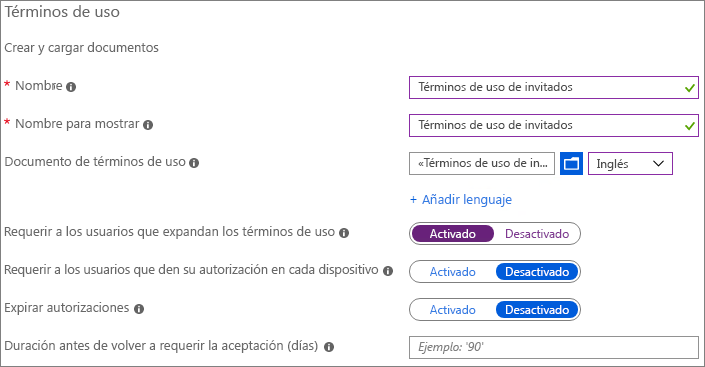
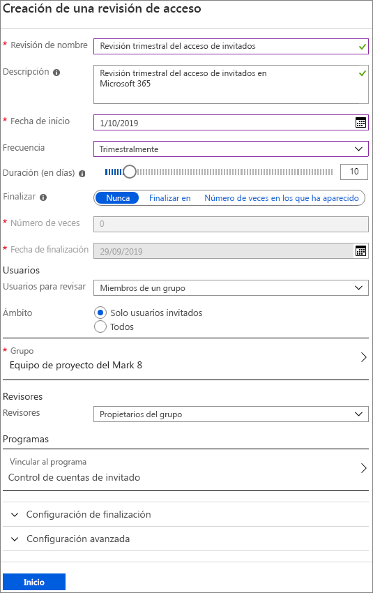
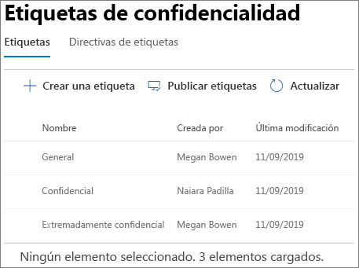
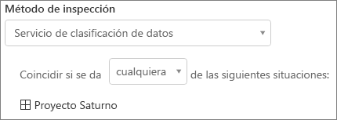
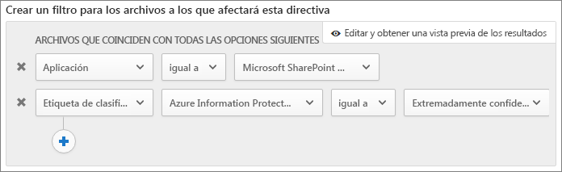

# Crear un entorno seguro de uso compartido para invitados

En este artículo, analizaremos una amplia variedad de opciones para crear un entorno seguro de uso compartido para invitados en Microsoft 365. Este es solo un ejemplo para dar una idea de las opciones disponibles. Puede usar estos procedimientos en distintas combinaciones para satisfacer las necesidades de seguridad y cumplimiento de su organización. Al final del artículo, analizaremos un caso de prueba para ver cómo funcionan conjuntamente algunas de estas opciones.

Este ejemplo incluye:

- Configurar autenticación multifactor para invitados
- Configurar condiciones de uso para invitados.
- Establecer revisiones trimestrales de acceso de invitados para validar periódicamente si los invitados continúan necesitando permisos en los equipos y en los sitios.
- Restringir el acceso de invitados a solo web para dispositivos no administrados.
- Configurar una directiva de tiempo de espera de la sesión para garantizar la autenticación de los invitados diariamente.
- Crear y publicar etiquetas de confidencialidad para clasificar el contenido.
- Creación de un tipo de información confidencial para un proyecto altamente confidencial.
- Asignación automática de una etiqueta * altamente confidencial* a los documentos que contienen el tipo de información confidencial.
- Retirar automáticamente el acceso de invitado a los archivos etiquetados como *altamente confidencial*.

Algunas de las opciones analizadas en este artículo requieren que los invitados tengan una cuenta de Azure Active Directory. Para asegurarse de que los invitados estén en el directorio cuando comparta archivos y carpetas con ellos, use la [Integración de SharePoint y OneDrive con la vista previa de Azure AD B2B](https://docs.microsoft.com/sharepoint/sharepoint-azureb2b-integration-preview).

Tenga en cuenta que este artículo no describe cómo habilitar la configuración de uso compartido para invitados. Consulte [Colaborar con personas de fuera de su organización](https://docs.microsoft.com/Office365/Enterprise/collaborating-with-people-outside-your-organization) para obtener más información sobre cómo habilitar el uso compartido para invitados en diferentes situaciones.

## Configurar autenticación multifactor para invitados

La autenticación multifactor reduce considerablemente la probabilidad de que una cuenta sea atacada. Dado que los invitados pueden usar cuentas de correo personales que no cumplan con las directivas de la empresa o los procedimientos recomendados, es especialmente importante exigirles que usen una autenticación multifactor. Si se roba el nombre de usuario y la contraseña de un usuario invitado, tener un segundo factor de autenticación reduce considerablemente las posibilidades de que terceros obtengan acceso a sus sitios y archivos.

En este ejemplo, configuraremos la autenticación multifactor para invitados mediante el uso de una directiva de acceso condicional en Azure Active Directory.

Configurar autenticación multifactor para invitados
1. En Microsoft Azure, busque *Acceso condicional*.
2. En la hoja **Acceso condicional - Directivas**, seleccione **Nueva directiva**.
3. En el campo **Nombre**, escriba *Invitado MFA*.
4. En **Asignaciones**, haga clic en **Usuarios y grupos**.
5. En la hoja **Usuarios y grupos**, seleccione **Seleccionar usuarios y grupos**, marque la casilla **Todos los invitados y usuarios externos** y, a continuación, haga clic en **Listo**.
4. En **Controles de acceso**, haga clic en **Conceder**.
5. En la hoja **Conceder**, marque la casilla **Requerir autenticación multifactor** y haga clic en **Seleccionar**.
6. En la hoja **Nuevo**, en **Habilitar directiva**, haga clic en **Activar** y, luego, haga clic **Crear**.

Ahora, el invitado deberá inscribirse en la autenticación multifactor para acceder al contenido compartido, a los sitios o a los equipos.

### Más información

[Planificar la implementación en la nube de Azure Multi-Factor Authentication](https://docs.microsoft.com/azure/active-directory/authentication/howto-mfa-getstarted)

## Configurar condiciones de uso para invitados

A menudo, los invitados no han firmado contratos de no divulgación ni otros acuerdos jurídicos con su organización. Puede obligar a los invitados a aceptar sus términos de uso antes de darles acceso a los archivos compartidos. Los términos de uso se les pueden mostrar la primera vez que intenten acceder a un archivo o sitio compartido.

Para crearlos, primero elabore el documento en Word u otro programa de creación y, luego, guárdelo como un archivo PDF. Este archivo se puede cargar en Azure AD.

¿Por qué crear términos de uso de Azure AD?
1. Inicie sesión en Azure como administrador global, administrador de seguridad o administrador de acceso condicional.
2. Vaya a [Términos de uso](https://aka.ms/catou).
3. Haga clic en **Nuevos términos**. 
   
4. En las casillas **Nombre** y **Nombre para mostrar**, escriba *Términos de uso para invitados*.
6. En **Documento de términos de uso** explore hasta encontrar el archivo PDF que creó y selecciónelo.
7. Seleccione el idioma para su documento de términos de uso.
8. En **Requerir a los usuarios que expandan los términos de uso**, seleccione **Activado**.
9. En **Acceso condicional**, de la lista **Exigir con plantillas de directiva de acceso condicional** elija **Crear directiva de acceso condicional más adelante**.
10. Haga clic en **Crear**.

Una vez haya creado los términos de uso, el siguiente paso es crear una directiva de acceso condicional que muestre los términos a los invitados.

Para crear una nueva directiva de acceso condicional, haga lo siguiente:
1. En Microsoft Azure, busque *Acceso condicional*.
2. En la hoja **Acceso condicional - Directivas**, seleccione **Nueva directiva**.
3. En el cuadro **Nombre**, escriba *Directiva de términos de uso del invitado*.
4. En **Asignaciones**, haga clic en **Usuarios y grupos**.
5. En la hoja **Usuarios y grupos**, seleccione **Seleccionar usuarios y grupos**, marque la casilla **Todos los invitados y usuarios externos** y, a continuación, haga clic en **Listo**.
6. En **Tareas**, haga clic en **Aplicaciones o acciones en la nube**.
7. En la pestaña **Incluir**, elija **Seleccionar aplicaciones** y, a continuación, haga clic en **Seleccionar**.
8. En la hoja **Seleccionar**, elija **Microsoft Teams**, **Office 365 SharePoint Online** y **Grupos de Outlook** y, a continuación, haga clic en **Seleccionar**.
9. En la hoja **Aplicaciones o acciones en la nube**, haga clic en **Listo**.
10. En **Controles de acceso**, haga clic en **Conceder**.
11. En la hoja **Conceder**, seleccione **Términos de uso de invitado** y, a continuación, haga clic en **Seleccionar**.
12. En la hoja **Nuevo**, en **Habilitar directiva**, haga clic en **Activar** y, luego, haga clic **Crear**.

A partir de ahora, cuando un usuario invitado acceda por primera vez al contenido, a un grupo o a un sitio de su organización, se le pedirá que acepte los términos de uso.

### Más información
[Términos de uso de Azure Active Directory.](https://docs.microsoft.com/azure/active-directory/conditional-access/terms-of-use)

## Configurar revisiones de acceso de invitados

Con las revisiones de acceso en Azure AD, puede realizar automáticamente revisiones periódicas del acceso de usuarios a diversos equipos y grupos. Al requerir una revisión de acceso específicamente para invitados, se asegura de que los invitados no tengan acceso a información confidencial de su organización durante más tiempo del necesario.

Las revisiones de acceso se pueden organizar en distintos programas. Un programa es una agrupación de revisiones de acceso similares. Sirve para organizar las revisiones de acceso para propósitos como la creación de informes o auditorías.

En este ejemplo, crearemos un programa para las revisiones de acceso de invitados.

Para crear un programa:
1. Inicie sesión en Azure Portal y abra la página [Identity Governance](https://portal.azure.com/#blade/Microsoft_AAD_ERM/DashboardBlade).
2. En el menú de la izquierda, haga clic en **Programas**.
3. Haga clic en **Nuevo programa**.
4. En el cuadro **Nombre**, escriba *Programa de revisión de acceso para invitados*.
5. En el cuadro **Descripción**, escriba *Programa para las revisiones de acceso de invitados*.
6. Haga clic en **Crear**.

Una vez que haya creado el programa, puede crear una revisión de acceso de invitados y asociarla a él.

Crear una revisión de acceso de invitados
1. En la página [Identity Governance](https://portal.azure.com/#blade/Microsoft_AAD_ERM/DashboardBlade), en el menú de la izquierda, haga clic en **Revisiones de acceso**.
2. Haga clic en **Nueva revisión de acceso**. 
   
3. En el cuadro **Nombre**, escriba *Revisión de acceso trimestral*.
4. En **Frecuencia**, elija **Trimestral**.
5. En **Finalización**, elija **Nunca**.
6. En **Ámbito**, elija **Solo usuarios invitados**.
7. Haga clic en **Agrupar**, seleccione los grupos que desea incluir en la revisión de acceso y, a continuación, haga clic en **Seleccionar**.
8. En **Programas**, haga clic en **Vincular al programa**.
9. En la hoja **Seleccionar un programa**, elija **Programa de revisión de acceso para invitados**
10. Haga clic en **Iniciar**.

Se creará una revisión de acceso independiente para cada grupo que especifique. Los propietarios de cada grupo recibirán un correo cada trimestre para aprobar o denegar el acceso de los invitados a sus grupos.

Hay que tener en cuenta que los invitados pueden recibir acceso tanto a equipos o grupos, como a archivos y carpetas individuales. Cuando se da acceso a archivos y carpetas, es posible que los invitados no se agreguen a un grupo específico. Si desea realizar revisiones de acceso para invitados que no pertenezcan a un equipo o grupo, puede crear un grupo dinámico en Azure AD que contenga todos los invitados y, a continuación, crear una revisión de acceso para ese grupo.

### Más información
[Administre el acceso de los invitados con las revisiones de acceso de Azure AD](https://docs.microsoft.com/azure/active-directory/governance/manage-guest-access-with-access-reviews)

[Cree una revisión de acceso de grupos o aplicaciones con las revisiones de acceso de Azure AD](https://docs.microsoft.com/azure/active-directory/governance/create-access-review)

## Establezca que los usuarios invitados solo puedan acceder a través de la web

Puede limitar sus zonas vulnerables a un ataque y facilitar las tareas de administración si obliga a los invitados a que accedan a sus equipos, sitios y archivos a través de un navegador web. Esto se realiza a través de las directivas de acceso condicional de Azure AD.

Cómo restringir el acceso de los invitados a solo la web
1. En Microsoft Azure, busque *Acceso condicional*.
2. En la hoja **Acceso condicional - Directivas**, seleccione **Nueva directiva**.
3. En el cuadro **Nombre**, escriba *Acceso por navegador de los invitados*.
4. En **Asignaciones**, haga clic en **Usuarios y grupos**.
5. En la hoja **Usuarios y grupos**, seleccione **Seleccionar usuarios y grupos**, marque la casilla **Todos los invitados y usuarios externos** y, a continuación, haga clic en **Listo**.
6. En **Tareas**, haga clic en **Aplicaciones o acciones en la nube**.
7. En la pestaña **Incluir**, elija **Seleccionar aplicaciones** y, a continuación, haga clic en **Seleccionar**.
8. En la hoja **Seleccionar**, elija **Microsoft Teams**, **Office 365 SharePoint Online** y **Grupos de Outlook** y, a continuación, haga clic en **Seleccionar**.
9. En la hoja **Aplicaciones o acciones en la nube**, haga clic en **Listo**.
10. En **Tareas**, haga clic en **Condiciones**.
11. En la hoja **Condiciones**, haga clic en **Aplicaciones cliente**.
12. En la hoja **Aplicaciones cliente**, haga clic en **Sí** para **Configurar**, y seleccione **Clientes de aplicaciones móviles y de escritorio** y **Clientes de autenticación moderna**. 
    
13. Haga clic en **Listo** y, después, en la hoja **Condiciones**, haga clic de nuevo en **Listo**.
14. En **Controles de acceso**, haga clic en **Conceder**.
15. En la hoja **Conceder**, seleccione **Requerir que el dispositivo esté marcado como compatible** y **Requerir un dispositivo unido de Hybrid Azure AD**.
16. En **Para varios controles**, seleccione **Requerir uno de los controles seleccionados** y, a continuación haga clic en **Seleccionar**.
17. En la hoja **Nuevo**, en **Habilitar directiva**, haga clic en **Activar** y, luego, haga clic **Crear**.

## Configurar un tiempo de espera de sesión para los usuarios invitados

Requerir que los invitados se autentiquen periódicamente puede reducir la posibilidad de que usuarios desconocidos accedan al contenido de la organización si el usuario invitado no protege su dispositivo correctamente. Azure AD le permite configurar una directiva de acceso condicional de tiempo de espera de sesión para usuarios invitados.

Cómo configurar una directiva de tiempo de espera de sesión para invitado
1. En Microsoft Azure, busque *Acceso condicional*.
2. En la hoja **Acceso condicional - Directivas**, seleccione **Nueva directiva**.
3. En el cuadro **Nombre**, escriba *Tiempo de espera de sesión para invitado*.
4. En **Asignaciones**, haga clic en **Usuarios y grupos**.
5. En la hoja **Usuarios y grupos**, seleccione **Seleccionar usuarios y grupos**, marque la casilla **Todos los invitados y usuarios externos** y, a continuación, haga clic en **Listo**.
6. En **Tareas**, haga clic en **Aplicaciones o acciones en la nube**.
7. En la pestaña **Incluir**, elija **Seleccionar aplicaciones** y, a continuación, haga clic en **Seleccionar**.
8. En la hoja **Seleccionar**, elija **Microsoft Teams**, **Office 365 SharePoint Online** y **Grupos de Outlook** y, a continuación, haga clic en **Seleccionar**.
9. En la hoja **Aplicaciones o acciones en la nube**, haga clic en **Listo**.
10. En **Controles de acceso**, haga clic en **Sesión**.
11. En la hoja **Sesión**, seleccione **Frecuencia de inicio de sesión**.
12. Seleccione **1** y **días** para el período de tiempo y, a continuación, haga clic en **Seleccionar**.
13. En la hoja **Nuevo**, en **Habilitar directiva**, haga clic en **Activar** y, luego, haga clic **Crear**.

## Cree etiquetas de confidencialidad

Las etiquetas de confidencialidad pueden clasificar y proteger la información de su organización de varias maneras. En este ejemplo, veremos cómo se pueden usar para administrar el acceso de los invitados a archivos y carpetas compartidas.

En primer lugar, vamos a crear tres etiquetas de confidencialidad en el Centro de cumplimiento de Microsoft 365:

- General
- Confidencial
- Extremadamente confidencial

Use el siguiente procedimiento para crear las etiquetas *General* y *Confidencial*.

Cómo crear una etiqueta de clasificación (General y Confidencial)
1. En el [Centro de cumplimiento de Microsoft 365](https://compliance.microsoft.com), en el panel de navegación izquierdo, expanda **Clasificación** y, a continuación, haga clic en **Etiquetas de confidencialidad**.
2. Haga clic en **Crear una etiqueta**.
3. En **Nombre de etiqueta**, escriba *General* o *Confidencial*.
4. En **Información sobre herramientas**, escriba *Información general que pueda compartir con empleados, invitados y asociados* o *Información confidencial. Compartir solo con empleados e invitados autorizados*. A continuación, haga clic en **Siguiente**.
5. En cifrado, marque **Desactivado** y haga clic en **Siguiente**.
6. En Distintivo de contenido, marque **Desactivado** y haga clic en **Siguiente**.
7. En Prevención de pérdida de datos en punto de conexión, marque **Desactivado** y haga clic en **Siguiente**.
8. En Etiquetado automático, marque **Desactivado** y haga clic en **Siguiente**.
9. Haga clic en **Crear**.

Con la etiqueta *Altamente confidencial*, agregaremos una marca de agua automática en los documentos que etiquetemos.

Cómo crear una etiqueta de clasificación (Extremadamente confidencial)
1. Haga clic en **Crear una etiqueta**.
2. En **Nombre de etiqueta**, escriba *Extremadamente Confidencial*.
3. En **Información sobre herramientas**, escriba *Información extremadamente confidencial. No compartir con invitados*. Luego, haga clic en **Siguiente**.
4. En cifrado, marque **Desactivado** y haga clic en **Siguiente**.
5. En Distintivo de contenido, seleccione **Activado**, marque la casilla **Agregar un encabezado** y, a continuación, haga clic en **Personalizar texto**.
6. Escriba *Extremadamente confidencial* en el texto del encabezado y haga clic en **Guardar**.
7. En la página **Distintivo de contenido**, seleccione **Activado**.
8. Active la casilla de verificación **Agregar una marca de agua** y, después, haga clic en **Personalizar texto**.
9. En **Texto de marca de agua**, escriba *Extremadamente confidencial*.
10. Escriba *24* en **Tamaño de fuente**, y haga clic en **Guardar**.
11. En **Distintivo de contenido**, haga clic en **Siguiente**.
12. En Prevención de pérdida de datos en punto de conexión, marque **Desactivado** y haga clic en **Siguiente**.
13. En Etiquetado automático, marque **Desactivado** y haga clic en **Siguiente**.
14. Haga clic en **Crear**.

Una vez que haya creado las etiquetas, el siguiente paso es publicarlas. 

Publicar etiquetas
1. En la página **Etiquetas de confidencialidad**, haga clic en **Publicar etiquetas**.
2. Haga clic en **Elegir etiquetas para publicar**.
3. Haga clic en **Agregar**, seleccione las etiquetas que ha creado y haga clic en **Agregar**.
4. Haga clic en **Listo**.
5. Haga clic en **Siguiente**.
6. Configure los usuarios y grupos como **Todos** y haga clic en **Siguiente**.
7. En la lista **Aplicar esta etiqueta a documentos y correos electrónicos de forma predeterminada** elija **General** y, después, haga clic en **Siguiente**.
8. En la página **Configuración de directiva**, escriba *Confidencialidad de documento* como nombre y haga clic en **Siguiente**.
9. Haga clic en **Publicar**.

Cuando publique las etiquetas, estarán disponibles para los usuarios de las aplicaciones de escritorio de Office. Cuando los usuarios apliquen la etiqueta **Extremadamente confidencial**, se agregará automáticamente una marca de agua al documento.

### Más información
[Información general de etiquetas de confidencialidad](https://docs.microsoft.com/Office365/SecurityCompliance/sensitivity-labels)

## Creación de un tipo de información confidencial para un proyecto altamente confidencial.

Los tipos de información confidencial son cadenas predefinidas que se pueden usar en flujos de trabajo de directiva para aplicar requisitos de cumplimiento. El Centro de cumplimiento de Microsoft 365 incluye más de 100 tipos de información confidencial, como números de licencia de conducir, números de tarjeta de crédito, números de cuentas bancarias, etc.

Puede crear tipos de información confidencial personalizados para ayudar a administrar el contenido específico de su organización. En este ejemplo, vamos a crear un tipo de información confidencial personalizado para un proyecto extremadamente confidencial. Podemos usar este tipo de información confidencial para aplicar automáticamente una etiqueta de clasificación.

Cómo crear un tipo de información confidencial
1. En el [Centro de cumplimiento de Microsoft 365](https://compliance.microsoft.com), en el panel de navegación izquierdo, expanda **Clasificación** y, a continuación, haga clic en **Tipos de información confidencialidad**.
2. Haga clic en **Crear**.
3. En **Nombre ** y **Descripción**, escriba **Proyecto Saturno** y haga clic en **Siguiente**.
4. Haga clic en **Agregar un elemento**.
5. En la lista **Detectar contenido que contenga**, seleccione **Palabras clave** y, a continuación, escriba *Proyecto Saturno* en el cuadro de palabras clave.
6. Haga clic en **Siguiente** y después en **Finalizar**.
7. Si se le solicita si quiere probar el tipo de información confidencial, haga clic en **No**.

### Más información
[Tipos de información confidencial personalizados](https://docs.microsoft.com/Office365/SecurityCompliance/custom-sensitive-info-types)

## Crear una directiva para asignar una etiqueta basada en un tipo de información confidencial

Una vez que tenemos el tipo de información confidencial, podemos crear una directiva de archivo en la aplicación Microsoft Cloud App Security para aplicar la etiqueta *Extremadamente confidencial* automáticamente a los documentos que contengan la cadena *Proyecto Saturno*.

> [!NOTE]
> Las etiquetas de confidencialidad están disponibles en Cloud App Security gracias a un proceso de replicación. Es posible que no vea inmediatamente la etiqueta disponible para una directiva.

Cómo crear un tipo de información confidencial basado en una directiva
1. Abra [Microsoft Cloud App Security](https://portal.cloudappsecurity.com).
2. En el panel de navegación izquierdo, expanda **Control** y, después, haga clic en **Directivas**.
3. Haga clic en **Crear directiva** y, a continuación, elija **Directiva de archivo**.
4. En **Nombre de la directiva**, escriba *Etiqueta de Proyecto Saturno*.
5. En **Crear un filtro para los archivos a los que se aplicará esta directiva**, haga clic dos veces en X para eliminar los filtros predeterminados.
7. En la lista **Seleccionar un filtro**, elija **Aplicación** y seleccione **Microsoft SharePoint Online** de la lista**Seleccionar aplicaciones...**.
8. En **Método de inspección**, elija **Servicio de clasificación de datos**.
9. En la lista **Elegir tipo de inspección**, elija **Tipo de información confidencial**.
10. Busque la etiqueta de confidencialidad *Proyecto Saturno* y, a continuación, haga clic en **Listo**. 
   
11. En **Gobierno**, expanda **Microsoft SharePoint Online**.
12. Active la casilla de verificación **Aplicar etiqueta de clasificación** y seleccione la etiqueta **Extremadamente confidencial**.
13. Haga clic en **Crear**.

Con la directiva en vigor, cuando un usuario escriba «Proyecto Saturno» en un documento, Cloud App Security aplicará automáticamente la etiqueta *Extremadamente confidencial* al analizar el archivo.

### Más información
[Directivas de archivo](https://docs.microsoft.com/cloud-app-security/data-protection-policies)

## Crear una directiva para retirar el acceso de un invitado a archivos extremadamente confidenciales

En el ejemplo de este artículo, los archivos con la etiqueta *Extremadamente confidencial* no deben compartirse con los invitados. Podemos crear una directiva de archivo en Cloud App Security que elimine automáticamente el acceso de los invitados a los archivos que tengan esa etiqueta.

Tenga en cuenta que esto no impide que los usuarios puedan compartir o volver a compartir estos archivos. Sigue necesitando que sus usuarios sigan sus directivas de gobierno para los archivos que se almacenan en sitios que permitan compartir con invitados. Lo que sí hace esta herramienta es eliminar el acceso de los invitados a archivos con información confidencial después de que se hayan compartido con invitados.

Cómo crear una directiva de archivo basada en etiquetas
1. Abra [Microsoft Cloud App Security](https://portal.cloudappsecurity.com).
2. En el panel de navegación izquierdo, expanda **Control** y, después, haga clic en **Directivas**.
3. Haga clic en **Crear directiva** y, a continuación, elija **Directiva de archivo**.
4. En **Nombre de la directiva**, escriba *Retirar acceso de invitados al Proyecto Saturno*.
5. En **Crear un filtro para los archivos a los que se aplicará esta directiva**, haga clic dos veces en X para eliminar los filtros predeterminados.
6. En la lista **Seleccionar un filtro**, elija **Aplicación** y seleccione **Microsoft SharePoint Online** de la lista**Seleccionar aplicaciones...**.
7. Haga clic en **Agregar un filtro**.
8. En la lista **Seleccionar un filtro**, elija **Etiqueta de clasificación**, y seleccione **Azure Information Protection** de la lista **Seleccionar filtro...**.
9. En la lista **Seleccionar etiqueta de clasificación**, seleccione **Extremadamente confidencial**. 
   
10. En **Gobierno**, expanda **Microsoft SharePoint Online**.
11. Seleccione las casillas de verificación **Enviar un resumen de directivas coincidentes al propietario del archivo** y **Quitar usuarios externos**.
12. Para el mensaje de notificación personalizado, escriba *Este archivo es extremadamente confidencial. La Directiva de la empresa prohíbe compartirla con sus invitados*.
13. Haga clic en **Crear**.

Tenga en cuenta que esta directiva quita el acceso a los archivos compartidos con un vínculo de *Personas específicas*. No elimina el acceso de vínculos no autenticados (*Cualquiera*). Tampoco retira el acceso si el invitado es miembro del sitio o del equipo en general. Si prevé disponer de documentos extremadamente confidenciales en un sitio o equipo con miembros invitados, considere usar [Canales privados en Teams](https://support.office.com/article/60ef929a-4d68-418b-bf4f-5784db184ec9) y solo permitir que los miembros de su organización los usen.

## Probar la solución

Para probar la solución descrita en este artículo, cree un documento de Word y guárdelo en una biblioteca de documentos. Comparta el archivo con un invitado. Cuando el invitado intente acceder al documento, deberá inscribirse en autenticación multifactor y, luego, aceptar los términos de uso.

Cuando el invitado tenga acceso al documento, escriba *Proyecto Saturno* en el documento y guárdelo. Una vez que Cloud App Security escanee el documento, se debe aplicar la etiqueta *Extremadamente confidencial* y el invitado ya no tendrá acceso a él.

Puede combinar las herramientas que se describen en este artículo de distintas maneras para que su organización pueda compartir con invitados de forma segura y productiva.

## Opciones adicionales

Hay algunas opciones adicionales de Microsoft 365 y Azure Active Directory que pueden ayudar a proteger el entorno de uso compartido de invitados.

- Puede crear una lista de dominios permitidos o prohibidos para limitar los dominios con los que los usuarios podrán compartir. Consulte [restringir el uso compartido de contenido de SharePoint y OneDrive por dominio](https://docs.microsoft.com/sharepoint/restricted-domains-sharing) y [permitir o bloquear las invitaciones a los usuarios B2B de organizaciones específicas](https://docs.microsoft.com/azure/active-directory/b2b/allow-deny-list) para obtener más información.
- Puede limitar el resto de los espacios empresariales de Azure Active Directory a los que se pueden conectar los usuarios. Consulte [Usar restricciones de espacio empresarial para administrar el acceso a aplicaciones en la nube de SaaS](https://docs.microsoft.com/azure/active-directory/manage-apps/tenant-restrictions) para obtener más información.
- Puede crear un entorno administrado donde los asociados pueden ayudar a administrar cuentas de invitado. Para obtener más información, consulte [crear una extranet de B2B con invitados administrados](https://docs.microsoft.com/Office365/Enterprise/b2b-extranet).

## Consulta también

[Reducir la exposición accidental de archivos al compartirlos con invitados](sharing-limit-accidental-exposure.md)

[Prácticas recomendadas para compartir archivos y carpetas con usuarios no autenticados](best-practices-anonymous-sharing.md)

Para obtener más información, consulte [Crear una extranet de B2B con invitados administrados](b2b-extranet.md).
