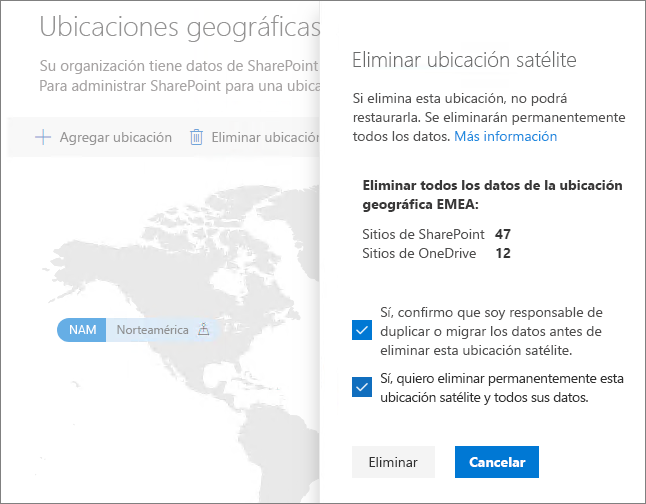

# Eliminar una ubicación de satélite en Office 365 Multi-Geo.

Si ya no necesita una ubicación de satélite, puede eliminarla del espacio empresarial desde el Centro de administración de SharePoint.

> [!WARNING]
> Se eliminarán permanentemente todos los datos de usuario en la ubicación de satélite. Esto incluye todo el contenido de OneDrive para la Empresa, los sitios de SharePoint y los buzones de Exchange, incluidos los buzones de grupo de Office 365. Antes de eliminar la ubicación de satélite, debe migrar los datos a otra ubicación de satélite o a la ubicación central. No se puede deshacer esta acción.

Solo los administradores globales pueden eliminar ubicaciones de satélite.

Para eliminar una ubicación de satélite

1. Abra el Centro de administración de SharePoint.

2. Navegue a la pestaña **Geo locations** (Ubicaciones geográficas).

3. En el mapa, haga clic en la ubicación geográfica que quiere eliminar.

4. Haga clic en **Eliminar grupo**.

5. Confirme la eliminación activando las casillas de confirmación.

6. Haga clic en **Eliminar**.
