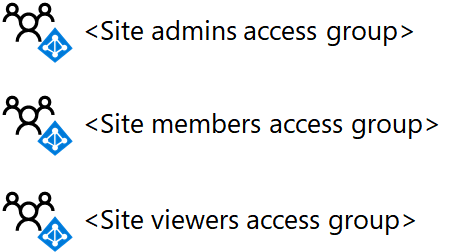
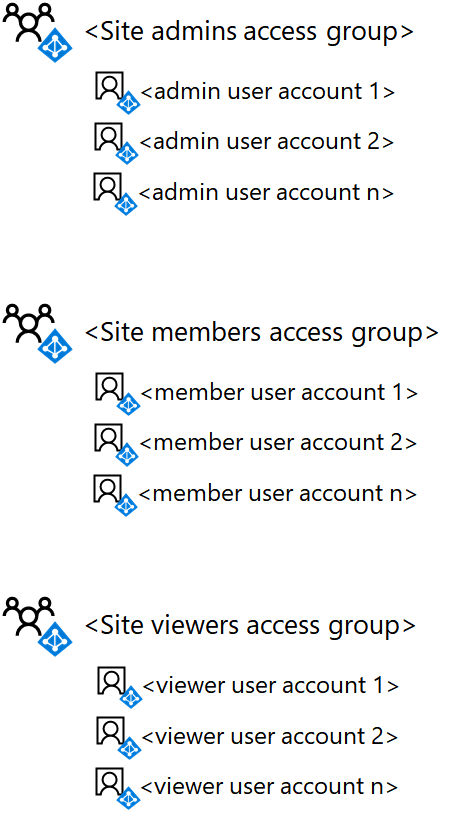
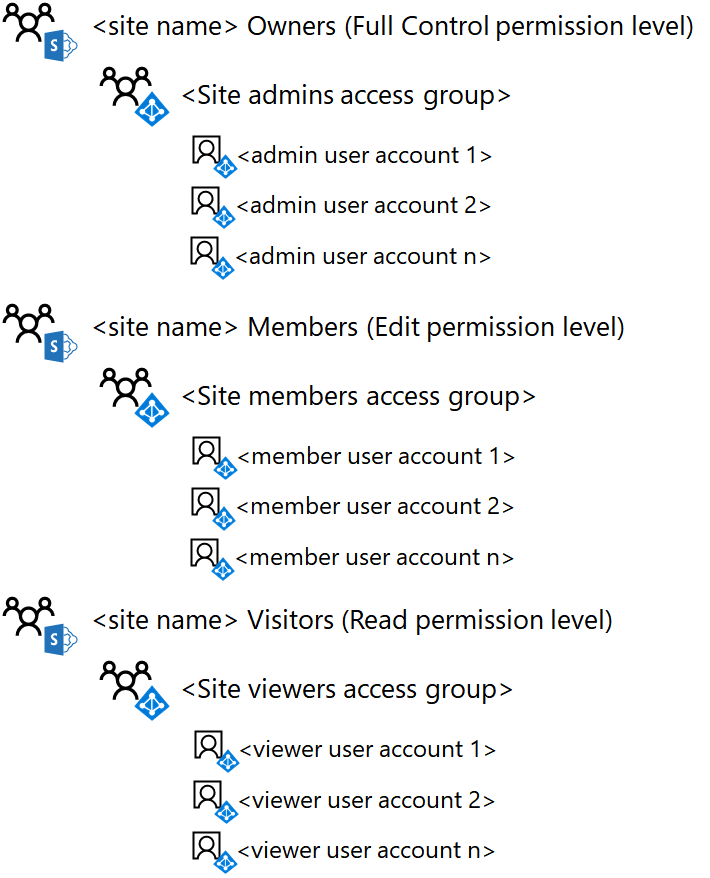

# <a name="deploy-an-isolated-sharepoint-online-team-site"></a><span data-ttu-id="dfa45-103">Implementar un sitio de grupo SharePoint Online aislado</span><span class="sxs-lookup"><span data-stu-id="dfa45-103">Deploy an isolated SharePoint Online team site</span></span>

 <span data-ttu-id="dfa45-104">**Resumen:** Implementar un nuevo sitio de grupo SharePoint Online aislado con estas instrucciones paso a paso.</span><span class="sxs-lookup"><span data-stu-id="dfa45-104">**Summary:** Deploy a new isolated SharePoint Online team site with these step-by-step instructions.</span></span>
  
<span data-ttu-id="dfa45-p101">Este artículo es una guía de implementación paso a paso para crear y configurar un sitio de grupo SharePoint Online aislado en Microsoft Office 365. Estos pasos supone el uso de los tres grupos de SharePoint predeterminados y niveles de permiso correspondiente, con un grupo de acceso basado en Azure Active Directory AD único para cada nivel de acceso.</span><span class="sxs-lookup"><span data-stu-id="dfa45-p101">This article is a step-by-step deployment guide for creating and configuring an isolated SharePoint Online team site in Microsoft Office 365. These steps assume the use of the three default SharePoint groups and corresponding permission levels, with a single Azure Active Directory (AD)-based access group for each level of access.</span></span>
  
## <a name="phase-1-create-and-populate-the-team-site-access-groups"></a><span data-ttu-id="dfa45-107">Fase 1: Crear y llenar los grupos de acceso de sitio de equipo</span><span class="sxs-lookup"><span data-stu-id="dfa45-107">Phase 1: Create and populate the team site access groups</span></span>

<span data-ttu-id="dfa45-108">En esta fase, crear tres grupos de acceso AD Azure para los grupos de SharePoint tres predeterminados y rellenarlas con las cuentas de usuario apropiadas.</span><span class="sxs-lookup"><span data-stu-id="dfa45-108">In this phase, you create the three Azure AD-based access groups for the three default SharePoint groups and populate them with the appropriate user accounts.</span></span>
  
> [!NOTE]
> <span data-ttu-id="dfa45-p102">Los pasos siguientes se supone que todas las cuentas de usuario necesarias ya existen y se asignan las licencias correspondientes. Si no, por favor agregarlos y asignar licencias antes de continuar con el paso 1.</span><span class="sxs-lookup"><span data-stu-id="dfa45-p102">The following steps assume that all necessary user accounts already exist and are assigned the appropriate licenses. If not, please add them and assign licenses before proceeding to step 1.</span></span> 
  
### <a name="step-1-list-the-sharepoint-online-admins-for-the-site"></a><span data-ttu-id="dfa45-111">Paso 1: Lista de los administradores del sitio de SharePoint Online</span><span class="sxs-lookup"><span data-stu-id="dfa45-111">Step 1: List the SharePoint Online admins for the site</span></span>

<span data-ttu-id="dfa45-112">Determinar que el conjunto de usuario cuentas correspondiente a los administradores de SharePoint Online para el sitio del grupo aislado.</span><span class="sxs-lookup"><span data-stu-id="dfa45-112">Determine the set of user accounts corresponding to the SharePoint Online admins for the isolated team site.</span></span>
  
<span data-ttu-id="dfa45-113">Si está administrando cuentas de usuario y grupos mediante Office 365 y desea usar Windows PowerShell, haga una lista de usuario nombre principal (UPN) (ejemplo UPN: belindan@contoso.com).</span><span class="sxs-lookup"><span data-stu-id="dfa45-113">If you are managing user accounts and groups through Office 365 and want to use Windows PowerShell, make a list of their user principal names (UPNs) (example UPN: belindan@contoso.com).</span></span>
  
### <a name="step-2-list-the-members-for-the-site"></a><span data-ttu-id="dfa45-114">Paso 2: Lista de los miembros del sitio</span><span class="sxs-lookup"><span data-stu-id="dfa45-114">Step 2: List the members for the site</span></span>

<span data-ttu-id="dfa45-115">Determinar el conjunto de cuentas de usuario correspondientes a los miembros del sitio de grupo aislado, quienes colaborará en recursos almacenados dentro del sitio.</span><span class="sxs-lookup"><span data-stu-id="dfa45-115">Determine the set of user accounts corresponding to the members for the isolated team site, those who will be collaborating on resources stored within the site.</span></span>
  
<span data-ttu-id="dfa45-p103">Si está administrando cuentas de usuario y grupos mediante Office 365 y desea usar PowerShell, haga una lista de los UPN. Si hay muchos de los integrantes del sitio, puede almacenar la lista de nombres principales de usuario en un archivo de texto y agregarlas todas con un único comando de PowerShell.</span><span class="sxs-lookup"><span data-stu-id="dfa45-p103">If you are managing user accounts and groups through Office 365 and want to use PowerShell, make a list of their UPNs. If there are a lot of site members, you can store the list of UPNs in a text file and add them all with a single PowerShell command.</span></span>
  
### <a name="step-3-list-the-viewers-for-the-site"></a><span data-ttu-id="dfa45-118">Paso 3: Enumere los visores del sitio</span><span class="sxs-lookup"><span data-stu-id="dfa45-118">Step 3: List the viewers for the site</span></span>

<span data-ttu-id="dfa45-119">Determinar el conjunto de cuentas de usuario correspondientes a los visores del sitio del grupo aislado, quienes pueden ver los recursos almacenados en el sitio, pero no modificarlas o colaborar directamente en su contenido.</span><span class="sxs-lookup"><span data-stu-id="dfa45-119">Determine the set of user accounts corresponding to the viewers of the isolated team site, those who can view the resources stored in the site but not modify them or directly collaborate on their contents.</span></span>
  
<span data-ttu-id="dfa45-p104">Si está administrando cuentas de usuario y grupos mediante Office 365 y desea usar PowerShell, haga una lista de los UPN. Si hay muchos de los integrantes del sitio, puede almacenar la lista de nombres principales de usuario en un archivo de texto y agregarlas todas con un único comando de PowerShell.</span><span class="sxs-lookup"><span data-stu-id="dfa45-p104">If you are managing user accounts and groups through Office 365 and want to use PowerShell, make a list of their UPNs. If there are a lot of site members, you can store the list of UPNs in a text file and add them all with a single PowerShell command.</span></span>
  
<span data-ttu-id="dfa45-122">Los visores del sitio podrían incluir ejecutiva, abogado o entre departamentos participantes.</span><span class="sxs-lookup"><span data-stu-id="dfa45-122">Viewers for the site might include executive management, legal counsel, or inter-departmental stakeholders.</span></span>
  
### <a name="step-4-create-the-three-access-groups-for-the-site-in-azure-ad"></a><span data-ttu-id="dfa45-123">Paso 4: Crear los grupos de tres acceso para el sitio de AD de Azure</span><span class="sxs-lookup"><span data-stu-id="dfa45-123">Step 4: Create the three access groups for the site in Azure AD</span></span>

<span data-ttu-id="dfa45-124">Debe crear los siguientes grupos de acceso en Active Directory de Azure:</span><span class="sxs-lookup"><span data-stu-id="dfa45-124">You need to create the following access groups in Azure AD:</span></span>
  
- <span data-ttu-id="dfa45-125">Administradores de sitio (que contengan la lista del paso 1)</span><span class="sxs-lookup"><span data-stu-id="dfa45-125">Site admins (which will contain the list from step 1)</span></span>
    
- <span data-ttu-id="dfa45-126">Miembros del sitio (que contengan la lista del paso 2)</span><span class="sxs-lookup"><span data-stu-id="dfa45-126">Site members (which will contain the list from step 2)</span></span>
    
- <span data-ttu-id="dfa45-127">Visores del sitio (que contengan la lista del paso 3)</span><span class="sxs-lookup"><span data-stu-id="dfa45-127">Site viewers (which will contain the list from step 3)</span></span>
    
1. <span data-ttu-id="dfa45-128">En el explorador, vaya al portal de Azure en [https://portal.azure.com](https://portal.azure.com) e iniciar sesión con las credenciales de una cuenta que se ha asignado con la función de administración de usuario administrador o administrador de la empresa.</span><span class="sxs-lookup"><span data-stu-id="dfa45-128">In your browser, go to the Azure portal at [https://portal.azure.com](https://portal.azure.com) and sign in with the credentials of an account that has been assigned with User Management Admin or Company Administrator role.</span></span>
    
2. <span data-ttu-id="dfa45-129">En el portal de Azure, haga clic en **Azure Active Directory > usuarios y grupos > grupos de todos los**.</span><span class="sxs-lookup"><span data-stu-id="dfa45-129">In the Azure portal, click **Azure Active Directory > Users and groups > All groups**.</span></span>
    
3. <span data-ttu-id="dfa45-130">En la hoja de **todos los grupos** , haga clic en **+ nuevo grupo**.</span><span class="sxs-lookup"><span data-stu-id="dfa45-130">On the **All groups** blade, click **+ New group**.</span></span>
    
4. <span data-ttu-id="dfa45-131">En la hoja de **grupo** :</span><span class="sxs-lookup"><span data-stu-id="dfa45-131">On the **Group** blade:</span></span>
    
  - <span data-ttu-id="dfa45-132">En **nombre**, escriba el nombre del grupo.</span><span class="sxs-lookup"><span data-stu-id="dfa45-132">Type the group name in **Name**.</span></span>
    
  - <span data-ttu-id="dfa45-133">Seleccione **asignados** en la **suscripción**.</span><span class="sxs-lookup"><span data-stu-id="dfa45-133">Select **Assigned** in **Membership**.</span></span>
    
  - <span data-ttu-id="dfa45-134">Haga clic en **Sí** para **Habilitar Office características**.</span><span class="sxs-lookup"><span data-stu-id="dfa45-134">Click **Yes** for **Enable Office features**.</span></span>
    
5. <span data-ttu-id="dfa45-135">Haga clic en **crear**y, a continuación, cierre la hoja de **grupo** .</span><span class="sxs-lookup"><span data-stu-id="dfa45-135">Click **Create**, and then close the **Group** blade.</span></span>
    
6. <span data-ttu-id="dfa45-136">Repita los pasos 3 a 5 para los grupos adicionales.</span><span class="sxs-lookup"><span data-stu-id="dfa45-136">Repeat steps 3-5 for your additional groups.</span></span>
    
> [!NOTE]
> <span data-ttu-id="dfa45-p105">Debe usar el portal de Azure para crear los grupos para que tengan las características de Office habilitadas. Si un sitio de SharePoint Online aislado posterior está configurado como un sitio altamente confidencial con una etiqueta de protección de información de Azure (AIP) para cifrar archivos y asignar permisos a grupos específicos, los grupos permitidos deben haber creado con las características de Office habilitada. No puede cambiar la configuración de características de Office de un grupo de AD Azure después de que se ha creado.</span><span class="sxs-lookup"><span data-stu-id="dfa45-p105">You need to use the Azure portal to create the groups so that they have Office features enabled. If a SharePoint Online isolated site is later configured as a Highly Confidential site with an Azure Information Protection (AIP) label to encrypt files and assign permission to specific groups, the permitted groups must have been created with Office features enabled. You cannot change the Office features setting of an Azure AD group after it has been created.</span></span> 
  
<span data-ttu-id="dfa45-140">Aquí está la configuración resultante con los grupos de acceso de tres sitios.</span><span class="sxs-lookup"><span data-stu-id="dfa45-140">Here is your resulting configuration with the three site access groups.</span></span>
  

  
### <a name="step-5-add-the-user-accounts-to-the-access-groups"></a><span data-ttu-id="dfa45-p106">Paso 5. Agregue las cuentas de usuario a los grupos de acceso</span><span class="sxs-lookup"><span data-stu-id="dfa45-p106">Step 5. Add the user accounts to the access groups</span></span>

<span data-ttu-id="dfa45-144">En este paso, haga lo siguiente:</span><span class="sxs-lookup"><span data-stu-id="dfa45-144">In this step, do the following:</span></span>
  
1. <span data-ttu-id="dfa45-145">Agregar la lista de usuarios del paso 1 al grupo de acceso de administradores del sitio</span><span class="sxs-lookup"><span data-stu-id="dfa45-145">Add the list of users from step 1 to the site admins access group</span></span>
    
2. <span data-ttu-id="dfa45-146">Agregue la lista de usuarios del paso 2 al grupo de acceso de miembros del sitio</span><span class="sxs-lookup"><span data-stu-id="dfa45-146">Add the list of users from step 2 to the site members access group</span></span>
    
3. <span data-ttu-id="dfa45-147">Agregue la lista de usuarios del paso 3 al grupo de acceso de los visores de sitio</span><span class="sxs-lookup"><span data-stu-id="dfa45-147">Add the list of users from step 3 to the site viewers access group</span></span>
    
<span data-ttu-id="dfa45-148">Si está administrando cuentas de usuario y grupos de AD del servidor de Windows, agregar usuarios a los grupos de acceso apropiada con su usuario de AD del servidor Windows normal y procedimientos de administración de grupo y espere a que la sincronización con su suscripción de Office 365.</span><span class="sxs-lookup"><span data-stu-id="dfa45-148">If you are managing user accounts and groups through Windows Server AD, add users to the appropriate access groups using your normal Windows Server AD user and group management procedures and wait for synchronization with your Office 365 subscription.</span></span>
  
<span data-ttu-id="dfa45-p107">Si está administrando cuentas de usuario y grupos mediante Office 365, puede utilizar el centro de administración de Office o PowerShell. Si tiene nombres de grupo duplicado de cualquiera de los grupos de acceso, debe utilizar el centro de administración de Office.</span><span class="sxs-lookup"><span data-stu-id="dfa45-p107">If you are managing user accounts and groups through Office 365, you can use the Office Admin center or PowerShell. If you have duplicate group names for any of the access groups, you should use the Office Admin center.</span></span>
  
<span data-ttu-id="dfa45-151">Para el centro de administración de Office, inicie sesión con una cuenta de usuario que se ha asignado la función de administrador de la cuenta de usuario o administrador de la empresa y utilizar grupos para agregar las cuentas de usuario apropiadas y a los grupos de acceso apropiado.</span><span class="sxs-lookup"><span data-stu-id="dfa45-151">For the Office Admin center, sign in with a user account that has been assigned the User Account Administrator or Company Administrator role and use Groups to add the appropriate user accounts and groups to the appropriate access groups.</span></span>
  
<span data-ttu-id="dfa45-152">Para PowerShell, primero [conecte con el módulo de Active Directory V2 PowerShell de Azure](https://go.microsoft.com/fwlink/?linkid=842218).</span><span class="sxs-lookup"><span data-stu-id="dfa45-152">For PowerShell, first [Connect with the Azure Active Directory V2 PowerShell module](https://go.microsoft.com/fwlink/?linkid=842218).</span></span>
  
<span data-ttu-id="dfa45-153">A continuación, utilice el siguiente bloque de comandos para agregar una cuenta de usuario individual a un grupo de acceso:</span><span class="sxs-lookup"><span data-stu-id="dfa45-153">Next, use the following command block to add an individual user account to an access group:</span></span>
  
```
$userUPN="<UPN of the user account>"
$grpName="<display name of the access group>"
Add-AzureADGroupMember -RefObjectId (Get-AzureADUser | Where { $_.UserPrincipalName -eq $userUPN }).ObjectID -ObjectId (Get-AzureADGroup | Where { $_.DisplayName -eq $grpName }).ObjectID
```

> [!TIP]
> <span data-ttu-id="dfa45-154">Para un archivo de texto que contiene todos los comandos de PowerShell y un Excel hoja de trabajo de configuración que genera comandos de PowerShell basándose en su grupo y usuario nombres de cuenta, descargue el [Aislado SharePoint Online sitio Deployment Kit de equipo](https://gallery.technet.microsoft.com/Isolated-SharePoint-Online-0b364907).</span><span class="sxs-lookup"><span data-stu-id="dfa45-154">For a text file that contains all the PowerShell commands and an Excel configuration worksheet that generates PowerShell commands based on your group and user account names, download the [Isolated SharePoint Online Team Site Deployment Kit](https://gallery.technet.microsoft.com/Isolated-SharePoint-Online-0b364907).</span></span> 
  
<span data-ttu-id="dfa45-155">Si almacena el UPN de cuentas de usuario de cualquiera de los grupos de acceso de un archivo de texto, puede utilizar el siguiente bloque de comandos de PowerShell para agregarlos a la vez:</span><span class="sxs-lookup"><span data-stu-id="dfa45-155">If you stored the UPNs of user accounts for any of the access groups in a text file, you can use the following PowerShell command block to add them all at one time:</span></span>
  
```
$grpName="<display name of the access group>"
$fileName="<path and name of the file containing the list of account UPNs>"
$grpID=(Get-AzureADGroup | Where { $_.DisplayName -eq $grpName }).ObjectID
Get-Content $fileName | ForEach { $userUPN=$_; Add-AzureADGroupMember -RefObjectId (Get-AzureADUser | Where { $_.UserPrincipalName -eq $userUPN }).ObjectID -ObjectID $grpID }
```

<span data-ttu-id="dfa45-156">Para PowerShell, utilice el siguiente bloque de comandos para agregar un grupo individual a un grupo de acceso:</span><span class="sxs-lookup"><span data-stu-id="dfa45-156">For PowerShell, use the following command block to add an individual group to an access group:</span></span>
  
```
$nestedGrpName="<display name of the group to add to the access group>"
$grpName="<display name of the access group>"
Add-AzureADGroupMember -RefObjectId (Get-AzureADGroup | Where { $_.DisplayName -eq $nestedGrpName }).ObjectID -ObjectID (Get-AzureADGroup | Where { $_.DisplayName -eq $grpName }).ObjectID

```

<span data-ttu-id="dfa45-157">El resultado debería ser la siguiente:</span><span class="sxs-lookup"><span data-stu-id="dfa45-157">The results should be the following:</span></span>
  
- <span data-ttu-id="dfa45-158">El grupo de sitio administradores AD Azure contiene las cuentas de usuario de administrador de sitio o grupos</span><span class="sxs-lookup"><span data-stu-id="dfa45-158">The site admins Azure AD group contains the site admin user accounts or groups</span></span>
    
- <span data-ttu-id="dfa45-159">Grupo de AD Azure de miembros del sitio contiene los grupos o cuentas de usuario miembros de sitio</span><span class="sxs-lookup"><span data-stu-id="dfa45-159">The site members Azure AD group contains the site member user accounts or groups</span></span>
    
- <span data-ttu-id="dfa45-160">El grupo de sitio visores Azure AD contiene las cuentas de usuario o grupos que sólo se pueden ver el contenido del sitio</span><span class="sxs-lookup"><span data-stu-id="dfa45-160">The site viewers Azure AD group contains the user accounts or groups that can only view the site contents</span></span>
    
<span data-ttu-id="dfa45-161">Validar la lista de miembros del grupo para cada grupo de acceso con el centro de administración de Office o con el siguiente bloque de comandos de PowerShell:</span><span class="sxs-lookup"><span data-stu-id="dfa45-161">Validate the list of group members for each access group with the Office Admin center or with the following PowerShell command block:</span></span>
  
```
$grpName="<display name of the access group>"
Get-AzureADGroupMember -ObjectId (Get-AzureADGroup | Where { $_.DisplayName -eq $grpName }).ObjectID | Sort UserPrincipalName | Select UserPrincipalName,DisplayName,UserType
```

<span data-ttu-id="dfa45-162">Aquí está la configuración resultante con los grupos de acceso de sitio de tres rellenado con cuentas de usuario o grupos.</span><span class="sxs-lookup"><span data-stu-id="dfa45-162">Here is your resulting configuration with the three site access groups populated with user accounts or groups.</span></span>
  

  
## <a name="phase-2-create-and-configure-the-isolated-team-site"></a><span data-ttu-id="dfa45-164">Fase 2: Crear y configurar el sitio del grupo aislado</span><span class="sxs-lookup"><span data-stu-id="dfa45-164">Phase 2: Create and configure the isolated team site</span></span>

<span data-ttu-id="dfa45-165">En esta fase, crear el sitio de SharePoint Online aislado y configurar los permisos para los niveles de permisos de SharePoint Online predeterminado utilizar los nuevos grupos de Azure acceso basado en AD.</span><span class="sxs-lookup"><span data-stu-id="dfa45-165">In this phase, you create the isolated SharePoint Online site and configure the permissions for the default SharePoint Online permission levels to use your new Azure AD-based access groups.</span></span>
  
<span data-ttu-id="dfa45-166">Primero, cree el sitio de grupo SharePoint Online con estos pasos.</span><span class="sxs-lookup"><span data-stu-id="dfa45-166">First, create the SharePoint Online team site with these steps.</span></span>
  
1. <span data-ttu-id="dfa45-p108">Iniciar sesión en el portal de Office 365 con una cuenta que se utilizará para administrar el sitio de grupo de SharePoint Online (un administrador de SharePoint Online). Para obtener ayuda, visite [dónde puede iniciar sesión en Office 365](https://support.office.com/Article/Where-to-sign-in-to-Office-365-e9eb7d51-5430-4929-91ab-6157c5a050b4).</span><span class="sxs-lookup"><span data-stu-id="dfa45-p108">Sign in to the Office 365 portal with an account that will also be used to administer the SharePoint Online team site (a SharePoint Online administrator). For help, see [Where to sign in to Office 365](https://support.office.com/Article/Where-to-sign-in-to-Office-365-e9eb7d51-5430-4929-91ab-6157c5a050b4).</span></span>
    
2. <span data-ttu-id="dfa45-169">En la lista de fichas, haga clic en **SharePoint**.</span><span class="sxs-lookup"><span data-stu-id="dfa45-169">In the list of tiles, click **SharePoint**.</span></span>
    
3. <span data-ttu-id="dfa45-170">En la nueva ficha de **SharePoint** del explorador, haga clic en **Crear sitio +**.</span><span class="sxs-lookup"><span data-stu-id="dfa45-170">In the new **SharePoint** tab of your browser, click **+ Create site**.</span></span>
    
4. <span data-ttu-id="dfa45-171">En la página **crear un sitio Web** , haga clic en **sitio de equipo**.</span><span class="sxs-lookup"><span data-stu-id="dfa45-171">On the **Create a site** page, click **Team site**.</span></span>
    
5. <span data-ttu-id="dfa45-172">En **nombre del sitio**, escriba un nombre para el sitio del equipo.</span><span class="sxs-lookup"><span data-stu-id="dfa45-172">In **Site name**, type a name for the team site.</span></span> 
    
6. <span data-ttu-id="dfa45-173">En la **Descripción del sitio de equipo,** escriba una descripción opcional de la finalidad del sitio.</span><span class="sxs-lookup"><span data-stu-id="dfa45-173">In **Team site description,** type an optional description of the purpose of the site.</span></span>
    
7. <span data-ttu-id="dfa45-174">En **la configuración de privacidad**, seleccione **Private: sólo los miembros pueden tener acceso a este sitio**y, a continuación, haga clic en **siguiente**.</span><span class="sxs-lookup"><span data-stu-id="dfa45-174">In **Privacy settings**, select **Private - only members can access this site**, and then click **Next**.</span></span>
    
8. <span data-ttu-id="dfa45-175">En el **que desea agregar?** panel, haga clic en **Finalizar**.</span><span class="sxs-lookup"><span data-stu-id="dfa45-175">On the **Who do you want to add?** pane, click **Finish**.</span></span>
    
<span data-ttu-id="dfa45-176">A continuación, desde el nuevo sitio de grupo de SharePoint Online, configurar permisos.</span><span class="sxs-lookup"><span data-stu-id="dfa45-176">Next, from the new SharePoint Online team site, configure permissions.</span></span>
  
1. <span data-ttu-id="dfa45-177">En la barra de herramientas, haga clic en el icono de configuración y, a continuación, haga clic en **permisos del sitio**.</span><span class="sxs-lookup"><span data-stu-id="dfa45-177">In the tool bar, click the settings icon, and then click **Site permissions**.</span></span>
    
2. <span data-ttu-id="dfa45-178">En el panel **permisos de sitio** , haga clic en **configuración de permisos avanzados**.</span><span class="sxs-lookup"><span data-stu-id="dfa45-178">In the **Site permissions** pane, click **Advanced permissions settings**.</span></span>
    
3. <span data-ttu-id="dfa45-179">En la nueva ficha de **permisos** del explorador, haga clic en **Configuración de solicitud de acceso**.</span><span class="sxs-lookup"><span data-stu-id="dfa45-179">On the new **Permissions** tab of your browser, click **Access Request Settings**.</span></span>
    
4. <span data-ttu-id="dfa45-180">En el cuadro de diálogo **Configuración de las solicitudes de acceso** , desactive **Permitir miembros para compartir el sitio y archivos y carpetas individuales** y **Permitir las solicitudes de acceso** (de modo que todas las casillas de verificación está desactivadas) y, a continuación, haga clic en **Aceptar**.</span><span class="sxs-lookup"><span data-stu-id="dfa45-180">In the **Access Requests Settings** dialog box, clear **Allow member to share the site and individual files and folders** and **Allow access requests** (so that all three check boxes are cleared), and then click **OK**.</span></span>
    
5. <span data-ttu-id="dfa45-181">En la ficha **permisos** del explorador, haga clic en ** \<nombre del sitio > miembros** en la lista.</span><span class="sxs-lookup"><span data-stu-id="dfa45-181">On the **Permissions** tab of your browser, click **\<site name> Members** in the list.</span></span>
    
6. <span data-ttu-id="dfa45-182">En **personas y grupos**, haga clic en **nuevo**.</span><span class="sxs-lookup"><span data-stu-id="dfa45-182">In **People and Groups**, click **New**.</span></span>
    
7. <span data-ttu-id="dfa45-183">En el cuadro de diálogo **Compartir** , escriba el nombre del grupo de acceso de miembros del sitio, selecciónelo y, a continuación, haga clic en **Compartir**.</span><span class="sxs-lookup"><span data-stu-id="dfa45-183">In the **Share** dialog box, type the name of the site members access group, select it, and then click **Share**.</span></span>
    
8. <span data-ttu-id="dfa45-184">Haga clic en el botón Atrás del explorador.</span><span class="sxs-lookup"><span data-stu-id="dfa45-184">Click the back button on your browser.</span></span>
    
9. <span data-ttu-id="dfa45-185">Haga clic en ** \<nombre del sitio > propietarios** en la lista.</span><span class="sxs-lookup"><span data-stu-id="dfa45-185">Click **\<site name> Owners** in the list.</span></span>
    
10. <span data-ttu-id="dfa45-186">En **personas y grupos**, haga clic en **nuevo**.</span><span class="sxs-lookup"><span data-stu-id="dfa45-186">In **People and Groups**, click **New**.</span></span>
    
11. <span data-ttu-id="dfa45-187">En el cuadro de diálogo **Compartir** , escriba el nombre del grupo de acceso de administradores de sitio, selecciónelo y, a continuación, haga clic en **Compartir**.</span><span class="sxs-lookup"><span data-stu-id="dfa45-187">In the **Share** dialog box, type the name of the site admins access group, select it, and then click **Share**.</span></span>
    
12. <span data-ttu-id="dfa45-188">Haga clic en el botón Atrás del explorador.</span><span class="sxs-lookup"><span data-stu-id="dfa45-188">Click the back button on your browser.</span></span>
    
13. <span data-ttu-id="dfa45-189">Haga clic en ** \<nombre del sitio > visitantes** en la lista.</span><span class="sxs-lookup"><span data-stu-id="dfa45-189">Click **\<site name> Visitors** in the list.</span></span>
    
14. <span data-ttu-id="dfa45-190">En **personas y grupos**, haga clic en **nuevo**.</span><span class="sxs-lookup"><span data-stu-id="dfa45-190">In **People and Groups**, click **New**.</span></span>
    
15. <span data-ttu-id="dfa45-191">En el cuadro de diálogo **Compartir** , escriba el nombre del grupo de acceso de sitio visores, selecciónelo y, a continuación, haga clic en **Compartir**.</span><span class="sxs-lookup"><span data-stu-id="dfa45-191">In the **Share** dialog box, type the name of the site viewers access group, select it, and then click **Share**.</span></span>
    
16. <span data-ttu-id="dfa45-192">Cierre la ficha de **permisos** de tu navegador.</span><span class="sxs-lookup"><span data-stu-id="dfa45-192">Close the **Permissions** tab of your browser.</span></span>
    
<span data-ttu-id="dfa45-193">Los resultados de estos valores de permisos son:</span><span class="sxs-lookup"><span data-stu-id="dfa45-193">The results of these permission settings are:</span></span>
  
- <span data-ttu-id="dfa45-194">La ** \<nombre del sitio > propietarios** grupo de SharePoint contiene el grupo de acceso de administradores de sitio en el que todos los miembros tienen el nivel de permiso **control total** .</span><span class="sxs-lookup"><span data-stu-id="dfa45-194">The **\<site name> Owners** SharePoint group contains the site admins access group, in which all the members have the **Full control** permission level.</span></span>
    
- <span data-ttu-id="dfa45-195">La ** \<nombre del sitio > miembros** grupo de SharePoint contiene el grupo de acceso de miembros de sitio, en la que todos los miembros tienen el nivel de permisos **Editar** .</span><span class="sxs-lookup"><span data-stu-id="dfa45-195">The **\<site name> Members** SharePoint group contains the site members access group, in which all the members have the **Edit** permission level.</span></span>
    
- <span data-ttu-id="dfa45-196">La ** \<nombre del sitio > visitantes** grupo de SharePoint contiene el grupo de acceso de visores de sitio en el que todos los miembros tienen el nivel de permiso de **lectura** .</span><span class="sxs-lookup"><span data-stu-id="dfa45-196">The **\<site name> Visitors** SharePoint group contains the site viewers access group, in which all the members have the **Read** permission level.</span></span>
    
- <span data-ttu-id="dfa45-197">Se deshabilita la capacidad de los miembros invitar a otros miembros o para los miembros solicitar acceso.</span><span class="sxs-lookup"><span data-stu-id="dfa45-197">The ability for members to invite other members or for non-members to request access is disabled.</span></span>
    
<span data-ttu-id="dfa45-198">Aquí está la configuración resultante con los tres grupos de SharePoint para el sitio configurado para utilizar los tres grupos de acceso, que se llenan con las cuentas de usuario o los grupos de AD de Azure.</span><span class="sxs-lookup"><span data-stu-id="dfa45-198">Here is your resulting configuration with the three SharePoint groups for the site configured to use the three access groups, which are populated with user accounts or Azure AD groups.</span></span>
  

  
<span data-ttu-id="dfa45-200">Usted y los miembros del sitio, a través de la pertenencia a grupos en uno de los grupos de acceso, ahora pueden colaborar utilizando los recursos del sitio.</span><span class="sxs-lookup"><span data-stu-id="dfa45-200">You and the members of the site, through group membership in one of the access groups, can now collaborate using the resources of the site.</span></span>
  
## <a name="next-step"></a><span data-ttu-id="dfa45-201">Paso siguiente</span><span class="sxs-lookup"><span data-stu-id="dfa45-201">Next step</span></span>

<span data-ttu-id="dfa45-202">Cuando necesite cambiar la pertenencia al grupo de acceso de sitio o crear una carpeta de documentos con permisos personalizados, vea [administrar un sitio de grupo SharePoint Online aislado](manage-an-isolated-sharepoint-online-team-site.md).</span><span class="sxs-lookup"><span data-stu-id="dfa45-202">When you need to change site access group membership or create a document folder with custom permissions, see [Manage an isolated SharePoint Online team site](manage-an-isolated-sharepoint-online-team-site.md).</span></span>
  
## <a name="see-also"></a><span data-ttu-id="dfa45-203">Consulte también</span><span class="sxs-lookup"><span data-stu-id="dfa45-203">See Also</span></span>

[<span data-ttu-id="dfa45-204">Sitios de equipo de SharePoint Online aislados</span><span class="sxs-lookup"><span data-stu-id="dfa45-204">Isolated SharePoint Online team sites</span></span>](isolated-sharepoint-online-team-sites.md)
  
[<span data-ttu-id="dfa45-205">Diseñar un sitio de grupo SharePoint Online aislado</span><span class="sxs-lookup"><span data-stu-id="dfa45-205">Design an isolated SharePoint Online team site</span></span>](design-an-isolated-sharepoint-online-team-site.md)
  
[<span data-ttu-id="dfa45-206">Administrar un sitio de grupo SharePoint Online aislado</span><span class="sxs-lookup"><span data-stu-id="dfa45-206">Manage an isolated SharePoint Online team site</span></span>](manage-an-isolated-sharepoint-online-team-site.md)
  
[<span data-ttu-id="dfa45-207">Soluciones de seguridad</span><span class="sxs-lookup"><span data-stu-id="dfa45-207">Security solutions</span></span>](security-solutions.md)


