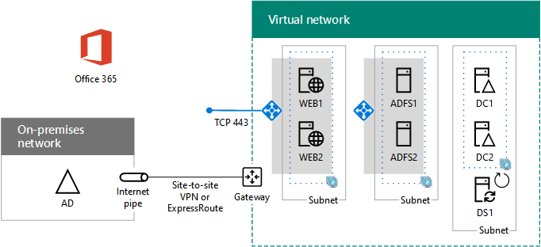

# Implementar la autenticación federada de alta disponibilidad para Office 365 en AzureDeploy high availability federated authentication for Office 365 in Azure

 **Resumen:** Configure la autenticación federada de alta disponibilidad para su suscripción de Office 365 en Microsoft Azure.**Summary:** Configure high availability federated authentication for your Office 365 subscription in Microsoft Azure.
  
Este artículo contiene vínculos a las instrucciones detalladas para implementar la autenticación federada de alta disponibilidad para Microsoft Office 365 en los servicios de infraestructura de Azure con estas máquinas virtuales:This article contains links to the step-by-step instructions for deploying high availability federated authentication for Microsoft Office 365 in Azure infrastructure services with these virtual machines:
  
- Dos servidores proxy de aplicación webTwo web application proxy servers
    
- Dos servidores de Servicios de federación de Active Directory (AD FS)Two Active Directory Federation Services (AD FS) servers
    
- Dos controladores de dominio de réplicaTwo replica domain controllers
    
- Un servidor de sincronización de directorios (DirSync) que ejecute Azure AD ConnectOne directory synchronization (DirSync) server running Azure AD Connect
    
Esta es la configuración, con nombres de marcador de posición para cada servidor.Here is the configuration, with placeholder names for each server.
  
**Una autenticación federada de alta disponibilidad para Office 365 en Azure****A high availability federated authentication for Office 365 infrastructure in Azure**

  
Todas las máquinas virtuales forman parte de una única red virtual entre locales de Azure (VNet).All of the virtual machines are in a single cross-premises Azure virtual network (VNet). 
  
> [!NOTE]
> La autenticación federada de los usuarios individuales no se basa en los recursos locales. Sin embargo, si la conexión entre locales está disponible, los controladores de dominio de VNet no recibirán actualizaciones de grupos y cuentas de usuario realizados en Windows Server AD en local. Para asegurarse de que esto no sucede, puede configurar la alta disponibilidad para la conexión entre locales. Para obtener más información, consulte [Conectividad de red virtual a red virtual y con alta disponibilidad entre locales]((https://docs.microsoft.com/azure/vpn-gateway/vpn-gateway-highlyavailable))Federated authentication of individual users does not rely on any on-premises resources. However, if the cross-premises connection becomes unavailable, the domain controllers in the VNet will not receive updates to user accounts and groups made in the on-premises Windows Server AD. To ensure this does not happen, you can configure high availability for your cross-premises connection. For more information, see [Highly Available Cross-Premises and VNet-to-VNet Connectivity]((https://docs.microsoft.com/azure/vpn-gateway/vpn-gateway-highlyavailable))
  
Cada par de máquinas virtuales asignado a un rol específico forma parte de su propia subred y de su propio conjunto de disponibilidad.Each pair of virtual machines for a specific role is in its own subnet and availability set.
  
> [!NOTE]
> Debido a que esta red virtual está conectada a la red local, la configuración no incluye máquinas virtuales intermedias ni de supervisión en una subred de administración. Para obtener más información, consulte [Running Windows VMs for an N-tier architecture]((https://docs.microsoft.com/azure/guidance/guidance-compute-n-tier-vm)).Because this VNet is connected to the on-premises network, this configuration does not include jumpbox or monitoring virtual machines on a management subnet. For more information, see [Running Windows VMs for an N-tier architecture]((https://docs.microsoft.com/azure/guidance/guidance-compute-n-tier-vm)). 
  
El resultado de esta configuración es que tendrá una autenticación federada para todos los usuarios de Office 365, en la que se pueden utilizar las credenciales de Windows Server Active Directory para iniciar sesión en lugar de la cuenta de Office 365. La infraestructura de autenticación federada utiliza un conjunto redundante de servidores que se implementan más fácilmente en servicios de la infraestructura de Azure en lugar de en la red perimetral en local.The result of this configuration is that you will have federated authentication for all of your Office 365 users, in which they can use their Windows Server Active Directory credentials to sign in rather than their Office 365 account. The federated authentication infrastructure uses a redundant set of servers that are more easily deployed in Azure infrastructure services, rather than in your on-premises edge network.
  
## Lista de materialesBill of materials

Esta configuración de línea base requiere el siguiente conjunto de componentes y servicios de Azure:This baseline configuration requires the following set of Azure services and components:
  
- Siete máquinas virtualesSeven virtual machines
    
- Una red virtual entre locales con cuatro subredesOne cross-premises virtual network with four subnets
    
- Cuatro grupos de recursosFour resource groups
    
- Tres conjuntos de disponibilidadThree availability sets
    
- Una suscripción a AzureOne Azure subscription
    
Estas son las máquinas virtuales y sus tamaños predeterminados para esta configuración.Here are the virtual machines and their default sizes for this configuration.
  
|**Elemento****Item**|**Descripción de la máquina virtual****Virtual machine description**|**Imagen de la galería de Azure****Azure gallery image**|**Tamaño predeterminado****Default size**|
|:-----|:-----|:-----|:-----|
|1.1.    |Primer controlador de dominioFirst domain controller    |Windows Server 2016 DatacenterWindows Server 2016 Datacenter    |D2D2    |
|2.2.    |Segundo controlador de dominioSecond domain controller    |Windows Server 2016 DatacenterWindows Server 2016 Datacenter    |D2D2    |
|3.3.    |Servidor de Azure AD ConnectAzure AD Connect server    |Windows Server 2016 DatacenterWindows Server 2016 Datacenter    |D2D2    |
|4.4.    |Primer servidor de AD FSFirst AD FS server    |Windows Server 2016 DatacenterWindows Server 2016 Datacenter    |D2D2    |
|5.5.    |Segundo servidor de AD FSSecond AD FS server    |Windows Server 2016 DatacenterWindows Server 2016 Datacenter    |D2D2    |
|6.6.    |Primer servidor proxy de aplicación webFirst web application proxy server    |Windows Server 2016 DatacenterWindows Server 2016 Datacenter    |D2D2    |
|7.7.    |Segundo servidor proxy de aplicación webSecond web application proxy server    |Windows Server 2016 DatacenterWindows Server 2016 Datacenter    |D2D2    |
   
Para calcular los costos estimados para esta configuración, consulte la [Calculadora de precios de Azure]((https://azure.microsoft.com/pricing/calculator/)).To compute the estimated costs for this configuration, see the [Azure pricing calculator]((https://azure.microsoft.com/pricing/calculator/))
  
## Fases de implementaciónPhases of deployment

Implementará esta carga de trabajo en las fases siguientes:You deploy this workload in the following phases:
  
<<<<<<< HEAD<<<<<<< HEAD
- [Fase 1 de la autenticación federada de alta disponibilidad: Configurar Azure](high-availability-federated-authentication-phase-1-configure-azure.md). Cree grupos de recursos, cuentas de almacenamiento, conjuntos de disponibilidad y una red virtual entre locales.[High availability federated authentication Phase 1: Configure Azure](high-availability-federated-authentication-phase-1-configure-azure.md). Create resource groups, storage accounts, availability sets, and a cross-premises virtual network.
    
- [High availability federated authentication Phase 2: Configure domain controllers](high-availability-federated-authentication-phase-2-configure-domain-controllers.md). Creación y configuración de controladores de dominio de réplica para Windows Server Active Directory (AD) y el servidor de DirSync.[High availability federated authentication Phase 2: Configure domain controllers](high-availability-federated-authentication-phase-2-configure-domain-controllers.md). Create and configure replica Windows Server Active Directory (AD) domain controllers and the DirSync server.
    
- [Fase 3 de la autenticación federada de alta disponibilidad: Configurar servidores de AD FS](high-availability-federated-authentication-phase-3-configure-ad-fs-servers.md). Cree y configure los dos servidores de AD FS.[High availability federated authentication Phase 3: Configure AD FS servers](high-availability-federated-authentication-phase-3-configure-ad-fs-servers.md). Create and configure the two AD FS servers.
    
- [Fase 4 de la autenticación federada de alta disponibilidad: Configurar los servidores proxy de aplicación web](high-availability-federated-authentication-phase-4-configure-web-application-pro.md). Cree y configure los dos servidores proxy de aplicación web.[High availability federated authentication Phase 4: Configure web application proxies](high-availability-federated-authentication-phase-4-configure-web-application-pro.md). Create and configure the two web application proxy servers.
    
- [Fase 5 de la autenticación federada de alta disponibilidad: Configurar la autenticación federada para Office 365](high-availability-federated-authentication-phase-5-configure-federated-authentic.md). Configure la autenticación federada para su suscripción de Office 365. =======[High availability federated authentication Phase 5: Configure federated authentication for Office 365](high-availability-federated-authentication-phase-5-configure-federated-authentic.md) . Configure federated authentication for your Office 365 subscription.
- [Fase 1 de la autenticación federada de alta disponibilidad: Configurar Azure](high-availability-federated-authentication-phase-1-configure-azure.md). Cree grupos de recursos, cuentas de almacenamiento, conjuntos de disponibilidad y una red virtual entre locales.[High availability federated authentication Phase 1: Configure Azure](high-availability-federated-authentication-phase-1-configure-azure.md) . Create resource groups, storage accounts, availability sets, and a cross-premises virtual network.
    
- [Fase 2 de la autenticación federada de alta disponibilidad: Configurar controladores de dominio](high-availability-federated-authentication-phase-2-configure-domain-controllers.md). Cree y configure los controladores de dominio de réplica para Windows Server Active Directory (AD) y el servidor de DirSync.[High availability federated authentication Phase 2: Configure domain controllers](high-availability-federated-authentication-phase-2-configure-domain-controllers.md) . Create and configure replica Windows Server Active Directory (AD) domain controllers and the DirSync server.
    
- [Fase 3 de la autenticación federada de alta disponibilidad: Configurar servidores de AD FS](high-availability-federated-authentication-phase-3-configure-ad-fs-servers.md). Cree y configure los dos servidores de AD FS.[High availability federated authentication Phase 3: Configure AD FS servers](high-availability-federated-authentication-phase-3-configure-ad-fs-servers.md) . Create and configure the two AD FS servers.
    
- [Fase 4 de la autenticación federada de alta disponibilidad: Configurar los servidores proxy de aplicación web](high-availability-federated-authentication-phase-4-configure-web-application-pro.md). Cree y configure los dos servidores proxy de aplicación web.[High availability federated authentication Phase 4: Configure web application proxies](high-availability-federated-authentication-phase-4-configure-web-application-pro.md) . Create and configure the two web application proxy servers.
    
- [Fase 5 de la autenticación federada de alta disponibilidad: Configurar la autenticación federada para Office 365](high-availability-federated-authentication-phase-5-configure-federated-authentic.md). Configure la autenticación federada para su suscripción de Office 365.[High availability federated authentication Phase 5: Configure federated authentication for Office 365](high-availability-federated-authentication-phase-5-configure-federated-authentic.md) . Configure federated authentication for your Office 365 subscription.
>>>>>>> mastermaster
    
En estos artículos, se proporciona una guía preceptiva dividida en fases para una arquitectura predefinida. Su objetivo es crear una autenticación federada de alta disponibilidad funcional para Office 365 en servicios de infraestructura de Azure. Tenga en cuenta lo siguiente:These articles provide a prescriptive, phase-by-phase guide for a predefined architecture to create a functional, high availability federated authentication for Office 365 in Azure infrastructure services. Keep the following in mind:
  
- Si es un experimentado implementador de AD FS, no dude en adaptar las instrucciones que se detallan en las fases 3 y 4, así como en crear el conjunto de servidores que mejor se adapte a sus necesidades. If you are an experienced AD FS implementer, feel free to adapt the instructions in phases 3 and 4 and build the set of servers that best suits your needs.
    
- Si ya tiene una implementación existente de nube híbrida de Azure con una red virtual entre locales existente, no dude en adaptar u omitir las instrucciones que aparecen en las fases 1 y 2 y colocar los servidores proxy de aplicación web y AD FS en las subredes adecuadas.If you already have an existing Azure hybrid cloud deployment with an existing cross-premises virtual network, feel free to adapt or skip the instructions in phases 1 and 2 and place the AD FS and web application proxy servers on the appropriate subnets.
    
Para crear un entorno de prueba o desarrollo o bien una prueba de concepto de esta configuración, consulte [Identidad federada para el entorno de desarrollo y pruebas de Office 365](federated-identity-for-your-office-365-dev-test-environment.md).To build a dev/test environment or a proof-of-concept of this configuration, see [Federated identity for your Office 365 dev/test environment](federated-identity-for-your-office-365-dev-test-environment.md).
  
## Paso siguienteNext step

Inicie la configuración de esta carga de trabajo con [Fase 1 de la autenticación federada de alta disponibilidad: Configurar Azure](high-availability-federated-authentication-phase-1-configure-azure.md).Start the configuration of this workload with [High availability federated authentication Phase 1: Configure Azure](high-availability-federated-authentication-phase-1-configure-azure.md). 
  
> [!TIP]
> Para que un conjunto de archivos implemente más rápidamente la autenticación federada de alta disponibilidad para Office 365 en Azure, consulte [Federated Authentication for Office 365 in Azure Deployment Kit]((https://gallery.technet.microsoft.com/Federated-Authentication-8a9f1664)).For a set of files to more quickly deploy your high availability federated authentication for Office 365 in Azure, see the [Federated Authentication for Office 365 in Azure Deployment Kit]((https://gallery.technet.microsoft.com/Federated-Authentication-8a9f1664)). 
  
## Consulte tambiénSee Also

[Identidad federada para el entorno de desarrollo y pruebas de Office 365Federated identity for your Office 365 dev/test environment](federated-identity-for-your-office-365-dev-test-environment.md)
  
[Adopción de la nube y soluciones híbridasCloud adoption and hybrid solutions](cloud-adoption-and-hybrid-solutions.md)

[Identidad federada para Office 365Federated identity for Office 365](https://support.office.com/article/Understanding-Office-365-identity-and-Azure-Active-Directory-06a189e7-5ec6-4af2-94bf-a22ea225a7a9#bk_federated)

