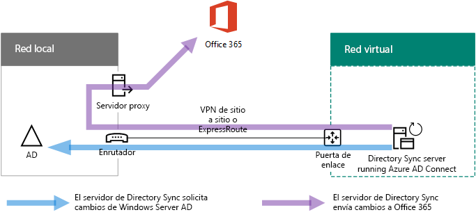

# Implementar la sincronización de directorios de Office 365 en Microsoft AzureDeploy Office 365 Directory Synchronization in Microsoft Azure

 **Resumen:** Implemente Azure AD Connect en una máquina virtual en los servicios de infraestructura de Azure para sincronizar las cuentas entre el directorio local y el espacio empresarial de Azure AD de su suscripción a Office 365.**Summary:** Deploy Azure AD Connect on a virtual machine in Azure infrastructure services to synchronize accounts between your on-premises directory and the Azure AD tenant of your Office 365 subscription.
  
Azure Active Directory (AD) Connect (antes conocida como herramienta de sincronización de directorios, herramienta de DirSync o herramienta DirSync.exe) es una aplicación que se instala en un servidor unido a un dominio para sincronizar a los usuarios del entorno de Servicios de dominio de Active Directory (AD DS) local con el inquilino de Azure AD de su suscripción a Office 365. Office 365 usa Azure Active Directory (Azure AD) para su servicio de directorio. La suscripción a Office 365 incluye un inquilino de Azure AD. Este inquilino también puede usarse para la administración de identidades de la organización con otras cargas de trabajo en la nube, incluidas otras aplicaciones SaaS y aplicaciones de Azure.Azure Active Directory (AD) Connect (formerly known as the Directory Synchronization tool, Directory Sync tool, or the DirSync.exe tool) is an application that you install on a domain-joined server to synchronize your on-premises Active Directory Domain Services (AD DS) users to the Azure AD tenant of your Office 365 subscription. Office 365 uses Azure Active Directory (Azure AD) for its directory service. Your Office 365 subscription includes an Azure AD tenant. This tenant can also be used for management of your organization's identities with other cloud workloads, including other SaaS applications and apps in Azure.

Puede instalar Azure AD Connect en un servidor local, pero también puede instalarlo en una máquina virtual en Azure por los motivos siguientes:You can install Azure AD Connect on a on-premises server, but you can also install it on a virtual machine in Azure for these reasons:
  
- Puede aprovisionar y configurar los servidores basados en la nube con mayor rapidez, y conseguir así que los servicios estén disponibles para los usuarios mucho antes.You can provision and configure cloud-based servers faster, making the services available to your users sooner.
- Azure ofrece mejor disponibilidad de sitios con menos esfuerzo.Azure offers better site availability with less effort.
- Puede reducir el número de servidores locales de su organización.You can reduce the number of on-premises servers in your organization.

Esta solución requiere conectividad entre la red local y la red virtual de Azure. Para más información, vea [Conectar una red local con una red virtual de Microsoft Azure](connect-an-on-premises-network-to-a-microsoft-azure-virtual-network.md).This solution requires connectivity between your on-premises network and your Azure virtual network. For more information, see [Connect an on-premises network to a Microsoft Azure virtual network](connect-an-on-premises-network-to-a-microsoft-azure-virtual-network.md). 
  
> [!NOTE]
> En este artículo se describe la sincronización de un único dominio en un único bosque. Azure AD Connect sincroniza todos los dominios de AD DS en el bosque de Active Directory con Office 365. Si tiene varios bosques de Active Directory para sincronizar con Office 365, consulte el tema [Integración de las identidades locales con Azure Active Directory](https://go.microsoft.com/fwlink/p/?LinkId=393091).This article describes synchronization of a single domain in a single forest. Azure AD Connect synchronizes all AD DS domains in your Active Directory forest with Office 365. If you have multiple Active Directory forests to synchronize with Office 365, see [Multi-forest Directory Sync with Single Sign-On Scenario](https://go.microsoft.com/fwlink/p/?LinkId=393091). 
  
## Introducción a la implementación de sincronización de directorios de Office 365 en AzureOverview of deploying Office 365 directory synchronization in Azure

El siguiente diagrama muestra Azure AD Connect en ejecución en una máquina virtual de Azure (el servidor de sincronización de directorios) que sincroniza un bosque de AD DS local con una suscripción a Office 365.The following diagram shows Azure AD Connect running on a virtual machine in Azure (the directory sync server) that synchronizes an on-premises AD DS forest to an Office 365 subscription.
  

  
En el diagrama hay dos redes conectadas por una conexión VPN de sitio a sitio o ExpressRoute. Hay una red local donde se encuentran los controladores de dominio de AD DS y una red virtual de Azure con un servidor de sincronización de directorios, que es una máquina virtual en ejecución en [Azure AD Connect](https://www.microsoft.com/download/details.aspx?id=47594). Hay dos flujos de tráfico principal que se originan en el servidor de sincronización de directorios:In the diagram, there are two networks connected by a site-to-site VPN or ExpressRoute connection. There is an on-premises network where AD DS domain controllers are located, and there is an Azure virtual network with a directory sync server, which is a virtual machine running [Azure AD Connect](https://www.microsoft.com/download/details.aspx?id=47594). There are two main traffic flows originating from the directory sync server:
  
-  Azure AD Connect consulta un controlador de dominio en la red local para conocer los cambios de cuentas y contraseñas.Azure AD Connect queries a domain controller on the on-premises network for changes to accounts and passwords.
-  Azure AD Connect envía los cambios de cuentas y contraseñas a la instancia de Azure AD de su suscripción a Office 365. Como el servidor de sincronización de directorios se encuentra en una parte extendida de la red local, estos cambios se envían a través del servidor proxy de la red local.Azure AD Connect sends the changes to accounts and passwords to the Azure AD instance of your Office 365 subscription. Because the directory sync server is in an extended portion of your on-premises network, these changes are sent through the on-premises network's proxy server.
    
> [!NOTE]
> En esta solución se describe la sincronización de un único dominio de Active Directory en un único bosque de Active Directory. Azure AD Connect sincroniza todos los dominios de Active Directory en el bosque de Active Directory con Office 365. Si tiene varios bosques de Active Directory para sincronizar con Office 365, consulte [Integración de las identidades locales con Azure Active Directory](https://go.microsoft.com/fwlink/p/?LinkId=393091).This solution describes synchronization of a single Active Directory domain, in a single Active Directory forest. Azure AD Connect synchronizes all Active Directory domains in your Active Directory forest with Office 365. If you have multiple Active Directory forests to synchronize with Office 365, see [Multi-forest Directory Sync with Single Sign-On Scenario](https://go.microsoft.com/fwlink/p/?LinkId=393091). 
  
Existen dos pasos principales cuando implementa esta solución:There are two major steps when you deploy this solution:
  
1. Crear una red virtual de Azure y establecer una conexión VPN de sitio a sitio en su red local. Para obtener más información, consulte [Conectar una red local con una red virtual de Microsoft Azure](connect-an-on-premises-network-to-a-microsoft-azure-virtual-network.md).Create an Azure virtual network and establish a site-to-site VPN connection to your on-premises network. For more information, see [Connect an on-premises network to a Microsoft Azure virtual network](connect-an-on-premises-network-to-a-microsoft-azure-virtual-network.md).
    
2. Instalar [Azure AD Connect](https://www.microsoft.com/download/details.aspx?id=47594) en una máquina virtual unida a un dominio en Azure y después sincronizar AD DS local con Office 365. Esto conlleva lo siguiente:Install [Azure AD Connect](https://www.microsoft.com/download/details.aspx?id=47594) on a domain-joined virtual machine in Azure, and then synchronize the on-premises AD DS to Office 365. This involves:
    
    Crear una Máquina virtual de Azure para ejecutar Azure AD Connect.Creating an Azure Virtual Machine to run Azure AD Connect.
    
    Instalar y configurar [Azure AD Connect](https://www.microsoft.com/download/details.aspx?id=47594).Installing and configuring [Azure AD Connect](https://www.microsoft.com/download/details.aspx?id=47594).
    
    Configurar Azure AD Connect requiere las credenciales (nombre de usuario y contraseña) de una cuenta de administrador de Azure AD y una cuenta de administrador empresarial de AD DS. Azure AD Connect se ejecuta inmediatamente y de forma continuada para sincronizar el bosque de AD DS local con Office 365.Configuring Azure AD Connect requires the credentials (user name and password) of an Azure AD administrator account and a AD DS enterprise administrator account. Azure AD Connect runs immediately and on an ongoing basis to synchronize the on-premises AD DS forest to Office 365.
    
Antes de implementar esta solución en producción, puede seguir las instrucciones de [Sincronización de directorios para el entorno de desarrollo y prueba de Office 365](dirsync-for-your-office-365-dev-test-environment.md) para establecer esta configuración como prueba de concepto para demostraciones o para experimentación.Before you deploy this solution in production, you can use the instructions in [Directory synchronization for your Office 365 dev/test environment](dirsync-for-your-office-365-dev-test-environment.md) to set this configuration up as a proof of concept, for demonstrations, or for experimentation.
  
> [!IMPORTANT]
> Cuando la configuración de Azure AD Connect se completa, no guarda las credenciales de la cuenta de administrador de organización de AD DS.When Azure AD Connect configuration completes, it does not save the AD DS enterprise administrator account credentials. 
  
> [!NOTE]
> Esta solución describe la sincronización de un único bosque de AD DS con Office 365. La topología descrita en este artículo solo representa una manera de implementar esta solución. Es posible que la topología de su organización difiera en función de sus requisitos de red únicos y las consideraciones de seguridad.This solution describes synchronizing a single AD DS forest to Office 365. The topology discussed in this article represents only one way to implement this solution. Your organization's topology might differ based on your unique network requirements and security considerations. 
  
## Planear el hospedaje de un servidor de sincronización de directorios de Office 365 en AzurePlan for hosting a directory sync server for Office 365 in Azure

### Requisitos previosPrerequisites

Antes de comenzar, revise los siguientes requisitos previos para esta solución:Before you begin, review the following prerequisites for this solution:
  
- Revise el contenido de planeación relacionado en [Planear la red virtual de Azure](connect-an-on-premises-network-to-a-microsoft-azure-virtual-network.md#plan-your-azure-virtual-network).Review the related planning content in [Plan your Azure virtual network](connect-an-on-premises-network-to-a-microsoft-azure-virtual-network.md#plan-your-azure-virtual-network).
    
- Asegúrese de que cumple todos los [requisitos previos](connect-an-on-premises-network-to-a-microsoft-azure-virtual-network.md#prerequisites) para configurar la red virtual de Azure.Ensure that you meet all [Prerequisites](connect-an-on-premises-network-to-a-microsoft-azure-virtual-network.md#prerequisites) for configuring the Azure virtual network.
    
- Consiga una suscripción a Office 365 que incluya la característica de integración de Active Directory. Para obtener más información sobre las suscripciones de Office 365, vaya a la [página de suscripción de Office 365](https://products.office.com/compare-all-microsoft-office-products?tab=2).Have an Office 365 subscription that includes the Active Directory integration feature. For information about Office 365 subscriptions, go to the [Office 365 subscription page](https://products.office.com/compare-all-microsoft-office-products?tab=2).
    
- Aprovisione una Máquina virtual de Azure que ejecute Azure AD Connect para sincronizar el bosque de AD DS local con Office 365.Provision one Azure Virtual Machine that runs Azure AD Connect to synchronize your on-premises AD DS forest with Office 365.
    
    Debe tener las credenciales (nombres y contraseñas) de la cuenta de administrador empresarial de AD DS y una cuenta de administrador de Azure AD.You must have the credentials (names and passwords) for a AD DS enterprise administrator account and an Azure AD Administrator account.
    
### Suposiciones de diseño de la arquitectura de la soluciónSolution architecture design assumptions

En la siguiente lista se describen las elecciones de diseño que se han tomado para esta solución.The following list describes the design choices made for this solution.
  
- Esta solución usa una sola red virtual de Azure con una conexión VPN de sitio a sitio. La red virtual de Azure hospeda una sola subred que solo contiene un servidor, el servidor de sincronización de directorios que ejecuta Azure AD Connect.This solution uses a single Azure virtual network with a site-to-site VPN connection. The Azure virtual network hosts a single subnet that has one server, the directory sync server that is running Azure AD Connect. 
    
- En la red local, hay un controlador de dominio y servidores DNS.On the on-premises network, a domain controller and DNS servers exist.
    
- Azure AD Connect realiza la sincronización de hash de contraseña, en lugar de usar el inicio de sesión único. No tiene que implementar una infraestructura de los Servicios de federación de Active Directory (AD FS). Para obtener más información sobre la sincronización de hash de contraseña y las opciones de inicio de sesión único, vea [Seleccionar el método de autenticación adecuado para una solución de identidad híbrida de Azure Active Directory](https://aka.ms/auth-options).Azure AD Connect performs password hash synchronization instead of single sign-on. You do not have to deploy an Active Directory Federation Services (AD FS) infrastructure. To learn more about password hash synchronization and single sign-on options, see [Choosing the right authentication method for your Azure Active Directory hybrid identity solution](https://aka.ms/auth-options).
    
Hay otras opciones de diseño adicionales que puede tener en cuenta cuando implementa esta solución en su entorno. Se incluyen las siguientes:There are additional design choices that you might consider when you deploy this solution in your environment. These include the following:
  
- Si hay servidores DNS en una red virtual existente de Azure, determine si desea que el servidor de sincronización de directorios los use para la resolución de nombres, en lugar de usar los servidores DNS de la red local.If there are existing DNS servers in an existing Azure virtual network, determine whether you want your directory sync server to use them for name resolution instead of DNS servers on the on-premises network.
    
- Si hay controladores de dominio en una red virtual existente de Azure, determine si la configuración de Sitios y servicios de Active Directory puede suponer una mejor opción. El servidor de sincronización de directorios puede consultar los controladores de dominio de la red virtual de Azure para buscar cambios en las cuentas y las contraseñas, en lugar de usar los controladores de dominio de la red local.If there are domain controllers in an existing Azure virtual network, determine whether configuring Active Directory Sites and Services may be a better option for you. The directory sync server can query the domain controllers in the Azure virtual network for changes in accounts and passwords instead of domain controllers on the on-premises network.
    
## Guía de implementaciónDeployment roadmap

La implementación de Azure AD Connect en una máquina virtual en Azure consta de tres fases:Deploying Azure AD Connect on a virtual machine in Azure consists of three phases:
  
- Fase 1: Creación y configuración de la red virtual de AzurePhase 1: Create and configure the Azure virtual network
    
- Fase 2: Creación y configuración de la máquina virtual de AzurePhase 2: Create and configure the Azure virtual machine
    
- Fase 3: Instalar y configurar Azure AD ConnectPhase 3: Install and configure Azure AD Connect
    
Después de la implementación, también debe asignar ubicaciones y licencias para las nuevas cuentas de usuario en Office 365.After deployment, you must also assign locations and licenses for the new user accounts in Office 365.

### Fase 1: Creación y configuración de la red virtual de AzurePhase 1: Create and configure the Azure virtual network

Para crear y configurar la red virtual de Azure, complete la [Fase 1: Preparar la red local](connect-an-on-premises-network-to-a-microsoft-azure-virtual-network.md#phase-1-prepare-your-on-premises-network) y la [Fase 2: Crear la red virtual entre locales en Azure](connect-an-on-premises-network-to-a-microsoft-azure-virtual-network.md#phase-2-create-the-cross-premises-virtual-network-in-azure) del plan de implementación de [Conectar una red local a Microsoft Azure Virtual Network](connect-an-on-premises-network-to-a-microsoft-azure-virtual-network.md).To create and configure the Azure virtual network, complete [Phase 1: Prepare your on-premises network](connect-an-on-premises-network-to-a-microsoft-azure-virtual-network.md#phase-1-prepare-your-on-premises-network) and [Phase 2: Create the cross-premises virtual network in Azure](connect-an-on-premises-network-to-a-microsoft-azure-virtual-network.md#phase-2-create-the-cross-premises-virtual-network-in-azure) in the deployment roadmap of [Connect an on-premises network to a Microsoft Azure virtual network](connect-an-on-premises-network-to-a-microsoft-azure-virtual-network.md).
  
Esta es la configuración resultante.This is your resulting configuration.
  

  
En esta figura se muestra una red local conectada a una red virtual de Azure mediante una conexión de ExpressRoute o VPN de sitio a sitio.This figure shows an on-premises network connected to an Azure virtual network through a site-to-site VPN or ExpressRoute connection.
  
### Fase 2: Creación y configuración de la máquina virtual de AzurePhase 2: Create and configure the Azure virtual machine

Cree la máquina virtual en Azure con las instrucciones [Creación de la primera máquina virtual de Windows en Azure Portal](https://go.microsoft.com/fwlink/p/?LinkId=393098). Use la configuración siguiente:Create the virtual machine in Azure using the instructions [Create your first Windows virtual machine in the Azure portal](https://go.microsoft.com/fwlink/p/?LinkId=393098). Use the following settings:
  
- En el panel **Datos básicos**, seleccione la misma suscripción, ubicación y grupo de recursos que la red virtual. Registre el nombre de usuario y la contraseña en un lugar seguro. Los necesitará posteriormente para conectarse a la máquina virtual.On the **Basics** pane, select the same subscription, location, and resource group as your virtual network. Record the user name and password in a secure location. You will need these later to connect to the virtual machine.
    
- En el panel **Elija un tamaño**, seleccione el tamaño **A2 estándar**.On the **Choose a size** pane, choose the **A2 Standard** size.
    
- En la sección **Almacenamiento** del panel **Configuración**, seleccione el tipo de almacenamiento **Estándar**. En la sección **Red**, seleccione el nombre de la red virtual y la subred que van a hospedar el servidor de sincronización de directorios (no la subred de puerta de enlace). Deje todas las demás opciones con sus valores predeterminados.On the **Settings** pane, in the **Storage** section, select the **Standard** storage type. In the **Network** section, select the name of your virtual network and the subnet for hosting the directory sync server (not the GatewaySubnet). Leave all other settings at their default values.
    
Compruebe que el servidor de sincronización de directorios usa DNS correctamente. Para ello, compruebe su DNS interno y asegúrese de que se ha agregado un registro de dirección (A) para la máquina virtual con su dirección IP.Verify that your directory sync server is using DNS correctly by checking your internal DNS to make sure that an Address (A) record was added for the virtual machine with its IP address. 
  
Siga las instrucciones de [Connect to the virtual machine and sign on](https://docs.microsoft.com/azure/virtual-machines/windows/connect-logon) (Conectarse a la máquina virtual e iniciar sesión) para conectarse al servidor de sincronización de directorios con una conexión a Escritorio remoto. Después de iniciar sesión, una la máquina virtual al dominio de AD DS local.Use the instructions in [Connect to the virtual machine and sign on](https://docs.microsoft.com/azure/virtual-machines/windows/connect-logon) to connect to the directory sync server with a Remote Desktop Connection. After signing in, join the virtual machine to the on-premises AD DS domain.
  
Para que Azure AD Connect obtenga acceso a recursos de Internet, hay que configurar el servidor de sincronización de directorios de modo que use el servidor proxy de la red local. Póngase en contacto con su administrador de red para conocer los pasos de configuración adicionales que debe realizar.For Azure AD Connect to gain access to Internet resources, you must configure the directory sync server to use the on-premises network's proxy server. You should contact your network administrator for any additional configuration steps to perform.
  
Esta es la configuración resultante.This is your resulting configuration.
  

  
En esta figura se muestra la máquina virtual del servidor de sincronización de directorios en la red virtual de Azure entre locales.This figure shows the directory sync server virtual machine in the cross-premises Azure virtual network.
  
### Fase 3: Instalar y configurar Azure AD ConnectPhase 3: Install and configure Azure AD Connect

Haga lo siguiente:Complete the following procedure:
  
1. Conéctese al servidor de sincronización de directorios mediante una conexión a Escritorio remoto con una cuenta de dominio de AD DS que tenga privilegios de administrador local. Vea [Connect to the virtual machine and sign on](https://docs.microsoft.com/azure/virtual-machines/windows/connect-logon) (Conectarse a la máquina virtual e iniciar sesión).Connect to the directory sync server using a Remote Desktop Connection with an AD DS domain account that has local administrator privileges. See [Connect to the virtual machine and sign on](https://docs.microsoft.com/azure/virtual-machines/windows/connect-logon).
    
2. Desde el servidor de sincronización de directorios, abra el artículo [Configurar la sincronización de directorios para Office 365](set-up-directory-synchronization.md) y siga las instrucciones relativas a la sincronización de directorios con la sincronización de hash de contraseñas.From the directory sync server, open the [Set up directory synchronization for Office 365](set-up-directory-synchronization.md) article and follow the directions for directory synchronization with password hash synchronization.
    
> [!CAUTION]
> El programa de instalación crea la cuenta **AAD_xxxxxxxxxxxx** en la unidad organizativa (UO) de usuarios locales. No mueva ni quite esta cuenta porque entonces se producirá un error de sincronización.Setup creates the **AAD_xxxxxxxxxxxx** account in the Local Users organizational unit (OU). Do not move or remove this account or synchronization will fail.
  
Esta es la configuración resultante.This is your resulting configuration.
  

  
En esta figura se muestra el servidor de sincronización de directorios con Azure AD Connect en la red virtual de Azure entre locales.This figure shows the directory sync server with Azure AD Connect in the cross-premises Azure virtual network.
  
### Asignar ubicaciones y licencias a los usuarios de Office 365Assign locations and licenses to users in Office 365

Azure AD Connect agrega cuentas a su suscripción de Office 365 desde AD DS local, pero para que los usuarios inicien sesión en Office 365 y usen sus servicios, las cuentas deben configurarse con una ubicación y licencias. Use estos pasos para agregar la ubicación y activar las licencias para las cuentas de usuario adecuadas:Azure AD Connect adds accounts to your Office 365 subscription from the on-premises AD DS, but in order for users to sign in to Office 365 and use its services, the accounts must be configured with a location and licenses. Use these steps to add the location and activate licenses for the appropriate user accounts:
  
1. Inicie sesión en la [página del Portal de Office 365](https://www.office.com) y, después, haga clic en **Administrador**.Sign in to the [Office 365 portal page](https://www.office.com), and then click **Admin**.
    
2. En el panel de navegación izquierdo, haga clic en **Usuarios > Usuarios activos**.In the left navigation, click **Users > Active users**.
    
3. En la lista de las cuentas de usuarios, seleccione la casilla junto al usuario que quiere activar.In the list of user accounts, select the check box next to the user you want to activate.
    
4. En la página del usuario, haga clic en **Editar** para **Licencias de productos**.On the page for the user, click **Edit** for **Product licenses**.
    
5. En la página **Licencias de productos**, seleccione una ubicación para el usuario en **Ubicación** y, después, habilite las licencias adecuadas para el usuario.On the **Product licenses** page, select a location for the user for **Location**, and then enable the appropriate licenses for the user.
    
6. Cuando finalice, haga clic en **Guardar** y, después, haga clic en **Cerrar** dos veces.When complete, click **Save**, and then click **Close** twice.
    
7. Vuelva al paso 3 para usuarios adicionales.Go back to step 3 for additional users.
    
## Recursos adicionalesSee also

[Adopción de la nube y soluciones híbridasCloud adoption and hybrid solutions](cloud-adoption-and-hybrid-solutions.md)
  
[Conectar una red local con una red virtual de Microsoft AzureConnect an on-premises network to a Microsoft Azure virtual network](connect-an-on-premises-network-to-a-microsoft-azure-virtual-network.md)

[Descargar Azure AD ConnectDownload Azure AD Connect](https://www.microsoft.com/download/details.aspx?id=47594)
  
[Configuración de la sincronización del directorio para Office 365Set up directory synchronization for Office 365](set-up-directory-synchronization.md)
  
