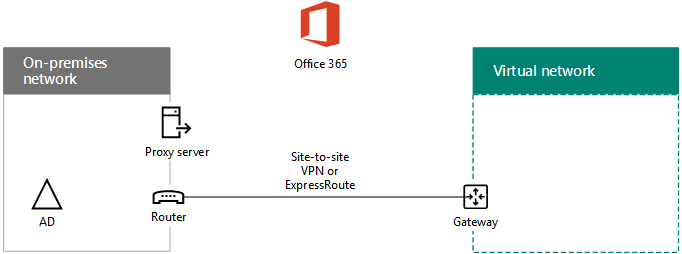

# Implementar la sincronización de directorios (DirSync) de Office 365 en Microsoft AzureDeploy Office 365 Directory Synchronization (DirSync) in Microsoft Azure

 **Resumen:** Implemente Azure AD Connect (DirSync) en una máquina virtual en Azure para sincronizar las cuentas entre el directorio local y el inquilino de Azure AD con su suscripción de Office 365.**Summary:** Deploy Azure AD Connect (DirSync) on a virtual machine in Azure to synchronize accounts between your on-premises directory and the Azure AD tenant of your Office 365 subscription.
  
Azure Active Directory (AD) Connect (antes conocida como herramienta de sincronización de directorios, herramienta de DirSync o herramienta DirSync.exe) es una aplicación basada en servidor que se instala en un servidor unido a un dominio para sincronizar a los usuarios de Windows Server Active Directory local con el inquilino de Azure Active Directory de su suscripción a Office 365. Puede instalar Azure AD Connect en un servidor local, pero también puede instalarlo en una máquina virtual en Azure por los siguientes motivos:Azure Active Directory (AD) Connect (formerly known as the Directory Synchronization tool, Directory Sync tool, or the DirSync.exe tool) is a server-based application that you install on a domain-joined server to synchronize your on-premises Windows Server Active Directory users to the Azure Active Directory tenant of your Office 365 subscription. You can install Azure AD Connect on a on-premises server, but you can also install it on a virtual machine in Azure for the following reasons:
  
- Puede aprovisionar y configurar los servidores basados en la nube con mayor rapidez, y conseguir así que los servicios estén disponibles para los usuarios mucho antes.You can provision and configure cloud-based servers faster, making the services available to your users sooner.
    
- Azure ofrece mejor disponibilidad de sitios con menos esfuerzo.Azure offers better site availability with less effort.
    
- Puede reducir el número de servidores locales de su organización.You can reduce the number of on-premises servers in your organization.
    
> [!IMPORTANT]
> Esta solución requiere conectividad entre la red local y la red virtual de Azure. Para más información, vea [Conectar una red local con una red virtual de Microsoft Azure](connect-an-on-premises-network-to-a-microsoft-azure-virtual-network.md).This solution requires connectivity between your on-premises network and your Azure Virtual Network. For more information, see [Connect an on-premises network to a Microsoft Azure virtual network](connect-an-on-premises-network-to-a-microsoft-azure-virtual-network.md). 
  
> [!IMPORTANT]
> En este artículo se describe la sincronización de un único dominio en un único bosque. Azure AD Connect sincroniza todos los dominios de Windows Server AD en el bosque de Active Directory con Office 365. Si tiene varios bosques de Active Directory para sincronizar con Office 365, consulte el tema [Integración de las identidades locales con Azure Active Directory](https://go.microsoft.com/fwlink/p/?LinkId=393091).This article describes synchronization of a single domain in a single forest. Azure AD Connect synchronizes all Windows Server AD domains in your Active Directory forest with Office 365. If you have multiple Active Directory forests to synchronize with Office 365, see [Multi-forest Directory Sync with Single Sign-On Scenario](https://go.microsoft.com/fwlink/p/?LinkId=393091). 
  
> [!NOTE]
> Office 365 usa Azure Active Directory (Azure AD) para su servicio de directorio. La suscripción a Office 365 incluye un inquilino de Azure AD. Este inquilino también puede usarse para la administración de identidades de la organización con otras cargas de trabajo en la nube, incluidas otras aplicaciones SaaS y aplicaciones de Azure.Office 365 uses Azure Active Directory (Azure AD) for its directory service. Your Office 365 subscription includes an Azure AD tenant. This tenant can also be used for management of your organization's identities with other cloud workloads, including other SaaS applications and apps in Azure. 
  
## Introducción a la implementación de sincronización de directorios de Office 365 en AzureOverview of deploying Office 365 directory synchronization in Azure

El siguiente diagrama muestra Azure Connect de AD se ejecuta en una máquina virtual en Azure (el servidor de sincronización de directorios) que sincroniza un bosque de Windows Server AD local a una suscripción deOffice 365.The following diagram shows Azure AD Connect running on a virtual machine in Azure (the DirSync server) that synchronizes an on-premises Windows Server AD forest to anOffice 365 subscription.
  

  
En el diagrama, hay dos redes conectadas por una conexión de sitio a sitio VPN o ExpressRoute. Hay una red local donde se encuentran los controladores de dominio de AD de Windows Server, y hay una red virtual de Azure con un servidor de sincronización de directorios, que es una máquina virtual ejecuta [Azure Connect AD](https://www.microsoft.com/download/details.aspx?id=47594). Hay dos flujos de tráfico principal original desde el servidor de sincronización de directorios:In the diagram, there are two networks connected by a site-to-site VPN or ExpressRoute connection. There is an on-premises network where Windows Server AD domain controllers are located, and there is an Azure virtual network with a DirSync server, which is a virtual machine running [Azure AD Connect](https://www.microsoft.com/download/details.aspx?id=47594). There are two main traffic flows originating from the DirSync server:
  
-  Azure AD Connect consulta un controlador de dominio en la red local para conocer los cambios de cuentas y contraseñas.Azure AD Connect queries a domain controller on the on-premises network for changes to accounts and passwords.
    
-  Azure AD Connect envía los cambios de cuentas y contraseñas a la instancia de Azure AD de su suscripción de Office 365. Como el servidor de DirSync se encuentra en una parte extendida de la red local, estos cambios se envían a través del servidor proxy de la red local.Azure AD Connect sends the changes to accounts and passwords to the Azure AD instance of your Office 365 subscription. Because the DirSync server is in an extended portion of your on-premises network, these changes are sent through the on-premises network's proxy server.
    
> [!NOTE]
> En esta solución se describe la sincronización de un único dominio de Active Directory en un único bosque de Active Directory. Azure AD Connect sincroniza todos los dominios de Active Directory en el bosque de Active Directory con Office 365. Si tiene varios bosques de Active Directory para sincronizar con Office 365, consulte [Integración de las identidades locales con Azure Active Directory](https://go.microsoft.com/fwlink/p/?LinkId=393091).This solution describes synchronization of a single Active Directory domain, in a single Active Directory forest. Azure AD Connect synchronizes all Active Directory domains in your Active Directory forest with Office 365. If you have multiple Active Directory forests to synchronize with Office 365, see [Multi-forest Directory Sync with Single Sign-On Scenario](https://go.microsoft.com/fwlink/p/?LinkId=393091). 
  
En ambos casos, el tráfico originado por Azure AD Connect que se ejecuta en la máquina virtual de Azure se reenvía a una puerta de enlace en la red virtual en Azure, que luego reenvía el tráfico a través de la conexión VPN de sitio a sitio o ExpressRoute en el dispositivo de puerta de enlace de VPN de la red local. Después, la infraestructura de enrutamiento de la red local reenvía el tráfico a su destino, como un controlador de dominio o un servidor proxy.In both cases, the traffic originated by Azure AD Connect running on the Azure virtual machine is forwarded to a gateway on the virtual network in Azure, which then forwards the traffic across the site-to-site VPN or ExpressRoute connection to the VPN gateway device on the on-premises network. The routing infrastructure of the on-premises network then forwards the traffic to its destination, such as a domain controller or a proxy server.
  
Existen dos pasos principales cuando implementa esta solución:There are two major steps when you deploy this solution:
  
1. Crear una red virtual de Azure y establecer una conexión VPN de sitio a sitio en su red local. Para obtener más información, consulte [Conectar una red local con una red virtual de Microsoft Azure](connect-an-on-premises-network-to-a-microsoft-azure-virtual-network.md).Create an Azure virtual network and establish a site-to-site VPN connection to your on-premises network. For more information, see [Connect an on-premises network to a Microsoft Azure virtual network](connect-an-on-premises-network-to-a-microsoft-azure-virtual-network.md).
    
2. Instalar [Azure AD Connect](https://www.microsoft.com/download/details.aspx?id=47594) en una máquina virtual unida a un dominio en Azure y después sincronizar Windows Server AD local con Office 365. Esto conlleva lo siguiente:Install [Azure AD Connect](https://www.microsoft.com/download/details.aspx?id=47594) on a domain-joined virtual machine in Azure, and then synchronize the on-premises Windows Server AD to Office 365. This involves:
    
    Crear una Máquina virtual de Azure para ejecutar Azure AD Connect.Creating an Azure Virtual Machine to run Azure AD Connect.
    
    Instalar y configurar [Azure AD Connect](https://www.microsoft.com/download/details.aspx?id=47594).Installing and configuring [Azure AD Connect](https://www.microsoft.com/download/details.aspx?id=47594).
    
    Configurar Azure AD Connect requiere las credenciales (nombre de usuario y contraseña) de una cuenta de administrador de Azure AD y una cuenta de administrador empresarial de Windows Server AD. Azure AD Connect se ejecuta inmediatamente y de forma continuada para sincronizar el bosque de Windows Server AD local con Office 365.Configuring Azure AD Connect requires the credentials (user name and password) of an Azure AD administrator account and a Windows Server AD enterprise administrator account. Azure AD Connect runs immediately and on an ongoing basis to synchronize the on-premises Windows Server AD forest to Office 365.
    
Antes de implementar esta solución en producción, utilice las instrucciones en [Sincronización de directorios (DirSync) para el entorno de desarrollo y pruebas de Office 365](dirsync-for-your-office-365-dev-test-environment.md) para establecer esta configuración como una prueba de concepto para demostraciones, o para la experimentación.Before you deploy this solution in production, use the instructions in [DirSync for your Office 365 dev/test environment](dirsync-for-your-office-365-dev-test-environment.md) to set this configuration up as a proof of concept, for demonstrations, or for experimentation.
  
> [!IMPORTANT]
> Cuando la configuración de Azure AD Connect se completa, no guarda las credenciales de la cuenta de administrador de organización de Windows Server AD.When Azure AD Connect configuration completes, it does not save the Windows Server AD enterprise administrator account credentials. 
  
> [!NOTE]
> Esta solución describe la sincronización de un único bosque de Windows Server AD a Office 365. La topología que se describen en este artículo representa sólo una manera de implementar esta solución. La topología de su organización puede diferir en función de sus requisitos de red únicos y consideraciones de seguridad.This solution describes synchronizing a single Windows Server AD forest to Office 365. The topology discussed in this article represents only one way to implement this solution. Your organization's topology might differ based on your unique network requirements and security considerations. 
  
## Planeación para hospedar un servidor de DirSync para Office 365 en AzurePlan for hosting a DirSync server for Office 365 in Azure

### Requisitos previosPrerequisites

Antes de comenzar, revise los siguientes requisitos previos para esta solución:Before you begin, review the following prerequisites for this solution:
  
- Revise el contenido de planeación relacionado en el tema sobre la [Planear la red virtual de Azure](connect-an-on-premises-network-to-a-microsoft-azure-virtual-network.md#PlanningVirtual).Review the related planning content in [Plan your Azure virtual network](connect-an-on-premises-network-to-a-microsoft-azure-virtual-network.md#PlanningVirtual).
    
- Asegúrese de que cumple todos los [requisitos previos](connect-an-on-premises-network-to-a-microsoft-azure-virtual-network.md#Prerequisites) para configurar la red virtual de Azure.Ensure that you meet all [prerequisites](connect-an-on-premises-network-to-a-microsoft-azure-virtual-network.md#Prerequisites) for configuring the Azure virtual network.
    
- Consiga una suscripción a Office 365 que incluya la característica de integración de Active Directory. Para obtener más información sobre las suscripciones de Office 365, vaya a la [página de suscripción de Office 365](https://go.microsoft.com/fwlink/p/?LinkId=394278).Have an Office 365 subscription that includes the Active Directory integration feature. For information about Office 365 subscriptions, go to the [Office 365 subscription page](https://go.microsoft.com/fwlink/p/?LinkId=394278).
    
- Aprovisione una Máquina virtual de Azure que ejecute Azure AD Connect para sincronizar el bosque de Windows Server AD local con Office 365.Provision one Azure Virtual Machine that runs Azure AD Connect to synchronize your on-premises Windows Server AD forest with Office 365.
    
    Debe tener las credenciales (nombres y contraseñas) de la cuenta de administrador empresarial de Windows Server AD y una cuenta de administrador de Azure Active Directory.You must have the credentials (names and passwords) for a Windows Server AD enterprise administrator account and an Azure Active Directory Administrator account.
    
### Suposiciones de diseño de la arquitectura de la soluciónSolution architecture design assumptions

En la siguiente lista se describen las elecciones de diseño que se han tomado para esta solución.The following list describes the design choices made for this solution.
  
- Esta solución usa una sola red virtual de Azure con una conexión VPN de sitio a sitio. La red virtual de Azure hospeda una sola subred que contiene un servidor, el servidor de DirSync que ejecuta Azure AD Connect.This solution uses a single Azure virtual network with a site-to-site VPN connection. The Azure virtual network hosts a single subnet that contains one server, the DirSync server that is running Azure AD Connect. 
    
- En la red local, hay un controlador de dominio y servidores DNS.On the on-premises network, a domain controller and DNS servers exist.
    
- Azure AD Connect realiza la sincronización de contraseñas en lugar del inicio de sesión único. No es necesario implementar una infraestructura de Servicios de federación de Active Directory (AD FS). Para obtener más información sobre la sincronización de contraseñas y las opciones de inicio de sesión único, consulte [Determine qué escenario de integración de directorios se debe usar](https://go.microsoft.com/fwlink/p/?LinkId=393094).Azure AD Connect performs password synchronization instead of single sign-on. You do not have to deploy an Active Directory Federation Services (AD FS) infrastructure. To learn more about password synchronization and single sign-on options, see [Determine which directory integration scenario to use](https://go.microsoft.com/fwlink/p/?LinkId=393094).
    
Hay otras opciones de diseño adicionales que puede tener en cuenta cuando implementa esta solución en su entorno. Se incluyen las siguientes:There are additional design choices that you might consider when you deploy this solution in your environment. These include the following:
  
- Si hay servidores DNS en una red virtual existente de Azure, determine si desea que el servidor DirSync los use para la resolución de nombres, en lugar de usar los servidores DNS de la red local.If there are existing DNS servers in an existing Azure virtual network, determine whether you want your DirSync server to use them for name resolution instead of DNS servers on the on-premises network.
    
- Si hay controladores de dominio en una red virtual existente de Azure, determine si la configuración de Sitios y servicios de Active Directory puede suponer una mejor opción. El servidor de DirSync puede consultar los controladores de dominio de la red virtual de Azure para buscar cambios en las cuentas y las contraseñas, en lugar de los controladores de dominio en la red local.If there are domain controllers in an existing Azure virtual network, determine whether configuring Active Directory Sites and Services may be a better option for you. The DirSync server can query the domain controllers in the Azure virtual network for changes in accounts and passwords instead of domain controllers on the on-premises network.
    
## Guía de implementaciónDeployment roadmap

La implementación de Azure AD Connect en una máquina virtual en Azure consta de tres fases:Deploying Azure AD Connect on a virtual machine in Azure consists of three phases:
  
- Fase 1: Creación y configuración de la red virtual de AzurePhase 1: Create and configure the Azure virtual network
    
- Fase 2: Creación y configuración de la máquina virtual de AzurePhase 2: Create and configure the Azure virtual machine
    
- Fase 3: Instalar y configurar Azure AD ConnectPhase 3: Install and configure Azure AD Connect
    
Después de la implementación, también debe asignar ubicaciones y licencias para las nuevas cuentas de usuario en Office 365.After deployment, you must also assign locations and licenses for the new user accounts in Office 365.
  
> [!TIP]
> El [Kit de implementación de DirSync Server en Azure](https://gallery.technet.microsoft.com/DirSync-Server-in-Azure-32cb2ded) contiene todos los bloques de Azure PowerShell necesarios para compilar esta solución, los diagramas en formato de Microsoft PowerPoint y Visio y un libro de configuración de Excel que genera bloques de comandos de Azure PowerShell personalizados según su configuración.The [DirSync Server in Azure Deployment Kit](https://gallery.technet.microsoft.com/DirSync-Server-in-Azure-32cb2ded) contains all of the Azure PowerShell blocks to build out this solution, the diagrams in Microsoft PowerPoint and Visio format, and a Microsoft Excel configuration workbook that generates Azure PowerShell command blocks customized for your settings.
  
### Fase 1: Creación y configuración de la red virtual de AzurePhase 1: Create and configure the Azure virtual network

Para crear y configurar la red virtual de Azure, complete la [Fase 1: Preparar la red local](connect-an-on-premises-network-to-a-microsoft-azure-virtual-network.md#Phase1) y la [Fase 2: Crear la red virtual entre locales en Azure](connect-an-on-premises-network-to-a-microsoft-azure-virtual-network.md#Phase2) del plan de implementación de [Conectar una red local a Microsoft Azure Virtual Network](connect-an-on-premises-network-to-a-microsoft-azure-virtual-network.md).To create and configure the Azure virtual network, complete [Phase 1: Prepare your on-premises network](connect-an-on-premises-network-to-a-microsoft-azure-virtual-network.md#Phase1) and [Phase 2: Create the cross-premises virtual network in Azure](connect-an-on-premises-network-to-a-microsoft-azure-virtual-network.md#Phase2) in the deployment roadmap of [Connect an on-premises network to a Microsoft Azure virtual network](connect-an-on-premises-network-to-a-microsoft-azure-virtual-network.md).
  
Esta es la configuración resultante.This is your resulting configuration.
  

  
En esta figura se muestra una red local conectada a una red virtual de Azure mediante una conexión de ExpressRoute o VPN de sitio a sitio.This figure shows an on-premises network connected to an Azure virtual network through a site-to-site VPN or ExpressRoute connection.
  
### Fase 2: Creación y configuración de la máquina virtual de AzurePhase 2: Create and configure the Azure virtual machine

Cree la máquina virtual en Azure con las instrucciones [Creación de la primera máquina virtual de Windows en Azure Portal](https://go.microsoft.com/fwlink/p/?LinkId=393098). Use la configuración siguiente:Create the virtual machine in Azure using the instructions [Create your first Windows virtual machine in the Azure portal](https://go.microsoft.com/fwlink/p/?LinkId=393098). Use the following settings:
  
- En el panel **Datos básicos**, seleccione la misma suscripción, ubicación y grupo de recursos que la red virtual. Registre el nombre de usuario y la contraseña en un lugar seguro. Los necesitará posteriormente para conectarse a la máquina virtual.On the **Basics** pane, select the same subscription, location, and resource group as your virtual network. Record the user name and password in a secure location. You will need these later to connect to the virtual machine.
    
- En el panel **Elija un tamaño**, seleccione el tamaño **A2 estándar**.On the **Choose a size** pane, choose the **A2 Standard** size.
    
- En el panel **Configuración**, en la sección **Almacenamiento**, seleccione el tipo de almacenamiento **Estándar**. En la sección **Red**, seleccione el nombre de la red virtual y la subred que van a hospedar el servidor de DirSync (no la subred de puerta de enlace). Deje todas las demás opciones con sus valores predeterminados.On the **Settings** pane, in the **Storage** section, select the **Standard** storage type. In the **Network** section, select the name of your virtual network and the subnet for hosting the DirSync server (not the GatewaySubnet). Leave all other settings at their default values.
    
Compruebe que el servidor de DirSync use DNS correctamente. Para ello, compruebe su DNS interno para asegurarse de que se ha agregado un registro de dirección (A) para la máquina virtual con su dirección IP.Verify that your DirSync server is using DNS correctly by checking your internal DNS to make sure that an Address (A) record was added for the virtual machine with its IP address. 
  
Use las instrucciones de [Conexión a la máquina virtual e inicio de sesión](https://docs.microsoft.com/azure/virtual-machines/virtual-machines-windows-hero-tutorial?toc=%2fazure%2fvirtual-machines%2fwindows%2ftoc.json#connect-to-the-virtual-machine-and-sign-on) para conectarse al servidor de DirSync con una conexión a Escritorio remoto. Después de iniciar sesión, una la máquina virtual al dominio de Windows Server AD local.Use the instructions in [Connect to the virtual machine and sign on](https://docs.microsoft.com/azure/virtual-machines/virtual-machines-windows-hero-tutorial?toc=%2fazure%2fvirtual-machines%2fwindows%2ftoc.json#connect-to-the-virtual-machine-and-sign-on) to connect to the DirSync server with a Remote Desktop Connection. After signing in, join the virtual machine to the on-premises Windows Server AD domain.
  
Para que Azure AD Connect obtenga acceso a recursos de Internet, debe configurar el servidor DirSync de modo que use el servidor proxy de la red local. Póngase en contacto con su administrador de red para conocer los pasos de configuración adicionales que debe realizar.For Azure AD Connect to gain access to Internet resources, you must configure the DirSync server to use the on-premises network's proxy server. You should contact your network administrator for any additional configuration steps to perform.
  
Esta es la configuración resultante.This is your resulting configuration.
  

  
En esta figura se muestra la máquina virtual del servidor de DirSync en la red virtual de Azure entre locales.This figure shows the DirSync server virtual machine in the cross-premises Azure virtual network.
  
### Fase 3: Instalar y configurar Azure AD ConnectPhase 3: Install and configure Azure AD Connect

Haga lo siguiente:Complete the following procedure:
  
1. Conéctese al servidor de DirSync mediante una conexión a Escritorio remoto con una cuenta de dominio de Windows Server AD que tenga privilegios de administrador local. Consulte [Conexión a la máquina virtual e inicio de sesión](https://docs.microsoft.com/azure/virtual-machines/virtual-machines-windows-hero-tutorial?toc=%2fazure%2fvirtual-machines%2fwindows%2ftoc.json#connect-to-the-virtual-machine-and-sign-on).Connect to the DirSync server using a Remote Desktop Connection with a Windows Server AD domain account that has local administrator privileges. See [Connect to the virtual machine and sign on](https://docs.microsoft.com/azure/virtual-machines/virtual-machines-windows-hero-tutorial?toc=%2fazure%2fvirtual-machines%2fwindows%2ftoc.json#connect-to-the-virtual-machine-and-sign-on).
    
2. Desde el servidor de sincronización de directorios, abra el artículo [Configurar la sincronización de directorios en Office 365](https://support.office.com/article/Set-up-directory-synchronization-in-Office-365-1b3b5318-6977-42ed-b5c7-96fa74b08846) y siga las instrucciones relativas a la sincronización de directorios con la sincronización de contraseñas.From the DirSync server, open the [Set up directory synchronization in Office 365](https://support.office.com/article/Set-up-directory-synchronization-in-Office-365-1b3b5318-6977-42ed-b5c7-96fa74b08846) article and follow the directions for directory synchronization with password synchronization.
    
> [!CAUTION]
> El programa de instalación crea la cuenta **AAD_xxxxxxxxxxxx** en la unidad organizativa (UO) de usuarios locales. No mueva ni quite esta cuenta porque entonces se producirá un error de sincronización.Setup creates the **AAD_xxxxxxxxxxxx** account in the Local Users organizational unit (OU). Do not move or remove this account or synchronization will fail.
  
Esta es la configuración resultante.This is your resulting configuration.
  

  
En esta figura se muestra el servidor de DirSync con Azure AD Connect en la red virtual de Azure entre locales.This figure shows the DirSync server with Azure AD Connect in the cross-premises Azure virtual network.
  
### Asignar ubicaciones y licencias a los usuarios de Office 365Assign locations and licenses to users in Office 365

Azure AD Connect agrega cuentas a su suscripción de Office 365 desde Windows Server AD local, pero para que los usuarios inicien sesión en Office 365 y usen sus servicios, las cuentas deben configurarse con una ubicación y licencias. Use estos pasos para agregar la ubicación y activar las licencias para las cuentas de usuario adecuadas:Azure AD Connect adds accounts to your Office 365 subscription from the on-premises Windows Server AD, but in order for users to sign in to Office 365 and use its services, the accounts must configured with a location and licenses. Use these steps to add the location and activate licenses for the appropriate user accounts:
  
1. Inicie sesión en la [página del Portal de Office 365](https://portal.office.com) y, después, haga clic en **Administrador**.Sign in to the [Office 365 portal page](https://portal.office.com), and then click **Admin**.
    
2. En el panel de navegación izquierdo, haga clic en **Usuarios > Usuarios activos**.In the left navigation, click **Users > Active users**.
    
3. En la lista de las cuentas de usuarios, seleccione la casilla junto al usuario que quiere activar.In the list of user accounts, select the check box next to the user you want to activate.
    
4. En la página del usuario, haga clic en **Editar** para **Licencias de productos**.On the page for the user, click **Edit** for **Product licenses**.
    
5. En la página **Licencias de productos**, seleccione una ubicación para el usuario en **Ubicación** y, después, habilite las licencias adecuadas para el usuario.On the **Product licences** page, select a location for the user for **Location**, and then enable the appropriate licences for the user.
    
6. Cuando finalice, haga clic en **Guardar** y, después, haga clic en **Cerrar** dos veces.When complete, click **Save**, and then click **Close** twice.
    
7. Vuelva al paso 3 para usuarios adicionales.Go back to step 3 for additional users.
    
## Consulte tambiénSee Also

[Adopción de la nube y soluciones híbridasCloud adoption and hybrid solutions](cloud-adoption-and-hybrid-solutions.md)
  
[Conectar una red local con una red virtual de Microsoft AzureConnect an on-premises network to a Microsoft Azure virtual network](connect-an-on-premises-network-to-a-microsoft-azure-virtual-network.md)

[Descargar Azure AD ConnectDownload Azure AD Connect](https://www.microsoft.com/download/details.aspx?id=47594)
  
[Configurar la sincronización de directorios en Office 365Set up directory synchronization in Office 365](https://support.office.com/article/Set-up-directory-synchronization-in-Office-365-1b3b5318-6977-42ed-b5c7-96fa74b08846)
  
[Kit de implementación de DirSync Server en AzureDirSync Server in Azure Deployment Kit](https://gallery.technet.microsoft.com/DirSync-Server-in-Azure-32cb2ded)

