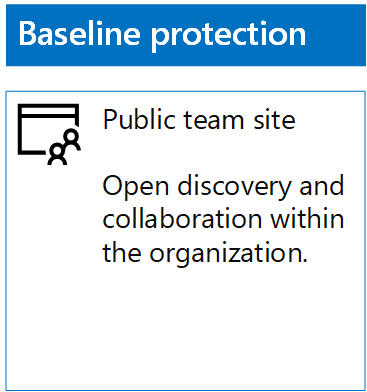
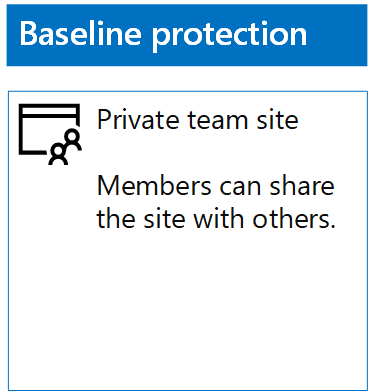
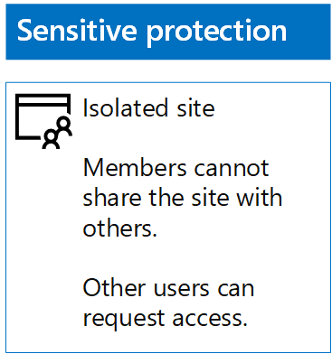
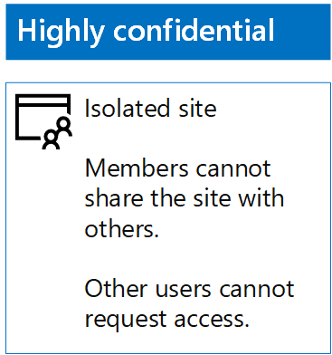

# Implemente sitios de SharePoint Online para tres niveles de protección

 **Resumen:** Crear y configurar sitios de equipo de SharePoint Online para varios niveles de protección de la información.
  
Utilice los pasos de este artículo para diseñar e implementar la línea de base, sensibles y altamente confidenciales SharePoint Online sitios de equipo. Para obtener más información acerca de estos tres niveles de protección, vea [archivos y sitios de SharePoint Online seguro](secure-sharepoint-online-sites-and-files.md).
  
## Sitios de equipo de SharePoint Online de línea de base

Protección básica incluye ambos sitios de equipo público y privado. Sitios de equipo público pueden ser detectados y acceso a alguien de la organización. Sitios privados sólo pueden ser detectados y tener acceso a los miembros del grupo Office 365 asociado con el sitio del equipo. Ambos tipos de sitios de grupo permiten miembros compartir el sitio con otras personas.
  
### Público

Para crear un sitio de grupo de SharePoint Online de línea de base con acceso público y los permisos, siga este procedimiento:
  
1. Iniciar sesión en el portal de Office 365 con una cuenta que se utilizará para administrar el sitio de grupo de SharePoint Online (un administrador de SharePoint Online). Para obtener ayuda, visite [dónde puede iniciar sesión en Office 365](https://support.office.com/Article/Where-to-sign-in-to-Office-365-e9eb7d51-5430-4929-91ab-6157c5a050b4).
    
2. En la lista de fichas, haga clic en **SharePoint**.
    
3. En la ficha nuevo de **SharePoint** en el explorador, haga clic en **Crear sitio +**.
    
4. En la página **crear un sitio Web** , haga clic en **sitio de equipo**.
    
5. En **nombre del sitio**, escriba un nombre para el sitio del grupo público. 
    
6. En la **Descripción del sitio de equipo**, escriba una descripción del propósito del sitio.
    
7. En **la configuración de privacidad**, seleccione **pública - cualquier persona de la organización puede tener acceso a este sitio**y, a continuación, haga clic en **siguiente**.
    
8. En el **que desea agregar?** panel, haga clic en **Finalizar**.
    
Esta es la configuración resultante.
  

  
### Privada

Para crear un sitio de grupo de SharePoint Online de línea de base con permisos y acceso privado, haga lo siguiente:
  
1. Iniciar sesión en el portal de Office 365 con una cuenta que se utilizará para administrar el sitio de grupo de SharePoint Online (un administrador de SharePoint Online). Para obtener ayuda, visite [dónde puede iniciar sesión en Office 365](https://support.office.com/Article/Where-to-sign-in-to-Office-365-e9eb7d51-5430-4929-91ab-6157c5a050b4).
    
2. En la lista de fichas, haga clic en **SharePoint**.
    
3. En la ficha nuevo de **SharePoint** en el explorador, haga clic en **Crear sitio +**.
    
4. En la página **crear un sitio Web** , haga clic en **sitio de equipo**.
    
5. En **nombre del sitio**, escriba un nombre para el sitio de equipo privado. 
    
6. En la **Descripción del sitio de equipo,** escriba una descripción del propósito del sitio.
    
7. En **la configuración de privacidad**, seleccione **Private: sólo los miembros pueden tener acceso a este sitio**y, a continuación, haga clic en **siguiente**.
    
8. En el **que desea agregar?** panel, en **Agregar integrantes**, escriba los nombres de cuentas de usuario que tienen acceso a este sitio de equipo privado.
    
9. Cuando haya terminado agregando el conjunto inicial de miembros al sitio, haga clic en **Finalizar**
    
Esta es la configuración resultante.
  

  
## Sitios de equipo de SharePoint Online confidenciales

Un sitio de grupo SharePoint Online confidencial es un sitio de grupo aislado, lo que significa que los permisos se controlan mediante la pertenencia a grupos de SharePoint en lugar de pertenecer al grupo de Office 365 asociado con el sitio del equipo.
  
Para crear un sitio de grupo aislado, hay dos pasos principales.
  
### Paso 1: Diseñe su sitio aislado

Para diseñar el sitio del grupo aislado, debe determinar:
  
- Los grupos de SharePoint y los niveles de permiso.
    
- El conjunto de grupos de acceso que serán miembros de los grupos de SharePoint.
    
     El conjunto de grupos de acceso recomendado es uno de los integrantes del sitio, uno para los visitantes y uno para los administradores del sitio.
    
- Si se utilizar grupos anidados dentro de los grupos de acceso.
    
Por ejemplo, los niveles de permisos y la estructura de grupo recomendado tiene este aspecto:
  
|**Grupo de SharePoint**|**Nivel de permisos**|**Grupo de acceso (ejemplos)**|
|:-----|:-----|:-----|
|[nombre del sitio] Miembros de    |Editar    |[nombre del sitio] Miembros de    |
|[nombre del sitio] Visitantes    |Lectura    |[nombre del sitio] Visores    |
|[nombre del sitio] Propietarios    |Control total    |[nombre del sitio] Administradores    |
   
Los niveles de permisos y grupos de SharePoint se crean de forma predeterminada para un sitio de equipo. Debe determinar los nombres de los grupos de acceso.
  
Para los detalles del proceso de diseño, consulte [Diseño de un sitio de grupo SharePoint Online aislado](design-an-isolated-sharepoint-online-team-site.md).
  
### Paso 2: Implemente su sitio aislado

Para implementar el sitio aislado, primero debe:
  
- Determinar las cuentas de usuario y grupos para agregar a cada uno de los grupos de acceso.
    
- Cree los grupos de acceso y agregar a los miembros de grupo y usuario.
    
Para ver los pasos detallados, consulte la **fase 1** de [implementar un sitio de grupo SharePoint Online aislado](deploy-an-isolated-sharepoint-online-team-site.md).
  
A continuación, crear el sitio de grupo SharePoint Online con estos pasos.
  
1. Iniciar sesión en el portal de Office 365 con una cuenta que se utilizará para administrar el sitio de grupo de SharePoint Online (un administrador de SharePoint Online). Para obtener ayuda, visite [dónde puede iniciar sesión en Office 365](https://support.office.com/Article/Where-to-sign-in-to-Office-365-e9eb7d51-5430-4929-91ab-6157c5a050b4).
    
2. En la lista de fichas, haga clic en **SharePoint**.
    
3. En la nueva ficha de **SharePoint** del explorador, haga clic en **Crear sitio +**.
    
4. En la página **crear un sitio Web** , haga clic en **sitio de equipo**.
    
5. En **nombre del sitio**, escriba un nombre para el sitio de equipo privado.
    
6. En la **Descripción del sitio de equipo**, escriba una descripción opcional.
    
7. En **la configuración de privacidad**, seleccione **Private: sólo los miembros pueden tener acceso a este sitio**y, a continuación, haga clic en **siguiente**.
    
8. En el **que desea agregar?** panel, haga clic en **Finalizar**.
    
A continuación, desde el nuevo sitio de grupo de SharePoint Online, configurar permisos con estos pasos.
  
1. Determinar el nombre Principal de usuario (UPN) del Administrador de TI o de otra persona que será responsable de responder a y direccionamiento de las solicitudes de acceso al sitio (belindan@contoso.com es un ejemplo de un UPN). Escriba aquí ese UPN: ___.
    
2. En la barra de herramientas, haga clic en el icono de configuración y, a continuación, haga clic en **permisos del sitio**.
    
3. En el panel **permisos de sitio** , haga clic en **configuración de permisos avanzados**.
    
4. En la nueva ficha de **permisos** del explorador, haga clic en **Configuración de solicitud de acceso**.
    
5. En el cuadro de diálogo **Configuración de las solicitudes de acceso** :
    
  - Desactive las casillas de verificación **Permitir miembros para compartir el sitio y archivos y carpetas individuales** y **miembros de permitir invitar a otras personas al grupo de miembros del sitio** .
    
  - Escriba el UPN de su administrador de TI desde el paso 1 en **Enviar todas las solicitudes de acceso**.
    
  - Haga clic en **Aceptar**.
    
6. En la ficha **permisos** del explorador, haga clic en **miembros de [nombre del sitio]** en la lista.
    
7. En **personas y grupos**, haga clic en **nuevo**.
    
8. En el cuadro de diálogo **Compartir** , escriba el nombre de su grupo de acceso de miembros de sitios para este sitio, selecciónelo y, a continuación, haga clic en **Compartir**.
    
9. Haga clic en el botón Atrás del explorador.
    
10. En la lista, haga clic en **[nombre del sitio] propietarios** .
    
11. En **personas y grupos**, haga clic en **nuevo**.
    
12. En el cuadro de diálogo **Compartir** , escriba el nombre del grupo de acceso de los administradores de sitio para este sitio, selecciónelo y, a continuación, haga clic en **Compartir**.
    
13. Haga clic en el botón Atrás del explorador.
    
14. En la lista, haga clic en **[nombre del sitio] a los visitantes** .
    
15. En **personas y grupos**, haga clic en **nuevo**.
    
16. En el cuadro de diálogo **Compartir** , escriba el nombre del grupo de acceso de los visores de sitio para este sitio, selecciónelo y, a continuación, haga clic en **Compartir**.
    
17. Cierre la ficha de **permisos** de tu navegador.
    
Los resultados de estos valores de permisos son:
  
- El grupo de SharePoint **propietarios de [nombre del sitio]** contiene el grupo de acceso de los administradores de sitio, en que todos los miembros tienen el nivel de permiso **control total** .
    
- El grupo de SharePoint **miembros de [nombre del sitio]** contiene el grupo de acceso de los miembros de sitio en el que todos los miembros tienen el nivel de permisos **Editar** .
    
- El grupo de SharePoint **visitantes de [nombre del sitio]** contiene el grupo de acceso de visores de sitio en el que todos los miembros tienen el nivel de permiso de **lectura** .
    
- Se deshabilita la capacidad de los miembros invitar a otros miembros.
    
- Se habilita la capacidad de los miembros solicitar acceso.
    
Esta es la configuración resultante.
  

  
Los miembros del sitio, a través de la pertenencia a grupos en uno de los grupos de acceso ahora pueden colaborar de forma segura en los recursos del sitio.
  
## Sitios de equipo de SharePoint Online altamente confidenciales

Un sitio de grupo SharePoint Online altamente confidencial es un sitio de grupo aislado, lo que significa que los permisos se controlan mediante la pertenencia a grupos de SharePoint en lugar de pertenecer al grupo de Office 365 asociado con el sitio del equipo.
  
Para crear un sitio de grupo aislado para información confidencial y la colaboración, hay dos pasos principales.
  
### Paso 1: Diseñe su sitio aislado

Para diseñar el sitio del grupo aislado, debe determinar:
  
- Los grupos de SharePoint y los niveles de permiso.
    
- El conjunto de grupos de acceso que serán miembros de los grupos de SharePoint.
    
     El conjunto de grupos de acceso recomendado es uno de los integrantes del sitio, uno para los visitantes y uno para los administradores del sitio.
    
- Si se utilizar grupos anidados dentro de los grupos de acceso.
    
Por ejemplo, los niveles de permisos y la estructura de grupo recomendado tiene este aspecto:
  
|**Grupo de SharePoint**|**Nivel de permisos**|**Grupo de acceso (ejemplos)**|
|:-----|:-----|:-----|
|[nombre del sitio] Miembros de    |Editar    |[nombre del sitio] Miembros de    |
|[nombre del sitio] Visitantes    |Lectura    |[nombre del sitio] Visores    |
|[nombre del sitio] Propietarios    |Control total    |[nombre del sitio] Administradores    |
   
Los niveles de permisos y grupos de SharePoint se crean de forma predeterminada para un sitio de equipo. Debe determinar los nombres de los grupos de acceso.
  
Para los detalles del proceso de diseño, consulte [Diseño de un sitio de grupo SharePoint Online aislado](design-an-isolated-sharepoint-online-team-site.md).
  
### Paso 2: Implemente su sitio aislado

Para implementar el sitio aislado, primero debe:
  
- Determinar a los miembros de grupo y usuario de cada uno de los grupos de acceso
    
- Crear los grupos de acceso y agregar a los miembros del grupo y de usuario
    
- Crear un sitio de grupo aislado que usa los grupos de acceso
    
Para ver los pasos detallados, vea [implementar un sitio de grupo SharePoint Online aislado](deploy-an-isolated-sharepoint-online-team-site.md).
  
Los resultados de la configuración de permisos son:
  
- El grupo de SharePoint **propietarios de [nombre del sitio]** contiene el grupo de acceso de los administradores de sitio, en que todos los miembros tienen el nivel de permiso **control total** .
    
- El grupo de SharePoint **miembros de [nombre del sitio]** contiene el grupo de acceso de los miembros de sitio en el que todos los miembros tienen el nivel de permisos **Editar** .
    
- El grupo de SharePoint **visitantes de [nombre del sitio]** contiene el grupo de acceso de visores de sitio en el que todos los miembros tienen el nivel de permiso de **lectura** .
    
- Se deshabilita la capacidad de los miembros invitar a otros miembros.
    
- Se deshabilita la capacidad de los miembros solicitar acceso.
    
Esta es la configuración resultante.
  

  
Los miembros del sitio, a través de la pertenencia a grupos en uno de los grupos de acceso ahora pueden colaborar de forma segura en los recursos del sitio.
  
## Paso siguiente

[Proteger archivos de SharePoint Online con etiquetas de Office 365 y DLP](protect-sharepoint-online-files-with-office-365-labels-and-dlp.md)
    
## Consulte también

[Proteger los archivos y los sitios de SharePoint Online](secure-sharepoint-online-sites-and-files.md)
  
[Sitios de SharePoint Online seguros en un entorno de pruebas y desarrollo](secure-sharepoint-online-sites-in-a-dev-test-environment.md)
  
[Guía de seguridad de Microsoft para campañas políticas, las ONG y otras organizaciones de Agile](microsoft-security-guidance-for-political-campaigns-nonprofits-and-other-agile-o.md)
  
[Adopción de la nube y soluciones híbridas](cloud-adoption-and-hybrid-solutions.md)

