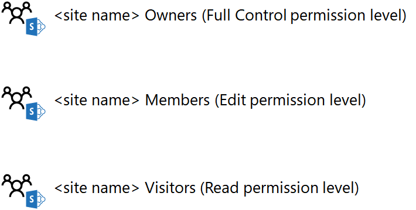
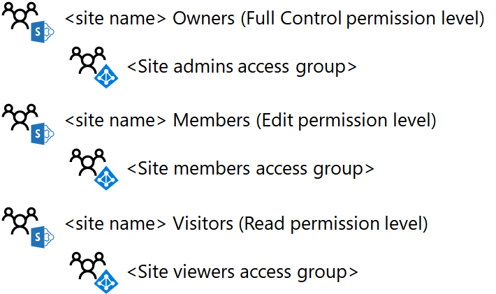
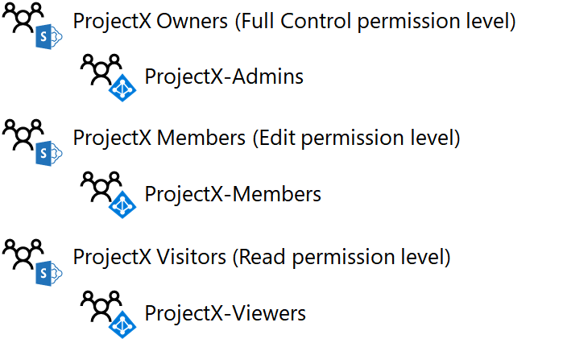
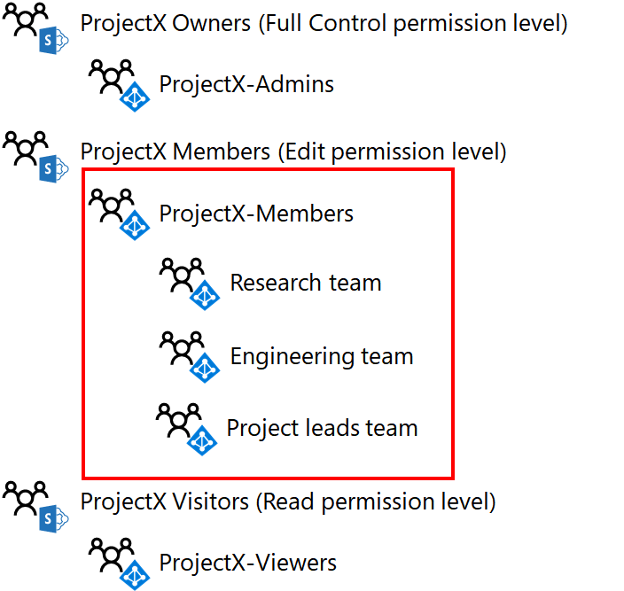

# Diseñar un sitio de grupo SharePoint Online aislado

 **Resumen:** Paso a través del proceso de diseño de sitios de grupo de SharePoint Online aislados.
  
Este artículo le guiará por las decisiones de diseño clave que debe hacer antes de crear un sitio de grupo SharePoint Online aislado.
  
## Fase 1: Determinar los grupos de SharePoint y los niveles de permisos

Cada sitio de grupo SharePoint Online de forma predeterminada se crea con los siguientes grupos de SharePoint:
  
- \<nombre del sitio > miembros
    
- \<nombre del sitio > visitantes
    
- \<nombre del sitio > propietarios
    
Estos grupos están separados de los grupos de Office 365 y Azure de Active Directory (AD) y son la base para asignar permisos para los recursos del sitio.
  
El conjunto de permisos específicos que determina lo que puede hacer un miembro de un grupo de SharePoint en un sitio es un nivel de permisos. Existen tres niveles de permiso de forma predeterminada para un sitio de grupo SharePoint Online: control total, leer y editar. La siguiente tabla muestra la correlación predeterminado de grupos de SharePoint y los niveles de permisos:
  
|**Grupo de SharePoint**|**Nivel de permisos**|
|:-----|:-----|
|\<nombre del sitio > miembros    |Editar    |
|\<nombre del sitio > visitantes    |Lectura    |
|\<nombre del sitio > propietarios    |Control total    |
   
 **Prácticas recomendadas:** Puede crear grupos de SharePoint adicionales y niveles de permisos. Sin embargo, se recomienda utilizar los niveles de permisos y grupos de SharePoint predeterminados para el sitio de SharePoint Online aislado.
  
Aquí están los niveles de permisos y grupos de SharePoint predeterminados.
  

  
## Fase 2: Asignar permisos a los usuarios con los grupos de acceso

Puede asignar permisos a usuarios agregando su cuenta de usuario o un grupo del que la cuenta de usuario es un miembro, a los grupos de SharePoint de Office 365 o AD Azure. Una vez agregado, las cuentas de usuario de Office 365, ya sea directamente o indirectamente a través de la pertenencia a un grupo de Office 365 o AD Azure, se asigna el nivel de permisos asociado al grupo de SharePoint.
  
Con los grupos de SharePoint predeterminados como ejemplo:
  
- Los miembros de la ** \<nombre del sitio > miembros** grupo de SharePoint, que puede incluir cuentas de usuario y grupos, se asigna el nivel de permisos **Editar**
    
- Los miembros de la ** \<nombre del sitio > visitantes** grupo de SharePoint, que puede incluir cuentas de usuario y grupos, se asigna el nivel de permiso de **lectura**
    
- Los miembros de la ** \<nombre del sitio > propietarios** grupo de SharePoint, que puede incluir cuentas de usuario y grupos, se asignan al nivel de permiso **control total**
    
 **Prácticas recomendadas:** Aunque puede administrar permisos mediante cuentas de usuario individuales, se recomienda utilizar un solo grupo de AD de Azure, conocido como un grupo de acceso, en su lugar. Esto simplifica la administración de permisos a través de la pertenencia al grupo de acceso, en lugar de administrar la lista de los usuarios de cuentas para cada grupo de SharePoint.
  
Azure grupos de AD para Office 365 son diferentes de los grupos de Office 365. Azure grupos AD aparezcan en el centro de administración de Office con su conjunto de **tipo de** **seguridad** y no tienen una dirección de correo electrónico. Los grupos de AD Azure se pueden gestionar:
  
- Windows Server Active Directory (AD)
    
    Se trata de grupos que se han creado en su infraestructura de AD del servidor de Windows local y sincronizados con la suscripción de Office 365. En el centro de administración de Office, estos grupos tienen un **estado** de **Synched con active directory**.
    
- Office 365
    
    Se trata de grupos que se han creado mediante el centro de administración de Office, el portal de Azure o Microsoft PowerShell. En el centro de administración de Office, estos grupos tienen un **estado** de **la nube**.
    
 **Prácticas recomendadas:** Si está utilizando Windows Server AD local y sincronizar con la suscripción de Office 365, realizar el usuario y administración de grupo con Windows Server AD.
  
Para los sitios de equipo de SharePoint Online aislados, la estructura de grupo recomendado tiene el siguiente aspecto:
  
|**Grupo de SharePoint**|**Grupo de acceso basado en AD de Azure**|**Nivel de permisos**|
|:-----|:-----|:-----|
|\<nombre del sitio > miembros    |\<nombre del sitio > miembros    |Editar    |
|\<nombre del sitio > visitantes    |\<nombre del sitio > visores    |Lectura    |
|\<nombre del sitio > propietarios    |\<nombre del sitio > administradores    |Control total    |
   
 **Prácticas recomendadas:** Aunque puede utilizar Office 365 o AD Azure grupos como miembros de grupos de SharePoint, se recomienda utilizar grupos de AD de Azure. Azure grupos AD, administrados a través de AD del servidor de Windows o de Office 365, proporcionan más flexibilidad para utilizar grupos anidados para asignar permisos.
  
Aquí es el valor predeterminado configurados para usar grupos de Azure AD-acceso de grupos de SharePoint.
  

  
Al diseñar los grupos de acceso de tres, tenga en cuenta lo siguiente:
  
- Debería haber sólo unos pocos miembros de la ** \<nombre del sitio > administradores de** grupo de acceso, correspondiente a un número pequeño de administradores de SharePoint Online que están administrando el sitio del equipo.
    
- La mayoría de los miembros del sitio está en la ** \<nombre del sitio > miembros** o ** \<nombre del sitio > visores** acceder a grupos. Porque sitio los miembros de la ** \<nombre del sitio > miembros** grupo de acceso tienen la capacidad de eliminar o modificar los recursos en el sitio, considere detenidamente su pertenencia al grupo. En caso de duda, agregar el miembro del sitio para la ** \<nombre del sitio > visores** grupo de acceso.
    
Aquí es un ejemplo de los grupos de SharePoint y los grupos de acceso de un sitio aislado denominado ProjectX.
  

  
## Fase 3: Uso anidar grupos AD Azure

Para un proyecto que se limita a un número reducido de personas, un único nivel de grupos de acceso AD Azure agregado a los grupos de SharePoint del sitio cabrá la mayoría de los escenarios. Sin embargo, si tiene un gran número de personas y a aquellas personas ya miembros de establecidos los grupos AD Azure, más fácilmente puede asignar permisos de SharePoint usando grupos anidados o grupos que contengan otros grupos como miembros.
  
Por ejemplo, desea crear un sitio de equipo online aislado de SharePoint para la colaboración entre los ejecutivos de ventas, marketing, ingeniería, legal y compatibilidad departamentos y esos ya en sus propios grupos con la cuenta de usuario ejecutivo miembro del grupo. En lugar de crear un nuevo grupo para los nuevos miembros del sitio y colocar las cuentas de usuario individuales de ejecutivo, poner los grupos existentes de ejecutivos para cada departamento en el nuevo grupo.
  
 Si comparte una suscripción a Office 365 entre varias organizaciones, un solo nivel de pertenencia al grupo de un sitio aislado para una organización podría ser difícil de administrar debido al gran número de cuentas de usuario. En este caso, puede utilizar grupos AD Azure para cada organización que contienen los grupos dentro de sus organizaciones para administrar los permisos anidados.
  
Para utilizar los grupos de AD Azure anidados:
  
1. Identifique o cree los grupos de AD de Azure que contendrá las cuentas de usuario y agregue las cuentas de usuario apropiadas como miembros.
    
2. Crear el grupo de acceso AD Azure de contenedor que contendrá el resto de los grupos de AD de Azure y agregue como miembros los grupos.
    
3.  Para el nivel de acceso para el grupo de acceso de contenedor adecuado, identifique el grupo de SharePoint y el nivel de permiso correspondiente.
    
> [!NOTE]
> No puede utilizar los grupos anidados de Office 365. 
  
Aquí es un ejemplo de anuncio de Azure anidado grupos para el grupo de acceso de miembro de ProjectX.
  

  
Porque todas las cuentas de usuario en la investigación, la ingeniería y el proyecto conduce equipos pretenden ser integrantes del sitio, es más fácil agregar sus grupos AD Azure al grupo de acceso de los miembros de ProjectX.
  
## Paso siguiente

Cuando esté listo para crear y configurar un sitio aislado en producción, vea [implementar un sitio de grupo SharePoint Online aislado](deploy-an-isolated-sharepoint-online-team-site.md).
  
## Consulte también

[Sitios de equipo de SharePoint Online aislados](isolated-sharepoint-online-team-sites.md)
  
[Administrar un sitio de grupo SharePoint Online aislado](manage-an-isolated-sharepoint-online-team-site.md)
  
[Soluciones de seguridad](security-solutions.md)

[Implementar un sitio de grupo SharePoint Online aislado](deploy-an-isolated-sharepoint-online-team-site.md)

