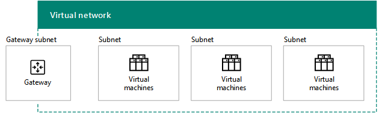
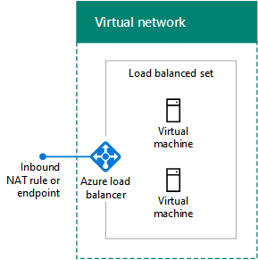
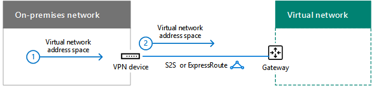
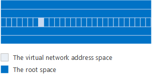

# Diseño de redes para IaaS de Microsoft AzureDesigning networking for Microsoft Azure IaaS

 **Resumen:** Entender cómo diseñar redes optimizadas para cargas de trabajo en Microsoft Azure IaaS.**Summary:** Understand how to design optimized networking for workloads in Microsoft Azure IaaS.
  
La optimización de las redes para las cargas de trabajo de TI hospedadas en IaaS de Azure requiere un conocimiento de las redes virtuales (VNets) de Azure, los espacios de direcciones, el enrutamiento, el DNS y el equilibrio de carga.Optimizing networking for IT workloads hosted in Azure IaaS requires an understanding of Azure virtual networks (VNets), address spaces, routing, DNS, and load balancing.
  
## Pasos de planeación para cualquier red virtualPlanning steps for any VNet

Siga estos pasos para cualquier tipo de red virtual.Follow these steps for any type of VNet.
  
### Paso 1: Preparar la intranet para los servicios en la nube de Microsoft.Step 1: Prepare your intranet for Microsoft cloud services.

Vea la sección **Pasos para preparar la red para Servicios en la nube de Microsoft** en [Elementos comunes de conectividad de Microsoft Cloud](common-elements-of-microsoft-cloud-connectivity.md).Go through the **Steps to prepare your network for Microsoft cloud services** section in [Common elements of Microsoft cloud connectivity](common-elements-of-microsoft-cloud-connectivity.md).
  
### Paso 2: Optimizar el ancho de banda de Internet.Step 2: Optimize your Internet bandwidth.

Para optimizar el ancho de banda de Internet, siga los pasos 2 a 4 de la sección **Pasos para preparar la red para los servicios SaaS de Microsoft** del artículo [Diseño de redes para SaaS de Microsoft](designing-networking-for-microsoft-saas.md).Optimize your Internet bandwidth using steps 2 - 4 of the **Steps to prepare your network for Microsoft SaaS services** section in [Designing networking for Microsoft SaaS](designing-networking-for-microsoft-saas.md).
  
### Paso 3: Determinar el tipo de red virtual (solo nube o entre locales).Step 3: Determine the type of VNet (cloud-only or cross-premises).

Una red virtual de solo nube no tiene conexión a una red local. Aquí le mostramos un ejemplo.A cloud-only VNet has no connection to an on-premises network. Here is an example.
  
**Figura 1: Una nube de sólo VNet****Figure 1: A cloud-only VNet**

  
La figura 1 muestra un conjunto de máquinas virtuales en una red virtual de solo nube.Figure 1 shows a set of virtual machines in a cloud-only VNet.
  
Una red virtual entre locales tiene una conexión VPN de sitio a sitio (S2S) o de ExpressRoute a una red local a través de una puerta de enlace de Azure. Aquí le mostramos un ejemplo.A cross-premises VNet has a site-to-site (S2S) VPN or ExpressRoute connection to an on-premises network through an Azure gateway. Here is an example.
  
**Figura 2: Un local entre VNet****Figure 2: A cross-premises VNet**

  
La figura 2 muestra un conjunto de máquinas virtuales en una red virtual entre locales, que está conectada a una red local.Figure 2 shows a set of virtual machines in a cross-premises VNet, which is connected to an on-premises network.
  
Consulte la sección de [pasos de planificación para un VNet local entre](designing-networking-for-microsoft-azure-iaas.md#cross_prem) en este artículo.See the additional [Planning steps for a cross-premises VNet](designing-networking-for-microsoft-azure-iaas.md#cross_prem) section in this article.
  
### Paso 4: Determinar el espacio de direcciones de la red virtual.Step 4: Determine the address space of the VNet.

La tabla 1 muestra los espacios de direcciones para los distintos tipos de redes virtuales.Table 1 shows the address spaces for the different types of VNets.
  
|**Tipo de VNet****Type of VNet**|**Espacio de direcciones de red virtual****Virtual network address space**|
|:-----|:-----|
|Basada solo en la nubeCloud-only    |Espacio de direcciones privadas arbitrariasArbitrary private address space    |
|Basada solo en la nube e interconectadaInterconnected cloud-only    |Privado arbitrario, pero no se superponen con otros conectados VNetsArbitrary private, but not overlapping with other connected VNets    |
|Entre localesCross-premises    |Privada, pero sin que se superponga con redes localesPrivate, but not overlapping with on-premises    |
|Local e interconectadaInterconnected cross-premises    |Privada, pero sin que se superponga con otras redes locales y virtuales conectadasPrivate, but not overlapping with on-premises and other connected VNets    |
   
 **Tabla 1: Tipos de VNets y su correspondiente espacio de dirección****Table 1: Types of VNets and their corresponding address space**
  
El DHCP asigna a las máquinas virtuales una configuración de direcciones desde el espacio de direcciones de la subred:Virtual machines are assigned an address configuration from the address space of the subnet by DHCP:
  
- Dirección/máscara de subredAddress/subnet mask
    
- Puerta de enlace predeterminadaDefault gateway
    
- Direcciones IP del servidor DNSDNS server IP addresses
    
También puede reservar una dirección IP estática.You can also reserve a static IP address.
  
A las máquinas virtuales también se les puede asignar una dirección IP pública, ya sea individualmente o desde el servicio en la nube que las contiene (solo para máquinas de implementación clásicas).Virtual machines can also be assigned a public IP address, either individually or from the containing cloud service (for classic deployment machines only).
  
### Paso 5: Determinar las subredes de la red virtual y los espacios de direcciones asignados a cada una.Step 5: Determine the subnets within the VNet and the address spaces assigned to each.

Hay dos tipos de subredes en una red virtual: una subred de puerta de enlace y una subred de hospedaje de máquina virtual.There are two types of subnets in a VNet, a gateway subnet and a virtual machine-hosting subnet.
  
**Figura 3: Los dos tipos de subredes de Azure****Figure 3: The two types of subnets in Azure**

  
La figura 3 muestra una red virtual que contiene una subred de puerta de enlace que, a su vez, contiene una puerta de enlace de Azure y un conjunto de subredes de hospedaje de máquina virtual que engloba las máquinas virtuales.Figure 3 shows a VNet containing a gateway subnet that contains an Azure gateway and a set of virtual machine-hosting subnets containing virtual machines.
  
Azure necesita la subred de puerta de enlace de Azure para hospedar las dos máquinas virtuales de su puerta de enlace de Azure. Especifique un espacio de direcciones que tenga una longitud de prefijo de, al menos, 29 bits (ejemplo: 192.168.15.248/29). Se recomienda una longitud de prefijo de 28 bits o menor, especialmente si va a usar ExpressRoute.The Azure gateway subnet is needed by Azure to host the two virtual machines of your Azure gateway. Specify an address space with at least a 29-bit prefix length (example: 192.168.15.248/29). A 28-bit or smaller prefix length is recommended, especially if you are planning to use ExpressRoute.
  
Una práctica recomendada para determinar el espacio de direcciones de la subred de puerta de enlace de Azure es la siguiente:A best practice for determining the address space of the Azure gateway subnet is the following:
  
1. Decida el tamaño de la subred de puerta de enlace.Decide on the size of the gateway subnet.
    
2. En los bits variables del espacio de direcciones de la red virtual, establezca los bits usados para la subred de puerta de enlace en 0 y los bits restantes en 1.In the variable bits in the address space of the VNet, set the bits used for the gateway subnet to 0 and set the remaining bits to 1.
    
3. Convierta a decimales y expréselo como un espacio de direcciones con la longitud de prefijo establecida en el tamaño de la subred de puerta de enlace.Convert to decimal and express as an address space with the prefix length set to the size of the gateway subnet.
    
Con este método, el espacio de direcciones de la subred de puerta de enlace siempre está en el extremo más alejado del espacio de direcciones de la red virtual.With this method, the address space for the gateway subnet is always at the farthest end of the VNet address space.
  
En este ejemplo, se define el prefijo de dirección que corresponde a la subred de puerta de enlace: el espacio de direcciones de la red virtual es 10.119.0.0/16. La organización usará inicialmente una conexión VPN de sitio a sitio, pero al final empleará ExpressRoute. La tabla 2 muestra los pasos y los resultados de determinar el prefijo de dirección de la subred de puerta de enlace en una notación de prefijos de red (también conocido como CIDR).Here is an example of defining the address prefix for the gateway subnet: The address space of the VNet is 10.119.0.0/16. The organization will initially use a site-to-site VPN connection, but will eventually get ExpressRoute. Table 2 shows the steps and results of determining the gateway subnet address prefix in network prefix notation (also known as CIDR).

A continuación presentamos los pasos y ejemplo de determinar el prefijo de la dirección de subred puerta de enlace:Here are the steps and example of determining the gateway subnet address prefix:

1. Decidir el tamaño de la subred de puerta de enlace. En nuestro ejemplo, elegimos /28.Decide on the size of the gateway subnet. For our example, we chose /28.
2. Establecer los bits de la parte variable del espacio de direcciones VNet (b) a 0 para la puerta de enlace de bits de subred (G), 1 en caso contrario (V). En nuestro ejemplo, estamos utilizando el espacio de direcciones de 10.119.0.0/16 para el VNet.Set the bits in the variable portion of the VNet address space (b) to 0 for the gateway subnet bits (G), otherwise 1 (V). For our example, we are using the 10.119.0.0/16 address space for the VNet.  
 10.119. bbbbbbbb. bbbbbbbb10.119. bbbbbbbb . bbbbbbbb  10.119. VVVVVVVV. VVVVGGGG10.119. VVVVVVVV . VVVVGGGG  10.119. 11111111. 1111000010.119. 11111111 . 11110000   
3. Convertir el resultado del paso 2 en decimal y se expresa como un espacio de direcciones. En nuestro ejemplo, 10.119. 11111111. 11110000 es 10.119.255.240, y con la longitud del prefijo del paso 1, (28 en nuestro ejemplo), el prefijo de dirección de subred puerta de enlace resultante es 10.119.255.240/28.Convert the result from step 2 to decimal and express as an address space. For our example, 10.119. 11111111 . 11110000 is 10.119.255.240, and with the prefix length from step 1, (28 in our example), the resulting gateway subnet address prefix is 10.119.255.240/28.
  
Para obtener más información, vea [Calculadora de espacio de direcciones para las subredes de la puerta de enlace de Azure](https://gallery.technet.microsoft.com/scriptcenter/Address-prefix-calculator-a94b6eed) .See [Address space calculator for Azure gateway subnets](https://gallery.technet.microsoft.com/scriptcenter/Address-prefix-calculator-a94b6eed) for more information.
  
En las subredes de hospedaje de máquina virtual es donde se colocan las máquinas virtuales de Azure, lo cual se puede hacer siguiendo las instrucciones locales típicas, como un rol común o el nivel de una aplicación o para el aislamiento de la subred.Virtual machine-hosting subnets are where you place Azure virtual machines, which you can do according to typical on-premises guidelines, such as a common role or tier of an application or for subnet isolation.
  
Azure utiliza las primeros 3 direcciones en cada subred. Por lo tanto, el número de posibles direcciones de una subred Azure es 2n -5, donde n es el número de bits de host. La tabla 3 se muestra la gama de máquinas virtuales que necesite, con el número de hosts bits necesarios y el tamaño de la subred correspondiente.Azure uses the first 3 addresses on each subnet. Therefore, the number of possible addresses on an Azure subnet is 2n - 5, where n is the number of host bits. Table 3 shows the range of virtual machines required, the number of hosts bits needed, and the corresponding subnet size.
  
|**Máquinas virtuales que necesite****Virtual machines required**|**Bits de host****Host bits**|**Tamaño de la subred****Subnet size**|
|:-----|:-----|:-----|
|1-31-3    |33    |/29/29    |
|4-114-11    |44    |/28/28    |
|12-2712-27    |55    |/27/27    |
|28-5928-59    |66    |/26/26    |
|60-12360-123    |77    |/25/25    |
   
 **Tabla 3: requisitos de la máquina Virtual y sus tamaños de subred****Table 3: Virtual machine requirements and their subnet sizes**
  
Para obtener más información acerca de la cantidad máxima de máquinas virtuales en una subred o VNet, consulte [Límites de redes](https://docs.microsoft.com/azure/azure-subscription-service-limits#networking-limits).For more information about the maximum amount of virtual machines on a subnet or VNet, see [Networking Limits](https://docs.microsoft.com/azure/azure-subscription-service-limits#networking-limits).
  
Para obtener más información, consulte [Plan y diseño de redes virtuales de Azure](https://azure.microsoft.com/documentation/articles/virtual-network-vnet-plan-design-arm/).For more information, see [Plan and design Azure Virtual Networks](https://azure.microsoft.com/documentation/articles/virtual-network-vnet-plan-design-arm/).
  
### Paso 6: Determinar la configuración del servidor DNS y las direcciones de los servidores DNS para asignar a las máquinas virtuales en la red virtual.Step 6: Determine the DNS server configuration and the addresses of the DNS servers to assign to VMs in the VNet.

Azure asigna a las máquinas virtuales las direcciones de los servidores DNS mediante DHCP. Los servidores DNS pueden suministrarlos:Azure assigns virtual machines the addresses of DNS servers by DHCP. DNS servers can be:
  
- Azure: se proporciona un registro de nombres locales y una resolución de nombres de InternetSupplied by Azure: Provides local name registration and local and Internet name resolution
    
- Usted: se proporciona un registro de nombres locales o de intranet y una resolución de nombres de Internet o de intranetProvided by you: Provides local or intranet name registration and either intranet or Internet name resolution
    
En la tabla 4, se muestran las diferentes configuraciones de los servidores DNS para cada tipo de red virtual.Table 4 shows the different configurations of DNS servers for each type of VNet.
    
|**Tipo de VNet****Type of VNet**|**Servidor DNS****DNS server**|
|:-----|:-----|
|Basada solo en la nubeCloud-only    |Suministrado por Azure para la resolución de nombres de Internet y localesAzure-supplied for local and Internet name resolution    Máquina virtual de Azure para la resolución de nombres de Internet y locales (reenvío DNS)Azure virtual machine for local and Internet name resolution (DNS forwarding)    |
|Entre localesCross-premises    |Local para la resolución de nombres locales y de intranetOn-premises for local and intranet name resolution    Máquina virtual de Azure para la resolución de nombres de Internet y locales (replicación y reenvío DNS)Azure virtual machine for local and intranet name resolution (DNS replication and forwarding)    |
   
 **Tabla 4: Opciones de servidor DNS para los dos tipos diferentes de VNets****Table 4: DNS server options for the two different types of VNets**
  
Para obtener más información, vea [Resolución de nombres para las máquinas virtuales y las instancias de la función](https://docs.microsoft.com/azure/virtual-network/virtual-networks-name-resolution-for-vms-and-role-instances).For more information, see [Name Resolution for VMs and Role Instances](https://docs.microsoft.com/azure/virtual-network/virtual-networks-name-resolution-for-vms-and-role-instances).
  
### Paso 7: Determinar la configuración de equilibrio de carga (accesible desde Internet o interna).Step 7: Determine the load balancing configuration (Internet-facing or internal).

En algunos casos, queremos distribuir el tráfico entrante a un conjunto de servidores que tienen el mismo rol. IaaS de Azure dispone de una instalación integrada para hacer esto con cargas de tráfico accesibles desde Internet e internas.In some cases, you want to distribute incoming traffic to a set of servers that have the same role. Azure IaaS has a built-in facility to do this for Internet-facing and internal traffic loads.
  
El equilibrio de carga de Azure accesible desde Internet distribuye aleatoriamente el tráfico entrante no solicitado de Internet a los miembros de un conjunto de carga equilibrada. Azure Internet-facing load balancing randomly distributes unsolicited incoming traffic from the Internet to the members of a load-balanced set.
  
**Figura 4: Un equilibrador de carga externo en Azure****Figure 4: An external load balancer in Azure**

  
La figura 4 muestra un equilibrador de carga externo en Azure y que distribuye el tráfico entrante en una regla de NAT de entrada o extremo a un conjunto de máquinas virtuales en un conjunto de equilibrio de carga.Figure 4 shows an external load balancer in Azure that distributes incoming traffic on an inbound NAT rule or endpoint to a set of virtual machines in a load-balanced set.
  
El equilibrio de carga interno de Azure distribuye aleatoriamente el tráfico entrante no solicitado desde otras máquinas virtuales de Azure o desde equipos de la intranet a los miembros de un conjunto de equilibrio de carga. Azure internal load balancing randomly distributes unsolicited incoming traffic from other Azure VMs or from intranet computers to the members of a load-balanced set. 
  
**Figura 5: Un equilibrador de carga interno en Azure****Figure 5: An internal load balancer in Azure**

  
La figura 5 muestra un equilibrador de carga interno en Azure y que distribuye el tráfico entrante en una regla de NAT de entrada o extremo a un conjunto de máquinas virtuales en un conjunto de equilibrio de carga.Figure 5 shows an internal load balancer in Azure that distributes incoming traffic on an inbound NAT rule or endpoint to a set of virtual machines in a load-balanced set.
  
Para obtener más información, vea el [Equilibrador de carga de Azure](https://docs.microsoft.com/azure/load-balancer/load-balancer-overview).For more information, see [Azure Load Balancer](https://docs.microsoft.com/azure/load-balancer/load-balancer-overview).
  
### Paso 8: Determinar el uso de las aplicaciones virtuales y las rutas definidas por el usuario.Step 8: Determine the use of virtual appliances and user-defined routes.

Si tiene que reenviar el tráfico a aplicaciones virtuales de la red virtual, puede que deba agregar a una subred una o varias rutas que haya definido el usuario.If you need to forward traffic to virtual appliances in your VNet, you may need to add one or more user-defined routes to a subnet.
  
**Figura 6: Dispositivos virtuales y rutas definidas por el usuario en Azure****Figure 6: Virtual appliances and user-defined routes in Azure**

  
La figura 6 muestra una red virtual entre locales y una ruta definida por el usuario asignada a una subred de hospedaje de máquina virtual que apunta a una aplicación virtual.Figure 6 shows a cross-premises VNet and a user-defined route assigned to a virtual machine-hosting subnet that points to a virtual appliance.
  
Para obtener más información, vea [rutas de usuario definidos y el reenvío de IP](https://docs.microsoft.com/azure/virtual-network/virtual-networks-udr-overview).For more information, see [User Defined Routes and IP Forwarding](https://docs.microsoft.com/azure/virtual-network/virtual-networks-udr-overview).
  
### Paso 9: Determinar cómo se conectarán los equipos de Internet a las máquinas virtuales.Step 9: Determine how computers from the Internet will connect to virtual machines.

Hay varias maneras de proporcionar acceso a Internet a las máquinas virtuales de una red virtual, que incluye el acceso desde la red de la organización a través del servidor proxy u otro dispositivo perimetral.There are multiple ways to provide Internet access to the virtual machines on a VNet, which includes access from your organization network through your proxy server or other edge device.
  
La tabla 5 recoge los métodos para filtrar o inspeccionar el tráfico entrante no solicitado.Table 5 lists the methods for filtering or inspecting unsolicited incoming traffic.
  
|**Método****Method**|**Modelo de implementación****Deployment model**|
|:-----|:-----|
|1. Puntos de conexión y ACL configurados en los servicios en la nube1. Endpoints and ACLs configured on cloud services    |ClásicoClassic    |
|2. Grupos de seguridad de red2. Network security groups    |Administrador de recursos y clásicoResource Manager and classic    |
|3. Equilibrador de carga accesible desde Internet con reglas de NAT entrantes3. Internet-facing load balancer with inbound NAT rules    |Administrador de recursosResource Manager    |
|4. dispositivos de seguridad en el Azure de red4. Network security appliances in the Azure 
 Mercado (no se muestra)Marketplace (not shown)    |Administrador de recursos y clásicoResource Manager and classic    |
   
 **Tabla 5: Métodos de conectarse a máquinas virtuales y sus correspondientes modelos de implementación de Azure****Table 5: Methods of connecting to virtual machines and their corresponding Azure deployment models**
  
**Figura 7: Conexión a Azure máquinas virtuales a través de Internet****Figure 7: Connecting to Azure virtual machines over the Internet**

  
La figura 7 muestra un equipo conectado a Internet que se conecta a una máquina virtual en un servicio en la nube usando un punto de conexión, una máquina virtual de una subred que usa un grupo de seguridad de red y una máquina virtual de una subred que usa un equilibrador de carga externo y reglas de NAT entrantes.Figure 7 shows an Internet-connected computer connecting to a virtual machine in a cloud service using an endpoint, a virtual machine on a subnet using a network security group, and a virtual machine on a subnet using an external load balancer and inbound NAT rules.
  
La seguridad adicional la proporcionan:Additional security is provided by:
  
- Conexiones de Escritorio remoto y SSH, que se autentican y se cifran.Remote Desktop and SSH connections, which are authenticated and encrypted.
    
- Sesiones remotas de PowerShell, que se autentican y se cifran.Remote PowerShell sessions, which are authenticated and encrypted.
    
- Modo de transporte IPsec, que puede usar para el cifrado de extremo a extremo.IPsec transport mode, which you can use for end-to-end encryption.
    
- Protección DDoS de Azure, que ayuda a prevenir ataques internos y externosAzure DDOS protection, which helps prevent external and internal attacks
    
Para obtener más información, vea [Seguridad de nube de Microsoft para Enterprise Architects](https://aka.ms/cloudarchsecurity) y [Seguridad de la red de Azure](https://azure.microsoft.com/blog/azure-network-security/).For more information, see [Microsoft Cloud Security for Enterprise Architects](https://aka.ms/cloudarchsecurity) and [Azure Network Security](https://azure.microsoft.com/blog/azure-network-security/).
  
### Paso 10: Para varias redes virtuales, determinar la topología de conexión de una red virtual a otra.Step 10: For multiple VNets, determine the VNet-to-VNet connection topology.

Las redes virtuales pueden conectarse entre sí mediante topologías como las que se usan para conectar los sitios de una organización.VNets can be connected to each other using topologies similar to those used for connecting the sites of an organization.
  
Una configuración de encadenamiento conecta las redes virtuales de una serie.A daisy chain configuration connects the VNets in a series.
  
**Figura 8: Una margarita configuración para VNets****Figure 8: A daisy-chained configuration for VNets**

  
La figura 8 muestra cinco VNets conectados en serie con una configuración de margarita.Figure 8 shows five VNets connected in series using a daisy-chained configuration.
  
Una configuración de concentrador y radio conecta varias redes virtuales a un conjunto de redes virtuales centrales, que están conectadas entre sí.A spoke and hub configuration connects multiple VNets to a set of central VNets, which are themselves connected to each other.
  
**Figura 9: Un concentrador y radios configuración para VNets****Figure 9: A spoke and hub configuration for VNets**

  
La figura 9 muestra seis redes virtuales, dos redes virtuales son concentradores conectados entre sí y también otras dos son redes virtuales de radio.Figure 9 shows six VNets, two VNets are hubs that are connected to each other and also two other spoke VNets.
  
Una configuración de malla completa conecta las redes virtuales entre sí.A full mesh configuration connects every VNet to each other.
  
**Figura 10: Configuración de VNets de malla completa****Figure 10: A full mesh configuration for VNets**

  
La figura 10 muestra cuatro redes virtuales que están conectadas entre sí y que usan un total de seis conexiones de red virtual a red virtual.Figure 10 shows four VNets that are all connected to each other, using a total of six VNet-to-VNet connections.
  
## Pasos de planeación para una red virtual entre localesPlanning steps for a cross-premises VNet

Siga estos pasos para una red virtual entre locales.Follow these steps for a cross-premises VNet.
  
> [!TIP]
> Para crear un entorno de prueba/desarrollo local entre simulado, consulte [simulada entre local red virtual en Azure](simulated-cross-premises-virtual-network-in-azure.md).To create a simulated cross-premises dev/test environment, see [Simulated cross-premises virtual network in Azure](simulated-cross-premises-virtual-network-in-azure.md). 
  
### Paso 1: Determinar la conexión entre locales a la red virtual (VPN S2S o ExpressRoute).Step 1: Determine the cross-premises connection to the VNet (S2S VPN or ExpressRoute).

En la tabla 6 se recogen los distintos tipos de conexiones.Table 6 lists the different types of connections.
  
|**Tipo de conexión****Type of connection**|**Finalidad****Purpose**|
|:-----|:-----|
|VPN sitio a sitio (S2S)Site-to-Site (S2S) VPN    |Conectar sitios de 1 a 10 (incluidos otros VNets) a un VNet único.Connect 1-10 sites (including other VNets) to a single VNet.    |
|ExpressRouteExpressRoute    |Un vínculo seguro y privado a Azure a través de un proveedor de intercambio de Internet (IXP) o un proveedor de servicio de red (NSP).A private, secure link to Azure via an Internet Exchange Provider (IXP) or a Network Service Provider (NSP).    |
|VPN punto a sitio (P2S)Point-to-Site (P2S) VPN    |Conecta un solo equipo a una red virtual.Connects a single computer to a VNet.    |
|Dispositivos VPN para el emparejamiento de VNET o de red virtual a red virtual (V2V) VNet peering or VNet-to-VNet (V2V) VPN    |Conecta una red virtual a otra.Connects a VNet to another VNet.    |
   
 **Tabla 6: Los tipos de conexiones para entre local VNets****Table 6: The types of connections for cross-premises VNets**
  
Para obtener más información sobre el número máximo de conexiones, consulte [Límites de redes](https://docs.microsoft.com/azure/azure-subscription-service-limits#networking-limits).For more information on the maximum number of connections, see [Networking Limits](https://docs.microsoft.com/azure/azure-subscription-service-limits#networking-limits).
  
Para obtener más información acerca de los dispositivos VPN, consulte [dispositivos VPN para las conexiones de red virtual de sitio a sitio](https://docs.microsoft.com/azure/vpn-gateway/vpn-gateway-about-vpn-devices).For more information about VPN devices, see [VPN devices for site-to-site virtual network connections](https://docs.microsoft.com/azure/vpn-gateway/vpn-gateway-about-vpn-devices).
  
Para obtener más información acerca de la interconexión de VNet, consulte [VNet peering](https://docs.microsoft.com/azure/virtual-network/virtual-network-peering-overview).For more information about VNet peering, see [VNet peering](https://docs.microsoft.com/azure/virtual-network/virtual-network-peering-overview).
  
**Figura 11: Las cuatro maneras de conectarse a un VNet local entre****Figure 11: The four ways to connect to a cross-premises VNet**

  
La figura 11 muestra un VNet con los cuatro tipos de conexiones: una conexión P2S desde un equipo, una conexión VPN S2S desde una red local, una conexión de ExpressRoute desde una red local y una conexión de VNet a VNet desde otro VNet.Figure 11 shows a VNet with the four types of connections: a P2S connection from a computer, an S2S VPN connection from an on-premises network, an ExpressRoute connection from an on-premises network, and a VNet-to-VNet connection from another VNet. 
  
Puede conectarse a las máquinas virtuales de una red virtual de las maneras siguientes:You can connect to VMs in a VNet in the following ways:
  
- Administración de máquinas virtuales de redes virtuales desde la red local o InternetAdministration of VNet VMs from your on-premises network or the Internet
    
- Acceso a cargas de trabajo de TI desde la red localIT workload access from your on-premises network
    
- Ampliación de la red a través de redes virtuales adicionalesExtension of your network through additional VNets
    
La seguridad en las conexiones se consigue mediante lo siguiente:Security for connections is provided by the following:
  
- P2S usa el protocolo de túnel de sockets de seguros (SSTP) P2S uses the Secure Socket Tunneling Protocol (SSTP) 
    
- S2S y conexiones VPN de red virtual a red virtual usan el modo de túnel IPsec con AES256S2S and VNet-to-VNet VPN connections use IPsec tunnel mode with AES256
    
- ExpressRoute es una conexión WAN privadaExpressRoute is a private WAN connection
    
Para obtener más información, vea [Seguridad de nube de Microsoft para Enterprise Architects](https://aka.ms/cloudarchsecurity) y [Seguridad de la red de Azure](https://azure.microsoft.com/blog/azure-network-security/).For more information, see [Microsoft Cloud Security for Enterprise Architects](https://aka.ms/cloudarchsecurity) and [Azure Network Security](https://azure.microsoft.com/blog/azure-network-security/).
  
### Paso 2: Determinar el dispositivo o enrutador VPN local.Step 2: Determine the on-premises VPN device or router.

El dispositivo o enrutador VPN local actúa como:Your on-premises VPN device or router acts as:
  
- Par IPsec que finaliza la conexión de VPN S2S desde la puerta de enlace de Azure.An IPsec peer, terminating the S2S VPN connection from the Azure gateway.
    
- Par BPG y punto de finalización para la conexión de ExpressRoute de emparejamiento privado.The BPG peer and termination point for the private peering ExpressRoute connection.
    
**Figura 12: Enrutador VPN local o dispositivo****Figure 12: The on-premises VPN router or device**

  
La figura 12 muestra una red virtual entre locales conectada a un enrutador o dispositivo VPN local.Figure 12 shows a cross-premises VNet connected to an on-premises VPN router or device.
  
Para obtener más información, consulte [acerca de VPN gateway](https://docs.microsoft.com/azure/vpn-gateway/vpn-gateway-about-vpngateways).For more information, see [About VPN gateway](https://docs.microsoft.com/azure/vpn-gateway/vpn-gateway-about-vpngateways).
  
### Paso 3: Agregar rutas a la intranet para hacer que el espacio de dirección de la VNet alcanzable.Step 3: Add routes to your intranet to make the address space of the VNet reachable.

El enrutamiento a redes virtuales desde ubicaciones locales consiste en lo siguiente:Routing to VNets from on-premises consists of the following:
  
1. Una ruta para el espacio de direcciones de red virtual que apunte al dispositivo VPN.A route for the VNet address space that points toward your VPN device.
    
2. Una ruta para el espacio de direcciones de red virtual en el dispositivo VPN que apunte a la conexión VPN S2S o de ExpressRouteA route for the VNet address space on your VPN device that points across the S2S VPN or ExpressRoute connection
    
**Figura 13: Las rutas locales necesarios para hacer accesible un VNet****Figure 13: The on-premises routes needed to make a VNet reachable**

  
En la figura 13, se muestra la información de enrutamiento que necesitan los enrutadores locales y el enrutador o dispositivo VPN que representa el espacio de direcciones de la red virtual.Figure 13 shows the routing information needed by the on-premises routers and the VPN router or device that represents the address space of the VNet.
  
### Paso 4: Para ExpressRoute, planear la nueva conexión con el proveedor.Step 4: For ExpressRoute, plan for the new connection with your provider.

Puede crear una conexión de ExpressRoute con emparejamiento privado entre la red local y la nube de Microsoft de tres maneras diferentes:You can create an ExpressRoute connection with private peering between your on-premises network and the Microsoft cloud in three different ways:
  
- Colocalizada en un intercambio en la nubeCo-located at a cloud exchange
    
- Conexiones Ethernet de punto a puntoPoint-to-point Ethernet connections
    
- Redes (IP VPN) universalesAny-to-any (IP VPN) networks
    
**Figura 14: Utiliza ExpressRoute para conectarse a un VNet local entre****Figure 14: Using ExpressRoute to connect to a cross-premises VNet**

  
La figura 14 muestra una red virtual entre locales y una conexión de ExpressRoute de un enrutador local a Microsoft Azure.Figure 14 shows a cross-premises VNet and an ExpressRoute connection from an on-premises router to Microsoft Azure.
  
Para obtener más información, consulte [ExpressRoute para la conectividad en la nube de Microsoft](expressroute-for-microsoft-cloud-connectivity.md).For more information, see [ExpressRoute for Microsoft cloud connectivity](expressroute-for-microsoft-cloud-connectivity.md).
  
### Paso 5: Determinar el espacio de direcciones de red local para la puerta de enlace de Azure.Step 5: Determine the Local Network address space for the Azure gateway.

Para el enrutamiento a una red local u otras redes virtuales desde una red virtual, Azure reenvía el tráfico a través de una puerta de enlace de Azure que coincide con el espacio de direcciones de red local asignado a la puerta de enlace.For the routing to on-premises or other VNets from a VNet, Azure forwards traffic across an Azure gateway that matches the Local Network address space assigned to the gateway.
  
**Figura 15: Espacio de direcciones red Local para un VNet entre locales****Figure 15: The Local Network address space for a cross-premises VNet**

  
La figura 15 muestra una red virtual entre locales y el espacio de direcciones de red local en la puerta de enlace de Azure, que representa el espacio de direcciones accesible en la red local. Figure 15 shows a cross-premises VNet and the Local Network address space on the Azure gateway, which represents the reachable address space on the on-premises network. 
  
El espacio de direcciones de red local se puede definir de las siguientes maneras:You can define the Local Network address space in the following ways:
  
- Opción 1: La lista de prefijos del espacio de direcciones que se necesita actualmente o que está en uso (podría ser necesario actualizar al agregar nuevas subredes).Option 1: The list of prefixes for the address space currently needed or in use (updates might be needed when you add new subnets).
    
- Opción 2: El espacio de direcciones local completo (solo es necesario actualizar cuando se agrega un espacio de direcciones nuevo).Option 2: Your entire on-premises address space (updates only needed when you add new address space).
    
Como la puerta de enlace de Azure no permite rutas resumidas, debe definir el espacio de direcciones de red local para la opción 2 de modo que no incluya el espacio de direcciones de red virtual.Because the Azure gateway does not allow summarized routes, you must define the Local Network address space for option 2 so that it does not include the VNet address space.
  
**Figura 16: La dirección espacio hueco creado por el espacio de dirección VNet****Figure 16: The address space hole created by the VNet address space**

  
La figura 16 muestra una representación de un espacio de direcciones con el espacio raíz y el espacio de direcciones de red virtual.Figure 16 shows a representation of an address space, with the root space and the VNet address space.
  
Aquí es un ejemplo de la definición de los prefijos de espacio de direcciones de red Local alrededor del espacio de direcciones "hueco" creado por el VNet:Here is an example of defining the prefixes for the Local Network address space around the address space "hole" created by the VNet:
  
- Una organización usa partes del espacio de direcciones privadas (10.0.0.0/8, 172.16.0.0/12 y 192.168.0.0/16) a través de su red local. Eligió la opción 2 y 10.100.100.0/24 como espacio de direcciones de red virtual.An organization uses portions of the private address space (10.0.0.0/8, 172.16.0.0/12, and 192.168.0.0/16) across their on-premises network. They chose option 2 and 10.100.100.0/24 as their VNet address space.
    
La tabla 7 muestra los pasos y prefijos resultantes que definen el espacio de direcciones de red local en este ejemplo.Table 7 shows the steps and resulting prefixes that define the Local Network address space for this example.
  
|**Paso****Step**|**Resultados****Results**|
|:-----|:-----|
|1. Mostrar los prefijos que no son el espacio raíz para el espacio de direcciones de red virtual.1. List the prefixes that are not the root space for the VNet address space.    |172.16.0.0/12 y 192.168.0.0/16172.16.0.0/12 and 192.168.0.0/16    |
|2. lista los prefijos no se superponen para octetos variable hasta, pero sin incluir el último utilizado2. List the non-overlapping prefixes for variable octets up to but not including the last used 
 octeto en el espacio de direcciones de VNet.octet in the VNet address space.    |10.0.0.0/16, 10.1.0.0/16... 10.99.0.0/16, 10.101.0.0/16... 10.254.0.0/16, 10.255.0.0/16 (255 prefijos, omitiendo 10.100.0.0/16)10.0.0.0/16, 10.1.0.0/16…10.99.0.0/16, 10.101.0.0/16…10.254.0.0/16, 10.255.0.0/16 (255 prefixes, skipping 10.100.0.0/16)    |
|3. la no acumulación de prefijos dentro de una lista el3. List the non-overlapping prefixes within the 
 último octeto utilizado del espacio de direcciones VNet.last used octet of the VNet address space.    | 10.100.0.0/24, 10.100.1.0/24... 10.100.99.0/24, 10.100.101.0/24... 10.100.254.0/24, 10.100.0.255.0/24 (255 prefijos, omitiendo 10.100.100.0/24)|10.100.0.0/24, 10.100.1.0/24…10.100.99.0/24, 10.100.101.0/24…10.100.254.0/24, 10.100.0.255.0/24 (255 prefixes, skipping 10.100.100.0/24)    |
   
 **Tabla 7: Espacio de dirección Local del ejemplo de red****Table 7: Example Local Address network space**
  
### Paso 6: Configurar los servidores DNS locales para la replicación DNS con servidores DNS hospedados en Azure.Step 6: Configure on-premises DNS servers for DNS replication with DNS servers hosted in Azure.

Para garantizar que los equipos locales puedan resolver los nombres de los servidores basados en Azure y que estos servidores puedan resolver los nombres de los equipos locales, configure:To ensure that on-premises computers can resolve the names of Azure-based servers and Azure-based servers can resolve the names of on-premises computers, configure:
  
- Los servidores DNS de la red virtual para que reenvíen a los servidores DNS localesThe DNS servers in your VNet to forward to on-premises DNS servers
    
- La replicación DNS de las zonas apropiadas entre servidores DNS locales y en la red virtualDNS replication of the appropriate zones between DNS servers on-premises and in the VNet
    
**Figura 17: Replicación de DNS y reenvío a un servidor DNS en un VNet entre locales****Figure 17: DNS replication and forwarding for a DNS server in a cross-premises VNet**

  
La figura 17 muestra una red virtual entre locales con servidores DNS en la red local y en una subred de la red virtual. El reenvío y la replicación de DNS se han configurado entre los dos servidores DNS.Figure 17 shows a cross-premises VNet with DNS servers in the on-premises network and on a subnet in the VNet. DNS replication and forwarding has been configured between the two DNS servers.
  
### Paso 7: Determinar el uso de la tunelización forzada.Step 7: Determine the use of forced tunneling.

La ruta de sistema predeterminada para las subredes Azure señala a Internet. Para asegurarse de que todo el tráfico desde máquinas virtuales viaja a través de la conexión entre local, cree una tabla de enrutamiento con la ruta predeterminada que utiliza la puerta de enlace de Azure como su dirección de salto siguiente. A continuación, asociar la tabla de enrutamiento la subred. Esto se conoce como túnel de forzado. Para obtener más información, consulte [Configurar había forzado de túnel](https://docs.microsoft.com/azure/vpn-gateway/vpn-gateway-forced-tunneling-rm).The default system route for Azure subnets points to the Internet. To ensure that all traffic from virtual machines travels across the cross-premises connection, create a routing table with the default route that uses the Azure gateway as its next-hop address. You then associate the route table with the subnet. This is known as forced tunneling. For more information, see [Configure forced tunneling](https://docs.microsoft.com/azure/vpn-gateway/vpn-gateway-forced-tunneling-rm).
  
**Figura 18: Rutas definidas por el usuario y túneles forzada de un VNet entre locales****Figure 18: User-defined routes and forced tunneling for a cross-premises VNet**

  
La figura 18 muestra un VNet entre locales con una ruta definida por el usuario para una subred que señala a la puerta de enlace de Azure.Figure 18 shows a cross-premises VNet with a user-defined route for a subnet pointing to the Azure gateway.
  
## Granja de servidores de SharePoint Server 2016 en AzureSharePoint Server 2016 farm in Azure

Un ejemplo de una carga de trabajo de TI de la intranet hospedada en IaaS de Azure es una granja de SharePoint Server 2016 de niveles múltiples y de alta disponibilidad, como se muestra en la figura 19.An example of an intranet IT workload hosted in Azure IaaS is a highly-available, multi-tier SharePoint Server 2016 farm, as shown in Figure 19.
  
**Figura 19: Una granja de SharePoint Server 2016 de intranet de gran disponibilidad en Azure IaaS****Figure 19: A highly-available intranet SharePoint Server 2016 farm in Azure IaaS**

  
Figura 19 muestra los nueve servidores de una granja de SharePoint Server 2016 implementado en un VNet entre local que utiliza los equilibradores de carga interna para las capas de aplicaciones y datos. Para obtener más información, incluyendo el diseño paso a paso e instrucciones de implementación, consulte [SharePoint Server 2016 en Azure de Microsoft](https://technet.microsoft.com/library/mt779107%28v=office.16%29.aspx).Figure 19 shows the nine servers of a SharePoint Server 2016 farm deployed in a cross-premises VNet that uses internal load balancers for the front-end and data tiers. For more information, including step-by-step design and deployment instructions, see [SharePoint Server 2016 in Microsoft Azure](https://technet.microsoft.com/library/mt779107%28v=office.16%29.aspx).
  
> [!TIP]
> Para crear una granja de SharePoint Server 2016 de servidor único en un VNet local entre simulado, consulte [Intranet 2016 de servidor de SharePoint en el entorno de pruebas y desarrollo de Azure](https://technet.microsoft.com/library/mt806351%28v=office.16%29.aspx).To create a single-server SharePoint Server 2016 farm in a simulated cross-premises VNet, see [Intranet SharePoint Server 2016 in Azure dev/test environment](https://technet.microsoft.com/library/mt806351%28v=office.16%29.aspx). 
  
Para obtener ejemplos adicionales de cargas de trabajo de TI implementados en máquinas virtuales en un Azure entre instalaciones virtual de red, vea [escenarios de nube híbrida de Azure IaaS](https://technet.microsoft.com/library/mt750502.aspx).For additional examples of IT workloads deployed on virtual machines in a cross-premises Azure virtual network, see [Hybrid cloud scenarios for Azure IaaS](https://technet.microsoft.com/library/mt750502.aspx).
  
## Consulte tambiénSee Also

[Microsoft Cloud Networking para arquitectos profesionalesMicrosoft Cloud Networking for Enterprise Architects](microsoft-cloud-networking-for-enterprise-architects.md)
  
[Recursos de arquitectura de TI de la nube de MicrosoftMicrosoft Cloud IT architecture resources](microsoft-cloud-it-architecture-resources.md)

[Mapa de ruta de Enterprise Cloud de Microsoft: Recursos para los responsables de decisiones de TIMicrosoft's Enterprise Cloud Roadmap: Resources for IT Decision Makers](https://sway.com/FJ2xsyWtkJc2taRD)

