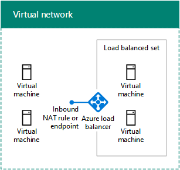

# Diseño de redes para IaaS de Microsoft Azure

 **Resumen:** Entender cómo diseñar redes optimizadas para cargas de trabajo en Microsoft Azure IaaS.
  
La optimización de las redes para las cargas de trabajo de TI hospedadas en IaaS de Azure requiere un conocimiento de las redes virtuales (VNets) de Azure, los espacios de direcciones, el enrutamiento, el DNS y el equilibrio de carga.
  
## Pasos de planeación para cualquier red virtual

Siga estos pasos para cualquier tipo de red virtual.
  
### Paso 1: Preparar la intranet para los servicios en la nube de Microsoft.

Vea la sección **Pasos para preparar la red para Servicios en la nube de Microsoft** en [Elementos comunes de conectividad de Microsoft Cloud](common-elements-of-microsoft-cloud-connectivity.md).
  
### Paso 2: Optimizar el ancho de banda de Internet.

Para optimizar el ancho de banda de Internet, siga los pasos 2 a 4 de la sección **Pasos para preparar la red para los servicios SaaS de Microsoft** del artículo [Diseño de redes para SaaS de Microsoft](designing-networking-for-microsoft-saas.md).
  
### Paso 3: Determinar el tipo de red virtual (solo nube o entre locales).

Una red virtual de solo nube no tiene conexión a una red local. Aquí le mostramos un ejemplo.
  
**Figura 1: Una nube de sólo VNet**

  
La figura 1 muestra un conjunto de máquinas virtuales en una red virtual de solo nube.
  
Una red virtual entre locales tiene una conexión VPN de sitio a sitio (S2S) o de ExpressRoute a una red local a través de una puerta de enlace de Azure. Aquí le mostramos un ejemplo.
  
**Figura 2: Un local entre VNet**

  
La figura 2 muestra un conjunto de máquinas virtuales en una red virtual entre locales, que está conectada a una red local.
  
Consulte la sección de [pasos de planificación para un VNet local entre](designing-networking-for-microsoft-azure-iaas.md#cross_prem) en este artículo.
  
### Paso 4: Determinar el espacio de direcciones de la red virtual.

La tabla 1 muestra los espacios de direcciones para los distintos tipos de redes virtuales.
  
|**Tipo de VNet**|**Espacio de direcciones de red virtual**|
|:-----|:-----|
|Basada solo en la nube    |Espacio de direcciones privadas arbitrarias    |
|Basada solo en la nube e interconectada    |Privado arbitrario, pero no se superponen con otros conectados VNets    |
|Entre locales    |Privada, pero sin que se superponga con redes locales    |
|Local e interconectada    |Privada, pero sin que se superponga con otras redes locales y virtuales conectadas    |
   
 **Tabla 1: Tipos de VNets y su correspondiente espacio de dirección**
  
El DHCP asigna a las máquinas virtuales una configuración de direcciones desde el espacio de direcciones de la subred:
  
- Dirección/máscara de subred
    
- Puerta de enlace predeterminada
    
- Direcciones IP del servidor DNS
    
También puede reservar una dirección IP estática.
  
A las máquinas virtuales también se les puede asignar una dirección IP pública, ya sea individualmente o desde el servicio en la nube que las contiene (solo para máquinas de implementación clásicas).
  
### Paso 5: Determinar las subredes de la red virtual y los espacios de direcciones asignados a cada una.

Hay dos tipos de subredes en una red virtual: una subred de puerta de enlace y una subred de hospedaje de máquina virtual.
  
**Figura 3: Los dos tipos de subredes de Azure**

  
La figura 3 muestra una red virtual que contiene una subred de puerta de enlace que, a su vez, contiene una puerta de enlace de Azure y un conjunto de subredes de hospedaje de máquina virtual que engloba las máquinas virtuales.
  
Azure necesita la subred de puerta de enlace de Azure para hospedar las dos máquinas virtuales de su puerta de enlace de Azure. Especifique un espacio de direcciones que tenga una longitud de prefijo de, al menos, 29 bits (ejemplo: 192.168.15.248/29). Se recomienda una longitud de prefijo de 28 bits o menor, especialmente si va a usar ExpressRoute.
  
Una práctica recomendada para determinar el espacio de direcciones de la subred de puerta de enlace de Azure es la siguiente:
  
1. Decida el tamaño de la subred de puerta de enlace.
    
2. En los bits variables del espacio de direcciones de la red virtual, establezca los bits usados para la subred de puerta de enlace en 0 y los bits restantes en 1.
    
3. Convierta a decimales y expréselo como un espacio de direcciones con la longitud de prefijo establecida en el tamaño de la subred de puerta de enlace.
    
Con este método, el espacio de direcciones de la subred de puerta de enlace siempre está en el extremo más alejado del espacio de direcciones de la red virtual.
  
En este ejemplo, se define el prefijo de dirección que corresponde a la subred de puerta de enlace: el espacio de direcciones de la red virtual es 10.119.0.0/16. La organización usará inicialmente una conexión VPN de sitio a sitio, pero al final empleará ExpressRoute. La tabla 2 muestra los pasos y los resultados de determinar el prefijo de dirección de la subred de puerta de enlace en una notación de prefijos de red (también conocido como CIDR).

A continuación presentamos los pasos y ejemplo de determinar el prefijo de la dirección de subred puerta de enlace:

1. Decidir el tamaño de la subred de puerta de enlace. En nuestro ejemplo, elegimos /28.
2. Establecer los bits de la parte variable del espacio de direcciones VNet (b) a 0 para la puerta de enlace de bits de subred (G), 1 en caso contrario (V). En nuestro ejemplo, estamos utilizando el espacio de direcciones de 10.119.0.0/16 para el VNet. 
 10.119. bbbbbbbb. bbbbbbbb 10.119. VVVVVVVV. VVVVGGGG 10.119. 11111111. 11110000  
3. Convertir el resultado del paso 2 en decimal y se expresa como un espacio de direcciones. En nuestro ejemplo, 10.119. 11111111. 11110000 es 10.119.255.240, y con la longitud del prefijo del paso 1, (28 en nuestro ejemplo), el prefijo de dirección de subred puerta de enlace resultante es 10.119.255.240/28.
  
Para obtener más información, vea [Calculadora de espacio de direcciones para las subredes de la puerta de enlace de Azure](https://gallery.technet.microsoft.com/scriptcenter/Address-prefix-calculator-a94b6eed) .
  
En las subredes de hospedaje de máquina virtual es donde se colocan las máquinas virtuales de Azure, lo cual se puede hacer siguiendo las instrucciones locales típicas, como un rol común o el nivel de una aplicación o para el aislamiento de la subred.
  
Azure utiliza las primeros 3 direcciones en cada subred. Por lo tanto, el número de posibles direcciones de una subred Azure es 2n -5, donde n es el número de bits de host. La tabla 3 se muestra la gama de máquinas virtuales que necesite, con el número de hosts bits necesarios y el tamaño de la subred correspondiente.
  
|**Máquinas virtuales que necesite**|**Bits de host**|**Tamaño de la subred**|
|:-----|:-----|:-----|
|1-3    |3    |/29    |
|4-11    |4    |/28    |
|12-27    |5    |/27    |
|28-59    |6    |/26    |
|60-123    |7    |/25    |
   
 **Tabla 3: requisitos de la máquina Virtual y sus tamaños de subred**
  
Para obtener más información acerca de la cantidad máxima de máquinas virtuales en una subred o VNet, consulte [Límites de redes](https://docs.microsoft.com/azure/azure-subscription-service-limits#networking-limits).
  
Para obtener más información, consulte [Plan y diseño de redes virtuales de Azure](https://azure.microsoft.com/documentation/articles/virtual-network-vnet-plan-design-arm/).
  
### Paso 6: Determinar la configuración del servidor DNS y las direcciones de los servidores DNS para asignar a las máquinas virtuales en la red virtual.

Azure asigna a las máquinas virtuales las direcciones de los servidores DNS mediante DHCP. Los servidores DNS pueden suministrarlos:
  
- Azure: se proporciona un registro de nombres locales y una resolución de nombres de Internet
    
- Usted: se proporciona un registro de nombres locales o de intranet y una resolución de nombres de Internet o de intranet
    
En la tabla 4, se muestran las diferentes configuraciones de los servidores DNS para cada tipo de red virtual.
    
|**Tipo de VNet**|**Servidor DNS**|
|:-----|:-----|
|Basada solo en la nube    |Suministrado por Azure para la resolución de nombres de Internet y locales    Máquina virtual de Azure para la resolución de nombres de Internet y locales (reenvío DNS)    |
|Entre locales    |Local para la resolución de nombres locales y de intranet    Máquina virtual de Azure para la resolución de nombres de Internet y locales (replicación y reenvío DNS)    |
   
 **Tabla 4: Opciones de servidor DNS para los dos tipos diferentes de VNets**
  
Para obtener más información, vea [Resolución de nombres para las máquinas virtuales y las instancias de la función](https://docs.microsoft.com/azure/virtual-network/virtual-networks-name-resolution-for-vms-and-role-instances).
  
### Paso 7: Determinar la configuración de equilibrio de carga (accesible desde Internet o interna).

En algunos casos, queremos distribuir el tráfico entrante a un conjunto de servidores que tienen el mismo rol. IaaS de Azure dispone de una instalación integrada para hacer esto con cargas de tráfico accesibles desde Internet e internas.
  
El equilibrio de carga de Azure accesible desde Internet distribuye aleatoriamente el tráfico entrante no solicitado de Internet a los miembros de un conjunto de carga equilibrada. 
  
**Figura 4: Un equilibrador de carga externo en Azure**

  
La figura 4 muestra un equilibrador de carga externo en Azure y que distribuye el tráfico entrante en una regla de NAT de entrada o extremo a un conjunto de máquinas virtuales en un conjunto de equilibrio de carga.
  
El equilibrio de carga interno de Azure distribuye aleatoriamente el tráfico entrante no solicitado desde otras máquinas virtuales de Azure o desde equipos de la intranet a los miembros de un conjunto de equilibrio de carga.  
  
**Figura 5: Un equilibrador de carga interno en Azure**

  
La figura 5 muestra un equilibrador de carga interno en Azure y que distribuye el tráfico entrante en una regla de NAT de entrada o extremo a un conjunto de máquinas virtuales en un conjunto de equilibrio de carga.
  
Para obtener más información, vea el [Equilibrador de carga de Azure](https://docs.microsoft.com/azure/load-balancer/load-balancer-overview).
  
### Paso 8: Determinar el uso de las aplicaciones virtuales y las rutas definidas por el usuario.

Si tiene que reenviar el tráfico a aplicaciones virtuales de la red virtual, puede que deba agregar a una subred una o varias rutas que haya definido el usuario.
  
**Figura 6: Dispositivos virtuales y rutas definidas por el usuario en Azure**

  
La figura 6 muestra una red virtual entre locales y una ruta definida por el usuario asignada a una subred de hospedaje de máquina virtual que apunta a una aplicación virtual.
  
Para obtener más información, vea [rutas de usuario definidos y el reenvío de IP](https://docs.microsoft.com/azure/virtual-network/virtual-networks-udr-overview).
  
### Paso 9: Determinar cómo se conectarán los equipos de Internet a las máquinas virtuales.

Hay varias maneras de proporcionar acceso a Internet a las máquinas virtuales de una red virtual, que incluye el acceso desde la red de la organización a través del servidor proxy u otro dispositivo perimetral.
  
La tabla 5 recoge los métodos para filtrar o inspeccionar el tráfico entrante no solicitado.
  
|**Método**|**Modelo de implementación**|
|:-----|:-----|
|1. Puntos de conexión y ACL configurados en los servicios en la nube    |Clásico    |
|2. Grupos de seguridad de red    |Administrador de recursos y clásico    |
|3. Equilibrador de carga accesible desde Internet con reglas de NAT entrantes    |Administrador de recursos    |
|4. dispositivos de seguridad en el mercado de Azure (no se muestra) de la red    |Administrador de recursos y clásico    |
   
 **Tabla 5: Métodos de conectarse a máquinas virtuales y sus correspondientes modelos de implementación de Azure**
  
**Figura 7: Conexión a Azure máquinas virtuales a través de Internet**

  
La figura 7 muestra un equipo conectado a Internet que se conecta a una máquina virtual en un servicio en la nube usando un punto de conexión, una máquina virtual de una subred que usa un grupo de seguridad de red y una máquina virtual de una subred que usa un equilibrador de carga externo y reglas de NAT entrantes.
  
La seguridad adicional la proporcionan:
  
- Conexiones de Escritorio remoto y SSH, que se autentican y se cifran.
    
- Sesiones remotas de PowerShell, que se autentican y se cifran.
    
- Modo de transporte IPsec, que puede usar para el cifrado de extremo a extremo.
    
- Protección DDoS de Azure, que ayuda a prevenir ataques internos y externos
    
Para obtener más información, vea [Seguridad de nube de Microsoft para Enterprise Architects](https://aka.ms/cloudarchsecurity) y [Seguridad de la red de Azure](https://azure.microsoft.com/blog/azure-network-security/).
  
### Paso 10: Para varias redes virtuales, determinar la topología de conexión de una red virtual a otra.

Las redes virtuales pueden conectarse entre sí mediante topologías como las que se usan para conectar los sitios de una organización.
  
Una configuración de encadenamiento conecta las redes virtuales de una serie.
  
**Figura 8: Una margarita configuración para VNets**

  
La figura 8 muestra cinco VNets conectados en serie con una configuración de margarita.
  
Una configuración de concentrador y radio conecta varias redes virtuales a un conjunto de redes virtuales centrales, que están conectadas entre sí.
  
**Figura 9: Un concentrador y radios configuración para VNets**

  
La figura 9 muestra seis redes virtuales, dos redes virtuales son concentradores conectados entre sí y también otras dos son redes virtuales de radio.
  
Una configuración de malla completa conecta las redes virtuales entre sí.
  
**Figura 10: Configuración de VNets de malla completa**

  
La figura 10 muestra cuatro redes virtuales que están conectadas entre sí y que usan un total de seis conexiones de red virtual a red virtual.
  
## Pasos de planeación para una red virtual entre locales

Siga estos pasos para una red virtual entre locales.
  
> [!TIP]
> Para crear un entorno de prueba/desarrollo local entre simulado, consulte [simulada entre local red virtual en Azure](simulated-cross-premises-virtual-network-in-azure.md). 
  
### Paso 1: Determinar la conexión entre locales a la red virtual (VPN S2S o ExpressRoute).

En la tabla 6 se recogen los distintos tipos de conexiones.
  
|**Tipo de conexión**|**Finalidad**|
|:-----|:-----|
|VPN sitio a sitio (S2S)    |Conectar sitios de 1 a 10 (incluidos otros VNets) a un VNet único.    |
|ExpressRoute    |Un vínculo seguro y privado a Azure a través de un proveedor de intercambio de Internet (IXP) o un proveedor de servicio de red (NSP).    |
|VPN punto a sitio (P2S)    |Conecta un solo equipo a una red virtual.    |
|Dispositivos VPN para el emparejamiento de VNET o de red virtual a red virtual (V2V)     |Conecta una red virtual a otra.    |
   
 **Tabla 6: Los tipos de conexiones para entre local VNets**
  
Para obtener más información sobre el número máximo de conexiones, consulte [Límites de redes](https://docs.microsoft.com/azure/azure-subscription-service-limits#networking-limits).
  
Para obtener más información acerca de los dispositivos VPN, consulte [dispositivos VPN para las conexiones de red virtual de sitio a sitio](https://docs.microsoft.com/azure/vpn-gateway/vpn-gateway-about-vpn-devices).
  
Para obtener más información acerca de la interconexión de VNet, consulte [VNet peering](https://docs.microsoft.com/azure/virtual-network/virtual-network-peering-overview).
  
**Figura 11: Las cuatro maneras de conectarse a un VNet local entre**

  
La figura 11 muestra un VNet con los cuatro tipos de conexiones: una conexión P2S desde un equipo, una conexión VPN S2S desde una red local, una conexión de ExpressRoute desde una red local y una conexión de VNet a VNet desde otro VNet. 
  
Puede conectarse a las máquinas virtuales de una red virtual de las maneras siguientes:
  
- Administración de máquinas virtuales de redes virtuales desde la red local o Internet
    
- Acceso a cargas de trabajo de TI desde la red local
    
- Ampliación de la red a través de redes virtuales adicionales
    
La seguridad en las conexiones se consigue mediante lo siguiente:
  
- P2S usa el protocolo de túnel de sockets de seguros (SSTP)  
    
- S2S y conexiones VPN de red virtual a red virtual usan el modo de túnel IPsec con AES256
    
- ExpressRoute es una conexión WAN privada
    
Para obtener más información, vea [Seguridad de nube de Microsoft para Enterprise Architects](https://aka.ms/cloudarchsecurity) y [Seguridad de la red de Azure](https://azure.microsoft.com/blog/azure-network-security/).
  
### Paso 2: Determinar el dispositivo o enrutador VPN local.

El dispositivo o enrutador VPN local actúa como:
  
- Par IPsec que finaliza la conexión de VPN S2S desde la puerta de enlace de Azure.
    
- Par BPG y punto de finalización para la conexión de ExpressRoute de emparejamiento privado.
    
**Figura 12: Enrutador VPN local o dispositivo**

  
La figura 12 muestra una red virtual entre locales conectada a un enrutador o dispositivo VPN local.
  
Para obtener más información, consulte [acerca de VPN gateway](https://docs.microsoft.com/azure/vpn-gateway/vpn-gateway-about-vpngateways).
  
### Paso 3: Agregar rutas a la intranet para hacer que el espacio de dirección de la VNet alcanzable.

El enrutamiento a redes virtuales desde ubicaciones locales consiste en lo siguiente:
  
1. Una ruta para el espacio de direcciones de red virtual que apunte al dispositivo VPN.
    
2. Una ruta para el espacio de direcciones de red virtual en el dispositivo VPN que apunte a la conexión VPN S2S o de ExpressRoute
    
**Figura 13: Las rutas locales necesarios para hacer accesible un VNet**

  
En la figura 13, se muestra la información de enrutamiento que necesitan los enrutadores locales y el enrutador o dispositivo VPN que representa el espacio de direcciones de la red virtual.
  
### Paso 4: Para ExpressRoute, planear la nueva conexión con el proveedor.

Puede crear una conexión de ExpressRoute con emparejamiento privado entre la red local y la nube de Microsoft de tres maneras diferentes:
  
- Colocalizada en un intercambio en la nube
    
- Conexiones Ethernet de punto a punto
    
- Redes (IP VPN) universales
    
**Figura 14: Utiliza ExpressRoute para conectarse a un VNet local entre**

  
La figura 14 muestra una red virtual entre locales y una conexión de ExpressRoute de un enrutador local a Microsoft Azure.
  
Para obtener más información, consulte [ExpressRoute para la conectividad en la nube de Microsoft](expressroute-for-microsoft-cloud-connectivity.md).
  
### Paso 5: Determinar el espacio de direcciones de red local para la puerta de enlace de Azure.

Para el enrutamiento a una red local u otras redes virtuales desde una red virtual, Azure reenvía el tráfico a través de una puerta de enlace de Azure que coincide con el espacio de direcciones de red local asignado a la puerta de enlace.
  
**Figura 15: Espacio de direcciones red Local para un VNet entre locales**

  
La figura 15 muestra una red virtual entre locales y el espacio de direcciones de red local en la puerta de enlace de Azure, que representa el espacio de direcciones accesible en la red local.  
  
El espacio de direcciones de red local se puede definir de las siguientes maneras:
  
- Opción 1: La lista de prefijos del espacio de direcciones que se necesita actualmente o que está en uso (podría ser necesario actualizar al agregar nuevas subredes).
    
- Opción 2: El espacio de direcciones local completo (solo es necesario actualizar cuando se agrega un espacio de direcciones nuevo).
    
Como la puerta de enlace de Azure no permite rutas resumidas, debe definir el espacio de direcciones de red local para la opción 2 de modo que no incluya el espacio de direcciones de red virtual.
  
**Figura 16: La dirección espacio hueco creado por el espacio de dirección VNet**

  
La figura 16 muestra una representación de un espacio de direcciones con el espacio raíz y el espacio de direcciones de red virtual.
  
Aquí es un ejemplo de la definición de los prefijos de espacio de direcciones de red Local alrededor del espacio de direcciones "hueco" creado por el VNet:
  
- Una organización usa partes del espacio de direcciones privadas (10.0.0.0/8, 172.16.0.0/12 y 192.168.0.0/16) a través de su red local. Eligió la opción 2 y 10.100.100.0/24 como espacio de direcciones de red virtual.
    
La tabla 7 muestra los pasos y prefijos resultantes que definen el espacio de direcciones de red local en este ejemplo.
  
|**Paso**|**Resultados**|
|:-----|:-----|
|1. Mostrar los prefijos que no son el espacio raíz para el espacio de direcciones de red virtual.    |172.16.0.0/12 y 192.168.0.0/16    |
|2. lista de los prefijos no se superponen para variable octetos hasta, pero sin incluir el último octeto utilizado en el espacio de direcciones de VNet.    |10.0.0.0/16, 10.1.0.0/16... 10.99.0.0/16, 10.101.0.0/16... 10.254.0.0/16, 10.255.0.0/16 (255 prefijos, omitiendo 10.100.0.0/16)    |
|3. lista de los prefijos no se superponen en el último octeto utilizado del espacio de direcciones VNet.    |10.100.0.0/24, 10.100.1.0/24... 10.100.99.0/24, 10.100.101.0/24... 10.100.254.0/24, 10.100.0.255.0/24 (255 prefijos, omitiendo 10.100.100.0/24)    |
   
 **Tabla 7: Espacio de dirección Local del ejemplo de red**
  
### Paso 6: Configurar los servidores DNS locales para la replicación DNS con servidores DNS hospedados en Azure.

Para garantizar que los equipos locales puedan resolver los nombres de los servidores basados en Azure y que estos servidores puedan resolver los nombres de los equipos locales, configure:
  
- Los servidores DNS de la red virtual para que reenvíen a los servidores DNS locales
    
- La replicación DNS de las zonas apropiadas entre servidores DNS locales y en la red virtual
    
**Figura 17: Replicación de DNS y reenvío a un servidor DNS en un VNet entre locales**

  
La figura 17 muestra una red virtual entre locales con servidores DNS en la red local y en una subred de la red virtual. El reenvío y la replicación de DNS se han configurado entre los dos servidores DNS.
  
### Paso 7: Determinar el uso de la tunelización forzada.

La ruta de sistema predeterminada para las subredes Azure señala a Internet. Para asegurarse de que todo el tráfico desde máquinas virtuales viaja a través de la conexión entre local, cree una tabla de enrutamiento con la ruta predeterminada que utiliza la puerta de enlace de Azure como su dirección de salto siguiente. A continuación, asociar la tabla de enrutamiento la subred. Esto se conoce como túnel de forzado. Para obtener más información, consulte [Configurar había forzado de túnel](https://docs.microsoft.com/azure/vpn-gateway/vpn-gateway-forced-tunneling-rm).
  
**Figura 18: Rutas definidas por el usuario y túneles forzada de un VNet entre locales**

  
La figura 18 muestra un VNet entre locales con una ruta definida por el usuario para una subred que señala a la puerta de enlace de Azure.
  
## Granja de servidores de SharePoint Server 2016 en Azure

Un ejemplo de una carga de trabajo de TI alojado en Azure IaaS intranet es una granja de SharePoint Server 2016 altamente disponible y de varios niveles.
  
**Figura 19: Una granja de SharePoint Server 2016 de intranet de gran disponibilidad en Azure IaaS**

  
Figura 19 muestra los nueve servidores de una granja de SharePoint Server 2016 implementado en un VNet entre local que utiliza los equilibradores de carga interna para las capas de aplicaciones y datos. Para obtener más información, incluyendo el diseño paso a paso e instrucciones de implementación, consulte [SharePoint Server 2016 en Azure de Microsoft](https://technet.microsoft.com/library/mt779107%28v=office.16%29.aspx).
  
> [!TIP]
> Para crear una granja de SharePoint Server 2016 de servidor único en un VNet local entre simulado, consulte [Intranet 2016 de servidor de SharePoint en el entorno de pruebas y desarrollo de Azure](https://technet.microsoft.com/library/mt806351%28v=office.16%29.aspx). 
  
Para obtener ejemplos adicionales de cargas de trabajo de TI implementados en máquinas virtuales en un Azure entre instalaciones virtual de red, vea [escenarios de nube híbrida de Azure IaaS](https://technet.microsoft.com/library/mt750502.aspx).
  
## Vea también

[Microsoft Cloud Networking para arquitectos profesionales](microsoft-cloud-networking-for-enterprise-architects.md)
  
[Recursos de arquitectura de TI de la nube de Microsoft](microsoft-cloud-it-architecture-resources.md)

[Mapa de ruta de Enterprise Cloud de Microsoft: Recursos para los responsables de decisiones de TI](https://sway.com/FJ2xsyWtkJc2taRD)

