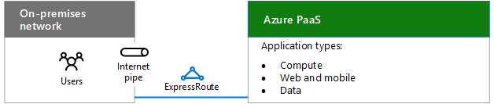

# Diseño de redes para PaaS de Microsoft AzureDesigning networking for Microsoft Azure PaaS

 **Resumen:** aprenda a optimizar la red para obtener acceso a PaaS de Microsoft Azure.**Summary:** Understand how to optimize your network for access to Microsoft Azure PaaS.
  
La optimización de las redes para aplicaciones PaaS de Azure requiere un ancho de banda de Internet adecuado y puede exigir la distribución del tráfico de red por varios sitios o aplicaciones.Optimizing networking for Azure PaaS apps requires adequate Internet bandwidth and can require the distribution of network traffic across multiple sites or apps.
  
## Pasos de planeamiento para hospedar aplicaciones PaaS de una organización en AzurePlanning steps for hosting organization PaaS applications in Azure

Inserte el cuerpo de la sección aquí.Insert section body here.
  
1. Vea la sección **Pasos para preparar la red para Servicios en la nube de Microsoft** en [Elementos comunes de conectividad de Microsoft Cloud](common-elements-of-microsoft-cloud-connectivity.md).Go through the **Steps to prepare your network for Microsoft cloud services** section in [Common elements of Microsoft cloud connectivity](common-elements-of-microsoft-cloud-connectivity.md).
    
2. Para optimizar el ancho de banda de Internet, siga los pasos 2 a 4 de la sección **Pasos para preparar la red para los servicios SaaS de Microsoft** del artículo [Diseño de redes para SaaS de Microsoft](designing-networking-for-microsoft-saas.md).Optimize your Internet bandwidth using steps 2 - 4 of the **Steps to prepare your network for Microsoft SaaS services** section in [Designing networking for Microsoft SaaS](designing-networking-for-microsoft-saas.md).
    
3. Determine si necesita una conexión de ExpressRoute a Azure.Determine whether you need an ExpressRoute connection to Azure.
    
4. En el caso de las cargas de trabajo basadas en web, determinar si necesita la Puerta de enlace de aplicaciones de Azure.For web-based workloads, determine whether you need the Azure Application Gateway.
    
5. En el caso de la distribución de tráfico a distintos puntos de conexión en diferentes centros de datos, decidir si necesita Administrador de tráfico de Azure.For distribution of traffic to different endpoints in different data centers, determine whether you need Azure Traffic Manager.
    
## Ancho de banda de Internet para las aplicaciones PaaS de la organizaciónInternet bandwidth for organization PaaS applications

Las aplicaciones de la organización hospedadas en PaaS de Azure requieren ancho de banda de Internet para los usuarios de la intranet. Hay dos opciones:Organization applications hosted in Azure PaaS require Internet bandwidth for intranet users. There are two options:
  
- **Opción 1:** Use la canalización existente optimizada para el tráfico de Internet con la capacidad para controlar las cargas máximas. Consulte[Diseño de redes para SaaS de Microsoft](designing-networking-for-microsoft-saas.md) para informarse sobre el perímetro de Internet, el uso de clientes y las consideraciones sobre las operaciones de TI.**Option 1:** Use your existing pipe, optimized for Internet traffic with the capacity to handle peak loads. See[Designing networking for Microsoft SaaS](designing-networking-for-microsoft-saas.md) for Internet edge, client usage, and IT operations considerations.
    
- **Opción 2:** Para las necesidades de ancho de banda de alto o de baja latencia, use una conexión de ExpressRoute a Azure.**Option 2:** For high-bandwidth or low latency needs, use an ExpressRoute connection to Azure.
    
**Figura 1: Opciones de conexión para conectarse a los servicios PaaS de Azure****Figure 1: Connection options for connecting the Azure PaaS services**

  
La figura 1 muestra una red local que se conecta a los servicios PaaS de Azure a través de una canalización de Internet o ExpressRoute.Figure 1 shows an on-premises network connecting to Azure PaaS services over an Internet pipe or ExpressRoute.
  
## Puerta de enlace de aplicación de AzureAzure Application Gateway

Enrutamiento de nivel de aplicación y servicios de equilibrio de carga que permiten compilar un front-end web escalable y altamente disponible en Azure para las aplicaciones web, los servicios en la nube y las máquinas virtuales.Application-level routing and load balancing services that let you build a scalable and highly-available web front end in Azure for web apps, cloud services, and virtual machines. 
  
**Figura 2: Puerta de enlace de aplicaciones de Azure****Figure 2: Azure Application Gateway**

  
La figura 2 muestra la Puerta de enlace de aplicaciones de Azure y cómo las solicitudes de usuario que proceden de Internet pueden enrutarse hacia las aplicaciones web de Azure, los servicios en la nube o las máquinas virtuales.Figure 2 shows the Azure Application Gateway and how user requests from the Internet can be routed to Azure web apps, cloud services, or virtual machines.
  
Actualmente, la Puerta de enlace de aplicaciones admite la entrega de aplicaciones de capa 7 para lo siguiente:Application Gateway currently supports layer 7 application delivery for the following:
  
- Equilibrio de carga HTTPHTTP load balancing
    
- Afinidad de sesión basada en cookiesCookie-based session affinity
    
- Descarga SSLSSL offload
    
Para obtener más información, consulte [Application Gateway]((https://docs.microsoft.com/azure/application-gateway/application-gateway-introduction)).For more information, see [Application Gateway]((https://docs.microsoft.com/azure/application-gateway/application-gateway-introduction)).
  
## Administrador de tráfico de AzureAzure Traffic Manager

Distribución de tráfico a distintos puntos de conexión, que pueden incluir servicios en la nube o aplicaciones web de Azure ubicadas en diferentes centros de datos o puntos de conexión externos.Distribution of traffic to different endpoints, which can include cloud services or Azure web apps located in different data centers or external endpoints.
  
Administrador de tráfico usa los siguientes métodos de enrutamiento:Traffic Manager uses the following routing methods:
  
- **Conmutación por error:** los puntos de conexión están en los mismos centros de datos Azure o en otros distintos y queremos usar un punto de conexión principal para todo el tráfico, pero también proporcionar copias de seguridad en caso de que los puntos de conexión principales o de copia de seguridad no estén disponibles.**Failover:** The endpoints are in the same or different Azure datacenters and you want to use a primary endpoint for all traffic, but provide backups in case the primary or the backup endpoints are unavailable.
    
- **Round robin:** quiere distribuir la carga en un conjunto de puntos de conexión en el mismo centro de datos o en centros de datos distintos.**Round robin:** You want to distribute load across a set of endpoints in the same datacenter or across different datacenters.
    
- **Rendimiento:** tenemos puntos de conexión en distintas ubicaciones geográficas y queremos que los clientes solicitantes usen el punto de conexión "más próximo", es decir, el de menor latencia.**Performance:** You have endpoints in different geographic locations and you want requesting clients to use the "closest" endpoint in terms of the lowest latency.
    
Este es un ejemplo de tres aplicaciones web distribuidas geográficamente.Here is an example for three geographically-distributed web apps.
  
**Figura 3: Administrador de tráfico de Azure****Figure 3: Azure Traffic Manager**

  
La figura 3 muestra el proceso básico que el Administrador de tráfico usa para enrutar las solicitudes hacia tres aplicaciones web de Azure diferentes en Estados Unidos, Europa y Asia. En el ejemplo:Figure 3 shows the basic process that Traffic Manager uses to route requests to three different Azure web apps in United States, Europe, and Asia. In the example:
  
1. Una consulta de DNS de usuario para solicitar la dirección URL de un sitio web se dirige al Administrador de tráfico de Azure, que, a su vez, devuelve el nombre de una aplicación web regional basándose en el método de enrutamiento del rendimiento.A user DNS query for a web site URL gets directed to Azure Traffic Manager, which returns the name of a regional web app, based on the performance routing method.
    
2. El usuario inicia el tráfico con la aplicación web regional en Europa.The user initiates traffic with the regional web app in Europe.
    
Para obtener más información, vea [Traffic Manager]((https://docs.microsoft.com/azure/traffic-manager/traffic-manager-overview)).For more information, see [Traffic Manager]((https://docs.microsoft.com/azure/traffic-manager/traffic-manager-overview)).
  
## Consulte tambiénSee Also

[Microsoft Cloud Networking para arquitectos profesionalesMicrosoft Cloud Networking for Enterprise Architects](microsoft-cloud-networking-for-enterprise-architects.md)
  
[Recursos de arquitectura de TI de la nube de MicrosoftMicrosoft Cloud IT architecture resources](microsoft-cloud-it-architecture-resources.md)

[Mapa de ruta de Enterprise Cloud de Microsoft: Recursos para los responsables de decisiones de TI]((https://sway.com/FJ2xsyWtkJc2taRD))[Microsoft's Enterprise Cloud Roadmap: Resources for IT Decision Makers]((https://sway.com/FJ2xsyWtkJc2taRD))

