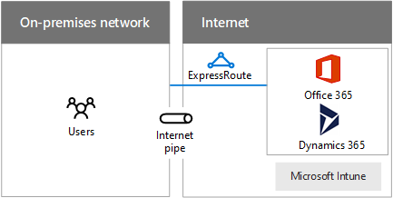

# Diseño de redes para SaaS de Microsoft

 **Resumen:** Aprenda a optimizar la red para tener acceso a los servicios de SaaS de Microsoft, como Office 365, Microsoft Intune y Dynamics 365.
  
La optimización de la red para los servicios SaaS de Microsoft requiere un análisis exhaustivo del perímetro de Internet, los dispositivos cliente y las operaciones de TI típicas.
  
## Pasos para preparar la red para los servicios SaaS de Microsoft

Siga estos pasos para optimizar la red para los servicios SaaS de Microsoft:
  
1. Vea la sección **Pasos para preparar la red para Servicios en la nube de Microsoft** en [Elementos comunes de conectividad de Microsoft Cloud](common-elements-of-microsoft-cloud-connectivity.md).
    
2. Optimice la salida de Internet para los servicios SaaS de Microsoft siguiendo las recomendaciones del servidor proxy.
    
3. Optimice el rendimiento de Internet siguiendo las recomendaciones de proximidad y ubicación.
    
4. Optimice el rendimiento de los equipos cliente y la intranet en la que se encuentran siguiendo las consideraciones para el uso de clientes.
    
5. Si es necesario, optimice el rendimiento de las migraciones de datos y la sincronización siguiendo las consideraciones de operaciones de TI.
    
## Consideraciones de perímetro de Internet

A continuación, indicamos algunos aspectos que tener en cuenta al optimizar el perímetro de Internet y el rendimiento de los servicios SaaS de Microsoft.
  
**Figura 1: Opciones de conexión de los servicios SaaS de Microsoft**

  
La figura 1 muestra una red local que se conecta a los servicios SaaS de Microsoft a través de una canalización de Internet o ExpressRoute.
  
Estas son algunas recomendaciones para optimizar el servidor proxy:
  
- Configurar los clientes web con WPAD, PAC o GPO
    
- No usar la interceptación de SSL
    
- Usar un archivo PAC con el fin de evitar el servidor proxy para los nombres DNS de los servicios SaaS de Microsoft
    
- Permitir el tráfico para la comprobación de CRL/OCSP
    
Estos son algunos cuellos de botella del servidor proxy que se deben comprobar:
  
- Conexiones persistentes insuficientes (Outlook)
    
- Capacidad insuficiente
    
- Realizar una evaluación fuera de red
    
- Requerir autenticación
    
- No hay soporte para el tráfico UDP (Skype Empresarial)
    
Estas son algunas recomendaciones sobre proximidad y ubicación:
  
- No enrutar el tráfico de Internet a través de la WAN privada
    
- Usar el flujo de tráfico de DNS e Internet en la región para los usuarios de fuera de la región
    
- Usar ExpressRoute para un ancho de banda alto a Office 365 y la conectividad simultánea con los servicios de Azure
    
Estos son los puertos de salida necesarios para el tráfico de Office 365:
  
- TCP 80 (para las comprobaciones CRL/OCSP)
    
- TCP 443
    
- UDP 3478
    
- TCP 5223
    
- TCP 50000-59999–59.999
    
- UDP 50000-59999
    
## Consideraciones para el uso de clientes

En primer lugar, configure el conjunto de servicios que los clientes van a usar, como:
  
- Azure Active Directory
    
- Office 365
    
  - Aplicaciones cliente de Office
    
  - SharePoint Online
    
  - Exchange Online
    
  - Skype Empresarial
    
- Microsoft Intune
    
- Dynamics 365
    
En el caso de los equipos cliente, determine lo siguiente:
  
- Número máximo en cualquier momento (hora del días, estacional, picos y valles en el uso)
    
- Ancho de banda total necesaria para los picos
    
- Latencia en el dispositivo de salida de Internet
    
- País de origen frente a país de colocalización de centro de datos
    
Para cada tipo de cliente (PC, smartphone, tableta), asegúrese de que está instalada la versión actual de lo siguiente:
  
- Sistema operativo 
    
- Explorador de Internet
    
- TCP/IP, pila
    
- Hardware de red
    
- Controladores de SO para el hardware de red
    
- Las actualizaciones y revisiones
    
También puede optimizar el rendimiento de la conexión de intranet (por cable, de forma inalámbrica o por VPN).
  
Para obtener más información, consulte [Compatibilidad de NAT con Office 365](https://support.office.com/article/NAT-support-with-Office-365-170e96ea-d65d-4e51-acac-1de56abe39b9).
  
Para conocer las recomendaciones más recientes para el uso de ExpressRoute con Office 365, consulte [Azure ExpressRoute para Office 365](https://support.office.com/article/Azure-ExpressRoute-for-Office-365-6d2534a2-c19c-4a99-be5e-33a0cee5d3bd).
  
Para optimizar el rendimiento de la intranet, haga lo siguiente:
  
- Use herramientas para medir los tiempos de ida y vuelta (RTT) de los dispositivos perimetrales de Internet (PsPing, Ping, Tracert, TraceTCP, Monitor de red)
    
- Realice análisis de ruta de acceso de salida mediante protocolos de flujo
    
- Realice análisis de dispositivos intermedios (antigüedad, mantenimiento, etc.)
    
Para obtener más información, consulte la [Herramienta PsPing](https://technet.microsoft.com/sysinternals/jj729731.aspx).
  
## Consideraciones sobre las operaciones de TI

A continuación, describimos algunos factores que se deben considerar cuando se trabaja con una carga de trabajo de TI en un servicio SaaS de Microsoft.
  
### Migraciones únicas

La transferencia de datos masiva en aplicaciones basadas en la nube o el almacenamiento de archivado son ejemplos de migraciones únicas.
  
Si quiere optimizar la red durante las migraciones únicas:
  
- Evite el uso de la red en horas pico y en las horas de aplicación de revisiones en el equipo
    
- La red se debe someter a pruebas piloto y de línea base, evalúe el mantenimiento de la red y resuelva los problemas antes de llevar a cabo la migración
    
- Realice análisis finales para futuras migraciones
    
### Sincronizaciones continuas

Algunos ejemplos de sincronizaciones continuas son los archivos, la configuración o la información de directorio.
  
Si quiere optimizar la red en las sincronizaciones continuas:
  
- Asegúrese de que se implante un sistema de supervisión del ancho de banda de la red y resuelva o descarte los errores encontrados
    
- Use los resultados de la supervisión del ancho de banda para identificar la necesidad de cambios en la red (escalar vertical u horizontalmente, nuevos circuitos o adición de dispositivos)
    
Para más información, visite:
  
- [Planeación de la migración y red para Office 365](https://aka.ms/tune)
    
- [ExpressRoute para Office 365](https://aka.ms/expressrouteoffice365)

## Paso siguiente

[Diseño de redes para PaaS de Microsoft Azure](designing-networking-for-microsoft-azure-paas.md)
    
## Ver también

[Microsoft Cloud Networking para arquitectos profesionales](microsoft-cloud-networking-for-enterprise-architects.md)
  
[Recursos de arquitectura de TI de la nube de Microsoft](microsoft-cloud-it-architecture-resources.md)

[Mapa de ruta de Enterprise Cloud de Microsoft: Recursos para los responsables de decisiones de TI](https://sway.com/FJ2xsyWtkJc2taRD)

