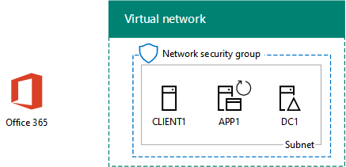

# <a name="directory-synchronization-for-your-office-365-devtest-environment"></a><span data-ttu-id="f0f3b-103">Sincronización de directorios para el entorno de desarrollo y prueba de Office 365</span><span class="sxs-lookup"><span data-stu-id="f0f3b-103">Directory synchronization for your Office 365 dev/test environment</span></span>

 <span data-ttu-id="f0f3b-104">**Resumen:** Configurar la sincronización de directorios para el entorno de desarrollo y prueba de Office 365.</span><span class="sxs-lookup"><span data-stu-id="f0f3b-104">**Summary:** Configure directory synchronization for your Office 365 dev/test environment.</span></span>
  
<span data-ttu-id="f0f3b-p101">Muchas organizaciones uso Azure Connect de AD y sincronización de directorios para sincronizar el conjunto de cuentas de su bosque de Windows Server Active Directory (AD) local para el conjunto de cuentas de Office 365. Este artículo describe cómo agregar la sincronización de directorios con la sincronización de contraseñas hash para el entorno de desarrollo y prueba de Office 365, dando como resultado la siguiente configuración.</span><span class="sxs-lookup"><span data-stu-id="f0f3b-p101">Many organizations use Azure AD Connect and directory synchronization to synchronize the set of accounts in their on-premises Windows Server Active Directory (AD) forest to the set of accounts in Office 365. This article describes how you can add directory synchronization with password hash synchronization to the Office 365 dev/test environment, resulting in the following configuration.</span></span>
  

  
<span data-ttu-id="f0f3b-108">Esta configuración se compone de: </span><span class="sxs-lookup"><span data-stu-id="f0f3b-108">This configuration consists of:</span></span> 
  
- <span data-ttu-id="f0f3b-109">Una suscripción de prueba a Office 365 E5, que expira a los 30 días de su creación.</span><span class="sxs-lookup"><span data-stu-id="f0f3b-109">An Office 365 E5 Trial Subscription, which expires 30 days from when you create it.</span></span>
- <span data-ttu-id="f0f3b-p102">La intranet de una organización simplificada conectada a Internet, que consta de tres máquinas virtuales en una subred de una red virtual de Azure (DC1, APP1 y CLIENTE1). Azure Connect de AD se ejecuta en APP1 para sincronizar el dominio de Windows Server AD con Office 365.</span><span class="sxs-lookup"><span data-stu-id="f0f3b-p102">A simplified organization intranet connected to the Internet, consisting of three virtual machines on a subnet of an Azure virtual network (DC1, APP1, and CLIENT1). Azure AD Connect runs on APP1 to synchronize the Windows Server AD domain to Office 365.</span></span>
    
<span data-ttu-id="f0f3b-112">Existen dos fases para configurar el entorno de desarrollo y pruebas:</span><span class="sxs-lookup"><span data-stu-id="f0f3b-112">There are two phases to setting up this dev/test environment:</span></span>
  
1. <span data-ttu-id="f0f3b-113">Crear el entorno de desarrollo y pruebas de Office 365 (las máquinas virtuales DC1, APP1 y CLIENTE1 en una red virtual Azure con una suscripción de prueba a Office 365 E5).</span><span class="sxs-lookup"><span data-stu-id="f0f3b-113">Create the Office 365 dev/test environment (the DC1, APP1, and CLIENT1 virtual machines in an Azure virtual network with an Office 365 E5 trial subscription).</span></span>
2. <span data-ttu-id="f0f3b-114">Instalar y configurar Azure AD Connect en APP1.</span><span class="sxs-lookup"><span data-stu-id="f0f3b-114">Install and configure Azure AD Connect on APP1.</span></span>
    
> [!TIP]
> <span data-ttu-id="f0f3b-115">Haga clic [aquí](http://aka.ms/catlgstack) para ver un mapa visual para todos los artículos de la pila de una guía de laboratorio de prueba de nube de Microsoft.</span><span class="sxs-lookup"><span data-stu-id="f0f3b-115">Click [here](http://aka.ms/catlgstack) for a visual map to all the articles in the One Microsoft Cloud Test Lab Guide stack.</span></span>
  
## <a name="phase-1-create-an-office-365-devtest-environment"></a><span data-ttu-id="f0f3b-116">Fase 1: Crear un entorno de desarrollo y pruebas de Office 365</span><span class="sxs-lookup"><span data-stu-id="f0f3b-116">Phase 1: Create an Office 365 dev/test environment</span></span>

<span data-ttu-id="f0f3b-p103">Siga las instrucciones en las fases 1, 2 y 3 del artículo del [entorno de desarrollo y prueba de Office 365](office-365-dev-test-environment.md) . Aquí está la configuración resultante.</span><span class="sxs-lookup"><span data-stu-id="f0f3b-p103">Follow the instructions in phases 1, 2, and 3 of the [Office 365 dev/test environment](office-365-dev-test-environment.md) article. Here is the resulting configuration.</span></span>
  

  
<span data-ttu-id="f0f3b-120">Esta configuración se compone de: </span><span class="sxs-lookup"><span data-stu-id="f0f3b-120">This configuration consists of:</span></span> 
  
- <span data-ttu-id="f0f3b-121">Una suscripción de prueba a Office 365 E5.</span><span class="sxs-lookup"><span data-stu-id="f0f3b-121">An Office 365 E5 Trial Subscription.</span></span>
- <span data-ttu-id="f0f3b-122">La intranet de una organización simplificada conectada a Internet, que consta de las máquinas virtuales DC1, APP1 y CLIENTE1 en una subred de una red virtual de Azure.</span><span class="sxs-lookup"><span data-stu-id="f0f3b-122">A simplified organization intranet connected to the Internet, consisting of the DC1, APP1, and CLIENT1 virtual machines on a subnet of an Azure virtual network.</span></span>
    
## <a name="phase-2-install-azure-ad-connect-on-app1"></a><span data-ttu-id="f0f3b-123">Fase 2: Instalar Azure AD Connect en APP1</span><span class="sxs-lookup"><span data-stu-id="f0f3b-123">Phase 2: Install Azure AD Connect on APP1</span></span>

<span data-ttu-id="f0f3b-p104">Una vez instalado y configurado, Azure Connect AD sincroniza el conjunto de cuentas del dominio CORP Windows Server AD con el conjunto de cuentas de su suscripción de prueba a Office 365. El siguiente procedimiento le guía a través de la instalación de Azure Connect AD en APP1 y la comprobación de que funciona.</span><span class="sxs-lookup"><span data-stu-id="f0f3b-p104">Once installed and configured, Azure AD Connect synchronizes the set of accounts in the CORP Windows Server AD domain with the set of accounts in your Office 365 trial subscription. The following procedure steps you through installing Azure AD Connect on APP1 and verifying that it works.</span></span>
  
### <a name="install-and-configure-azure-ad-connect-on-app1"></a><span data-ttu-id="f0f3b-126">Instalar y configurar Azure Connect de AD en APP1</span><span class="sxs-lookup"><span data-stu-id="f0f3b-126">Install and configure Azure AD Connect on APP1</span></span>

1. <span data-ttu-id="f0f3b-127">Desde el [portal de Azure](https://portal.azure.com), conéctese a APP1 con el CORP\\cuenta de Usuario1.</span><span class="sxs-lookup"><span data-stu-id="f0f3b-127">From the [Azure portal](https://portal.azure.com), connect to APP1 with the CORP\\User1 account.</span></span>
    
2. <span data-ttu-id="f0f3b-128">Desde APP1, abra un símbolo del sistema de Windows PowerShell con el nivel de administrador y ejecute estos comandos:</span><span class="sxs-lookup"><span data-stu-id="f0f3b-128">From APP1, open an administrator-level Windows PowerShell command prompt, and then run these commands:</span></span>
    
  ```
  Set-ItemProperty -Path "HKLM:\\SOFTWARE\\Microsoft\\Active Setup\\Installed Components\\{A509B1A7-37EF-4b3f-8CFC-4F3A74704073}" -Name "IsInstalled" -Value 0
Set-ItemProperty -Path "HKLM:\\SOFTWARE\\Microsoft\\Active Setup\\Installed Components\\{A509B1A8-37EF-4b3f-8CFC-4F3A74704073}" -Name "IsInstalled" -Value 0
Stop-Process -Name Explorer -Force

  ```

3. <span data-ttu-id="f0f3b-129">Desde la barra de tareas, haga clic en **Internet Explorer** y vaya a [https://aka.ms/aadconnect](https://aka.ms/aadconnect).</span><span class="sxs-lookup"><span data-stu-id="f0f3b-129">From the task bar, click **Internet Explorer** and go to [https://aka.ms/aadconnect](https://aka.ms/aadconnect).</span></span>
    
4. <span data-ttu-id="f0f3b-130">En la página Microsoft Azure Active Directory Connect, haga clic en **Descargar**y, a continuación, haga clic en **Ejecutar**.</span><span class="sxs-lookup"><span data-stu-id="f0f3b-130">On the Microsoft Azure Active Directory Connect page, click **Download**, and then click **Run**.</span></span>
    
5. <span data-ttu-id="f0f3b-131">En la página **Bienvenido a Azure Connect de AD** , haga clic en **Acepto**y, a continuación, haga clic en **continuar**.</span><span class="sxs-lookup"><span data-stu-id="f0f3b-131">On the **Welcome to Azure AD Connect** page, click **I agree**, and then click **Continue**.</span></span>
    
6. <span data-ttu-id="f0f3b-132">En la página **Configuración de Express** , haga clic en **Usar configuración express**.</span><span class="sxs-lookup"><span data-stu-id="f0f3b-132">On the **Express Settings** page, click **Use express settings**.</span></span>
    
7. <span data-ttu-id="f0f3b-133">En la página **Conectar a Azure AD** , escriba su nombre de cuenta de administrador global en **nombre de usuario,** escriba su contraseña en **contraseña**y, a continuación, haga clic en **siguiente**.</span><span class="sxs-lookup"><span data-stu-id="f0f3b-133">On the **Connect to Azure AD** page, type your global administrator account name in **Username,** type its password in **Password**, and then click **Next**.</span></span>
    
8. <span data-ttu-id="f0f3b-134">En la página **Conectar con AD DS** , escriba **CORP\\Usuario1** en **nombre de usuario,** escriba su contraseña en **contraseña**y, a continuación, haga clic en **siguiente**.</span><span class="sxs-lookup"><span data-stu-id="f0f3b-134">On the **Connect to AD DS** page, type **CORP\\User1** in **Username,** type its password in **Password**, and then click **Next**.</span></span>
    
9. <span data-ttu-id="f0f3b-135">En la página de **configuración de inicio de sesión de anuncio de Azure** , haga clic en **continuar sin ningún verificados dominios**y, a continuación, haga clic en **siguiente**.</span><span class="sxs-lookup"><span data-stu-id="f0f3b-135">On the **Azure AD sign-in configuration** page, click **Continue without any verified domains**, and then click **Next**.</span></span>
    
10. <span data-ttu-id="f0f3b-136">En la página **Listo para configurar**, haga clic en **Instalar**.</span><span class="sxs-lookup"><span data-stu-id="f0f3b-136">On the **Ready to configure** page, click **Install**.</span></span>
    
11. <span data-ttu-id="f0f3b-137">En la página **Configuración finalizada** , haga clic en **Salir**.</span><span class="sxs-lookup"><span data-stu-id="f0f3b-137">On the **Configuration complete** page, click **Exit**.</span></span>
    
12. <span data-ttu-id="f0f3b-138">En Internet Explorer, vaya al portal de Office 365 ([https://portal.office.com](https://portal.office.com)) e inicie sesión en su suscripción de prueba de Office 365 con su cuenta de administrador global.</span><span class="sxs-lookup"><span data-stu-id="f0f3b-138">In Internet Explorer, go to the Office 365 portal ([https://portal.office.com](https://portal.office.com)) and sign in to your Office 365 trial subscription with your global administrator account.</span></span>
    
13. <span data-ttu-id="f0f3b-139">Desde la página principal del portal, haga clic en **Admin**.</span><span class="sxs-lookup"><span data-stu-id="f0f3b-139">From the main portal page, click **Admin**.</span></span>
    
14. <span data-ttu-id="f0f3b-140">En el panel de navegación izquierdo, haga clic en **Usuarios > Usuarios activos**.</span><span class="sxs-lookup"><span data-stu-id="f0f3b-140">In the left navigation, click **Users > Active users**.</span></span>
    
    <span data-ttu-id="f0f3b-p105">Nota la cuenta denominada **Usuario1**. Esta cuenta es desde el dominio CORP Windows Server AD y es la prueba de que ha trabajado la sincronización de directorios.</span><span class="sxs-lookup"><span data-stu-id="f0f3b-p105">Note the account named **User1**. This account is from the CORP Windows Server AD domain and is proof that directory synchronization has worked.</span></span>
    
15. <span data-ttu-id="f0f3b-p106">Haga clic en la cuenta de **Usuario1** . Licencias de producto, haga clic en **Editar**.</span><span class="sxs-lookup"><span data-stu-id="f0f3b-p106">Click the **User1** account. For product licenses, click **Edit**.</span></span>
    
16. <span data-ttu-id="f0f3b-p107">En las **licencias de producto**, seleccione su país y haga clic en el control de **apagado** para **Office 365 Enterprise E5** (conmutación en **On**). Haga clic en **Guardar** en la parte inferior de la página y, a continuación, haga clic en **Cerrar**.</span><span class="sxs-lookup"><span data-stu-id="f0f3b-p107">In **Product licenses**, select your country, and then click the **Off** control for **Office 365 Enterprise E5** (switching it to **On**). Click **Save** at the bottom of the page, and then click **Close**.</span></span>
    
<span data-ttu-id="f0f3b-147">Esta es la configuración resultante.</span><span class="sxs-lookup"><span data-stu-id="f0f3b-147">This is the resulting configuration.</span></span>
  

  
<span data-ttu-id="f0f3b-149">Esta configuración se compone de: </span><span class="sxs-lookup"><span data-stu-id="f0f3b-149">This configuration consists of:</span></span> 
  
- <span data-ttu-id="f0f3b-150">Una suscripción de prueba a Office 365 E5.</span><span class="sxs-lookup"><span data-stu-id="f0f3b-150">An Office 365 E5 Trial Subscription.</span></span>
- <span data-ttu-id="f0f3b-p108">La intranet de una organización simplificada conectada a Internet, que consta de las máquinas virtuales DC1, APP1 y CLIENTE1 en una subred de una red virtual de Azure. Azure Connect de AD se ejecuta en APP1 para sincronizar el dominio de Windows Server AD de CORP con Office 365 cada 30 minutos.</span><span class="sxs-lookup"><span data-stu-id="f0f3b-p108">A simplified organization intranet connected to the Internet, consisting of the DC1, APP1, and CLIENT1 virtual machines on a subnet of an Azure virtual network. Azure AD Connect runs on APP1 to synchronize the CORP Windows Server AD domain to Office 365 every 30 minutes.</span></span>
    
## <a name="next-step"></a><span data-ttu-id="f0f3b-153">Paso siguiente</span><span class="sxs-lookup"><span data-stu-id="f0f3b-153">Next Step</span></span>

<span data-ttu-id="f0f3b-154">Cuando esté listo para implementar la sincronización de directorios para su organización, consulte [sincronización de directorios de implementar Office 365 en Microsoft Azure](deploy-office-365-directory-synchronization-dirsync-in-microsoft-azure.md).</span><span class="sxs-lookup"><span data-stu-id="f0f3b-154">When you are ready to deploy directory synchronization for your organization, see [Deploy Office 365 directory synchronization in Microsoft Azure](deploy-office-365-directory-synchronization-dirsync-in-microsoft-azure.md).</span></span>

## <a name="see-also"></a><span data-ttu-id="f0f3b-155">Consulte también</span><span class="sxs-lookup"><span data-stu-id="f0f3b-155">See Also</span></span>

<span data-ttu-id="f0f3b-156">[La nube adopción guías de laboratorio de prueba (TLGs)](cloud-adoption-test-lab-guides-tlgs.md)
[entorno de desarrollo y prueba de configuración de Base](base-configuration-dev-test-environment.md)
[entorno de desarrollo y prueba de Office 365](office-365-dev-test-environment.md)
[Nube seguridad de la aplicación para el entorno de desarrollo y prueba de Office 365](cloud-app-security-for-your-office-365-dev-test-environment.md) 
 [ Una protección avanzada para su entorno de pruebas y desarrollo de Office 365](advanced-threat-protection-for-your-office-365-dev-test-environment.md)
[adopción de nube y soluciones híbridas](cloud-adoption-and-hybrid-solutions.md)</span><span class="sxs-lookup"><span data-stu-id="f0f3b-156">[Cloud adoption Test Lab Guides (TLGs)](cloud-adoption-test-lab-guides-tlgs.md)
[Base Configuration dev/test environment](base-configuration-dev-test-environment.md)
[Office 365 dev/test environment](office-365-dev-test-environment.md)
[Cloud App Security for your Office 365 dev/test environment](cloud-app-security-for-your-office-365-dev-test-environment.md)
[Advanced Threat Protection for your Office 365 dev/test environment](advanced-threat-protection-for-your-office-365-dev-test-environment.md)
[Cloud adoption and hybrid solutions](cloud-adoption-and-hybrid-solutions.md)</span></span>


