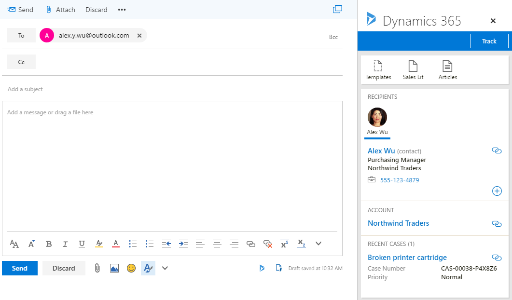

# Integración de Exchange Online para su entorno de desarrollo y pruebas y de Office 365 y 365 de Dynamics

 **Resumen:** Utilice a esta guía del entorno de pruebas para habilitar la integración de Dynamics 365 para Exchange Online en su suscripción de prueba de Office 365.
  
Una de las características más útiles de Microsoft Dynamics 365 es la de almacenar todas las comunicaciones con los clientes en un solo lugar, de modo que cualquier usuario con los permisos adecuados puede ver todos los registros pertinentes de clientes. Por ejemplo, ver todo el correo electrónico asociado a un contacto, a una cuenta, a una oportunidad o a un caso determinados.
  
Para almacenar el correo electrónico y otros registros de mensajes en Dynamics 365, debe sincronizar su sistema de correo electrónico con Dynamics 365. La sincronización del lado del servidor es el método preferido para la sincronización de correo electrónico.
  
Utilice a esta guía del entorno de pruebas para configurar y mostrar cómo Exchange Online y el cliente de Outlook Online pueden aprovechar la información almacenada en Dynamics 365. 
  
## Fase 1: Crear el entorno de desarrollo y pruebas de Office 365 y Dynamics 365

Siga las instrucciones de [Entorno de desarrollo y pruebas de Office 365 y Dynamics 365](office-365-and-dynamics-365-dev-test-environment.md) para crear una versión ligera o de empresa simulada de un entorno de desarrollo y pruebas de Office 365 y Dynamics 365.
  
> [!NOTE]
> La configuración recogida en este artículo no requiere el entorno de desarrollo y pruebas de una empresa simulada, que incluye una intranet simulada conectada a Internet y la sincronización de directorios para un bosque de Windows Server Active Directory (AD). Aquí se ofrece como opción para que pueda experimentar con Office 365 y Dynamics 365 en un entorno que representa una organización típica. 
  
## Fase 2: Configurar y mostrar la integración de Dynamics 365 en Exchange Online

Siga estos pasos para configurar el buzón del administrador global para la integración de Dynamics 365 y Exchange Online:
  
1. Con una sesión privada de su explorador, vaya a http://portal.office.com e inicie sesión con su cuenta de administrador global de Office 365.
    
2. En la **Página principal de Microsoft Office**, haga clic en el icono de **Correo**.
    
3. En la nueva pestaña **Correo** del explorador, haga clic en **Nuevo** y fíjese en la esquina inferior del panel de debajo del cuadro para escribir un mensaje: allí verá un icono de Mis plantillas.
    
     
  
4. Haga clic en **Descartar** y deje abierta la pestaña **Correo**.
    
5. Haga clic en la pestaña **Página principal de Microsoft Office** del explorador y, a continuación, en el icono **Admin**.
    
6. En el panel de navegación izquierdo de la pestaña **Centro de administración de Office**, haga clic en **Centros de administración > Dynamics 365**.
    
7. En la nueva pestaña **Dynamics 365** del explorador, en la lista de instancias de Dynamics 365, haga clic en **Abrir**.
    
8. En la nueva pestaña **Administración** del explorador, en la barra de navegación, haga clic en la flecha hacia abajo junto a **Configuración** y, a continuación, en **Configuración de correo electrónico**, en **Sistema**.
    
9.  En la página **Configuración de correo electrónico**, haga clic en **Opciones de configuración de correo electrónico**.
    
10. En la pestaña **Correo electrónico** del cuadro de diálogo **Configuración del sistema**, cambie **Citas, contactos y tareas** a **Sincronización del lado del servidor** y, a continuación, haga clic en **Aceptar**.
    
11. En la página **Configuración de correo electrónico**, haga clic en **Buzones**.
    
12. Seleccione el nombre de administrador global de Office 365 en la columna izquierda de marca de verificación, haga clic en **Aplicar configuración de correo electrónico predeterminada** en la barra de herramientas y, a continuación, en **Aceptar**.
    
13. En la barra de herramientas, haga clic en **Aprobar correo electrónico** y, a continuación, en **Aceptar**.
    
14. Seleccione el nombre de administrador global de Office 365 en la columna izquierda de marca de verificación, haga clic en **Probar y habilitar buzones** en la barra de herramientas y, a continuación, en **Aceptar**.
    
15. Haga clic en la pestaña abierta **Correo** y compruebe que el administrador global haya recibido un mensaje de prueba.
    
16. Vuelva a la pestaña **Mis buzones activos** del navegador y actualice la página. Las columnas **Estado del correo electrónico entrante** y **Estado del correo electrónico saliente** deben establecerse en **Correcto** para el nombre de la cuenta de administrador global. Tenga en cuenta que pueden ser necesarios hasta 15 minutos para completar ambas pruebas.
    
Siga estos pasos para instalar la aplicación Dynamics 365 para Outlook y mostrar las características de Dynamics 365 dentro del buzón de administrador global:
  
1. En la pestaña **Mis buzones activos** del explorador, haga clic en la flecha hacia abajo junto a **Configuración** y, a continuación, en **aplicación Dynamics 365 para Outlook**, en **Sistema**.
    
2. En la página **Introducción a la aplicación de Microsoft Dynamics 365 para Outlook**, haga clic en el nombre de administrador global y, a continuación, en **Agregar aplicación a Outlook**. La columna **Estado** cambiará a **Pendiente**.
    
3. Actualice la página hasta que cambie el estado a **Agregado a Outlook**. Tenga en cuenta que pueden ser necesarios hasta 15 minutos para completar la configuración.
    
4. Haga clic en la pestaña **Correo** en el explorador y, a continuación, ciérrela.
    
5. Haga clic en la pestaña **Página principal de Microsoft Office** del explorador y, a continuación, en el icono **Correo**.
    
6. En la nueva pestaña **Correo** del explorador, haga clic en **Nuevo**. Verá que en la parte inferior del panel de debajo del cuadro para escribir un mensaje ahora hay un icono de Dynamics 365.
    
     
  
7. Haga clic en el icono de Dynamics 365. Verá un panel de **Dynamics 365**, desde el que puede realizar el seguimiento de este correo electrónico o acceder a plantillas, documentación de ventas o artículos.
    
8. En el campo **Para** del mensaje de correo electrónico, escriba **alex.y.wu@outlook.com** y, a continuación, haga clic en **Reintentar** en el panel de **Dynamics 365**. Verá la sección **Destinatarios** en el panel de **Dynamics 365** con información sobre Alex Wu, un contacto de la aplicación de ventas que se proporcionó con los datos de ejemplo de su suscripción de prueba.
    
     
  
9. Haga clic en **Descartar**.
    
## See Also

#### 

[Entorno de desarrollo y pruebas de Office 365 y Dynamics 365](office-365-and-dynamics-365-dev-test-environment.md)
  
[Guías del laboratorio de pruebas de adopción de la nube (TLG)](cloud-adoption-test-lab-guides-tlgs.md)
  
[Entorno de desarrollo y pruebas de la configuración básica](base-configuration-dev-test-environment.md)
  
[Entorno de desarrollo y pruebas de Office 365](office-365-dev-test-environment.md)
  
[Sincronización de directorios (DirSync) para el entorno de desarrollo y pruebas de Office 365](dirsync-for-your-office-365-dev-test-environment.md)
#### 

[Administración de suscripción para Dynamics 365 (online)](https://technet.microsoft.com/library/jj679903.aspx)
  
[Administración de Dynamics 365](https://technet.microsoft.com/library/dn531101.aspx)

