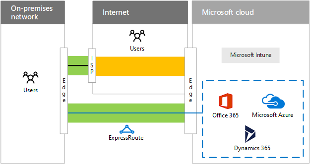
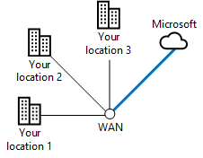
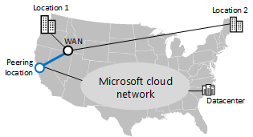
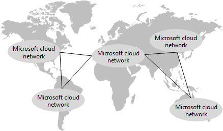

# ExpressRoute para la conectividad en la nube de MicrosoftExpressRoute for Microsoft cloud connectivity

 **Resumen:** Descubra cómo ExpressRoute puede ayudarle mediante conexiones más rápidas y fiables a los servicios y las plataformas en la nube de Microsoft.**Summary:** Understand how ExpressRoute can help you with faster and more reliable connections to Microsoft's cloud services and platforms.
  
ExpressRoute proporciona una conexión de red privada, dedicada y de alto rendimiento con la nube de Microsoft.ExpressRoute provides a private, dedicated, high-throughput network connection to Microsoft's cloud.
  
## ExpressRoute a la nube de MicrosoftExpressRoute to the Microsoft cloud

Esta es la ruta de acceso de red a la nube de Microsoft sin una conexión de ExpressRoute.Here is the networking path to the Microsoft cloud without an ExpressRoute connection.
  
**Figura 1: La ruta de acceso de red sin ExpressRoute****Figure 1: The networking path without ExpressRoute**

  
La figura 1 muestra la ruta de acceso típica entre una red local y la nube de Microsoft. El perímetro de red local se conecta a Internet a través de un vínculo WAN a un ISP. Después el tráfico viaja por Internet hasta el perímetro de la nube de Microsoft. Las ofertas de la nube de Microsoft incluyen Office 365, Microsoft Azure, Microsoft Intune y Dynamics 365. Los usuarios de una organización pueden encontrarse en la red local o en Internet.Figure 1 shows the typical path between an on-premises network and the Microsoft cloud. The on-premises network edge connects to the Internet through a WAN link to an ISP. The traffic then travels across the Internet to the edge of the Microsoft cloud. Cloud offerings within the Microsoft cloud include Office 365, Microsoft Azure, Microsoft Intune, and Dynamics 365. Users of an organization can be located on the on-premises network or on the Internet.
  
Sin una conexión de ExpressRoute, la única parte de la ruta de acceso a la nube de Microsoft que puede controlar (y que puede tener una relación con el proveedor de servicios) es el vínculo entre el perímetro de la red local y el ISP.Without an ExpressRoute connection, the only part of the traffic path to the Microsoft cloud that you can control (and have a relationship with the service provider) is the link between your on-premises network edge and your ISP. 
  
La ruta de acceso entre el ISP y el perímetro de la nube de Microsoft es un sistema de entrega de mejor esfuerzo en Internet sujeto a interrupciones, congestión de tráfico y la supervisión de usuarios malintencionados.The path between your ISP and the Microsoft cloud edge is a best-effort delivery system on the Internet subject to outages, traffic congestion, and monitoring by malicious users.
  
Los usuarios de Internet, como usuarios móviles o remotos, envían el tráfico a la nube de Microsoft a través de Internet.Users on the Internet, such as roaming or remote users, send their traffic to the Microsoft cloud over the Internet.
  
Estas son las rutas de acceso de red a la nube de Microsoft con una conexión de ExpressRoute.Here are the networking paths to the Microsoft cloud with an ExpressRoute connection.
  
**Figura 2: Las rutas de acceso de red con ExpressRoute****Figure 2: The networking paths with ExpressRoute**

  
La figura 2 muestra dos rutas de acceso de red. El tráfico a Microsoft Intune viaja por la misma ruta que el tráfico normal de Internet. El tráfico que va a Office 365, Microsoft Azure y Dynamics 365 viaja a través de la conexión de ExpressRoute, una ruta dedicada que está entre el perímetro de la red local y el perímetro de la nube de Microsoft.Figure 2 shows two networking paths. Traffic to Microsoft Intune travels the same path as normal Internet traffic. Traffic to Office 365, Microsoft Azure, and Dynamics 365 travels across the ExpressRoute connection, a dedicated path between the edge of the on-premises network and the edge of the Microsoft cloud.
  
Ahora, con una conexión de ExpressRoute, puede tener control, a través de una relación con su proveedor de servicios, sobre toda la ruta de tráfico desde su perímetro hasta el perímetro de la nube de Microsoft. Esta conexión puede ofrecer un rendimiento predecible y un contrato de nivel de servicio con un tiempo de actividad del 99,9%.With an ExpressRoute connection, you now have control, through a relationship with your service provider, over the entire traffic path from your edge to the Microsoft cloud edge. This connection can offer predictable performance and a 99.9% uptime SLA.
  
Ahora podrá disfrutar de un rendimiento y una latencia predecibles, según la conexión de su proveedor de servicios, en los servicios de Office 365, Azure y Dynamics 365. En este momento no se admiten las Conexiones de ExpressRoute a Microsoft Intune.You can now count on predictable throughput and latency, based on your service provider's connection, to Office 365, Azure, and Dynamics 365 services. ExpressRoute connections to Microsoft Intune are not supported at this time.
  
El tráfico enviado a través de la conexión de ExpressRoute ya no está sujeto a las interrupciones de Internet, la congestión del tráfico ni la supervisión.Traffic sent over the ExpressRoute connection is no longer subject to Internet outages, traffic congestion, and monitoring.
  
Los usuarios de Internet, como usuarios móviles o remotos, siguen enviando el tráfico a la nube de Microsoft a través de Internet. Una excepción es el tráfico a una línea intranet de una aplicación empresarial hospedada en IaaS de Azure, que se envía por la conexión de ExpressRoute a través de una conexión de acceso remoto a la red local.Users on the Internet, such as roaming or remote users, still send their traffic to the Microsoft cloud over the Internet. One exception is traffic to an intranet line of business application hosted in Azure IaaS, which is sent over the ExpressRoute connection via a remote access connection to the on-premises network.
  
Incluso con una conexión de ExpressRoute, una parte del tráfico se sigue enviando a través de Internet, como las consultas de DNS, la comprobación de la lista de revocación de certificados y las solicitudes de red de entrega de contenido (CDN).Even with an ExpressRoute connection, some traffic is still sent over the Internet, such as DNS queries, certificate revocation list checking, and content delivery network (CDN) requests.
  
Consulte estos recursos adicionales para obtener más información:See these additional resources for more information:
  
- [ExpressRoute para Office 365ExpressRoute for Office 365](https://aka.ms/expressrouteoffice365)
    
- [ExpressRoute para AzureExpressRoute for Azure](https://azure.microsoft.com/services/expressroute/)
    
## Ventajas de ExpressRoute para AzureAdvantages of ExpressRoute for Azure

Estas son algunas de las ventajas de usar ExpressRoute para los servicios en la nube basados en Azure:Here are some advantages of using ExpressRoute for Azure-based cloud services:
  
- **Rendimiento predecible:** con una ruta dedicada al perímetro de la nube de Microsoft, el rendimiento no está sujeto a las interrupciones del proveedor de Internet y tiene un pico en el tráfico de Internet. Puede determinar a los proveedores y responsabilizarlos con un acuerdo de nivel de servicio de rendimiento y latencia en la nube de Microsoft.**Predictable performance:** With a dedicated path to the edge of the Microsoft cloud, your performance is not subject to Internet provider outages and spikes in Internet traffic. You can determine and hold your providers accountable to a throughput and latency SLA to the Microsoft cloud.
    
- **Privacidad de los datos para el tráfico:** los usuarios malintencionados no podrán supervisar ni capturar o analizar paquetes del tráfico enviado a través de la conexión dedicada de ExpressRoute. Es tan seguro como usar vínculos WAN basados en Multiprotocol Label Switching (MPLS).**Data privacy for your traffic:** Traffic sent over your dedicated ExpressRoute connection is not subject to Internet monitoring or packet capture and analysis by malicious users. It is as secure as using Multiprotocol Label Switching (MPLS)-based WAN links.
    
- **Conexiones de alto rendimiento:** gracias a la amplia compatibilidad con las conexiones de ExpressRoute, los proveedores de Exchange y los proveedores de servicios de red, podemos obtener un vínculo de hasta 10 Gbps a la nube de Microsoft.**High throughput connections:** With wide support for ExpressRoute connections by exchange providers and network service providers, you can obtain up to a 10 Gbps link to the Microsoft cloud.
    
- **Menor coste en algunas configuraciones:** aunque las conexiones de ExpressRoute suponen un coste adicional, en algunos casos una sola conexión de ExpressRoute puede costar menos que aumentar la capacidad de Internet en varias ubicaciones de la organización para proporcionar un rendimiento adecuado en los servicios en la nube de Microsoft.**Lower cost for some configurations:** Although ExpressRoute connections are an additional cost, in some cases a single ExpressRoute connection can cost less than increasing your Internet capacity at multiple locations of your organization to provide adequate throughput to Microsoft cloud services.
    
Una conexión de ExpressRoute no garantiza un mayor rendimiento en todas las configuraciones. Se puede obtener un rendimiento menor a través de una conexión de ExpressRoute de ancho de banda bajo que a través de una conexión a Internet de ancho de banda alto que esté a unos pocos saltos de un centro de datos regional de Microsoft.An ExpressRoute connection is not a guarantee of higher performance in every configuration. It is possible to have lower performance over a low-bandwidth ExpressRoute connection than a high-bandwidth Internet connection that is only a few hops away from a regional Microsoft datacenter.
  
Para conocer las recomendaciones más recientes para el uso de ExpressRoute con Office 365, consulte [Azure ExpressRoute para Office 365](https://support.office.com/article/Azure-ExpressRoute-for-Office-365-6d2534a2-c19c-4a99-be5e-33a0cee5d3bd).For the latest recommendations for using ExpressRoute with Office 365, see [ExpressRoute for Office 365](https://support.office.com/article/Azure-ExpressRoute-for-Office-365-6d2534a2-c19c-4a99-be5e-33a0cee5d3bd).
  
## Modelos de conectividad de ExpressRouteExpressRoute connectivity models

La tabla 1 muestra los tres modelos de conectividad principales para las conexiones de ExpressRoute.Table 1 shows the three primary connectivity models for ExpressRoute connections.
  
|**Colocalizado en un intercambio de nube****Co-located at a cloud exchange**|**Ethernet de punto a punto****Point-to-point Ethernet**|**Conexión (IP VPN) universal****Any-to-any (IP VPN) connection**|
|:-----|:-----|:-----|
||||
|Si el centro de datos se encuentra colocalizado en instalaciones con un intercambio de nube, puede solicitar una conexión cruzada virtual a la nube de Microsoft a través del intercambio de Ethernet del proveedor de colocalización.If your datacenter is co-located in a facility with a cloud exchange, you can order a virtual cross-connection to the Microsoft cloud through the co-location provider's Ethernet exchange.    |Si el centro de datos se encuentra en sus instalaciones, puede usar un vínculo punto a punto de Ethernet para conectarse a la nube de Microsoft.If your datacenter is located on your premises, you can use a point-to-point Ethernet link to connect to the Microsoft cloud.    |Si ya usa un proveedor de IP VPN (MPLS) para conectar los sitios de la organización, una conexión de ExpressRoute a la nube de Microsoft actúa como otra ubicación en su WAN privada.If you are already using an IP VPN (MPLS) provider to connect the sites of your organization, an ExpressRoute connection to the Microsoft cloud acts like another location on your private WAN.    |
   
 **Tabla 1: Modelos de conectividad de ExpressRoute****Table 1: ExpressRoute connectivity models**
  
## Relaciones de emparejamiento de ExpressRoute a los servicios en la nube de MicrosoftExpressRoute peering relationships to Microsoft cloud services

Una única conexión de ExpressRoute admite hasta tres relaciones diferentes de emparejamiento de Border Gateway Protocol (BGP) a distintas partes de la nube de Microsoft. BPG usa relaciones de emparejamiento para establecer la confianza e intercambiar información de enrutamiento.A single ExpressRoute connection supports up to three different Border Gateway Protocol (BGP) peering relationships to different parts of the Microsoft cloud. BPG uses peering relationships to establish trust and exchange routing information.
  
**Figura 3: Las tres relaciones BGP en una sola conexión de ExpressRoute****Figure 3: The three different BGP relationships in a single ExpressRoute connection**

  
La figura 3 muestra una conexión de ExpressRoute desde una red local. La conexión de ExpressRoute contiene tres relaciones lógicas de emparejamiento. Una relación de emparejamiento de Microsoft va a los servicios SaaS Microsoft, incluidos Office 365 y Dynamcs CRM Online. Una relación de emparejamiento pública va a los servicios de PaaS de Azure. Una relación de emparejamiento privada va a IaaS de Azure y a una puerta de enlace de red virtual que hospeda máquinas virtuales.Figure 3 shows an ExpressRoute connection from an on-premises network. The ExpressRoute connection contains three logical peering relationships. A Microsoft peering relationship goes to Microsoft SaaS services, including Office 365 and Dynamcs CRM Online. A public peering relationship goes to Azure PaaS services. A private peering relationship goes to Azure IaaS and to a virtual network gateway that hosts virtual machines.
  
La relación de emparejamiento de BGP de Microsoft:The Microsoft peering BGP relationship: 
  
- Va de un enrutador de la red perimetral a las direcciones públicas de los servicios de Office 365 y Dynamics 365.Is from a router in your DMZ to the public addresses of Office 365 and Dynamics 365 services. 
    
- Admite la comunicación iniciada bidireccionalmente.Supports bidirectional-initiated communication.
    
La relación de emparejamiento pública de BGP:The public peering BGP relationship:
  
- Va de un enrutador de la red perimetral a las direcciones IP públicas de los servicios de Azure.Is from a router in your DMZ to the public IP addresses of Azure services.
    
- Admite la comunicación iniciada unidireccionalmente solo desde sistemas locales. La relación de emparejamiento no admite comunicaciones iniciadas desde los servicios PaaS de Azure.Supports unidirectional-initiated communication from on-premises systems only. The peering relationship does not support communication initiated from Azure PaaS services.
    
La relación de emparejamiento privada de BGP:The private peering BGP relationship:
  
- Va de un enrutador del perímetro de la red de su organización a las direcciones IP privadas asignadas a sus redes virtuales de Azure.Is from a router on the edge of your organization network to the private IP addresses assigned to your Azure VNets.
    
- Admite la comunicación iniciada bidireccionalmente.Supports bidirectional-initiated communication.
    
- Es una extensión de la red de su organización a la nube de Microsoft que incluye el direccionamiento y el enrutamiento internamente coherentes.Is an extension of your organization network to the Microsoft cloud, complete with internally-consistent addressing and routing.
    
## Ejemplo de la implementación de una aplicación y el flujo de tráfico con ExpressRouteExample of application deployment and traffic flow with ExpressRoute

El modo en que el tráfico viaja a través de las conexiones de ExpressRoute y dentro de la nube de Microsoft es una función de las rutas en los saltos de la ruta de acceso entre el origen, el destino y el comportamiento de la aplicación. En este ejemplo vemos una aplicación que se ejecuta en una máquina virtual de Azure que tiene acceso a una granja de SharePoint local a través de una conexión VPN de sitio a sitio.How traffic travels across ExpressRoute connections and within the Microsoft cloud is a function of the routes at the hops of the path between the source and the destination and application behavior. Here is an example of an application running on an Azure virtual machine that accesses an on-premises SharePoint farm over a site-to-site VPN connection.
  
**Figura 4: Una aplicación de una máquina virtual de Azure que obtiene acceso a una granja de SharePoint local****Figure 4: An application on an Azure virtual machine accessing an on-premises SharePoint farm**

  
La figura 4 muestra una granja de SharePoint local, una conexión VPN de sitio a sitio entre la red local y una red virtual en IaaS de Azure, un servidor de aplicaciones que se ejecuta como una máquina virtual de IaaS de Azure y el flujo de tráfico entre el servidor de aplicaciones y la granja de SharePoint.Figure 4 shows an on-premises SharePoint farm, a site-to-site VPN connection between the on-premises network and a virtual network in Azure IaaS, an application server running as an Azure IaaS virtual machine, and the traffic flow between the application server and the SharePoint farm.
  
La aplicación busca la dirección IP de la granja de SharePoint usando el DNS local y todo el tráfico atraviesa la conexión VPN de sitio a sitio.The application locates the IP address of the SharePoint farm using the on-premises DNS and all traffic goes over the site-to-site VPN connection.
  
Esta organización migró su granja de SharePoint local a SharePoint Online en Office 365 e implementó una conexión de ExpressRoute.This organization migrated their on-premises SharePoint farm to SharePoint Online in Office 365 and deployed an ExpressRoute connection.
  
**Figura 5: Traslado de la granja de SharePoint local a SharePoint Online****Figure 5: Moving the on-premises SharePoint farm to SharePoint Online**

  
La figura 5 muestra la adición de una conexión de ExpressRoute con relaciones de emparejamiento a los servicios SaaS de Microsoft, a Office 365 y a los servicios IaaS de Azure que contienen el servidor de aplicaciones en una red virtual. La granja local de SharePoint se migró a Office 365.Figure 5 shows the addition of an ExpressRoute connection with peering relationships to Microsoft SaaS and Office 365 and to Azure IaaS containing the application server on a virtual network. The SharePoint on-premises farm has been migrated to Office 365.
  
Con las relaciones de emparejamiento privadas y de Microsoft:With the Microsoft and private peering relationships:
  
- Desde la puerta de enlace de red virtual de Azure, hay disponibles ubicaciones locales en la conexión de ExpressRoute.From the Azure virtual network gateway, on-premises locations are available across the ExpressRoute connection.
    
- Desde la suscripción a Office 365, las direcciones IP públicas de dispositivos perimetrales, como servidores proxy, están disponibles en la conexión de ExpressRoute.From the Office 365 subscription, public IP addresses of edge devices, such as proxy servers, are available across the ExpressRoute connection.
    
- Desde el perímetro de la red local, las direcciones IP privadas de la red virtual de Azure y las direcciones IP públicas de Office 365 están disponibles en la conexión de ExpressRoute.From the on-premises network edge, the private IP addresses of the Azure VNet and the public IP addresses of Office 365 are available across the ExpressRoute connection.
    
Cuando la aplicación tiene acceso a las direcciones URL de SharePoint Online, reenvía el tráfico a través de la conexión de ExpressRoute a un servidor proxy del perímetro.When the application accesses the URLs of SharePoint Online, it forwards its traffic across the ExpressRoute connection to a proxy server in the edge. 
  
Cuando el servidor proxy busca la dirección IP de SharePoint Online, reenvía el tráfico de vuelta a través de la conexión de ExpressRoute. El tráfico de respuesta recorre la ruta inversa.When the proxy server locates the IP address of SharePoint Online, it forwards the traffic back over the ExpressRoute connection. Response traffic travels the reverse path.
  
**Figura 6: Flujo de tráfico cuando se migra la granja de SharePoint a SharePoint Online en Office 365****Figure 6: Traffic flow when the SharePoint farm has been migrated to SharePoint Online in Office 365**

  
La figura 6 muestra cómo fluye el tráfico entre el servidor de aplicaciones y SharePoint Online en Office 365 a través de la relación de emparejamiento privada del servidor de aplicaciones al perímetro de la red local y después del perímetro a Office 365 a través de la relación de emparejamiento de Microsoft.Figure 6 shows how the traffic between the application server and SharePoint Online in Office 365 flows over the private peering relationship from the application server to the on-premises network edge, and then from the edge over the Microsoft peering relationship to Office 365.
  
El resultado es una redirección al origen, consecuencia del comportamiento de la aplicación y el enrutamiento.The result is hair pinning, a consequence of the routing and application behavior.
  
## Red de nube de Microsoft y de ExpressRouteExpressRoute and Microsoft's cloud network

Las conexiones de ExpressRoute están disponibles en dos versiones: ExpressRoute y ExpressRoute Premium.ExpressRoute connections are available in two different versions: ExpressRoute and ExpressRoute Premium.
  
### ExpressRouteExpressRoute

El modo en que el tráfico fluye entre la red de su organización y un centro de datos de Microsoft es una combinación de:How traffic travels between your organization network and a Microsoft datacenter is a combination of:
  
- Sus ubicaciones.Your locations.
    
- Las ubicaciones de emparejamiento en la nube de Microsoft (las ubicaciones físicas para conectarse al perímetro de Microsoft).Microsoft cloud peering locations (the physical locations to connect to the Microsoft edge).
    
- Las ubicaciones de los centros de datos de Microsoft.Microsoft datacenter locations.
    
Las ubicaciones de los centros de datos de Microsoft y las de emparejamiento en la nube están conectadas a la red en la nube de Microsoft.Microsoft datacenter and cloud peering locations are all connected to the Microsoft cloud network.
  
Cuando se crea una conexión de ExpressRoute a una ubicación de emparejamiento en la nube de Microsoft, nos conectamos a la red en la nube de Microsoft y a todas las ubicaciones de centros de datos de Microsoft que hay en el mismo continente. El tráfico entre la ubicación de emparejamiento en la nube y el centro de datos de Microsoft de destino se realiza a través de la red en la nube de Microsoft.When you create an ExpressRoute connection to a Microsoft cloud peering location, you are connected to the Microsoft cloud network and all the Microsoft datacenter locations in the same continent. The traffic between the cloud peering location and the destination Microsoft datacenter is carried over the Microsoft cloud network.
  
Esto puede hacer que la entrega en los centros de datos locales de Microsoft no sea óptima para el modelo de conectividad universal.This can result in non-optimal delivery to local Microsoft datacenters for the any-to-any connectivity model.
  
**Figura 7: Ejemplo de una organización distribuida geográficamente que usa una sola conexión de ExpressRoute****Figure 7: Example of an geographically-distributed organization that uses a single ExpressRoute connection**

  
La figura 7 muestra una organización con dos ubicaciones, la ubicación 1 en el noroeste de Estados Unidos y la ubicación 2 en el noreste. Están conectados por un proveedor WAN universal. Esta organización tiene también una conexión de ExpressRoute a una ubicación de emparejamiento de Microsoft de la costa oeste. El tráfico de la ubicación 2 en el noreste destinado a un centro de datos de la costa este debe atravesar toda la red WAN de la organización hasta llegar a la costa oeste, a la ubicación de emparejamiento de Microsoft, y luego volver a recorrer todo el país por la red en la nube de Microsoft hasta llegar al centro de datos de la costa este.Figure 7 shows an organization with two locations, Location 1 in the northwest of the United States and Location 2 in the northeast. They are connected by an any-to-any WAN provider. This organization also has an ExpressRoute connection to a Microsoft peering location on the west coast. Traffic from Location 2 in the northeast destined for an east coast datacenter must travel all the way across the organization's WAN to the west coast, to the Microsoft peering location, and then back across the country over the Microsoft cloud network to the east coast datacenter.
  
Para lograr una entrega óptima, use varias conexiones de ExpressRoute a ubicaciones regionales de emparejamiento en la nube de Microsoft.For optimal delivery, use multiple ExpressRoute connections to regional Microsoft cloud peering locations. 
  
**Figura 8: El uso de varias conexiones de ExpressRoute para la entrega óptima en centros de datos regionales****Figure 8: The use of multiple ExpressRoute connections for optimal delivery to regional datacenters**

  
La figura 8 muestra la misma organización con dos conexiones de ExpressRoute, una para cada ubicación, a ubicaciones de emparejamiento de Microsoft locales de una región. En esta configuración, el tráfico de la ubicación 2 en el noreste destinado a un centro de datos de la costa este va directamente a una ubicación de emparejamiento de la costa este, a la red en la nube de Microsoft, y luego al centro de datos de la costa este.Figure 8 shows the same organization with two ExpressRoute connections, one for each location, to regionally local Microsoft peering locations. In this configuration, traffic from Location 2 in the northeast destined for an east coast datacenter goes directly to an east coast peering location, to the Microsoft cloud network, and then to the east coast datacenter.
  
Varias conexiones de ExpressRoute pueden proporcionar:Multiple ExpressRoute connections can provide:
  
- Mejor rendimiento a ubicaciones de centros de datos de Microsoft locales de una región.Better performance to regionally local Microsoft datacenter locations.
    
- Mayor disponibilidad en la nube de Microsoft cuando una conexión local de ExpressRoute deje de estar disponible.Higher availability to the Microsoft cloud when a local ExpressRoute connection becomes unavailable.
    
Esto funciona bien con las organizaciones que están en el mismo continente. Sin embargo, el tráfico a los centros de datos de Microsoft que están fuera del continente de la organización viaja a través de Internet.This works well for organizations in the same continent. However, traffic to Microsoft datacenters outside the organization's continent travels over the Internet.
  
En el caso del tráfico intercontinental que va por la red en la nube de Microsoft, debe usar conexiones de ExpressRoute Premium.For intercontinental traffic over the Microsoft cloud network, you must use ExpressRoute Premium connections.
  
### ExpressRoute PremiumExpressRoute Premium

En el caso de las organizaciones que se distribuyen globalmente en varios continentes, puede usar ExpressRoute Premium.For organizations that are globally distributed across continents, you can use ExpressRoute Premium. 
  
Con ExpressRoute Premium, puede llegar a cualquier centro de datos de Microsoft de cualquier continente y desde cualquier ubicación de emparejamiento de Microsoft de cualquier continente. El tráfico entre continentes se transmite a través de la red en la nube de Microsoft.With ExpressRoute Premium, you can reach any Microsoft datacenter on any continent from any Microsoft peering location on any continent. The traffic between continents is carried over the Microsoft cloud network.
  
Con varias conexiones de ExpressRoute Premium, podemos conseguir:With multiple ExpressRoute Premium connections, you can have:
  
- Mejor rendimiento en centros de datos de Microsoft locales de un continente.Better performance to continentally local Microsoft datacenters.
    
- Mayor disponibilidad en la nube de Microsoft global cuando una conexión local de ExpressRoute deje de estar disponible.Higher availability to the global Microsoft cloud when a local ExpressRoute connection becomes unavailable.
    
ExpressRoute Premium es necesario para las conexiones de ExpressRoute basadas en Office 365. Pero no supone un coste adicional para las empresas que tienen 500 usuarios con licencia o más.ExpressRoute Premium is required for Office 365-based ExpressRoute connections. However, there is no additional cost for enterprises with 500 or more licensed users.
  
**Figura 9: La red mundial en la nube de Microsoft****Figure 9: The world-wide Microsoft cloud network**

  
La figura 9 muestra un diagrama lógico de la red mundial en la nube de Microsoft, con redes que abarcan los continentes y las regiones del mundo y sus interconexiones. Cuando cada parte de la red en la nube de Microsoft está en un continente, una empresa global crea conexiones de ExpressRoute Premium desde sus oficinas concentradoras regionales a ubicaciones de emparejamiento de Microsoft locales.Figure 9 shows a logical diagram of the worldwide Microsoft cloud network, with networks that span the continents and regions of the world and their interconnections. With a portion of the Microsoft cloud network in each continent, a global enterprise creates ExpressRoute Premium connections from its regional hub offices to local Microsoft peering locations.
  
En el caso de una oficina regional, el tráfico adecuado de Office 365 que va a:For a regional office, appropriate Office 365 traffic to:
  
- Centros de datos de Office 365 continentales viaja a través de la red en la nube de Microsoft dentro del continente.Continental Office 365 datacenters travels over the Microsoft cloud network within the continent.
    
- Centros de datos de Office 365 en otro continente viaja a través de la red intercontinental en nube de Microsoft.Office 365 datacenters in another continent travels over the intercontinental Microsoft cloud network.
    
Para más información, visite:For more information, see:
  
- [Aprendizaje de Azure ExpressRoute para Office 365Azure ExpressRoute for Office 365 Training](https://channel9.msdn.com/series/aer/)
    
- [Planear la red y ajustar el rendimiento de Office 365Network planning and performance tuning for Office 365](https://aka.ms/tune)
    
- [Administración del rendimiento de Office 365Office 365 Performance Management](https://mva.microsoft.com/es-ES/training-courses/office-365-performance-management-8416)
    
## Opciones de ExpressRouteExpressRoute options

También puede incorporar las opciones siguientes a la implementación de ExpressRoute:You can also incorporate the following options into your ExpressRoute deployment:
  
- **Seguridad en el perímetro:** para proporcionar seguridad avanzada en el tráfico enviado y recibido a través de la conexión de ExpressRoute, como la inspección del tráfico o la detección de intrusiones y malware, coloque las aplicaciones de seguridad en la ruta de acceso del tráfico dentro de la red perimetral o en el perímetro de la intranet.**Security at your edge:** To provide advanced security for the traffic sent and received over the ExpressRoute connection, such as traffic inspection or intrusion/malware detection, place your security appliances in the traffic path within your DMZ or at the border of your intranet.
    
    Tráfico de Internet para máquinas virtuales: para impedir que las máquinas virtuales de Azure inicien el tráfico directamente con ubicaciones de Internet, anuncie la ruta predeterminada a Microsoft. El tráfico de Internet se enruta a través de la conexión de ExpressRoute y a través de los servidores proxy locales. El tráfico de las máquinas virtuales de Azure a los servicios PaaS de Azure o a Office 365 se vuelve a enrutar a través de la conexión de ExpressRoute.Internet traffic for VMs To prevent Azure VMs from initiating traffic directly with Internet locations, advertise the default route to Microsoft. Traffic to the Internet is routed across the ExpressRoute connection and through your on-premises proxy servers. Traffic from Azure VMs to Azure PaaS services or Office 365 is routed back across the ExpressRoute connection.
    
- **Optimizadores de WAN:** puede implementar optimizadores de WAN a ambos lados de una conexión de emparejamiento privada para una red virtual de Azure entre locales (VNet). Dentro de la VNet de Azure, use una aplicación de red del optimizador de WAN de Azure Marketplace y el enrutamiento definido por el usuario para enrutar el tráfico a través de la aplicación.**WAN optimizers:** You can deploy WAN optimizers on both sides of a private peering connection for a cross-premises Azure virtual network (VNet). Inside the Azure VNet, use a WAN optimizer network appliance from the Azure marketplace and user-defined routing to route the traffic through the appliance.
    
- **Calidad de servicio:** use valores de Punto de código de servicios diferenciados (DSCP) en el encabezado IPv4 del tráfico para marcarlo para voz, vídeo/interactivo o entrega de mejor esfuerzo. Esto es especialmente importante en la relación de emparejamiento de Microsoft y en el tráfico de Skype Empresarial Online.**Quality of service:** Use Differentiated Services Code Point (DSCP) values in the IPv4 header of your traffic to mark it for voice, video/interactive, or best-effort delivery. This is especially important for the Microsoft peering relationship and Skype for Business Online traffic.
    
Consulte estos recursos adicionales para obtener más información:See these additional resources for more information:
  
- [ExpressRoute para Office 365ExpressRoute for Office 365](https://aka.ms/expressrouteoffice365)
    
- [Aprendizaje de Azure ExpressRoute para Office 365Azure ExpressRoute for Office 365 Training](https://channel9.msdn.com/series/aer/)
    
- [ExpressRoute para AzureExpressRoute for Azure](https://azure.microsoft.com/services/expressroute/)
    
## Paso siguienteNext step

[Diseño de redes para SaaS de MicrosoftDesigning networking for Microsoft SaaS](designing-networking-for-microsoft-saas.md)

## Ver tambiénSee also

[Microsoft Cloud Networking para arquitectos profesionalesMicrosoft Cloud Networking for Enterprise Architects](microsoft-cloud-networking-for-enterprise-architects.md)
  
[Recursos de arquitectura de TI de la nube de MicrosoftMicrosoft Cloud IT architecture resources](microsoft-cloud-it-architecture-resources.md)

[Mapa de ruta de Enterprise Cloud de Microsoft: Recursos para los responsables de decisiones de TIMicrosoft's Enterprise Cloud Roadmap: Resources for IT Decision Makers](https://sway.com/FJ2xsyWtkJc2taRD)

