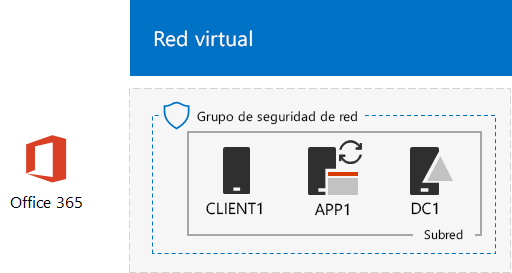

# <a name="federated-identity-for-your-office-365-devtest-environment"></a>Identidad federada para el entorno de desarrollo y prueba de Office 365

 **Resumen:** Configurar la autenticación federada para su entorno de desarrollo y prueba de Office 365.
  
Office 365 admite la identidad federada. Esto significa que, en lugar de realizar la validación de las credenciales él mismo, Office 365 dirige al usuario que se conecta a un servidor de autenticación federada en el que Office 365 confía. Si las credenciales del usuario son correctas, el servidor de autenticación federada emite un token de seguridad que el cliente envía luego a Office 365 como prueba de autenticación. La identidad federada permite la descarga y el escalado vertical de autenticación para una suscripción de Office 365 y escenarios avanzados de seguridad y autenticación.
  
En este artículo, se describe cómo puede configurar la autenticación federada para el entorno de desarrollo y prueba de Office 365, lo que se traduce en el siguiente resultado:
  
**Figura 1: Autenticación federada para el entorno de desarrollo y prueba de Office 365**


  
La configuración que se muestra en la figura 1 consta de: 
  
- Una suscripción de prueba a Office 365 E5, que expira a los 30 días de su creación.
    
- Una intranet de una organización simplificada conectada a Internet que consta de cinco máquinas virtuales en una subred de una red virtual de Azure (DC1, APP1, CLIENT1, ADFS1 y PROXY1). Azure AD Connect se ejecuta en APP1 para sincronizar la lista de cuentas del dominio de Active Directory Domain Services con Office 365. PROXY1 recibe las solicitudes de autenticación entrantes. ADFS1 valida las credenciales con DC1 y emite tokens de seguridad.
    
Existen cinco fases para configurar este entorno de desarrollo y pruebas:
  
1. Crear el entorno de desarrollo y pruebas de una empresa simulada de Office 365 con DirSync
    
2. Crear el servidor de AD FS (ADFS1)
    
3. Crear el servidor proxy web (PROXY1)
    
4. Crear un certificado autofirmado y configurar ADFS1 y PROXY1
    
5. Configurar Office 365 con identidad federada
    
Para realizar una implementación de producción de autenticación federada para Office 365 en Azure, consulte [Deploy high availability federated authentication for Office 365 in Azure](deploy-high-availability-federated-authentication-for-office-365-in-azure.md).
  
> [!NOTE]
> No puede configurar este entorno de desarrollo y prueba con una suscripción de evaluación de Azure. 
  
> [!TIP]
> Haga clic [aquí](http://aka.ms/catlgstack) para ver un mapa visual de todos los artículos en la pila de la Guía del laboratorio de pruebas de Office 365.
  
## <a name="phase-1-create-the-simulated-enterprise-office-365-devtest-environment-with-dirsync"></a>Fase 1: Crear el entorno de desarrollo y prueba de una empresa simulada de Office 365 con DirSync

Siga las instrucciones de [Sincronización de directorios para el entorno de desarrollo y pruebas de Office 365](dirsync-for-your-office-365-dev-test-environment.md) para crear el entorno de desarrollo y pruebas de una empresa simulada de Office 365 con APP1 como servidor de DirSync y la identidad sincronizada entre Office 365 y las cuentas de AD DS en DC1.
  
Después, cree un nombre de dominio DNS público en función de su nombre de dominio actual y agréguelo a su suscripción de Office 365. Se recomienda usar el nombre **testlab.**\<su dominio público>. Por ejemplo, si su nombre de dominio público es contoso.com, agregue el nombre de dominio público testlab.contoso.com.
  
Para obtener instrucciones sobre cómo crear los registros DNS correctos en su proveedor DNS y agregar el dominio a la suscripción de evaluación de Office 365, vea [Agregar usuarios y un dominio con el asistente de configuración a Office 365](https://support.office.com/article/Add-users-and-domain-to-Office-365-6383f56d-3d09-4dcb-9b41-b5f5a5efd611). 
  
Esta es la configuración resultante.
  
**Figura 2: Sincronización de directorios para el entorno de desarrollo y prueba de Office 365**


  
En la figura 2, se muestra la sincronización de directorios para el entorno de desarrollo y prueba de Office 365, que incluye Office 365 y las máquinas virtuales CLIENT1, APP1 y DC1 en una red virtual de Azure.
  
## <a name="phase-2-create-the-ad-fs-server"></a>Fase 2: Crear el servidor de AD FS

Un servidor de AD FS proporciona autenticación federada entre Office 365 y las cuentas del dominio corp.contoso.com hospedado en DC1.
  
Para crear una máquina virtual de Azure para ADFS1, indique el nombre de la suscripción y del grupo de recursos y una ubicación de Azure para la configuración básica. Después, ejecute estos comandos en el símbolo del sistema de Azure PowerShell en el equipo local.
  
```
$subscrName="<your Azure subscription name>"
$rgName="<the resource group name of your Base Configuration>"
$vnetName="TlgBaseConfig-01-VNET"
# NOTE: If you built your simulated intranet with Azure PowerShell, comment the previous line with a "#" and remove the "#" from the next line.
#$vnetName="TestLab"
Connect-AzAccount
Select-AzSubscription -SubscriptionName $subscrName
$staticIP="10.0.0.100"
$locName=(Get-AzResourceGroup -Name $rgName).Location
$vnet=Get-AzVirtualNetwork -Name $vnetName -ResourceGroupName $rgName
$pip = New-AzPublicIpAddress -Name ADFS1-PIP -ResourceGroupName $rgName -Location $locName -AllocationMethod Dynamic
$nic = New-AzNetworkInterface -Name ADFS1-NIC -ResourceGroupName $rgName -Location $locName -SubnetId $vnet.Subnets[0].Id -PublicIpAddressId $pip.Id -PrivateIpAddress $staticIP
$vm=New-AzVMConfig -VMName ADFS1 -VMSize Standard_D2_v2
$cred=Get-Credential -Message "Type the name and password of the local administrator account for ADFS1."
$vm=Set-AzVMOperatingSystem -VM $vm -Windows -ComputerName ADFS1 -Credential $cred -ProvisionVMAgent -EnableAutoUpdate
$vm=Set-AzVMSourceImage -VM $vm -PublisherName MicrosoftWindowsServer -Offer WindowsServer -Skus 2016-Datacenter -Version "latest"
$vm=Add-AzVMNetworkInterface -VM $vm -Id $nic.Id
$vm=Set-AzVMOSDisk -VM $vm -Name "ADFS-OS" -DiskSizeInGB 128 -CreateOption FromImage -StorageAccountType "Standard_LRS"
New-AzVM -ResourceGroupName $rgName -Location $locName -VM $vm
```
<!--
> [!TIP]
> Click [here](https://gallery.technet.microsoft.com/PowerShell-commands-for-f79bc2c2?redir=0) for a text file that has all the PowerShell commands in this article.
-->
  
Después, vaya a [Azure Portal](http://portal.azure.com) para conectarse a la máquina virtual de ADFS1 con el nombre y contraseña de la cuenta de administrador local de ADFS1 y abra un símbolo del sistema de Windows PowerShell.
  
Para comprobar la comunicación de red y la resolución de nombres entre ADFS1 y DC1, ejecute el comando **ping dc1.corp.contoso.com** y compruebe que hay cuatro respuestas.
  
A continuación, una la máquina virtual de ADFS1 al dominio CORP con estos comandos en un símbolo del sistema de Windows PowerShell en ADFS1.
  
```
$cred=Get-Credential -UserName "CORP\User1" -Message "Type the User1 account password."
Add-Computer -DomainName corp.contoso.com -Credential $cred
Restart-Computer
```

Esta es la configuración resultante.
  
**Figura 3: Adición del servidor de AD FS**


  
En la figura 3, se muestra la adición del servidor de ADFS1 a DirSync para el entorno de desarrollo y prueba de Office 365.
  
## <a name="phase-3-create-the-web-proxy-server"></a>Fase 3: Crear el servidor proxy web

PROXY1 permite crear conexiones proxy de mensajes de autenticación entre usuarios que intentan autenticarse y ADFS1.
  
Para crear una máquina virtual de Azure para PROXY1, indique el nombre de su grupo de recursos y una ubicación de Azure y, después, ejecute estos comandos en el símbolo del sistema de Azure PowerShell en el equipo local.
  
```
$rgName="<the resource group name of your Base Configuration>"
$vnetName="TlgBaseConfig-01-VNET"
# NOTE: If you built your simulated intranet with Azure PowerShell, comment the previous line with a "#" and remove the "#" from the next line.
#$vnetName="TestLab"
$staticIP="10.0.0.101"
$locName=(Get-AzResourceGroup -Name $rgName).Location
$vnet=Get-AzVirtualNetwork -Name $vnetName -ResourceGroupName $rgName
$pip = New-AzPublicIpAddress -Name PROXY1-PIP -ResourceGroupName $rgName -Location $locName -AllocationMethod Static
$nic = New-AzNetworkInterface -Name PROXY1-NIC -ResourceGroupName $rgName -Location $locName -SubnetId $vnet.Subnets[0].Id -PublicIpAddressId $pip.Id -PrivateIpAddress $staticIP
$vm=New-AzVMConfig -VMName PROXY1 -VMSize Standard_D2_v2
$cred=Get-Credential -Message "Type the name and password of the local administrator account for PROXY1."
$vm=Set-AzVMOperatingSystem -VM $vm -Windows -ComputerName PROXY1 -Credential $cred -ProvisionVMAgent -EnableAutoUpdate
$vm=Set-AzVMSourceImage -VM $vm -PublisherName MicrosoftWindowsServer -Offer WindowsServer -Skus 2016-Datacenter -Version "latest"
$vm=Add-AzVMNetworkInterface -VM $vm -Id $nic.Id
$vm=Set-AzVMOSDisk -VM $vm -Name "PROXY1-OS" -DiskSizeInGB 128 -CreateOption FromImage -StorageAccountType "Standard_LRS"
New-AzVM -ResourceGroupName $rgName -Location $locName -VM $vm
```

> [!NOTE]
> PROXY1 se asigna como una dirección IP pública estática porque creará un registro DNS público que la señale y no debe cambiarse cuando reinicie la máquina virtual de PROXY1. 
  
Después, agregue una regla al grupo de seguridad de red para que la subred CorpNet permita tráfico entrante no solicitado desde Internet a la dirección IP privada de PROXY1 y al puerto TCP 443. Ejecute estos comandos desde el símbolo del sistema de Azure PowerShell en su equipo local.
  
```
$rgName="<the resource group name of your Base Configuration>"
Get-AzNetworkSecurityGroup -Name CorpNet -ResourceGroupName $rgName | Add-AzNetworkSecurityRuleConfig -Name "HTTPS-to-PROXY1" -Description "Allow TCP 443 to PROXY1" -Access "Allow" -Protocol "Tcp" -Direction "Inbound" -Priority 101 -SourceAddressPrefix "Internet" -SourcePortRange "*" -DestinationAddressPrefix "10.0.0.101" -DestinationPortRange "443" | Set-AzNetworkSecurityGroup
```

Después, use [Azure Portal](http://portal.azure.com) para conectarse a la máquina virtual de PROXY1 con el nombre y contraseña de la cuenta de administrador local de PROXY1 y luego abra un símbolo del sistema de Windows PowerShell en PROXY1.
  
Para comprobar la comunicación de red y la resolución de nombres entre PROXY1 y DC1, ejecute el comando **ping dc1.corp.contoso.com** y compruebe que hay cuatro respuestas.
  
A continuación, una la máquina virtual de PROXY1 al dominio CORP con estos comandos en un símbolo del sistema de Windows PowerShell en PROXY1.
  
```
$cred=Get-Credential -UserName "CORP\User1" -Message "Type the User1 account password."
Add-Computer -DomainName corp.contoso.com -Credential $cred
Restart-Computer
```

Muestre la dirección IP pública de PROXY1 con estos comandos de Azure PowerShell en el equipo local:
  
```
Write-Host (Get-AzPublicIpaddress -Name "PROXY1-PIP" -ResourceGroup $rgName).IPAddress
```

Después, trabaje con su proveedor de DNS público y cree un nuevo registro DNS A público para **fs.testlab.**\<su nombre de dominio DNS> que se resuelva en la dirección IP mostrada mediante el comando **Write-Host**. En lo sucesivo, se hace referencia a **fs.testlab.**\<su nombre de dominio DNS> como el FQDN del *Servicio de federación*.
  
Después, use [Azure Portal](http://portal.azure.com) para conectarse a la máquina virtual de DC1 con las credenciales de CORP\\User1 y ejecute los siguientes comandos en un símbolo del sistema de Windows PowerShell con nivel de administrador:
  
```
Add-DnsServerPrimaryZone -Name corp.contoso.com -ZoneFile corp.contoso.com.dns
Add-DnsServerResourceRecordA -Name "fs" -ZoneName corp.contoso.com -AllowUpdateAny -IPv4Address "10.0.0.100" -TimeToLive 01:00:00
```
Estos comandos crean un registro DNS A interno para que las máquinas virtuales de la red virtual de Azure pueden resolver el FQDN interno de la federación en la dirección IP privada de ADFS1.
  
Este es el resultado de la configuración.
  
**Figura 4: Adición del servidor proxy de aplicación web**


  
En la figura 4, se muestra la adición del servidor PROXY1.
  
## <a name="phase-4-create-a-self-signed-certificate-and-configure-adfs1-and-proxy1"></a>Fase 4: Crear un certificado autofirmado y configurar ADFS1 y PROXY1

En esta fase, crea un certificado digital autofirmado para su FQDN del Servicio de federación y configura ADFS1 y PROXY1 como una granja de servidores de AD FS.
  
En primer lugar, use [Azure Portal](http://portal.azure.com) para conectarse a la máquina virtual de DC1 con las credenciales de CORP\\User1 y luego abra un símbolo del sistema de Windows PowerShell con nivel de administrador. 
  
Después, cree una cuenta de servicio de AD FS con este comando en el símbolo del sistema de Windows PowerShell en DC1:
  
```
New-ADUser -SamAccountName ADFS-Service -AccountPassword (read-host "Set user password" -assecurestring) -name "ADFS-Service" -enabled $true -PasswordNeverExpires $true -ChangePasswordAtLogon $false
```

Tenga en cuenta que este comando le solicita que proporcione la contraseña de la cuenta. Elija una contraseña segura y guárdela en una ubicación segura. La necesitará para esta fase y para la fase 5.
  
Use [Azure Portal](http://portal.azure.com) para conectarse a la máquina virtual de ADFS1 con las credenciales de CORP\\User1. Abra un símbolo del sistema de Windows PowerShell con nivel de administrador en ADFS1, indique el FQDN del Servicio de federación y luego ejecute estos comandos para crear un certificado autofirmado:
  
```
$fedServiceFQDN="<federation service FQDN>"
New-SelfSignedCertificate -DnsName $fedServiceFQDN -CertStoreLocation "cert:\LocalMachine\My"
New-Item -path c:\Certs -type directory
New-SmbShare -name Certs -path c:\Certs -changeaccess CORP\User1
```

Después, use estos pasos para guardar el nuevo certificado autofirmado como archivo.
  
1. Haga clic en **Inicio**, escriba**mmc.exe** y presione **Entrar**.
    
2. Haga clic en **Archivo > Agregar o quitar complemento**.
    
3. En **Agregar o quitar complementos**, haga doble clic en **Certificados** en la lista de complementos disponibles, haga clic en **Cuenta de equipo** y luego en **Siguiente**.
    
4. En **Seleccionar equipo**, haga clic en **Finalizar** y luego en **Aceptar**.
    
5. En el panel de árbol, abra **Certificados (equipo local) > Personal > Certificados**.
    
6. Haga clic con el botón derecho en el certificado con su FQDN del Servicio de federación, haga clic en **Todas las tareas** y luego en **Exportar**.
    
7. En la página de **bienvenida**, haga clic en **Siguiente**.
    
8. En la página **Exportar clave privada**, haga clic en **Sí** y luego en **Siguiente**.
    
9. En la página **Formato de archivo de exportación**, haga clic en **Exportar todas las propiedades extendidas** y luego en **Siguiente**.
    
10. En la página **Seguridad**, haga clic en **Contraseña** y escriba una contraseña en **Contraseña** y **Confirmar contraseña**.
    
11. En la página **Archivo que se va a exportar**, haga clic en **Examinar**.
    
12. Vaya a la carpeta **C:\\Certs**, escriba **SSL** en **Nombre de archivo** y luego haga clic en **Guardar**.
    
13. En la página **Archivo que se va a exportar**, haga clic en **Siguiente**.
    
14. En la página **Finalización del Asistente para exportación de certificados**, haga clic en **Finalizar**. Cuando se le solicite, haga clic en **Aceptar**.
    
Después, instale el servicio de AD FS con este comando en el símbolo del sistema de Windows PowerShell en ADFS1:
  
```
Install-WindowsFeature ADFS-Federation -IncludeManagementTools
```

Espere a que termine la instalación.
  
Después, configure el servicio de AD FS con estos pasos:
  
1. Haga clic en **Inicio** y luego en el icono **Administrador de servidores**.
    
2. En el panel de árbol del Administrador de servidores, haga clic en **AD FS**.
    
3. En la barra de herramientas de la parte superior, haga clic en el símbolo de advertencia naranja y luego en **Configure el servicio de federación en este servidor**.
    
4. En la página **principal** del Asistente para la configuración de los Servicios de federación de Active Directory, haga clic en **Siguiente**.
    
5. En la página **Conectarse a AD DS**, haga clic en **Siguiente**.
    
6. En la página **Especificar propiedades del servicio**:
    
  - En **Certificado SSL**, haga clic en la flecha abajo y luego en el certificado con el nombre del FQDN del Servicio de federación.
    
  - En **Nombre para mostrar del Servicio de federación**, escriba el nombre de la organización ficticia.
    
  - Haga clic en **Siguiente**.
    
7. En la página **Especificar cuenta de servicio**, haga clic en **Seleccionar** para **Nombre de cuenta**.
    
8. En **Seleccionar usuario o cuenta de servicio**, escriba **Servicio ADFS**, haga clic en **Comprobar nombres** y luego en **Aceptar**.
    
9. En **Contraseña de cuenta**, escriba la contraseña para la cuenta del servicio ADFS y luego en **Siguiente**.
    
10. En la página **Especificar base de datos de configuración**, haga clic en **Siguiente**.
    
11. En la página **Revisar opciones**, haga clic en **Siguiente**.
    
12. En la página **Comprobaciones de requisitos previos**, haga clic en **Configurar**.
    
13. En la página **Resultados**, haga clic en **Cerrar**.
    
14. Haga clic en **Inicio**, en el icono de encendido/apagado, en **Reiniciar** y luego en **Continuar**.
    
Desde [Azure Portal](http://portal.azure.com), conéctese a PROXY1 con las credenciales de la cuenta CORP\\User1.
  
Después, siga estos pasos para instalar el certificado autofirmado y configurar PROXY1.
  
1. Haga clic en **Inicio**, escriba**mmc.exe** y presione **Entrar**.
    
2. Haga clic en **Archivo > Agregar o quitar complemento**.
    
3. En **Agregar o quitar complementos**, haga doble clic en **Certificados** en la lista de complementos disponibles, haga clic en **Cuenta de equipo** y luego en **Siguiente**.
    
4. En **Seleccionar equipo**, haga clic en **Finalizar** y luego en **Aceptar**.
    
5. En el panel de árbol, abra **Certificados (equipo local) > Personal > Certificados**.
    
6. Haga clic con el botón derecho en **Personal**, haga clic en **Todas las tareas** y luego en **Importar**.
    
7. En la página de **bienvenida**, haga clic en **Siguiente**.
    
8. En la página **Archivo para importar**, escriba **\\\\adfs1\\certs\\ssl.pfx** y luego haga clic en **Siguiente**.
    
9. En la página **Protección de clave privada**, escriba la contraseña de certificado en **Contraseña** y luego haga clic en **Siguiente**.
    
10. En la página **Almacén de certificados**, haga clic en **Siguiente**.
    
11. En la página **Completando**, haga clic en **Finalizar**.
    
12. En la página **Almacén de certificados**, haga clic en **Siguiente**.
    
13. Cuando se le solicite, haga clic en **Aceptar**.
    
14. Haga clic en **Certificados** en el panel de árbol.
    
15. Haga clic con el botón derecho en el certificado y luego haga clic en **Copiar**.
    
16. En el panel de árbol, abra **Entidades de certificación raíz de confianza > Certificados**.
    
17. Mueva el puntero del mouse debajo de la lista de certificados instalados, haga clic con el botón derecho y luego haga clic en **Pegar**.
    
Abra un símbolo del sistema de PowerShell con el nivel de administrador y ejecute el comando siguiente:
  
```
Install-WindowsFeature Web-Application-Proxy -IncludeManagementTools
```

Espere a que termine la instalación.
  
Use estos pasos para configurar el servicio proxy de aplicación web para usar ADFS1 como su servidor de federación:
  
1. Haga clic en **Iniciar** y luego en **Administrador del servidor**.
    
2. En el panel de árbol, haga clic en **Acceso remoto**.
    
3. En la barra de herramientas de la parte superior, haga clic en el símbolo de advertencia naranja y luego en **Abrir el Asistente para proxy de aplicación web**.
    
4. En la página **principal** del Asistente para configuración de Proxy de aplicación web, haga clic en **Siguiente**.
    
5. En la página **Servidor de federación**:
    
  - Escriba su FQDN del Servicio de federación en **Nombre del Servicio de federación**.
    
  - Escriba **CORP\\User1** en **Nombre de usuario**.
    
  - Escriba la contraseña de la cuenta User1 en **Contraseña**.
    
  - Haga clic en **Siguiente**.
    
6. En la página **Certificado de proxy de AD FS**, haga clic en la flecha abajo, en el certificado con su FQDN del Servicio de federación y luego en **Siguiente**.
    
7. En la página **Confirmación**, haga clic en **Configurar**.
    
8. En la página **Resultados**, haga clic en **Cerrar**.
    
## <a name="phase-5-configure-office-365-for-federated-identity"></a>Fase 5: Configurar Office 365 con identidad federada

Use [Azure Portal](http://portal.azure.com) para conectarse a la máquina virtual de APP1 con las credenciales de la cuenta CORP\\User1.
  
Siga estos pasos para configurar Azure AD Connect y la suscripción de Office 365 con autenticación federada:
  
1. En el escritorio, haga doble clic en **Azure AD Connect**.
    
2. En la página **Bienvenido a Azure AD Connect**, haga clic en **Configurar**.
    
3. En la página **Tareas adicionales**, haga clic en **Cambiar inicio de sesión de usuario** y luego en **Siguiente**.
    
4. En la página **Conectar con Azure AD**, escriba el nombre y contraseña de la cuenta de administrador global de Office 365 y luego haga clic en **Siguiente**.
    
5. En la página **Inicio de sesión de usuario**, haga clic en **Federación con AD FS** y luego en **Siguiente**.
    
6. En la página **Granja de AD FS**, haga clic en **Usar una granja de AD FS**, escriba **ADFS1** en **Nombre del servidor** y luego haga clic en **Siguiente**.
    
7. Cuando le soliciten las credenciales del servidor, escriba las credenciales de la cuenta CORP\\User1 y luego haga clic en **Aceptar**.
    
8. En la página de credenciales **Administrador de dominio**, escriba **CORP\\User1** en **Nombre de usuario** y la contraseña de la cuenta en **Contraseña** y luego haga clic en **Siguiente**.
    
9. En la página **Cuenta del servicio AD FS**, escriba **CORP\\ADFS-Service** en **Nombre de usuario de dominio** y la contraseña de la cuenta en **Contraseña de usuario de dominio** y luego haga clic en **Siguiente**.
    
10. En la página **Dominio de Azure AD**, en **Dominio**, seleccione el nombre del dominio que ha creado y agregado anteriormente a la suscripción de Office 365 en la fase 1 y, después, haga clic en **Siguiente**.
    
11. En la página **Listo para configurar**, haga clic en **Configurar**.
    
12. En la página **Instalación completada**, haga clic en **Comprobar**.
    
    Debe ver mensajes que indican que tanto la configuración de Internet como la de la intranet se han comprobado.
    
13. En la página **Instalación completada**, haga clic en **Salir**.
    
Para demostrar que la autenticación federada funciona:
  
1. Abra una nueva instancia privada del explorador en el equipo local y vaya a[https://admin.microsoft.com](https://admin.microsoft.com).
    
2. Para obtener las credenciales de inicio de sesión, escriba **user1@**\<el dominio que creado en la fase 1>. 
    
    Por ejemplo, si el dominio de prueba es **testlab.contoso.com**, escribirá «user1@testlab.contoso.com». Presione TAB o permita que Office 365 le redirija automáticamente.
    
    Ahora debe ver una página **Su conexión no es privada**. Está viendo esto porque ha instalado un certificado autofirmado en ADFS1 que su equipo de escritorio no puede validar. En una implementación de producción de autenticación federada, usará un certificado de una entidad de certificación de confianza y sus usuarios no verán esta página.
    
3. En la página **Su conexión no es privada**, haga clic en **Avanzadas** y luego en **Continuar con \<su FQDN del Servicio de federación>**. 
    
4. En la página con el nombre de su organización ficticia, inicie sesión con lo siguiente:
    
  - **CORP\\User1** como nombre
    
  - Contraseña de la cuenta User1
    
    Debe ver la página **principal de Microsoft Office**.
    
En este procedimiento, se muestra que su suscripción de prueba de Office 365 está federada con el dominio corp.contoso.com de AD DS hospedado en DC1. Estos son los conceptos básicos del proceso de autenticación:
  
1. Cuando use el dominio federado que ha creado en la fase 1 en el nombre de cuenta de inicio de sesión, Office 365 redirige su explorador al FQDN del Servicio de federación y a PROXY1.
    
2. PROXY1 envía a su equipo local la página de inicio de sesión de la compañía ficticia.
    
3. Cuando envía CORP\\User1 y la contraseña a PROXY1, estos se reenvían a ADFS1.
    
4. ADFS1 valida CORP\\User1 y la contraseña con DC1 y envía a su equipo local un token de seguridad.
    
5. El equipo local envía el token de seguridad a Office 365.
    
6. Office 365 valida que ese token de seguridad se haya creado mediante ADFS1 y permite el acceso.
    
Su suscripción de evaluación de Office 365 ahora está configurada con la autenticación federada. Puede usar este entorno de desarrollo y prueba para escenarios de autenticación avanzados.
  
## <a name="next-step"></a>Paso siguiente

Cuando esté listo para implementar la autenticación federada de alta disponibilidad preparada para producción de Office 365 en Azure, consulte [Deploy high availability federated authentication for Office 365 in Azure](deploy-high-availability-federated-authentication-for-office-365-in-azure.md).
  
## <a name="see-also"></a>Vea también

[Guías del laboratorio de pruebas de adopción de la nube (TLG)](cloud-adoption-test-lab-guides-tlgs.md)
  
[Entorno de desarrollo y pruebas de la configuración básica](base-configuration-dev-test-environment.md)
  
[Entorno de desarrollo y prueba de Office 365](office-365-dev-test-environment.md)
  
[Adopción de la nube y soluciones híbridas](cloud-adoption-and-hybrid-solutions.md)
  
[Implementar la autenticación federada de alta disponibilidad para Office 365 en Azure](deploy-high-availability-federated-authentication-for-office-365-in-azure.md)


