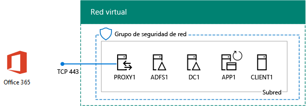
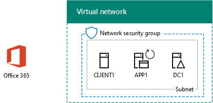
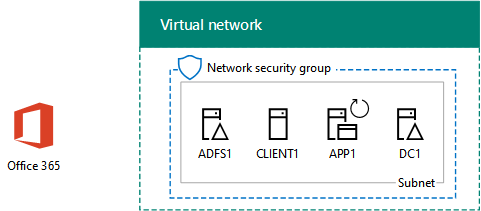

# <a name="federated-identity-for-your-office-365-devtest-environment"></a><span data-ttu-id="f7318-103">Identidad federada para el entorno de desarrollo y pruebas de Office 365</span><span class="sxs-lookup"><span data-stu-id="f7318-103">Federated identity for your Office 365 dev/test environment</span></span>

 <span data-ttu-id="f7318-104">**Resumen:** Configurar la autenticación federada para su entorno de pruebas y desarrollo de Office 365.</span><span class="sxs-lookup"><span data-stu-id="f7318-104">**Summary:** Configure federated authentication for your Office 365 dev/test environment.</span></span>
  
<span data-ttu-id="f7318-p101">Office 365 admite la identidad federada. Esto significa que en lugar de realizar la validación de las credenciales de sí mismo, Office 365 se refiere el usuario que se conecta a un servidor de autenticación federados que confía en Office 365. Si las credenciales del usuario son correctas, el servidor de autenticación federada emite un token de seguridad que el cliente envía a Office 365 como prueba de la autenticación. Identidad federada permite la descarga y el escalado de autenticación para una suscripción de Office 365 y escenarios avanzados de autenticación y seguridad.</span><span class="sxs-lookup"><span data-stu-id="f7318-p101">Office 365 supports federated identity. This means that instead of performing the validation of credentials itself, Office 365 refers the connecting user to a federated authentication server that Office 365 trusts. If the user's credentials are correct, the federated authentication server issues a security token that the client then sends to Office 365 as proof of authentication. Federated identity allows for the offloading and scaling up of authentication for an Office 365 subscription and advanced authentication and security scenarios.</span></span>
  
<span data-ttu-id="f7318-109">En este artículo, se describe cómo puede configurar la autenticación federada para el entorno de desarrollo y pruebas de Office 365, lo que proporciona el siguiente resultado:</span><span class="sxs-lookup"><span data-stu-id="f7318-109">This article describes how you can configure federated authentication for the Office 365 dev/test environment, resulting in the following:</span></span>
  
<span data-ttu-id="f7318-110">**Figura 1: La autenticación federada para el entorno de desarrollo y prueba de Office 365**</span><span class="sxs-lookup"><span data-stu-id="f7318-110">**Figure 1: The federated authentication for Office 365 dev/test environment**</span></span>


  
<span data-ttu-id="f7318-112">La configuración que se muestra en la figura 1 consta de: </span><span class="sxs-lookup"><span data-stu-id="f7318-112">The configuration shown in Figure 1 consists of:</span></span> 
  
- <span data-ttu-id="f7318-113">Una suscripción de prueba a Office 365 E5, que expira a los 30 días de su creación.</span><span class="sxs-lookup"><span data-stu-id="f7318-113">An Office 365 E5 Trial Subscription, which expires 30 days from when you create it.</span></span>
    
- <span data-ttu-id="f7318-p102">Una intranet de una organización simplificada conectada a Internet, que consta de cinco máquinas virtuales en una subred de una red virtual de Azure (DC1, APP1, CLIENT1, ADFS1 y PROXY1). Azure AD Connect se ejecuta en APP1 para sincronizar la lista de cuentas del dominio de Windows Server AD con Office 365. PROXY1 recibe las solicitudes de autenticación entrantes. ADFS1 valida las credenciales con DC1 y emite tokens de seguridad.</span><span class="sxs-lookup"><span data-stu-id="f7318-p102">A simplified organization intranet connected to the Internet, consisting of five virtual machines on a subnet of an Azure virtual network (DC1, APP1, CLIENT1, ADFS1, and PROXY1). Azure AD Connect runs on APP1 to synchronize the list of accounts in the Windows Server AD domain to Office 365. PROXY1 receives the incoming authentication requests. ADFS1 validates credentials with DC1 and issues security tokens.</span></span>
    
<span data-ttu-id="f7318-118">Existen cinco fases para configurar este entorno de desarrollo y pruebas:</span><span class="sxs-lookup"><span data-stu-id="f7318-118">There are five phases to setting up this dev/test environment:</span></span>
  
1. <span data-ttu-id="f7318-119">Crear el entorno de desarrollo y pruebas de una empresa simulada de Office 365 con DirSync</span><span class="sxs-lookup"><span data-stu-id="f7318-119">Create the simulated enterprise Office 365 dev/test environment with DirSync.</span></span>
    
2. <span data-ttu-id="f7318-120">Crear el servidor de AD FS (ADFS1)</span><span class="sxs-lookup"><span data-stu-id="f7318-120">Create the AD FS server (ADFS1).</span></span>
    
3. <span data-ttu-id="f7318-121">Crear el servidor proxy web (PROXY1)</span><span class="sxs-lookup"><span data-stu-id="f7318-121">Create the web proxy server (PROXY1).</span></span>
    
4. <span data-ttu-id="f7318-122">Crear un certificado autofirmado y configurar ADFS1 y PROXY1</span><span class="sxs-lookup"><span data-stu-id="f7318-122">Create a self-signed certificate and configure ADFS1 and PROXY1.</span></span>
    
5. <span data-ttu-id="f7318-123">Configuración de Office 365 para la identidad federada</span><span class="sxs-lookup"><span data-stu-id="f7318-123">Configure Office 365 for federated identity.</span></span>
    
<span data-ttu-id="f7318-124">Para avanzar en la implementación de producción de autenticación federada para Office 365 en Azure, consulte [autenticación federados de alta disponibilidad de implementación para Office 365 en Azure](deploy-high-availability-federated-authentication-for-office-365-in-azure.md).</span><span class="sxs-lookup"><span data-stu-id="f7318-124">To step through a production deployment of federated authentication for Office 365 in Azure, see [Deploy high availability federated authentication for Office 365 in Azure](deploy-high-availability-federated-authentication-for-office-365-in-azure.md).</span></span>
  
> [!NOTE]
> <span data-ttu-id="f7318-125">No puede configurar este entorno de desarrollo y pruebas con una suscripción de prueba de Azure.</span><span class="sxs-lookup"><span data-stu-id="f7318-125">You cannot configure this dev/test environment with an Azure Trial subscription.</span></span> 
  
> [!TIP]
> <span data-ttu-id="f7318-126">Haga clic [aquí](http://aka.ms/catlgstack) para ver un mapa visual para todos los artículos de la pila de una guía de laboratorio de prueba de nube de Microsoft.</span><span class="sxs-lookup"><span data-stu-id="f7318-126">Click [here](http://aka.ms/catlgstack) for a visual map to all the articles in the One Microsoft Cloud Test Lab Guide stack.</span></span>
  
## <a name="phase-1-create-the-simulated-enterprise-office-365-devtest-environment-with-dirsync"></a><span data-ttu-id="f7318-127">Fase 1: Crear el entorno de desarrollo y pruebas de una empresa simulada de Office 365 con DirSync</span><span class="sxs-lookup"><span data-stu-id="f7318-127">Phase 1: Create the simulated enterprise Office 365 dev/test environment with DirSync</span></span>

<span data-ttu-id="f7318-128">Siga las instrucciones de [sincronización de directorios para el entorno de desarrollo y prueba de Office 365](dirsync-for-your-office-365-dev-test-environment.md) para crear el entorno de desarrollo/pruebas simuladas enterprise Office 365 con APP1 como el servidor de sincronización de directorios y sincronizar identidades entre Office 365 y el Cuentas de Windows Server AD en DC1.</span><span class="sxs-lookup"><span data-stu-id="f7318-128">Follow the instructions in [Directory synchronization for your Office 365 dev/test environment](dirsync-for-your-office-365-dev-test-environment.md) to create the simulated enterprise Office 365 dev/test environment with APP1 as the DirSync server and synchronized identity between Office 365 and the Windows Server AD accounts on DC1.</span></span>
  
<span data-ttu-id="f7318-p103">A continuación, crear un nuevo nombre de dominio DNS público basado en su nombre de dominio actual y agregarlo a su suscripción de Office 365. Se recomienda utilizar el nombre **práctica de prueba.** \<el dominio público >. Por ejemplo, si el nombre de dominio público es contoso.com, agregue el testlab.contoso.com de nombre de dominio público.</span><span class="sxs-lookup"><span data-stu-id="f7318-p103">Next, create a new public DNS domain name based on your current domain name and add it to your Office 365 subscription. We recommend using the name **testlab.**\<your public domain>. For example, if your public domain name is contoso.com, add the public domain name testlab.contoso.com.</span></span>
  
<span data-ttu-id="f7318-132">Para obtener instrucciones sobre cómo crear los registros DNS correctos en tu proveedor de DNS y agregue el dominio a su suscripción de prueba de Office 365, consulte [Adición de usuarios y dominio a Office 365](https://support.office.com/article/Add-users-and-domain-to-Office-365-6383f56d-3d09-4dcb-9b41-b5f5a5efd611).</span><span class="sxs-lookup"><span data-stu-id="f7318-132">For instructions on how to create the correct DNS records in your DNS provider and add the domain to your Office 365 trial subscription, see [Add users and domain to Office 365](https://support.office.com/article/Add-users-and-domain-to-Office-365-6383f56d-3d09-4dcb-9b41-b5f5a5efd611).</span></span> 
  
<span data-ttu-id="f7318-133">Esta es la configuración resultante.</span><span class="sxs-lookup"><span data-stu-id="f7318-133">Here is your resulting configuration.</span></span>
  
<span data-ttu-id="f7318-134">**Figura 2: Sincronización de directorios para el entorno de desarrollo y prueba de Office 365**</span><span class="sxs-lookup"><span data-stu-id="f7318-134">**Figure 2: Directory synchronization for the Office 365 dev/test environment**</span></span>


  
<span data-ttu-id="f7318-136">La figura 2 muestra la synchronizationc de directorio para el entorno de desarrollo y prueba de Office 365, que incluye Office 365 y CLIENTE1, APP1 y DC1 máquinas virtuales en una red virtual de Azure.</span><span class="sxs-lookup"><span data-stu-id="f7318-136">Figure 2 shows the directory synchronizationc for Office 365 dev/test environment, which includes Office 365 and CLIENT1, APP1, and DC1 virtual machines in an Azure virtual network.</span></span>
  
## <a name="phase-2-create-the-ad-fs-server"></a><span data-ttu-id="f7318-137">Fase 2: Crear el servidor de AD FS</span><span class="sxs-lookup"><span data-stu-id="f7318-137">Phase 2: Create the AD FS server</span></span>

<span data-ttu-id="f7318-138">Un servidor de AD FS proporciona autenticación federada entre Office 365 y las cuentas del dominio corp.contoso.com hospedado en DC1.</span><span class="sxs-lookup"><span data-stu-id="f7318-138">An AD FS server provides federated authentication between Office 365 and the accounts in the corp.contoso.com domain hosted on DC1.</span></span>
  
<span data-ttu-id="f7318-139">Para crear una máquina virtual Azure para ADFS1, proporcione el nombre de la suscripción y el grupo de recursos y la ubicación Azure para su configuración de Base y, a continuación, ejecutar estos comandos en el símbolo del sistema de PowerShell de Azure en el equipo local.</span><span class="sxs-lookup"><span data-stu-id="f7318-139">To create an Azure virtual machine for ADFS1, fill in the name of your subscription and the resource group and Azure location for your Base Configuration, and then run these commands at the Azure PowerShell command prompt on your local computer.</span></span>
  
```
$subscr="<your Azure subscription name>"
$rgName="<the resource group name of your Base Configuration>"
Login-AzureRMAccount
Get-AzureRmSubscription -SubscriptionName $subscr | Select-AzureRmSubscription
$staticIP="10.0.0.100"
$locName=(Get-AzureRmResourceGroup -Name $rgName).Location
$vnet=Get-AzureRMVirtualNetwork -Name TestLab -ResourceGroupName $rgName
$pip = New-AzureRMPublicIpAddress -Name ADFS1-PIP -ResourceGroupName $rgName -Location $locName -AllocationMethod Dynamic
$nic = New-AzureRMNetworkInterface -Name ADFS1-NIC -ResourceGroupName $rgName -Location $locName -SubnetId $vnet.Subnets[0].Id -PublicIpAddressId $pip.Id -PrivateIpAddress $staticIP
$vm=New-AzureRMVMConfig -VMName ADFS1 -VMSize Standard_D2_v2
$cred=Get-Credential -Message "Type the name and password of the local administrator account for ADFS1."
$vm=Set-AzureRMVMOperatingSystem -VM $vm -Windows -ComputerName ADFS1 -Credential $cred -ProvisionVMAgent -EnableAutoUpdate
$vm=Set-AzureRMVMSourceImage -VM $vm -PublisherName MicrosoftWindowsServer -Offer WindowsServer -Skus 2016-Datacenter -Version "latest"
$vm=Add-AzureRMVMNetworkInterface -VM $vm -Id $nic.Id
$vm=Set-AzureRmVMOSDisk -VM $vm -Name "ADFS-OS" -DiskSizeInGB 128 -CreateOption FromImage -StorageAccountType "StandardLRS"
New-AzureRMVM -ResourceGroupName $rgName -Location $locName -VM $vm
```

> [!TIP]
> <span data-ttu-id="f7318-140">Haga clic [aquí](https://gallery.technet.microsoft.com/PowerShell-commands-for-f79bc2c2?redir=0) para un archivo de texto que contiene todos los comandos de PowerShell en este artículo.</span><span class="sxs-lookup"><span data-stu-id="f7318-140">Click [here](https://gallery.technet.microsoft.com/PowerShell-commands-for-f79bc2c2?redir=0) for a text file that contains all the PowerShell commands in this article.</span></span>
  
<span data-ttu-id="f7318-141">A continuación, utilizar el [portal de Azure](http://portal.azure.com) para conectarse a la máquina virtual de ADFS1 con el nombre de la cuenta Administrador local ADFS1 y la contraseña y, a continuación, abra un símbolo del sistema de Windows PowerShell.</span><span class="sxs-lookup"><span data-stu-id="f7318-141">Next, use the [Azure portal](http://portal.azure.com) to connect to the ADFS1 virtual machine using the ADFS1 local administrator account name and password, and then open a Windows PowerShell command prompt.</span></span>
  
<span data-ttu-id="f7318-142">Para comprobar la comunicación de red y de resolución de nombre entre ADFS1 y DC1, ejecute el comando **ping dc1.corp.contoso.com** y compruebe que hay cuatro respuestas.</span><span class="sxs-lookup"><span data-stu-id="f7318-142">To check name resolution and network communication between ADFS1 and DC1, run the **ping dc1.corp.contoso.com** command and verify that there are four replies.</span></span>
  
<span data-ttu-id="f7318-143">A continuación, una la máquina virtual de ADFS1 al dominio CORP con estos comandos en un símbolo del sistema de Windows PowerShell en ADFS1.</span><span class="sxs-lookup"><span data-stu-id="f7318-143">Next, join the ADFS1 virtual machine to the CORP domain with these commands at the Windows PowerShell prompt on ADFS1.</span></span>
  
```
$cred=Get-Credential -UserName "CORP\User1" -Message "Type the User1 account password."
Add-Computer -DomainName corp.contoso.com -Credential $cred
Restart-Computer
```

<span data-ttu-id="f7318-144">Esta es la configuración resultante.</span><span class="sxs-lookup"><span data-stu-id="f7318-144">Here is your resulting configuration.</span></span>
  
<span data-ttu-id="f7318-145">**Figura 3: Agregar el servidor de AD FS**</span><span class="sxs-lookup"><span data-stu-id="f7318-145">**Figure 3: Adding the AD FS server**</span></span>


  
<span data-ttu-id="f7318-147">En la figura 3, se muestra la adición del servidor de ADFS1 a DirSync para el entorno de desarrollo y pruebas de Office 365.</span><span class="sxs-lookup"><span data-stu-id="f7318-147">Figure 3 shows the addition of the ADFS1 server to the DirSync for Office 365 dev/test environment.</span></span>
  
## <a name="phase-3-create-the-web-proxy-server"></a><span data-ttu-id="f7318-148">Fase 3: Crear el servidor proxy web</span><span class="sxs-lookup"><span data-stu-id="f7318-148">Phase 3: Create the web proxy server</span></span>

<span data-ttu-id="f7318-149">PROXY1 proporciona crear conexiones proxy de mensajes de autenticación entre usuarios que intentan autenticarse y ADFS1.</span><span class="sxs-lookup"><span data-stu-id="f7318-149">PROXY1 provides proxying of authentication messages between users attempting to authenticate and ADFS1.</span></span>
  
<span data-ttu-id="f7318-150">Para crear una máquina virtual de Azure para PROXY1, indique el nombre de su grupo de recursos y una ubicación de Azure y, después, ejecute estos comandos en el símbolo del sistema de Azure PowerShell en el equipo local.</span><span class="sxs-lookup"><span data-stu-id="f7318-150">To create an Azure virtual machine for PROXY1, fill in the name of your resource group and Azure location, and then run these commands at the Azure PowerShell command prompt on your local computer.</span></span>
  
```
$rgName="<the resource group name of your Base Configuration>"
$staticIP="10.0.0.101"
$locName=(Get-AzureRmResourceGroup -Name $rgName).Location
$vnet=Get-AzureRMVirtualNetwork -Name TestLab -ResourceGroupName $rgName
$pip = New-AzureRMPublicIpAddress -Name PROXY1-PIP -ResourceGroupName $rgName -Location $locName -AllocationMethod Static
$nic = New-AzureRMNetworkInterface -Name PROXY1-NIC -ResourceGroupName $rgName -Location $locName -SubnetId $vnet.Subnets[0].Id -PublicIpAddressId $pip.Id -PrivateIpAddress $staticIP
$vm=New-AzureRMVMConfig -VMName PROXY1 -VMSize Standard_D2_v2
$cred=Get-Credential -Message "Type the name and password of the local administrator account for PROXY1."
$vm=Set-AzureRMVMOperatingSystem -VM $vm -Windows -ComputerName PROXY1 -Credential $cred -ProvisionVMAgent -EnableAutoUpdate
$vm=Set-AzureRMVMSourceImage -VM $vm -PublisherName MicrosoftWindowsServer -Offer WindowsServer -Skus 2016-Datacenter -Version "latest"
$vm=Add-AzureRMVMNetworkInterface -VM $vm -Id $nic.Id
$vm=Set-AzureRmVMOSDisk -VM $vm -Name "PROXY1-OS" -DiskSizeInGB 128 -CreateOption FromImage -StorageAccountType "StandardLRS"
New-AzureRMVM -ResourceGroupName $rgName -Location $locName -VM $vm
```

> [!NOTE]
> <span data-ttu-id="f7318-151">PROXY1 se asigna como una dirección IP pública estática porque creará un registro DNS público que la señale y no debe cambiarse cuando reinicie la máquina virtual de PROXY1.</span><span class="sxs-lookup"><span data-stu-id="f7318-151">PROXY1 is assigned a static public IP address because you will create a public DNS record that points to it and it must not change when you restart the PROXY1 virtual machine.</span></span> 
  
<span data-ttu-id="f7318-p104">A continuación, agregar una regla para el grupo de seguridad de red de la subred de la red corporativa para permitir el tráfico entrante no solicitado de Internet a la dirección IP privada de PROXY1 y el puerto TCP 443. Ejecutar estos comandos en el símbolo del sistema de PowerShell de Azure en el equipo local.</span><span class="sxs-lookup"><span data-stu-id="f7318-p104">Next, add a rule to the network security group for the CorpNet subnet to allow unsolicited inbound traffic from the Internet to PROXY1's private IP address and TCP port 443. Run these commands at the Azure PowerShell command prompt on your local computer.</span></span>
  
```
$rgName="<the resource group name of your Base Configuration>"
Get-AzureRmNetworkSecurityGroup -Name CorpNet -ResourceGroupName $rgName | Add-AzureRmNetworkSecurityRuleConfig -Name "HTTPS-to-PROXY1" -Description "Allow TCP 443 to PROXY1" -Access "Allow" -Protocol "Tcp" -Direction "Inbound" -Priority 101 -SourceAddressPrefix "Internet" -SourcePortRange "*" -DestinationAddressPrefix "10.0.0.101" -DestinationPortRange "443" | Set-AzureRmNetworkSecurityGroup
```

<span data-ttu-id="f7318-154">A continuación, utilizar el [portal de Azure](http://portal.azure.com) para conectarse a la máquina virtual de PROXY1 utilizando el nombre de la cuenta Administrador local PROXY1 y la contraseña y, a continuación, abra un símbolo del sistema de Windows PowerShell PROXY1.</span><span class="sxs-lookup"><span data-stu-id="f7318-154">Next, use the [Azure portal](http://portal.azure.com) to connect to the PROXY1 virtual machine using the PROXY1 local administrator account name and password, and then open a Windows PowerShell command prompt on PROXY1.</span></span>
  
<span data-ttu-id="f7318-155">Para comprobar la comunicación de red y de resolución de nombre entre PROXY1 y DC1, ejecute el comando **ping dc1.corp.contoso.com** y compruebe que hay cuatro respuestas.</span><span class="sxs-lookup"><span data-stu-id="f7318-155">To check name resolution and network communication between PROXY1 and DC1, run the **ping dc1.corp.contoso.com** command and verify that there are four replies.</span></span>
  
<span data-ttu-id="f7318-156">A continuación, una la máquina virtual de PROXY1 al dominio CORP con estos comandos en un símbolo del sistema de Windows PowerShell en PROXY1.</span><span class="sxs-lookup"><span data-stu-id="f7318-156">Next, join the PROXY1 virtual machine to the CORP domain with these commands at the Windows PowerShell prompt on PROXY1.</span></span>
  
```
$cred=Get-Credential -UserName "CORP\User1" -Message "Type the User1 account password."
Add-Computer -DomainName corp.contoso.com -Credential $cred
Restart-Computer
```

<span data-ttu-id="f7318-157">Muestre la dirección IP pública de PROXY1 con estos comandos de Azure PowerShell en el equipo local:</span><span class="sxs-lookup"><span data-stu-id="f7318-157">Display the public IP address of PROXY1 with these Azure PowerShell commands on your local computer:</span></span>
  
```
Write-Host (Get-AzureRMPublicIpaddress -Name "PROXY1-PIP" -ResourceGroup $rgName).IPAddress
```

<span data-ttu-id="f7318-p105">A continuación, trabajar con tu proveedor de DNS público y crear un nuevo registro A DNS público para **fs.testlab.** \<el nombre de dominio > que se resuelve en la dirección IP mostrada por el comando **Write-Host** . El **fs.testlab.** \<el nombre de dominio > es en lo sucesivo denominado el *FQDN del servicio de federación* .</span><span class="sxs-lookup"><span data-stu-id="f7318-p105">Next, work with your public DNS provider and create a new public DNS A record for **fs.testlab.**\<your DNS domain name> that resolves to the IP address displayed by the **Write-Host** command. The **fs.testlab.**\<your DNS domain name> is hereafter referred to as the  *federation service FQDN*  .</span></span>
  
<span data-ttu-id="f7318-160">A continuación, usar el [portal de Azure](http://portal.azure.com) para conectarse a la máquina virtual de DC1 utilizando el CORP\\credenciales de Usuario1 y, a continuación, ejecute los siguientes comandos en un símbolo de Windows PowerShell de nivel de administrador:</span><span class="sxs-lookup"><span data-stu-id="f7318-160">Next, use the [Azure portal](http://portal.azure.com) to connect to the DC1 virtual machine using the CORP\\User1 credentials, and then run the following commands at an administrator-level Windows PowerShell command prompt:</span></span>
  
```
$testZone="<the FQDN of your testlab domain from phase 1, example: testlab.contoso.com>"
$testZoneFile= $testZone + ".dns"
Add-DnsServerPrimaryZone -Name $testZone -ZoneFile $testZoneFile
Add-DnsServerResourceRecordA -Name "fs" -ZoneName $testZone -AllowUpdateAny -IPv4Address "10.0.0.100" -TimeToLive 01:00:00
```

<span data-ttu-id="f7318-161">Estos comandos crean un registro DNS A para su FQDN del Servicio de federación que las máquinas virtuales de la red virtual de Azure pueden resolver en la dirección IP privada de ADFS1.</span><span class="sxs-lookup"><span data-stu-id="f7318-161">These commands create a DNS A record for your federation service FQDN that virtual machines on the Azure virtual network can resolve to ADFS1's private IP address.</span></span>
  
<span data-ttu-id="f7318-162">Esta es la configuración resultante.</span><span class="sxs-lookup"><span data-stu-id="f7318-162">Here is your resulting configuration.</span></span>
  
<span data-ttu-id="f7318-163">**Figura 4: Agregar el servidor de proxy de aplicación web**</span><span class="sxs-lookup"><span data-stu-id="f7318-163">**Figure 4: Adding the web application proxy server**</span></span>


  
<span data-ttu-id="f7318-165">En la figura 4, se muestra la adición del servidor de PROXY1.</span><span class="sxs-lookup"><span data-stu-id="f7318-165">Figure 4 shows the addition of the PROXY1 server.</span></span>
  
## <a name="phase-4-create-a-self-signed-certificate-and-configure-adfs1-and-proxy1"></a><span data-ttu-id="f7318-166">Fase 4: Crear un certificado autofirmado y configurar ADFS1 y PROXY1</span><span class="sxs-lookup"><span data-stu-id="f7318-166">Phase 4: Create a self-signed certificate and configure ADFS1 and PROXY1</span></span>

<span data-ttu-id="f7318-167">En esta fase, crea un certificado digital autofirmado para su FQDN del Servicio de federación y configura ADFS1 y PROXY1 como una granja de servidores de AD FS.</span><span class="sxs-lookup"><span data-stu-id="f7318-167">In this phase, you create a self-signed digital certificate for your federation service FQDN and configure ADFS1 and PROXY1 as an AD FS farm.</span></span>
  
<span data-ttu-id="f7318-168">En primer lugar, usar el [portal de Azure](http://portal.azure.com) para conectarse a la máquina virtual de DC1 utilizando el CORP\\símbolo credenciales de Usuario1 y abra una de Windows PowerShell de nivel de administrador.</span><span class="sxs-lookup"><span data-stu-id="f7318-168">First, use the [Azure portal](http://portal.azure.com) to connect to the DC1 virtual machine using the CORP\\User1 credentials, and then open an administrator-level Windows PowerShell command prompt.</span></span>
  
<span data-ttu-id="f7318-169">A continuación, cree una cuenta de servicio de AD FS con este comando en el símbolo del sistema de Windows PowerShell en DC1:</span><span class="sxs-lookup"><span data-stu-id="f7318-169">Next, create AD FS service account with this command at the Windows PowerShell command prompt on DC1:</span></span>
  
```
New-ADUser -SamAccountName ADFS-Service -AccountPassword (read-host "Set user password" -assecurestring) -name "ADFS-Service" -enabled $true -PasswordNeverExpires $true -ChangePasswordAtLogon $false
```

<span data-ttu-id="f7318-p106">Tenga en cuenta que este comando le solicita que proporcione la contraseña de la cuenta. Elija una contraseña segura y guárdela en una ubicación segura. La necesitará para esta fase y para la fase 5.</span><span class="sxs-lookup"><span data-stu-id="f7318-p106">Note that this command prompts you to supply the account password. Choose a strong password and record it in a secured location. You will need it for this phase and Phase 5.</span></span>
  
<span data-ttu-id="f7318-p107">Utilice el [portal de Azure](http://portal.azure.com) para conectarse a la máquina virtual de ADFS1 con el CORP\\credenciales de Usuario1. Abra un símbolo de Windows PowerShell de nivel de administrador en ADFS1, rellene su nombre de dominio completo del servicio de federación y ejecute estos comandos para crear un certificado autofirmado:</span><span class="sxs-lookup"><span data-stu-id="f7318-p107">Use the [Azure portal](http://portal.azure.com) to connect to the ADFS1 virtual machine using the CORP\\User1 credentials. Open an administrator-level Windows PowerShell command prompt on ADFS1, fill in your federation service FQDN, and then run these commands to create a self-signed certificate:</span></span>
  
```
$fedServiceFQDN="<federation service FQDN>"
New-SelfSignedCertificate -DnsName $fedServiceFQDN -CertStoreLocation "cert:\LocalMachine\My"
New-Item -path c:\Certs -type directory
New-SmbShare -name Certs -path c:\Certs -changeaccess CORP\User1
```

<span data-ttu-id="f7318-175">Después, use estos pasos para guardar el nuevo certificado autofirmado como un archivo.</span><span class="sxs-lookup"><span data-stu-id="f7318-175">Next, use these steps to save the new self-signed certificate as a file.</span></span>
  
1. <span data-ttu-id="f7318-176">Haga clic en **Inicio**, escriba **mmc.exe**y, a continuación, presione **ENTRAR**.</span><span class="sxs-lookup"><span data-stu-id="f7318-176">Click **Start**, type **mmc.exe**, and then press **Enter**.</span></span>
    
2. <span data-ttu-id="f7318-177">Haga clic en **archivo > Agregar o quitar Snap-in**.</span><span class="sxs-lookup"><span data-stu-id="f7318-177">Click **File > Add/Remove Snap-in**.</span></span>
    
3. <span data-ttu-id="f7318-178">En **Agregar o quitar complementos**, haga doble clic en **certificados** en la lista de complementos disponibles, haga clic en **cuenta de equipo**y, a continuación, haga clic en **siguiente**.</span><span class="sxs-lookup"><span data-stu-id="f7318-178">In **Add or Remove Snap-ins**, double-click **Certificates** in the list of available snap-ins, click **Computer account**, and then click **Next**.</span></span>
    
4. <span data-ttu-id="f7318-179">En **Seleccionar equipo**, haga clic en **Finalizar**y, a continuación, haga clic en **Aceptar**.</span><span class="sxs-lookup"><span data-stu-id="f7318-179">In **Select Computer**, click **Finish**, and then click **OK**.</span></span>
    
5. <span data-ttu-id="f7318-180">En el panel de árbol, abra **certificados (equipo Local) > Personal > certificados**.</span><span class="sxs-lookup"><span data-stu-id="f7318-180">In the tree pane, open **Certificates (Local Computer) > Personal > Certificates**.</span></span>
    
6. <span data-ttu-id="f7318-181">Haga clic en el certificado con el FQDN del servicio de federación, haga clic en **todas las tareas**y, a continuación, haga clic en **Exportar**.</span><span class="sxs-lookup"><span data-stu-id="f7318-181">Right-click the certificate with your federation service FQDN, click **All tasks**, and then click **Export**.</span></span>
    
7. <span data-ttu-id="f7318-182">En la página **bienvenida** , haga clic en **siguiente**.</span><span class="sxs-lookup"><span data-stu-id="f7318-182">On the **Welcome** page, click **Next**.</span></span>
    
8. <span data-ttu-id="f7318-183">En la página **Exportar la clave privada** , haga clic en **Sí**y, a continuación, haga clic en **siguiente**.</span><span class="sxs-lookup"><span data-stu-id="f7318-183">On the **Export Private Key** page, click **Yes**, and then click **Next**.</span></span>
    
9. <span data-ttu-id="f7318-184">En la página **Formato de archivo de exportación** , haga clic en **Exportar todas las propiedades extendidas**y, a continuación, haga clic en **siguiente**.</span><span class="sxs-lookup"><span data-stu-id="f7318-184">On the **Export File Format** page, click **Export all extended properties**, and then click **Next**.</span></span>
    
10. <span data-ttu-id="f7318-185">En la página **seguridad** , haga clic en **contraseña** y escriba una contraseña en **contraseña** y **Confirmar contraseña.**</span><span class="sxs-lookup"><span data-stu-id="f7318-185">On the **Security** page, click **Password** and type a password in **Password** and **Confirm password.**</span></span>
    
11. <span data-ttu-id="f7318-186">En la página **archivo para exportar** , haga clic en **Examinar**.</span><span class="sxs-lookup"><span data-stu-id="f7318-186">On the **File to Export** page, click **Browse**.</span></span>
    
12. <span data-ttu-id="f7318-187">Vaya a la **C:\\certificados** carpeta, escriba **SSL** en **nombre de archivo**y, a continuación, haga clic en **Guardar.**</span><span class="sxs-lookup"><span data-stu-id="f7318-187">Browse to the **C:\\Certs** folder, type **SSL** in **File name**, and then click **Save.**</span></span>
    
13. <span data-ttu-id="f7318-188">En la página **archivo para exportar** , haga clic en **siguiente**.</span><span class="sxs-lookup"><span data-stu-id="f7318-188">On the **File to Export** page, click **Next**.</span></span>
    
14. <span data-ttu-id="f7318-p108">En la página **Finalización del Asistente para exportación de certificados** , haga clic en **Finalizar**. Cuando se le pida, haga clic en **Aceptar**.</span><span class="sxs-lookup"><span data-stu-id="f7318-p108">On the **Completing the Certificate Export Wizard** page, click **Finish**. When prompted, click **OK**.</span></span>
    
<span data-ttu-id="f7318-191">A continuación, instale el servicio de AD FS con este comando en el símbolo del sistema de Windows PowerShell en ADFS1:</span><span class="sxs-lookup"><span data-stu-id="f7318-191">Next, install the AD FS service with this command at the Windows PowerShell command prompt on ADFS1:</span></span>
  
```
Install-WindowsFeature ADFS-Federation -IncludeManagementTools
```

<span data-ttu-id="f7318-192">Espere a que termine la instalación.</span><span class="sxs-lookup"><span data-stu-id="f7318-192">Wait for the installation to complete.</span></span>
  
<span data-ttu-id="f7318-193">Después, configure el servicio de AD FS con estos pasos:</span><span class="sxs-lookup"><span data-stu-id="f7318-193">Next, configure the AD FS service with these steps:</span></span>
  
1. <span data-ttu-id="f7318-194">Haga clic en **Inicio**y, a continuación, haga clic en el icono del **Administrador del servidor** .</span><span class="sxs-lookup"><span data-stu-id="f7318-194">Click **Start**, and then click the **Server Manager** icon.</span></span>
    
2. <span data-ttu-id="f7318-195">En el panel de árbol del Administrador de servidores, haga clic en **AD FS**.</span><span class="sxs-lookup"><span data-stu-id="f7318-195">In the tree pane of Server Manager, click **AD FS**.</span></span>
    
3. <span data-ttu-id="f7318-196">En la barra de herramientas en la parte superior, haga clic en el símbolo de precaución naranja y, a continuación, haga clic en **Configurar el servicio de federación en este servidor**.</span><span class="sxs-lookup"><span data-stu-id="f7318-196">In the tool bar at the top, click the orange caution symbol, and then click **Configure the federation service on this server**.</span></span>
    
4. <span data-ttu-id="f7318-197">En **la página el Asistente para la configuración de los servicios de federación de Active Directory,** haga clic en **siguiente**.</span><span class="sxs-lookup"><span data-stu-id="f7318-197">On the **Welcome** page of the Active Directory Federation Services Configuration Wizard, click **Next**.</span></span>
    
5. <span data-ttu-id="f7318-198">En la página **Conectar con AD DS** , haga clic en **siguiente**.</span><span class="sxs-lookup"><span data-stu-id="f7318-198">On the **Connect to AD DS** page, click **Next**.</span></span>
    
6. <span data-ttu-id="f7318-199">En la página **Especificar propiedades de servicio** :</span><span class="sxs-lookup"><span data-stu-id="f7318-199">On the **Specify Service Properties** page:</span></span>
    
  - <span data-ttu-id="f7318-200">**Certificado SSL**, haga clic en la flecha abajo y, a continuación, haga clic en el certificado con el nombre de su servicio de federación FQDN.</span><span class="sxs-lookup"><span data-stu-id="f7318-200">For **SSL Certificate**, click the down arrow, and then click the certificate with the name of your federation service FQDN.</span></span>
    
  - <span data-ttu-id="f7318-201">En **Nombre de presentación del servicio de federación**, escriba el nombre de la organización ficticia.</span><span class="sxs-lookup"><span data-stu-id="f7318-201">In **Federation Service Display Name**, type the name of your fictional organization.</span></span>
    
  - <span data-ttu-id="f7318-202">Haga clic en **Siguiente**.</span><span class="sxs-lookup"><span data-stu-id="f7318-202">Click **Next**.</span></span>
    
7. <span data-ttu-id="f7318-203">En la página **Especificar la cuenta de servicio** , haga clic en **Seleccionar** para el **nombre de la cuenta**.</span><span class="sxs-lookup"><span data-stu-id="f7318-203">On the **Specify Service Account** page, click **Select** for **Account name**.</span></span>
    
8. <span data-ttu-id="f7318-204">En **Seleccionar usuario o cuenta de servicio**, escriba **Servicio de ADFS**, haga clic en **Comprobar nombres**y, a continuación, haga clic en **Aceptar**.</span><span class="sxs-lookup"><span data-stu-id="f7318-204">In **Select User or Service Account**, type **ADFS-Service**, click **Check Names**, and then click **OK**.</span></span>
    
9. <span data-ttu-id="f7318-205">En **Contraseña de la cuenta**, escriba la contraseña de la cuenta de servicio de ADFS y, a continuación, haga clic en **siguiente**.</span><span class="sxs-lookup"><span data-stu-id="f7318-205">In **Account Password**, type the password for the ADFS-Service account, and then click **Next**.</span></span>
    
10. <span data-ttu-id="f7318-206">En la página **Especificar base de datos de configuración** , haga clic en **siguiente**.</span><span class="sxs-lookup"><span data-stu-id="f7318-206">On the **Specify Configuration Database** page, click **Next**.</span></span>
    
11. <span data-ttu-id="f7318-207">En la página **Opciones de revisión** , haga clic en **siguiente**.</span><span class="sxs-lookup"><span data-stu-id="f7318-207">On the **Review Options** page, click **Next**.</span></span>
    
12. <span data-ttu-id="f7318-208">En la página **Comprobaciones de requisito previo** , haga clic en **Configurar**.</span><span class="sxs-lookup"><span data-stu-id="f7318-208">On the **Pre-requisite Checks** page, click **Configure**.</span></span>
    
13. <span data-ttu-id="f7318-209">En la página de **resultados** , haga clic en **Cerrar**.</span><span class="sxs-lookup"><span data-stu-id="f7318-209">On the **Results** page, click **Close**.</span></span>
    
14. <span data-ttu-id="f7318-210">Haga clic en **Inicio**, haga clic en el icono de energía, haga clic en **reiniciar**y, a continuación, haga clic en **continuar**.</span><span class="sxs-lookup"><span data-stu-id="f7318-210">Click **Start**, click the power icon, click **Restart**, and then click **Continue**.</span></span>
    
<span data-ttu-id="f7318-211">Desde el [portal de Azure](http://portal.azure.com), conéctese a PROXY1 con el CORP\\las credenciales de la cuenta de Usuario1.</span><span class="sxs-lookup"><span data-stu-id="f7318-211">From the [Azure portal](http://portal.azure.com), connect to PROXY1 with the CORP\\User1 account credentials.</span></span>
  
<span data-ttu-id="f7318-212">A continuación, use estos pasos para instalar el certificado autofirmado y configurar PROXY1.</span><span class="sxs-lookup"><span data-stu-id="f7318-212">Next, use these steps to install the self-signed certificate and configure PROXY1.</span></span>
  
1. <span data-ttu-id="f7318-213">Haga clic en **Inicio**, escriba **mmc.exe**y, a continuación, presione **ENTRAR**.</span><span class="sxs-lookup"><span data-stu-id="f7318-213">Click **Start**, type **mmc.exe**, and then press **Enter**.</span></span>
    
2. <span data-ttu-id="f7318-214">Haga clic en **archivo > Agregar o quitar Snap-in**.</span><span class="sxs-lookup"><span data-stu-id="f7318-214">Click **File > Add/Remove Snap-in**.</span></span>
    
3. <span data-ttu-id="f7318-215">En **Agregar o quitar complementos**, haga doble clic en **certificados** en la lista de complementos disponibles, haga clic en **cuenta de equipo**y, a continuación, haga clic en **siguiente**.</span><span class="sxs-lookup"><span data-stu-id="f7318-215">In **Add or Remove Snap-ins**, double-click **Certificates** in the list of available snap-ins, click **Computer account**, and then click **Next**.</span></span>
    
4. <span data-ttu-id="f7318-216">En **Seleccionar equipo**, haga clic en **Finalizar**y, a continuación, haga clic en **Aceptar**.</span><span class="sxs-lookup"><span data-stu-id="f7318-216">In **Select Computer**, click **Finish**, and then click **OK**.</span></span>
    
5. <span data-ttu-id="f7318-217">En el panel de árbol, abra **certificados (equipo Local) > Personal > certificados**.</span><span class="sxs-lookup"><span data-stu-id="f7318-217">In the tree pane, open **Certificates (Local Computer) > Personal > Certificates**.</span></span>
    
6. <span data-ttu-id="f7318-218">Haga clic en **Personal**, haga clic en **todas las tareas**y, a continuación, haga clic en **Importar**.</span><span class="sxs-lookup"><span data-stu-id="f7318-218">Right-click **Personal**, click **All tasks**, and then click **Import**.</span></span>
    
7. <span data-ttu-id="f7318-219">En la página **bienvenida** , haga clic en **siguiente**.</span><span class="sxs-lookup"><span data-stu-id="f7318-219">On the **Welcome** page, click **Next**.</span></span>
    
8. <span data-ttu-id="f7318-220">En la página **archivo para importar** , escriba ** \\ \\adfs1\\certs\\ssl.pfx**y, a continuación, haga clic en **siguiente**.</span><span class="sxs-lookup"><span data-stu-id="f7318-220">On the **File to Import** page, type **\\\\adfs1\\certs\\ssl.pfx**, and then click **Next**.</span></span>
    
9. <span data-ttu-id="f7318-221">En la página de **protección de clave privada** , escriba la contraseña del certificado en la **contraseña**y, a continuación, haga clic en **Siguiente.**</span><span class="sxs-lookup"><span data-stu-id="f7318-221">On the **Private key protection** page, type the certificate password in **Password**, and then click **Next.**</span></span>
    
10. <span data-ttu-id="f7318-222">En la página **almacén de certificados** , haga clic en **Siguiente.**</span><span class="sxs-lookup"><span data-stu-id="f7318-222">On the **Certificate store** page, click **Next.**</span></span>
    
11. <span data-ttu-id="f7318-223">En la página de **finalización** , haga clic en **Finalizar**.</span><span class="sxs-lookup"><span data-stu-id="f7318-223">On the **Completing** page, click **Finish**.</span></span>
    
12. <span data-ttu-id="f7318-224">En la página **Almacén de certificados** , haga clic en **siguiente**.</span><span class="sxs-lookup"><span data-stu-id="f7318-224">On the **Certificate Store** page, click **Next**.</span></span>
    
13. <span data-ttu-id="f7318-225">Cuando se le pida, haga clic en **Aceptar**.</span><span class="sxs-lookup"><span data-stu-id="f7318-225">When prompted, click **OK**.</span></span>
    
14. <span data-ttu-id="f7318-226">En el panel de árbol, haga clic en **certificados** .</span><span class="sxs-lookup"><span data-stu-id="f7318-226">Click **Certificates** in the tree pane.</span></span>
    
15. <span data-ttu-id="f7318-227">Haga clic en el certificado y, a continuación, haga clic en **Copiar**.</span><span class="sxs-lookup"><span data-stu-id="f7318-227">Right-click the certificate, and then click **Copy**.</span></span>
    
16. <span data-ttu-id="f7318-228">En el panel de árbol, abra **Trusted Root Certification Authorities > certificados**.</span><span class="sxs-lookup"><span data-stu-id="f7318-228">In the tree pane, open **Trusted Root Certification Authorities > Certificates**.</span></span>
    
17. <span data-ttu-id="f7318-229">Mueva el puntero del mouse (ratón) debajo de la lista de certificados instalados, ratón y, a continuación, haga clic en **Pegar**.</span><span class="sxs-lookup"><span data-stu-id="f7318-229">Move your mouse pointer below the list of installed certificates, right-click, and then click **Paste**.</span></span>
    
<span data-ttu-id="f7318-230">Abra un símbolo del sistema de PowerShell con el nivel de administrador y ejecute el comando siguiente:</span><span class="sxs-lookup"><span data-stu-id="f7318-230">Open an administrator-level PowerShell command prompt and run the following command:</span></span>
  
```
Install-WindowsFeature Web-Application-Proxy -IncludeManagementTools
```

<span data-ttu-id="f7318-231">Espere a que termine la instalación.</span><span class="sxs-lookup"><span data-stu-id="f7318-231">Wait for the installation to complete.</span></span>
  
<span data-ttu-id="f7318-232">Use estos pasos para configurar el servicio proxy de aplicación web para usar ADFS1 como su servidor de federación:</span><span class="sxs-lookup"><span data-stu-id="f7318-232">Use these steps to configure the web application proxy service to use ADFS1 as its federation server:</span></span>
  
1. <span data-ttu-id="f7318-233">Haga clic en **Inicio**y, a continuación, haga clic en **Administrador de servidores**.</span><span class="sxs-lookup"><span data-stu-id="f7318-233">Click **Start**, and then click **Server Manager**.</span></span>
    
2. <span data-ttu-id="f7318-234">En el panel de árbol, haga clic en **Acceso remoto**.</span><span class="sxs-lookup"><span data-stu-id="f7318-234">In the tree pane, click **Remote Access**.</span></span>
    
3. <span data-ttu-id="f7318-235">En la barra de herramientas en la parte superior, haga clic en el símbolo de precaución naranja y, a continuación, haga clic en **Abrir el Asistente para Proxy de aplicaciones Web**.</span><span class="sxs-lookup"><span data-stu-id="f7318-235">In the tool bar at the top, click the orange caution symbol, and then click **Open the Web Application Proxy Wizard**.</span></span>
    
4. <span data-ttu-id="f7318-236">En la página **bienvenida** del Asistente para configuración de Proxy de aplicación Web, haga clic en **siguiente**.</span><span class="sxs-lookup"><span data-stu-id="f7318-236">On the **Welcome** page of the Web Application Proxy Configuration Wizard, click **Next**.</span></span>
    
5. <span data-ttu-id="f7318-237">En la página **Servidor de federación** :</span><span class="sxs-lookup"><span data-stu-id="f7318-237">On the **Federation Server** page:</span></span>
    
  - <span data-ttu-id="f7318-238">Escriba el FQDN del servicio de federación en el **nombre de servicio de federación**.</span><span class="sxs-lookup"><span data-stu-id="f7318-238">Type your federation service FQDN in **Federation service name**.</span></span>
    
  - <span data-ttu-id="f7318-239">Tipo de **CORP\\Usuario1** en **nombre de usuario**.</span><span class="sxs-lookup"><span data-stu-id="f7318-239">Type **CORP\\User1** in **User name**.</span></span>
    
  - <span data-ttu-id="f7318-240">En **contraseña**, escriba la contraseña para la cuenta de Usuario1.</span><span class="sxs-lookup"><span data-stu-id="f7318-240">Type the password for the User1 account in **Password**.</span></span>
    
  - <span data-ttu-id="f7318-241">Haga clic en **Siguiente**.</span><span class="sxs-lookup"><span data-stu-id="f7318-241">Click **Next**.</span></span>
    
6. <span data-ttu-id="f7318-242">En la página **Certificado de servidor Proxy de AD FS** , haga clic en la flecha hacia abajo, haga clic en el certificado con el servicio de federación FQDN y, a continuación, haga clic en **siguiente**.</span><span class="sxs-lookup"><span data-stu-id="f7318-242">On the **AD FS Proxy Certificate** page, click the down arrow, click the certificate with your federation service FQDN, and then click **Next**.</span></span>
    
7. <span data-ttu-id="f7318-243">En la página de **confirmación** , haga clic en **Configurar**.</span><span class="sxs-lookup"><span data-stu-id="f7318-243">On the **Confirmation** page, click **Configure**.</span></span>
    
8. <span data-ttu-id="f7318-244">En la página de **resultados** , haga clic en **Cerrar**.</span><span class="sxs-lookup"><span data-stu-id="f7318-244">On the **Results** page, click **Close**.</span></span>
    
## <a name="phase-5-configure-office-365-for-federated-identity"></a><span data-ttu-id="f7318-245">Fase 5: Configurar Office 365 para la identidad federada</span><span class="sxs-lookup"><span data-stu-id="f7318-245">Phase 5: Configure Office 365 for federated identity</span></span>

<span data-ttu-id="f7318-246">Utilizar el [portal de Azure](http://portal.azure.com) para conectarse a la máquina virtual de APP1 con el CORP\\las credenciales de la cuenta de Usuario1.</span><span class="sxs-lookup"><span data-stu-id="f7318-246">Use the [Azure portal](http://portal.azure.com) to connect to the APP1 virtual machine with the CORP\\User1 account credentials.</span></span>
  
<span data-ttu-id="f7318-247">Use estos pasos para configurar Azure AD Connect y su suscripción de Office 365 para la autenticación federada:</span><span class="sxs-lookup"><span data-stu-id="f7318-247">Use these steps to configure Azure AD Connect and your Office 365 subscription for federated authentication:</span></span>
  
1. <span data-ttu-id="f7318-248">Desde el escritorio, haga doble clic en **Azure Connect de AD**.</span><span class="sxs-lookup"><span data-stu-id="f7318-248">From the desktop, double-click **Azure AD Connect**.</span></span>
    
2. <span data-ttu-id="f7318-249">En la página **Bienvenido a Azure Connect de AD** , haga clic en **Configurar**.</span><span class="sxs-lookup"><span data-stu-id="f7318-249">On the **Welcome to Azure AD Connect** page, click **Configure**.</span></span>
    
3. <span data-ttu-id="f7318-250">En la página **tareas adicionales** , haga clic en **cambiar de sesión del usuario**y, a continuación, haga clic en **siguiente**.</span><span class="sxs-lookup"><span data-stu-id="f7318-250">On the **Additional tasks** page, click **Change user sign-in**, and then click **Next**.</span></span>
    
4. <span data-ttu-id="f7318-251">En la página **Conectar a Azure AD** , escriba su nombre de cuenta de administrador global de Office 365 y contraseña y, a continuación, haga clic en **siguiente**.</span><span class="sxs-lookup"><span data-stu-id="f7318-251">On the **Connect to Azure AD** page, type your Office 365 global administrator account name and password, and then click **Next**.</span></span>
    
5. <span data-ttu-id="f7318-252">En la página **Inicio de sesión de usuario**, haga clic en **Federación con AD FS** y, después, haga clic en **Siguiente**.</span><span class="sxs-lookup"><span data-stu-id="f7318-252">On the **User sign-in** page, click **Federation with AD FS**, and then click **Next**.</span></span>
    
6. <span data-ttu-id="f7318-253">En la página de **conjunto de servidores de AD FS** , haga clic en **utilizar un conjunto existente de AD FS**, escriba **ADFS1** en el **Nombre del servidor**y, a continuación, haga clic en **siguiente**.</span><span class="sxs-lookup"><span data-stu-id="f7318-253">On the **AD FS farm** page, click **Use an existing AD FS farm**, type **ADFS1** in **Server Name**, and then click **Next**.</span></span>
    
7. <span data-ttu-id="f7318-254">Cuando se le pida las credenciales del servidor, escriba las credenciales de la CORP\\Usuario1 cuenta y, a continuación, haga clic en **Aceptar**.</span><span class="sxs-lookup"><span data-stu-id="f7318-254">When prompted for server credentials, enter the credentials of the CORP\\User1 account, and then click **OK**.</span></span>
    
8. <span data-ttu-id="f7318-255">En la página credenciales de **Administrador de dominio** , escriba **CORP\\Usuario1** **nombre de usuario** y la contraseña de la cuenta en **contraseña**y, a continuación, haga clic en **siguiente**.</span><span class="sxs-lookup"><span data-stu-id="f7318-255">On the **Domain Administrator** credentials page, type **CORP\\User1** in **Username** and the account password in **Password**, and then click **Next**.</span></span>
    
9. <span data-ttu-id="f7318-256">En la página **cuenta de servicio de AD FS** , escriba **CORP\\servicio de ADFS** en **Nombre de usuario de dominio** y la contraseña de la cuenta en **Contraseña de usuario de dominio**y, a continuación, haga clic en **siguiente**.</span><span class="sxs-lookup"><span data-stu-id="f7318-256">On the **AD FS service account** page, type **CORP\\ADFS-Service** in **Domain Username** and the account password in **Domain User Password**, and then click **Next**.</span></span>
    
10. <span data-ttu-id="f7318-257">En la página de **Dominio de Active Directory de Azure** , de **dominio**, seleccione el nombre del dominio que previamente creado y agregado a su suscripción de Office 365 en la fase 1 y, a continuación, haga clic en **siguiente**.</span><span class="sxs-lookup"><span data-stu-id="f7318-257">On the **Azure AD Domain** page, in **Domain**, select the name of the domain you previously created and added to your Office 365 subscription in Phase 1, and then click **Next**.</span></span>
    
11. <span data-ttu-id="f7318-258">En la página **listo para configurar** , haga clic en **Configurar**.</span><span class="sxs-lookup"><span data-stu-id="f7318-258">On the **Ready to configure** page, click **Configure**.</span></span>
    
12. <span data-ttu-id="f7318-259">En la página **instalación completada** , haga clic en **Comprobar**.</span><span class="sxs-lookup"><span data-stu-id="f7318-259">On the **Installation complete** page, click **Verify**.</span></span>
    
    <span data-ttu-id="f7318-260">Debe ver mensajes que indican que tanto la configuración de Internet como la de la intranet se han comprobado.</span><span class="sxs-lookup"><span data-stu-id="f7318-260">You should see messages indicating that both the intranet and Internet configuration was verified.</span></span>
    
13. <span data-ttu-id="f7318-261">En la página **Instalación completada**, haga clic en **Salir**.</span><span class="sxs-lookup"><span data-stu-id="f7318-261">On the **Installation complete** page, click **Exit**.</span></span>
    
<span data-ttu-id="f7318-262">Para demostrar que la autenticación federada está funcionando, haga lo siguiente:</span><span class="sxs-lookup"><span data-stu-id="f7318-262">To demonstrate that federated authentication is working, do the following:</span></span>
  
1. <span data-ttu-id="f7318-263">Abra una nueva instancia privada del explorador en el equipo local y vaya a [https://portal.office.com](https://portal.office.com).</span><span class="sxs-lookup"><span data-stu-id="f7318-263">Open a new private instance of your browser on your local computer and go to [https://portal.office.com](https://portal.office.com).</span></span>
    
2. <span data-ttu-id="f7318-264">Para las credenciales de inicio de sesión, escriba **Usuario1 @**\<el dominio creado en la fase 1 >.</span><span class="sxs-lookup"><span data-stu-id="f7318-264">For the sign-in credentials, type **user1@**\<the domain created in Phase 1>.</span></span> 
    
    <span data-ttu-id="f7318-265">Por ejemplo, si el dominio de prueba es **testlab.contoso.com**, escribiría **user1@testlab.contoso.com**. Presione la tecla TAB o permitir a Office 365 puede redirigir automáticamente.</span><span class="sxs-lookup"><span data-stu-id="f7318-265">For example, if your test domain is **testlab.contoso.com**, you would type **user1@testlab.contoso.com**. Press TAB or allow Office 365 to automatically redirect you.</span></span>
    
    <span data-ttu-id="f7318-p109">Ahora debería ver una página de **la conexión es no privada** . Usted está viendo porque hay un certificado autofirmado en ADFS1 que no se puede validar el equipo de escritorio. En una implementación de producción de autenticación federada, utilizaría un certificado de una entidad de certificación de confianza y los usuarios no vería esta página.</span><span class="sxs-lookup"><span data-stu-id="f7318-p109">You should now see a **Your connection is not private** page. You are seeing this because you installed a self-signed certificate on ADFS1 that your desktop computer cannot validate. In a production deployment of federated authentication, you would use a certificate from a trusted certification authority and your users would not see this page.</span></span>
    
3. <span data-ttu-id="f7318-269">En la página de **la conexión es no privada** , haga clic en **Avanzadas**y, a continuación, haga clic en **continuar con \<al servicio de federación FQDN >**.</span><span class="sxs-lookup"><span data-stu-id="f7318-269">On the **Your connection is not private** page, click **Advanced**, and then click **Proceed to \<your federation service FQDN>**.</span></span> 
    
4. <span data-ttu-id="f7318-270">En la página con el nombre de su organización ficticia, inicie sesión con lo siguiente:</span><span class="sxs-lookup"><span data-stu-id="f7318-270">On the page with the name of your fictional organization, sign in with the following:</span></span>
    
  - <span data-ttu-id="f7318-271">**CORP\\Usuario1** para el nombre</span><span class="sxs-lookup"><span data-stu-id="f7318-271">**CORP\\User1** for the name</span></span>
    
  - <span data-ttu-id="f7318-272">La contraseña de la cuenta User1</span><span class="sxs-lookup"><span data-stu-id="f7318-272">The password for the User1 account</span></span>
    
    <span data-ttu-id="f7318-273">Debería ver la página **Principal de Microsoft Office** .</span><span class="sxs-lookup"><span data-stu-id="f7318-273">You should see the **Microsoft Office Home** page.</span></span>
    
<span data-ttu-id="f7318-p110">Este procedimiento muestra que su suscripción de prueba de Office 365 está asociada al dominio corp.contoso.com AD de Windows Server alojado en DC1. A continuación presentamos los aspectos básicos del proceso de autenticación:</span><span class="sxs-lookup"><span data-stu-id="f7318-p110">This procedure demonstrates that your Office 365 trial subscription is federated with the Windows Server AD corp.contoso.com domain hosted on DC1. Here are the basics of the authentication process:</span></span>
  
1. <span data-ttu-id="f7318-276">Cuando use el dominio federado que ha creado en la fase 1 en el nombre de cuenta de inicio de sesión, Office 365 redirige su explorador al FQDN del Servicio de federación y a PROXY1.</span><span class="sxs-lookup"><span data-stu-id="f7318-276">When you use the federated domain that you created in Phase 1 within the sign-in account name, Office 365 redirects your browser to your federation service FQDN and PROXY1.</span></span>
    
2. <span data-ttu-id="f7318-277">PROXY1 envía a su equipo local la página de inicio de sesión de la empresa ficticia.</span><span class="sxs-lookup"><span data-stu-id="f7318-277">PROXY1 sends your local computer the fictional company sign-in page.</span></span>
    
3. <span data-ttu-id="f7318-278">Cuando usted envía CORP\\Usuario1 y la contraseña para PROXY1, lo reenvía a ADFS1.</span><span class="sxs-lookup"><span data-stu-id="f7318-278">When you send CORP\\User1 and the password to PROXY1, it forwards them to ADFS1.</span></span>
    
4. <span data-ttu-id="f7318-279">ADFS1 valida CORP\\Usuario1 y la contraseña con DC1 y envía un token de seguridad de su equipo local.</span><span class="sxs-lookup"><span data-stu-id="f7318-279">ADFS1 validates CORP\\User1 and the password with DC1 and sends your local computer a security token.</span></span>
    
5. <span data-ttu-id="f7318-280">El equipo local envía el token de seguridad a Office 365.</span><span class="sxs-lookup"><span data-stu-id="f7318-280">Your local computer sends the security token to Office 365.</span></span>
    
6. <span data-ttu-id="f7318-281">Office 365 valida que ese token de seguridad se haya creado mediante ADFS1 y permite el acceso.</span><span class="sxs-lookup"><span data-stu-id="f7318-281">Office 365 validates that the security token was created by ADFS1 and allows access.</span></span>
    
<span data-ttu-id="f7318-p111">Su suscripción de prueba de Office 365 ahora está configurada con la autenticación federada. Puede usar este entorno de desarrollo y pruebas para escenarios de autenticación avanzados.</span><span class="sxs-lookup"><span data-stu-id="f7318-p111">Your Office 365 trial subscription is now configured with federated authentication. You can use this dev/test environment for advanced authentication scenarios.</span></span>
  
## <a name="next-step"></a><span data-ttu-id="f7318-284">Paso siguiente</span><span class="sxs-lookup"><span data-stu-id="f7318-284">Next Step</span></span>

<span data-ttu-id="f7318-285">Cuando esté listo para implementar la lista para producción, autenticación federados de alta disponibilidad para Office 365 en Azure, consulte [autenticación federados de alta disponibilidad de implementación para Office 365 en Azure](deploy-high-availability-federated-authentication-for-office-365-in-azure.md).</span><span class="sxs-lookup"><span data-stu-id="f7318-285">When you are ready to deploy production-ready, high availability federated authentication for Office 365 in Azure, see [Deploy high availability federated authentication for Office 365 in Azure](deploy-high-availability-federated-authentication-for-office-365-in-azure.md).</span></span>
  
## <a name="see-also"></a><span data-ttu-id="f7318-286">Consulte también</span><span class="sxs-lookup"><span data-stu-id="f7318-286">See Also</span></span>

[<span data-ttu-id="f7318-287">Guías del laboratorio de pruebas de adopción de la nube (TLG)</span><span class="sxs-lookup"><span data-stu-id="f7318-287">Cloud adoption Test Lab Guides (TLGs)</span></span>](cloud-adoption-test-lab-guides-tlgs.md)
  
[<span data-ttu-id="f7318-288">Entorno de desarrollo y pruebas de la configuración básica</span><span class="sxs-lookup"><span data-stu-id="f7318-288">Base Configuration dev/test environment</span></span>](base-configuration-dev-test-environment.md)
  
[<span data-ttu-id="f7318-289">Entorno de desarrollo y pruebas de Office 365</span><span class="sxs-lookup"><span data-stu-id="f7318-289">Office 365 dev/test environment</span></span>](office-365-dev-test-environment.md)
  
[<span data-ttu-id="f7318-290">Adopción de la nube y soluciones híbridas</span><span class="sxs-lookup"><span data-stu-id="f7318-290">Cloud adoption and hybrid solutions</span></span>](cloud-adoption-and-hybrid-solutions.md)
  
[<span data-ttu-id="f7318-291">Implementar la autenticación federada de alta disponibilidad para Office 365 en Azure</span><span class="sxs-lookup"><span data-stu-id="f7318-291">Deploy high availability federated authentication for Office 365 in Azure</span></span>](deploy-high-availability-federated-authentication-for-office-365-in-azure.md)


