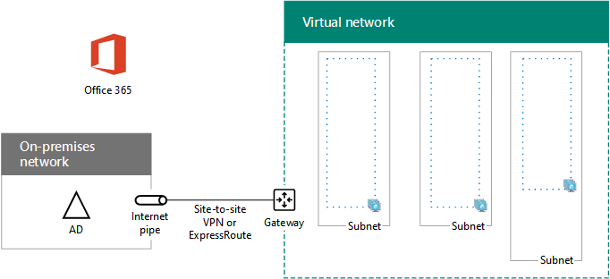

# <a name="high-availability-federated-authentication-phase-1-configure-azure"></a><span data-ttu-id="c648e-103">Fase 1 de la autenticación federada de alta disponibilidad: Configurar Azure</span><span class="sxs-lookup"><span data-stu-id="c648e-103">High availability federated authentication Phase 1: Configure Azure</span></span>

 <span data-ttu-id="c648e-104">**Resumen:** Configurar la infraestructura de Microsoft Azure para autenticación federada de alta disponibilidad del host para Office 365.</span><span class="sxs-lookup"><span data-stu-id="c648e-104">**Summary:** Configure the Microsoft Azure infrastructure to host high availability federated authentication for Office 365.</span></span>
  
<span data-ttu-id="c648e-p101">En esta fase, cree los grupos de recursos, conjuntos de red (VNet) y disponibilidad virtuales en Azure que alojará las máquinas virtuales en las fases 2, 3 y 4. Debe completar esta fase antes de pasar a [autenticación de fase 2 de federados de alta disponibilidad: configurar controladores de dominio](high-availability-federated-authentication-phase-2-configure-domain-controllers.md). Consulte [autenticación federados de alta disponibilidad de implementación para Office 365 en Azure](deploy-high-availability-federated-authentication-for-office-365-in-azure.md) para todas las fases.</span><span class="sxs-lookup"><span data-stu-id="c648e-p101">In this phase, you create the resource groups, virtual network (VNet), and availability sets in Azure that will host the virtual machines in phases 2, 3, and 4. You must complete this phase before moving on to [High availability federated authentication Phase 2: Configure domain controllers](high-availability-federated-authentication-phase-2-configure-domain-controllers.md). See [Deploy high availability federated authentication for Office 365 in Azure](deploy-high-availability-federated-authentication-for-office-365-in-azure.md) for all of the phases.</span></span>
  
<span data-ttu-id="c648e-108">Azure debe contar con los siguientes componentes básicos:</span><span class="sxs-lookup"><span data-stu-id="c648e-108">Azure must be provisioned with these basic components:</span></span>
  
- <span data-ttu-id="c648e-109">Grupos de recursos</span><span class="sxs-lookup"><span data-stu-id="c648e-109">Resource groups</span></span>
    
- <span data-ttu-id="c648e-110">Una red virtual (VNET) de Azure entre locales con subredes para hospedar las máquinas virtuales de Azure</span><span class="sxs-lookup"><span data-stu-id="c648e-110">A cross-premises Azure virtual network (VNet) with subnets for hosting the Azure virtual machines</span></span>
    
- <span data-ttu-id="c648e-111">Grupos de seguridad de red para realizar el aislamiento de subredes</span><span class="sxs-lookup"><span data-stu-id="c648e-111">Network security groups for performing subnet isolation</span></span>
    
- <span data-ttu-id="c648e-112">Conjuntos de disponibilidad</span><span class="sxs-lookup"><span data-stu-id="c648e-112">Availability sets</span></span>
    
## <a name="configure-azure-components"></a><span data-ttu-id="c648e-113">Configurar componentes de Azure</span><span class="sxs-lookup"><span data-stu-id="c648e-113">Configure Azure components</span></span>

<span data-ttu-id="c648e-p102">Antes de empezar a configurar los componentes de Azure, rellene las tablas siguientes. Para ayudarle en los procedimientos para configurar Azure, imprimir esta sección y escriba la información necesaria o copie esta sección en un documento y rellene los campos. Para la configuración de la VNet, rellene la tabla V.</span><span class="sxs-lookup"><span data-stu-id="c648e-p102">Before you begin configuring Azure components, fill in the following tables. To assist you in the procedures for configuring Azure, print this section and write down the needed information or copy this section to a document and fill it in. For the settings of the VNet, fill in Table V.</span></span>
  
|<span data-ttu-id="c648e-117">**Elemento**</span><span class="sxs-lookup"><span data-stu-id="c648e-117">**Item**</span></span>|<span data-ttu-id="c648e-118">**Valor de configuración**</span><span class="sxs-lookup"><span data-stu-id="c648e-118">**Configuration setting**</span></span>|<span data-ttu-id="c648e-119">**Descripción**</span><span class="sxs-lookup"><span data-stu-id="c648e-119">**Description**</span></span>|<span data-ttu-id="c648e-120">**Valor**</span><span class="sxs-lookup"><span data-stu-id="c648e-120">**Value**</span></span>|
|:-----|:-----|:-----|:-----|
|<span data-ttu-id="c648e-121">1.</span><span class="sxs-lookup"><span data-stu-id="c648e-121">1.</span></span>  <br/> |<span data-ttu-id="c648e-122">Nombre de VNET</span><span class="sxs-lookup"><span data-stu-id="c648e-122">VNet name</span></span>  <br/> |<span data-ttu-id="c648e-123">Nombre que se asignará a la red virtual (por ejemplo, FedAuthNet).</span><span class="sxs-lookup"><span data-stu-id="c648e-123">A name to assign to the VNet (example FedAuthNet).</span></span>  <br/> |  <br/> |
|<span data-ttu-id="c648e-124">2.</span><span class="sxs-lookup"><span data-stu-id="c648e-124">2.</span></span>  <br/> |<span data-ttu-id="c648e-125">Ubicación de VNet</span><span class="sxs-lookup"><span data-stu-id="c648e-125">VNet location</span></span>  <br/> |<span data-ttu-id="c648e-126">Centro de datos regional de Azure que contendrá la red virtual.</span><span class="sxs-lookup"><span data-stu-id="c648e-126">The regional Azure datacenter that will contain the virtual network.</span></span>  <br/> |  <br/> |
|<span data-ttu-id="c648e-127">3.</span><span class="sxs-lookup"><span data-stu-id="c648e-127">3.</span></span>  <br/> |<span data-ttu-id="c648e-128">Dirección IP del dispositivo VPN</span><span class="sxs-lookup"><span data-stu-id="c648e-128">VPN device IP address</span></span>  <br/> |<span data-ttu-id="c648e-129">Dirección IPv4 pública de la interfaz del dispositivo VPN en Internet. </span><span class="sxs-lookup"><span data-stu-id="c648e-129">The public IPv4 address of your VPN device's interface on the Internet.</span></span>  <br/> |  <br/> |
|<span data-ttu-id="c648e-130">4.</span><span class="sxs-lookup"><span data-stu-id="c648e-130">4.</span></span>  <br/> |<span data-ttu-id="c648e-131">Espacio de direcciones de la VNET</span><span class="sxs-lookup"><span data-stu-id="c648e-131">VNet address space</span></span>  <br/> |<span data-ttu-id="c648e-p103">El espacio de direcciones de la red virtual. Colabore con su departamento de TI para determinar este espacio de direcciones.</span><span class="sxs-lookup"><span data-stu-id="c648e-p103">The address space for the virtual network. Work with your IT department to determine this address space.</span></span>  <br/> |  <br/> |
|<span data-ttu-id="c648e-134">5.</span><span class="sxs-lookup"><span data-stu-id="c648e-134">5.</span></span>  <br/> |<span data-ttu-id="c648e-135">Clave compartida IPsec</span><span class="sxs-lookup"><span data-stu-id="c648e-135">IPsec shared key</span></span>  <br/> |<span data-ttu-id="c648e-p104">32 caracteres alfanumérica, aleatoria cadena que se utilizará para autenticar a ambos lados de la conexión VPN de sitio a sitio. Trabajar con la TI o departamento de seguridad para determinar el valor de esta clave. Como alternativa, vea [crear una cadena aleatoria de una clave previamente compartida de IPsec](http://social.technet.microsoft.com/wiki/contents/articles/32330.create-a-random-string-for-an-ipsec-preshared-key.aspx).</span><span class="sxs-lookup"><span data-stu-id="c648e-p104">A 32-character random, alphanumeric string that will be used to authenticate both sides of the site-to-site VPN connection. Work with your IT or security department to determine this key value. Alternately, see [Create a random string for an IPsec preshared key](http://social.technet.microsoft.com/wiki/contents/articles/32330.create-a-random-string-for-an-ipsec-preshared-key.aspx).  </span></span><br/> |  <br/> |
   
 <span data-ttu-id="c648e-139">**Tabla V: Configuración de la red virtual entre locales**</span><span class="sxs-lookup"><span data-stu-id="c648e-139">**Table V: Cross-premises virtual network configuration**</span></span>
  
<span data-ttu-id="c648e-p105">Después, rellene la Tabla S de las subredes de esta solución. Todos los espacios de direcciones tienen que estar en formato de Enrutamiento de interdominios sin clases (CIDR), también conocido como formato de prefijo de red (por ejemplo, 10.24.64.0/20).</span><span class="sxs-lookup"><span data-stu-id="c648e-p105">Next, fill in Table S for the subnets of this solution. All address spaces should be in Classless Interdomain Routing (CIDR) format, also known as network prefix format. An example is 10.24.64.0/20.</span></span>
  
<span data-ttu-id="c648e-p106">Para las primeras tres subredes, especifique un nombre y un espacio de direcciones IP único basándose en el espacio de direcciones de la red virtual. Para la subred de la puerta de enlace, determine el espacio de direcciones de 27 bits (con una longitud de prefijo de /27) para la subred de puerta de enlace de Azure con lo siguiente:</span><span class="sxs-lookup"><span data-stu-id="c648e-p106">For the first three subnets, specify a name and a single IP address space based on the virtual network address space. For the gateway subnet, determine the 27-bit address space (with a /27 prefix length) for the Azure gateway subnet with the following:</span></span>
  
1. <span data-ttu-id="c648e-145">Establezca los bits variables en el espacio de direcciones de la VNET en 1, hasta los bits usados por la subred de la puerta de enlace y, después, establezca el resto de los bits en 0.</span><span class="sxs-lookup"><span data-stu-id="c648e-145">Set the variable bits in the address space of the VNet to 1, up to the bits being used by the gateway subnet, then set the remaining bits to 0.</span></span>
    
2. <span data-ttu-id="c648e-146">Convierta los bits resultantes a decimales y expréselo como un espacio de direcciones con la longitud de prefijo establecida en el tamaño de la subred de puerta de enlace.</span><span class="sxs-lookup"><span data-stu-id="c648e-146">Convert the resulting bits to decimal and express it as an address space with the prefix length set to the size of the gateway subnet.</span></span>
    
<span data-ttu-id="c648e-147">Consulte la [Calculadora de espacio de direcciones para las subredes de la puerta de enlace de Azure](https://gallery.technet.microsoft.com/scriptcenter/Address-prefix-calculator-a94b6eed) para un bloque de comandos de PowerShell y una aplicación de consola C# o Python que realiza este cálculo.</span><span class="sxs-lookup"><span data-stu-id="c648e-147">See [Address space calculator for Azure gateway subnets](https://gallery.technet.microsoft.com/scriptcenter/Address-prefix-calculator-a94b6eed) for a PowerShell command block and C# or Python console application that performs this calculation for you.</span></span>
  
<span data-ttu-id="c648e-148">Trabaje con su departamento de TI para determinar estos espacios de direcciones a partir del espacio de direcciones de la red virtual.</span><span class="sxs-lookup"><span data-stu-id="c648e-148">Work with your IT department to determine these address spaces from the virtual network address space.</span></span>
  
|<span data-ttu-id="c648e-149">**Elemento**</span><span class="sxs-lookup"><span data-stu-id="c648e-149">**Item**</span></span>|<span data-ttu-id="c648e-150">**Nombre de la subred**</span><span class="sxs-lookup"><span data-stu-id="c648e-150">**Subnet name**</span></span>|<span data-ttu-id="c648e-151">**Espacio de direcciones de la subred**</span><span class="sxs-lookup"><span data-stu-id="c648e-151">**Subnet address space**</span></span>|<span data-ttu-id="c648e-152">**Objetivo**</span><span class="sxs-lookup"><span data-stu-id="c648e-152">**Purpose**</span></span>|
|:-----|:-----|:-----|:-----|
|<span data-ttu-id="c648e-153">1.</span><span class="sxs-lookup"><span data-stu-id="c648e-153">1.</span></span>  <br/> |  <br/> |  <br/> |<span data-ttu-id="c648e-154">La subred que usa el controlador de dominio de Windows Server Active Directory (AD) y las máquinas virtuales (VM) del servidor de DirSync.</span><span class="sxs-lookup"><span data-stu-id="c648e-154">The subnet used by the Windows Server Active Directory (AD) domain controller and DirSync server virtual machines (VMs).</span></span>  <br/> |
|<span data-ttu-id="c648e-155">2.</span><span class="sxs-lookup"><span data-stu-id="c648e-155">2.</span></span>  <br/> |  <br/> |  <br/> |<span data-ttu-id="c648e-156">Subred usada por las máquinas virtuales de AD FS.</span><span class="sxs-lookup"><span data-stu-id="c648e-156">The subnet used by the AD FS VMs.</span></span>  <br/> |
|<span data-ttu-id="c648e-157">3.</span><span class="sxs-lookup"><span data-stu-id="c648e-157">3.</span></span>  <br/> |  <br/> |  <br/> |<span data-ttu-id="c648e-158">Subred usada por las máquinas virtuales del proxy de aplicación web.</span><span class="sxs-lookup"><span data-stu-id="c648e-158">The subnet used by the web application proxy VMs.</span></span>  <br/> |
|<span data-ttu-id="c648e-159">4.</span><span class="sxs-lookup"><span data-stu-id="c648e-159">4.</span></span>  <br/> |<span data-ttu-id="c648e-160">GatewaySubnet</span><span class="sxs-lookup"><span data-stu-id="c648e-160">GatewaySubnet</span></span>  <br/> |  <br/> |<span data-ttu-id="c648e-161">Subred usada por las máquinas virtuales de la puerta de enlace de Azure.</span><span class="sxs-lookup"><span data-stu-id="c648e-161">The subnet used by the Azure gateway VMs.</span></span>  <br/> |
   
 <span data-ttu-id="c648e-162">**Tabla S: Subredes de la red virtual**</span><span class="sxs-lookup"><span data-stu-id="c648e-162">**Table S: Subnets in the virtual network**</span></span>
  
<span data-ttu-id="c648e-163">Ahora, rellene la Tabla I para las direcciones IP estáticas asignadas a las máquinas virtuales y a las instancias del equilibrador de carga.</span><span class="sxs-lookup"><span data-stu-id="c648e-163">Next, fill in Table I for the static IP addresses assigned to virtual machines and load balancer instances.</span></span>
  
|<span data-ttu-id="c648e-164">**Elemento**</span><span class="sxs-lookup"><span data-stu-id="c648e-164">**Item**</span></span>|<span data-ttu-id="c648e-165">**Objetivo**</span><span class="sxs-lookup"><span data-stu-id="c648e-165">**Purpose**</span></span>|<span data-ttu-id="c648e-166">**Dirección IP de la subred**</span><span class="sxs-lookup"><span data-stu-id="c648e-166">**IP address on the subnet**</span></span>|<span data-ttu-id="c648e-167">**Valor**</span><span class="sxs-lookup"><span data-stu-id="c648e-167">**Value**</span></span>|
|:-----|:-----|:-----|:-----|
|<span data-ttu-id="c648e-168">1.</span><span class="sxs-lookup"><span data-stu-id="c648e-168">1.</span></span>  <br/> |<span data-ttu-id="c648e-169">Dirección IP estática del primer controlador de dominio</span><span class="sxs-lookup"><span data-stu-id="c648e-169">Static IP address of the first domain controller</span></span>  <br/> |<span data-ttu-id="c648e-170">La cuarta dirección IP posible del espacio de direcciones de la subred definida en el elemento 1 de la Tabla S.</span><span class="sxs-lookup"><span data-stu-id="c648e-170">The fourth possible IP address for the address space of the subnet defined in Item 1 of Table S.</span></span>  <br/> |  <br/> |
|<span data-ttu-id="c648e-171">2.</span><span class="sxs-lookup"><span data-stu-id="c648e-171">2.</span></span>  <br/> |<span data-ttu-id="c648e-172">Dirección IP estática del segundo controlador de dominio</span><span class="sxs-lookup"><span data-stu-id="c648e-172">Static IP address of the second domain controller</span></span>  <br/> |<span data-ttu-id="c648e-173">La quinta dirección IP posible del espacio de direcciones de la subred definida en el elemento 1 de la Tabla S.</span><span class="sxs-lookup"><span data-stu-id="c648e-173">The fifth possible IP address for the address space of the subnet defined in Item 1 of Table S.</span></span>  <br/> |  <br/> |
|<span data-ttu-id="c648e-174">3.</span><span class="sxs-lookup"><span data-stu-id="c648e-174">3.</span></span>  <br/> |<span data-ttu-id="c648e-175">Dirección IP estática del servidor de DirSync</span><span class="sxs-lookup"><span data-stu-id="c648e-175">Static IP address of the DirSync server</span></span>  <br/> |<span data-ttu-id="c648e-176">La sexta dirección IP posible del espacio de direcciones de la subred definida en el elemento 1 de la Tabla S.</span><span class="sxs-lookup"><span data-stu-id="c648e-176">The sixth possible IP address for the address space of the subnet defined in Item 1 of Table S.</span></span>  <br/> |  <br/> |
|<span data-ttu-id="c648e-177">4.</span><span class="sxs-lookup"><span data-stu-id="c648e-177">4.</span></span>  <br/> |<span data-ttu-id="c648e-178">Dirección IP estática del equilibrador de carga interno para los servidores de AD FS</span><span class="sxs-lookup"><span data-stu-id="c648e-178">Static IP address of the internal load balancer for the AD FS servers</span></span>  <br/> |<span data-ttu-id="c648e-179">La cuarta dirección IP posible del espacio de direcciones de la subred definida en el elemento 2 de la Tabla S.</span><span class="sxs-lookup"><span data-stu-id="c648e-179">The fourth possible IP address for the address space of the subnet defined in Item 2 of Table S.</span></span>  <br/> |  <br/> |
|<span data-ttu-id="c648e-180">5.</span><span class="sxs-lookup"><span data-stu-id="c648e-180">5.</span></span>  <br/> |<span data-ttu-id="c648e-181">Dirección IP estática del primer servidor de AD FS</span><span class="sxs-lookup"><span data-stu-id="c648e-181">Static IP address of the first AD FS server</span></span>  <br/> |<span data-ttu-id="c648e-182">La quinta dirección IP posible del espacio de direcciones de la subred definida en el elemento 2 de la Tabla S.</span><span class="sxs-lookup"><span data-stu-id="c648e-182">The fifth possible IP address for the address space of the subnet defined in Item 2 of Table S.</span></span>  <br/> |  <br/> |
|<span data-ttu-id="c648e-183">6.</span><span class="sxs-lookup"><span data-stu-id="c648e-183">6.</span></span>  <br/> |<span data-ttu-id="c648e-184">Dirección IP estática del segundo servidor de AD FS</span><span class="sxs-lookup"><span data-stu-id="c648e-184">Static IP address of the second AD FS server</span></span>  <br/> |<span data-ttu-id="c648e-185">La sexta dirección IP posible del espacio de direcciones de la subred definida en el elemento 2 de la Tabla S.</span><span class="sxs-lookup"><span data-stu-id="c648e-185">The sixth possible IP address for the address space of the subnet defined in Item 2 of Table S.</span></span>  <br/> |  <br/> |
|<span data-ttu-id="c648e-186">7.</span><span class="sxs-lookup"><span data-stu-id="c648e-186">7.</span></span>  <br/> |<span data-ttu-id="c648e-187">Dirección IP estática del primer servidor proxy de aplicación web</span><span class="sxs-lookup"><span data-stu-id="c648e-187">Static IP address of the first web application proxy server</span></span>  <br/> |<span data-ttu-id="c648e-188">La cuarta dirección IP posible del espacio de direcciones de la subred definida en el elemento 3 de la Tabla S.</span><span class="sxs-lookup"><span data-stu-id="c648e-188">The fourth possible IP address for the address space of the subnet defined in Item 3 of Table S.</span></span>  <br/> |  <br/> |
|<span data-ttu-id="c648e-189">8.</span><span class="sxs-lookup"><span data-stu-id="c648e-189">8.</span></span>  <br/> |<span data-ttu-id="c648e-190">Dirección IP estática del segundo servidor proxy de aplicación web</span><span class="sxs-lookup"><span data-stu-id="c648e-190">Static IP address of the second web application proxy server</span></span>  <br/> |<span data-ttu-id="c648e-191">La quinta dirección IP posible del espacio de direcciones de la subred definida en el elemento 3 de la Tabla S.</span><span class="sxs-lookup"><span data-stu-id="c648e-191">The fifth possible IP address for the address space of the subnet defined in Item 3 of Table S.</span></span>  <br/> |  <br/> |
   
 <span data-ttu-id="c648e-192">**Direcciones IP estáticas I: de tabla en la red virtual**</span><span class="sxs-lookup"><span data-stu-id="c648e-192">**Table I: Static IP addresses in the virtual network**</span></span>
  
<span data-ttu-id="c648e-193">Para dos servidores de Sistema de nombres de dominio (DNS) en la red local que quiera usar al configurar de manera inicial los controladores de dominio en la red virtual, rellene la Tabla D. Colabore con su departamento de TI para determinar esta lista.</span><span class="sxs-lookup"><span data-stu-id="c648e-193">For two Domain Name System (DNS) servers in your on-premises network that you want to use when initially setting up the domain controllers in your virtual network, fill in Table D. Work with your IT department to determine this list.</span></span>
  
|<span data-ttu-id="c648e-194">**Elemento**</span><span class="sxs-lookup"><span data-stu-id="c648e-194">**Item**</span></span>|<span data-ttu-id="c648e-195">**Nombre descriptivo del servidor DNS**</span><span class="sxs-lookup"><span data-stu-id="c648e-195">**DNS server friendly name**</span></span>|<span data-ttu-id="c648e-196">**Dirección IP del servidor DNS**</span><span class="sxs-lookup"><span data-stu-id="c648e-196">**DNS server IP address**</span></span>|
|:-----|:-----|:-----|
|<span data-ttu-id="c648e-197">1.</span><span class="sxs-lookup"><span data-stu-id="c648e-197">1.</span></span>  <br/> |  <br/> |  <br/> |
|<span data-ttu-id="c648e-198">2.</span><span class="sxs-lookup"><span data-stu-id="c648e-198">2.</span></span>  <br/> |  <br/> |  <br/> |
   
 <span data-ttu-id="c648e-199">**Tabla D: Servidores DNS locales**</span><span class="sxs-lookup"><span data-stu-id="c648e-199">**Table D: On-premises DNS servers**</span></span>
  
<span data-ttu-id="c648e-p107">Para enrutar paquetes desde la red entre locales a la red de la organización por la conexión VPN de sitio a sitio, necesita configurar la red virtual con una red local que contenga una lista del espacio de direcciones (en notación CIDR) para todas las ubicaciones accesibles en la red local de la organización. La lista de espacios de direcciones que definen la red local tiene que ser única y no puede superponerse con el espacio de direcciones usado para otras redes virtuales ni otras redes locales.</span><span class="sxs-lookup"><span data-stu-id="c648e-p107">To route packets from the cross-premises network to your organization network across the site-to-site VPN connection, you must configure the virtual network with a local network that contains a list of the address spaces (in CIDR notation) for all of the reachable locations on your organization's on-premises network. The list of address spaces that define your local network must be unique and must not overlap with the address space used for other virtual networks or other local networks.</span></span>
  
<span data-ttu-id="c648e-p108">Para el conjunto de espacios de direcciones de la red local, rellene la Tabla L. Fíjese en que aparecen tres entradas en blanco, pero lo normal es que necesite más. Colabore con su departamento de TI para determinar esta lista de espacios de direcciones.</span><span class="sxs-lookup"><span data-stu-id="c648e-p108">For the set of local network address spaces, fill in Table L. Note that three blank entries are listed but you will typically need more. Work with your IT department to determine this list of address spaces.</span></span>
  
|<span data-ttu-id="c648e-204">**Elemento**</span><span class="sxs-lookup"><span data-stu-id="c648e-204">**Item**</span></span>|<span data-ttu-id="c648e-205">**Espacio de direcciones de la red local**</span><span class="sxs-lookup"><span data-stu-id="c648e-205">**Local network address space**</span></span>|
|:-----|:-----|
|<span data-ttu-id="c648e-206">1.</span><span class="sxs-lookup"><span data-stu-id="c648e-206">1.</span></span>  <br/> |  <br/> |
|<span data-ttu-id="c648e-207">2.</span><span class="sxs-lookup"><span data-stu-id="c648e-207">2.</span></span>  <br/> |  <br/> |
|<span data-ttu-id="c648e-208">3.</span><span class="sxs-lookup"><span data-stu-id="c648e-208">3.</span></span>  <br/> |  <br/> |
   
 <span data-ttu-id="c648e-209">**Tabla L: Prefijos de direcciones para la red local**</span><span class="sxs-lookup"><span data-stu-id="c648e-209">**Table L: Address prefixes for the local network**</span></span>
  
<span data-ttu-id="c648e-210">Ahora, empecemos a crear la infraestructura de Azure para hospedar la autenticación federada para Office 365.</span><span class="sxs-lookup"><span data-stu-id="c648e-210">Now let's begin building the Azure infrastructure to host your federated authentication for Office 365.</span></span>
  
> [!NOTE]
> <span data-ttu-id="c648e-p109">Los siguientes conjuntos de comandos utilice la última versión de PowerShell de Azure. Consulte [Introducción a los cmdlets de PowerShell de Azure](https://docs.microsoft.com/en-us/powershell/azureps-cmdlets-docs/).</span><span class="sxs-lookup"><span data-stu-id="c648e-p109">The following command sets use the latest version of Azure PowerShell. See [Get started with Azure PowerShell cmdlets](https://docs.microsoft.com/en-us/powershell/azureps-cmdlets-docs/).</span></span> 
  
<span data-ttu-id="c648e-213">Primero, abra un símbolo del sistema de Azure PowerShell e inicie sesión con su cuenta.</span><span class="sxs-lookup"><span data-stu-id="c648e-213">First, start an Azure PowerShell prompt and login to your account.</span></span>
  
```
Login-AzureRMAccount
```

> [!TIP]
> <span data-ttu-id="c648e-214">Para un archivo de texto que contiene todos los comandos de PowerShell en este artículo y un libro de Microsoft Excel configuración que genera bloques de comandos PowerShell listos para ejecutarse en función de la configuración personalizada, consulte el [autenticación federados para Office 365 en Kit de implementación de Azure](https://gallery.technet.microsoft.com/Federated-Authentication-8a9f1664).</span><span class="sxs-lookup"><span data-stu-id="c648e-214">For a text file that contains all of the PowerShell commands in this article and a Microsoft Excel configuration workbook that generates ready-to-run PowerShell command blocks based on your custom settings, see the [Federated Authentication for Office 365 in Azure Deployment Kit](https://gallery.technet.microsoft.com/Federated-Authentication-8a9f1664).</span></span> 
  
<span data-ttu-id="c648e-215">Obtenga su nombre de suscripción mediante el comando siguiente.</span><span class="sxs-lookup"><span data-stu-id="c648e-215">Get your subscription name using the following command.</span></span>
  
```
Get-AzureRMSubscription | Sort Name | Select Name
```

<span data-ttu-id="c648e-216">Para versiones anteriores de PowerShell de Azure, utilice este comando.</span><span class="sxs-lookup"><span data-stu-id="c648e-216">For older versions of Azure PowerShell, use this command instead.</span></span>
  
```
Get-AzureRMSubscription | Sort Name | Select SubscriptionName
```

<span data-ttu-id="c648e-p110">Establecer su suscripción de Azure. Reemplace todo el contenido de las ofertas, incluyendo el \< y > caracteres, con el nombre correcto.</span><span class="sxs-lookup"><span data-stu-id="c648e-p110">Set your Azure subscription. Replace everything within the quotes, including the \< and > characters, with the correct name.</span></span>
  
```
$subscr="<subscription name>"
Get-AzureRmSubscription -SubscriptionName $subscr | Select-AzureRmSubscription
```

<span data-ttu-id="c648e-p111">Después, cree los grupos de recursos. Para determinar un conjunto único de nombres de grupos de recursos, use este comando para mostrar una lista de los grupos de recursos existentes.</span><span class="sxs-lookup"><span data-stu-id="c648e-p111">Next, create the new resource groups. To determine a unique set of resource group names, use this command to list your existing resource groups.</span></span>
  
```
Get-AzureRMResourceGroup | Sort ResourceGroupName | Select ResourceGroupName
```

<span data-ttu-id="c648e-221">Rellene la tabla siguiente para el conjunto de nombres de grupos de recursos únicos.</span><span class="sxs-lookup"><span data-stu-id="c648e-221">Fill in the following table for the set of unique resource group names.</span></span>
  
|<span data-ttu-id="c648e-222">**Elemento**</span><span class="sxs-lookup"><span data-stu-id="c648e-222">**Item**</span></span>|<span data-ttu-id="c648e-223">**Nombre del grupo de recursos**</span><span class="sxs-lookup"><span data-stu-id="c648e-223">**Resource group name**</span></span>|<span data-ttu-id="c648e-224">**Objetivo**</span><span class="sxs-lookup"><span data-stu-id="c648e-224">**Purpose**</span></span>|
|:-----|:-----|:-----|
|<span data-ttu-id="c648e-225">1.</span><span class="sxs-lookup"><span data-stu-id="c648e-225">1.</span></span>  <br/> |  <br/> |<span data-ttu-id="c648e-226">Controladores de dominio</span><span class="sxs-lookup"><span data-stu-id="c648e-226">Domain controllers</span></span>  <br/> |
|<span data-ttu-id="c648e-227">2.</span><span class="sxs-lookup"><span data-stu-id="c648e-227">2.</span></span>  <br/> |  <br/> |<span data-ttu-id="c648e-228">Servidores de AD FS</span><span class="sxs-lookup"><span data-stu-id="c648e-228">AD FS servers</span></span>  <br/> |
|<span data-ttu-id="c648e-229">3.</span><span class="sxs-lookup"><span data-stu-id="c648e-229">3.</span></span>  <br/> |  <br/> |<span data-ttu-id="c648e-230">Servidores proxy de aplicación web</span><span class="sxs-lookup"><span data-stu-id="c648e-230">Web application proxy servers</span></span>  <br/> |
|<span data-ttu-id="c648e-231">4.</span><span class="sxs-lookup"><span data-stu-id="c648e-231">4.</span></span>  <br/> |  <br/> |<span data-ttu-id="c648e-232">Elementos de la infraestructura</span><span class="sxs-lookup"><span data-stu-id="c648e-232">Infrastructure elements</span></span>  <br/> |
   
 <span data-ttu-id="c648e-233">**Tabla R: grupos de recursos**</span><span class="sxs-lookup"><span data-stu-id="c648e-233">**Table R: Resource groups**</span></span>
  
<span data-ttu-id="c648e-234">Cree el grupo de recursos con estos comandos.</span><span class="sxs-lookup"><span data-stu-id="c648e-234">Create your new resource groups with these commands.</span></span>
  
```
$locName="<an Azure location, such as West US>"
$rgName="<Table R - Item 1 - Name column>"
New-AzureRMResourceGroup -Name $rgName -Location $locName
$rgName="<Table R - Item 2 - Name column>"
New-AzureRMResourceGroup -Name $rgName -Location $locName
$rgName="<Table R - Item 3 - Name column>"
New-AzureRMResourceGroup -Name $rgName -Location $locName
$rgName="<Table R - Item 4 - Name column>"
New-AzureRMResourceGroup -Name $rgName -Location $locName
```

<span data-ttu-id="c648e-235">Después, cree la red virtual de Azure y sus subredes.</span><span class="sxs-lookup"><span data-stu-id="c648e-235">Next, you create the Azure virtual network and its subnets.</span></span>
  
```
$rgName="<Table R - Item 4 - Resource group name column>"
$locName="<your Azure location>"
$vnetName="<Table V - Item 1 - Value column>"
$vnetAddrPrefix="<Table V - Item 4 - Value column>"
$dnsServers=@( "<Table D - Item 1 - DNS server IP address column>", "<Table D - Item 2 - DNS server IP address column>" )
# Get the shortened version of the location
$locShortName=(Get-AzureRmResourceGroup -Name $rgName).Location

# Create the subnets
$subnet1Name="<Table S - Item 1 - Subnet name column>"
$subnet1Prefix="<Table S - Item 1 - Subnet address space column>"
$subnet1=New-AzureRMVirtualNetworkSubnetConfig -Name $subnet1Name -AddressPrefix $subnet1Prefix
$subnet2Name="<Table S - Item 2 - Subnet name column>"
$subnet2Prefix="<Table S - Item 2 - Subnet address space column>"
$subnet2=New-AzureRMVirtualNetworkSubnetConfig -Name $subnet2Name -AddressPrefix $subnet2Prefix
$subnet3Name="<Table S - Item 3 - Subnet name column>"
$subnet3Prefix="<Table S - Item 3 - Subnet address space column>"
$subnet3=New-AzureRMVirtualNetworkSubnetConfig -Name $subnet3Name -AddressPrefix $subnet3Prefix
$gwSubnet4Prefix="<Table S - Item 4 - Subnet address space column>"
$gwSubnet=New-AzureRMVirtualNetworkSubnetConfig -Name "GatewaySubnet" -AddressPrefix $gwSubnet4Prefix

# Create the virtual network
New-AzureRMVirtualNetwork -Name $vnetName -ResourceGroupName $rgName -Location $locName -AddressPrefix $vnetAddrPrefix -Subnet $gwSubnet,$subnet1,$subnet2,$subnet3 -DNSServer $dnsServers

```

<span data-ttu-id="c648e-p112">A continuación, crear red de grupos de seguridad para cada subred que contenga equipos virtuales. Para realizar el aislamiento de la subred, puede agregar reglas para tipos específicos de tráfico permitido o denegado al grupo de seguridad de red de una subred.</span><span class="sxs-lookup"><span data-stu-id="c648e-p112">Next, you create network security groups for each subnet that contains virtual machines. To perform subnet isolation, you can add rules for the specific types of traffic allowed or denied to the network security group of a subnet.</span></span>
  
```
# Create network security groups
$vnet=Get-AzureRMVirtualNetwork -ResourceGroupName $rgName -Name $vnetName

New-AzureRMNetworkSecurityGroup -Name $subnet1Name -ResourceGroupName $rgName -Location $locShortName
$nsg=Get-AzureRMNetworkSecurityGroup -Name $subnet1Name -ResourceGroupName $rgName
Set-AzureRMVirtualNetworkSubnetConfig -VirtualNetwork $vnet -Name $subnet1Name -AddressPrefix $subnet1Prefix -NetworkSecurityGroup $nsg

New-AzureRMNetworkSecurityGroup -Name $subnet2Name -ResourceGroupName $rgName -Location $locShortName
$nsg=Get-AzureRMNetworkSecurityGroup -Name $subnet2Name -ResourceGroupName $rgName
Set-AzureRMVirtualNetworkSubnetConfig -VirtualNetwork $vnet -Name $subnet2Name -AddressPrefix $subnet2Prefix -NetworkSecurityGroup $nsg

New-AzureRMNetworkSecurityGroup -Name $subnet3Name -ResourceGroupName $rgName -Location $locShortName
$nsg=Get-AzureRMNetworkSecurityGroup -Name $subnet3Name -ResourceGroupName $rgName
Set-AzureRMVirtualNetworkSubnetConfig -VirtualNetwork $vnet -Name $subnet3Name -AddressPrefix $subnet3Prefix -NetworkSecurityGroup $nsg
```

<span data-ttu-id="c648e-238">Después, use estos comandos para crear las puertas de enlace para la conexión VPN de sitio a sitio.</span><span class="sxs-lookup"><span data-stu-id="c648e-238">Next, use these commands to create the gateways for the site-to-site VPN connection.</span></span>
  
```
$rgName="<Table R - Item 4 - Resource group name column>"
$locName="<Azure location>"
$vnetName="<Table V - Item 1 - Value column>"
$vnet=Get-AzureRMVirtualNetwork -Name $vnetName -ResourceGroupName $rgName
$subnet=Get-AzureRmVirtualNetworkSubnetConfig -VirtualNetwork $vnet -Name "GatewaySubnet"

# Attach a virtual network gateway to a public IP address and the gateway subnet
$publicGatewayVipName="PublicIPAddress"
$vnetGatewayIpConfigName="PublicIPConfig"
New-AzureRMPublicIpAddress -Name $vnetGatewayIpConfigName -ResourceGroupName $rgName -Location $locName -AllocationMethod Dynamic
$publicGatewayVip=Get-AzureRMPublicIpAddress -Name $vnetGatewayIpConfigName -ResourceGroupName $rgName
$vnetGatewayIpConfig=New-AzureRMVirtualNetworkGatewayIpConfig -Name $vnetGatewayIpConfigName -PublicIpAddressId $publicGatewayVip.Id -Subnet $subnet

# Create the Azure gateway
$vnetGatewayName="AzureGateway"
$vnetGateway=New-AzureRMVirtualNetworkGateway -Name $vnetGatewayName -ResourceGroupName $rgName -Location $locName -GatewayType Vpn -VpnType RouteBased -IpConfigurations $vnetGatewayIpConfig

# Create the gateway for the local network
$localGatewayName="LocalNetGateway"
$localGatewayIP="<Table V - Item 3 - Value column>"
$localNetworkPrefix=@( <comma-separated, double-quote enclosed list of the local network address prefixes from Table L, example: "10.1.0.0/24", "10.2.0.0/24"> )
$localGateway=New-AzureRMLocalNetworkGateway -Name $localGatewayName -ResourceGroupName $rgName -Location $locName -GatewayIpAddress $localGatewayIP -AddressPrefix $localNetworkPrefix

# Define the Azure virtual network VPN connection
$vnetConnectionName="S2SConnection"
$vnetConnectionKey="<Table V - Item 5 - Value column>"
$vnetConnection=New-AzureRMVirtualNetworkGatewayConnection -Name $vnetConnectionName -ResourceGroupName $rgName -Location $locName -ConnectionType IPsec -SharedKey $vnetConnectionKey -VirtualNetworkGateway1 $vnetGateway -LocalNetworkGateway2 $localGateway

```

> [!NOTE]
> <span data-ttu-id="c648e-p113">Federados autenticación de los usuarios individuales no se basa en los recursos locales. Sin embargo, si está disponible esta conexión VPN de sitio a sitio, los controladores de dominio en el VNet no recibirá actualizaciones de cuentas de usuario y grupos en el servidor de Windows local AD. Para asegurarse de que esto no suceda, puede configurar alta disponibilidad para la conexión VPN de sitio a sitio. Para obtener más información, vea [altamente disponible entre local y conectividad de VNet a VNet](https://docs.microsoft.com/azure/vpn-gateway/vpn-gateway-highlyavailable)</span><span class="sxs-lookup"><span data-stu-id="c648e-p113">Federated authentication of individual users does not rely on any on-premises resources. However, if this site-to-site VPN connection becomes unavailable, the domain controllers in the VNet will not receive updates to user accounts and groups made in the on-premises Windows Server AD. To ensure this does not happen, you can configure high availability for your site-to-site VPN connection. For more information, see [Highly Available Cross-Premises and VNet-to-VNet Connectivity](https://docs.microsoft.com/azure/vpn-gateway/vpn-gateway-highlyavailable)</span></span>
  
<span data-ttu-id="c648e-243">El paso siguiente es anotar la dirección IPv4 pública de Azure VPN Gateway para la red virtual después de ejecutar este comando:</span><span class="sxs-lookup"><span data-stu-id="c648e-243">Next, record the public IPv4 address of the Azure VPN gateway for your virtual network from the display of this command:</span></span>
  
```
Get-AzureRMPublicIpAddress -Name $publicGatewayVipName -ResourceGroupName $rgName
```

<span data-ttu-id="c648e-p114">A continuación, configure el dispositivo VPN local para conectarse a la puerta de enlace VPN de Azure. Para obtener más información, consulte [Configurar el dispositivo VPN](https://docs.microsoft.com/azure/vpn-gateway/vpn-gateway-about-vpn-devices).</span><span class="sxs-lookup"><span data-stu-id="c648e-p114">Next, configure your on-premises VPN device to connect to the Azure VPN gateway. For more information, see [Configure your VPN device](https://docs.microsoft.com/azure/vpn-gateway/vpn-gateway-about-vpn-devices).</span></span>
  
<span data-ttu-id="c648e-246">Para configurar el dispositivo VPN local necesita lo siguiente:</span><span class="sxs-lookup"><span data-stu-id="c648e-246">To configure your on-premises VPN device, you will need the following:</span></span>
  
- <span data-ttu-id="c648e-247">La dirección IPv4 pública de Azure VPN Gateway.</span><span class="sxs-lookup"><span data-stu-id="c648e-247">The public IPv4 address of the Azure VPN gateway.</span></span>
    
- <span data-ttu-id="c648e-248">La clave previamente compartida IPsec para la conexión VPN de sitio a sitio (columna de la tabla V - artículo 5 - valor).</span><span class="sxs-lookup"><span data-stu-id="c648e-248">The IPsec pre-shared key for the site-to-site VPN connection (Table V - Item 5 - Value column).</span></span>
    
<span data-ttu-id="c648e-p115">Después, asegúrese de que el espacio de direcciones de la red virtual sea accesible desde la red local. Para hacerlo, normalmente se agrega una ruta que se corresponde con el espacio de direcciones de la red virtual al dispositivo VPN y, después, se publica esa ruta para el resto de la infraestructura de enrutamiento de la red de la organización. Colabore con su departamento de TI para conocer cómo completar este procedimiento.</span><span class="sxs-lookup"><span data-stu-id="c648e-p115">Next, ensure that the address space of the virtual network is reachable from your on-premises network. This is usually done by adding a route corresponding to the virtual network address space to your VPN device and then advertising that route to the rest of the routing infrastructure of your organization network. Work with your IT department to determine how to do this.</span></span>
  
<span data-ttu-id="c648e-p116">Después, defina los nombres de los tres conjuntos de disponibilidad. Rellene la Tabla A. </span><span class="sxs-lookup"><span data-stu-id="c648e-p116">Next, define the names of three availability sets. Fill out Table A.</span></span> 
  
|<span data-ttu-id="c648e-254">**Elemento**</span><span class="sxs-lookup"><span data-stu-id="c648e-254">**Item**</span></span>|<span data-ttu-id="c648e-255">**Objetivo**</span><span class="sxs-lookup"><span data-stu-id="c648e-255">**Purpose**</span></span>|<span data-ttu-id="c648e-256">**Nombre del conjunto de disponibilidad**</span><span class="sxs-lookup"><span data-stu-id="c648e-256">**Availability set name**</span></span>|
|:-----|:-----|:-----|
|<span data-ttu-id="c648e-257">1.</span><span class="sxs-lookup"><span data-stu-id="c648e-257">1.</span></span>  <br/> |<span data-ttu-id="c648e-258">Controladores de dominio</span><span class="sxs-lookup"><span data-stu-id="c648e-258">Domain controllers</span></span>  <br/> |  <br/> |
|<span data-ttu-id="c648e-259">2.</span><span class="sxs-lookup"><span data-stu-id="c648e-259">2.</span></span>  <br/> |<span data-ttu-id="c648e-260">Servidores de AD FS</span><span class="sxs-lookup"><span data-stu-id="c648e-260">AD FS servers</span></span>  <br/> |  <br/> |
|<span data-ttu-id="c648e-261">3.</span><span class="sxs-lookup"><span data-stu-id="c648e-261">3.</span></span>  <br/> |<span data-ttu-id="c648e-262">Servidores proxy de aplicación web</span><span class="sxs-lookup"><span data-stu-id="c648e-262">Web application proxy servers</span></span>  <br/> |  <br/> |
   
 <span data-ttu-id="c648e-263">**Establece la tabla disponibilidad de A:**</span><span class="sxs-lookup"><span data-stu-id="c648e-263">**Table A: Availability sets**</span></span>
  
<span data-ttu-id="c648e-264">Necesitará estos nombres al crear las máquinas virtuales en las fases 2, 3 y 4.</span><span class="sxs-lookup"><span data-stu-id="c648e-264">You will need these names when you create the virtual machines in phases 2, 3, and 4.</span></span>
  
<span data-ttu-id="c648e-265">Cree los conjuntos de disponibilidad con estos comandos de Azure PowerShell.</span><span class="sxs-lookup"><span data-stu-id="c648e-265">Create the new availability sets with these Azure PowerShell commands.</span></span>
  
```
$locName="<the Azure location for your new resource group>"
$rgName="<Table R - Item 1 - Resource group name column>"
$avName="<Table A - Item 1 - Availability set name column>"
New-AzureRMAvailabilitySet -Name $avName -ResourceGroupName $rgName -Location $locName
$rgName="<Table R - Item 2 - Resource group name column>"
$avName="<Table A - Item 2 - Availability set name column>"
New-AzureRMAvailabilitySet -Name $avName -ResourceGroupName $rgName -Location $locName
$rgName="<Table R - Item 3 - Resource group name column>"
$avName="<Table A - Item 3 - Availability set name column>"
New-AzureRMAvailabilitySet -Name $avName -ResourceGroupName $rgName -Location $locName
```

<span data-ttu-id="c648e-266">Esta es la configuración que se muestra después de la finalización correcta de esta fase.</span><span class="sxs-lookup"><span data-stu-id="c648e-266">This is the configuration resulting from the successful completion of this phase.</span></span>
  
<span data-ttu-id="c648e-267">**Fase 1: La infraestructura de Azure para autenticación federados de alta disponibilidad para Office 365**</span><span class="sxs-lookup"><span data-stu-id="c648e-267">**Phase 1: The Azure infrastructure for high availability federated authentication for Office 365**</span></span>


  
## <a name="next-step"></a><span data-ttu-id="c648e-269">Paso siguiente</span><span class="sxs-lookup"><span data-stu-id="c648e-269">Next step</span></span>

<span data-ttu-id="c648e-270">Uso [autenticación de fase 2 de federados de alta disponibilidad: configurar controladores de dominio](high-availability-federated-authentication-phase-2-configure-domain-controllers.md) para continuar con la configuración de esta carga de trabajo.</span><span class="sxs-lookup"><span data-stu-id="c648e-270">Use [High availability federated authentication Phase 2: Configure domain controllers](high-availability-federated-authentication-phase-2-configure-domain-controllers.md) to continue with the configuration of this workload.</span></span>
  
## <a name="see-also"></a><span data-ttu-id="c648e-271">Vea también</span><span class="sxs-lookup"><span data-stu-id="c648e-271">See Also</span></span>

[<span data-ttu-id="c648e-272">Implementar la autenticación federada de alta disponibilidad para Office 365 en Azure</span><span class="sxs-lookup"><span data-stu-id="c648e-272">Deploy high availability federated authentication for Office 365 in Azure</span></span>](deploy-high-availability-federated-authentication-for-office-365-in-azure.md)
  
[<span data-ttu-id="c648e-273">Identidad federada para el entorno de desarrollo y pruebas de Office 365</span><span class="sxs-lookup"><span data-stu-id="c648e-273">Federated identity for your Office 365 dev/test environment</span></span>](federated-identity-for-your-office-365-dev-test-environment.md)
  
[<span data-ttu-id="c648e-274">Adopción de la nube y soluciones híbridas</span><span class="sxs-lookup"><span data-stu-id="c648e-274">Cloud adoption and hybrid solutions</span></span>](cloud-adoption-and-hybrid-solutions.md)

[<span data-ttu-id="c648e-275">Identidad federada para Office 365</span><span class="sxs-lookup"><span data-stu-id="c648e-275">Federated identity for Office 365</span></span>](https://support.office.com/article/Understanding-Office-365-identity-and-Azure-Active-Directory-06a189e7-5ec6-4af2-94bf-a22ea225a7a9#bk_federated)


