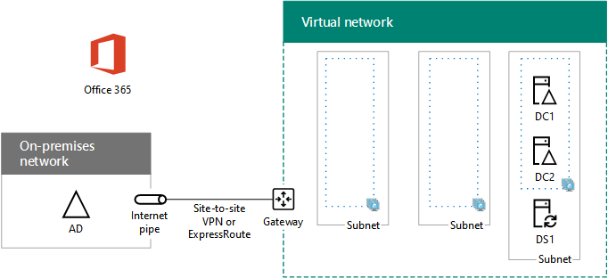

# <a name="high-availability-federated-authentication-phase-2-configure-domain-controllers"></a>Fase 2 de la autenticación federada de alta disponibilidad: Configurar controladores de dominio

 **Resumen:** Configurar los controladores de dominio y el servidor de sincronización de directorios para su autenticación federados de alta disponibilidad para Office 365 en Microsoft Azure.
  
En esta fase de la implementación de alta disponibilidad para la autenticación federada de Office 365 en servicios de infraestructura de Azure, se configuran dos controladores de dominio y el servidor de DirSync en la red virtual de Azure. Después, las solicitudes web de los clientes para la autenticación se pueden autenticar en la red virtual de Azure, en lugar de enviar ese tráfico de autenticación por la conexión VPN de sitio a sitio a la red local.
  
> [!NOTE]
> Servicios de federación de Active Directory (AD FS) no puede usar Azure Active Directory Domain Services como un sustituto para los controladores de dominio de Windows Server AD. 
  
Debe completar esta fase antes de pasar a [federados de alta disponibilidad autenticación fase 3: configurar servidores AD FS](high-availability-federated-authentication-phase-3-configure-ad-fs-servers.md). Consulte [autenticación federados de alta disponibilidad de implementación para Office 365 en Azure](deploy-high-availability-federated-authentication-for-office-365-in-azure.md) para todas las fases.
  
## <a name="create-the-domain-controller-virtual-machines-in-azure"></a>Crear las máquinas virtuales del controlador de dominio en Azure

En primer lugar, debe rellenar la columna **nombre de la máquina Virtual** de M de la tabla y modificar tamaños de máquina virtual según sea necesario en la columna **tamaño mínimo** .
  
|**Elemento**|**Nombre de máquina virtual**|**Imagen de la Galería**|**Tipo de almacenamiento**|**Tamaño mínimo**|
|:-----|:-----|:-----|:-----|:-----|
|1.  <br/> |______________ (primer controlador de dominio, ejemplo DC1)  <br/> |Windows Server 2016 Datacenter  <br/> |StandardLRS  <br/> |Standard_D2  <br/> |
|2.  <br/> |______________ (segundo controlador de dominio, ejemplo DC2)  <br/> |Windows Server 2016 Datacenter  <br/> |StandardLRS  <br/> |Standard_D2  <br/> |
|3.  <br/> |______________ (servidor de DirSync, ejemplo DS1)  <br/> |Windows Server 2016 Datacenter  <br/> |StandardLRS  <br/> |Standard_D2  <br/> |
|4.  <br/> |______________ (primer servidor de AD FS, ejemplo ADFS1)  <br/> |Windows Server 2016 Datacenter  <br/> |StandardLRS  <br/> |Standard_D2  <br/> |
|5.  <br/> |______________ (segundo servidor de AD FS, ejemplo ADFS2)  <br/> |Windows Server 2016 Datacenter  <br/> |StandardLRS  <br/> |Standard_D2  <br/> |
|6.  <br/> |______________ (primer servidor proxy de aplicación web, ejemplo WEB1)  <br/> |Windows Server 2016 Datacenter  <br/> |StandardLRS  <br/> |Standard_D2  <br/> |
|7.  <br/> |______________ (segundo servidor proxy de aplicación web, ejemplo WEB2)  <br/> |Windows Server 2016 Datacenter  <br/> |StandardLRS  <br/> |Standard_D2  <br/> |
   
 **Tabla M - máquinas virtuales para la autenticación federados de alta disponibilidad para Office 365 en Azure**
  
Para obtener una lista completa de los tamaños de máquina virtual, vea [tamaños para máquinas virtuales](https://docs.microsoft.com/azure/virtual-machines/virtual-machines-windows-sizes).
  
El siguiente bloque de comandos de PowerShell de Azure crea las máquinas virtuales para los dos controladores de dominio. Especificar los valores de las variables, quitar el \< y > caracteres. Tenga en cuenta que este bloque de comandos de PowerShell de Azure usa los valores de las tablas siguientes:
  
- Tabla N, para las máquinas virtuales
    
- Tabla R, para los grupos de recursos
    
- Tabla V, para la configuración de la red virtual
    
- Tabla S, para las subredes
    
- Tabla I, para las direcciones IP estáticas
    
- Tabla A, para los conjuntos de disponibilidad
    
Recuerde que definido tablas R, V, S, I y A en [federados de alta disponibilidad autenticación de fase 1: configurar Azure](high-availability-federated-authentication-phase-1-configure-azure.md).
  
> [!NOTE]
> Los siguientes conjuntos de comandos utilice la última versión de PowerShell de Azure. Consulte [Introducción a los cmdlets de PowerShell de Azure](https://docs.microsoft.com/en-us/powershell/azureps-cmdlets-docs/). 
  
Después de especificar todos los valores correctos, ejecute el bloque resultante en el símbolo del sistema de Azure PowerShell o en el Entorno de scripting integrado (ISE) de PowerShell en el equipo local.
  
> [!TIP]
> Para un archivo de texto que contiene todos los comandos de PowerShell en este artículo y un libro de Microsoft Excel configuración que genera bloques de comandos PowerShell listos para ejecutarse en función de la configuración personalizada, consulte el [autenticación federados para Office 365 en Kit de implementación de Azure](https://gallery.technet.microsoft.com/Federated-Authentication-8a9f1664). 
  
```
# Set up variables common to both virtual machines
$locName="<your Azure location>"
$vnetName="<Table V - Item 1 - Value column>"
$subnetName="<Table S - Item 1 - Value column>"
$avName="<Table A - Item 1 - Availability set name column>"
$rgNameTier="<Table R - Item 1 - Resource group name column>"
$rgNameInfra="<Table R - Item 4 - Resource group name column>"

$rgName=$rgNameInfra
$vnet=Get-AzureRMVirtualNetwork -Name $vnetName -ResourceGroupName $rgName
$subnet=Get-AzureRmVirtualNetworkSubnetConfig -VirtualNetwork $vnet -Name $subnetName

$rgName=$rgNameTier
$avSet=Get-AzureRMAvailabilitySet -Name $avName -ResourceGroupName $rgName 

# Create the first domain controller
$vmName="<Table M - Item 1 - Virtual machine name column>"
$vmSize="<Table M - Item 1 - Minimum size column>"
$staticIP="<Table I - Item 1 - Value column>"
$diskStorageType="<Table M - Item 1 - Storage type column>"
$diskSize=<size of the extra disk for Windows Server AD data in GB>

$nic=New-AzureRMNetworkInterface -Name ($vmName +"-NIC") -ResourceGroupName $rgName -Location $locName -Subnet $subnet -PrivateIpAddress $staticIP
$vm=New-AzureRMVMConfig -VMName $vmName -VMSize $vmSize -AvailabilitySetId $avset.Id
$vm=Set-AzureRmVMOSDisk -VM $vm -Name ($vmName +"-OS") -DiskSizeInGB 128 -CreateOption FromImage -StorageAccountType $diskStorageType
$diskConfig=New-AzureRmDiskConfig -AccountType $diskStorageType -Location $locName -CreateOption Empty -DiskSizeGB $diskSize
$dataDisk1=New-AzureRmDisk -DiskName ($vmName + "-DataDisk1") -Disk $diskConfig -ResourceGroupName $rgName
$vm=Add-AzureRmVMDataDisk -VM $vm -Name ($vmName + "-DataDisk1") -CreateOption Attach -ManagedDiskId $dataDisk1.Id -Lun 1
$cred=Get-Credential -Message "Type the name and password of the local administrator account for the first domain controller." 
$vm=Set-AzureRMVMOperatingSystem -VM $vm -Windows -ComputerName $vmName -Credential $cred -ProvisionVMAgent -EnableAutoUpdate
$vm=Set-AzureRMVMSourceImage -VM $vm -PublisherName MicrosoftWindowsServer -Offer WindowsServer -Skus 2016-Datacenter -Version "latest"
$vm=Add-AzureRMVMNetworkInterface -VM $vm -Id $nic.Id
New-AzureRMVM -ResourceGroupName $rgName -Location $locName -VM $vm

# Create the second domain controller
$vmName="<Table M - Item 2 - Virtual machine name column>"
$vmSize="<Table M - Item 2 - Minimum size column>"
$staticIP="<Table I - Item 2 - Value column>"
$diskStorageType="<Table M - Item 2 - Storage type column>"
$diskSize=<size of the extra disk for Windows Server AD data in GB>

$nic=New-AzureRMNetworkInterface -Name ($vmName +"-NIC") -ResourceGroupName $rgName -Location $locName -Subnet $subnet -PrivateIpAddress $staticIP
$vm=New-AzureRMVMConfig -VMName $vmName -VMSize $vmSize -AvailabilitySetId $avset.Id
$vm=Set-AzureRmVMOSDisk -VM $vm -Name ($vmName +"-OS") -DiskSizeInGB 128 -CreateOption FromImage -StorageAccountType $diskStorageType
$diskConfig=New-AzureRmDiskConfig -AccountType $diskStorageType -Location $locName -CreateOption Empty -DiskSizeGB $diskSize
$dataDisk1=New-AzureRmDisk -DiskName ($vmName + "-DataDisk1") -Disk $diskConfig -ResourceGroupName $rgName
$vm=Add-AzureRmVMDataDisk -VM $vm -Name ($vmName + "-DataDisk1") -CreateOption Attach -ManagedDiskId $dataDisk1.Id -Lun 1
$cred=Get-Credential -Message "Type the name and password of the local administrator account for the second domain controller." 
$vm=Set-AzureRMVMOperatingSystem -VM $vm -Windows -ComputerName $vmName -Credential $cred -ProvisionVMAgent -EnableAutoUpdate
$vm=Set-AzureRMVMSourceImage -VM $vm -PublisherName MicrosoftWindowsServer -Offer WindowsServer -Skus 2016-Datacenter -Version "latest"
$vm=Add-AzureRMVMNetworkInterface -VM $vm -Id $nic.Id
New-AzureRMVM -ResourceGroupName $rgName -Location $locName -VM $vm

# Create the DirSync server
$vmName="<Table M - Item 3 - Virtual machine name column>"
$vmSize="<Table M - Item 3 - Minimum size column>"
$staticIP="<Table I - Item 3 - Value column>"
$diskStorageType="<Table M - Item 3 - Storage type column>"

$nic=New-AzureRMNetworkInterface -Name ($vmName +"-NIC") -ResourceGroupName $rgName -Location $locName -Subnet $subnet -PrivateIpAddress $staticIP
$vm=New-AzureRMVMConfig -VMName $vmName -VMSize $vmSize

$cred=Get-Credential -Message "Type the name and password of the local administrator account for the DirSync server." 
$vm=Set-AzureRMVMOperatingSystem -VM $vm -Windows -ComputerName $vmName -Credential $cred -ProvisionVMAgent -EnableAutoUpdate
$vm=Set-AzureRMVMSourceImage -VM $vm -PublisherName MicrosoftWindowsServer -Offer WindowsServer -Skus 2016-Datacenter -Version "latest"
$vm=Add-AzureRMVMNetworkInterface -VM $vm -Id $nic.Id
$vm=Set-AzureRmVMOSDisk -VM $vm -Name ($vmName +"-OS") -DiskSizeInGB 128 -CreateOption FromImage -StorageAccountType $diskStorageType
New-AzureRMVM -ResourceGroupName $rgName -Location $locName -VM $vm
```

> [!NOTE]
> Dado que estas máquinas virtuales son para una aplicación de intranet, no se asigna una dirección IP pública o una etiqueta de nombre de dominio DNS y expuestos a Internet. Sin embargo, esto también significa que no se puede conectar a ellos desde el portal de Azure. Al ver las propiedades de la máquina virtual no está disponible la opción **Conectar** . Utilice el accesorio de conexión a Escritorio remoto u otra herramienta de escritorio remoto para conectarse a la máquina virtual usando su privado IP dirección o intranet nombre DNS.
  
## <a name="configure-the-first-domain-controller"></a>Configurar el primer controlador de dominio

Use el cliente de Escritorio remoto que prefiera y cree una conexión a Escritorio remoto a la máquina virtual del primer controlador de dominio. Use el nombre DNS de la intranet o el nombre de equipo y las credenciales de la cuenta de administrador local.
  
A continuación, agregar el disco de datos adicionales para el primer controlador de dominio con este comando desde un Windows PowerShell símbolo **en la primera máquina virtual de controlador de dominio**:
  
```
Get-Disk | Where PartitionStyle -eq "RAW" | Initialize-Disk -PartitionStyle MBR -PassThru | New-Partition -AssignDriveLetter -UseMaximumSize | Format-Volume -FileSystem NTFS -NewFileSystemLabel "WSAD Data"
```

A continuación, probar la conectividad del primer controlador dominio en ubicaciones de red de su organización mediante el comando **ping** para hacer ping a los nombres y direcciones IP de los recursos de la red de la organización.
  
Este procedimiento garantiza que la resolución de nombres DNS funciona correctamente (que la máquina virtual está configurada correctamente con los servidores DNS locales) y que se pueden enviar y recibir paquetes de la red virtual entre locales. Si esta prueba básica produce errores, póngase en contacto con el departamento de TI para solucionar los problemas de resolución de nombres DNS y de entrega de paquetes.
  
Después, desde el símbolo del sistema de Windows PowerShell en el primer controlador de dominio, ejecute los comandos siguientes:
  
```
$domname="<DNS domain name of the domain for which this computer will be a domain controller, such as corp.contoso.com>"
$cred = Get-Credential -Message "Enter credentials of an account with permission to join a new domain controller to the domain"
Install-WindowsFeature AD-Domain-Services -IncludeManagementTools
Install-ADDSDomainController -InstallDns -DomainName $domname  -DatabasePath "F:\\NTDS" -SysvolPath "F:\\SYSVOL" -LogPath "F:\\Logs" -Credential $cred
```

Se le pedirá que especifique las credenciales de una cuenta de administrador de dominio. Se reiniciará el equipo.
  
## <a name="configure-the-second-domain-controller"></a>Configurar el segundo controlador de dominio

Use el cliente de Escritorio remoto que prefiera y cree una conexión a Escritorio remoto a la máquina virtual del segundo controlador de dominio. Use el nombre DNS de la intranet o el nombre de equipo y las credenciales de la cuenta de administrador local.
  
A continuación, debe agregar el disco de datos adicionales en el segundo controlador de dominio con este comando desde un Windows PowerShell símbolo **en la segunda máquina virtual de controlador de dominio**:
  
```
Get-Disk | Where PartitionStyle -eq "RAW" | Initialize-Disk -PartitionStyle MBR -PassThru | New-Partition -AssignDriveLetter -UseMaximumSize | Format-Volume -FileSystem NTFS -NewFileSystemLabel "WSAD Data"
```

Después, ejecute los comandos siguientes:
  
```
$domname="<DNS domain name of the domain for which this computer will be a domain controller, such as corp.contoso.com>"
$cred = Get-Credential -Message "Enter credentials of an account with permission to join a new domain controller to the domain"
Install-WindowsFeature AD-Domain-Services -IncludeManagementTools
Install-ADDSDomainController -InstallDns -DomainName $domname  -DatabasePath "F:\\NTDS" -SysvolPath "F:\\SYSVOL" -LogPath "F:\\Logs" -Credential $cred

```

Se le pedirá que especifique las credenciales de una cuenta de administrador de dominio. Se reiniciará el equipo.
  
A continuación, debe actualizar los servidores DNS de su red virtual para que ese Azure asigna a las máquinas virtuales en las direcciones IP de los dos nuevos controladores de dominio para usar como sus servidores DNS. Rellenar las variables y, a continuación, ejecutar estos comandos desde un símbolo del sistema de Windows PowerShell en el equipo local:
  
```
$rgName="<Table R - Item 4 - Resource group name column>"
$adrgName="<Table R - Item 1 - Resource group name column>"
$locName="<your Azure location>"
$vnetName="<Table V - Item 1 - Value column>"
$onpremDNSIP1="<Table D - Item 1 - DNS server IP address column>"
$onpremDNSIP2="<Table D - Item 2 - DNS server IP address column>"
$staticIP1="<Table I - Item 1 - Value column>"
$staticIP2="<Table I - Item 2 - Value column>"
$firstDCName="<Table M - Item 1 - Virtual machine name column>"
$secondDCName="<Table M - Item 2 - Virtual machine name column>"

$vnet=Get-AzureRMVirtualNetwork -ResourceGroupName $rgName -Name $vnetName
$vnet.DhcpOptions.DnsServers.Add($staticIP1)
$vnet.DhcpOptions.DnsServers.Add($staticIP2) 
$vnet.DhcpOptions.DnsServers.Remove($onpremDNSIP1)
$vnet.DhcpOptions.DnsServers.Remove($onpremDNSIP2) 
Set-AzureRMVirtualNetwork -VirtualNetwork $vnet
Restart-AzureRMVM -ResourceGroupName $adrgName -Name $firstDCName
Restart-AzureRMVM -ResourceGroupName $adrgName -Name $secondDCName
```

Tenga en cuenta que reiniciamos los dos controladores de dominio para que no estén configurados con los servidores DNS locales como los servidores DNS. Como ambos son servidores DNS, se configuraron automáticamente con los servidores DNS locales como reenviadores DNS cuando se promovieron a controladores de dominio.
  
Después, es necesario crear un sitio de replicación de Active Directory para garantizar que los servidores de la red virtual de Azure usen los controladores de dominio locales. Conéctese al controlador de dominio con una cuenta de administrador de dominio y ejecute los comandos siguientes desde un símbolo del sistema de Windows PowerShell con permisos de administrador:
  
```
$vnet="<Table V - Item 1 - Value column>"
$vnetSpace="<Table V - Item 4 - Value column>"
New-ADReplicationSite -Name $vnet 
New-ADReplicationSubnet -Name $vnetSpace -Site $vnet
```

## <a name="configure-the-dirsync-server"></a>Configurar el servidor de DirSync

Utilizar al cliente de escritorio remoto de su elección y crear una conexión de escritorio remoto a la máquina virtual del servidor de sincronización de directorios. Utilice su intranet DNS o nombre de equipo y las credenciales de la cuenta de administrador local.
  
Después, únala al dominio de Windows Server AD adecuado con estos comandos en el símbolo del sistema de Windows PowerShell.
  
```
$domName="<Windows Server AD domain name to join, such as corp.contoso.com>"
$cred=Get-Credential -Message "Type the name and password of a domain acccount."
Add-Computer -DomainName $domName -Credential $cred
Restart-Computer
```

Esta es la configuración completada después de la finalización correcta de esta fase, con los nombres de equipo de marcadores de posición.
  
**Fase 2: Los controladores de dominio y el servidor de sincronización de directorios para su infraestructura de autenticación federados de alta disponibilidad en Azure**


  
## <a name="next-step"></a>Siguiente paso

Uso [federados de alta disponibilidad autenticación fase 3: configurar servidores AD FS](high-availability-federated-authentication-phase-3-configure-ad-fs-servers.md) para continuar configurando esta carga de trabajo.
  
## <a name="see-also"></a>See Also

[Implementar la autenticación federada de alta disponibilidad para Office 365 en Azure](deploy-high-availability-federated-authentication-for-office-365-in-azure.md)
  
[Identidad federada para el entorno de desarrollo y pruebas de Office 365](federated-identity-for-your-office-365-dev-test-environment.md)
  
[Adopción de la nube y soluciones híbridas](cloud-adoption-and-hybrid-solutions.md)

[Identidad federada para Office 365](https://support.office.com/article/Understanding-Office-365-identity-and-Azure-Active-Directory-06a189e7-5ec6-4af2-94bf-a22ea225a7a9#bk_federated)


