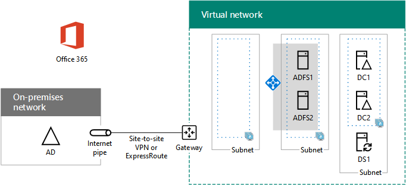

# <a name="high-availability-federated-authentication-phase-3-configure-ad-fs-servers"></a>Fase 3 de la autenticación federada de alta disponibilidad: Configurar servidores de AD FS

 **Resumen:** Crear y configurar los servidores de servicios de federación de Active Directory (AD FS) para su autenticación federados de alta disponibilidad para Office 365 en Microsoft Azure.
  
En esta fase de la implementación de alta disponibilidad para la autenticación federada de Office 365 en servicios de infraestructura de Azure, se crea un equilibrador de carga interno y dos servidores de AD FS.
  
Debe completar esta fase antes de pasar a [federados de alta disponibilidad autenticación fase 4: configurar el proxy de la aplicación web](high-availability-federated-authentication-phase-4-configure-web-application-pro.md). Consulte [autenticación federados de alta disponibilidad de implementación para Office 365 en Azure](deploy-high-availability-federated-authentication-for-office-365-in-azure.md) para todas las fases.
  
## <a name="create-the-ad-fs-server-virtual-machines-in-azure"></a>Crear las máquinas virtuales del servidor de AD FS en Azure

Use el siguiente bloque de comandos de PowerShell para crear las máquinas virtuales de los dos servidores de AD FS. En este conjunto de comandos de PowerShell se usan valores de las tablas siguientes:
  
- Tabla N, para las máquinas virtuales
    
- Tabla R, para los grupos de recursos
    
- Tabla V, para la configuración de la red virtual
    
- Tabla S, para las subredes
    
- Tabla I, para las direcciones IP estáticas
    
- Tabla A, para los conjuntos de disponibilidad
    
Recuerde que definido cuadro M en [autenticación de fase 2 de federados de alta disponibilidad: configurar controladores de dominio](high-availability-federated-authentication-phase-2-configure-domain-controllers.md) y tablas R, V, S, I y A en [federados de alta disponibilidad autenticación de fase 1: configurar Azure](high-availability-federated-authentication-phase-1-configure-azure.md).
  
> [!NOTE]
> Los siguientes conjuntos de comandos utilice la última versión de PowerShell de Azure. Consulte [Introducción a los cmdlets de PowerShell de Azure](https://docs.microsoft.com/en-us/powershell/azureps-cmdlets-docs/). 
  
En primer lugar, cree un equilibrador de carga interno Azure para el anuncio de dos servidores de FS. Especificar los valores de las variables, quitar el \< y > caracteres. Cuando haya proporcionado todos los valores adecuados, ejecutar el bloque resultante en el símbolo del sistema de PowerShell de Azure o en PowerShell ISE.
  
> [!TIP]
> Para un archivo de texto que contiene todos los comandos de PowerShell en este artículo y un libro de Microsoft Excel configuración que genera bloques de comandos PowerShell listos para ejecutarse en función de la configuración personalizada, consulte el [autenticación federados para Office 365 en Kit de implementación de Azure](https://gallery.technet.microsoft.com/Federated-Authentication-8a9f1664). 
  
```
# Set up key variables
$locName="<your Azure location>"
$vnetName="<Table V - Item 1 - Value column>"
$subnetName="<Table R - Item 2 - Subnet name column>"
$privIP="<Table I - Item 4 - Value column>"
$rgName=<Table R - Item 4 - Resource group name column>"

$vnet=Get-AzureRMVirtualNetwork -Name $vnetName -ResourceGroupName $rgName
$subnet=Get-AzureRmVirtualNetworkSubnetConfig -VirtualNetwork $vnet -Name $subnetName

$frontendIP=New-AzureRMLoadBalancerFrontendIpConfig -Name "ADFSServers-LBFE" -PrivateIPAddress $privIP -Subnet $subnet
$beAddressPool=New-AzureRMLoadBalancerBackendAddressPoolConfig -Name "ADFSServers-LBBE"

$healthProbe=New-AzureRMLoadBalancerProbeConfig -Name WebServersProbe -Protocol "TCP" -Port 443 -IntervalInSeconds 15 -ProbeCount 2
$lbrule=New-AzureRMLoadBalancerRuleConfig -Name "HTTPSTraffic" -FrontendIpConfiguration $frontendIP -BackendAddressPool $beAddressPool -Probe $healthProbe -Protocol "TCP" -FrontendPort 443 -BackendPort 443
New-AzureRMLoadBalancer -ResourceGroupName $rgName -Name "ADFSServers" -Location $locName -LoadBalancingRule $lbrule -BackendAddressPool $beAddressPool -Probe $healthProbe -FrontendIpConfiguration $frontendIP
```

Después, cree las máquinas virtuales del servidor de AD FS.
  
Después de especificar todos los valores correctos, ejecute el bloque resultante en el símbolo del sistema de Azure PowerShell o en PowerShell ISE.
  
```
# Set up variables common to both virtual machines
$locName="<your Azure location>"
$vnetName="<Table V - Item 1 - Value column>"
$subnetName="<Table R - Item 2 - Subnet name column>"
$avName="<Table A - Item 2 - Availability set name column>"
$rgNameTier="<Table R - Item 2 - Resource group name column>"
$rgNameInfra="<Table R - Item 4 - Resource group name column>"

$rgName=$rgNameInfra
$vnet=Get-AzureRMVirtualNetwork -Name $vnetName -ResourceGroupName $rgName
$subnet=Get-AzureRmVirtualNetworkSubnetConfig -VirtualNetwork $vnet -Name $subnetName
$backendSubnet=Get-AzureRMVirtualNetworkSubnetConfig -Name $subnetName -VirtualNetwork $vnet
$webLB=Get-AzureRMLoadBalancer -ResourceGroupName $rgName -Name "ADFSServers"

$rgName=$rgNameTier
$avSet=Get-AzureRMAvailabilitySet -Name $avName -ResourceGroupName $rgName

# Create the first ADFS server virtual machine
$vmName="<Table M - Item 4 - Virtual machine name column>"
$vmSize="<Table M - Item 4 - Minimum size column>"
$staticIP="<Table I - Item 5 - Value column>"
$diskStorageType="<Table M - Item 4 - Storage type column>"

$nic=New-AzureRMNetworkInterface -Name ($vmName +"-NIC") -ResourceGroupName $rgName -Location $locName -Subnet $backendSubnet -LoadBalancerBackendAddressPool $webLB.BackendAddressPools[0] -PrivateIpAddress $staticIP
$vm=New-AzureRMVMConfig -VMName $vmName -VMSize $vmSize -AvailabilitySetId $avset.Id

$cred=Get-Credential -Message "Type the name and password of the local administrator account for the first AD FS server." 
$vm=Set-AzureRMVMOperatingSystem -VM $vm -Windows -ComputerName $vmName -Credential $cred -ProvisionVMAgent -EnableAutoUpdate
$vm=Set-AzureRMVMSourceImage -VM $vm -PublisherName MicrosoftWindowsServer -Offer WindowsServer -Skus 2016-Datacenter -Version "latest"
$vm=Add-AzureRMVMNetworkInterface -VM $vm -Id $nic.Id
$vm=Set-AzureRmVMOSDisk -VM $vm -Name ($vmName +"-OS") -DiskSizeInGB 128 -CreateOption FromImage -StorageAccountType $diskStorageType
New-AzureRMVM -ResourceGroupName $rgName -Location $locName -VM $vm

# Create the second AD FS virtual machine
$vmName="<Table M - Item 5 - Virtual machine name column>"
$vmSize="<Table M - Item 5 - Minimum size column>"
$staticIP="<Table I - Item 6 - Value column>"
$diskStorageType="<Table M - Item 5 - Storage type column>"

$nic=New-AzureRMNetworkInterface -Name ($vmName +"-NIC") -ResourceGroupName $rgName -Location $locName  -Subnet $backendSubnet -LoadBalancerBackendAddressPool $webLB.BackendAddressPools[0] -PrivateIpAddress $staticIP
$vm=New-AzureRMVMConfig -VMName $vmName -VMSize $vmSize -AvailabilitySetId $avset.Id

$cred=Get-Credential -Message "Type the name and password of the local administrator account for the second AD FS server." 
$vm=Set-AzureRMVMOperatingSystem -VM $vm -Windows -ComputerName $vmName -Credential $cred -ProvisionVMAgent -EnableAutoUpdate
$vm=Set-AzureRMVMSourceImage -VM $vm -PublisherName MicrosoftWindowsServer -Offer WindowsServer -Skus 2016-Datacenter -Version "latest"
$vm=Add-AzureRMVMNetworkInterface -VM $vm -Id $nic.Id
$vm=Set-AzureRmVMOSDisk -VM $vm -Name ($vmName +"-OS") -DiskSizeInGB 128 -CreateOption FromImage -StorageAccountType $diskStorageType
New-AzureRMVM -ResourceGroupName $rgName -Location $locName -VM $vm

```

> [!NOTE]
> Dado que estas máquinas virtuales son para una aplicación de intranet, no se asigna una dirección IP pública o una etiqueta de nombre de dominio DNS y expuestos a Internet. Sin embargo, esto también significa que no se puede conectar a ellos desde el portal de Azure. Al ver las propiedades de la máquina virtual no está disponible la opción **Conectar** . Utilice el accesorio de conexión a Escritorio remoto u otra herramienta de escritorio remoto para conectarse a la máquina virtual usando su privado IP dirección o intranet nombre DNS.
  
Por cada máquina virtual, use el cliente de Escritorio remoto que prefiera y cree una conexión a Escritorio remoto. Use el nombre DNS de la intranet o el nombre de equipo y las credenciales de la cuenta de administrador local.
  
Por cada máquina virtual, únalas al dominio de Windows Server AD adecuado con estos comandos en el símbolo del sistema de Windows PowerShell.
  
```
$domName="<Windows Server AD domain name to join, such as corp.contoso.com>"
$cred=Get-Credential -Message "Type the name and password of a domain acccount."
Add-Computer -DomainName $domName -Credential $cred
Restart-Computer
```

Esta es la configuración completada después de la finalización correcta de esta fase, con los nombres de equipo de marcadores de posición.
  
**Fase 3: Los servidores de AD FS y el equilibrador de carga interno para su infraestructura de autenticación federados de alta disponibilidad en Azure**


  
## <a name="next-step"></a>Paso siguiente

Uso [federados de alta disponibilidad autenticación fase 4: configurar el proxy de la aplicación web](high-availability-federated-authentication-phase-4-configure-web-application-pro.md) para continuar configurando esta carga de trabajo.
  
## <a name="see-also"></a>Vea también

[Implementar la autenticación federada de alta disponibilidad para Office 365 en Azure](deploy-high-availability-federated-authentication-for-office-365-in-azure.md)
  
[Identidad federada para el entorno de desarrollo y pruebas de Office 365](federated-identity-for-your-office-365-dev-test-environment.md)


