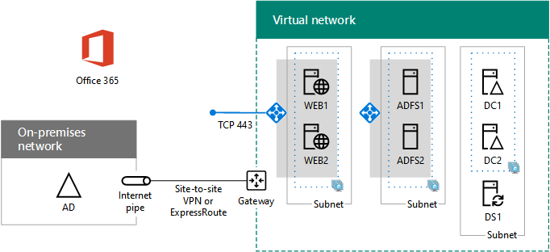

# <a name="high-availability-federated-authentication-phase-4-configure-web-application-proxies"></a><span data-ttu-id="335a3-103">Fase 4 de la autenticación federada de alta disponibilidad: Configurar los proxy de aplicación web</span><span class="sxs-lookup"><span data-stu-id="335a3-103">High availability federated authentication Phase 4: Configure web application proxies</span></span>

 <span data-ttu-id="335a3-104">**Resumen:** Configurar los servidores de proxy de aplicación web para la autenticación federados de alta disponibilidad para Office 365 en Microsoft Azure.</span><span class="sxs-lookup"><span data-stu-id="335a3-104">**Summary:** Configure the web application proxy servers for your high availability federated authentication for Office 365 in Microsoft Azure.</span></span>
  
<span data-ttu-id="335a3-105">En esta fase de la implementación de alta disponibilidad para la autenticación federada de Office 365 en servicios de infraestructura de Azure, se crea un equilibrador de carga interno y dos servidores de AD FS.</span><span class="sxs-lookup"><span data-stu-id="335a3-105">In this phase of deploying high availability for Office 365 federated authentication in Azure infrastructure services, you create an internal load balancer and two AD FS servers.</span></span>
  
<span data-ttu-id="335a3-p101">Debe completar esta fase antes de pasar a [federados de alta disponibilidad autenticación fase 5: configurar la autenticación federada para Office 365](high-availability-federated-authentication-phase-5-configure-federated-authentic.md). Consulte [autenticación federados de alta disponibilidad de implementación para Office 365 en Azure](deploy-high-availability-federated-authentication-for-office-365-in-azure.md) para todas las fases.</span><span class="sxs-lookup"><span data-stu-id="335a3-p101">You must complete this phase before moving on to [High availability federated authentication Phase 5: Configure federated authentication for Office 365](high-availability-federated-authentication-phase-5-configure-federated-authentic.md). See [Deploy high availability federated authentication for Office 365 in Azure](deploy-high-availability-federated-authentication-for-office-365-in-azure.md) for all of the phases.</span></span>
  
## <a name="create-the-internet-facing-load-balancer-in-azure"></a><span data-ttu-id="335a3-108">Crear el equilibrador de carga accesible desde Internet en Azure</span><span class="sxs-lookup"><span data-stu-id="335a3-108">Create the Internet-facing load balancer in Azure</span></span>

<span data-ttu-id="335a3-109">Debe crear un equilibrador de carga accesible desde Internet para que Azure distribuya el tráfico de autenticación de cliente entrante desde Internet de forma uniforme entre los dos servidores proxy de aplicación web.</span><span class="sxs-lookup"><span data-stu-id="335a3-109">You must create an Internet-facing load balancer so that Azure distributes the incoming client authentication traffic from the Internet evenly among the two web application proxy servers.</span></span>
  
> [!NOTE]
> <span data-ttu-id="335a3-p102">Los siguientes conjuntos de comandos utilice la última versión de PowerShell de Azure. Consulte [Introducción a los cmdlets de PowerShell de Azure](https://docs.microsoft.com/en-us/powershell/azureps-cmdlets-docs/).</span><span class="sxs-lookup"><span data-stu-id="335a3-p102">The following command sets use the latest version of Azure PowerShell. See [Get started with Azure PowerShell cmdlets](https://docs.microsoft.com/en-us/powershell/azureps-cmdlets-docs/).</span></span> 
  
<span data-ttu-id="335a3-112">Después de especificar los valores de grupo de recursos y ubicación, ejecute el bloque resultante en el símbolo del sistema de Azure PowerShell o en PowerShell ISE.</span><span class="sxs-lookup"><span data-stu-id="335a3-112">When you have supplied location and resource group values, run the resulting block at the Azure PowerShell command prompt or in the PowerShell ISE.</span></span>
  
> [!TIP]
> <span data-ttu-id="335a3-113">Para un archivo de texto que contiene todos los comandos de PowerShell en este artículo y un libro de Microsoft Excel configuración que genera bloques de comandos PowerShell listos para ejecutarse en función de la configuración personalizada, consulte el [autenticación federados para Office 365 en Kit de implementación de Azure](https://gallery.technet.microsoft.com/Federated-Authentication-8a9f1664).</span><span class="sxs-lookup"><span data-stu-id="335a3-113">For a text file that contains all of the PowerShell commands in this article and a Microsoft Excel configuration workbook that generates ready-to-run PowerShell command blocks based on your custom settings, see the [Federated Authentication for Office 365 in Azure Deployment Kit](https://gallery.technet.microsoft.com/Federated-Authentication-8a9f1664).</span></span> 
  
```
# Set up key variables
$locName="<your Azure location>"
$rgName="<Table R - Item 4 - Resource group name column>"

$publicIP=New-AzureRmPublicIpAddress -ResourceGroupName $rgName -Name "WebProxyPublicIP" -Location $LocName -AllocationMethod "Static"
$frontendIP=New-AzureRmLoadBalancerFrontendIpConfig -Name "WebAppProxyServers-LBFE" -PublicIpAddress $publicIP
$beAddressPool=New-AzureRMLoadBalancerBackendAddressPoolConfig -Name "WebAppProxyServers-LBBE"
$healthProbe=New-AzureRMLoadBalancerProbeConfig -Name "WebServersProbe" -Protocol "TCP" -Port 443 -IntervalInSeconds 15 -ProbeCount 2
$lbrule=New-AzureRMLoadBalancerRuleConfig -Name "WebTraffic" -FrontendIpConfiguration $frontendIP -BackendAddressPool $beAddressPool -Probe $healthProbe -Protocol "TCP" -FrontendPort 443 -BackendPort 443
New-AzureRMLoadBalancer -ResourceGroupName $rgName -Name "WebAppProxyServers" -Location $locName -LoadBalancingRule $lbrule -BackendAddressPool $beAddressPool -Probe $healthProbe -FrontendIpConfiguration $frontendIP
```

<span data-ttu-id="335a3-114">Para mostrar la dirección IP pública asignada al equilibrador de carga accesible desde Internet, ejecute estos comandos en el símbolo del sistema de Azure PowerShell en el equipo local:</span><span class="sxs-lookup"><span data-stu-id="335a3-114">To display the public IP address assigned to your Internet-facing load balancer, run these commands at the Azure PowerShell command prompt on your local computer:</span></span>
  
```
Write-Host (Get-AzureRMPublicIpaddress -Name "WebProxyPublicIP" -ResourceGroup $rgName).IPAddress
```

## <a name="determine-your-federation-service-fqdn-and-create-dns-records"></a><span data-ttu-id="335a3-115">Determinar el FQDN de servicio de federación y crear registros DNS</span><span class="sxs-lookup"><span data-stu-id="335a3-115">Determine your federation service FQDN and create DNS records</span></span>

<span data-ttu-id="335a3-p103">Debe determinar el nombre DNS para identificar el nombre de servicio de federación en Internet. Azure AD Connect configurará Office 365 con este nombre en la fase 5, que pasará a formar parte de la dirección URL que Office 365 envía a los clientes que se conectan para obtener un token de seguridad. Un ejemplo es fs.contoso.com (fs se refiere a servicio de federación).</span><span class="sxs-lookup"><span data-stu-id="335a3-p103">You need to determine the DNS name to identify your federation service name on the Internet. Azure AD Connect will configure Office 365 with this name in Phase 5, which will become part of the URL that Office 365 sends to connecting clients to get a security token. An example is fs.contoso.com (fs stands for federation service).</span></span>
  
<span data-ttu-id="335a3-119">Una vez que tiene el FQDN de servicio de federación, cree un registro D de dominio DNS público para el FQDN de servicio de federación que se resuelve en la dirección IP pública del equilibrador de carga de Azure accesible desde Internet.</span><span class="sxs-lookup"><span data-stu-id="335a3-119">Once you have your federation service FDQN, create a public DNS domain A record for the federation service FDQN that resolves to the public IP address of the Azure Internet-facing load balancer.</span></span>
  
|<span data-ttu-id="335a3-120">**Name**</span><span class="sxs-lookup"><span data-stu-id="335a3-120">**Name**</span></span>|<span data-ttu-id="335a3-121">**Tipo**</span><span class="sxs-lookup"><span data-stu-id="335a3-121">**Type**</span></span>|<span data-ttu-id="335a3-122">**TTL**</span><span class="sxs-lookup"><span data-stu-id="335a3-122">**TTL**</span></span>|<span data-ttu-id="335a3-123">**Valor**</span><span class="sxs-lookup"><span data-stu-id="335a3-123">**Value**</span></span>|
|:-----|:-----|:-----|:-----|
|<span data-ttu-id="335a3-124">FQDN de servicio de federación</span><span class="sxs-lookup"><span data-stu-id="335a3-124">federation service FDQN</span></span>  <br/> |<span data-ttu-id="335a3-125">A</span><span class="sxs-lookup"><span data-stu-id="335a3-125">A</span></span>  <br/> |<span data-ttu-id="335a3-126">3600</span><span class="sxs-lookup"><span data-stu-id="335a3-126">3600</span></span>  <br/> |<span data-ttu-id="335a3-127">dirección IP pública del equilibrador de carga a través de Internet de Azure (se muestra el comando **Write-Host** en la sección anterior)</span><span class="sxs-lookup"><span data-stu-id="335a3-127">public IP address of the Azure Internet-facing load balancer (displayed by the **Write-Host** command in the previous section)</span></span> <br/> |
   
<span data-ttu-id="335a3-128">Aquí le mostramos un ejemplo:</span><span class="sxs-lookup"><span data-stu-id="335a3-128">Here is an example:</span></span>
  
|<span data-ttu-id="335a3-129">**Name**</span><span class="sxs-lookup"><span data-stu-id="335a3-129">**Name**</span></span>|<span data-ttu-id="335a3-130">**Tipo**</span><span class="sxs-lookup"><span data-stu-id="335a3-130">**Type**</span></span>|<span data-ttu-id="335a3-131">**TTL**</span><span class="sxs-lookup"><span data-stu-id="335a3-131">**TTL**</span></span>|<span data-ttu-id="335a3-132">**Valor**</span><span class="sxs-lookup"><span data-stu-id="335a3-132">**Value**</span></span>|
|:-----|:-----|:-----|:-----|
|<span data-ttu-id="335a3-133">FS.contoso.com</span><span class="sxs-lookup"><span data-stu-id="335a3-133">fs.contoso.com</span></span>  <br/> |<span data-ttu-id="335a3-134">A</span><span class="sxs-lookup"><span data-stu-id="335a3-134">A</span></span>  <br/> |<span data-ttu-id="335a3-135">3600</span><span class="sxs-lookup"><span data-stu-id="335a3-135">3600</span></span>  <br/> |<span data-ttu-id="335a3-136">131.107.249.117</span><span class="sxs-lookup"><span data-stu-id="335a3-136">131.107.249.117</span></span>  <br/> |
   
<span data-ttu-id="335a3-137">Después, agregue un registro de dirección DNS al espacio de nombres DNS privado de la organización que resuelva el FQDN de servicio de federación en la dirección IP privada asignada al equilibrador de carga interno para los servidores de AD FS (tabla I, elemento 4, columna Valor).</span><span class="sxs-lookup"><span data-stu-id="335a3-137">Next, add a DNS address record to your organization's private DNS namespace that resolves your federation service FQDN to the private IP address assigned to the internal load balancer for the AD FS servers (Table I, item 4, Value column).</span></span>
  
## <a name="create-the-web-application-proxy-server-virtual-machines-in-azure"></a><span data-ttu-id="335a3-138">Crear las máquinas virtuales de servidor proxy de aplicación web en Azure</span><span class="sxs-lookup"><span data-stu-id="335a3-138">Create the web application proxy server virtual machines in Azure</span></span>

<span data-ttu-id="335a3-139">Use el siguiente bloque de comandos de Azure PowerShell para crear las máquinas virtuales para los dos servidores proxy de aplicación web. </span><span class="sxs-lookup"><span data-stu-id="335a3-139">Use the following block of Azure PowerShell commands to create the virtual machines for the two web application proxy servers.</span></span> 
  
<span data-ttu-id="335a3-140">Tenga en cuenta que los siguientes conjuntos de comandos de Azure PowerShell usan valores de las tablas siguientes:</span><span class="sxs-lookup"><span data-stu-id="335a3-140">Note that the following Azure PowerShell command sets use values from the following tables:</span></span>
  
- <span data-ttu-id="335a3-141">Tabla N, para las máquinas virtuales</span><span class="sxs-lookup"><span data-stu-id="335a3-141">Table M, for your virtual machines</span></span>
    
- <span data-ttu-id="335a3-142">Tabla R, para los grupos de recursos</span><span class="sxs-lookup"><span data-stu-id="335a3-142">Table R, for your resource groups</span></span>
    
- <span data-ttu-id="335a3-143">Tabla V, para la configuración de la red virtual</span><span class="sxs-lookup"><span data-stu-id="335a3-143">Table V, for your virtual network settings</span></span>
    
- <span data-ttu-id="335a3-144">Tabla S, para las subredes</span><span class="sxs-lookup"><span data-stu-id="335a3-144">Table S, for your subnets</span></span>
    
- <span data-ttu-id="335a3-145">Tabla I, para las direcciones IP estáticas</span><span class="sxs-lookup"><span data-stu-id="335a3-145">Table I, for your static IP addresses</span></span>
    
- <span data-ttu-id="335a3-146">Tabla A, para los conjuntos de disponibilidad</span><span class="sxs-lookup"><span data-stu-id="335a3-146">Table A, for your availability sets</span></span>
    
<span data-ttu-id="335a3-147">Recuerde que definido cuadro M en [autenticación de fase 2 de federados de alta disponibilidad: configurar controladores de dominio](high-availability-federated-authentication-phase-2-configure-domain-controllers.md) y tablas R, V, S, I y A en [federados de alta disponibilidad autenticación de fase 1: configurar Azure](high-availability-federated-authentication-phase-1-configure-azure.md).</span><span class="sxs-lookup"><span data-stu-id="335a3-147">Recall that you defined Table M in [High availability federated authentication Phase 2: Configure domain controllers](high-availability-federated-authentication-phase-2-configure-domain-controllers.md) and Tables R, V, S, I, and A in [High availability federated authentication Phase 1: Configure Azure](high-availability-federated-authentication-phase-1-configure-azure.md).</span></span>
  
<span data-ttu-id="335a3-148">Después de especificar todos los valores correctos, ejecute el bloque resultante en el símbolo del sistema de Azure PowerShell o en PowerShell ISE.</span><span class="sxs-lookup"><span data-stu-id="335a3-148">When you have supplied all the proper values, run the resulting block at the Azure PowerShell command prompt or in the PowerShell ISE.</span></span>
  
```
# Set up variables common to both virtual machines
$locName="<your Azure location>"
$vnetName="<Table V - Item 1 - Value column>"
$subnetName="<Table R - Item 3 - Subnet name column>"
$avName="<Table A - Item 3 - Availability set name column>"
$rgNameTier="<Table R - Item 3 - Resource group name column>"
$rgNameInfra="<Table R - Item 4 - Resource group name column>"

$rgName=$rgNameInfra
$vnet=Get-AzureRMVirtualNetwork -Name $vnetName -ResourceGroupName $rgName
$subnet=Get-AzureRmVirtualNetworkSubnetConfig -VirtualNetwork $vnet -Name $subnetName
$backendSubnet=Get-AzureRMVirtualNetworkSubnetConfig -Name $subnetName -VirtualNetwork $vnet
$webLB=Get-AzureRMLoadBalancer -ResourceGroupName $rgName -Name "WebAppProxyServers"

$rgName=$rgNameTier
$avSet=Get-AzureRMAvailabilitySet -Name $avName -ResourceGroupName $rgName

# Create the first web application proxy server virtual machine
$vmName="<Table M - Item 6 - Virtual machine name column>"
$vmSize="<Table M - Item 6 - Minimum size column>"
$staticIP="<Table I - Item 7 - Value column>"
$diskStorageType="<Table M - Item 6 - Storage type column>"

$nic=New-AzureRMNetworkInterface -Name ($vmName +"-NIC") -ResourceGroupName $rgName -Location $locName -Subnet $backendSubnet -LoadBalancerBackendAddressPool $webLB.BackendAddressPools[0] -PrivateIpAddress $staticIP
$vm=New-AzureRMVMConfig -VMName $vmName -VMSize $vmSize -AvailabilitySetId $avset.Id

$cred=Get-Credential -Message "Type the name and password of the local administrator account for the first web application proxy server." 
$vm=Set-AzureRMVMOperatingSystem -VM $vm -Windows -ComputerName $vmName -Credential $cred -ProvisionVMAgent -EnableAutoUpdate
$vm=Set-AzureRMVMSourceImage -VM $vm -PublisherName MicrosoftWindowsServer -Offer WindowsServer -Skus 2016-Datacenter -Version "latest"
$vm=Add-AzureRMVMNetworkInterface -VM $vm -Id $nic.Id
$vm=Set-AzureRmVMOSDisk -VM $vm -Name ($vmName +"-OS") -DiskSizeInGB 128 -CreateOption FromImage -StorageAccountType $diskStorageType
New-AzureRMVM -ResourceGroupName $rgName -Location $locName -VM $vm

# Create the second web application proxy virtual machine
$vmName="<Table M - Item 7 - Virtual machine name column>"
$vmSize="<Table M - Item 7 - Minimum size column>"
$staticIP="<Table I - Item 8 - Value column>"
$diskStorageType="<Table M - Item 7 - Storage type column>"

$nic=New-AzureRMNetworkInterface -Name ($vmName +"-NIC") -ResourceGroupName $rgName -Location $locName  -Subnet $backendSubnet -LoadBalancerBackendAddressPool $webLB.BackendAddressPools[0] -PrivateIpAddress $staticIP
$vm=New-AzureRMVMConfig -VMName $vmName -VMSize $vmSize -AvailabilitySetId $avset.Id

$cred=Get-Credential -Message "Type the name and password of the local administrator account for the second web application proxy server." 
$vm=Set-AzureRMVMOperatingSystem -VM $vm -Windows -ComputerName $vmName -Credential $cred -ProvisionVMAgent -EnableAutoUpdate
$vm=Set-AzureRMVMSourceImage -VM $vm -PublisherName MicrosoftWindowsServer -Offer WindowsServer -Skus 2016-Datacenter -Version "latest"
$vm=Add-AzureRMVMNetworkInterface -VM $vm -Id $nic.Id
$vm=Set-AzureRmVMOSDisk -VM $vm -Name ($vmName +"-OS") -DiskSizeInGB 128 -CreateOption FromImage -StorageAccountType $diskStorageType
New-AzureRMVM -ResourceGroupName $rgName -Location $locName -VM $vm
```

> [!NOTE]
> <span data-ttu-id="335a3-p104">Dado que estas máquinas virtuales son para una aplicación de intranet, no se asigna una dirección IP pública o una etiqueta de nombre de dominio DNS y expuestos a Internet. Sin embargo, esto también significa que no se puede conectar a ellos desde el portal de Azure. Al ver las propiedades de la máquina virtual no está disponible la opción **Conectar** . Utilice el accesorio de conexión a Escritorio remoto u otra herramienta de escritorio remoto para conectarse a la máquina virtual usando su privado IP dirección o intranet DNS el nombre y las credenciales de la cuenta de administrador local.</span><span class="sxs-lookup"><span data-stu-id="335a3-p104">Because these virtual machines are for an intranet application, they are not assigned a public IP address or a DNS domain name label and exposed to the Internet. However, this also means that you cannot connect to them from the Azure portal. The **Connect** option is unavailable when you view the properties of the virtual machine. Use the Remote Desktop Connection accessory or another Remote Desktop tool to connect to the virtual machine using its private IP address or intranet DNS name and the credentials of the local administrator account.</span></span>
  
<span data-ttu-id="335a3-153">Esta es la configuración completada después de la finalización correcta de esta fase, con los nombres de equipo de marcadores de posición.</span><span class="sxs-lookup"><span data-stu-id="335a3-153">Here is the configuration resulting from the successful completion of this phase, with placeholder computer names.</span></span>
  
<span data-ttu-id="335a3-154">**Fase 4: La conexión a Internet cargar equilibrador y servidores proxy de aplicaciones web para su infraestructura de autenticación federados de alta disponibilidad en Azure**</span><span class="sxs-lookup"><span data-stu-id="335a3-154">**Phase 4: The Internet-facing load balancer and web application proxy servers for your high availability federated authentication infrastructure in Azure**</span></span>


  
## <a name="next-step"></a><span data-ttu-id="335a3-156">Paso siguiente</span><span class="sxs-lookup"><span data-stu-id="335a3-156">Next step</span></span>

<span data-ttu-id="335a3-157">Uso [federados de alta disponibilidad autenticación fase 5: configurar la autenticación federada para Office 365](high-availability-federated-authentication-phase-5-configure-federated-authentic.md) para continuar configurando esta carga de trabajo.</span><span class="sxs-lookup"><span data-stu-id="335a3-157">Use [High availability federated authentication Phase 5: Configure federated authentication for Office 365](high-availability-federated-authentication-phase-5-configure-federated-authentic.md) to continue configuring this workload.</span></span>
  
## <a name="see-also"></a><span data-ttu-id="335a3-158">Vea también</span><span class="sxs-lookup"><span data-stu-id="335a3-158">See Also</span></span>

[<span data-ttu-id="335a3-159">Implementar la autenticación federada de alta disponibilidad para Office 365 en Azure</span><span class="sxs-lookup"><span data-stu-id="335a3-159">Deploy high availability federated authentication for Office 365 in Azure</span></span>](deploy-high-availability-federated-authentication-for-office-365-in-azure.md)
  
[<span data-ttu-id="335a3-160">Identidad federada para el entorno de desarrollo y pruebas de Office 365</span><span class="sxs-lookup"><span data-stu-id="335a3-160">Federated identity for your Office 365 dev/test environment</span></span>](federated-identity-for-your-office-365-dev-test-environment.md)
  
[<span data-ttu-id="335a3-161">Adopción de la nube y soluciones híbridas</span><span class="sxs-lookup"><span data-stu-id="335a3-161">Cloud adoption and hybrid solutions</span></span>](cloud-adoption-and-hybrid-solutions.md)

[<span data-ttu-id="335a3-162">Identidad federada para Office 365</span><span class="sxs-lookup"><span data-stu-id="335a3-162">Federated identity for Office 365</span></span>](https://support.office.com/article/Understanding-Office-365-identity-and-Azure-Active-Directory-06a189e7-5ec6-4af2-94bf-a22ea225a7a9#bk_federated)


