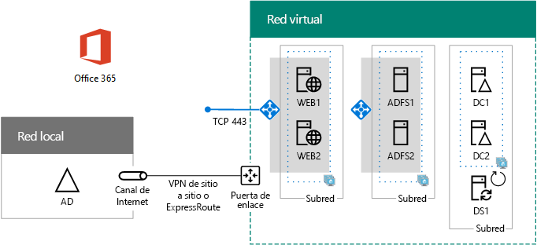

# Fase 5 de la autenticación federada de alta disponibilidad: Configurar la autenticación federada para Office 365

 **Resumen:** Configure Azure AD Connect para la autenticación federada de alta disponibilidad para Office 365 en Microsoft Azure.
 
En esta fase final de la implementación de la autenticación federada de alta disponibilidad para Office 365 en servicios de infraestructura de Azure, obtendrá e instalará un certificado emitido por una entidad de certificación pública, comprobará la configuración y después instalará y ejecutará Azure AD Connect en el servidor de DirSync. Azure AD Connect configura la suscripción a Office 365 y los Servicios de federación de Active Directory (AD FS) y servidores proxy de aplicación web para la autenticación federada.
  
Consulte todas las fases en [Implementar la autenticación federada de alta disponibilidad para Office 365 en Azure](deploy-high-availability-federated-authentication-for-office-365-in-azure.md).
  
## Obtener un certificado público y copiarlo en el servidor de DirSync

Obtenga un certificado digital de una entidad de certificación con las siguientes propiedades:
  
- Un certificado X.509 adecuado para crear conexiones SSL.
    
- La propiedad extendida de nombre alternativo del firmante (SAN) se establece en el FQDN de servicio de federación (ejemplo: fs.contoso.com).
    
- El certificado debe tener la clave privada y estar almacenado en formato PFX.
    
Además, los equipos y dispositivos de la organización deben confiar en la entidad de certificación pública que emite el certificado digital. Esta confianza se establece al tener un certificado raíz de la entidad de certificación pública instalado en el almacén de entidades de certificación raíz de confianza en sus equipos y dispositivos. Los equipos que ejecutan Microsoft Windows normalmente tienen instalado un conjunto de estos tipos de certificados de entidades de certificación usadas frecuentemente. Si el certificado raíz de la entidad de certificación pública no está instalado, debe implementarlo en los equipos y dispositivos de su organización.
  
Para obtener más información sobre los requisitos de certificado para la autenticación federada, consulte [Requisitos previos para la instalación y la configuración de la federación](https://docs.microsoft.com/azure/active-directory/connect/active-directory-aadconnect-prerequisites#prerequisites-for-federation-installation-and-configuration).
  
Cuando reciba el certificado, cópielo en una carpeta de la unidad C: del servidor de DirSync. Por ejemplo, asígnele el nombre SSL.pfx al archivo y guárdelo en la carpeta C:\\Certs del servidor de DirSync.
  
## Comprobar la configuración

Ahora debería estar preparado para configurar Azure AD Connect y la autenticación federada para Office 365. Para asegurarse de estarlo, aquí tiene una lista de comprobación:
  
- El dominio público de la organización está agregado en la suscripción de Office 365.
    
- Las cuentas de usuario de Office 365 de la organización están configuradas para el nombre de dominio público de la organización y pueden iniciar sesión correctamente.
    
- Ha determinado un FQDN de servicio de federación en función de su nombre de dominio público.
    
- Un registro A de DNS público del FQDN de servicio de federación apunta a la dirección IP pública del equilibrador de carga de Azure accesible desde Internet para los servidores proxy de aplicación web.
    
- Un registro D de DNS privado del FQDN de servicio de federación apunta a la dirección IP privada del equilibrador de carga interno de Azure para los servidores de AD FS.
    
- Un certificado digital emitido por una entidad de certificación adecuado para conexiones SSL con el SAN establecido en el FQDN de servicio de federación es un archivo PFX almacenado en el servidor de DirSync.
    
- El certificado raíz de la entidad de certificación pública está instalado en el almacén de entidades de certificación raíz de confianza en sus equipos y dispositivos.
    
Este es un ejemplo de la organización Contoso:
  
**Ejemplo de configuración de una infraestructura de autenticación federada de alta disponibilidad en Azure**

  
## Ejecutar Azure AD Connect para configurar la autenticación federada

La herramienta Azure AD Connect configura los servidores de AD FS, los servidores proxy de aplicación web y Office 365 para la autenticación federada con estos pasos:
  
1. Cree una conexión a Escritorio remoto con el servidor de DirSync con una cuenta de dominio que tenga privilegios de administrador local.
    
2. En el escritorio del servidor de DirSync, abra Internet Explorer y vaya a [https://aka.ms/aadconnect](https://aka.ms/aadconnect).
    
3. En la página **Microsoft Azure Active Directory Connect**, haga clic en **Descargar** y, después, en **Ejecutar**.
    
4. En la página **Bienvenido a Azure AD Connect**, haga clic en **Acepto** y, después, en **Continuar**.
    
5. En la página **Configuración rápida**, haga clic en **Personalizar**.
    
6. En la página **Instalar componentes necesarios**, haga clic en **Instalar**.
    
7. En la página **Inicio de sesión de usuario**, haga clic en **Federación con AD FS** y, después, haga clic en **Siguiente**.
    
8. En la página **Conectar con Azure AD**, escriba el nombre y la contraseña de una cuenta de administrador global de la suscripción de Office 365 y, después, haga clic en **Siguiente**.
    
9. En la página **Conectar sus directorios**, asegúrese de que está seleccionado el bosque local de Windows Server AD en **Bosque**, escriba el nombre y la contraseña de una cuenta de administrador de dominio, haga clic en **Agregar directorio** y, después, haga clic en **Siguiente**.
    
10. En la página **Configuración de inicio de sesión de Azure AD**, haga clic en **Siguiente**.
    
11. En la página **Filtrado de dominios y unidades organizativas**, haga clic en **Siguiente**.
    
12. En la página **Identificación de forma exclusiva de usuarios**, haga clic en **Siguiente**.
    
13. En la página **Filtrar usuarios y dispositivos**, haga clic en **Siguiente**.
    
14. En la página **Características opcionales**, haga clic en **Siguiente**.
    
15. En la página **Granja de AD FS**, haga clic en **Configurar una nueva granja de servidores de AD FS**.
    
16. Haga clic en **Examinar** y especifique la ubicación y el nombre del certificado SSL de la entidad de certificación pública.
    
17. Cuando se le pida, escriba la contraseña del certificado y, después, haga clic en **Aceptar**.
    
18. Compruebe que el **Nombre del firmante** y el **Nombre del servicio de federación** están establecidos en el FQDN de servicio de federación y, después, haga clic en **Siguiente**.
    
19. En la página **Servidores de AD FS**, escriba el nombre del primer servidor de AD FS (tabla M, elemento 4, columna Nombre de máquina virtual) y, después, haga clic en **Agregar**.
    
20. Escriba el nombre del segundo servidor de AD FS (tabla M, elemento 5, columna Nombre de máquina virtual), haga clic en **Agregar** y, después, haga clic en **Siguiente**.
    
21. En la página **Servidores de Proxy de aplicación web**, escriba el nombre del primer servidor proxy de aplicación web (tabla M, elemento 6, columna Nombre de máquina virtual) y, después, haga clic en **Agregar**.
    
22. Escriba el nombre del segundo servidor proxy de aplicación web (tabla M, elemento 7, columna Nombre de máquina virtual), haga clic en **Agregar** y, después, haga clic en **Siguiente**.
    
23. En la página **Credenciales de administrador de dominio**, escriba el nombre de usuario y la contraseña de una cuenta de administrador de dominio y después haga clic en **Siguiente**.
    
24. En la página **Cuenta del servicio AD FS**, escriba el nombre de usuario y la contraseña de una cuenta de administrador empresarial y después haga clic en **Siguiente**.
    
25. En la página **Dominio de Azure AD**, en **Dominio**, seleccione el nombre de dominio DNS de su organización y, después, haga clic en **Siguiente**.
    
26. En la página **Listo para configurar**, haga clic en **Instalar**.
    
27. En la página **Instalación completada**, haga clic en **Comprobar**. Debe ver dos mensajes que indican que tanto la configuración de Internet como la de la intranet se han comprobado correctamente.
    
  - El mensaje de la intranet debe mostrar la dirección IP privada del equilibrador de carga interno de Azure para los servidores de AD FS.
    
  - El mensaje de Internet debe mostrar la dirección IP pública del equilibrador de carga de Azure accesible desde Internet para los servidores proxy de aplicación web.
    
28. En la página **Instalación completada**, haga clic en **Salir**.
    
Esta es la configuración final, con nombres de marcador de posición para los servidores.
  
**Fase 5: Configuración final de una infraestructura de autenticación federada de alta disponibilidad en Azure**

  
La infraestructura de autenticación federada de alta disponibilidad para Office 365 en Azure está completada.
  
## See Also

[Implementar la autenticación federada de alta disponibilidad para Office 365 en Azure](deploy-high-availability-federated-authentication-for-office-365-in-azure.md)
  
[Identidad federada para el entorno de desarrollo y pruebas de Office 365](federated-identity-for-your-office-365-dev-test-environment.md)
  
[Adopción de la nube y soluciones híbridas](cloud-adoption-and-hybrid-solutions.md)

[Identidad federada para Office 365](https://support.office.com/article/Understanding-Office-365-identity-and-Azure-Active-Directory-06a189e7-5ec6-4af2-94bf-a22ea225a7a9#bk_federated)

