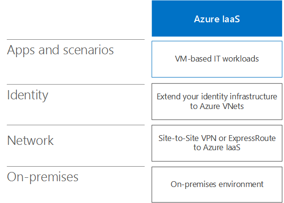
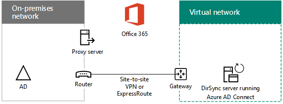
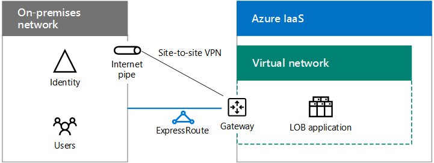
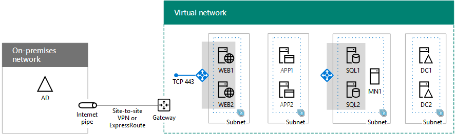

# Escenarios de nube híbrida para IaaS de AzureHybrid cloud scenarios for Azure IaaS

 **Resumen:** Comprender los escenarios y la arquitectura híbrida para infraestructura de Microsoft como servicio (IaaS)-según las ofertas de nube en Azure.**Summary:** Understand the hybrid architecture and scenarios for Microsoft's Infrastructure as a Service (IaaS)-based cloud offerings in Azure.
  
Extienda su infraestructura informática y de identidad local a la nube mediante el hospedaje de las cargas de trabajo de TI que se ejecutan en redes virtuales (VNet) de Azure entre locales. Extend your on-premises computing and identity infrastructure into the cloud by hosting IT workloads running in cross-premises Azure virtual networks (VNets). 
  
## Arquitectura de escenario híbrido de IaaS de AzureAzure IaaS hybrid scenario architecture

En la figura 1, se muestra la arquitectura de escenarios híbridos basados en IaaS de Microsoft en Azure.Figure 1 shows the architecture of Microsoft IaaS-based hybrid scenarios in Azure.
  
**Figura 1: Escenarios de híbrida basada en IaaS Microsoft en Azure****Figure 1: Microsoft IaaS-based hybrid scenarios in Azure**

  
Para cada capa de la arquitectura:For each layer of the architecture:
  
- Aplicaciones y escenariosApps and scenarios
    
    Una carga de trabajo de TI suele ser una aplicación de alta disponibilidad y varios niveles formada por máquinas virtuales (VM) de Azure.An IT workload is typically a multi-tier, highly-available application composed of Azure virtual machines (VMs).
    
- IdentidadIdentity
    
    Agregue servidores de identidades, como controladores de dominio de Windows Server AD, al conjunto de servidores que se ejecutan en redes virtuales de Azure para la autenticación local.Add identity servers, such as Windows Server AD domain controllers, to the set of servers running in Azure VNets for local authentication.
    
- RedNetwork
    
    Use una conexión VPN de sitio a sitio a través de Internet o una conexión de ExpressRoute con emparejamiento privado a IaaS de Azure.Use either a site-to-site VPN connection over the Internet or an ExpressRoute connection with private peering to Azure IaaS.
    
- LocalOn-premises
    
    Contiene servidores de identidad que se sincronizan con los servidores de identidad que se ejecutan en Azure. También puede incluir recursos a los que pueden tener acceso las máquinas virtuales que se ejecutan en Azure, como la infraestructura de administración de sistemas y almacenamiento.Contains identity servers that are synchronized with the identity servers running in Azure. Can also contain resources that VMs running in Azure can access, such as storage and systems management infrastructure.
    
## Servidor de sincronización de directorios para Office 365DirSync server for Office 365

Ejecutar el servidor de sincronización de directorios (DirSync) desde una red virtual de Azure, como se muestra en la Figura 2, es un ejemplo de la ampliación de la infraestructura informática y de identidad a la nube.Running your directory synchronization (DirSync) server from an Azure VNet, as shown in Figure 2, is an example of extending your computing and identity infrastructure to the cloud.
  
**Figura 2: Servidor de sincronización de directorios para Office 365 en Azure IaaS****Figure 2: DirSync server for Office 365 in Azure IaaS**

  
En la figura 2, una red local aloja una infraestructura Windows Server AD, con un servidor proxy y un enrutador en su borde. El enrutador se conecta a una puerta de enlace de Azure en el borde de un VNet de Azure con una conexión de sitio a sitio VPN o ExpressRoute. Dentro de la VNet, un servidor de sincronización de directorios ejecuta en Azure Connect de AD.In Figure 2, an on-premises network hosts a Windows Server AD infrastructure, with a proxy server and a router at its edge. The router connects to an Azure gateway at the edge of an Azure VNet with a site-to-site VPN or ExpressRoute connection. Inside the VNet, a DirSync server runs Azure AD Connect.
  
Un servidor de sincronización de directorios para Office 365 sincroniza la lista de cuentas en Windows Server AD con el inquilino de Azure AD de una suscripción de Office 365.A DirSync server for Office 365 synchronizes the list of accounts in Windows Server AD with the Azure AD tenant of an Office 365 subscription.
  
Un servidor de sincronización de directorios es un servidor basado en Windows que ejecuta Azure AD Connect. Para obtener un aprovisionamiento más rápido o para reducir el número de servidores locales en su organización, implemente su servidor de sincronización de directorios en una red virtual (VNet) en IaaS de Azure.A DirSync server is a Windows-based server that runs Azure AD Connect. For faster provisioning or to reduce the number of on-premises servers in your organization, deploy your DirSync server in a virtual network (VNet) in Azure IaaS.
  
El servidor de sincronización de directorios sondea Windows Server AD para obtener los cambios y, después, los sincroniza con la suscripción de Office 365.The DirSync server polls Windows Server AD for changes and then synchronizes them with the Office 365 subscription.
  
Para obtener más información, vea [Implementar Office 365 DirSync en Azure](https://technet.microsoft.com/library/dn635310.aspx).For more information, see [Deploy Office 365 DirSync in Azure](https://technet.microsoft.com/library/dn635310.aspx).
  
## Aplicación de línea de negocio (LOB)Line of business (LOB) application

En la figura 3 se muestra la configuración de una aplicación LOB basada en servidor que se ejecuta en IaaS de Azure.Figure 3 shows the configuration of a server-based LOB application running in Azure IaaS.
  
**Figura 3: Aplicación de LOB en Azure IaaS****Figure 3: LOB application in Azure IaaS**

  
En la figura 3, una red local hospeda usuarios y una infraestructura de identidad. Está conectada a una puerta de enlace de IaaS de Azure con una VPN de sitio a sitio o con una conexión ExpressRoute. IaaS de Azure hospeda una red virtual que contiene los servidores de la aplicación LOB.In Figure 3, an on-premises network hosts an identity infrastructure and users. It is connected to an Azure IaaS gateway with a site-to-site VPN or ExpressRoute connection. Azure IaaS hosts a virtual network containing the servers of the LOB application.
  
Puede crear aplicaciones de LOB ejecuta en Azure VM, que residen en las subredes de un VNet de Azure en un centro de datos de Azure (también conocido como una ubicación).You can create LOB applications running on Azure VMs, which reside on subnets of an Azure VNet in an Azure datacenter (also known as a location).
  
Dado que básicamente está extendiendo su infraestructura local a Azure, debe asignar espacio de direcciones privadas únicas a su redes virtuales y actualizar sus tablas de enrutamiento locales para garantizar la accesibilidad a cada red virtual.Because you are essentially extending your on-premises infrastructure to Azure, you must assign unique private address space to your VNets and update your on-premises routing tables to ensure reachability to each VNet.
  
Una vez conectadas, estas máquinas virtuales pueden administrarse con conexiones a Escritorio remoto o con software de administración de sistemas, al igual que los servidores locales.Once connected, these VMs can be managed with remote desktop connections or with your systems management software, just like your on-premises servers.
  
Al configurar puertos expuestos de forma pública, los usuarios móviles o remotos también pueden tener acceso a estas máquinas virtuales desde Internet.By configuring publically-exposed ports, these VMs can also be accessed from the Internet by mobile or remote users.
  
Para una configuración de prueba de concepto, vea [simulada entre local red virtual en Azure](simulated-cross-premises-virtual-network-in-azure.md).For a proof-of-concept configuration, see [Simulated cross-premises virtual network in Azure](simulated-cross-premises-virtual-network-in-azure.md).
  
Los siguientes son atributos de las aplicaciones LOB hospedadas en máquinas virtuales de Azure:Attributes of LOB applications hosted on Azure VMs are the following:
  
- Varios nivelesMultiple tiers
    
    Las aplicaciones LOB típicas usan un enfoque con niveles. Los conjuntos de servidores proporcionan identidad, procesamiento de base de datos, aplicación y procesamiento lógico, además de servidores front-end web para el acceso de empleados o clientes. Typical LOB applications use a tiered approach. Sets of servers provide identity, database processing, application and logic processing, and front-end web servers for employee or customer access. 
    
- Alta disponibilidadHigh availability
    
    Las aplicaciones LOB típicas proporcionan alta disponibilidad al usar varios servidores en cada nivel. IaaS de Azure proporciona un contrato de nivel de servicio de tiempo de actividad del 99,9 % para servidores en conjuntos de disponibilidad de Azure. Typical LOB applications provide high availability by using multiple servers in each tier. Azure IaaS provides a 99.9% uptime SLA for servers in Azure availability sets. 
    
- Distribución de la cargaLoad distribution
    
    Para distribuir la carga del tráfico de red entre varios servidores de un nivel, puede usar un equilibrador de carga accesible desde Internet o de Azure interno. O bien, puede usar un dispositivo equilibrador de carga dedicado disponible en Azure Marketplace.To distribute the load of network traffic among multiple servers in a tier, you can use an Internet-facing or internal Azure load balancer. Or, you can use a dedicated load balancer appliance available from the Azure marketplace.
    
- SeguridadSecurity
    
    Para proteger los servidores del tráfico entrante no solicitado de Internet, puede usar grupos de seguridad de red de Azure. Puede definir el tráfico permitido o denegado de una subred o de la interfaz de red de una máquina virtual individual.To protect servers from unsolicited incoming traffic from the Internet, you can use Azure network security groups. You can define allowed or denied traffic for a subnet or the network interface of an individual virtual machine.
    
## Granja de servidores de SharePoint Server 2016 en AzureSharePoint Server 2016 farm in Azure

Un ejemplo de una aplicación LOB de niveles múltiples y de alta disponibilidad en Azure es una granja de servidores de SharePoint Server 2016, como se muestra en la figura 4.An example of a multi-tier, highly-available LOB application in Azure is a SharePoint Server 2016 farm, as shown in Figure 4.
  
**Figura 4: Una granja de alta disponibilidad 2016 de SharePoint Server en Azure IaaS****Figure 4: A high-availability SharePoint Server 2016 farm in Azure IaaS**

  
En la figura 4, una red local hospeda usuarios y una infraestructura de identidad. Está conectada a una puerta de enlace de IaaS de Azure con una VPN de sitio a sitio o con una conexión ExpressRoute. La red virtual de Azure contiene los servidores de la granja de SharePoint Server 2016, que incluye niveles independientes para los servidores de front-end, los servidores de aplicaciones, el clúster de SQL Server y los controladores de dominio.In Figure 4, an on-premises network hosts an identity infrastructure and users. It is connected to an Azure IaaS gateway with a site-to-site VPN or ExpressRoute connection. The Azure VNet contains the servers of the SharePoint Server 2016 farm, which includes separate tiers for the front-end servers, the application servers, the SQL Server cluster, and the domain controllers.
  
Esta configuración tiene los siguientes atributos de aplicaciones LOB en Azure: This configuration has the following attributes of LOB applications in Azure: 
  
- NivelesTiers
    
    Ejecutan funciones diferentes dentro de la granja de servidores crean los niveles y cada nivel tiene su propia subred.Servers running different roles within the farm create the tiers and each tier has its own subnet.
    
- Alta disponibilidadHigh-availability
    
    Se obtiene usando más de un servidor en cada nivel y colocando todos los servidores de un nivel en el mismo conjunto de disponibilidad.Achieved by using more than one server in each tier and placing all the servers of a tier in the same availability set.
    
- Distribución de la cargaLoad distribution
    
    Los equilibradores de carga internos de Azure distribuyen el tráfico web de cliente entrante a los servidores de front-end (WEB1 y WEB2) y a la dirección IP del agente de escucha del clúster de SQL Server (SQL1, SQL2 y MN1).Internal Azure load balancers distribute the incoming client web traffic to the front-end servers (WEB1 and WEB2) and to the listener IP address of the SQL Server cluster (SQL1, SQL2, and MN1).
    
- SeguridadSecurity
    
    Los grupos de seguridad de red para cada subred le permiten configurar tráfico entrante y saliente permitido.Network security groups for each subnet let you to configure allowed inbound and outbound traffic.
    
Siga esta ruta de acceso para realizar una adopción correcta:Follow this path for successful adoption:
  
1. Evaluar y experimentarEvaluate and experiment
    
    Consulte [SharePoint Server 2016 en Azure de Microsoft](https://technet.microsoft.com/library/mt779107%28v=office.16%29.aspx) a comprender las ventajas de ejecutar SharePoint Server 2016 en Azure.See [SharePoint Server 2016 in Microsoft Azure](https://technet.microsoft.com/library/mt779107%28v=office.16%29.aspx) to understand the benefits of running SharePoint Server 2016 in Azure.
    
    Ver [Intranet 2016 de servidor de SharePoint en el entorno de pruebas y desarrollo de Azure](https://technet.microsoft.com/library/mt806351%28v=office.16%29.aspx) para crear un entorno de desarrollo/pruebas simuladasSee [Intranet SharePoint Server 2016 in Azure dev/test environment](https://technet.microsoft.com/library/mt806351%28v=office.16%29.aspx) to build a simulated dev/test environment
    
2. DiseñoDesign
    
    Vea el [Diseño de una granja de SharePoint Server 2016 en Azure](https://technet.microsoft.com/library/mt779108%28v=office.16%29.aspx) paso a paso a través de un proceso para determinar el conjunto de redes de IaaS Azure compute y elementos de almacenamiento para alojar el conjunto de servidores y su configuración.See [Designing a SharePoint Server 2016 farm in Azure](https://technet.microsoft.com/library/mt779108%28v=office.16%29.aspx) to step through a process to determine the set of Azure IaaS networking, compute, and storage elements to host your farm and their settings.
    
3. ImplementarDeploy
    
    Vea [implementar SharePoint Server 2016 con grupos de disponibilidad de SQL Server AlwaysOn en Azure](https://technet.microsoft.com/library/mt793552%28v=office.16%29.aspx) paso a paso a través de la configuración de end-to-end de la granja de servidores de alta disponibilidad en cinco fases.See [Deploying SharePoint Server 2016 with SQL Server AlwaysOn Availability Groups in Azure](https://technet.microsoft.com/library/mt793552%28v=office.16%29.aspx) to step through the end-to-end configuration of the high-availability farm in five phases.
    
## Identidad federada para Office 365 en AzureFederated identity for Office 365 in Azure

Otro ejemplo de una aplicación empresarial de varios niveles y altamente disponible en Azure es identidad federada para Office 365.Another example of a multi-tier, highly-available LOB application in Azure is federated identity for Office 365.
  
**Figura 5: Una infraestructura de alta disponibilidad de identidad federada para Office 365 en Azure IaaS****Figure 5: A high-availability federated identity infrastructure for Office 365 in Azure IaaS**

  
En la figura 5, una red local aloja usuarios y una infraestructura de identidad. Está conectado a una puerta de enlace de Azure IaaS con una conexión de sitio a sitio VPN o ExpressRoute. El VNet de Azure contiene controladores de dominio de Windows Server Active Directory (AD), servidores de servicios de federación de Active Directory (AD FS) y servidores proxy web.In Figure 5, an on-premises network hosts an identity infrastructure and users. It is connected to an Azure IaaS gateway with a site-to-site VPN or ExpressRoute connection. The Azure VNet contains web proxy servers, Active Directory Federation Services (AD FS) servers, and Windows Server Active Directory (AD) domain controllers.
  
Esta configuración tiene los siguientes atributos de aplicaciones LOB en Azure: This configuration has the following attributes of LOB applications in Azure:
  
- **Niveles:** Existen niveles para controladores de dominio de Windows Server AD, servidores de AD FS y servidores proxy web.**Tiers:** There are tiers for web proxy servers, AD FS servers, and Windows Server AD domain controllers.
    
- **Distribución de carga:** Un equilibrador de carga externo de Azure distribuye las solicitudes de autenticación de cliente entrantes a los servidores proxy de web y un equilibrador de carga interno de Azure distribuye las solicitudes de autenticación a los servidores de AD FS.**Load distribution:** An external Azure load balancer distributes the incoming client authentication requests to the web proxies and an internal Azure load balancer distributes authentication requests to the AD FS servers.
    
Siga esta ruta de acceso para realizar una adopción correcta:Follow this path for successful adoption:
  
1. Evaluar y experimentarEvaluate and experiment
    
    Vea la [identidad federada para su entorno de pruebas y desarrollo de Office 365](federated-identity-for-your-office-365-dev-test-environment.md) para crear un entorno de desarrollo/pruebas simuladas para autenticación federados con Office 365.See [Federated identity for your Office 365 dev/test environment](federated-identity-for-your-office-365-dev-test-environment.md) to build a simulated dev/test environment for federated authentication with Office 365.
    
2. ImplementarDeploy
    
    Vea [autenticación federados de alta disponibilidad de implementación para Office 365 en Azure](deploy-high-availability-federated-authentication-for-office-365-in-azure.md) paso a paso a través de la configuración de end-to-end de la infraestructura de AD FS de alta disponibilidad en cinco fases.See [Deploy high availability federated authentication for Office 365 in Azure](deploy-high-availability-federated-authentication-for-office-365-in-azure.md) to step through the end-to-end configuration of the high availability AD FS infrastructure in five phases.
    
Consulte estos recursos adicionales:See these additional resources:
  
- [Diseñar entornos de nube híbridaArchitecting Hybrid Cloud Environments](https://gallery.technet.microsoft.com/Architecting-Hybrid-Cloud-a7dc9f24/file/147475/1/Architecting%20Hybrid%20Cloud%20Environments%20V1.docx)
    
- [Ampliar su centro de datos para el curso de la nube de Microsoft Virtual AcademyExtend Your Datacenter to the Cloud Microsoft Virtual Academy course](https://mva.microsoft.com/en-US/training-courses/extend-your-datacenter-to-the-cloud-13908?l=7fG3tAouB_7100115881)
    
- [Diseñar y construir una aplicación LOB en AzureDesign and Build an LOB application in Azure ](https://techcommunity.microsoft.com/t5/CAAB-Cloud-Adoption-Advisory/EXTRA-November-2016-Webinar/m-p/30058#M41)
    
## Vea tambiénSee Also

[Microsoft Hybrid Cloud para arquitectos profesionalesMicrosoft Hybrid Cloud for Enterprise Architects](microsoft-hybrid-cloud-for-enterprise-architects.md)
  
[Recursos de arquitectura de TI de la nube de MicrosoftMicrosoft Cloud IT architecture resources](microsoft-cloud-it-architecture-resources.md)

[Mapa de ruta de Enterprise Cloud de Microsoft: Recursos para los responsables de decisiones de TIMicrosoft's Enterprise Cloud Roadmap: Resources for IT Decision Makers](https://sway.com/FJ2xsyWtkJc2taRD)

