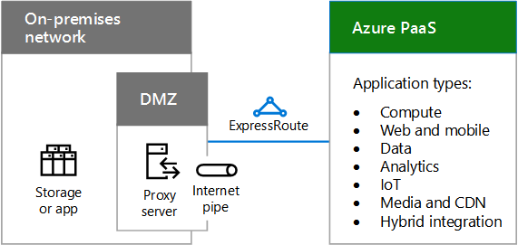
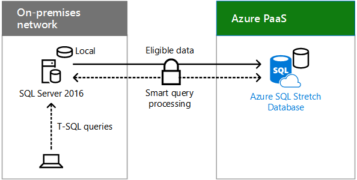

# Escenarios de nube híbrida para PaaS de Azure

 **Resumen:** Comprenda la arquitectura y los escenarios híbridos de las ofertas de nubes basadas en Plataforma como servicio (PaaS) de Microsoft en Azure.
  
Combine datos locales o recursos de proceso con aplicaciones nuevas o convertidas que se ejecuten en PaaS de Azure, que puedan aprovechar el rendimiento, la confiabilidad y la escalabilidad de la nube, además de proporcionar soporte técnico mejorado para los usuarios móviles. 
  
## Arquitectura de escenario híbrido de PaaS de Azure

En la figura 1, se muestra la arquitectura de escenarios híbridos basados en PaaS de Microsoft en Azure.
  
**Figura 1: Escenarios híbridos basados en PaaS de Microsoft en Azure**

  
Para cada capa de la arquitectura:
  
- Aplicaciones y escenarios
    
    Una aplicación PaaS híbrida se ejecuta en Azure y usa los recursos de proceso o almacenamiento locales.
    
- Identidad
    
    Consta de la sincronización de directorios o la federación con un proveedor de identidades de terceros.
    
- Red
    
    Consta de la canalización de Internet existente o de una conexión de ExpressRoute con emparejamiento público a PaaS de Azure. Debe incluir una forma para que la aplicación de PaaS de Azure tenga acceso al recurso de almacenamiento o proceso local.
    
- Local
    
    Consta de infraestructura de identidad y seguridad, así como de aplicaciones de línea de negocio (LOB) o servidores de bases de datos existentes, a los que una aplicación PaaS de Azure puede tener acceso con seguridad.
    
## Aplicación híbrida de PaaS de Azure

En la figura 2, se muestra la configuración de una aplicación híbrida que se ejecuta en Azure.
  
**Figura 2: Aplicación híbrida basada en PaaS de Azure**

  
En la figura 2, una red local hospeda almacenamiento o aplicaciones en servidores y una red perimetral que contiene un servidor proxy. Está conectada a los servicios de PaaS de Azure en Internet o con una conexión de ExpressRoute.
  
Para poner sus recursos de proceso o almacenamiento a disposición de la aplicación PaaS de Azure híbrida, una organización puede hacer lo siguiente:
  
- Hospedar el recurso en servidores de la red perimetral.
    
- Hospedar un servidor proxy inverso en la red perimetral, que permite las solicitudes autenticadas, entrantes, basadas en HTTPS para el recurso ubicado de manera local.
    
La aplicación de Azure puede usar las credenciales de:
  
- Azure AD, que se pueden sincronizar con el proveedor de identidades local, como Windows Server AD.
    
- Un proveedor de identidades de terceros.
    
### Aplicación PaaS de Azure híbrida de ejemplo

En la figura 3, se muestra un ejemplo de aplicación híbrida que se ejecuta en Azure.
  
**Figura 3: Un ejemplo de aplicación híbrida basada en PaaS de Azure**

  
En la figura 3, una red local hospeda una aplicación LOB. PaaS de Azure hospeda una aplicación móvil personalizada. Un smartphone en Internet tiene acceso a la aplicación móvil personalizada en Azure, que envía solicitudes de datos a la aplicación LOB local.
  
Esta aplicación PaaS de Azure híbrida de ejemplo es una aplicación móvil personalizada que proporciona información de contacto actualizada de los empleados. El escenario híbrido completo consta de:
  
- Una aplicación para smartphone que necesita credenciales locales validadas para funcionar.
    
- Una aplicación móvil personalizada que se ejecuta en PaaS de Azure, que solicita información sobre empleados específicos según las consultas de la aplicación para smartphone de un usuario.
    
- Un servidor proxy inverso en la red perimetral que valida la aplicación móvil personalizada y reenvía la solicitud.
    
- Una granja de servidores de aplicaciones LOB que atiende la solicitud de contacto, sujeta a los permisos de la cuenta del usuario.
    
Dado que el proveedor de identidades local se ha sincronizado con Azure AD, la aplicación móvil personalizada y la aplicación LOB pueden validar el nombre de cuenta del usuario que realiza la solicitud.
  
## Stretch Database con SQL Server 2016

Stretch Database es una característica de SQL Server 2016 que permite mover datos inactivos de manera transparente y segura, tales como datos de negocios cerrados de una tabla grande que contiene información de pedidos de clientes, a una base de datos de SQL Stretch en Azure.
  
Cuando se extiende, el contenido de una instancia de SQL Server, una base de datos o incluso una sola tabla es la combinación de los datos locales del servidor SQL Server 2016 y los datos remotos de Azure. SQL Server 2016 mueve automáticamente los datos susceptibles de ampliación a Azure.
  
En la figura 4, se muestra Stretch Database con SQL Server 2016.
  
**Figura 4: Stretch Database con SQL Server 2016**

  
En la figura 4, una red local hospeda un servidor que ejecuta SQL Server 2016 con una pequeña base de datos local. PaaS de Azure hospeda una instancia de Azure SQL Server Stretch Database con la parte extendida de la base de datos. Las consultas de T-SQL de un usuario local enviadas al servidor SQL local se reenvían de forma segura a Azure SQL Stretch Database, que devuelve los resultados al usuario que envía la solicitud.
  
 Las consultas del usuario que incluyen los datos históricos se reenvían de manera transparente a Azure SQL Stretch Database. No es necesario que las consultas se vuelvan a escribir, aunque se extienda la tabla.
  
Stretch Database proporciona una opción rentable para el almacenamiento a largo plazo y el acceso transparente a los datos históricos. También soluciona problemas de rendimiento y disponibilidad que surgen cuando las tablas son muy grandes.
  
Para obtener más información, consulte [Stretch Database](https://msdn.microsoft.com/library/dn935011.aspx).
  
## Vea también

[Microsoft Hybrid Cloud para arquitectos profesionales](microsoft-hybrid-cloud-for-enterprise-architects.md)
  
[Recursos de arquitectura de TI de la nube de Microsoft](microsoft-cloud-it-architecture-resources.md)

[Mapa de ruta de Enterprise Cloud de Microsoft: Recursos para los responsables de decisiones de TI](https://sway.com/FJ2xsyWtkJc2taRD)

