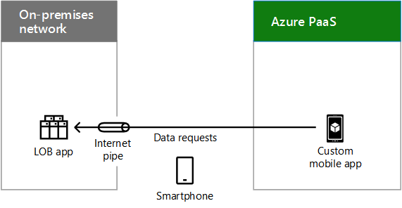

# Escenarios de nube híbrida para PaaS de AzureHybrid cloud scenarios for Azure PaaS

 **Resumen:** Comprenda la arquitectura y los escenarios híbridos de las ofertas de nubes basadas en Plataforma como servicio (PaaS) de Microsoft en Azure.**Summary:** Understand the hybrid architecture and scenarios for Microsoft's Platform as a Service (PaaS)-based cloud offerings in Azure.
  
Combine datos locales o recursos de proceso con aplicaciones nuevas o convertidas que se ejecuten en PaaS de Azure, que puedan aprovechar el rendimiento, la confiabilidad y la escalabilidad de la nube, además de proporcionar soporte técnico mejorado para los usuarios móviles.Combine on-premises data or computing resources with new or converted applications running in Azure PaaS, which can take advantage of cloud performance, reliability, and scale and provide better support for mobile users. 
  
## Arquitectura de escenario híbrido de PaaS de AzureAzure PaaS hybrid scenario architecture

En la figura 1, se muestra la arquitectura de escenarios híbridos basados en PaaS de Microsoft en Azure.Figure 1 shows the architecture of Microsoft PaaS-based hybrid scenarios in Azure.
  
**Figura 1: Escenarios híbridos basados en PaaS de Microsoft en Azure****Figure 1: Microsoft PaaS-based hybrid scenarios in Azure**

  
Para cada capa de la arquitectura:For each layer of the architecture:
  
- Aplicaciones y escenariosApps and scenarios
    
    Una aplicación PaaS híbrida se ejecuta en Azure y usa los recursos de proceso o almacenamiento locales.A hybrid PaaS application runs in Azure and uses on-premises compute or storage resources.
    
- IdentidadIdentity
    
    Consta de la sincronización de directorios o la federación con un proveedor de identidades de terceros.Consists of either directory synchronization or federation with a third-party identity provider.
    
- RedNetwork
    
    Consta de la canalización de Internet existente o de una conexión de ExpressRoute con emparejamiento público a PaaS de Azure. Debe incluir una forma para que la aplicación de PaaS de Azure tenga acceso al recurso de almacenamiento o proceso local.Consists of either your existing Internet pipe or an ExpressRoute connection with public peering to Azure PaaS. You must include a way for the Azure PaaS application to access the on-premises compute or storage resource.
    
- LocalOn-premises
    
    Consta de infraestructura de identidad y seguridad, así como de aplicaciones de línea de negocio (LOB) o servidores de bases de datos existentes, a los que una aplicación PaaS de Azure puede tener acceso con seguridad.Consists of identity and security infrastructure and existing line of business (LOB) applications or database servers, which an Azure PaaS application can securely access.
    
## Aplicación híbrida de PaaS de AzureAzure PaaS hybrid application

En la figura 2, se muestra la configuración de una aplicación híbrida que se ejecuta en Azure.Figure 2 shows the configuration of a hybrid application running in Azure.
  
**Figura 2: Aplicación híbrida basada en PaaS de Azure****Figure 2: Azure PaaS-based hybrid application**

  
En la figura 2, una red local hospeda almacenamiento o aplicaciones en servidores y una red perimetral que contiene un servidor proxy. Está conectada a los servicios de PaaS de Azure en Internet o con una conexión de ExpressRoute.In Figure 2, an on-premises network hosts storage or apps on servers and a DMZ containing a proxy server. It is connected to Azure PaaS services either over the Internet or with an ExpressRoute connection.
  
Para poner sus recursos de proceso o almacenamiento a disposición de la aplicación PaaS de Azure híbrida, una organización puede hacer lo siguiente:An organization can make its compute or storage resources available to the Azure PaaS hybrid application by:
  
- Hospedar el recurso en servidores de la red perimetral.Hosting the resource on servers in the DMZ.
    
- Hospedar un servidor proxy inverso en la red perimetral, que permite las solicitudes autenticadas, entrantes, basadas en HTTPS para el recurso ubicado de manera local.Hosting a reverse proxy server in the DMZ, which allows authenticated, inbound, HTTPS-based requests to the resource that is located on-premises.
    
La aplicación de Azure puede usar las credenciales de:The Azure app can use credentials from:
  
- Azure AD, que se pueden sincronizar con el proveedor de identidades local, como Windows Server AD.Azure AD, which can be synchronized with your on-premises identity provider, such as Windows Server AD.
    
- Un proveedor de identidades de terceros.A third-party identity provider.
    
### Aplicación PaaS de Azure híbrida de ejemploExample Azure PaaS hybrid application

En la figura 3, se muestra un ejemplo de aplicación híbrida que se ejecuta en Azure.Figure 3 shows an example hybrid application running in Azure.
  
**Figura 3: Un ejemplo de aplicación híbrida basada en PaaS de Azure****Figure 3: An example Azure PaaS-based hybrid application**

  
En la figura 3, una red local hospeda una aplicación LOB. PaaS de Azure hospeda una aplicación móvil personalizada. Un smartphone en Internet tiene acceso a la aplicación móvil personalizada en Azure, que envía solicitudes de datos a la aplicación LOB local.In Figure 3, an on-premises network hosts an LOB app. Azure PaaS hosts a custom mobile app. A smartphone on the Internet accesses the custom mobile app in Azure, which sends data requests to the on-premises LOB app.
  
Esta aplicación PaaS de Azure híbrida de ejemplo es una aplicación móvil personalizada que proporciona información de contacto actualizada de los empleados. El escenario híbrido completo consta de:This example Azure PaaS hybrid application is a custom mobile app that provides up-to-date contact information on employees. The end-to-end hybrid scenario consists of:
  
- Una aplicación para smartphone que necesita credenciales locales validadas para funcionar.A smartphone app that requires validated, on-premises credentials to run.
    
- Una aplicación móvil personalizada que se ejecuta en PaaS de Azure, que solicita información sobre empleados específicos según las consultas de la aplicación para smartphone de un usuario.A custom mobile app running in Azure PaaS, which requests information about specific employees based on queries from a user's smartphone app.
    
- Un servidor proxy inverso en la red perimetral que valida la aplicación móvil personalizada y reenvía la solicitud.A reverse proxy server in the DMZ that validates the custom mobile app and forwards the request.
    
- Una granja de servidores de aplicaciones LOB que atiende la solicitud de contacto, sujeta a los permisos de la cuenta del usuario.An LOB application server farm that services the contact request, subject to the permissions of the user's account.
    
Dado que el proveedor de identidades local se ha sincronizado con Azure AD, la aplicación móvil personalizada y la aplicación LOB pueden validar el nombre de cuenta del usuario que realiza la solicitud.Because the on-premises identity provider has been synchronized with Azure AD, both the custom mobile app and the LOB app can validate the requesting user's account name.
  
## Stretch Database con SQL Server 2016Stretch Database with SQL Server 2016

Stretch Database es una característica de SQL Server 2016 que permite mover datos inactivos de manera transparente y segura, tales como datos de negocios cerrados de una tabla grande que contiene información de pedidos de clientes, a una base de datos de SQL Stretch en Azure.Stretch database is a feature of SQL Server 2016 that allows you to transparently and securely move cold data, such as closed business data in a large table that contains customer order information, to a SQL Stretch database in Azure.
  
Cuando se extiende, el contenido de una instancia de SQL Server, una base de datos o incluso una sola tabla es la combinación de los datos locales del servidor SQL Server 2016 y los datos remotos de Azure. SQL Server 2016 mueve de forma automática los datos susceptibles de ampliación a Azure.When stretched, the contents of a SQL Server instance, a database, or even a single table is the combination of local data in SQL Server 2016 server and remote data in Azure. Data that becomes eligible for stretch is automatically moved to Azure by SQL Server 2016.
  
En la figura 4, se muestra Stretch Database con SQL Server 2016.Figure 4 shows Stretch Database with SQL Server 2016.
  
**Figura 4: Stretch Database con SQL Server 2016****Figure 4: Stretch Database with SQL Server 2016**

  
En la figura 4, una red local hospeda un servidor que ejecuta SQL Server 2016 con una pequeña base de datos local. PaaS de Azure hospeda una instancia de Azure SQL Server Stretch Database con la parte extendida de la base de datos. Las consultas de T-SQL de un usuario local enviadas al servidor SQL local se reenvían de forma segura a Azure SQL Stretch Database, que devuelve los resultados al usuario que envía la solicitud.In Figure 4, an on-premises network hosts a server running SQL Server 2016 with a small local database. Azure PaaS hosts an instance of Azure SQL Server Stretch Database with the stretched portion of the database. T-SQL queries from an on-premises user sent to the on-premises SQL server are securely forwarded to the Azure SQL Stretch Database, which returns the results to the requesting user.
  
 Las consultas de usuario que incluyen los datos históricos se reenvían de forma transparente a Azure SQL Stretch Database. No es necesario volver a escribir las consultas, aunque la tabla esté extendida.User queries that include the historical data are transparently forwarded to Azure SQL Stretch database. The queries do not need to be re-written, even though the table is stretched.
  
Stretch Database proporciona una opción rentable para el almacenamiento a largo plazo y el acceso transparente a los datos históricos. También soluciona problemas de rendimiento y disponibilidad que surgen cuando las tablas son muy grandes.Stretch database provides a cost-effective option for long-term storage and transparent access to historical data. It also solves performance and availability problems that arise when tables become very large.
  
Para obtener más información, consulte [Stretch Database](https://msdn.microsoft.com/library/dn935011.aspx).For more information, see [Stretch Database](https://msdn.microsoft.com/library/dn935011.aspx).
  
## See AlsoSee Also

[Microsoft Hybrid Cloud para arquitectos profesionalesMicrosoft Hybrid Cloud for Enterprise Architects](microsoft-hybrid-cloud-for-enterprise-architects.md)
  
[Recursos de arquitectura de TI de la nube de MicrosoftMicrosoft Cloud IT architecture resources](microsoft-cloud-it-architecture-resources.md)

[Mapa de ruta de Enterprise Cloud de Microsoft: Recursos para los responsables de decisiones de TIMicrosoft's Enterprise Cloud Roadmap: Resources for IT Decision Makers](https://sway.com/FJ2xsyWtkJc2taRD)

