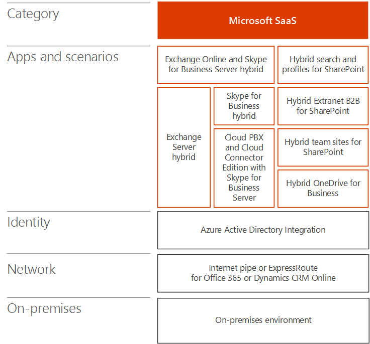
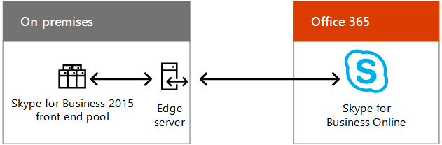
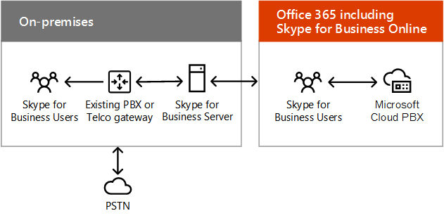
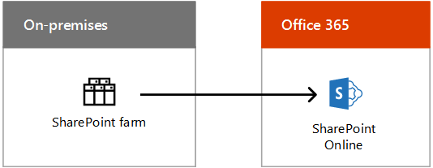
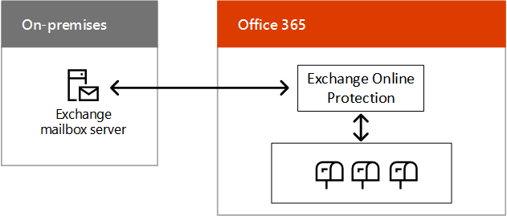

# Escenarios de nube híbrida para SaaS de Microsoft (Office 365)

 **Resumen:** Comprender la arquitectura híbrida y escenarios de Microsoft basada en SaaS (Office 365) las ofertas de nube.
  
Combine las implementaciones locales de Exchange, SharePoint o Skype Empresarial con sus equivalentes de Office 365 como parte de una migración a la nube o estrategia de integración a largo plazo.
  
## Arquitectura de escenario híbrido de SaaS de Microsoft

En la figura 1, se muestra la arquitectura de escenarios híbridos basados en SaaS de Microsoft para Office 365.
  
**Figura 1: Escenarios de basada en SaaS híbrida de Microsoft para Office 365**

  
Para cada capa de la arquitectura:
  
- Aplicaciones y escenarios
    
    Existe una gran variedad de escenarios híbridos basados en SaaS, que se alinean con los productos de Office Server y sus equivalentes de Office 365:
    
  - Exchange Server combinado con Exchange Online (Exchange Server híbrido)
    
  - Skype Empresarial Server combinado con Skype Empresarial Online y los nuevos escenarios PBX en la nube y Cloud Connector Edition
    
  - SharePoint Server 2016 o SharePoint Server 2013 combinado con SharePoint Online (varios escenarios)
    
    También existe Exchange Online con Skype Empresarial Server local, un escenario híbrido entre productos.
    
- Identidad
    
    Puede incluir la sincronización de directorios con Windows Server AD local. Como alternativa, puede configurar Azure AD para que se federe con un proveedor de identidades de terceros.
    
- Red
    
    Consta de la canalización de Internet existente o de una conexión de ExpressRoute con emparejamiento de Microsoft para Office 365 o Dynamics 365.
    
- Local
    
    Puede constar de los servidores existentes de Exchange, SharePoint y Skype Empresarial, que deberían estar actualizados a las versiones más recientes. Después, se pueden combinar con sus equivalentes de Office 365 para los escenarios híbridos.
    
Configure su propio [entorno de desarrollo y prueba de Office 365](office-365-dev-test-environment.md).
  
## Skype Empresarial 2015 híbrido

Skype para negocios 2015 híbrido le permite combinar una implementación local existente con Skype para los negocios en línea. Algunos usuarios están alojados en locales y algunos usuarios están alojados en línea, pero los usuarios comparten el mismo dominio de protocolo de inicio de sesión (SIP), como contoso.com. Puede utilizar esta configuración híbrida para migrar desde local a Office 365 con el tiempo, en la programación. Skype para el año 2015 de negocios también puede integrarse con Exchange Online.
  
**Figura 2: Skype para configuración híbrida de negocios 2015**

  
La figura 2 muestra el Skype para configuración híbrida de negocios 2015, que consta de un Skype local para el grupo de front-end de negocios 2015 y edge server comunicarse con Skype para los negocios en línea en Office 365.
  
Para obtener más información, vea:
  
- [Plan de conectividad híbrida entre Skype para Business Server y Skype para los negocios en línea](https://technet.microsoft.com/library/jj205403.aspx)
    
- [Configuraciones compatibles híbrido de Skype para Business Server 2015](https://technet.microsoft.com/library/jj945633.aspx)
    
- [Skype para negocios híbrido](http://hybrid.office.com/skype-for-business/)
    
## PBX en la nube con Skype Empresarial Server

PBX en la nube con Skype Empresarial Server permite realizar la transición de una implementación local de Skype Empresarial Server existente a una topología con conectividad de red telefónica conmutada (RTC) local.  
  
**Figura 3: Nube PBX con Skype para Business Server**

  
La figura 3 muestra la PBX de nube con Skype para la configuración de Business Server, que consta de un local PBX existente o puerta de enlace de telecomunicaciones, un Skype para Business Server y PSTN conectado a la PBX de nube de Microsoft Office 365, que incluye Skype para empresas En línea.
  
Los usuarios de la organización alojados en la nube pueden recibir servicios de central de conmutación (PBX) de la nube de Microsoft, que incluyen señalización y correo de voz, pero la conectividad RTC (tono de marcado) se proporciona a través de la Telefonía IP empresarial desde la implementación de Skype Empresarial Server local.
  
Este es un gran ejemplo de una configuración híbrida que le permite migrar a un servicio basado en la nube de forma gradual. Puede conservar las capacidades de voz de los usuarios al comenzar a moverlos a Skype Empresarial Online. Puede mover los usuarios a su propio ritmo, con la seguridad de que sus características de voz seguirán sin importar dónde se alojen.  
  
Para obtener más información, consulte [Plan conectividad híbrida entre Skype para Business Server y Skype para los negocios en línea o Lync Server 2013](https://technet.microsoft.com/library/jj205403.aspx).
  
Si aún no tiene ninguna implementación de Lync Server o Skype Empresarial Server, puede usar Skype Empresarial Cloud Connector Edition, un conjunto de máquinas virtuales (VM) empaquetadas que implementan la conectividad RTC local con PBX en la nube.
  
Para obtener más información, consulte [Plan de Skype para conector de nube Business Edition](https://technet.microsoft.com/library/mt605227.aspx).
  
## Entorno híbrido de SharePoint

SharePoint híbrido combina SharePoint Online en Office 365 con su granja de SharePoint local para ofrecer la mejor experiencia conectada de ambos mundos.
  
**Figura 4: La configuración de SharePoint híbrida**

  
La figura 4 muestra la configuración híbrida de SharePoint, que consta de una granja de SharePoint local comunicarse con SharePoint Online en Office 365.
  
Escenarios híbridos de SharePoint:
  
- [Híbrido OneDrive para el negocio](https://technet.microsoft.com/library/mt147425%28v=office.16%29.aspx)
    
- [Sitios de equipo híbrido](https://technet.microsoft.com/library/mt346110%28v=office.16%29.aspx)
    
- [Híbrido Extranet B2B](https://support.office.com/article/SharePoint-Business-to-Business-Collaboration-Extranet-for-Partners-with-Office-365-7b087413-165a-4e94-8871-4393e0b9c037)
    
- [Búsqueda de híbrido](https://technet.microsoft.com/library/dn720906%28v=office.16%29.aspx)
    
- [Perfiles de híbrido](https://support.office.com/article/Plan-hybrid-profiles-96d1eaf0-94eb-40c5-ab76-c82907777db4)
    
- [Selector de híbrido](https://support.office.com/article/Hybrid-picker-in-the-SharePoint-Online-admin-center-efce8417-c9bc-4a2c-ac9d-cce6c4e84a9c)
    
    Es fácil habilitar escenarios híbridos mediante asistentes que automatizan la configuración híbrida, disponible desde el Centro de administración de SharePoint Online en Office 365.
    
- [Selector de aplicación extensible híbrido](https://support.office.com/article/The-extensible-hybrid-app-launcher-617a7cb5-53da-4128-961a-64a840c0ab91)
    
    Permite a los usuarios ver y usar las aplicaciones y experiencias de Office 365 Video y Delve en las páginas de su granja de SharePoint local.
    
Todos estos escenarios híbridos de SharePoint, excepto el iniciador de aplicaciones híbrido extensible, están disponibles para los usuarios de SharePoint 2016 y SharePoint 2013.
  
Para obtener más información, vea [Híbrido de SharePoint](http://hybrid.office.com/sharepoint/).
  
## Exchange Server 2016 híbrido

Con Exchange Server 2016 híbrido, puede materializar los beneficios de Exchange Online en Office 365 para los usuarios en línea mientras los usuarios locales siguen usando la infraestructura existente de Exchange Server.  
  
**Figura 5: La configuración de Exchange 2016 híbrida**

  
La figura 5 muestra la configuración híbrida de 2016 de Exchange, que se compone de servidores de buzones de Exchange local comunicarse con protección en línea de Exchange y los buzones de Office 365.
  
Algunos usuarios tienen un servidor de correo local y otros usan Exchange Online, pero todos comparten el mismo espacio de direcciones de correo.  
  
Esta configuración híbrida:
  
- Aprovecha la infraestructura existente de Exchange Server durante la migración a Exchange Online con el tiempo, en la programación.
    
- Permite admitir sitios remotos sin invertir en infraestructura de sucursales.
    
- Permite enrutar el correo electrónico entrante de Internet a través de Exchange Online Protection en Office 365.
    
- Satisface las necesidades de organizaciones multinacionales con subsidiarias que necesitan que los datos residan localmente.
    
También puede integrar esta configuración híbrida con otras aplicaciones de Microsoft Office 365, como Skype Empresarial Online y SharePoint Online.
  
Para obtener más información, vea [Implementación híbrida de Exchange Server](https://technet.microsoft.com/library/jj200581%28v=exchg.150%29.aspx) y [Exchange híbrido](http://hybrid.office.com/exchange/).
  
## See Also

[Microsoft Hybrid Cloud para arquitectos profesionales](microsoft-hybrid-cloud-for-enterprise-architects.md)
  
[Recursos de arquitectura de TI de la nube de Microsoft](microsoft-cloud-it-architecture-resources.md)

[Mapa de ruta de Enterprise Cloud de Microsoft: Recursos para los responsables de decisiones de TI](https://sway.com/FJ2xsyWtkJc2taRD)

