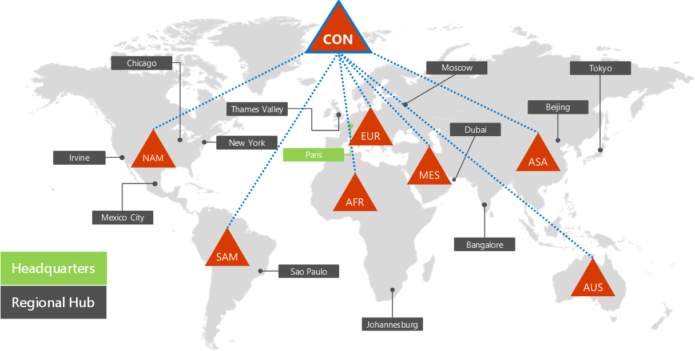
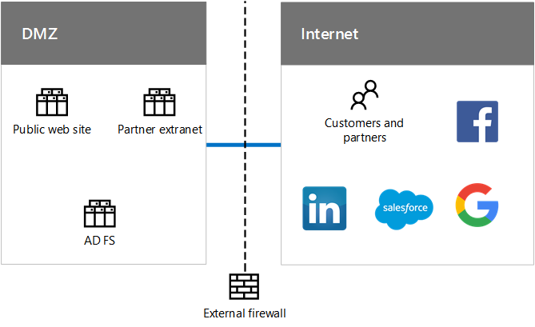
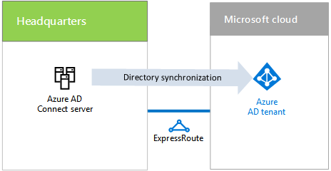
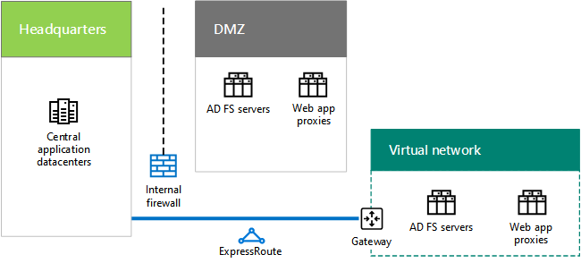

# Identidad para Contoso CorporationIdentity for the Contoso Corporation

 **Resumen:** Comprender cómo Contoso aprovecha IDaaS proporciona geográficamente distribuida y redundantes la autenticación y para sus usuarios.**Summary:** Understand how Contoso takes advantage of IDaaS and provides geographically distributed and redundant authentication for its users.
  
Microsoft proporciona una identidad como un servicio (IDaaS) a través de sus ofertas de nube. Para adoptar una infraestructura cloud inclusive, solución de IDaaS de Contoso debe aprovechar su proveedor de identidad local e incluir autenticación federados con sus proveedores de identidades de confianza de terceros existentes.Microsoft provides an Identity as a Service (IDaaS) across its cloud offerings. To adopt a cloud-inclusive infrastructure, Contoso's IDaaS solution must leverage their on-premises identity provider and include federated authentication with their existing trusted, third-party identity providers.
  
## Bosque de Windows Server AD de ContosoContoso's Windows Server AD forest

Contoso utiliza un único bosque de Windows Server Active Directory (AD) para contoso.com con siete dominios, uno para cada región del mundo. La sede, oficinas regionales y sucursales contienen controladores de dominio para la autenticación local y de autorización.Contoso uses a single Windows Server Active Directory (AD) forest for contoso.com with seven domains, one for each region of the world. The headquarters, regional hub offices, and satellite offices contain domain controllers for local authentication and authorization.
  
**Figura 1: Del Contoso bosque y los dominios en todo el mundo****Figure 1: Contoso's forest and domains worldwide**

  
La figura 1 muestra el bosque de Contoso con dominios regionales para las distintas partes del mundo que contienen centros regionales.Figure 1 shows the Contoso forest with regional domains for the different parts of the world that contain regional hubs.
  
Contoso quiere usar las cuentas y los grupos del bosque contoso.com para la autenticación y la autorización de sus aplicaciones y cargas de trabajo basadas en la nube.Contoso wants to use the accounts and groups in the contoso.com forest for authentication and authorization for its cloud-based apps and workloads.
  
## Infraestructura de autenticación federados de ContosoContoso's federated authentication infrastructure

Contoso permite:Contoso allows:
  
- Que los clientes usen sus cuentas de Microsoft, Facebook o Google Mail para iniciar sesión en su sitio web público.Customers to use their Microsoft, Facebook, or Google Mail accounts to sign in to their public web site.
    
- Que los proveedores y partners usen sus cuentas de LinkedIn, Salesforce o Google Mail para iniciar sesión en la extranet de partners.Vendors and partners to use their LinkedIn, Salesforce, or Google Mail accounts to sign in to the partner extranet.
    
**Figura 2: Soporte de Contoso para autenticación federados para clientes y socios****Figure 2: Contoso's support for federated authentication for customers and partners**

  
La figura 2 muestra la red perimetral de Contoso con un sitio web público, una extranet de partners y un conjunto de servidores FS de AD. La red perimetral está conectada a Internet que contiene clientes y partners, y servicios de Internet.Figure 2 shows the Contoso DMZ containing a public web site, a partner extranet, and a set of AD FS servers. The DMZ is connected to the Internet that contains customers and partners and Internet services.
  
Los servidores de los Servicios de federación de Active Directory (AD FS) de la red perimetral autentican las credenciales de cliente para el acceso al sitio web público y las credenciales de partner para el acceso a la extranet de partners.Active Directory Federation Services (AD FS) servers in the DMZ authenticate customer credentials for access to the public web site and partner credentials for access to the partner extranet.
  
Cuando su sitio web público para un Web App de Azure y partner extranet para Dynamics 365 transiciones de Contoso, desea seguir utilizando estos proveedores de identidad de terceros para sus clientes y socios. Esto se logrará mediante la configuración de la federación entre los inquilinos de Contoso AD Azure y estos proveedores de identidad de terceros.When Contoso transitions its public web site to an Azure Web App and partner extranet to Dynamics 365, they want to continue to use these third-party identity providers for their customers and partners. This will be accomplished by configuring federation between Contoso Azure AD tenants and these third-party identity providers.
  
## Sincronización de directorios para el bosque de Windows Server AD de ContosoDirectory synchronization for Contoso's Windows Server AD forest

Contoso ha implementado la herramienta Azure Connect de AD en un clúster de servidores en su centro de datos de París. Azure Connect AD sincroniza los cambios en el bosque de Windows Server AD contoso.com con el inquilino de Azure AD compartido por Office 365, EMS, Dynamics 365 y suscripciones de Azure de Contoso. Para obtener más información acerca de las suscripciones, licencias, cuentas de usuario y de los inquilinos, consulte [suscripciones, licencias y cuentas de usuario de Contoso](subscriptions-licenses-and-user-accounts-for-the-contoso-corporation.md).Contoso has deployed the Azure AD Connect tool on a cluster of servers in its Paris datacenter. Azure AD Connect synchronizes changes to the contoso.com Windows Server AD forest with the Azure AD tenant shared by Contoso's Office 365, EMS, Dynamics 365, and Azure subscriptions. For more information about subscriptions, licenses, user accounts, and tenants, see [Subscriptions, licenses, and user accounts for the Contoso Corporation](subscriptions-licenses-and-user-accounts-for-the-contoso-corporation.md).
  
**La figura 3: Infraestructura de sincronización de directorio de Contoso****Figure 3: Contoso's directory synchronization infrastructure**

  
La figura 3 muestra un clúster de servidores que ejecutan Azure AD Connect para sincronizar el bosque de Windows Server AD de Contoso con el inquilino de Azure AD.Figure 3 shows a cluster of servers running Azure AD Connect synchronizing the Contoso Windows Server AD forest with the Azure AD tenant.
  
Contoso ha configurado la autenticación federada, que proporciona un inicio de sesión único para los trabajadores de Contoso. Cuando un usuario que ha iniciado sesión en el bosque de Windows Server AD contoso.com tiene acceso a un recurso de nube de Microsoft SaaS o PaaS, no se pide una contraseña.Contoso has configured federated authentication, which provides single sign-on for Contoso's workers. When a user that has already signed in to the contoso.com Windows Server AD forest accesses a Microsoft SaaS or PaaS cloud resource, they will not be prompted for a password.
  
## Distribución geográfica del tráfico de autenticación de ContosoGeographical distribution of Contoso authentication traffic

Para admitir mejor su fuerza de trabajo móvil y remoto, Contoso ha implementado conjuntos de servidores de autenticación en sus oficinas regionales. Esta infraestructura distribuye la carga y proporciona redundancia y un rendimiento superior al autenticar las credenciales de usuario para tener acceso a las ofertas de nube de Microsoft que utilizan al inquilino AD Azure comun.To better support its mobile and remote workforce, Contoso has deployed sets of authentication servers in its regional offices. This infrastructure distributes the load and provides redundancy and higher performance when authenticating user credentials for access to Microsoft cloud offerings that use the common Azure AD tenant.
  
Para distribuir la carga de las solicitudes de autenticación, Contoso ha configurado Azure Traffic Manager con un perfil que usa el método de enrutamiento del rendimiento, que se refiere a la autenticación de clientes para el conjunto más próximo de servidores de autenticación de la región. To distribute the load of authentication requests, Contoso has configured Azure Traffic Manager with a profile that uses the performance routing method, which refers authenticating clients to the regionally closest set of authentication servers. 
  
**Figura 4: Distribución geográfica de tráfico de autenticación para oficinas regionales****Figure 4: Geographical distribution of authentication traffic for regional offices**

  
La figura 4 muestra las capas de los equipos cliente, Azure Traffic Manager y los servidores de autenticación en oficinas regionales. Cada oficina regional usa proxies web y servidores de AD FS para autenticar las credenciales de usuario con controladores de dominio de Windows Server AD.Figure 4 shows the layers of client computers, Azure Traffic Manager, and authentication servers in regional offices. Each regional office uses web proxies and AD FS servers to authenticate user credentials with Windows Server AD domain controllers.
  
Ejemplo de proceso de autenticación:Authentication process example:
  
1. El equipo cliente inicia la comunicación con una página web en el contrato de arrendamiento de Office 365 en Europa (como sharepoint.contoso.com).The client computer initiates communication with a web page in the Office 365 tenancy in Europe (such as sharepoint.contoso.com).
    
2. Office 365 devuelve una solicitud para enviar la prueba de la autenticación. La solicitud contiene la dirección URL de contacto para la autenticación.Office 365 sends back a request to send proof of authentication. The request contains the URL to contact for authentication.
    
3. El equipo cliente intenta resolver el nombre DNS de la dirección URL en una dirección IP.The client computer attempts to resolve the DNS name in the URL to an IP address.
    
4. Azure Traffic Manager recibe la consulta DNS y responde al equipo cliente con la dirección IP de un servidor proxy de aplicaciones web en la oficina regional más próxima al equipo cliente.Azure Traffic Manager receives the DNS query and responds to the client computer with the IP address of a web application proxy server in the regional office that is closest to the client computer.
    
5.  El equipo cliente envía una solicitud de autenticación a un servidor de proxy de aplicación web, que reenvía la solicitud a un servidor de AD FS.The client computer sends an authentication request to a web application proxy server, which forwards the request to an AD FS server.
    
6. El servidor de AD FS solicita las credenciales de usuario desde el equipo cliente.The AD FS server requests the user credentials from the client computer.
    
7. El equipo cliente envía las credenciales de usuario sin preguntar al usuario.The client computer sends the user credentials without prompting the user.
    
8. El servidor de AD FS valida las credenciales con un controlador de dominio de Windows Server AD en la oficina regional y devuelve un token de seguridad al equipo cliente.The AD FS server validates the credentials with a Windows Server AD domain controller in the regional office and returns a security token to the client computer.
    
9. El equipo cliente envía el token de seguridad a Office 365.The client computer sends the security token to Office 365.
    
10. Tras la validación correcta, Office 365 almacena en caché el token de seguridad y envía la página web solicitada en el paso 1 al equipo cliente.After successful validation, Office 365 caches the security token and sends the web page requested in step 1 to the client computer.
    
## Redundancia de la infraestructura de autenticación de la sede en IaaS de AzureRedundancy for the headquarters authentication infrastructure in Azure IaaS

Para proporcionar redundancia para los trabajadores móviles y remotos de la sede de París que contiene 15.000 trabajadores, Contoso ha implementado un segundo conjunto de servidores proxy de aplicaciones y servidores de AD FS en Azure IaaS.To provide redundancy for the remote and mobile workers of the Paris headquarters that contains 15,000 workers, Contoso has deployed a second set of application proxies and AD FS servers in Azure IaaS.
  
**Figura 5: Infraestructura de autenticación redundante en Azure IaaS****Figure 5: Redundant authentication infrastructure in Azure IaaS**

  
La figura 5 muestra los proxies web y los servidores de AD FS en la red perimetral y un conjunto adicional de cada uno en una red virtual de Azure entre ubicaciones locales.Figure 5 shows web proxies and AD FS servers in the DMZ and an additional set of each in a cross-premises Azure virtual network.
  
Cuando no estén disponibles los servidores de autenticación principales en la red perimetral de la sede, el personal de TI cambia al conjunto redundante implementado en IaaS de Azure. Las solicitudes de autenticación posteriores desde los equipos de la oficina de París usan el conjunto en IaaS de Azure hasta que se solucione el problema de disponibilidad.When the primary authentication servers in the headquarters DMZ become unavailable, IT staff switch over to the redundant set deployed in Azure IaaS. Subsequent authentication requests from Paris office computers use the set in Azure IaaS until the availability problem is corrected.
  
Para cambiar y revertir, Contoso actualiza el perfil de Azure Traffic Manager de la región de París para usar un conjunto diferente de direcciones IP para los servidores proxy de aplicaciones web:To switch over and switch back, Contoso updates the Azure Traffic Manager profile for the Paris region to use a different set of IP addresses for the web application proxies:
  
- Cuando los servidores de autenticación DMZ disponibles, utilice las direcciones IP de los servidores en la DMZ.When the DMZ authentication servers are available, use the IP addresses of the servers in the DMZ.
    
- Si los servidores de autenticación de red perimetral no están disponibles, se usan las direcciones IP de los servidores de IaaS de Azure.When the DMZ authentication servers are not available, use the IP addresses of the servers in Azure IaaS.
    
## See AlsoSee Also

[Contoso en la nube de MicrosoftContoso in the Microsoft Cloud](contoso-in-the-microsoft-cloud.md)
  
[Recursos de arquitectura de TI de la nube de MicrosoftMicrosoft Cloud IT architecture resources](microsoft-cloud-it-architecture-resources.md)

[Identidad de Microsoft Cloud para arquitectos empresarialesMicrosoft Cloud Identity for Enterprise Architects](http://aka.ms/cloudarchidentity)
  
[Protección de identidades y dispositivos para Office 365Identity and Device Protection for Office 365](http://aka.ms/o365protect_device)
  
[Mapa de ruta de Enterprise Cloud de Microsoft: Recursos para los responsables de decisiones de TIMicrosoft's Enterprise Cloud Roadmap: Resources for IT Decision Makers](https://sway.com/FJ2xsyWtkJc2taRD)

