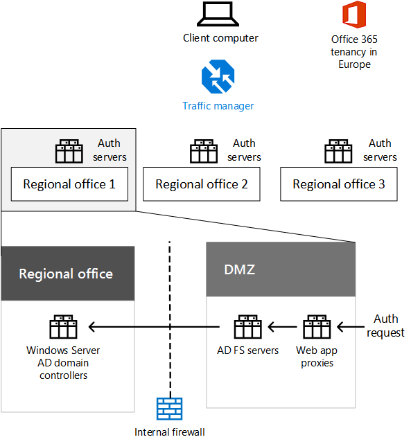

# Identidad para Contoso Corporation

 **Resumen:** Comprender cómo Contoso aprovecha IDaaS proporciona geográficamente distribuida y redundantes la autenticación y para sus usuarios.
  
Microsoft proporciona una identidad como un servicio (IDaaS) a través de sus ofertas de nube. Para adoptar una infraestructura cloud inclusive, solución de IDaaS de Contoso debe aprovechar su proveedor de identidad local e incluir autenticación federados con sus proveedores de identidades de confianza de terceros existentes.
  
## Bosque de Windows Server AD de Contoso

Contoso utiliza un único bosque de Windows Server Active Directory (AD) para contoso.com con siete dominios, uno para cada región del mundo. La sede, oficinas regionales y sucursales contienen controladores de dominio para la autenticación local y de autorización.
  
**Figura 1: Del Contoso bosque y los dominios en todo el mundo**

  
La figura 1 muestra el bosque de Contoso con dominios regionales para las distintas partes del mundo que contienen centros regionales.
  
Contoso quiere usar las cuentas y los grupos del bosque contoso.com para la autenticación y la autorización de sus aplicaciones y cargas de trabajo basadas en la nube.
  
## Infraestructura de autenticación federados de Contoso

Contoso permite:
  
- Que los clientes usen sus cuentas de Microsoft, Facebook o Google Mail para iniciar sesión en su sitio web público.
    
- Que los proveedores y partners usen sus cuentas de LinkedIn, Salesforce o Google Mail para iniciar sesión en la extranet de partners.
    
**Figura 2: Soporte de Contoso para autenticación federados para clientes y socios**

  
La figura 2 muestra la red perimetral de Contoso con un sitio web público, una extranet de partners y un conjunto de servidores FS de AD. La red perimetral está conectada a Internet que contiene clientes y partners, y servicios de Internet.
  
Los servidores de los Servicios de federación de Active Directory (AD FS) de la red perimetral autentican las credenciales de cliente para el acceso al sitio web público y las credenciales de partner para el acceso a la extranet de partners.
  
Cuando su sitio web público para un Web App de Azure y partner extranet para Dynamics 365 transiciones de Contoso, desea seguir utilizando estos proveedores de identidad de terceros para sus clientes y socios. Esto se logrará mediante la configuración de la federación entre los inquilinos de Contoso AD Azure y estos proveedores de identidad de terceros.
  
## Sincronización de directorios para el bosque de Windows Server AD de Contoso

Contoso ha implementado la herramienta Azure Connect de AD en un clúster de servidores en su centro de datos de París. Azure Connect AD sincroniza los cambios en el bosque de Windows Server AD contoso.com con el inquilino de Azure AD compartido por Office 365, EMS, Dynamics 365 y suscripciones de Azure de Contoso. Para obtener más información acerca de las suscripciones, licencias, cuentas de usuario y de los inquilinos, consulte [suscripciones, licencias y cuentas de usuario de Contoso](subscriptions-licenses-and-user-accounts-for-the-contoso-corporation.md).
  
**La figura 3: Infraestructura de sincronización de directorio de Contoso**

  
La figura 3 muestra un clúster de servidores que ejecutan Azure AD Connect para sincronizar el bosque de Windows Server AD de Contoso con el inquilino de Azure AD.
  
Contoso ha configurado la autenticación federada, que proporciona un inicio de sesión único para los trabajadores de Contoso. Cuando un usuario que ha iniciado sesión en el bosque de Windows Server AD contoso.com tiene acceso a un recurso de nube de Microsoft SaaS o PaaS, no se pide una contraseña.
  
## Distribución geográfica del tráfico de autenticación de Contoso

Para admitir mejor su fuerza de trabajo móvil y remoto, Contoso ha implementado conjuntos de servidores de autenticación en sus oficinas regionales. Esta infraestructura distribuye la carga y proporciona redundancia y un rendimiento superior al autenticar las credenciales de usuario para tener acceso a las ofertas de nube de Microsoft que utilizan al inquilino AD Azure comun.
  
Para distribuir la carga de las solicitudes de autenticación, Contoso ha configurado Azure Traffic Manager con un perfil que usa el método de enrutamiento del rendimiento, que se refiere a la autenticación de clientes para el conjunto más próximo de servidores de autenticación de la región.  
  
**Figura 4: Distribución geográfica de tráfico de autenticación para oficinas regionales**

  
La figura 4 muestra las capas de los equipos cliente, Azure Traffic Manager y los servidores de autenticación en oficinas regionales. Cada oficina regional usa proxies web y servidores de AD FS para autenticar las credenciales de usuario con controladores de dominio de Windows Server AD.
  
Ejemplo de proceso de autenticación:
  
1. El equipo cliente inicia la comunicación con una página web en el contrato de arrendamiento de Office 365 en Europa (como sharepoint.contoso.com).
    
2. Office 365 devuelve una solicitud para enviar la prueba de la autenticación. La solicitud contiene la dirección URL de contacto para la autenticación.
    
3. El equipo cliente intenta resolver el nombre DNS de la dirección URL en una dirección IP.
    
4. Azure Traffic Manager recibe la consulta DNS y responde al equipo cliente con la dirección IP de un servidor proxy de aplicaciones web en la oficina regional más próxima al equipo cliente.
    
5.  El equipo cliente envía una solicitud de autenticación a un servidor de proxy de aplicación web, que reenvía la solicitud a un servidor de AD FS.
    
6. El servidor de AD FS solicita las credenciales de usuario desde el equipo cliente.
    
7. El equipo cliente envía las credenciales de usuario sin preguntar al usuario.
    
8. El servidor de AD FS valida las credenciales con un controlador de dominio de Windows Server AD en la oficina regional y devuelve un token de seguridad al equipo cliente.
    
9. El equipo cliente envía el token de seguridad a Office 365.
    
10. Tras la validación correcta, Office 365 almacena en caché el token de seguridad y envía la página web solicitada en el paso 1 al equipo cliente.
    
## Redundancia de la infraestructura de autenticación de la sede en IaaS de Azure

Para proporcionar redundancia para los trabajadores móviles y remotos de la sede de París que contiene 15.000 trabajadores, Contoso ha implementado un segundo conjunto de servidores proxy de aplicaciones y servidores de AD FS en Azure IaaS.
  
**Figura 5: Infraestructura de autenticación redundante en Azure IaaS**

  
La figura 5 muestra los proxies web y los servidores de AD FS en la red perimetral y un conjunto adicional de cada uno en una red virtual de Azure entre ubicaciones locales.
  
Cuando no estén disponibles los servidores de autenticación principales en la red perimetral de la sede, el personal de TI cambia al conjunto redundante implementado en IaaS de Azure. Las solicitudes de autenticación posteriores desde los equipos de la oficina de París usan el conjunto en IaaS de Azure hasta que se solucione el problema de disponibilidad.
  
Para cambiar y revertir, Contoso actualiza el perfil de Azure Traffic Manager de la región de París para usar un conjunto diferente de direcciones IP para los servidores proxy de aplicaciones web:
  
- Cuando los servidores de autenticación DMZ disponibles, utilice las direcciones IP de los servidores en la DMZ.
    
- Si los servidores de autenticación de red perimetral no están disponibles, se usan las direcciones IP de los servidores de IaaS de Azure.
    
## See Also

[Contoso en la nube de Microsoft](contoso-in-the-microsoft-cloud.md)
  
[Recursos de arquitectura de TI de la nube de Microsoft](microsoft-cloud-it-architecture-resources.md)

[Identidad de Microsoft Cloud para arquitectos empresariales](http://aka.ms/cloudarchidentity)
  
[Protección de identidades y dispositivos para Office 365](http://aka.ms/o365protect_device)
  
[Mapa de ruta de Enterprise Cloud de Microsoft: Recursos para los responsables de decisiones de TI](https://sway.com/FJ2xsyWtkJc2taRD)

