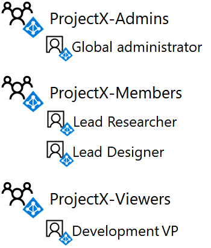
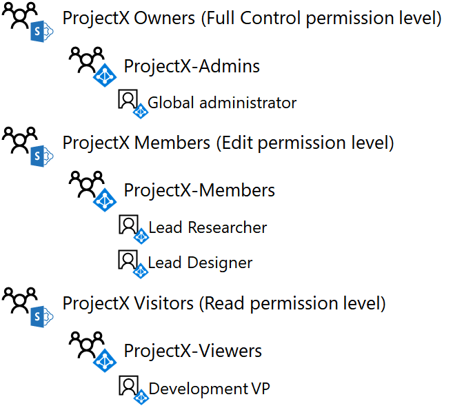

# <a name="isolated-sharepoint-online-team-site-devtest-environment"></a>Entorno de pruebas y desarrollo de SharePoint Online team sitio aislado

 **Resumen:** Configurar un sitio de grupo SharePoint Online que está aislado del resto de la organización en su entorno de pruebas y desarrollo de Office 365.
  
Sitios de equipo de SharePoint Online en Office 365 son ubicaciones para la colaboración mediante una biblioteca de documentos comunes, un bloc de notas de OneNote y otros servicios. En muchos casos, desea amplio acceso y la colaboración entre departamentos y organizaciones. Sin embargo, en algunos casos, desea controlar rigurosamente el acceso y los permisos para la colaboración entre un pequeño grupo de personas.
  
Acceso a sitios de equipo de SharePoint Online y qué pueden hacer los usuarios se controla mediante grupos de SharePoint y los niveles de permisos. De forma predeterminada, los sitios de SharePoint Online tienen tres niveles de acceso:
  
- **Miembros**, que puede ver, crear y modificar los recursos en el sitio.
    
- **Los propietarios**, que tiene el control total del sitio, incluida la capacidad para cambiar los permisos.
    
- **Los visitantes**, que sólo puede ver los recursos en el sitio.
    
En este artículo pasos es a través de la configuración de un sitio de grupo de SharePoint Online aislado para un proyecto de investigación secreta denominan ProjectX. Los requisitos de acceso son:
  
- Solo los miembros del proyecto pueden acceder al sitio y a su contenido (documentos, Bloc de notas de OneNote y páginas), con niveles de permiso de SharePoint de edición y visualización controlados a través de la pertenencia al grupo.
    
- Únicamente el creador del sitio y los miembros de un grupo de administradores del sitio pueden llevar a cabo tareas relacionadas con la administración, lo que incluye la modificación de los permisos del sitio.
    
La configuración de un sitio de grupo de SharePoint Online aislado en su entorno para desarrollo y pruebas de Office 365 se divide en tres fases:
  
1. Crear el entorno de desarrollo y pruebas de Office 365.
    
2. Crear los usuarios y los grupos de ProyectoX.
    
3. Crear un sitio de grupo de SharePoint Online para ProyectoX y aislarlo.
    
> [!TIP]
> Haga clic [aquí](http://aka.ms/catlgstack) para ver un mapa visual para todos los artículos de la pila de una guía de laboratorio de prueba de nube de Microsoft.
  
## <a name="phase-1-build-out-your-lightweight-or-simulated-enterprise-office-365-devtest-environment"></a>Fase 1: Crear un entorno de desarrollo y pruebas ligero o de una empresa simulada de Office 365

Si desea crear un sitio de grupo SharePoint Online aislado de una manera ligera con los requisitos mínimos, siga las instrucciones que aparecen en las fases 2 y 3 del [entorno de desarrollo y prueba de Office 365](office-365-dev-test-environment.md).
  
Si desea crear un sitio de grupo SharePoint Online aislado en una configuración de empresa simulada, siga las instrucciones de [sincronización de directorios para el entorno de desarrollo y prueba de Office 365](dirsync-for-your-office-365-dev-test-environment.md).
  
> [!NOTE]
> Crear un sitio de SharePoint Online aislado no requiere un entorno para desarrollo y pruebas empresarial simulado que incluya una intranet simulada conectada a Internet y una sincronización de directorios para un bosque de Windows Server AD. Se proporciona aquí como opción para que pueda probar un sitio de SharePoint Online aislado y experimentar con él en un entorno que representa una organización típica. 
  
## <a name="phase-2-create-user-accounts-and-access-groups"></a>Fase 2: Crear cuentas de usuario y tener acceso a los grupos

Siga las instrucciones de [conectarse a Office 365 PowerShell](https://technet.microsoft.com/library/dn975125.aspx) para conectarse a su suscripción de rastro de Office 365 con la cuenta de administrador global desde:
  
- Su equipo (para el entorno de desarrollo y pruebas ligero de Office 365).
    
- La máquina virtual CLIENT1 (para el entorno de desarrollo y pruebas de una empresa simulada de Office 365).
    
Para crear los nuevos grupos de acceso para el sitio de equipo ProjectX SharePoint Online, ejecutar estos comandos desde el símbolo del sistema de Windows Azure Active Directory módulo para Windows PowerShell:
  
```
$groupName="ProjectX-Members"
$groupDesc="People allowed to collaborate for ProjectX."
New-MsolGroup -DisplayName $groupName -Description $groupDesc
$groupName="ProjectX-Admins"
$groupDesc="People allowed to administer SharePoint for ProjectX."
New-MsolGroup -DisplayName $groupName -Description $groupDesc
$groupName="ProjectX-Viewers"
$groupDesc="People allowed to view the SharePoint resources for ProjectX."
New-MsolGroup -DisplayName $groupName -Description $groupDesc
```

> [!TIP]
> Haga clic [aquí](https://gallery.technet.microsoft.com/PowerShell-commands-for-an-b2608df1) para un archivo de texto que contiene todos los comandos de PowerShell en este artículo.
  
Rellene el nombre de la organización (ejemplo: contosotoycompany), el código de país de dos caracteres para su ubicación y, después, ejecute los comandos siguientes desde el símbolo del sistema de Módulo Microsoft Azure Active Directory para Windows PowerShell:
  
```
$orgName="<organization name>"
$loc="<two-character country code, such as US>"
$licAssignment= $orgName + ":ENTERPRISEPREMIUM"
$userName= "designer@" + $orgName + ".onmicrosoft.com"
New-MsolUser -DisplayName "Lead Designer" -FirstName Lead -LastName Designer -UserPrincipalName $userName -UsageLocation $loc -LicenseAssignment $licAssignment -ForceChangePassword $false
```

En la pantalla del comando **MsolUser de nuevo** , anote la contraseña para la cuenta de plomo diseñador generada y grabarlo en un lugar seguro.
  
Ejecute los siguientes comandos desde el símbolo del sistema del Módulo de Windows Azure Active Directory para Windows PowerShell:
  
```
$userName= "researcher@" + $orgName + ".onmicrosoft.com"
New-MsolUser -DisplayName "Lead Researcher" -FirstName Lead -LastName Researcher -UserPrincipalName $userName -UsageLocation $loc -LicenseAssignment $licAssignment -ForceChangePassword $false
```

En la pantalla del comando **MsolUser de nuevo** , anote la contraseña para la cuenta de cliente potencial investigador generada y grabarlo en un lugar seguro.
  
Ejecute los siguientes comandos desde el símbolo del sistema del Módulo de Windows Azure Active Directory para Windows PowerShell:
  
```
$userName= "devvp@" + $orgName + ".onmicrosoft.com"
New-MsolUser -DisplayName "Development VP" -FirstName Development -LastName VP -UserPrincipalName $userName -UsageLocation $loc -LicenseAssignment $licAssignment -ForceChangePassword $false
```

En la pantalla del comando **MsolUser de nuevo** , tenga en cuenta la contraseña generada para la cuenta de Vicepresidente de desarrollo y grabarlo en un lugar seguro.
  
A continuación, para agregar las cuentas nuevas a los nuevos grupos de acceso, ejecute estos comandos de PowerShell desde el símbolo del sistema de Windows Azure Active Directory módulo para Windows PowerShell:
  
```
$grpName="ProjectX-Members"
$userUPN="designer@" + $orgName + ".onmicrosoft.com"
Add-MsolGroupMember -GroupObjectId (Get-MsolGroup | Where { $_.DisplayName -eq $grpName }).ObjectID -GroupMemberObjectId (Get-MsolUser | Where { $_.UserPrincipalName -eq $userUPN }).ObjectID -GroupMemberType "User"
$userUPN="researcher@" + $orgName + ".onmicrosoft.com"
Add-MsolGroupMember -GroupObjectId (Get-MsolGroup | Where { $_.DisplayName -eq $grpName }).ObjectID -GroupMemberObjectId (Get-MsolUser | Where { $_.UserPrincipalName -eq $userUPN }).ObjectID -GroupMemberType "User"
$grpName="ProjectX-Admins"
Add-MsolGroupMember -GroupObjectId (Get-MsolGroup | Where { $_.DisplayName -eq $grpName }).ObjectID -GroupMemberObjectId (Get-MsolUser | Where { $_.UserPrincipalName -eq $userCredential.UserName }).ObjectID -GroupMemberType "User"
$grpName="ProjectX-Viewers"
$userUPN="devvp@" + $orgName + ".onmicrosoft.com"
Add-MsolGroupMember -GroupObjectId (Get-MsolGroup | Where { $_.DisplayName -eq $grpName }).ObjectID -GroupMemberObjectId (Get-MsolUser | Where { $_.UserPrincipalName -eq $userUPN }).ObjectID -GroupMemberType "User"
```

Resultados:
  
- El grupo de acceso de miembros de ProjectX contiene las cuentas de usuario del Diseñador de plomo y el investigador de plomo
    
- El grupo de acceso de administradores de ProjectX contiene la cuenta de administrador global para la suscripción de prueba
    
- El grupo de acceso de ProjectX visores contiene la cuenta de usuario de Vicepresidente de desarrollo
    
La figura 1 muestra los grupos de acceso y su pertenencia.
  
**Figura 1**


  
## <a name="phase-3-create-a-new-projectx-sharepoint-online-team-site-and-isolate-it"></a>Fase 3: Crear un sitio de grupo de SharePoint Online para ProyectoX y aislarlo

Para crear un sitio de grupo de SharePoint Online para ProyectoX, siga estos pasos:
  
1. Con un navegador desde cualquiera del equipo local (configuración ligero) o en CLIENTE1 (configuración de empresa simulada), inicie sesión en el portal de Office 365 ([https://portal.office.com](https://portal.office.com)) mediante la cuenta de administrador global.
    
2. En la lista de fichas, haga clic en **SharePoint**.
    
3. En la ficha nuevo de SharePoint en el explorador, haga clic en **Crear sitio +**.
    
4. En **nombre de sitio de equipo**, escriba **ProjectX**. En **la configuración de privacidad**, seleccione **Private: sólo los miembros pueden tener acceso a este sitio**.
    
5. En **Descripción del sitio de equipo**, escriba el **sitio de SharePoint para ProjectX**y, a continuación, haga clic en **siguiente**.
    
6. ¿En la **que desea agregar**? panel, haga clic en **Finalizar**.
    
7. En la nueva ficha de **Inicio de ProjectX** en el explorador, en la barra de herramientas, haga clic en el icono de configuración y, a continuación, haga clic en **permisos del sitio**.
    
8. En el panel **permisos de sitio** , haga clic en **configuración de permisos avanzados**.
    
9. En el nuevo **permisos: proyecto X** ficha en el explorador, haga clic en **Configuración de solicitud de acceso**.
    
10. En el cuadro de diálogo **Configuración de las solicitudes de acceso** , desactive **Permitir miembros para compartir el sitio y archivos y carpetas individuales** y **Permitir las solicitudes de acceso** (de modo que todas las casillas de verificación está desactivadas) y, a continuación, haga clic en **Aceptar**.
    
11. En la lista, haga clic en **Miembros de ProjectX** .
    
12. En la página **personas y grupos** , haga clic en **nuevo**.
    
13. En el cuadro de diálogo **Compartir** , **ProjectX miembros**de tipo, selecciónelo y, a continuación, haga clic en **Compartir**.
    
14. Haga clic en el botón Atrás del explorador.
    
15. En la lista, haga clic en **Propietarios de ProjectX** .
    
16. En la página **personas y grupos** , haga clic en **nuevo**.
    
17. En el cuadro de diálogo **Compartir** , escriba **Administradores de ProjectX**, selecciónelo y, a continuación, haga clic en **Compartir**.
    
18. Haga clic en el botón Atrás del explorador.
    
19. En la lista, haga clic en **ProjectX a los visitantes** .
    
20. En la página **personas y grupos** , haga clic en **nuevo**.
    
21. En el cuadro de diálogo **Compartir** , escriba **ProjectX visores**, selecciónelo y, a continuación, haga clic en **Compartir**.
    
22. Cierre la ficha **personas y grupos** en el explorador, haga clic en la ficha **Inicio de ProjectX** en el explorador y, a continuación, cierre el panel de **permisos del sitio** .
    
A continuación se indican los resultados de la configuración de permisos:
  
- El grupo de SharePoint miembros de ProjectX contiene sólo el grupo de acceso de miembros de ProjectX (que contiene sólo las cuentas de usuario Diseñador de plomo y plomo investigador) y el grupo de ProjectX (que contiene sólo la cuenta de usuario de administrador global).
    
- El grupo de SharePoint propietarios de ProjectX contiene sólo el grupo de acceso de administradores de ProjectX (que contiene sólo la cuenta de usuario de administrador global).
    
- El grupo de SharePoint visitantes de ProjectX contiene sólo el grupo de acceso de ProjectX visores (que contiene sólo la cuenta de usuario de Vicepresidente de desarrollo).
    
- Los miembros no pueden modificar los permisos del nivel del sitio (solo los miembros del grupo “Administradores del ProyectoX” pueden realizar esta acción).
    
- El resto de cuentas de usuario no pueden tener acceso al sitio ni a sus recursos, y tampoco pueden solicitar acceso al sitio.
    
En la figura 2 se muestran los grupos de SharePoint y su pertenencia.
  
**Figura 2**


  
Ahora vamos a demostrar el acceso utilizando la cuenta de usuario del Diseñador de plomo:
  
1. Cierre la ficha **Inicio de ProjectX** en el explorador y, a continuación, haga clic en la ficha **Página de inicio de Microsoft Office** en el explorador.
    
2. Haga clic en el nombre de su administrador global y, a continuación, haga clic en **Cerrar sesión**.
    
3. Iniciar sesión en el portal de Office 365 ([https://portal.office.com](https://portal.office.com)) con el nombre de cuenta de Lead Designer y su contraseña.
    
4. En la lista de fichas, haga clic en **SharePoint**.
    
5. En la ficha nuevo de **SharePoint** en el explorador, escriba **ProjectX** en el cuadro de búsqueda, activar la búsqueda y, a continuación, haga clic en el sitio del equipo **ProjectX** . Debería ver una nueva pestaña en el explorador del sitio de grupo ProjectX.
    
6. Haga clic en el icono Configuración. Observe que no hay ninguna opción para **Permisos del sitio**. Esto es correcto, ya que sólo los miembros del grupo Administradores de ProjectX pueden modificar los permisos en el sitio
    
7. Abra el Bloc de notas o el editor de texto que prefiera.
    
8. Copie la dirección URL del sitio de grupo de ProyectoX y péguela en una nueva línea del Bloc de notas o su editor de texto.
    
9. En la nueva ficha de **Inicio de ProjectX** en el explorador, haga clic en **documentos**.
    
10. Copie la dirección URL de la carpeta de documentos del ProyectoX y péguela en una nueva línea del Bloc de notas o del editor de texto.
    
11. En la nueva ficha de **ProjectX documentos** en el explorador, haga clic en **Nuevo > documento de Word**.
    
12. Escriba algún texto en la página de **Word en línea** , espere a que el estado indicar el **guardado**, haga clic en el botón Atrás del explorador y, a continuación, actualice la página. Debería ver una nueva **Document.docx** en la carpeta **documentos** .
    
13. Haga clic en el botón de puntos suspensivos para el documento de **Document.docx** y, a continuación, haga clic en **obtener un vínculo**.
    
14. Copie la dirección URL en el cuadro de diálogo de **Compartir 'Document.docx'** y pegarla en una nueva línea en el Bloc de notas o el editor de texto y, a continuación, cierre el cuadro de diálogo **Compartir 'Document.docx'** .
    
15. Cierra las fichas de **Documentos de ProjectX** y **SharePoint** en el explorador y, a continuación, haga clic en la ficha **Página de inicio de Microsoft Office** .
    
16. Haga clic en el nombre del **Diseñador de plomo** y, a continuación, haga clic en **Cerrar sesión**.
    
Ahora vamos a explicar con la cuenta de usuario de Vicepresidente de desarrollo de acceso:
  
1. Iniciar sesión en el portal de Office 365 ([https://portal.office.com](https://portal.office.com)) con el nombre de cuenta del Vicepresidente de desarrollo y su contraseña.
    
2. En la lista de fichas, haga clic en **SharePoint**.
    
3. En la ficha nuevo de **SharePoint** en el explorador, escriba **ProjectX** en el cuadro de búsqueda, activar la búsqueda y, a continuación, haga clic en el sitio del equipo **ProjectX** . Debería ver una nueva pestaña en el explorador del sitio de grupo ProjectX.
    
4. Haga clic en **documentos**y, a continuación, haga clic en el archivo **Document.docx** .
    
5. En la ficha **Document.docx** en el explorador, intente modificar el texto. Debería ver un mensaje que indica **este documento es de sólo lectura.** Esto ocurre porque la cuenta de usuario de Vicepresidente de desarrollo sólo tiene permisos de vista para el sitio.
    
6. Cierra las fichas **Document.docx**, **Documentos de ProjectX**y **SharePoint** en el explorador.
    
7. Haga clic en la ficha **Página de inicio de Microsoft Office** , haga clic en el nombre del **Vicepresidente de desarrollo** y, a continuación, haga clic en **Cerrar sesión**.
    
Ahora vamos a explicar el acceso con una cuenta de usuario que no tiene permisos:
  
1. Iniciar sesión en el portal de Office 365 ([https://portal.office.com](https://portal.office.com)) con el nombre de la cuenta de usuario 3 y su contraseña.
    
2. En la lista de fichas, haga clic en **SharePoint**.
    
3. En la ficha nuevo de **SharePoint** en el explorador, escriba **ProjectX** en el cuadro Buscar y, a continuación, activar la búsqueda. Debería ver el mensaje **nada aquí coincide con la búsqueda.**
    
4. Desde la instancia abierta de Bloc de notas o el editor de texto, copie la dirección URL para el sitio de ProjectX en la barra de direcciones del explorador y presione **ENTRAR**. Debería ver una página de **Acceso denegado** .
    
5. En el Bloc de notas o su editor de texto, copie la dirección URL de la carpeta documentos de ProjectX en la barra de direcciones del explorador y presione **ENTRAR**. Debería ver una página de **Acceso denegado** .
    
6. En el Bloc de notas o su editor de texto, copie la dirección URL para el archivo Documents.docx en la barra de direcciones del explorador y presione **ENTRAR**. Debería ver una página de **Acceso denegado** .
    
7. Cerrar la pestaña de **SharePoint** en el explorador, haga clic en la ficha **Página de inicio de Microsoft Office** , haga clic en el nombre de **usuario 3** y, a continuación, haga clic en **Cerrar sesión**.
    
El sitio de SharePoint Online aislado está preparado para la experimentación adicional.
  
## <a name="next-step"></a>Paso siguiente

Cuando esté listo para implementar un sitio de equipo de SharePoint Online aislado de producción, consulte las consideraciones de diseño paso a paso en el [Diseño de un sitio de grupo SharePoint Online aislado](design-an-isolated-sharepoint-online-team-site.md).
  
## <a name="see-also"></a>Consulte también

[Sitios de equipo de SharePoint Online aislados](isolated-sharepoint-online-team-sites.md)
  
[Guías del laboratorio de pruebas de adopción de la nube (TLG)](cloud-adoption-test-lab-guides-tlgs.md)
  
[Entorno de desarrollo y pruebas de la configuración básica](base-configuration-dev-test-environment.md)
  
[Entorno de desarrollo y pruebas de Office 365](office-365-dev-test-environment.md)
  
[Adopción de la nube y soluciones híbridas](cloud-adoption-and-hybrid-solutions.md)


