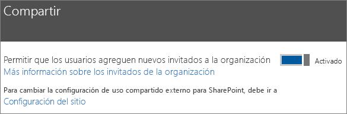
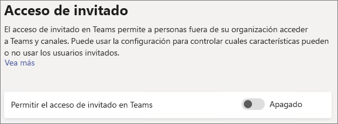
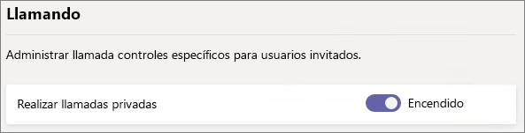
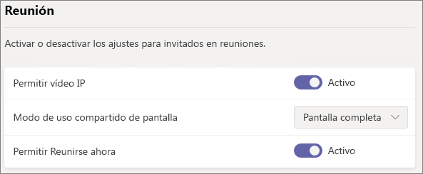
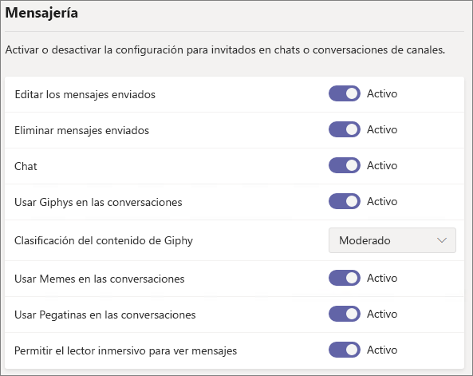
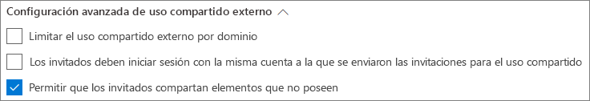
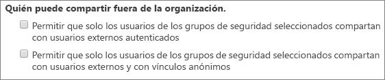

# Referencia de la configuración de uso compartido de invitados de Microsoft 365

En este artículo se proporciona una referencia para las distintas opciones de configuración que pueden afectar al uso compartido de invitados en las cargas de trabajo de Microsoft 365: Teams, Grupos de Office 365, SharePoint y OneDrive. Esta configuración se encuentra en el centro de administración de Azure Active Directory, Microsoft 365, Teams y SharePoint.

## Azure Active Directory

**Rol de administrador**: administrador global

Azure Active Directory es el servicio de directorio que usa Microsoft 365. La configuración de las relaciones de organización de Azure Active Directory afecta directamente al uso compartido en Teams, Grupos de Office 365, SharePoint y OneDrive.

> [!NOTE]
> Esta configuración solo afecta a SharePoint cuando se ha configurado la [Integración de SharePoint y OneDrive con Azure AD B2B (versión preliminar)](https://docs.microsoft.com/sharepoint/sharepoint-azureb2b-integration-preview). En la tabla siguiente se presupone que esta se ha configurado.

### Configuración de relaciones de organización

**Navegación:** [Centro de administración de Azure Active Directory](https://aad.portal.azure.com) > Azure Active Directory > Relaciones de organización > Configuración

|**Setting**|**Default**|**Descripción**|
|:-----|:-----|:-----|
|Los permisos de usuarios invitados son limitados|Sí|Esta configuración afecta a las tareas del directorio que pueden realizar los invitados.|
|Solo pueden invitar los administradores y usuarios con el rol de invitador de usuarios invitados|Sí|Si se establece en **Sí**, los administradores pueden invitar a través de Azure AD y a través de las experiencias de uso compartido de Microsoft 365, como Teams y SharePoint; si se establece en **No**, no pueden hacerlo.|
|Los miembros pueden invitar|Sí|Si se establece en **Sí**, los miembros de Azure AD pueden invitar a través de Azure AD; si se establece en **No**, no pueden hacerlo. Si se establece en **Sí**, los miembros del Grupo de Office 365 pueden invitar con aprobación del propietario; si se establece en **No**, los miembros del Grupo de Office 365 pueden invitar con aprobación del propietario, pero los propietarios deben ser administradores globales para poder aprobar.   Tenga en cuenta que la opción **Los miembros pueden invitar** hace referencia a los miembros de Azure AD (frente a los invitados) y no a los miembros del sitio o grupo de Microsoft 365.   Esto es idéntico a la opción de configuración **Permitir que los usuarios agreguen nuevos invitados a la organización** en seguridad y privacidad de Microsoft 365.|
|Los invitados pueden invitar|Sí|Si se establece en **Sí**, los invitados en el directorio pueden invitar a otros invitados a colaborar en los recursos de Azure AD y en los archivos y carpetas de SharePoint y OneDrive; si se establece en **No**, no pueden hacerlo.   Tenga en cuenta que **Permitir que los usuarios externos detecten cuentas de usuario en el directorio si escriben la dirección de correo electrónico exacta** se debe activar en el Centro de administración de SharePoint para que los invitados puedan compartir archivos y carpetas con otros invitados.|
|Habilitar el código de acceso de un solo uso de correo electrónico para invitados (versión preliminar)|No|Si se establece en **Sí**, los invitados que no tengan MSA o una cuenta profesional o educativa pueden [autenticarse con Azure AD mediante un código de acceso de un solo uso](https://docs.microsoft.com/azure/active-directory/b2b/one-time-passcode); si se establece en **No**, los usuarios tendrán que crear un cuenta de Microsoft para autenticarse. Esta configuración se debe establecer en **Sí** para la [Integración de SharePoint y OneDrive con Azure AD B2B (versión preliminar)](https://docs.microsoft.com/sharepoint/sharepoint-azureb2b-integration-preview).|
|Restricciones de colaboración|Permitir el envío de invitaciones a cualquier dominio|Esta configuración le permite especificar una lista de dominios permitidos o bloqueados para el uso compartido. Si se especifican dominios permitidos, las invitaciones de uso compartido solo se pueden enviar a estos dominios. Si se especifican dominios denegados, las invitaciones de uso compartido no se pueden enviar a estos dominios.   Esta configuración afecta a las experiencias de uso compartido de Microsoft 365 como Teams y SharePoint. Puede permitir o bloquear dominios en un nivel más granular con el filtrado de dominios de SharePoint o Teams.|

Esta configuración afecta al modo en que se invitan a los usuarios al directorio. No afecta al uso compartido de invitados que ya están en el directorio.

## Microsoft 365

**Rol de administrador**: administrador global

El Centro de administración de Microsoft 365 tiene la configuración de nivel de organización para el uso compartido y para los Grupos de Office 365.

### Uso compartido

**Navegación:** [Centro de administración de Microsoft 365](https://admin.microsoft.com) > Configuración > Seguridad y privacidad > Uso compartido

|**Setting**|**Default**|**Descripción**|
|:-----|:-----|:-----|
|Permitir que los usuarios agreguen nuevos invitados a la organización|Activado|Si se establece en **Sí**, los miembros de Azure AD pueden invitar a través de Azure AD; si se establece en **No**, no pueden hacerlo. Si se establece en **Sí**, los miembros del Grupo de Office 365 pueden invitar con aprobación del propietario; si se establece en **No**, los miembros del Grupo de Office 365 pueden invitar con aprobación del propietario, pero los propietarios deben ser administradores globales para poder aprobar.   Tenga en cuenta que la opción **Los miembros pueden invitar** hace referencia a los miembros de Azure AD (frente a los invitados) y no a los miembros del sitio o grupo de Microsoft 365.   Esto es idéntico a la opción de configuración **Los miembros pueden invitar** en las relaciones de organización de Azure Active Directory.|

### Grupos de Office 365

**Navegación:** [Centro de administración de Microsoft 365](https://admin.microsoft.com) > Configuración > Servicios y complementos > Grupos de Office 365

|**Setting**|**Default**|**Descripción**|
|:-----|:-----|:-----|
|Permitir que los miembros del grupo de fuera de la organización tengan acceso al contenido del grupo|Activado|Si se establece en **Activado**, los invitados pueden acceder al contenido de los grupos; si se establece en **Desactivado**, no pueden hacerlo. Esta configuración debe establecerse en **Activado** en cualquier escenario en el que los usuarios invitados interactúen con Grupos de Office 365 y Teams.|
|Permitir que los propietarios de grupos agreguen a usuarios ajenos a la organización a los grupos|Activado|Si está **Activado**, los propietarios de los Grupos de Office 365 o Teams pueden invitar a nuevos invitados al grupo. Si está **Desactivado**, los propietarios solo pueden invitar a los que ya están en el directorio.|

Esta configuración se aplica a toda la organización. Vea Crear una configuración para un grupo específico](https://docs.microsoft.com/azure/active-directory/users-groups-roles/groups-settings-cmdlets#create-settings-for-a-specific-group) para crear una configuración a nivel de grupo con PowerShell.

## Teams

El conmutador principal de acceso de invitado de Teams, **Permitir el acceso de invitado en Teams**, debe estar **Activado** para que las demás opciones de configuración de invitados estén disponibles.

**Rol de administrador**: administrador de servicios de Teams

### Acceso de invitado

**Navegación:** [Centro de administración de Teams](https://admin.teams.microsoft.com) > Configuración de toda la organización > Acceso de invitado

|**Setting**|**Default**|**Descripción**|
|:-----|:-----|:-----|
|Permitir el acceso de invitado en Teams|Desactivado|Activa o desactiva el acceso de invitado a Teams en general. Esta configuración puede tardar 24 horas en aplicarse una vez cambiada.|

### Llamadas de invitado

**Navegación:** [Centro de administración de Teams](https://admin.teams.microsoft.com) > Configuración de toda la organización > Acceso de invitado

|**Setting**|**Default**|**Descripción**|
|:-----|:-----|:-----|
|Realizar llamadas privadas|Activado|Si está **Activado**, los invitados pueden realizar llamadas de punto a punto en Teams; si está **Desactivado**, no pueden hacerlo.|

### Reunión de invitado

**Navegación:** [Centro de administración de Teams](https://admin.teams.microsoft.com) > Configuración de toda la organización > Acceso de invitado

|**Setting**|**Default**|**Descripción**|
|:-----|:-----|:-----|
|Permitir vídeo IP|Activado|Si está **Activado**, los invitados pueden usar el vídeo en sus llamadas y reuniones; si está **Desactivado**, no pueden hacerlo.|
|Modo de uso compartido de la pantalla|Toda la pantalla|Si está **Deshabilitado**, los invitados no pueden compartir su pantalla en Teams. Si se establece en **Una sola aplicación**, los invitados solo pueden compartir una única aplicación en su pantalla. Si se establece en **Toda la pantalla**, los invitados pueden elegir entre compartir una aplicación o toda la pantalla.|
|Permitir Reunirse ahora|Activado|Si está **Activado**, los invitados pueden usar la característica Reunirse ahora en Teams; si está **Desactivado**, no pueden hacerlo.|

### Mensajería de invitado

**Navegación:** [Centro de administración de Teams](https://admin.teams.microsoft.com) > Configuración de toda la organización > Acceso de invitado

|**Setting**|**Default**|**Descripción**|
|:-----|:-----|:-----|
|Editar los mensajes enviados|Activado|Si está **Activado**, los invitados pueden editar los mensajes que se enviaron previamente; si está **Desactivado**, no pueden hacerlo.|
|Eliminar mensajes enviados|Activado|Si está **Activado**, los invitados pueden eliminar los mensajes que se enviaron previamente; si está **Desactivado**, no pueden hacerlo.|
|Chat|Activado|Si está **Activado**, los invitados pueden usar chat en Teams; si está **Desactivado**, no pueden hacerlo.|
|Usar Giphys en las conversaciones|Activado|Si está **Activado**, los invitados pueden usar Giphys en las conversaciones; si está **Desactivado**, no pueden hacerlo.|
|Clasificación del contenido de Giphy|Moderado|Si se establece en **Permitir todo el contenido**, los invitados pueden insertar todos los Giphys en chats, independientemente de la clasificación de contenido. Si se establece en **Moderado**, los invitados pueden insertar Giphys en los chats, pero se les restringirá de forma moderada el contenido para adultos. Si se establece en **Estricto**, los invitados pueden insertar Giphys en los chats, pero se les restringirá insertar contenido para adultos.|
|Usar Memes en las conversaciones|Activado|Si está **Activado**, los invitados pueden usar memes en las conversaciones; si está **Desactivado**, no pueden hacerlo.|
|Usar adhesivos en las conversaciones|Activado|Si está **Activado**, los invitados pueden usar adhesivos en las conversaciones; si está **Desactivado**, no pueden hacerlo.|
|Permitir el lector inmersivo para ver mensajes|Activado|Si está **Activado**, los invitados pueden ver los mensajes en el lector inmersivo; si está **Desactivado**, no pueden hacerlo.|

## SharePoint y OneDrive (nivel de la organización)

**Rol de administrador**: Administrador del servicio SharePoint

Esta configuración afecta a todos los sitios de la organización. No afecta directamente a los Grupos de Office 365 o Teams, pero le recomendamos que alinee esta configuración con la de Grupos de Office 365 y Teams para evitar problemas de experiencia de usuario. (Por ejemplo, si se permite el uso compartido de invitados en Teams, pero no en SharePoint, los invitados en Teams no tendrán acceso a la pestaña Archivos, ya que los archivos de Teams se almacenan en SharePoint).

### Configuración de uso compartido de SharePoint y OneDrive

Como OneDrive es una jerarquía de sitios dentro de SharePoint, la configuración de uso compartido en el nivel de la organización afecta directamente a OneDrive al igual que otros sitios de SharePoint.

**Navegación:** Centro de administración de SharePoint > Uso compartido

|**Setting**|**Default**|**Descripción**|
|:-----|:-----|:-----|
|SharePoint|Cualquiera|Especifica los permisos de uso compartido más permisivos permitidos para los sitios de SharePoint.|
|OneDrive|Cualquiera|Especifica los permisos de uso compartido más permisivos permitidos para los sitios de OneDrive. Esta configuración no puede ser más permisiva que la configuración de SharePoint.|

### Configuración de uso compartido avanzado de SharePoint y OneDrive

**Navegación:** Centro de administración de SharePoint > Uso compartido

|**Setting**|**Default**|**Descripción**|
|:-----|:-----|:-----|
|Limitar el uso compartido externo por dominio|Desactivado|Esta configuración le permite especificar una lista de dominios permitidos o bloqueados para el uso compartido. Si se especifican dominios permitidos, las invitaciones de uso compartido solo se pueden enviar a estos dominios. Si se especifican dominios denegados, las invitaciones de uso compartido no se pueden enviar a estos dominios.   Esta configuración afecta a todos los sitios de SharePoint y OneDrive de la organización.|
|Los invitados deben iniciar sesión con la misma cuenta a la que se enviaron las invitaciones para el uso compartido|Desactivado|Impide que los invitados canjeen las invitaciones de uso compartido de sitios con una dirección de correo electrónico distinta a la que se envió la invitación.  La [Integración de SharePoint y OneDrive con Azure AD B2B (versión preliminar)](https://docs.microsoft.com/sharepoint/sharepoint-azureb2b-integration-preview) no usa esta opción, ya que todos los invitados se agregan al directorio basándose en la dirección de correo electrónico a la que se envió la invitación. No se pueden usar direcciones de correo electrónico alternativas para tener acceso al sitio.|
|Permitir que los invitados compartan elementos que no poseen|Activado|Si está **Activado**, los invitados pueden compartir elementos que no poseen con otros usuarios o invitados; si está **Desactivado**, no pueden hacerlo. Los invitados siempre podrán compartir elementos sobre los que tengan control total.|

### Configuración de vínculos a archivos y carpetas de SharePoint y OneDrive

Cuando se comparten archivos y carpetas en SharePoint y OneDrive, los destinatarios con los que se comparte reciben un vínculo con los permisos para el archivo o la carpeta en lugar de obtener acceso directo a ellos. Existen varios tipos de vínculos disponibles y puede elegir el tipo de vínculo predeterminado que se muestra a los usuarios cuando comparten un archivo o una carpeta. También puede establecer permisos y opciones de expiración para vínculos de *Cualquiera*.

**Navegación:** Centro de administración de SharePoint > Uso compartido

|**Setting**|**Default**|**Descripción**|
|:-----|:-----|:-----|
|Vínculos de archivos y carpetas|Cualquiera con el vínculo|Especifica el vínculo para compartir que se muestra de manera predeterminada cuando un usuario comparte un archivo o una carpeta. Si quieren, los usuarios pueden cambiar la opción antes de compartir. Si el valor predeterminado está establecido en **Cualquiera con el vínculo** y no se permite el uso compartido de *Cualquiera* para un sitio determinado, se mostrará como valor predeterminado para ese sitio **Solo los miembros de su organización**.|
|Los vínculos deben expirar dentro de este número de días:|Desactivado (sin expiración)|Especifica el número de días que transcurren después de que se cree un vínculo de *Cualquiera* para que expire. Los vínculos expirados no se pueden renovar. Si necesita seguir compartiendo después de la fecha de expiración, cree un nuevo vínculo.|
|Permisos de archivos|Ver y editar|Especifica los niveles de permisos de archivo disponibles para los usuarios al crear un vínculo de *Cualquiera*. Si se selecciona **Ver**, los usuarios solo pueden crear vínculos de archivo de *Cualquiera* con permisos de visualización. Si se selecciona **Ver y editar**, los usuarios pueden elegir entre ver y ver y editar los permisos al crear el vínculo.|
|Permisos de carpeta|Ver, editar y cargar|Especifica los niveles de permisos de carpeta disponibles para los usuarios al crear un vínculo de *Cualquiera*. Si se selecciona **Ver**, los usuarios solo pueden crear vínculos de carpeta de *Cualquiera* con permisos de visualización. Si se selecciona **Ver, editar y cargar**, los usuarios pueden elegir entre ver y ver, editar y cargar permisos al crear el vínculo.|

### Configuración del grupo de seguridad de SharePoint y OneDrive

Si quiere limitar quién puede compartir con los invitados en SharePoint y OneDrive, puede hacerlo limitando el uso compartido a los usuarios de los grupos de seguridad especificados. Esta configuración no afecta al uso compartido a través de Grupos de Office 365 o Teams. Los invitados a través de un grupo o un equipo también tendrían acceso al sitio asociado, aunque el uso compartido de documentos y carpetas lo puedan realizar solo los usuarios de los grupos de seguridad especificados.

**Navegación:** Centro de administración de SharePoint > Uso compartido > Limitar el uso compartido externo a grupos de seguridad específicos

|**Setting**|**Default**|**Descripción**|
|:-----|:-----|:-----|
|Permitir que solo los usuarios de los grupos de seguridad seleccionados compartan con usuarios externos autenticados|Desactivado|Si está **Activado**, solo los usuarios de los grupos de seguridad especificados pueden compartir con usuarios externos. Solo están disponibles vínculos de *Personas específicas*. El uso compartido de *Cualquiera* se ha deshabilitado correctamente, salvo que esté **Activado** **Permitir que solo los usuarios de los grupos de seguridad seleccionados compartan con usuarios externos y con vínculos anónimos usuarios externos autenticados y con vínculos anónimos**.|
|Permitir que solo los usuarios de los grupos de seguridad seleccionados compartan con usuarios externos y con vínculos anónimos|Desactivado|Si está **Activado**, solo los usuarios de los grupos de seguridad especificados pueden compartir con invitados. Están disponibles tanto el vínculo de *Cualquiera* como el vínculo de *Personas específicas*.|

Ambas configuraciones se pueden usar al mismo tiempo. Si un usuario está en los grupos de seguridad especificados en ambas configuraciones prevalece el nivel de permisos mayor (*Cualquiera* más *Personas específicas*).

## SharePoint (nivel de sitio)

**Rol de administrador**: Administrador del servicio SharePoint

### Uso compartido de sitios

Puede establecer permisos para el uso compartido de invitados para cada sitio de SharePoint. Esta configuración se aplica al uso compartido de sitios y al uso compartido de archivos y carpetas. (El uso compartido de *Cualquiera* no está disponible para compartir sitios. Si elige **Cualquiera**, los usuarios podrán compartir archivos y carpetas mediante vínculos de *Cualquiera*, y el mismo sitio con invitados nuevos y existentes).

**Navegación:** Centro de administración de SharePoint > Sitios activos > Seleccionar el sitio > Uso compartido

|**Setting**|**Default**|**Descripción**|
|:-----|:-----|:-----|
|Puede compartir contenido con|Varía por tipo de sitio (consulte la tabla siguiente)|Indica el tipo de uso compartido externo permitido para este sitio. Las opciones disponibles en esta sección están sujetas a la configuración de uso compartido en el nivel de la organización de SharePoint.|

Como estas opciones están sujetas a la configuración de toda la organización de SharePoint, puede cambiar la configuración de uso compartido efectiva del sitio si cambia la configuración de nivel de la organización. Si elige una configuración aquí y el nivel de organización se establece posteriormente en un valor más restrictivo, este sitio funcionará con ese valor más restrictivo. Por ejemplo, si elige **Cualquiera** y la configuración de nivel de organización se establece posteriormente en **Invitados nuevos y existentes**, este sitio solo permitirá invitados nuevos y existentes. Si la configuración del nivel de organización se vuelve a establecer en **Cualquiera**, este sitio volverá a permitir el vínculo de *Cualquiera*.

En la tabla siguiente se muestra la configuración de uso compartido predeterminada para cada tipo de sitio.

|**Tipo de sitio**|**Configuración de uso compartido predeterminada**|
|:-----|:-----|
|Clásico|**Solo personas de la organización**|
|OneDrive|**Cualquiera**|
|Sitios conectados a un grupo (incluyendo Teams)|**Invitados nuevos y existentes** si está en **Activado** la configuración de Grupos de Office 365 **Permitir que los propietarios de grupos agreguen a usuarios ajenos a la organización a grupos**; en caso contrario, **Solo invitados existentes**.|
|Comunicación|**Solo personas de la organización**|
|Sitios modernos sin grupo (sitio de grupo #STS3)|**Solo personas de la organización**|

## Vea también

[Información general sobre el uso compartido externo de SharePoint y OneDrive](https://docs.microsoft.com/sharepoint/external-sharing-overview)

[Acceso de invitado en Microsoft Teams](https://docs.microsoft.com/MicrosoftTeams/guest-access)

[Agregar invitados a Grupos de Office 365](https://support.office.com/article/bfc7a840-868f-4fd6-a390-f347bf51aff6)
