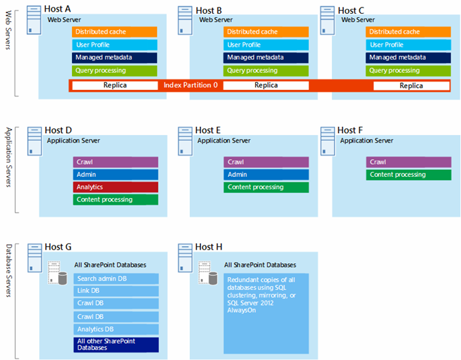
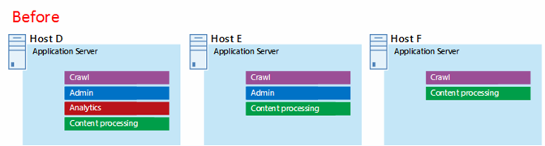
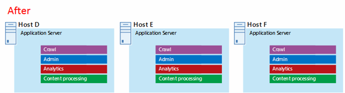

# Arquitecturas de Microsoft Azure para SharePoint 2013

 **Resumen:** Las soluciones de SharePoint 2013 pueden hospedarse en máquinas virtuales de Microsoft Azure. Obtenga información acerca de qué tipo de soluciones son una buena opción y cómo configurar Microsoft Azure para hospedar una.
  
Azure es un buen entorno para hospedar una solución de SharePoint Server 2013. En la mayoría de casos, se recomienda Office 365, pero una granja de SharePoint Server hospedada en Azure puede ser una buena opción para soluciones específicas. En este artículo se describe cómo diseñar soluciones de SharePoint para que sean adecuadas en la plataforma de Azure. Se usan como ejemplo las dos soluciones específicas siguientes:
  
- [Recuperación ante desastres de SharePoint Server 2013 en Microsoft Azure](sharepoint-server-2013-disaster-recovery-in-microsoft-azure.md)
    
- [Sitios de Internet en Microsoft Azure con SharePoint Server 2013](internet-sites-in-microsoft-azure-using-sharepoint-server-2013.md)
    
## Soluciones de SharePoint recomendadas para servicios de infraestructura de Azure

Los servicios de infraestructura de Azure son una opción atractiva para hospedar soluciones de SharePoint. Algunas soluciones son más adecuadas para esta plataforma que otras. La siguiente tabla muestra soluciones recomendadas.
  
|**Solución**|**Por qué se recomienda esta solución para Azure**|
|:-----|:-----|
|Entornos de desarrollo y pruebas    |Es fácil crear y administrar estos entornos.    |
|Recuperación ante desastres de granjas de SharePoint locales para Azure    |**Centro de datos secundario y hospedado** Use Azure en lugar de invertir en un centro de datos secundario de una región diferente.   **Entornos de recuperación ante desastres de coste más bajo** Mantenga y pague menos recursos que un entorno local de recuperación ante desastres. El número de recursos depende del entorno de recuperación ante desastres que elija: espera pasiva, estado de espera semiactiva o espera activa.  **Plataforma más elástica** En caso de desastre, escale fácil y horizontalmente la granja de SharePoint de recuperación para satisfacer los requisitos de carga. Reduzca horizontalmente cuando ya no necesite los recursos.  Vea [Recuperación ante desastres de SharePoint Server 2013 en Microsoft Azure](sharepoint-server-2013-disaster-recovery-in-microsoft-azure.md).    |
|Sitios orientados a Internet que usan características y escala no disponibles en Office 365    |**Centre sus esfuerzos** Concéntrese en crear el mejor sitio posible y no en tener que crear la infraestructura necesaria.   **Aproveche la flexibilidad de Azure** Asigne el tamaño a la granja según la demanda mediante la adición de servidores nuevos y pague únicamente los recursos que necesita. No se admite la asignación dinámica de máquinas (escala automática).  **Use Azure Active Directory (AD)** Aproveche Azure AD para cuentas de clientes.   **Funcionalidad de SharePoint para agregar no disponible en Office 365** Agregue creación de informes detallados y análisis web.   Vea [Sitios de Internet en Microsoft Azure con SharePoint Server 2013](internet-sites-in-microsoft-azure-using-sharepoint-server-2013.md).    |
|Granjas de aplicaciones para admitir entornos locales o Office 365    |**Cree, pruebe y hospede a aplicaciones** en Azure para admitir entornos locales y en la nube.   **Hospede a este rol** en Azure en lugar de comprar hardware nuevo para entornos locales.   |
   
Para intranet y cargas de trabajo y soluciones de colaboración, considere las siguientes opciones:
  
- Determine si Office 365 cumple los requisitos empresariales o puede formar parte de la solución. Office 365 proporciona un variado conjunto de características que siempre está actualizado.
    
- Si Office 365 no cumple todos los requisitos empresariales, considere una implementación estándar de SharePoint 2013 local desde los Servicios de consultoría de Microsoft (MCS). Una arquitectura estándar puede ser una solución más rápida, económica y sencilla que una solución personalizada. 
    
- Si una implementación estándar no cumple los requisitos empresariales, considere una solución local personalizada.
    
- Si el uso de una plataforma en la nube es importante para los requisitos empresariales, le recomendamos que use una implementación estándar o personalizada de SharePoint 2013 hospedado en los servicios de infraestructura de Azure. Las soluciones de SharePoint ofrecen mucha más compatibilidad con Azure que otras plataformas en la nube pública que no son nativas de Microsoft.
    
## Antes de diseñar el entorno de Azure

Aunque en este artículo se usan topologías de SharePoint como ejemplo, puede usar estos conceptos de diseño con cualquier topología de granja de SharePoint. Antes de diseñar el entorno de Azure, use la guía de topología, arquitectura, capacidad y rendimiento siguiente para diseñar la granja de SharePoint:
  
- [Diseño de la arquitectura de SharePoint 2013 para profesionales de TI](http://technet.microsoft.com/es-ES/sharepoint/fp123594.aspx)
    
- [Plan for performance and capacity management in SharePoint Server 2013](http://technet.microsoft.com/library/8dd52916-f77d-4444-b593-1f7d6f330e5f.aspx)
    
## Determinar el tipo de dominio de Active Directory

Cada granja de SharePoint Server usa Active Directory para proporcionar cuentas administrativas para la configuración de granjas. En este momento, existen dos opciones para soluciones de SharePoint en Azure. Los detalles se describen en la siguiente tabla.
  
|**Opción**|**Descripción**|
|:-----|:-----|
|Dominio dedicado    |Puede implementar un dominio de Active Directory dedicado y aislado en Azure para admitir la granja de SharePoint. Esta es una buena opción para sitios de Internet orientados a uso público.    |
|Extender el dominio local a través de una conexión entre locales    |Cuando extiende el dominio local a través de una conexión entre locales, los usuarios tienen acceso a la granja de SharePoint mediante la intranet como si estuviera hospedada de forma local. Puede aprovechar su implementación de DNS y Active Directory local.    Se requiere una conexión entre locales para crear un entorno de recuperación ante desastres en Azure y realizar la conmutación por error desde la granja local.    |
   
En este artículo se incluyen conceptos de diseño para extender el dominio local a través de una conexión entre locales. Si la solución usa un dominio dedicado, no es necesario diseñar una conexión entre locales.
  
## Diseñar la red virtual

En primer lugar, necesita una red virtual en Azure, que incluye las subredes en las que situará sus máquinas virtuales. La red virtual necesita un espacio de direcciones IP privadas, partes del cual se asignarán a las subredes.
  
Si está ampliando su red local a Azure mediante una conexión entre locales (necesaria para un entorno de recuperación ante desastres), debe elegir un espacio de direcciones privadas que no esté ya en uso en otro lugar de la red de su organización, que puede incluir su entorno local y otras redes virtuales de Azure. 
  
**Figura 1: Entorno local con una red virtual en Azure**

  
En este diagrama:
  
- Se ilustra una red virtual en Azure en paralelo con el entorno local. Los dos entornos aún no están conectados mediante una conexión entre locales, la cual puede ser una conexión VPN de sitio a sitio o ExpressRoute.
    
- En este punto, la red virtual solo incluye las subredes y ningún otro elemento de arquitectura. Una subred hospedará la puerta de enlace de Azure y otras subredes hospedarán los niveles de la granja de servidores de SharePoint, con una adicional para Active Directory y DNS.
    
## Agregar conectividad entre locales

El siguiente paso de la implementación es crear la conexión entre locales (en caso de que sea aplicable a la solución). Para las conexiones entre locales, la puerta de enlace de Azure se encuentra en una subred de puerta de enlace independiente; debe crearla y asignarle un espacio de direcciones. 
  
Al planear una conexión entre locales, define y crea una conexión y una puerta de enlace de Azure hacia un dispositivo de puerta de enlace local.
  
**Figura 2: Uso de una puerta de enlace de Azure y un dispositivo de puerta de enlace local para proporcionar conectividad de sitio a sitio entre el entorno local y Azure**

  
En este diagrama:
  
- Se agrega al diagrama previo el entorno local que está conectado a la red virtual de Azure mediante una conexión entre locales, que puede ser una conexión VPN de sitio a sitio o ExpressRoute.
    
- Una puerta de enlace de Azure se encuentra en una subred de puerta de enlace.
    
- El entorno local incluye un dispositivo de puerta de enlace, como un enrutador o un servidor VPN.
    
Para obtener información adicional para planear y crear una red virtual entre locales, consulte [Conectar una red local con una red virtual de Microsoft Azure](connect-an-on-premises-network-to-a-microsoft-azure-virtual-network.md).
  
## Agregar Windows Server Active Directory (AD) y DNS

Para la recuperación ante desastres en Azure, debe implementar Windows Server AD y DNS en un escenario híbrido donde se implementa Windows Server AD tanto de forma local como en máquinas virtuales de Azure.
  
**Figura 3: Configuración híbrida de dominios de Active Directory**

  
Este diagrama es una continuación de los diagramas previos al agregar dos máquinas virtuales en una subred de Windows Server AD y DNS. Estas máquinas virtuales son réplicas de servidores DNS y controladores de dominio. Son una extensión del entorno de Windows Server AD local. 
  
La siguiente tabla proporciona recomendaciones de configuración para estas máquinas virtuales en Azure. Úselas como punto de partida para diseñar su propio entorno (incluso para un dominio de dedicado donde el entorno de Azure no se comunica con el entorno local.
  
|**Elemento**|**Configuración**|
|:-----|:-----|
|Tamaño de las máquinas virtuales en Azure    |Tamaño A1 o A2 en el nivel estándar    |
|Sistema operativo    |Windows Server 2012 R2    |
|Rol de Active Directory    |Controlador de dominio de AD DS designado como servidor de catálogo global. Esta configuración reduce el tráfico de salida a través de la conexión entre locales.    En un entorno de varios dominios con altos índices de cambio (esto no es común), configure controladores de dominio de forma local no para sincronizar con los servidores de catálogo globales en Azure, sino para reducir el tráfico de replicación.    |
|Rol de DNS    |Instale y configure el servicio de DNS Server en los controladores de dominio.    |
|Discos de datos    |Coloque la base de datos, los registros y SYSVOL de Active Directory en discos de datos de Azure adicionales. No los coloque en el disco del sistema operativo o discos temporales proporcionados por Azure.    |
|Direcciones IP    |Utilice direcciones IP estáticas y configure la red virtual para que las asigne a las máquinas virtuales de la red virtual tras la configuración de los controladores de dominio.    |
   
> [!IMPORTANT]
> Antes de implementar Active Directory en Azure, lea las [Directrices para implementar Windows Server Active Directory en máquinas virtuales de Azure](https://go.microsoft.com/fwlink/p/?linkid=392681). Le ayudarán a determinar si la solución requiere una arquitectura diferente u opciones de configuración diferentes. 
  
## Agregar la granja de SharePoint

Coloque las máquinas virtuales de la granja de servidores de SharePoint en niveles de las subredes apropiadas.
  
**Figura 4: Colocación de máquinas virtuales de SharePoint**

  
Este diagrama es una continuación de los diagramas previos al agregar los roles de servidor de granja de SharePoint en sus respectivos niveles.
  
- Dos máquinas virtuales de base de datos que ejecutan SQL Server crean el nivel de base de datos.
    
- Dos máquinas virtuales ejecutan SharePoint Server 2013 para cada uno de los siguientes niveles: servidores front-end, servidores de caché distribuidos y servidores back-end.
    
## Diseñar y ajustar roles de servidor para conjuntos de disponibilidad y dominios de error

Un dominio de error es un agrupamiento de hardware en el que se ejecutan instancias de rol. La infraestructura de Azure puede actualizar al mismo tiempo las máquinas virtuales dentro del mismo dominio de error, o bien pueden fallar al mismo tiempo porque comparten la misma estantería. Para evitar el riesgo de tener dos máquinas virtuales en el mismo dominio de error, puede configurar sus máquinas virtuales como conjunto de disponibilidad, lo que garantiza que cada máquina virtual se encuentre en un dominio de error diferente. Si tres máquinas virtuales están configuradas como conjunto de disponibilidad, Azure garantiza que no habrá más que dos de las máquinas virtuales ubicadas en el mismo servidor de error.
  
Cuando diseñe la arquitectura de Azure para una granja de SharePoint, configure roles de servidor idénticos para que formen parte de un conjunto de disponibilidad. Esto garantiza que las máquinas virtuales estén esparcidas por varios dominios de error.
  
**Figura 5: Uso de Conjuntos de disponibilidad de Azure para proporcionar alta disponibilidad para niveles de granja de servidores de SharePoint**

  
Este diagrama llama a la configuración de conjuntos de disponibilidad dentro de la infraestructura de Azure. Cada uno de los siguientes roles comparte un conjunto de disponibilidad separado:
  
- Active Directory y DNS
    
- Base de datos
    
- Back-end
    
- Caché distribuido
    
- Front-end
    
Podría ser necesario ajustar la granja de SharePoint en la plataforma de Azure. Para garantizar la alta disponibilidad de todos los componentes, asegúrese de que los roles de servidor estén configurados todos de forma idéntica.
  
Este es un ejemplo que muestra una arquitectura estándar de Sitios de Internet que cumple objetivos específicos de capacidad y rendimiento. Este ejemplo se encuentra en el siguiente modelo de arquitectura: [Arquitecturas de búsqueda en sitios de Internet para SharePoint Server 2013](https://go.microsoft.com/fwlink/p/?LinkId=261519).
  
**Figura 6: Ejemplo de planeación para objetivos de capacidad y rendimiento en una granja de tres niveles**

  
En este diagrama:
  
- Se representa una granja de tres niveles: servidores web, servidores de aplicaciones y servidores de bases de datos.
    
- Los tres servidores web están configurados idénticamente con varios componentes.
    
- Los dos servidores de bases de datos están configurados idénticamente.
    
- Los tres servidores de aplicaciones no están configurados idénticamente. Estos roles de servidor requieren ajustes para conjuntos de disponibilidad en Azure.
    
Observemos más cerca el nivel de servidor de aplicaciones
  
**Figura 7: Nivel de servidor de aplicaciones antes del ajuste**

  
En este diagrama:
  
- Se incluyen tres servidores en el nivel de aplicación.
    
- El primer servidor incluye cuatro componentes.
    
- El segundo servidor incluye tres componentes.
    
- El tercer servidor incluye dos componentes.
    
Los objetivos de rendimiento y capacidad para la granja permiten determinar el número de componentes. Para adaptar esta arquitectura para Azure, replicaremos los cuatro componentes en los tres servidores. Esto incrementa el número de componentes más allá de lo necesario para rendimiento y capacidad. La desventaja es que este diseño garantiza la alta disponibilidad de los cuatro componentes en la plataforma de Azure cuando estas tres máquinas virtuales están asignadas a un conjunto de disponibilidad.
  
**Figura 8: Nivel de servidor de aplicaciones después del ajuste**

  
Este diagrama muestra los tres servidores de aplicaciones configurados de forma idéntica con los mismos cuatro componentes.
  
Cuando agregamos conjuntos de disponibilidad a los niveles de la granja de servidores de SharePoint, se completa la implementación.
  
**Figura 9: La granja de SharePoint completada en los servicios de infraestructura de Azure**

  
Este diagrama muestra el conjunto de servidores de SharePoint implementado en los servicios de infraestructura de Azure, con conjuntos de disponibilidad para proporcionar dominios de error para los servidores de cada nivel.
  
**Participar en la discusión**

|**Póngase en contacto con nosotros**|**Descripción**|
|:-----|:-----|
|**¿Qué soluciones necesita?**   |Estamos creando contenido para soluciones que abarcan varios productos y servicios de Microsoft. Díganos qué piensa sobre nuestras soluciones entre servidores o solicite soluciones específicas por correo electrónico a [MODAcontent@microsoft.com](mailto:cloudadopt@microsoft.com?Subject=[Cloud%20Adoption%20Content%20Feedback]:%20).  |
|**Participe en la discusión sobre soluciones**   |Si es un apasionado de las soluciones basadas en la nube, puede unirse a Cloud Adoption Advisory Board (CAAB) para conectarse a una interesante comunidad de mayor tamaño formada por desarrolladores de contenido de Microsoft, profesionales del sector y clientes de todo el mundo. Para unirse, agregue a su usuario como miembro del [espacio CAAB (Cloud Adoption Advisory Board)](https://aka.ms/caab) de Microsoft Tech Community y envíenos un correo electrónico a [CAAB@microsoft.com](mailto:caab@microsoft.com?Subject=I%20just%20joined%20the%20Cloud%20Adoption%20Advisory%20Board!). Cualquiera puede leer contenido relacionado con la comunidad en el [blog de CAAB](https://blogs.technet.com/b/solutions_advisory_board/). Pero los miembros de CAAB reciben invitaciones a seminarios web privados donde se describen nuevos recursos y soluciones de adopción de la nube.    |
|**Obtenga los archivos de arte que ve aquí**   |Si quiere recibir una copia editable de las ilustraciones que se muestran en este artículo, estaremos encantados de enviárselas. Envíe su solicitud por correo electrónico, incluida la dirección URL y el título de la ilustración, a [cloudadopt@microsoft.com](mailto:cloudadopt@microsoft.com?subject=[Art%20Request]:%20).    |
   
## Consulte también

[Adopción de la nube y soluciones híbridas](cloud-adoption-and-hybrid-solutions.md)
  
[Sitios de Internet en Microsoft Azure con SharePoint Server 2013](internet-sites-in-microsoft-azure-using-sharepoint-server-2013.md)
  
[Recuperación ante desastres de SharePoint Server 2013 en Microsoft Azure](sharepoint-server-2013-disaster-recovery-in-microsoft-azure.md)

