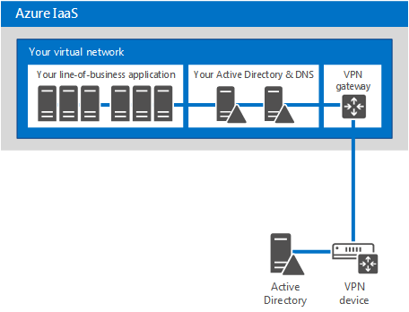
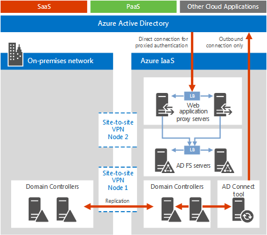
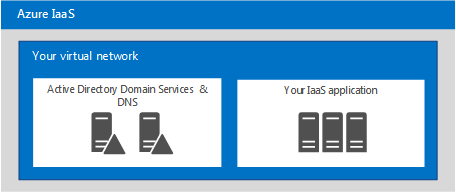

# Identidad de nube de Microsoft para arquitectos de empresaMicrosoft Cloud Identity for Enterprise Architects

 **Resumen:** diseñar la solución de identidad para plataformas y servicios en la nube de Microsoft.**Summary:** Design your identity solution for Microsoft cloud services and platforms.
  
En este artículo se describe lo que los arquitectos de TI necesitan saber sobre el diseño de la identidad para las organizaciones que usan plataformas y servicios en la nube de Microsoft. También puede ver este artículo como un póster de cinco páginas e imprimirlo en formato tabloide (también conocido como doble carta, 11 x 17 o A3).This article describes what IT architects need to know about designing identity for organizations using Microsoft cloud services and platforms. You can also view this article as a 5-page poster and print it in tabloid format (also known as ledger, 11 x 17, or A3).
  

  
[PDF](https://go.microsoft.com/fwlink/p/?LinkId=524586) | [Visio](https://download.microsoft.com/download/2/3/8/238228E6-9017-4F6C-BD3C-5559E6708F82/MSFT_cloud_architecture_identity.vsd) | [Más idiomas](https://www.microsoft.com/download/details.aspx?id=54431)[PDF](https://go.microsoft.com/fwlink/p/?LinkId=524586) | [Visio](https://download.microsoft.com/download/2/3/8/238228E6-9017-4F6C-BD3C-5559E6708F82/MSFT_cloud_architecture_identity.vsd) | [More languages](https://www.microsoft.com/download/details.aspx?id=54431)
  
También puede ver todos los modelos en los [Recursos de arquitectura de TI de Microsoft Cloud](microsoft-cloud-it-architecture-resources.md) y conocer el [Plan de desarrollo de la nube empresarial de Microsoft: Recursos para responsables de toma de decisiones de TI](https://aka.ms/cloudarchitecture).You can also see all of the models in the [Microsoft Cloud IT architecture resources](microsoft-cloud-it-architecture-resources.md) and swipe through [Microsoft's Enterprise Cloud Roadmap: Resources for IT Decision Makers](https://aka.ms/cloudarchitecture).
  
> [!NOTE]
> En este artículo, se refleja la versión de enero de 2016 del póster de la **Identidad de Microsoft Cloud para arquitectos empresariales**. No contiene los cambios de la versión de abril de 2016 ni versiones posteriores del póster.This article reflects the January 2016 version of the **Microsoft cloud identity for enterprise architects** poster. It does not contain the changes for the April 2016 or later versions of the poster.
  
## Diseño de la identidad para Microsoft CloudDesigning identity for the Microsoft cloud

La integración de las identidades con la nube de Microsoft proporciona acceso a una amplia gama de servicios y opciones de plataforma en la nube. Existen dos opciones principales:Integrating your identities with the Microsoft cloud provides access to a broad range of services and cloud platform options. There are two main options:
  
- Puede realizar la integración con Microsoft Azure Active Directory (AD). Esto implica la sincronización de las cuentas locales con Azure AD, el proveedor de identidades para la nube de Microsoft.You can integrate with Microsoft Azure Active Directory (AD). This involves synchronizing your on-premises accounts to Azure AD, the identity provider for the Microsoft cloud.
    
- Puede ampliar su entorno de Servicios de dominio de Active Directory (AD DS) local para las máquinas virtuales que se ejecutan en servicios de infraestructura de Microsoft Azure.You can extend your on-premises Active Directory Domain Services (AD DS) environment to virtual machines running in Microsoft Azure infrastructure services.
    

  
 **Figura 1: Opciones para diseñar las identidades en la nube****Figure 1: Options for designing your identities in the cloud**
  
La figura 1 muestra que Azure AD es el proveedor de identidades de los servicios de software como servicio (SaaS) de Microsoft y de las aplicaciones de plataforma como servicio (PaaS) de Azure, y que las aplicaciones de línea de negocio pueden usar AD DS local.Figure 1 shows how Azure AD is the identity provider for Microsoft Software as a Service (SaaS) services and Azure Platform as a Service (PaaS) applications and how line-of-business applications can use on-premises AD DS. 
  
### Azure Active DirectoryAzure Active Directory

Microsoft Azure AD es el servicio de administración de acceso e identidades hospedado en la nube de Microsoft. Es el elemento central de las plataformas y los servicios en la nube de Microsoft. La integración con Azure AD proporciona acceso a todos los servicios SaaS de Microsoft usando su conjunto actual de cuentas y contraseñas. Dicha integración también proporciona una identidad basada en la nube para las aplicaciones PaaS de Azure.Microsoft Azure AD is the Microsoft cloud-hosted identity and access management service. It's at the center of Microsoft cloud services and platforms. Integrating with Azure AD provides access to all of the Microsoft SaaS services using your current set of accounts and passwords. That integration also provides cloud-based identity for Azure PaaS applications. 
  
> [!NOTE]
> Azure AD no evita tener que usar AD DS local para las organizaciones empresariales o para las máquinas virtuales basadas en Windows que se ejecutan en la infraestructura como servicio (IaaS) de Azure.Azure AD does not replace the need for AD DS on-premises for enterprise organizations or for Windows -based virtual machines running in Azure Infrastructure as a Service (IaaS). 
  
Hay tres ediciones de Azure AD: Gratuita, Basic y Premium.There are three editions of Azure AD: Free, Basic, and Premium. 
  
||||
|:-----|:-----|:-----|
|**Gratuito****Free**   |**Basic****Basic**   |**Premium****Premium**   |
| 	Administrar cuentas de usuarioManage user accounts    Sincronizar con directorios localesSynchronize with on-premises directories    Inicio de sesión único en Azure, Office 365 y miles de aplicaciones SaaS populares, como Salesforce, Workday, Concur, DocuSign, Google Apps, Box, ServiceNow, Dropbox y muchas másSingle sign-on across Azure, Office 365, and thousands of other popular SaaS applications, such as Salesforce, Workday, Concur, DocuSign, Google Apps, Box, ServiceNow, Dropbox, and more   | Incluye todas las capacidades de la edición gratuita, así como:Includes all of the abilities in the Free edition, plus:    Personalización de marca de la empresaCompany branding    Acceso a aplicaciones basadas en gruposGroup-based application access    Restablecimiento de contraseñas de autoservicioSelf-service password reset    SLA empresarial del 99,9 %Enterprise SLA of 99.9%   | Incluye todas las características de las ediciones gratuita y Basic, así como:Includes all of the features of the Free and Basic editions, plus:    Administración de grupos de autoservicioSelf-service group management    	Alertas e informes de seguridad avanzadaAdvanced security reports and alerts    	Autenticación multifactorMulti-factor authentication    Restablecimiento de contraseña con reescritura en AD DS localPassword reset with write-back to on-premises AD DS    Sincronización bidireccional de herramientas de Azure AD ConnectAzure AD Connect tool bidirectional synchronization    Proxy de aplicación de Azure ADAzure AD Application Proxy    	Microsoft Forefront Identity Manager (MIM)Microsoft Forefront Identity Manager (MIM)   |
   
Para obtener más información sobre las versiones, consulte [Ediciones de Azure Active Directory ](https://go.microsoft.com/fwlink/p/?LinkId=524280).For more information about versions, see [Azure Active Directory editions](https://go.microsoft.com/fwlink/p/?LinkId=524280).
  
### Opción 1: Integración con Azure Active DirectoryOption 1: Integrate with Azure Active Directory

La mayoría de las organizaciones sincronizan un conjunto estándar de objetos y atributos con el inquilino de Azure AD. La herramienta de Azure AD Connect sincroniza las cuentas entre AD DS local y un inquilino de Azure AD.Most organizations synchronize a standard set of objects and attributes to their Azure AD tenant. The Azure AD Connect tool synchronizes your accounts between on-premises AD DS and an Azure AD tenant.
  

  
 **Figura 2: Integración con Azure AD****Figure 2: Integrating with Azure AD**
  
La figura 2 muestra la manera en que la herramienta de Azure AD Connect obtiene los cambios en AD DS y los envía al inquilino de Azure AD. En este caso, el inquilino de Azure AD es un duplicado hospedado en la nube del contenido esencial del directorio local.Figure 2 shows how the Azure AD Connect tool obtains AD DS changes and sends them to your Azure AD tenant. In this case, your Azure AD tenant is a cloud-hosted duplicate of essential on-premises directory content.
  
Muchas organizaciones usan AD DS como proveedor de identidades local. Puede usar otro tipo de proveedor de identidades local (por ejemplo, uno que use LDAP) y sincronizarlas con Azure AD.Many organizations use AD DS as their on-premises identity provider. You can use a different type of identity provider on-premises (such as one that uses LDAP), and synchronize these to Azure AD.
  
### Opción 2: Ampliación de AD DS a AzureOption 2: Extend AD DS to Azure

La ampliación de AD DS a máquinas virtuales que se ejecutan en servicios de infraestructura de Azure admite un conjunto de soluciones y aplicaciones diferente del que admite la sincronización con Azure AD. A continuación se indican dos:Extending AD DS to virtual machines running in Azure infrastructure services supports a different set of solutions and applications compared to synchronization with Azure AD. Here are two:
  
- Admite soluciones basadas en la nube que requieren la autenticación NTLM o Kerberos, o máquinas virtuales unidas a un dominio de AD DS.Supports cloud-based solutions that require NTLM or Kerberos authentication, or AD DS domain-joined virtual machines.
    
- Agrega la posibilidad de integración adicional para aplicaciones y servicios en la nube a través de plataformas y servicios en la nube de Microsoft.Adds additional integration potential for cloud services and applications across Microsoft cloud services and platforms.
    

  
 **Figura 3: Ampliación de AD DS a Azure****Figure 3: Extending AD DS to Azure**
  
La figura 3 muestra un controlador de dominio de AD DS conectado a una red virtual de Azure mediante un dispositivo VPN local y una puerta de enlace de VPN de Azure. La red virtual de Azure contiene servidores para una aplicación de línea de negocio y su propio conjunto de controladores de dominio de AD DS.Figure 3 shows an AD DS domain controller connected to an Azure virtual network through an on-premises VPN device and an Azure VPN gateway. The Azure virtual network contains servers for a line-of-business application and its own set of AD DS domain controllers.
  
### Más informaciónMore Information

- [Sincronizar el directorio con Office 365 es fácilSynchronizing your directory with Office 365 is easy](https://go.microsoft.com/fwlink/p/?LinkId=524281)
    
- [Infografía: Administración de acceso e identidades en la nubeInfographic: Cloud identity and access management](https://go.microsoft.com/fwlink/p/?LinkId=524282)
    
- [Azure Active DirectoryAzure Active Directory](https://go.microsoft.com/fwlink/p/?LinkId=524283)
    
## Integración de las cuentas de AD DS local con Microsoft Azure ADIntegrate your on-premises AD DS accounts with Microsoft Azure AD

Al sincronizar las cuentas de AD DS local con Azure AD, los usuarios pueden usar sus cuentas de AD DS local para acceder a:By synchronizing your on-premises AD DS accounts with Azure AD, your users can use their on-premises AD DS accounts to access:
  
- Todos los servicios SaaS de Microsoft (Office 365, Microsoft Intune y Dynamics CRM Online)All of the Microsoft SaaS services (Office 365, Microsoft Intune, and Dynamics CRM Online)
    
- Las aplicaciones que se ejecutan en PaaS de AzureYour applications running in Azure PaaS
    
Hay dos maneras de configurar esta integración:There are two ways to configure this integration:
  
- Sincronización de directorio y contraseñaDirectory and password synchronization
    
- Federación e inicio de sesión únicoFederation and single sign-on
    
Comience con la opción más sencilla que satisfaga sus necesidades. Puede alternar entre estas opciones, si es necesario.Start with the simplest option that meets your needs. You can switch between these options, if needed.
  
> [!NOTE]
> No se recomienda el uso de cuentas solo en la nube (es decir, no realizar la integración con AD DS local) para organizaciones de escala empresarial.Using cloud-only accounts (not integrating with your on-premises AD DS) is not recommended for enterprise-scale organizations. 
  
### Sincronización de directorio y contraseñaDirectory and password synchronization

Esta es la opción más sencilla y solo requiere un servidor que ejecute la herramienta de Azure AD Connect.This is the simplest option and requires only a server running the Azure AD Connect tool. 
  

  
 **Figura 4: Configuración de sincronización de directorio y contraseña****Figure 4: Directory and password synchronization configuration**
  
La figura 4 muestra un centro de datos en la nube privado o local con un controlador de dominio de AD DS. Un servidor que ejecuta la herramienta de Azure AD Connect sincroniza la lista de nombres de cuenta con Azure AD.Figure 4 shows an on-premises or private cloud datacenter with an AD DS domain controller. A server running the Azure AD Connect tool synchronizes the list of account names with Azure AD.
  
Con esta opción:With this option:
  
- Las cuentas de usuario se sincronizan de AD DS local (u otro proveedor de identidades) con el inquilino de Azure AD. El directorio local sigue siendo el origen de autoridad de las cuentas y todos los cambios en las cuentas se administran desde allí.User accounts are synchronized from your on-premises AD DS (or other identity provider) to your Azure AD tenant. The on-premises directory remains the authoritative source for accounts and you manage all account changes from there.
    
- Azure AD lleva a cabo la autenticación de los servicios basados en SaaS de Microsoft y las aplicaciones PaaS de Azure.Azure AD performs all authentication for Microsoft SaaS-based services and Azure PaaS applications.
    
- También puede configurar la sincronización de varios bosques de AD DS.You can also configure synchronization for multiple AD DS forests.
    
Con la sincronización de contraseñas:With password synchronization:
  
- Se pide a los usuarios que escriban una contraseña al acceder a los servicios en la nube, que es la misma contraseña que usan para los recursos locales.Users are prompted to enter a password when accessing cloud services, which is the same password that they use for on-premises resources.
    
- Las contraseñas de usuario nunca se envían como texto no cifrado a Azure AD. En su lugar, se usa un hash de la contraseña. Es criptográficamente imposible descifrar el hash de la contraseña o usar técnicas de ingeniería inversa para obtener la contraseña como texto no cifrado.User passwords are never sent as cleartext to Azure AD. Instead, a hash of the password is used. It is cryptographically impossible to decrypt or reverse-engineer the password hash and obtain the cleartext password. 
    
Con la autenticación multifactor (MFA):With multi-factor authentication (MFA):
  
- Puede aprovechar las características básicas de MFA que se ofrecen con Office 365.You can take advantage of basic MFA features offered with Office 365.
    
- Los desarrolladores de aplicaciones PaaS de Azure pueden aprovechar el servicio de autenticación multifactor de Azure.Azure PaaS application developers can take advantage of the Azure Multi-Factor Authentication service.
    
La sincronización de directorios no proporciona integración con soluciones MFA locales.Directory synchronization does not provide integration with on-premises MFA solutions.
  
### Federación e inicio de sesión únicoFederation and single sign-on

Esta opción requiere una infraestructura y servidores adicionales.This option requires additional servers and infrastructure. 
  

  
 **Figura 5: Servidores necesarios para la autenticación federada****Figure 5: Servers needed for federated authentication**
  
La figura 5 muestra el conjunto de componentes para la autenticación federada. Azure AD se pone en contacto con un proxy de aplicación web, el cual reenvía la solicitud de autenticación a un servidor de Servicios de federación de Active Directory (AD FS) que, a su vez, reenvía la solicitud a un controlador de dominio de AD DS para la evaluación y la respuesta. Un servidor que ejecuta la herramienta de Azure AD Connect sincroniza la lista de nombres de cuenta de AD DS con Azure AD.Figure 5 shows the set of components for federated authentication. Azure AD contacts a web application proxy, which forwards the authentication request to an Active Directory Federation Services (AD FS) server, which forwards the request to an AD DS domain controller for evaluation and response. A server running the Azure AD Connect tool synchronizes the list of account names from AD DS to Azure AD.
  
La federación ofrece las siguientes capacidades empresariales adicionales:Federation provides these additional enterprise capabilities:
  
- Todas las solicitudes de autenticación enviadas a Azure AD se reenvían y se llevan a cabo con el proveedor de identidades local a través de AD FS.All authentication requests sent to Azure AD are forwarded to and performed against the on-premises identity provider through AD FS.
    
- Funciona con proveedores de identidades que no son de Microsoft.Works with non-Microsoft identity providers.
    
- La sincronización del hash de contraseña puede actuar como copia de seguridad de inicio de sesión para el inicio de sesión federado (por ejemplo, si se produce un error en la autenticación federada).Password hash synchronization can act as a sign-in backup for federated sign-in (for example, if the federated authentication fails).
    
Use la federación si:Use federation if:
  
- Se requiere el inicio de sesión único. Con el inicio de sesión único, no se les pide a los usuarios que especifiquen las credenciales (nombre de usuario o contraseña) al acceder a un servicio en la nube.Single sign-on is required. With single sign-on, users are not prompted to enter any credentials (user name or password), when accessing a cloud service.
    
- Ya se ha implementado AD FS.AD FS is already deployed.
    
- Usa un proveedor de identidades de terceros.You use a third-party identity provider.
    
- Usa Forefront Identity Manager 2010 R2 (no admite la sincronización de hash de contraseña).You use Forefront Identity Manager 2010 R2 (does not support password hash synchronization).
    
- Tiene una tarjeta inteligente integrada local u otra solución MFA.You have an on-premises integrated smart card or other MFA solution.
    
- Requiere la auditoría de inicio de sesión o la deshabilitación de cuentas.You require sign-in audit and/or disablement of accounts.
    
- Su organización requiere restricciones en el inicio de sesión de cliente en función de la ubicación de red o las horas laborables.Your organization requires client sign-in restrictions by network location or work hours.
    
- Debe cumplir los Estándares federales de procesamiento de información (FIPS).You must comply with Federal Information Processing Standards (FIPS).
    
La autenticación federada requiere una mayor inversión en la infraestructura local.Federated authentication requires a greater investment in infrastructure on-premises.
  
- Los servidores locales deben ser accesibles desde Internet a través de un firewall corporativo. Microsoft recomienda el uso de servidores proxy de aplicación web implementados en la red perimetral.The on-premises servers must be Internet-accessible through a corporate firewall. Microsoft recommends the use of Web Application Proxy servers deployed in your perimeter network.
    
- Requiere hardware, licencias y operaciones para servidores de AD FS, servidores proxy de AD FS o servidores proxy de aplicación web, firewalls y equilibradores de carga.Requires hardware, licenses, and operations for AD FS servers, AD FS proxy or Web Application Proxy servers, firewalls, and load balancers. 
    
- La disponibilidad y el rendimiento son importantes para garantizar que los usuarios puedan acceder a Office 365 y otras aplicaciones en la nube.Availability and performance are important to ensure users can access Office 365 and other cloud applications.
    
### Más informaciónMore Information

- [Sincronizar el directorio con Office 365 es fácilSynchronizing your directory with Office 365 is easy](https://go.microsoft.com/fwlink/p/?LinkId=524281)
    
- [Preparar el aprovisionamiento de usuarios a Office 365 mediante la sincronización de directoriosPrepare to provision users through directory synchronization to Office 365](https://go.microsoft.com/fwlink/p/?LinkId=524284)
    
- [Autenticación multifactor para Office 365Multi-Factor Authentication for Office 365](https://go.microsoft.com/fwlink/p/?LinkID=392012)
    
- [Autenticación multifactor de AzureAzure Multi-Factor Authentication](https://go.microsoft.com/fwlink/p/?LinkId=524285)
    
- [TechEd 2014: Integración de directorios: Crear un directorio con Active Directory y Azure Active DirectoryTechEd 2014: Directory Integration: Creating One Directory with Active Directory and Azure Active Directory](https://go.microsoft.com/fwlink/p/?LinkId=524286)
    
## Ampliación de AD DS a AzureExtend AD DS to Azure

La ampliación de AD DS a Azure es el primer paso para admitir aplicaciones de línea de negocio que se ejecutan en máquinas virtuales en servicios de infraestructura de Azure, lo que proporciona:Extending AD DS to Azure is the first step to support line-of-business applications running on virtual machines in Azure infrastructure services, which provides:
  
- Compatibilidad con soluciones basadas en la nube que requieren la autenticación NTLM o Kerberos, o máquinas virtuales unidas a un dominio de AD DS.Support for cloud-based solutions that require NTLM or Kerberos authentication, or AD DS domain-joined virtual machines.
    
- Posibilidad de integración adicional para aplicaciones y servicios en la nube, que se pueden agregar en cualquier momento.Additional integration potential for cloud services and applications and can be added at any time.
    

  
 **Figura 6: Ampliación de AD DS a una red virtual de Azure****Figure 6: Extending AD DS to an Azure virtual network**
  
La figura 6 muestra un centro de datos en la nube privado o local con AD DS conectado a una red virtual de Azure con una conexión de sitio a sitio VPN o ExpressRoute. La red virtual de Azure contiene servidores para una aplicación de línea de negocio y su propio conjunto de controladores de dominio de AD DS. Esta configuración es una implementación híbrida de AD DS local y en servicios de infraestructura de Azure. Requiere lo siguiente:Figure 6 shows an on-premises or private cloud datacenter with AD DS connected to an Azure virtual network with a site-to-site VPN or ExpressRoute connection. The Azure virtual network contains servers for a line-of-business application and its own set of AD DS domain controllers. This configuration is a hybrid deployment of AD DS on-premises and in Azure infrastructure services. It requires:
  
- Una red virtual de Azure.An Azure virtual network.
    
- Una conexión entre un dispositivo de red privada virtual (VPN) o enrutador local y una puerta de enlace de VPN de Azure.A connection between an on-premises virtual private network (VPN) device or router and an Azure VPN gateway.
    
- El uso de una parte del espacio local de direcciones IP para las máquinas virtuales de la red virtual.Using a portion of your on-premises IP address space for the virtual machines in the virtual network.
    
- La implementación de uno o más controladores de dominio en la red virtual designados como servidores de catálogo global (lo que reduce el tráfico de salida en la conexión VPN).Deploying one or more domain controllers in the virtual network designated as global catalog servers (reduces egress traffic across the VPN connection).
    
Esta arquitectura de identidad admite un conjunto de soluciones y aplicaciones diferente del que admite la sincronización con Azure AD.This identity architecture supports a different set of solutions and applications compared to synchronization with Azure AD.
  
### Opciones de conexión de local a AzureOn-premises to Azure connection options

Para conectar su red local a una red virtual de Azure, puede usar lo siguiente:To connect your on-premises network to an Azure virtual network, you can use:
  
- Una conexión VPN de sitio a sitio, que puede conectar entre 1 y 10 sitios (incluidas otras redes virtuales de Azure) a una sola red virtual de Azure.A site-to-site VPN connection, which can connect 1-10 sites (including other Azure virtual networks) to a single Azure virtual network.
    
- ExpressRoute, un vínculo WAN seguro y privado a Azure a través de un proveedor de servicios de red y centro de datos asociado. Las conexiones ExpressRoute pueden ofrecer una mayor confiabilidad, un mayor ancho de banda y latencias menores.ExpressRoute, a private, secure WAN link to Azure through a partner network and datacenter services provider. ExpressRoute connections can offer increased reliability, higher bandwidth, and lower latencies.
    
### Más informaciónMore Information

- [Acerca de la conectividad segura entre locales de redes virtualesCross-premises connectivity for virtual networks](https://go.microsoft.com/fwlink/p/?LinkId=524293)
    
- [Información técnica de ExpressRouteExpressRoute Technical Overview](https://go.microsoft.com/fwlink/?LinkID=392081)
    
- [Directrices para implementar Windows Server Active Directory en máquinas virtuales de AzureGuidelines for Deploying Windows Server Active Directory on Azure Virtual Machines](https://go.microsoft.com/fwlink/p/?LinkId=524295)
    
## Integración de sus aplicaciones con identidades de nubeIntegrate your applications with cloud identities

Al diseñar y desarrollar aplicaciones que se ejecutan en la nube, debe fijarse como objetivo la coherencia de la experiencia del usuario en el proceso de autenticación, incluido el conjunto de credenciales necesarias. Por ejemplo, si usa credenciales de Windows, tanto en Azure AD como en AD DS ampliado, asegúrese de que los usuarios pueden autenticarse y centrarse en sus tareas rápidamente.When designing and developing applications that run in the cloud, you should aim for consistency of the user experience for the authentication process, including the set of required credentials. For example, when using Windows credentials, whether against Azure AD or an extended AD DS, ensure that users can quickly authenticate and focus on their tasks.
  

  
 **Figura 7: Integración de sus aplicaciones con identidades de nube****Figure 7: Integrate your applications with cloud identities**
  
La figura 7 muestra tres opciones para integrar la aplicación con identidades de nube.Figure 7 shows three options for integrating your application with cloud identities.
  
1. Registre las aplicaciones hospedadas en la nube con Azure AD.Register your cloud-hosted applications with Azure AD.
    
    Consulte el artículo de MSDN [Integración de aplicaciones con Azure Active Directory](https://go.microsoft.com/fwlink/p/?LinkId=524303). Esto le permite usar Azure AD para autenticar el acceso a la aplicación PaaS, así como permitir que los usuarios o los administradores concedan derechos a la aplicación para que acceda a contenido en su nombre desde otros servicios en la nube, como Office 365. Encontrará más detalles y ejemplos de código en el artículo de MSDN [Escenarios de autenticación para Azure Active Directory](https://go.microsoft.com/fwlink/p/?LinkId=524304).See the MSDN article [Integrating Applications with Azure Active Directory](https://go.microsoft.com/fwlink/p/?LinkId=524303). This lets you use Azure AD to authenticate access to your PaaS application, as well as allowing users or administrators to grant rights to your application to access content on their behalf from other cloud services, such as Office 365. More details and code samples can be found in the MSDN article [Authentication Scenarios for Azure Active Directory](https://go.microsoft.com/fwlink/p/?LinkId=524304). 
    
2. Las aplicaciones que requieren autenticación mediante programación para acceder a una aplicación protegida por AD SD, AD FS en Windows Server 2012 R2 o Azure AD pueden usar:Applications that require programmatic authentication to gain access to an application secured by AD SD, AD FS on Windows Server 2012 R2, or Azure AD can use:
    
  - La [API de Graph de Azure AD](https://go.microsoft.com/fwlink/p/?LinkId=524305)The [Azure AD Graph API](https://go.microsoft.com/fwlink/p/?LinkId=524305)
    
  - [Biblioteca de autenticación de Active Directory (ADAL)Active Directory Authentication Library (ADAL)](https://go.microsoft.com/fwlink/p/?LinkID=524297)
    
    La API de Graph de Azure AD admite OAuth y OpenID Connect. También funciona con aplicaciones PaaS.The Azure AD Graph API supports OAuth and OpenID Connect. It also works with PaaS applications.
    
3. Configure las aplicaciones locales o las aplicaciones de línea de negocio que se ejecutan en máquinas virtuales en una red virtual de Azure de modo que usen directamente la autenticación de Windows (NTLM o Kerberos). Esta es la mejor experiencia para los usuarios y requiere una configuración mínima para los desarrolladores de aplicaciones de servidor.Configure on-premises applications or line-of-business applications running on virtual machines in an Azure virtual network to use Windows authentication (NTLM or Kerberos) directly. This is the best experience for users and requires the least configuration for server application developers.
    
### Ejemplo de integración de aplicacionesApplication integration example

Una organización crea una aplicación ASP.NET que expone un punto de conexión REST donde otras aplicaciones pueden obtener los datos de ventas más recientes. El acceso a ese punto de conexión REST está protegido con Azure AD. Las aplicaciones deben proporcionar credenciales que puedan ser autenticadas por Azure AD antes de que la aplicación ASP.NET envíe los datos solicitados. A continuación, otros desarrolladores de la organización pueden escribir sus propias aplicaciones que usen los datos de ventas del punto de conexión REST.An organization builds an ASP.NET application that exposes a REST endpoint where other applications can obtain the latest sales data. Access to that REST endpoint is secured with Azure AD. Applications must provide credentials that can be authenticated by Azure AD before the ASP.NET application sends the requested data. Other developers in the organization can then write their own applications that use the sales data from the REST endpoint.
  
Para autenticarse en Azure AD y recuperar datos, ADAL administra el proceso de autenticación del usuario y entrega el token de acceso a la aplicación para que pueda usarse para acceder a los datos de ventas. ADAL elimina gran parte de la complejidad que conlleva la obtención y el análisis de tokens, flujos de OAuth y otros elementos. ADAL es otra solución de tecnología que está cambiando rápidamente, por lo que los desarrolladores deben buscar la versión más reciente en NuGet.To authenticate to Azure AD and retrieve data, ADAL manages the user authentication process and hands the access token off to the application so it can be used to gain access to the sales data. ADAL abstracts out much of the complexity of obtaining and parsing tokens, OAuth flows, and other elements. ADAL is another technology solution that is rapidly changing so developers should look for the latest version on NuGet.
  
## Implementar componentes de directorio en AzureDeploying directory components in Azure

Puede implementar componentes de directorio, como servidores para la sincronización de contraseñas o la autenticación federada, en una red virtual de Azure en lugar de un centro de datos local. Tenga en cuenta sus ventajas, especialmente si piensa ampliar AD DS en Azure.You can deploy directory components, such as servers for password synchronization or federated authentication, in an Azure virtual network rather than an on-premises datacenter. Consider its benefits, especially if you plan to extend AD DS into Azure.
  
Estos son los componentes de directorio que se pueden poner en una red virtual de Azure:Here are the directory components that can be put in an Azure virtual network:
  
- Herramienta de Azure AD ConnectAzure AD Connect tool
    
- Componentes de autenticación federadaFederated authentication components
    
- Entorno de AD DS independienteA standalone AD DS environment
    
### Herramienta de AD ConnectAD Connect tool

La herramienta de Azure AD Connect se puede hospedar en la nube en una red virtual de Azure. Tenga en cuenta las ventajas de implementar esta carga de trabajo en Azure:The Azure AD Connect tool can be hosted in the cloud on an Azure virtual network. Consider these benefits of deploying this workload to Azure:
  
- Aprovisionamiento potencialmente más rápido y menor costo de las operacionesPotentially faster provisioning and lower cost of operations
    
- Mayor disponibilidadIncreased availability
    

  
 **Figura 8: La herramienta de AD Connect en ejecución en Azure****Figure 8: The AD Connect tool running in Azure**
  
La figura 8 muestra la herramienta de AD Connect en ejecución en una máquina virtual en una red virtual de Azure, que consulta un controlador de dominio de AD DS local para conocer los cambios en una cuenta y los envía a Office 365. Esta solución funciona con:Figure 8 shows the AD Connect tool running on a virtual machine in an Azure virtual network, which queries an on-premises AD DS domain controller for account changes and then sends those changes to Office 365. This solution works with:
  
- Servicios de Office 365.Office 365 services.
    
- Aplicaciones PaaS de Azure que están disponibles a través de Internet.Azure PaaS applications that are available over the Internet.
    
- Aplicaciones de línea de negocio en Azure que están disponibles en entornos locales a través de la conexión ExpressRoute o VPN de sitio a sitio.Line-of-business applications in Azure that are available from on-premises environments through the site-to-site VPN or ExpressRoute connection.
    
Para obtener más información, consulte [Integración de las identidades locales con Azure Active Directory](https://go.microsoft.com/fwlink/p/?LinkId=524307).For more information, see [Integrating your on-premises identities with Azure Active Directory](https://go.microsoft.com/fwlink/p/?LinkId=524307).
  
### Infraestructura de autenticación federadaFederated authentication infrastructure

Si todavía no ha implementado AD FS local, tenga en cuenta las ventajas de implementar esta carga de trabajo en Azure:If you haven't already deployed AD FS on-premises, consider these benefits of deploying this workload to Azure:
  
- Proporciona autonomía para la autenticación en servicios en la nube (sin dependencias locales)Provides autonomy for authentication to cloud services (no on-premises dependencies)
    
- Reduce los servidores y las herramientas hospedados localmenteReduces servers and tools hosted on-premises
    
- Usa una puerta de enlace de VPN de sitio a sitio en un clúster de conmutación por error de dos nodos para conectarse a Azure (nuevo)Uses a site-to-site VPN gateway on a two-node failover cluster to connect to Azure (new)
    
- Usa ACL para asegurarse de que los servidores proxy de aplicación web solo pueden comunicarse con AD FS, no con controladores de dominio u otros servidores directamenteUses ACLs to ensure that Web Application Proxy servers can only communicate with AD FS, not domain controllers or other servers directly
    

  
 **Figura 9: Implementación de la infraestructura de autenticación federada en Azure****Figure 9: Deploying your federated authentication infrastructure in Azure**
  
La figura 9 muestra un conjunto de controladores de dominio locales que replican información de AD DS con un conjunto de controladores de dominio en una red virtual de Azure. La herramienta de Azure AD Connect que se ejecuta en un servidor en la red virtual de Azure consulta los controladores de dominio locales para saber qué cambios se han producido y los envía a Azure AD. Las solicitudes de autenticación que entran en Azure AD desde servicios SaaS de Microsoft, aplicaciones PaaS de Azure y otras aplicaciones en la nube se reenvían a un equilibrador de carga externo, el cual reenvía la solicitud a un conjunto de servidores proxy de aplicación web. Los servidores proxy de aplicación web reenvían la solicitud a un equilibrador de carga interno, que reenvía la solicitud a un conjunto de servidores de AD FS. A continuación, los servidores de AD FS reenvían la solicitud a un controlador de dominio para validar las credenciales de envío.Figure 9 shows a set of on-premises domain controllers replicating AD DS information with a set of domain controllers in an Azure virtual network. The Azure AD Connect tool running on a server in the Azure virtual network queries the local domain controllers for changes and then sends those changes to Azure AD. Incoming authentication requests to Azure AD from Microsoft SaaS services, Azure PaaS applications, and other cloud applications are forwarded to an external load balancer, which forwards the request to a set of Web Application Proxy servers. The Web Application Proxy servers forward the request to an internal load balancer, which forwards the request to a set of AD FS servers. The AD FS servers then forward the request to a domain controller to validate the send credentials.
  
 Esta solución funciona con:This solution works with:
  
- Aplicaciones que requieren KerberosApplications that require Kerberos
    
- Todos los servicios SaaS de MicrosoftAll of Microsoft's SaaS services
    
- Aplicaciones de Azure accesibles desde InternetApplications in Azure that are Internet-facing
    
- Aplicaciones de IaaS o PaaS de Azure que requieren la autenticación con el conjunto de cuentas de AD DS de su organizaciónApplications in Azure IaaS or PaaS that require authentication with the set of accounts in your organization's AD DS
    
Para obtener más información, consulte [Integración de las identidades locales con Azure Active Directory](https://go.microsoft.com/fwlink/p/?LinkId=524307).For more information, see [Integrating your on-premises identities with Azure Active Directory](https://go.microsoft.com/fwlink/p/?LinkId=524307).
  
### Entorno de AD DS independiente en una red virtual de AzureStandalone AD DS environment in an Azure virtual network

No siempre es necesario integrar una aplicación en la nube con el entorno local. Por ejemplo, un dominio de AD DS independiente en una red virtual de Azure admite aplicaciones de acceso público, como sitios de Internet.You don't always need to integrate a cloud application with your on-premises environment. For example, a standalone AD DS domain in an Azure virtual network supports applications that are public-facing, such as Internet sites.
  

  
 **Figura 10: Un entorno de AD DS independiente para una aplicación basada en servidor****Figure 10: A standalone AD DS environment for a server-based application**
  
La figura 10 muestra una red virtual Azure que hospeda un conjunto de servidores de AD DS, que ofrecen servicios de AD DS y DNS, con un conjunto de servidores que hospedan una aplicación. Esta solución funciona con:Figure 10 shows an Azure virtual network hosting a set of AD DS servers, providing both AD DS and DNS services, with a set of servers that host an application. This solution works with:
  
- Aplicaciones y sitios web accesibles desde InternetInternet-facing web sites and applications
    
- Aplicaciones que requieren autenticación NTLM o KerberosApplications that require NTLM or Kerberos authentication
    
- Aplicaciones que se ejecutan en servidores basados en Windows que requieren AD DSApplications running on Windows-based servers that require AD DS
    
Para obtener más información, consulte [Integración de las identidades locales con Azure Active Directory](https://go.microsoft.com/fwlink/p/?LinkId=524307).For more information, see [Integrating your on-premises identities with Azure Active Directory](https://go.microsoft.com/fwlink/p/?LinkId=524307).
  
## Consulte tambiénSee Also

[Recursos de arquitectura de TI de la nube de MicrosoftMicrosoft Cloud IT architecture resources](microsoft-cloud-it-architecture-resources.md)

[Mapa de ruta de Enterprise Cloud de Microsoft: Recursos para los responsables de decisiones de TI](https://sway.com/FJ2xsyWtkJc2taRD)[Microsoft's Enterprise Cloud Roadmap: Resources for IT Decision Makers](https://sway.com/FJ2xsyWtkJc2taRD)

