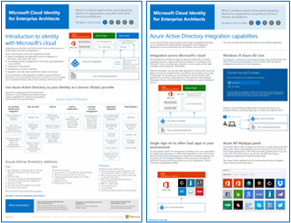
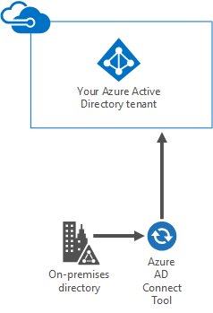
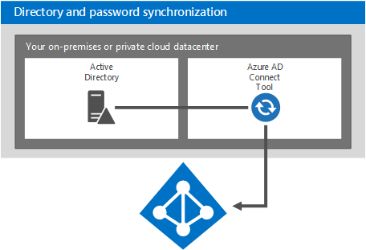
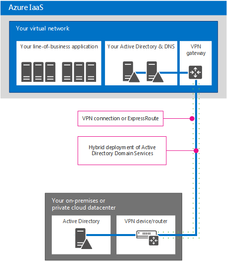

# Identidad de nube de Microsoft para arquitectos de empresa

 **Resumen:** diseñar la solución de identidad para plataformas y servicios en la nube de Microsoft.
  
En este artículo se describe lo que los arquitectos de TI necesitan saber sobre el diseño de la identidad para las organizaciones que usan plataformas y servicios en la nube de Microsoft. También puede ver este artículo como un póster de cinco páginas e imprimirlo en formato tabloide (también conocido como doble carta, 11 x 17 o A3).
  

  
[PDF](https://go.microsoft.com/fwlink/p/?LinkId=524586) |[Visio](https://download.microsoft.com/download/2/3/8/238228E6-9017-4F6C-BD3C-5559E6708F82/MSFT_cloud_architecture_identity.vsd) |[Más idiomas](https://www.microsoft.com/download/details.aspx?id=54431)
  
También puede ver todos los modelos en los [Recursos de arquitectura de TI de la nube de Microsoft](microsoft-cloud-it-architecture-resources.md) y consultar el[Mapa de ruta de Enterprise Cloud de Microsoft: Recursos para los responsables de la toma de decisiones de TI](https://aka.ms/cloudarchitecture).
  
> [!NOTE]
> En este artículo se refleja la versión de enero de 2016 del póster de la **Identidad de nube de Microsoft para arquitectos de empresa**. No contiene los cambios de la versión de abril de 2016. 
  
## Diseño de la identidad para la nube de Microsoft

La integración de las identidades con la nube de Microsoft proporciona acceso a una amplia gama de servicios y opciones de plataforma en la nube. Existen dos opciones principales:
  
- Puede realizar la integración con Microsoft Azure Active Directory (AD). Esto implica la sincronización de las cuentas locales con Azure AD, el proveedor de identidades para la nube de Microsoft.
    
- Puede ampliar su entorno de Servicios de dominio de Active Directory (AD DS) local para las máquinas virtuales que se ejecutan en servicios de infraestructura de Microsoft Azure.
    

  
 **Figura 1: Opciones para diseñar las identidades en la nube**
  
La figura 1 muestra que Azure AD es el proveedor de identidades de los servicios de software como servicio (SaaS) de Microsoft y de las aplicaciones de plataforma como servicio (PaaS) de Azure, y que las aplicaciones de línea de negocio pueden usar AD DS local. 
  
### Azure Active Directory

Microsoft Azure AD es el servicio de administración de acceso e identidades hospedado en la nube de Microsoft. Es el elemento central de las plataformas y los servicios en la nube de Microsoft. La integración con Azure AD proporciona acceso a todos los servicios SaaS de Microsoft usando su conjunto actual de cuentas y contraseñas. Dicha integración también proporciona una identidad basada en la nube para las aplicaciones PaaS de Azure. 
  
> [!NOTE]
> Azure AD no evita tener que usar AD DS local para las organizaciones empresariales o para las máquinas virtuales basadas en Windows que se ejecutan en la infraestructura como servicio (IaaS) de Azure. 
  
Hay tres ediciones de Azure AD: Gratuita, Basic y Premium. 
  
||||
|:-----|:-----|:-----|
|**Gratuita**   |**Basic**   |**Premium**   |
| Administrar cuentas de usuario    Sincronizar con directorios locales    Inicio de sesión único en Azure, Office 365 y miles de aplicaciones SaaS populares, como Salesforce, Workday, Concur, DocuSign, Google Apps, Box, ServiceNow, Dropbox y muchas más   | Incluye todas las capacidades de la edición gratuita, así como:    Personalización de marca de la empresa    Acceso a aplicaciones basadas en grupos    Restablecimiento de contraseñas de autoservicio    SLA empresarial del 99,9 %   | Incluye todas las características de las ediciones gratuita y Basic, así como:    Administración de grupos de autoservicio    Alertas e informes de seguridad avanzada    Autenticación multifactor    Restablecimiento de contraseña con reescritura en AD DS local    Sincronización bidireccional de herramientas de Azure AD Connect    Proxy de aplicación de Azure AD    Microsoft Forefront Identity Manager (MIM)   |
   
Para obtener más información sobre las versiones, consulte [Ediciones de Azure Active Directory ](https://go.microsoft.com/fwlink/p/?LinkId=524280).
  
### Opción 1: Integración con Azure Active Directory

La mayoría de las organizaciones sincronizan un conjunto estándar de objetos y atributos con el inquilino de Azure AD. La herramienta de Azure AD Connect sincroniza las cuentas entre AD DS local y un inquilino de Azure AD.
  

  
 **Figura 2: Integración con Azure AD**
  
La figura 2 muestra la manera en que la herramienta de Azure AD Connect obtiene los cambios en AD DS y los envía al inquilino de Azure AD. En este caso, el inquilino de Azure AD es un duplicado hospedado en la nube del contenido esencial del directorio local.
  
Muchas organizaciones usan AD DS como proveedor de identidades local. Puede usar otro tipo de proveedor de identidades local (por ejemplo, uno que use LDAP) y sincronizarlas con Azure AD.
  
### Opción 2: Ampliación de AD DS a Azure

La ampliación de AD DS a máquinas virtuales que se ejecutan en servicios de infraestructura de Azure admite un conjunto de soluciones y aplicaciones diferente del que admite la sincronización con Azure AD. A continuación se indican dos:
  
- Admite soluciones basadas en la nube que requieren la autenticación NTLM o Kerberos, o máquinas virtuales unidas a un dominio de AD DS.
    
- Agrega la posibilidad de integración adicional para aplicaciones y servicios en la nube a través de plataformas y servicios en la nube de Microsoft.
    

  
 **Figura 3: Ampliación de AD DS a Azure**
  
La figura 3 muestra un controlador de dominio de AD DS conectado a una red virtual de Azure mediante un dispositivo VPN local y una puerta de enlace de VPN de Azure. La red virtual de Azure contiene servidores para una aplicación de línea de negocio y su propio conjunto de controladores de dominio de AD DS.
  
### Más información

- [Sincronizar el directorio con Office 365 es fácil](https://go.microsoft.com/fwlink/p/?LinkId=524281)
    
- [Infografía: Administración de acceso e identidades en la nube](https://go.microsoft.com/fwlink/p/?LinkId=524282)
    
- [Azure Active Directory](https://go.microsoft.com/fwlink/p/?LinkId=524283)
    
## Integración de las cuentas de AD DS local con Microsoft Azure AD

Al sincronizar las cuentas de AD DS local con Azure AD, los usuarios pueden usar sus cuentas de AD DS local para acceder a:
  
- Todos los servicios SaaS de Microsoft (Office 365, Microsoft Intune y Dynamics CRM Online)
    
- Las aplicaciones que se ejecutan en PaaS de Azure
    
Hay dos maneras de configurar esta integración:
  
- Sincronización de directorio y contraseña
    
- Federación e inicio de sesión único
    
Comience con la opción más sencilla que satisfaga sus necesidades. Puede alternar entre estas opciones, si es necesario.
  
> [!NOTE]
> No se recomienda el uso de cuentas solo en la nube (es decir, no realizar la integración con AD DS local) para organizaciones de escala empresarial. 
  
### Sincronización de directorio y contraseña

Esta es la opción más sencilla y solo requiere un servidor que ejecute la herramienta de Azure AD Connect. 
  

  
 **Figura 4: Configuración de sincronización de directorio y contraseña**
  
La figura 4 muestra un centro de datos en la nube privado o local con un controlador de dominio de AD DS. Un servidor que ejecuta la herramienta de Azure AD Connect sincroniza la lista de nombres de cuenta con Azure AD.
  
Con esta opción:
  
- Las cuentas de usuario se sincronizan de AD DS local (u otro proveedor de identidades) con el inquilino de Azure AD. El directorio local sigue siendo el origen de autoridad de las cuentas y todos los cambios en las cuentas se administran desde allí.
    
- Azure AD lleva a cabo la autenticación de los servicios basados en SaaS de Microsoft y las aplicaciones PaaS de Azure.
    
- También puede configurar la sincronización de varios bosques de AD DS.
    
Con la sincronización de contraseñas:
  
- Se pide a los usuarios que escriban una contraseña al acceder a los servicios en la nube, que es la misma contraseña que usan para los recursos locales.
    
- Las contraseñas de usuario nunca se envían como texto no cifrado a Azure AD. En su lugar, se usa un hash de la contraseña. Es criptográficamente imposible descifrar el hash de la contraseña o usar técnicas de ingeniería inversa para obtener la contraseña como texto no cifrado. 
    
Con la autenticación multifactor (MFA):
  
- Puede aprovechar las características básicas de MFA que se ofrecen con Office 365.
    
- Los desarrolladores de aplicaciones PaaS de Azure pueden aprovechar el servicio de autenticación multifactor de Azure.
    
La sincronización de directorios no proporciona integración con soluciones MFA locales.
  
### Federación e inicio de sesión único

Esta opción requiere una infraestructura y servidores adicionales. 
  

  
 **Figura 5: Servidores necesarios para la autenticación federada**
  
La figura 5 muestra el conjunto de componentes para la autenticación federada. Azure AD se pone en contacto con un proxy de aplicación web, el cual reenvía la solicitud de autenticación a un servidor de Servicios de federación de Active Directory (AD FS) que, a su vez, reenvía la solicitud a un controlador de dominio de AD DS para la evaluación y la respuesta. Un servidor que ejecuta la herramienta de Azure AD Connect sincroniza la lista de nombres de cuenta de AD DS con Azure AD.
  
La federación ofrece las siguientes capacidades empresariales adicionales:
  
- Todas las solicitudes de autenticación enviadas a Azure AD se reenvían y se llevan a cabo con el proveedor de identidades local a través de AD FS.
    
- Funciona con proveedores de identidades que no son de Microsoft.
    
- La sincronización del hash de contraseña puede actuar como copia de seguridad de inicio de sesión para el inicio de sesión federado (por ejemplo, si se produce un error en la autenticación federada).
    
Use la federación si:
  
- Se requiere el inicio de sesión único. Con el inicio de sesión único, no se les pide a los usuarios que especifiquen las credenciales (nombre de usuario o contraseña) al acceder a un servicio en la nube.
    
- Ya se ha implementado AD FS.
    
- Usa un proveedor de identidades de terceros.
    
- Usa Forefront Identity Manager 2010 R2 (no admite la sincronización de hash de contraseña).
    
- Tiene una tarjeta inteligente integrada local u otra solución MFA.
    
- Requiere la auditoría de inicio de sesión o la deshabilitación de cuentas.
    
- Su organización requiere restricciones en el inicio de sesión de cliente en función de la ubicación de red o las horas laborables.
    
- Debe cumplir los Estándares federales de procesamiento de información (FIPS).
    
La autenticación federada requiere una mayor inversión en la infraestructura local.
  
- Los servidores locales deben ser accesibles desde Internet a través de un firewall corporativo. Microsoft recomienda el uso de servidores proxy de aplicación web implementados en la red perimetral.
    
- Requiere hardware, licencias y operaciones para servidores de AD FS, servidores proxy de AD FS o servidores proxy de aplicación web, firewalls y equilibradores de carga. 
    
- La disponibilidad y el rendimiento son importantes para garantizar que los usuarios puedan acceder a Office 365 y otras aplicaciones en la nube.
    
### Más información

- [Sincronizar el directorio con Office 365 es fácil](https://go.microsoft.com/fwlink/p/?LinkId=524281)
    
- [Preparar el aprovisionamiento de usuarios a Office 365 mediante la sincronización de directorios](https://go.microsoft.com/fwlink/p/?LinkId=524284)
    
- [Autenticación multifactor para Office 365](https://go.microsoft.com/fwlink/p/?LinkID=392012)
    
- [Autenticación multifactor de Azure](https://go.microsoft.com/fwlink/p/?LinkId=524285)
    
- [TechEd 2014: Integración de directorios: Crear un directorio con Active Directory y Azure Active Directory](https://go.microsoft.com/fwlink/p/?LinkId=524286)
    
## Ampliación de AD DS a Azure

La ampliación de AD DS a Azure es el primer paso para admitir aplicaciones de línea de negocio que se ejecutan en máquinas virtuales en servicios de infraestructura de Azure, lo que proporciona:
  
- Compatibilidad con soluciones basadas en la nube que requieren la autenticación NTLM o Kerberos, o máquinas virtuales unidas a un dominio de AD DS.
    
- Posibilidad de integración adicional para aplicaciones y servicios en la nube, que se pueden agregar en cualquier momento.
    

  
 **Figura 6: Ampliación de AD DS a una red virtual de Azure**
  
La figura 6 muestra un centro de datos en la nube privado o local con AD DS conectado a una red virtual de Azure con una conexión de sitio a sitio VPN o ExpressRoute. La red virtual de Azure contiene servidores para una aplicación de línea de negocio y su propio conjunto de controladores de dominio de AD DS. Esta configuración es una implementación híbrida de AD DS local y en servicios de infraestructura de Azure. Requiere lo siguiente:
  
- Una red virtual de Azure.
    
- Una conexión entre un dispositivo de red privada virtual (VPN) o enrutador local y una puerta de enlace de VPN de Azure.
    
- El uso de una parte del espacio local de direcciones IP para las máquinas virtuales de la red virtual.
    
- La implementación de uno o más controladores de dominio en la red virtual designados como servidores de catálogo global (lo que reduce el tráfico de salida en la conexión VPN).
    
Esta arquitectura de identidad admite un conjunto de soluciones y aplicaciones diferente del que admite la sincronización con Azure AD.
  
### Opciones de conexión de local a Azure

Para conectar su red local a una red virtual de Azure, puede usar lo siguiente:
  
- Una conexión VPN de sitio a sitio, que puede conectar entre 1 y 10 sitios (incluidas otras redes virtuales de Azure) a una sola red virtual de Azure.
    
- ExpressRoute, un vínculo WAN seguro y privado a Azure a través de un proveedor de servicios de red y centro de datos asociado. Las conexiones ExpressRoute pueden ofrecer una mayor confiabilidad, un mayor ancho de banda y latencias menores.
    
### Más información

- [Acerca de la conectividad segura entre locales de redes virtuales](https://go.microsoft.com/fwlink/p/?LinkId=524293)
    
- [Información técnica de ExpressRoute](https://go.microsoft.com/fwlink/?LinkID=392081)
    
- [Directrices para implementar Windows Server Active Directory en máquinas virtuales de Azure](https://go.microsoft.com/fwlink/p/?LinkId=524295)
    
## Integración de sus aplicaciones con identidades de nube

Al diseñar y desarrollar aplicaciones que se ejecutan en la nube, debe fijarse como objetivo la coherencia de la experiencia del usuario en el proceso de autenticación, incluido el conjunto de credenciales necesarias. Por ejemplo, si usa credenciales de Windows, tanto en Azure AD como en AD DS ampliado, asegúrese de que los usuarios pueden autenticarse y centrarse en sus tareas rápidamente.
  

  
 **Figura 7: Integración de sus aplicaciones con identidades de nube**
  
La figura 7 muestra tres opciones para integrar la aplicación con identidades de nube.
  
1. Registre las aplicaciones hospedadas en la nube con Azure AD.
    
    Consulte el artículo de MSDN [Integración de aplicaciones con Azure Active Directory](https://go.microsoft.com/fwlink/p/?LinkId=524303). Esto le permite usar Azure AD para autenticar el acceso a la aplicación PaaS, así como permitir que los usuarios o los administradores concedan derechos a la aplicación para que acceda a contenido en su nombre desde otros servicios en la nube, como Office 365. Encontrará más detalles y ejemplos de código en el artículo de MSDN [Escenarios de autenticación para Azure Active Directory](https://go.microsoft.com/fwlink/p/?LinkId=524304). 
    
2. Las aplicaciones que requieren autenticación mediante programación para acceder a una aplicación protegida por AD SD, AD FS en Windows Server 2012 R2 o Azure AD pueden usar:
    
  - La [API de Graph de Azure AD](https://go.microsoft.com/fwlink/p/?LinkId=524305)
    
  - [Biblioteca de autenticación de Active Directory (ADAL)](https://go.microsoft.com/fwlink/p/?LinkID=524297)
    
    La API de Graph de Azure AD admite OAuth y OpenID Connect. También funciona con aplicaciones PaaS.
    
3. Configure las aplicaciones locales o las aplicaciones de línea de negocio que se ejecutan en máquinas virtuales en una red virtual de Azure de modo que usen directamente la autenticación de Windows (NTLM o Kerberos). Esta es la mejor experiencia para los usuarios y requiere una configuración mínima para los desarrolladores de aplicaciones de servidor.
    
### Ejemplo de integración de aplicaciones

Una organización crea una aplicación ASP.NET que expone un punto de conexión REST donde otras aplicaciones pueden obtener los datos de ventas más recientes. El acceso a ese punto de conexión REST está protegido con Azure AD. Las aplicaciones deben proporcionar credenciales que puedan ser autenticadas por Azure AD antes de que la aplicación ASP.NET envíe los datos solicitados. A continuación, otros desarrolladores de la organización pueden escribir sus propias aplicaciones que usen los datos de ventas del punto de conexión REST.
  
Para autenticarse en Azure AD y recuperar datos, ADAL administra el proceso de autenticación del usuario y entrega el token de acceso a la aplicación para que pueda usarse para acceder a los datos de ventas. ADAL elimina gran parte de la complejidad que conlleva la obtención y el análisis de tokens, flujos de OAuth y otros elementos. ADAL es otra solución de tecnología que está cambiando rápidamente, por lo que los desarrolladores deben buscar la versión más reciente en NuGet.
  
## Implementar componentes de directorio en Azure

Puede implementar componentes de directorio, como servidores para la sincronización de contraseñas o la autenticación federada, en una red virtual de Azure en lugar de un centro de datos local. Tenga en cuenta sus ventajas, especialmente si piensa ampliar AD DS en Azure.
  
Estos son los componentes de directorio que se pueden poner en una red virtual de Azure:
  
- Herramienta de Azure AD Connect
    
- Componentes de autenticación federada
    
- Entorno de AD DS independiente
    
### Herramienta de AD Connect

La herramienta de Azure AD Connect se puede hospedar en la nube en una red virtual de Azure. Tenga en cuenta las ventajas de implementar esta carga de trabajo en Azure:
  
- Aprovisionamiento potencialmente más rápido y menor costo de las operaciones
    
- Mayor disponibilidad
    

  
 **Figura 8: La herramienta de AD Connect en ejecución en Azure**
  
La figura 8 muestra la herramienta de AD Connect en ejecución en una máquina virtual en una red virtual de Azure, que consulta un controlador de dominio de AD DS local para conocer los cambios en una cuenta y los envía a Office 365. Esta solución funciona con:
  
- Servicios de Office 365.
    
- Aplicaciones PaaS de Azure que están disponibles a través de Internet.
    
- Aplicaciones de línea de negocio en Azure que están disponibles en entornos locales a través de la conexión ExpressRoute o VPN de sitio a sitio.
    
Para obtener más información, consulte [Integración de las identidades locales con Azure Active Directory](https://go.microsoft.com/fwlink/p/?LinkId=524307).
  
### Infraestructura de autenticación federada

Si todavía no ha implementado AD FS local, tenga en cuenta las ventajas de implementar esta carga de trabajo en Azure:
  
- Proporciona autonomía para la autenticación en servicios en la nube (sin dependencias locales)
    
- Reduce los servidores y las herramientas hospedados localmente
    
- Usa una puerta de enlace de VPN de sitio a sitio en un clúster de conmutación por error de dos nodos para conectarse a Azure (nuevo)
    
- Usa ACL para asegurarse de que los servidores proxy de aplicación web solo pueden comunicarse con AD FS, no con controladores de dominio u otros servidores directamente
    

  
 **Figura 9: Implementación de la infraestructura de autenticación federada en Azure**
  
La figura 9 muestra un conjunto de controladores de dominio locales que replican información de AD DS con un conjunto de controladores de dominio en una red virtual de Azure. La herramienta de Azure AD Connect que se ejecuta en un servidor en la red virtual de Azure consulta los controladores de dominio locales para saber qué cambios se han producido y los envía a Azure AD. Las solicitudes de autenticación que entran en Azure AD desde servicios SaaS de Microsoft, aplicaciones PaaS de Azure y otras aplicaciones en la nube se reenvían a un equilibrador de carga externo, el cual reenvía la solicitud a un conjunto de servidores proxy de aplicación web. Los servidores proxy de aplicación web reenvían la solicitud a un equilibrador de carga interno, que reenvía la solicitud a un conjunto de servidores de AD FS. A continuación, los servidores de AD FS reenvían la solicitud a un controlador de dominio para validar las credenciales de envío.
  
 Esta solución funciona con:
  
- Aplicaciones que requieren Kerberos
    
- Todos los servicios SaaS de Microsoft
    
- Aplicaciones de Azure accesibles desde Internet
    
- Aplicaciones de IaaS o PaaS de Azure que requieren la autenticación con el conjunto de cuentas de AD DS de su organización
    
Para obtener más información, consulte [Integración de las identidades locales con Azure Active Directory](https://go.microsoft.com/fwlink/p/?LinkId=524307).
  
### Entorno de AD DS independiente en una red virtual de Azure

No siempre es necesario integrar una aplicación en la nube con el entorno local. Por ejemplo, un dominio de AD DS independiente en una red virtual de Azure admite aplicaciones de acceso público, como sitios de Internet.
  

  
 **Figura 10: Un entorno de AD DS independiente para una aplicación basada en servidor**
  
La figura 10 muestra una red virtual Azure que hospeda un conjunto de servidores de AD DS, que ofrecen servicios de AD DS y DNS, con un conjunto de servidores que hospedan una aplicación. Esta solución funciona con:
  
- Aplicaciones y sitios web accesibles desde Internet
    
- Aplicaciones que requieren autenticación NTLM o Kerberos
    
- Aplicaciones que se ejecutan en servidores basados en Windows que requieren AD DS
    
Para obtener más información, consulte [Integración de las identidades locales con Azure Active Directory](https://go.microsoft.com/fwlink/p/?LinkId=524307).
  
## See Also

#### 

[Recursos de arquitectura de TI de la nube de Microsoft](microsoft-cloud-it-architecture-resources.md)
#### 

[Mapa de ruta de Enterprise Cloud de Microsoft: Recursos para los responsables de decisiones de TI](https://sway.com/FJ2xsyWtkJc2taRD)

