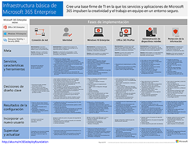
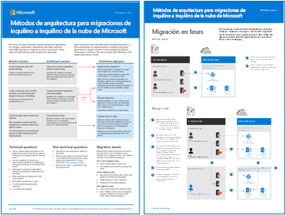
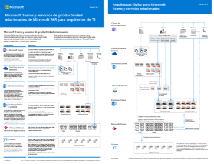
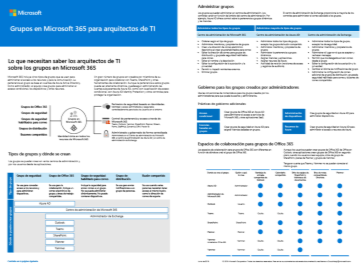
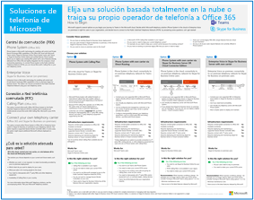

# Recursos de arquitectura de TI de la nube de MicrosoftMicrosoft cloud IT architecture resources

 **Resumen:** Conozca los conceptos básicos de la arquitectura de la nube para identidades, seguridad, redes e híbridos de Microsoft.**Summary:** Learn core cloud architecture concepts for Microsoft identity, security, networking, and hybrid. Revise las recomendaciones preceptivas para proteger archivos, identidades y dispositivos cuando se usa la nube de Microsoft.Review prescriptive recommendations for protecting files, identities, and devices when using Microsoft's cloud.
  
These architecture tools and posters give you information about Microsoft cloud services, including Office 365, Windows 10, Azure Active Directory, Microsoft Intune, Microsoft Dynamics 365, and hybrid on-premises and cloud solutions.These architecture tools and posters give you information about Microsoft cloud services, including Office 365, Windows 10, Azure Active Directory, Microsoft Intune, Microsoft Dynamics 365, and hybrid on-premises and cloud solutions. IT decision makers and architects can use these resources to determine the ideal solutions for their workloads and to make decisions about core infrastructure components such as identity and security.IT decision makers and architects can use these resources to determine the ideal solutions for their workloads and to make decisions about core infrastructure components such as identity and security. 
  
<!--**[Microsoft's Enterprise Cloud Roadmap](microsoft-cloud-it-architecture-resources.md#roadmap)** (Sway) -->
    
- **[Serie de la nube de Microsoft para arquitectos empresariales](microsoft-cloud-it-architecture-resources.md#cloudarch)** 
    **[Microsoft cloud for enterprise architects series](microsoft-cloud-it-architecture-resources.md#cloudarch)** 
  <!-- [Microsoft Cloud Services and Platform Options](microsoft-cloud-it-architecture-resources.md#platformoptions) -->
    - [Identidad de la nube de Microsoft para arquitectos empresarialesMicrosoft cloud identity for enterprise architects](microsoft-cloud-it-architecture-resources.md#identity)
    - [Seguridad de la nube de Microsoft para arquitectos empresarialesMicrosoft cloud security for enterprise architects](microsoft-cloud-it-architecture-resources.md#security)
    - [Redes de la nube de Microsoft para arquitectos empresarialesMicrosoft cloud networking for enterprise architects](microsoft-cloud-it-architecture-resources.md#networking)
    - [Nube híbrida de Microsoft para arquitectos empresarialesMicrosoft hybrid cloud for enterprise architects](microsoft-cloud-it-architecture-resources.md#hybrid)
    - [Ataques comunes y funcionalidades de Microsoft que protegen su organizaciónCommon attacks and Microsoft capabilities that protect your organization](#common-attacks-and-microsoft-capabilities-that-protect-your-organization)
    - [Infraestructura básica de Microsoft 365 EnterpriseMicrosoft 365 Enterprise Foundation Infrastructure](#m365foundationinfra)
    - [Métodos de arquitectura para migraciones de inquilino a inquilino de la nube de MicrosoftArchitecture approaches for Microsoft cloud tenant-to-tenant migrations](#architecture-approaches-for-microsoft-cloud-tenant-to-tenant-migrations)
    
- **[Serie de soluciones de Microsoft 365 Enterprise](microsoft-cloud-it-architecture-resources.md#BKMK_o365solutions)**:**[Microsoft 365 enterprise solution series](microsoft-cloud-it-architecture-resources.md#BKMK_o365solutions)**:
    - [Microsoft Teams y servicios de productividad relacionados de Microsoft 365 para arquitectos de TIMicrosoft Teams and related productivity services in Microsoft 365 for IT architects](#microsoft-teams-and-related-productivity-services-in-microsoft-365-for-it-architects)
    - [Grupos en Microsoft 365 para arquitectos de TIGroups in Microsoft 365 for IT architects](#groups-in-microsoft-365-for-it-architects)
    - [Seguridad y protección de la información para organizaciones de varias regionesSecurity and Information Protection for Multi-Region Organizations](#security-and-information-protection-for-multi-region-organizations)
    - [Protección de identidades y dispositivos para Office 365Identity and device protection for Office 365](microsoft-cloud-it-architecture-resources.md#BKMK_O365IDP)
    - [Soluciones de protección de archivos en Office 365File protection solutions in Office 365](microsoft-cloud-it-architecture-resources.md#BKMK_O365fileprotect)
    - [Information Protection de Office 365 para RGPDOffice 365 Information Protection for GDPR](#office-365-information-protection-for-gdpr)
    - [Instrucciones de seguridad de Microsoft para campañas políticas, organizaciones sin ánimo de lucro y otras organizaciones ágilesMicrosoft Security Guidance for Political Campaigns, Nonprofits, and Other Agile Organizations](#microsoft-security-guidance-for-political-campaigns-nonprofits-and-other-agile-organizations)
    - [Soluciones de telefonía de MicrosoftMicrosoft Telephony Solutions](#microsoft-telephony-solutions) 
    
Let us know what you think!Let us know what you think! Send us email at [cloudadopt@microsoft.com](mailto:cloudadopt@microsoft.com).Send us email at [cloudadopt@microsoft.com](mailto:cloudadopt@microsoft.com). 

<!--

## Microsoft's Enterprise Cloud Roadmap

See the posters, icon sets, community venues, and other resources that describe the industry's most complete cloud solution.
  
|**Item**|**Description**|
|:-----|:-----|
|[          ](https://aka.ms/cloudarchitecture)   [Microsoft's Enterprise Cloud Roadmap](https://aka.ms/cloudarchitecture) (https://aka.ms/cloudarchitecture)   |Swipe through this Sway experience for the resources that describe the industry's most complete cloud solution.    |
-->
  

## Serie de la nube de Microsoft para arquitectos empresariales## Microsoft cloud for enterprise architects series

These cloud architecture posters give you information about Microsoft cloud services, including Office 365, Azure Active Directory, Microsoft Intune, Microsoft Dynamics CRM Online, and hybrid on-premises and cloud solutions.These cloud architecture posters give you information about Microsoft cloud services, including Office 365, Azure Active Directory, Microsoft Intune, Microsoft Dynamics CRM Online, and hybrid on-premises and cloud solutions. IT decision makers and architects can use these resources to determine the ideal solutions for their workloads and to make decisions about core infrastructure components such as identity and security.IT decision makers and architects can use these resources to determine the ideal solutions for their workloads and to make decisions about core infrastructure components such as identity and security.

<!--  

### Microsoft Cloud Services and Platform Options

Learn key differences between Microsoft cloud services and platform offerings. Find the best fit for your solution.
  
|**Item**|**Description**|
|:-----|:-----|
|[          ](https://www.microsoft.com/download/details.aspx?id=54432)   [PDF](https://go.microsoft.com/fwlink/p/?LinkId=524731)  \| [Visio](https://go.microsoft.com/fwlink/p/?LinkId=524732)  \| [More languages](https://www.microsoft.com/download/details.aspx?id=54432)   | This model describes: <ul><li>  Software as a Service (SaaS) offerings, including Office 365 </li><li>  Platform as a Service (PaaS) features in Microsoft Azure </li><li>  Infrastructure as a Service (IaaS) features in Microsoft Azure </li><li>  Private cloud datacenter capabilities using Windows Server and System Center </li><li>  Learn how Microsoft's own IT department is migrating to these cloud services and building its hybrid cloud. </li></ul> |
-->

   

### Identidad de nube de Microsoft para arquitectos profesionales### Microsoft cloud identity for enterprise architects

Lo que los arquitectos de TI necesitan saber sobre el diseño de la identidad para las organizaciones que usan plataformas y servicios en la nube de Microsoft.What IT architects need to know about designing identity for organizations using Microsoft cloud services and platforms.
  
|**Elemento****Item**|**Descripción****Description**|
|:-----|:-----|
|[          ](https://www.microsoft.com/download/details.aspx?id=54431)[          ](https://www.microsoft.com/download/details.aspx?id=54431)   [PDF](https://go.microsoft.com/fwlink/p/?LinkId=524586)  \| [Visio](https://download.microsoft.com/download/2/3/8/238228E6-9017-4F6C-BD3C-5559E6708F82/MSFT_cloud_architecture_identity.vsd)           \| [Más idiomas](https://www.microsoft.com/download/details.aspx?id=54431)[PDF](https://go.microsoft.com/fwlink/p/?LinkId=524586)  \| [Visio](https://download.microsoft.com/download/2/3/8/238228E6-9017-4F6C-BD3C-5559E6708F82/MSFT_cloud_architecture_identity.vsd)           \| [More languages](https://www.microsoft.com/download/details.aspx?id=54431)   | Este modelo contiene lo siguiente:This model contains: <ul><li>Introducción a la identidad con la nube de MicrosoftIntroduction to identity with Microsoft's cloud </li><li>Capacidades de IDaaS de Azure ADAzure AD IDaaS capabilities </li><li>Integración de cuentas locales de Active Directory Domain Services con Microsoft Azure Active DirectoryIntegrating on-premises Active Directory Domain Services accounts with Microsoft Azure Active Directory </li><li>Colocación de componentes de directorio en AzurePutting directory components in Azure </li><li>Opciones de servicios de dominio para cargas de trabajo en IaaS de AzureDomain services options for workloads in Azure IaaS </li></ul> |
   

### Seguridad de nube de Microsoft para arquitectos empresarialesMicrosoft cloud security for enterprise architects

Lo que los arquitectos de TI necesitan saber sobre la seguridad en las plataformas y los servicios en la nube de Microsoft.What IT architects need to know about security in Microsoft cloud services and platforms.
  
|**Elemento****Item**|**Descripción****Description**|
|:-----|:-----|
|[          ](https://www.microsoft.com/download/details.aspx?id=48121)[          ](https://www.microsoft.com/download/details.aspx?id=48121)   [PDF](https://go.microsoft.com/fwlink/p/?linkid=842070)  \| [Visio](https://go.microsoft.com/fwlink/p/?LinkId=842071)  \| [Más idiomas](https://www.microsoft.com/download/details.aspx?id=48121)[PDF](https://go.microsoft.com/fwlink/p/?linkid=842070)  \| [Visio](https://go.microsoft.com/fwlink/p/?LinkId=842071)  \| [More languages](https://www.microsoft.com/download/details.aspx?id=48121)   | Este modelo contiene lo siguiente:This model contains: <ul><li>Rol de Microsoft a la hora de proporcionar servicios y plataformas segurosMicrosoft's role in providing secure services and platforms</li><li>Responsabilidades del cliente para mitigar los riesgos de seguridadCustomer responsibilities to mitigate security risks</li><li>Principales certificaciones de seguridadTop security certifications </li><li>Ofertas de seguridad proporcionadas por los servicios de consultoría de MicrosoftSecurity offerings provided by Microsoft consulting services </ul> |
   

### Redes de nube de Microsoft para arquitectos empresarialesMicrosoft cloud networking for enterprise architects

Lo que los arquitectos de TI necesitan saber sobre las redes para las plataformas y los servicios en la nube de Microsoft.What IT architects need to know about networking for Microsoft cloud services and platforms.
  
|**Elemento****Item**|**Descripción****Description**|
|:-----|:-----|
|   [PDF](media/Network-Poster/MSFT_cloud_architecture_networking.pdf)  \| [Visio](https://github.com/MicrosoftDocs/OfficeDocs-Enterprise/raw/live/Enterprise/media/Network-Poster/MSFT_cloud_architecture_networking.vsdx)[PDF](media/Network-Poster/MSFT_cloud_architecture_networking.pdf)  \| [Visio](https://github.com/MicrosoftDocs/OfficeDocs-Enterprise/raw/live/Enterprise/media/Network-Poster/MSFT_cloud_architecture_networking.vsdx)   | Este modelo contiene lo siguiente:This model contains: <ul><li> Adaptación de la red para la conectividad en la nubeEvolving your network for cloud connectivity </li><li> Elementos comunes de la conectividad en la nube de MicrosoftCommon elements of Microsoft cloud connectivity </li><li> ExpressRoute para la conectividad en la nube de MicrosoftExpressRoute for Microsoft cloud connectivity </li><li> Diseño de redes para SaaS de Microsoft, IaaS de Azure y PaaS de Azure Designing networking for Microsoft SaaS, Azure PaaS, and  Azure IaaS </li></ul>    |

### Nube híbrida de Microsoft para arquitectos empresarialesMicrosoft hybrid cloud for enterprise architects

Lo que los arquitectos de TI necesitan saber sobre la nube híbrida para las plataformas y los servicios Microsoft.What IT architects need to know about hybrid cloud for Microsoft services and platforms.
  
|**Elemento****Item**|**Descripción****Description**|
|:-----|:-----|
|   [PDF](media/Hybrid-Poster/MSFT_cloud_architecture_hybrid.pdf)  \| [Visio](https://github.com/MicrosoftDocs/OfficeDocs-Enterprise/raw/live/Enterprise/media/Hybrid-Poster/MSFT_cloud_architecture_hybrid.vsdx)[PDF](media/Hybrid-Poster/MSFT_cloud_architecture_hybrid.pdf)  \| [Visio](https://github.com/MicrosoftDocs/OfficeDocs-Enterprise/raw/live/Enterprise/media/Hybrid-Poster/MSFT_cloud_architecture_hybrid.vsdx)  | Este modelo contiene lo siguiente:This model contains: <ul><li> Ofertas de la nube de Microsoft (SaaS, IaaS de Azure y PaaS de Azure) y sus elementos comunes.Microsoft's cloud offerings (SaaS, Azure PaaS, and Azure IaaS) and their common elements </li><li> Arquitectura de nube híbrida para las ofertas en la nube de MicrosoftHybrid cloud architecture for Microsoft's cloud offerings </li><li> Escenarios de nube híbrida para SaaS de Microsoft (Office 365), IaaS de Azure y PaaS de AzureHybrid cloud scenarios for Microsoft SaaS (Office 365), Azure PaaS, and Azure IaaS </li></ul> |
   

### Ataques comunes y funcionalidades de Microsoft que protegen su organizaciónCommon attacks and Microsoft capabilities that protect your organization
Obtenga información sobre los ciberataques más comunes y cómo Microsoft puede ser de utilidad a su organización en todas las fases de un ataque.Learn about the most common cyber attacks and how Microsoft can help your organization at every stage of an attack. 

|**Elemento****Item**|**Descripción****Description**|
|:-----|:-----|
|   [PDF](https://download.microsoft.com/download/F/A/C/FACFC1E9-FA35-4DF1-943C-8D4237B4275B/MSFT_Cloud_architecture_security_commonattacks.pdf) \| [Visio](https://download.microsoft.com/download/F/A/C/FACFC1E9-FA35-4DF1-943C-8D4237B4275B/MSFT_Cloud_architecture_security_commonattacks.vsdx)[PDF](https://download.microsoft.com/download/F/A/C/FACFC1E9-FA35-4DF1-943C-8D4237B4275B/MSFT_Cloud_architecture_security_commonattacks.pdf) \| [Visio](https://download.microsoft.com/download/F/A/C/FACFC1E9-FA35-4DF1-943C-8D4237B4275B/MSFT_Cloud_architecture_security_commonattacks.vsdx)   | Este póster ilustra la ruta de acceso de los ataques comunes y en él se describen las funcionalidades que ayudan a detener a los intrusos en cada fase de un ataque.This poster illustrates the path of common attacks and describes which capabilities help stop attackers at each stage of an attack.  |

### Infraestructura básica de Microsoft 365 EnterpriseMicrosoft 365 Enterprise Foundation Infrastructure

Obtenga una vista rápida de la [infraestructura básica](https://docs.microsoft.com/microsoft-365/enterprise/deploy-foundation-infrastructure) de Microsoft 365 Enterprise para comenzar su implementación.Get an at-a-glance view of the [foundation infrastructure](https://docs.microsoft.com/microsoft-365/enterprise/deploy-foundation-infrastructure) for Microsoft 365 Enterprise to begin your deployment.
  
|**Item****Item**|**Descripción****Description**|
|:-----|:-----|
|   [Ver en línea](https://aka.ms/m365efoundinfraposter) \| [PDF](https://github.com/MicrosoftDocs/microsoft-365-docs/raw/public/microsoft-365/media/deploy-foundation-infrastructure/Microsoft365EnterpriseFoundInfra.pdf)[View online](https://aka.ms/m365efoundinfraposter) \| [PDF](https://github.com/MicrosoftDocs/microsoft-365-docs/raw/public/microsoft-365/media/deploy-foundation-infrastructure/Microsoft365EnterpriseFoundInfra.pdf)   | Este póster resume cada fase de la infraestructura básica en términos de objetivos, características y herramientas, decisiones de diseño, resultados de la configuración, incorporación y supervisión y actualizaciones constantes.This poster summarizes each phase of the foundation infrastructure in terms of goals, features and tools, design decisions, configuration results, onboarding, and ongoing monitoring and updates.  | 

### Métodos de arquitectura para migraciones de inquilino a inquilino de la nube de MicrosoftArchitecture approaches for Microsoft cloud tenant-to-tenant migrations 
En esta serie de temas se muestran varios métodos de arquitectura para las fusiones, las adquisiciones, las ventas y otros casos que podrían llevarle a migrar a un nuevo inquilino en la nube.This series of topics illustrates several architecture approaches for mergers, acquisitions, divestitures, and other scenarios that might lead you to migrate to a new cloud tenant. En estos temas se proporciona una guía inicial para la planeación.These topics provide starting-point guidance for planning.

|**Item****Item**|**Descripción****Description**|
|:-----|:-----|
|   [PDF](downloads/Microsoft-365-tenant-to-tenant-migration.pdf) \| [Visio](https://github.com/MicrosoftDocs/OfficeDocs-Enterprise/raw/live/Enterprise/downloads/Microsoft-365-tenant-to-tenant-migration.vsdx)[PDF](downloads/Microsoft-365-tenant-to-tenant-migration.pdf) \| [Visio](https://github.com/MicrosoftDocs/OfficeDocs-Enterprise/raw/live/Enterprise/downloads/Microsoft-365-tenant-to-tenant-migration.vsdx)     |Este modelo contiene lo siguiente:This model contains: <ul><li>Una asignación de escenarios empresariales a métodos arquitectónicosA mapping of business scenarios to architecture approaches</li><li>Consideraciones sobre diseñoDesign considerations</li><li>Flujo de migración de evento únicoSingle event migration flow</li><li>Flujo de migración en fasesPhased migration flow</li><li>Flujo de desplazamiento o división del inquilinoTenant move or split flow</li></ul>|

## Serie de soluciones de Microsoft 365 EnterpriseMicrosoft 365 enterprise solution series

La serie de soluciones empresariales de Microsoft 365 ofrece orientación para implementar funcionalidades de Microsoft 365, sobre todo cuando estas abarcan varias tecnologías.The Microsoft 365 enterprise solution series provides guidance for implementing Microsoft 365 capabilities, especially where capabilities cross technologies.

### Microsoft Teams y servicios de productividad relacionados de Microsoft 365 para arquitectos de TIMicrosoft Teams and related productivity services in Microsoft 365 for IT architects
La arquitectura lógica de los servicios de productividad en Microsoft 365, una de las más destacadas gracias a Microsoft Teams.The logical architecture of productivity services in Microsoft 365, leading with Microsoft Teams.

|**Item****Item**|**Descripción****Description**|
|:-----|:-----|
|   [PDF](downloads/msft-m365-teams-logical-architecture.pdf) \| [Visio](https://github.com/MicrosoftDocs/OfficeDocs-Enterprise/raw/live/Enterprise/downloads/msft-m365-teams-logical-architecture.vsdx)[PDF](downloads/msft-m365-teams-logical-architecture.pdf) \| [Visio](https://github.com/MicrosoftDocs/OfficeDocs-Enterprise/raw/live/Enterprise/downloads/msft-m365-teams-logical-architecture.vsdx)     |Microsoft proporciona un conjunto de servicios de productividad que funcionan en conjunto para proporcionar experiencias de colaboración con funcionalidades de gobierno, seguridad y cumplimiento.Microsoft provides a suite of productivity services that work together to provide collaboration experiences with data governance, security, and compliance capabilities.    Esta serie de ilustraciones proporciona una vista de la arquitectura lógica de los servicios de productividad para arquitectos empresariales, que es una de las más destacadas gracias a Microsoft Teams.This series of illustrations provides a view into the logical architecture of productivity services for enterprise architects, leading with Microsoft Teams.|

### Grupos en Microsoft 365 para arquitectos de TIGroups in Microsoft 365 for IT Architects
Lo que necesitan saber los arquitectos de TI sobre los grupos en Microsoft 365What IT architects need to know about groups in Microsoft 365

|**Item****Item**|**Descripción****Description**|
|:-----|:-----|
|   [PDF](downloads/msft-m365-groups.pdf) \| [Visio](https://github.com/MicrosoftDocs/OfficeDocs-Enterprise/raw/live/Enterprise/downloads/msft-m365-groups.vsdx)[PDF](downloads/msft-m365-groups.pdf) \| [Visio](https://github.com/MicrosoftDocs/OfficeDocs-Enterprise/raw/live/Enterprise/downloads/msft-m365-groups.vsdx) |Estas ilustraciones detallan los diferentes tipos de grupos, cómo se crean y administran, y algunas recomendaciones para el gobierno de estos.These illustrations detail the different types of groups, how these are created and managed, and a few governance recommendations.|

### Seguridad y protección de la información para organizaciones de varias regionesSecurity and Information Protection for Multi-Region Organizations
Seguridad y protección de la información para organizaciones de varias regiones con un único espacio empresarial de Microsoft 365Security and information protection for multi-region organizations with a single microsoft 365 tenant

|**Item****Item**|**Descripción****Description**|
|:-----|:-----|
|   [PDF](https://github.com/MicrosoftDocs/microsoft-365-docs/raw/public/microsoft-365/downloads/msft-security-info-protect-multi-region.pdf) \| [Visio](https://github.com/MicrosoftDocs/microsoft-365-docs/raw/public/microsoft-365/downloads/msft-security-info-protect-multi-region.vsdx)[PDF](https://github.com/MicrosoftDocs/microsoft-365-docs/raw/public/microsoft-365/downloads/msft-security-info-protect-multi-region.pdf) \| [Visio](https://github.com/MicrosoftDocs/microsoft-365-docs/raw/public/microsoft-365/downloads/msft-security-info-protect-multi-region.vsdx) |Usar un único espacio empresarial de Microsoft 365 para su organización global es la mejor opción y experiencia por muchas razones.Using a single Microsoft 365 tenant for your global organization is the best choice and experience for many reasons. Sin embargo, en muchos arquitectos luchan por cómo cumplir los objetivos de protección de la información y seguridad en distintas regiones.However, many architects wrestle with how to meet security and information protection objectives across different regions. Este conjunto de temas contiene recomendaciones.This set of topics provides recommendations. |

   

### Protección de identidades y dispositivos para Office 365Identity and device protection for Office 365

Capacidades recomendadas para la protección de las identidades y los dispositivos que tienen acceso a Office 365, otros servicios de SaaS y aplicaciones locales publicadas con Proxy de la aplicación de Azure AD.Recommended capabilities for protecting identities and devices that access Office 365, other SaaS services, and on-premises applications published with Azure AD Application Proxy.
  
|**Elemento****Item**|**Descripción****Description**|
|:-----|:-----|
|[          ](https://www.microsoft.com/download/details.aspx?id=55032)[          ](https://www.microsoft.com/download/details.aspx?id=55032)   [PDF](https://go.microsoft.com/fwlink/p/?linkid=841656)  \| [Visio](https://go.microsoft.com/fwlink/p/?linkid=841657)  \| [Más idiomas](https://www.microsoft.com/download/details.aspx?id=55032)[PDF](https://go.microsoft.com/fwlink/p/?linkid=841656)  \| [Visio](https://go.microsoft.com/fwlink/p/?linkid=841657)  \| [More languages](https://www.microsoft.com/download/details.aspx?id=55032)   |It's important to use consistent levels of protection across your data, identities, and devices.It's important to use consistent levels of protection across your data, identities, and devices. This document shows you which capabilities are comparable with more information on capabilities to protect identities and devices.This document shows you which capabilities are comparable with more information on capabilities to protect identities and devices.    |
   

### Soluciones de protección de archivos en Office 365File protection solutions in Office 365

Capacidades recomendadas para proteger archivos en Office 365 basándose en tres niveles de confidencialidad diferentes.Recommended capabilities for protecting files in Office 365 based on three different sensitivity levels.
  
|**Elemento****Item**|**Descripción****Description**|
|:-----|:-----|
|[          ](https://www.microsoft.com/download/details.aspx?id=55523)[          ](https://www.microsoft.com/download/details.aspx?id=55523)   [PDF](https://go.microsoft.com/fwlink/?linkid=2004320)  \| [Visio](https://download.microsoft.com/download/7/8/9/789645A5-BD10-4541-BC33-F8D1EFF5E911/MSFT_cloud_architecture_O365%20file%20protection.vsdx)[PDF](https://go.microsoft.com/fwlink/?linkid=2004320)  \| [Visio](https://download.microsoft.com/download/7/8/9/789645A5-BD10-4541-BC33-F8D1EFF5E911/MSFT_cloud_architecture_O365%20file%20protection.vsdx)   |It's important to use consistent levels of protection across your data, identities, and devices.It's important to use consistent levels of protection across your data, identities, and devices. This document shows you which capabilities are comparable with more information on capabilities to protect files in Office 365.This document shows you which capabilities are comparable with more information on capabilities to protect files in Office 365.    |
   

### Information Protection de Office 365 para RGPDOffice 365 Information Protection for GDPR

Prescriptive recommendations for discovering, classifying, protecting, and monitoring personal data.Prescriptive recommendations for discovering, classifying, protecting, and monitoring personal data. This solution uses General Data Protection Regulation (GDPR) as an example, but you can apply the same process to achieve compliance with many other regulations.This solution uses General Data Protection Regulation (GDPR) as an example, but you can apply the same process to achieve compliance with many other regulations.

|**Elemento****Item**|**Descripción****Description**|
|:-----|:-----|
|    [PDF](https://download.microsoft.com/download/E/C/D/ECD5A339-EF10-4420-B3A9-99098884D716/MSFT_Cloud_architecture_information%20protection%20for%20GDPR.pdf) \| [Visio](https://download.microsoft.com/download/E/C/D/ECD5A339-EF10-4420-B3A9-99098884D716/MSFT_Cloud_architecture_information%20protection%20for%20GDPR.vsdx)[PDF](https://download.microsoft.com/download/E/C/D/ECD5A339-EF10-4420-B3A9-99098884D716/MSFT_Cloud_architecture_information%20protection%20for%20GDPR.pdf) \| [Visio](https://download.microsoft.com/download/E/C/D/ECD5A339-EF10-4420-B3A9-99098884D716/MSFT_Cloud_architecture_information%20protection%20for%20GDPR.vsdx)    |Si desea ver este contenido en formato de artículo, haga clic en [Information Protection de Office 365 para RGPD](https://docs.microsoft.com/Office365/SecurityCompliance/office-365-information-protection-for-gdpr).To see this content in article format, see [Office 365 Information Protection for GDPR](https://docs.microsoft.com/Office365/SecurityCompliance/office-365-information-protection-for-gdpr).      |

### Guía de seguridad de Microsoft para campañas políticas, ONG y otras organizaciones ágilesMicrosoft Security Guidance for Political Campaigns, Nonprofits, and Other Agile Organizations 

This guidance describes how to implement a secure cloud environment.This guidance describes how to implement a secure cloud environment. The solution guidance can be used by any organization.The solution guidance can be used by any organization. It includes extra help for agile organizations with BYOD access and guest accounts.It includes extra help for agile organizations with BYOD access and guest accounts. You can use this guidance as a starting-point for designing your own environment.You can use this guidance as a starting-point for designing your own environment.

|**Elemento****Item**|**Descripción****Description**|
|:-----|:-----|
|**Guía de seguridad de Microsoft para campañas políticas****Microsoft Security Guidance for Political Campaigns**   [          ](https://download.microsoft.com/download/B/4/D/B4D520C3-4D0C-4B4D-BFB9-09F0651C2775/MSFT_Cloud_architecture_security%20for%20political%20campaigns.pdf)[          ](https://download.microsoft.com/download/B/4/D/B4D520C3-4D0C-4B4D-BFB9-09F0651C2775/MSFT_Cloud_architecture_security%20for%20political%20campaigns.pdf)   [PDF](https://download.microsoft.com/download/B/4/D/B4D520C3-4D0C-4B4D-BFB9-09F0651C2775/MSFT_Cloud_architecture_security%20for%20political%20campaigns.pdf)  \| [Visio](https://download.microsoft.com/download/B/4/D/B4D520C3-4D0C-4B4D-BFB9-09F0651C2775/MSFT_Cloud_architecture_security%20for%20political%20campaigns.vsdx)[PDF](https://download.microsoft.com/download/B/4/D/B4D520C3-4D0C-4B4D-BFB9-09F0651C2775/MSFT_Cloud_architecture_security%20for%20political%20campaigns.pdf)  \| [Visio](https://download.microsoft.com/download/B/4/D/B4D520C3-4D0C-4B4D-BFB9-09F0651C2775/MSFT_Cloud_architecture_security%20for%20political%20campaigns.vsdx)   |This guidance uses a political campaign organization as an example.This guidance uses a political campaign organization as an example. Use this guidance as a starting point for any environment.Use this guidance as a starting point for any environment.    |
|**Guía de seguridad de Microsoft para ONG****Microsoft Security Guidance for Nonprofits**   [          ](https://download.microsoft.com/download/9/4/3/94389612-C679-4061-8DF2-D9A15D72B65F/Microsoft_Cloud%20Architecture_Security%20for%20Nonprofits.pdf)[          ](https://download.microsoft.com/download/9/4/3/94389612-C679-4061-8DF2-D9A15D72B65F/Microsoft_Cloud%20Architecture_Security%20for%20Nonprofits.pdf)   [PDF](https://download.microsoft.com/download/9/4/3/94389612-C679-4061-8DF2-D9A15D72B65F/Microsoft_Cloud%20Architecture_Security%20for%20Nonprofits.pdf)  \| [Visio](https://download.microsoft.com/download/9/4/3/94389612-C679-4061-8DF2-D9A15D72B65F/Microsoft_Cloud%20Architecture_Security%20for%20Nonprofits.vsdx)[PDF](https://download.microsoft.com/download/9/4/3/94389612-C679-4061-8DF2-D9A15D72B65F/Microsoft_Cloud%20Architecture_Security%20for%20Nonprofits.pdf)  \| [Visio](https://download.microsoft.com/download/9/4/3/94389612-C679-4061-8DF2-D9A15D72B65F/Microsoft_Cloud%20Architecture_Security%20for%20Nonprofits.vsdx)   |This guide is slightly revised for nonprofit organizations.This guide is slightly revised for nonprofit organizations. For example, it references Office 365 Nonprofit plans.For example, it references Office 365 Nonprofit plans. The technical guidance is the same as the political campaign solution guide.The technical guidance is the same as the political campaign solution guide.    |

This guidance includes Test Lab Guides.This guidance includes Test Lab Guides. For more information, see [Microsoft Security Guidance for Political Campaigns, Nonprofits, and Other Agile Organizations](https://docs.microsoft.com/Office365/SecurityCompliance/microsoft-security-guidance-for-political-campaigns-nonprofits-and-other-agile-o).For more information, see [Microsoft Security Guidance for Political Campaigns, Nonprofits, and Other Agile Organizations](https://docs.microsoft.com/Office365/SecurityCompliance/microsoft-security-guidance-for-political-campaigns-nonprofits-and-other-agile-o).

### Soluciones de telefonía de MicrosoftMicrosoft Telephony Solutions

Microsoft supports several options as you begin your journey to Teams in the Microsoft cloud.Microsoft supports several options as you begin your journey to Teams in the Microsoft cloud. This poster helps you decide which Microsoft telephony solution (Phone System in the cloud or Enterprise Voice on-premises) is right for users in your organization, and how your organization can connect to the Public Switched Telephone Network (PSTN).This poster helps you decide which Microsoft telephony solution (Phone System in the cloud or Enterprise Voice on-premises) is right for users in your organization, and how your organization can connect to the Public Switched Telephone Network (PSTN).

  
[PDF](https://github.com/MicrosoftDocs/OfficeDocs-SkypeForBusiness/blob/live/Teams/downloads/telephony-solutions/microsoft-telephony-solutions-12-18.pdf) | [Visio](https://github.com/MicrosoftDocs/OfficeDocs-SkypeForBusiness/blob/live/Teams/downloads/telephony-solutions/microsoft-telephony-solutions-12-18.vsdx)[PDF](https://github.com/MicrosoftDocs/OfficeDocs-SkypeForBusiness/blob/live/Teams/downloads/telephony-solutions/microsoft-telephony-solutions-12-18.pdf) | [Visio](https://github.com/MicrosoftDocs/OfficeDocs-SkypeForBusiness/blob/live/Teams/downloads/telephony-solutions/microsoft-telephony-solutions-12-18.vsdx) 

Para obtener más información, consulte el artículo de este póster: [Soluciones de telefonía de Microsoft](https://docs.microsoft.com/SkypeForBusiness/hybrid/msft-telephony-solutions).For more information, see the article for this poster: [Microsoft Telephony Solutions](https://docs.microsoft.com/SkypeForBusiness/hybrid/msft-telephony-solutions).
  
## Consulta tambiénSee Also

[Modelos de arquitectura para SharePoint, Exchange, Skype Empresarial y LyncArchitectural models for SharePoint, Exchange, Skype for Business, and Lync](architectural-models-for-sharepoint-exchange-skype-for-business-and-lync.md)
  
[Guías de laboratorio para pruebas de Microsoft 365 para empresasMicrosoft 365 for enterprise Test Lab Guides](https://docs.microsoft.com/microsoft-365/enterprise/m365-enterprise-test-lab-guides)
  
[Soluciones híbridasHybrid solutions](hybrid-solutions.md)

